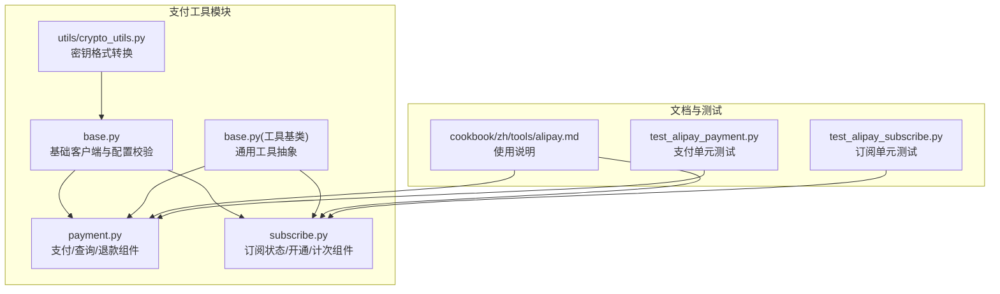
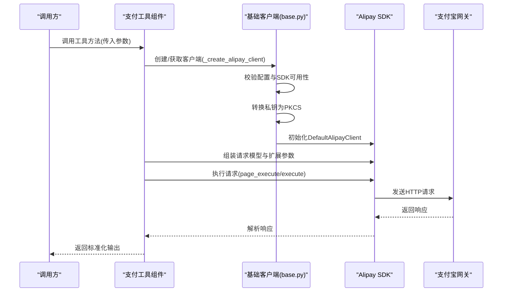
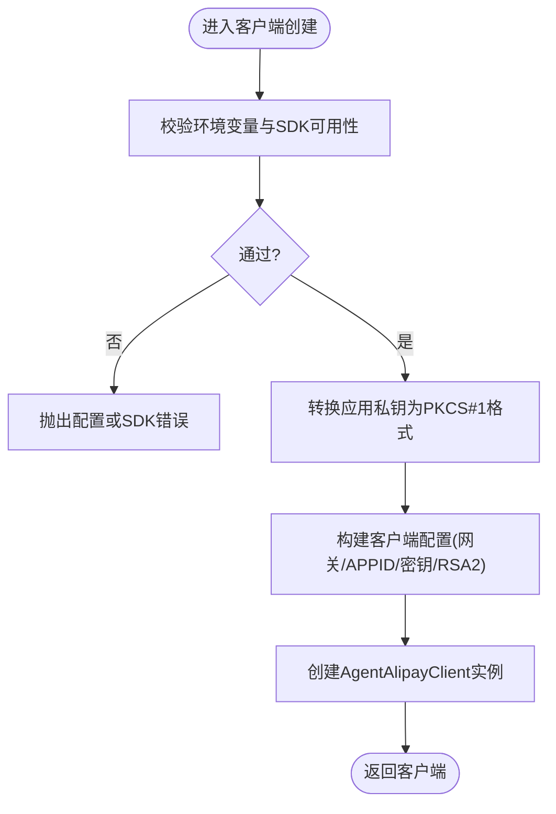
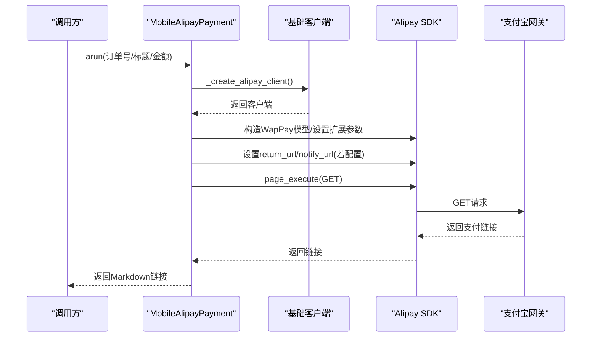
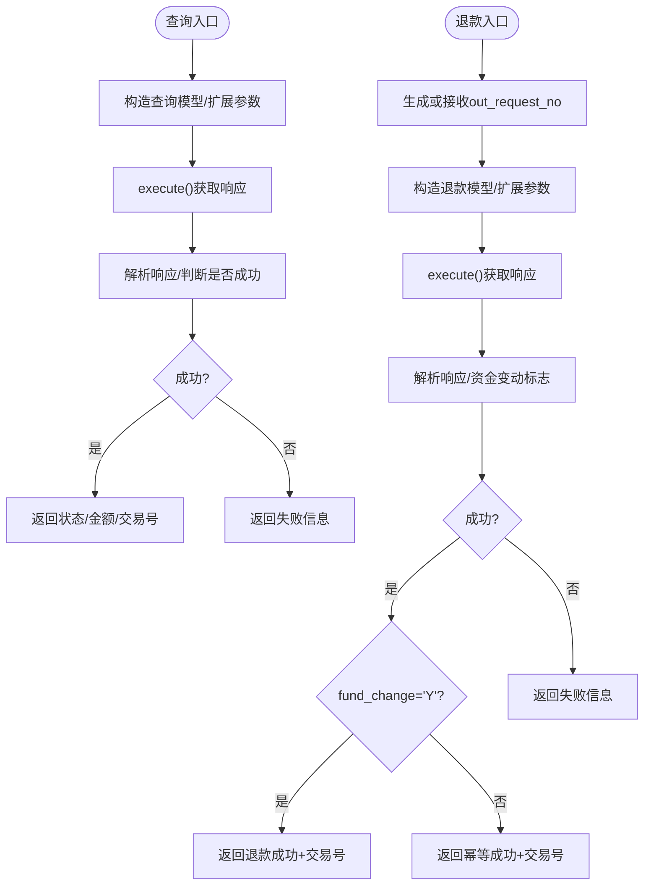
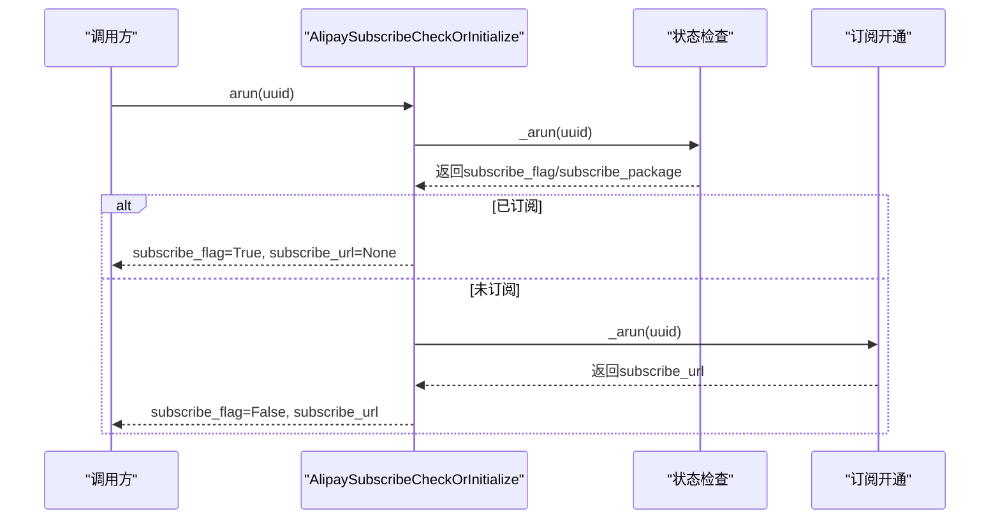
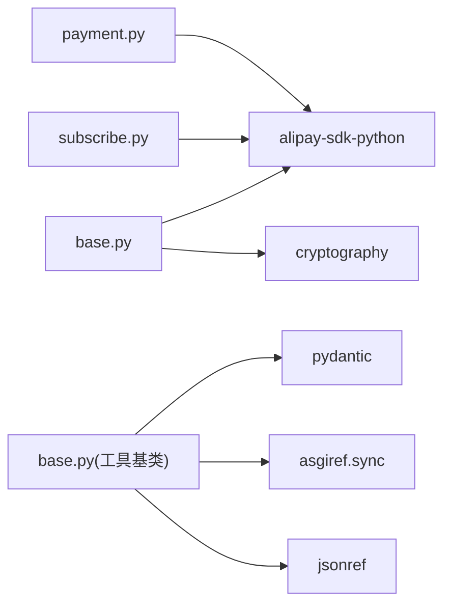

# 支付工具

<cite>
**本文引用的文件**
- [base.py](file://src/agentscope_runtime/tools/alipay/base.py)
- [payment.py](file://src/agentscope_runtime/tools/alipay/payment.py)
- [subscribe.py](file://src/agentscope_runtime/tools/alipay/subscribe.py)
- [crypto_utils.py](file://src/agentscope_runtime/tools/utils/crypto_utils.py)
- [alipay.md](file://cookbook/zh/tools/alipay.md)
- [base.py](file://src/agentscope_runtime/tools/base.py)
- [test_alipay_payment.py](file://tests/tools/test_alipay_payment.py)
- [test_alipay_subscribe.py](file://tests/tools/test_alipay_subscribe.py)
</cite>

## 目录
1. [简介](#简介)
2. [项目结构](#项目结构)
3. [核心组件](#核心组件)
4. [架构总览](#架构总览)
5. [详细组件分析](#详细组件分析)
6. [依赖分析](#依赖分析)
7. [性能考虑](#性能考虑)
8. [故障排查指南](#故障排查指南)
9. [结论](#结论)
10. [附录](#附录)

## 简介
本文件面向支付工具（特别是支付宝支付）的安全与合规文档，聚焦于：
- 支付工具的集成方式与API接口
- 支付流程实现原理与安全机制
- 订阅支付功能的配置与管理
- 支付状态管理与回调处理机制
- 错误处理与异常恢复策略
- 支付安全验证与防欺诈措施
- 合规要求与审计日志
- 支付测试与模拟环境搭建

## 项目结构
支付宝支付工具位于 tools/alipay 子模块，围绕基础客户端封装、支付与退款、订阅管理三大块展开；同时提供加密工具与通用工具基类支撑。

图表来源
- [base.py:1-335](file://src/agentscope_runtime/tools/alipay/base.py#L1-L335)
- [payment.py:1-836](file://src/agentscope_runtime/tools/alipay/payment.py#L1-L836)
- [subscribe.py:1-552](file://src/agentscope_runtime/tools/alipay/subscribe.py#L1-L552)
- [crypto_utils.py:1-100](file://src/agentscope_runtime/tools/utils/crypto_utils.py#L1-L100)
- [base.py:34-265](file://src/agentscope_runtime/tools/base.py#L34-L265)
- [alipay.md:1-323](file://cookbook/zh/tools/alipay.md#L1-L323)
- [test_alipay_payment.py:1-156](file://tests/tools/test_alipay_payment.py#L1-L156)
- [test_alipay_subscribe.py:1-164](file://tests/tools/test_alipay_subscribe.py#L1-L164)

章节来源
- [base.py:1-335](file://src/agentscope_runtime/tools/alipay/base.py#L1-L335)
- [payment.py:1-836](file://src/agentscope_runtime/tools/alipay/payment.py#L1-L836)
- [subscribe.py:1-552](file://src/agentscope_runtime/tools/alipay/subscribe.py#L1-L552)
- [crypto_utils.py:1-100](file://src/agentscope_runtime/tools/utils/crypto_utils.py#L1-L100)
- [base.py:34-265](file://src/agentscope_runtime/tools/base.py#L34-L265)
- [alipay.md:1-323](file://cookbook/zh/tools/alipay.md#L1-L323)

## 核心组件
- 基础客户端与配置校验：负责加载环境变量、校验SDK可用性、构造客户端、网关切换（沙箱/生产）、签名参数注入。
- 支付组件：移动端支付、网页端支付、交易查询、退款、退款查询。
- 订阅组件：订阅状态检查、订阅开通、订阅计次、订阅检查或初始化。
- 工具基类：统一的工具抽象、参数校验、函数Schema导出、同步/异步运行器。
- 加密工具：确保应用私钥为PKCS#1格式，兼容官方SDK。

章节来源
- [base.py:148-335](file://src/agentscope_runtime/tools/alipay/base.py#L148-L335)
- [payment.py:170-836](file://src/agentscope_runtime/tools/alipay/payment.py#L170-L836)
- [subscribe.py:144-552](file://src/agentscope_runtime/tools/alipay/subscribe.py#L144-L552)
- [base.py:34-265](file://src/agentscope_runtime/tools/base.py#L34-L265)
- [crypto_utils.py:17-100](file://src/agentscope_runtime/tools/utils/crypto_utils.py#L17-L100)

## 架构总览
整体架构采用“工具组件 + 基础客户端”的分层设计：
- 工具层：支付、退款、查询、订阅各组件均继承通用工具基类，提供统一的输入/输出Schema与运行接口。
- 基础层：封装Alipay SDK客户端创建、环境检测、网关选择、签名参数注入、密钥格式转换。
- 文档与测试：提供使用示例、环境变量配置、单元测试覆盖。

图表来源
- [payment.py:268-308](file://src/agentscope_runtime/tools/alipay/payment.py#L268-L308)
- [base.py:281-335](file://src/agentscope_runtime/tools/alipay/base.py#L281-L335)

## 详细组件分析

### 基础客户端与安全机制
- 环境变量与网关选择：根据环境变量决定使用沙箱或生产网关，避免误用。
- SDK可用性与配置校验：启动前校验关键环境变量与SDK导入状态，失败即刻抛错。
- 密钥格式转换：强制将应用私钥转换为PKCS#1格式，确保与SDK兼容。
- 自定义扩展参数：在公共参数中注入渠道来源字段，便于溯源与审计。
- 签名算法：默认RSA2签名，保障通信完整性。

图表来源
- [base.py:172-209](file://src/agentscope_runtime/tools/alipay/base.py#L172-L209)
- [base.py:316-335](file://src/agentscope_runtime/tools/alipay/base.py#L316-L335)
- [crypto_utils.py:17-100](file://src/agentscope_runtime/tools/utils/crypto_utils.py#L17-L100)

章节来源
- [base.py:148-335](file://src/agentscope_runtime/tools/alipay/base.py#L148-L335)
- [crypto_utils.py:17-100](file://src/agentscope_runtime/tools/utils/crypto_utils.py#L17-L100)

### 支付组件（移动端/网页端）
- 移动端支付：使用移动端快捷支付产品码，返回可直接使用的支付链接，支持同步回调与异步通知URL。
- 网页端支付：使用即时到账产品码，返回可直接使用的支付链接，支持二维码扫码支付。
- 扩展参数：统一注入渠道来源，便于追踪来源与审计。
- 错误处理：区分配置/SDK错误与执行异常，前者直接抛出，后者包装后抛出，便于上层捕获与记录。

图表来源
- [payment.py:219-308](file://src/agentscope_runtime/tools/alipay/payment.py#L219-L308)

章节来源
- [payment.py:170-409](file://src/agentscope_runtime/tools/alipay/payment.py#L170-L409)

### 交易查询与退款组件
- 交易查询：支持按商户订单号查询，返回交易状态、金额、支付宝交易号等。
- 退款：支持全退/部分退，幂等请求号可避免重复退款；根据资金变动标志判断是否实际扣款。
- 退款查询：支持按商户订单号+退款请求号查询退款状态与金额。

图表来源
- [payment.py:519-544](file://src/agentscope_runtime/tools/alipay/payment.py#L519-L544)
- [payment.py:668-691](file://src/agentscope_runtime/tools/alipay/payment.py#L668-L691)

章节来源
- [payment.py:411-836](file://src/agentscope_runtime/tools/alipay/payment.py#L411-L836)

### 订阅组件（状态/开通/计次/检查或初始化）
- 订阅状态检查：返回用户是否有效订阅及套餐描述（按次数/按时间）。
- 订阅开通：返回订阅购买链接，支持按次数或按时间订阅。
- 订阅计次：记录使用次数，支持幂等请求号，按次数扣减。
- 检查或初始化：一站式组件，先查状态，未订阅则返回购买链接。

图表来源
- [subscribe.py:495-551](file://src/agentscope_runtime/tools/alipay/subscribe.py#L495-L551)

章节来源
- [subscribe.py:144-552](file://src/agentscope_runtime/tools/alipay/subscribe.py#L144-L552)

### 工具基类与参数校验
- 统一的工具抽象：提供异步/同步运行器、参数Schema导出、类型校验与JSON序列化。
- 参数校验：支持字符串/字典/BaseModel三种输入形式，自动校验并转换为Pydantic模型。
- 函数Schema：导出标准函数参数Schema，便于上层引擎注册与调用。

章节来源
- [base.py:34-265](file://src/agentscope_runtime/tools/base.py#L34-L265)

## 依赖分析
- 外部SDK：alipay-sdk-python（官方SDK），用于与支付宝网关交互。
- 加密库：cryptography（用于密钥格式转换）。
- 运行时依赖：asgiref（异步转同步）、pydantic（参数Schema与校验）、jsonref（Schema引用解析）。

图表来源
- [payment.py:19-76](file://src/agentscope_runtime/tools/alipay/payment.py#L19-L76)
- [subscribe.py:18-47](file://src/agentscope_runtime/tools/alipay/subscribe.py#L18-L47)
- [base.py:20-47](file://src/agentscope_runtime/tools/alipay/base.py#L20-L47)
- [base.py:18-25](file://src/agentscope_runtime/tools/base.py#L18-L25)

章节来源
- [payment.py:19-76](file://src/agentscope_runtime/tools/alipay/payment.py#L19-L76)
- [subscribe.py:18-47](file://src/agentscope_runtime/tools/alipay/subscribe.py#L18-L47)
- [base.py:20-47](file://src/agentscope_runtime/tools/alipay/base.py#L20-L47)
- [base.py:18-25](file://src/agentscope_runtime/tools/base.py#L18-L25)

## 性能考虑
- 异步执行：工具基类提供异步运行器，减少阻塞，提升并发能力。
- 客户端复用：建议在进程内复用客户端实例，避免频繁创建销毁带来的开销。
- 网络超时与重试：可在SDK层或上层中间件配置合理的超时与重试策略（建议在业务侧补充）。
- 日志与监控：统一的日志记录有助于定位性能瓶颈与异常路径。

## 故障排查指南
- 配置错误
  - 现象：启动时报错提示缺少必要环境变量或SDK未安装。
  - 排查：检查ALIPAY_APP_ID、ALIPAY_PRIVATE_KEY、ALIPAY_PUBLIC_KEY是否正确设置；确认SDK已安装。
- 网关问题
  - 现象：沙箱/生产网关选择错误导致无法联调。
  - 排查：确认AP_CURRENT_ENV与网关URL匹配；沙箱环境使用沙箱网关。
- 私钥格式问题
  - 现象：SDK报签名或密钥相关错误。
  - 排查：确认应用私钥已转换为PKCS#1格式；检查密钥是否被截断或包含多余字符。
- 回调与通知
  - 现象：用户支付完成但系统未收到通知。
  - 排查：确认AP_RETURN_URL与AP_NOTIFY_URL配置正确；确保回调服务可达且能正确解析参数。
- 退款幂等
  - 现象：重复提交退款请求导致异常。
  - 排查：确保out_request_no唯一且幂等；关注fund_change字段判断是否实际扣款。
- 单元测试
  - 现象：在线测试被跳过。
  - 排查：测试文件标记为跳过，属于安全策略；可在本地沙箱环境中自行验证。

章节来源
- [base.py:172-209](file://src/agentscope_runtime/tools/alipay/base.py#L172-L209)
- [base.py:316-335](file://src/agentscope_runtime/tools/alipay/base.py#L316-L335)
- [crypto_utils.py:17-100](file://src/agentscope_runtime/tools/utils/crypto_utils.py#L17-L100)
- [test_alipay_payment.py:20-22](file://tests/tools/test_alipay_payment.py#L20-L22)
- [test_alipay_subscribe.py:19-21](file://tests/tools/test_alipay_subscribe.py#L19-L21)

## 结论
该支付宝支付工具通过统一的基础客户端与严谨的参数校验、密钥转换与网关选择，提供了移动端、网页端支付、交易查询、退款与订阅管理的完整能力。配合工具基类的Schema导出与异步运行器，能够较好地融入各类运行时与引擎体系。建议在生产部署中：
- 明确沙箱/生产环境配置与切换策略
- 严格管理密钥与回调地址
- 在业务层补充回调签名校验与重试机制
- 建立完善的日志与监控体系

## 附录

### 支付流程与安全要点
- 支付流程
  - 生成支付链接（移动端/网页端）
  - 用户完成支付
  - 实时查询或等待异步通知确认
  - 必要时发起退款/退款查询
- 安全要点
  - 使用RSA2签名与PKCS#1私钥
  - 注入渠道来源字段便于审计
  - 严格校验回调参数（建议在业务侧实现）

章节来源
- [alipay.md:301-323](file://cookbook/zh/tools/alipay.md#L301-L323)
- [payment.py:268-308](file://src/agentscope_runtime/tools/alipay/payment.py#L268-L308)
- [payment.py:519-544](file://src/agentscope_runtime/tools/alipay/payment.py#L519-L544)
- [subscribe.py:192-266](file://src/agentscope_runtime/tools/alipay/subscribe.py#L192-L266)

### 订阅支付配置与管理
- 关键环境变量
  - SUBSCRIBE_PLAN_ID：订阅计划ID
  - X_AGENT_NAME：智能体名称
  - USE_TIMES：每次使用扣减次数
- 管理方法
  - 订阅状态检查：返回是否有效与套餐描述
  - 订阅开通：返回购买链接
  - 订阅计次：记录使用次数，支持幂等
  - 检查或初始化：一站式组件

章节来源
- [subscribe.py:51-57](file://src/agentscope_runtime/tools/alipay/subscribe.py#L51-L57)
- [subscribe.py:144-552](file://src/agentscope_runtime/tools/alipay/subscribe.py#L144-L552)
- [alipay.md:156-169](file://cookbook/zh/tools/alipay.md#L156-L169)

### 回调处理机制
- 同步回调（return_url）：用户支付完成后跳转回商户页面
- 异步通知（notify_url）：支付宝服务器向商户后台推送支付结果
- 建议实现
  - 校验签名与参数一致性
  - 幂等处理，避免重复入账
  - 记录审计日志，便于对账与追溯

章节来源
- [payment.py:287-291](file://src/agentscope_runtime/tools/alipay/payment.py#L287-L291)
- [payment.py:386-390](file://src/agentscope_runtime/tools/alipay/payment.py#L386-L390)
- [alipay.md:156-169](file://cookbook/zh/tools/alipay.md#L156-L169)

### 错误处理与异常恢复策略
- 配置/SDK错误：立即抛出，便于快速定位
- 执行异常：包装为统一错误消息，保留原始异常链
- 退款幂等：依据fund_change与out_request_no保证重复请求安全
- 建议
  - 在业务层增加重试与熔断策略
  - 对关键路径增加超时与降级

章节来源
- [payment.py:299-307](file://src/agentscope_runtime/tools/alipay/payment.py#L299-L307)
- [payment.py:683-691](file://src/agentscope_runtime/tools/alipay/payment.py#L683-L691)
- [base.py:75-92](file://src/agentscope_runtime/tools/base.py#L75-L92)

### 支付安全验证与防欺诈
- 签名与密钥
  - 使用RSA2签名与PKCS#1私钥
  - 严格校验支付宝公钥与应用私钥配对
- 参数校验
  - 使用Pydantic模型进行输入/输出校验
  - 严格限制金额、订单号等关键字段范围
- 回调校验
  - 建议在业务侧实现回调签名校验与参数一致性检查
- 防欺诈
  - 限额与风控策略（建议在业务侧补充）
  - 记录用户行为与设备指纹（建议在业务侧补充）

章节来源
- [base.py:325-331](file://src/agentscope_runtime/tools/alipay/base.py#L325-L331)
- [crypto_utils.py:17-100](file://src/agentscope_runtime/tools/utils/crypto_utils.py#L17-L100)
- [base.py:237-246](file://src/agentscope_runtime/tools/base.py#L237-L246)

### 合规要求与审计日志
- 合规要求
  - 严格遵守《网络安全法》《数据安全法》与支付行业规范
  - 敏感信息（私钥、回调地址）需加密存储与最小授权访问
- 审计日志
  - 记录关键事件：支付发起、回调接收、退款发起、状态查询
  - 日志包含：时间戳、订单号、用户ID、请求参数摘要、响应状态、异常信息

章节来源
- [base.py:243-246](file://src/agentscope_runtime/tools/alipay/base.py#L243-L246)
- [payment.py:524-534](file://src/agentscope_runtime/tools/alipay/payment.py#L524-L534)

### 支付测试与模拟环境搭建
- 沙箱环境
  - 使用沙箱网关与沙箱密钥进行联调
  - 通过环境变量切换沙箱/生产
- 测试策略
  - 单元测试覆盖：支付链接生成、查询、退款、订阅组件
  - 在线测试跳过：出于安全考虑，默认跳过在线测试
- 建议
  - 在本地或CI中配置沙箱密钥与回调地址
  - 编写端到端测试，覆盖从支付到回调的完整链路

章节来源
- [base.py:165-169](file://src/agentscope_runtime/tools/alipay/base.py#L165-L169)
- [test_alipay_payment.py:20-22](file://tests/tools/test_alipay_payment.py#L20-L22)
- [test_alipay_subscribe.py:19-21](file://tests/tools/test_alipay_subscribe.py#L19-L21)
- [alipay.md:156-169](file://cookbook/zh/tools/alipay.md#L156-L169)