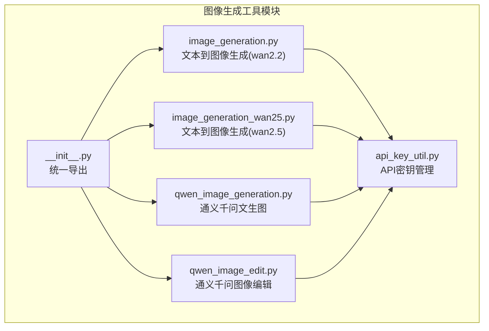
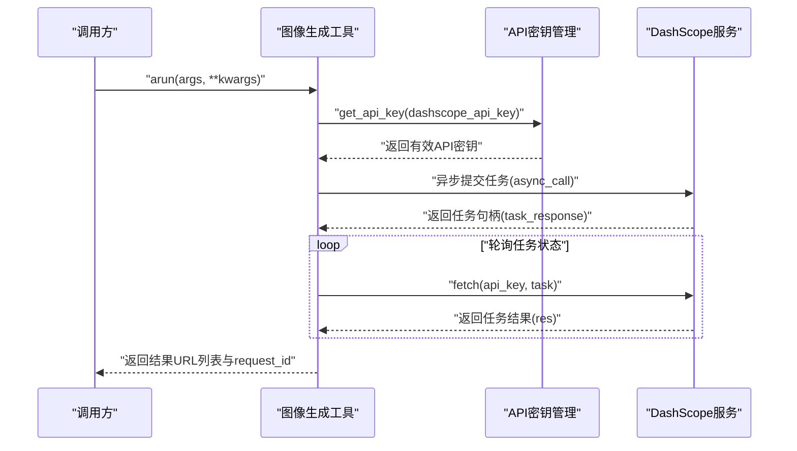
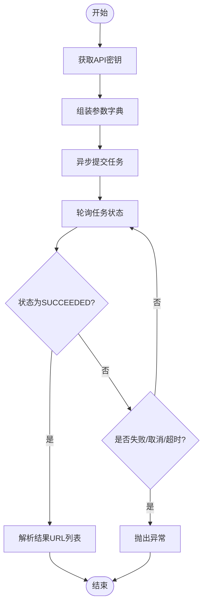
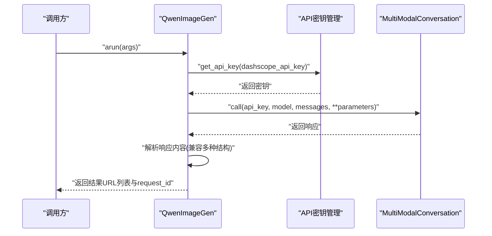
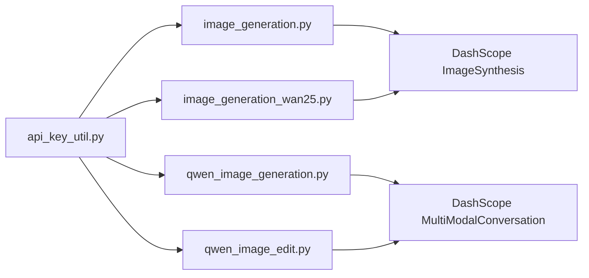

# 图像生成工具

<cite>
**本文引用的文件**
- [image_generation.py](file://src/agentscope_runtime/tools/generations/image_generation.py)
- [image_generation_wan25.py](file://src/agentscope_runtime/tools/generations/image_generation_wan25.py)
- [qwen_image_generation.py](file://src/agentscope_runtime/tools/generations/qwen_image_generation.py)
- [qwen_image_edit.py](file://src/agentscope_runtime/tools/generations/qwen_image_edit.py)
- [api_key_util.py](file://src/agentscope_runtime/tools/utils/api_key_util.py)
- [modelstudio_generations.md](file://cookbook/zh/tools/modelstudio_generations.md)
- [__init__.py](file://src/agentscope_runtime/tools/generations/__init__.py)
</cite>

## 目录
1. [简介](#简介)
2. [项目结构](#项目结构)
3. [核心组件](#核心组件)
4. [架构总览](#架构总览)
5. [详细组件分析](#详细组件分析)
6. [依赖关系分析](#依赖关系分析)
7. [性能考量](#性能考量)
8. [故障排查指南](#故障排查指南)
9. [结论](#结论)
10. [附录](#附录)

## 简介
本文件面向图像生成工具的功能文档，重点覆盖以下内容：
- 文本到图像生成功能：Prompt 参数配置、图像尺寸设置、负向提示词使用、多图生成能力等核心特性
- QwenImageGeneration 工具的阿里云百炼模型集成与参数优化
- 工具的 API 调用流程、异步处理机制、错误处理策略与性能优化建议
- 完整的参数说明、使用示例与最佳实践指南

## 项目结构
图像生成相关工具集中于 generations 子模块，包含三类核心能力：
- 基于 DashScope ImageSynthesis 的异步文本到图像生成（含 wan2.2 与 wan2.5 版本）
- 基于 DashScope MultiModalConversation 的通义千问文生图与图像编辑
- 通过统一导出接口对外暴露

图表来源
- [image_generation.py:1-203](file://src/agentscope_runtime/tools/generations/image_generation.py#L1-L203)
- [image_generation_wan25.py:1-202](file://src/agentscope_runtime/tools/generations/image_generation_wan25.py#L1-L202)
- [qwen_image_generation.py:1-215](file://src/agentscope_runtime/tools/generations/qwen_image_generation.py#L1-L215)
- [qwen_image_edit.py:1-206](file://src/agentscope_runtime/tools/generations/qwen_image_edit.py#L1-L206)
- [api_key_util.py:1-46](file://src/agentscope_runtime/tools/utils/api_key_util.py#L1-L46)
- [__init__.py:1-76](file://src/agentscope_runtime/tools/generations/__init__.py#L1-L76)

章节来源
- [__init__.py:1-76](file://src/agentscope_runtime/tools/generations/__init__.py#L1-L76)

## 核心组件
- ImageGeneration（文本到图像生成，wan2.2）
  - 支持 Prompt、尺寸(size)、负向提示词(negative_prompt)、数量(n)、智能改写(prompt_extend)、水印(watermark) 等参数
  - 通过异步任务提交与轮询获取结果，内置超时控制
- ImageGenerationWan25（文本到图像生成，wan2.5）
  - 功能与上述一致，但默认模型名不同，适配更高性能版本
- QwenImageGen（通义千问文生图）
  - 使用 MultiModalConversation API，支持 Prompt、负向提示词、尺寸、数量、智能改写、水印
  - 返回结果解析灵活，兼容多种响应结构
- QwenImageEdit（通义千问图像编辑）
  - 基于图像 URL 与 Prompt 进行编辑，支持负向提示词与水印
  - 通过消息结构组织输入，便于后续扩展

章节来源
- [image_generation.py:21-68](file://src/agentscope_runtime/tools/generations/image_generation.py#L21-L68)
- [image_generation_wan25.py:20-67](file://src/agentscope_runtime/tools/generations/image_generation_wan25.py#L20-L67)
- [qwen_image_generation.py:18-68](file://src/agentscope_runtime/tools/generations/qwen_image_generation.py#L18-L68)
- [qwen_image_edit.py:18-62](file://src/agentscope_runtime/tools/generations/qwen_image_edit.py#L18-L62)

## 架构总览
整体采用“工具封装 + 异步调用 + 统一参数管理”的架构，核心流程如下：

图表来源
- [image_generation.py:79-202](file://src/agentscope_runtime/tools/generations/image_generation.py#L79-L202)
- [image_generation_wan25.py:78-201](file://src/agentscope_runtime/tools/generations/image_generation_wan25.py#L78-L201)
- [qwen_image_generation.py:79-214](file://src/agentscope_runtime/tools/generations/qwen_image_generation.py#L79-L214)
- [api_key_util.py:13-45](file://src/agentscope_runtime/tools/utils/api_key_util.py#L13-L45)

## 详细组件分析

### ImageGeneration（文本到图像生成，wan2.2）
- 输入参数
  - prompt: 正向提示词
  - size: 图像尺寸（如 1024x1024），默认由模型决定
  - negative_prompt: 负向提示词，限制不希望出现的内容
  - prompt_extend: 是否开启智能改写
  - n: 生成数量（默认1，最大4）
  - watermark: 是否添加水印
- 处理逻辑
  - 获取 API 密钥
  - 组装参数字典（仅当参数存在时加入）
  - 异步提交任务，随后轮询任务状态直至完成或失败
  - 解析输出结果，提取图片 URL 列表
- 错误处理
  - 提交失败、轮询异常、任务失败或取消、超时均抛出异常
- 性能与优化
  - 合理设置 n 与 size，避免一次性请求过多资源
  - 控制并发与重试策略，结合超时参数避免长时间占用

图表来源
- [image_generation.py:110-202](file://src/agentscope_runtime/tools/generations/image_generation.py#L110-L202)

章节来源
- [image_generation.py:21-68](file://src/agentscope_runtime/tools/generations/image_generation.py#L21-L68)
- [image_generation.py:79-202](file://src/agentscope_runtime/tools/generations/image_generation.py#L79-L202)

### ImageGenerationWan25（文本到图像生成，wan2.5）
- 与上述流程一致，差异点在于默认模型名与参数默认值略有不同
- 适合追求更高生成质量与速度的场景

章节来源
- [image_generation_wan25.py:20-67](file://src/agentscope_runtime/tools/generations/image_generation_wan25.py#L20-L67)
- [image_generation_wan25.py:78-201](file://src/agentscope_runtime/tools/generations/image_generation_wan25.py#L78-L201)

### QwenImageGen（通义千问文生图）
- 输入参数
  - prompt: 正向提示词
  - negative_prompt: 负向提示词
  - size: 图像尺寸
  - n: 生成数量
  - prompt_extend: 智能改写开关
  - watermark: 水印开关
- 处理逻辑
  - 将 prompt 组织为 MultiModal 消息结构
  - 调用 AioMultiModalConversation 异步接口
  - 解析响应中的图片 URL，兼容多种内容结构
- 错误处理
  - API 调用异常、状态码非 200、无法解析结果均抛出异常
- 性能与优化
  - 合理设置 n 与 size，避免单次请求过大
  - 对响应解析做健壮性处理，提升容错能力

图表来源
- [qwen_image_generation.py:79-214](file://src/agentscope_runtime/tools/generations/qwen_image_generation.py#L79-L214)
- [api_key_util.py:13-45](file://src/agentscope_runtime/tools/utils/api_key_util.py#L13-L45)

章节来源
- [qwen_image_generation.py:18-68](file://src/agentscope_runtime/tools/generations/qwen_image_generation.py#L18-L68)
- [qwen_image_generation.py:79-214](file://src/agentscope_runtime/tools/generations/qwen_image_generation.py#L79-L214)

### QwenImageEdit（通义千问图像编辑）
- 输入参数
  - image_url: 待编辑图像 URL（公网可访问）
  - prompt: 正向提示词
  - negative_prompt: 负向提示词
  - watermark: 水印开关
- 处理逻辑
  - 将 image_url 与 prompt 组合为 MultiModal 消息
  - 调用 AioMultiModalConversation 异步接口
  - 解析响应并提取编辑后的图片 URL
- 适用场景
  - 文本驱动的图像编辑、修复、风格迁移等

章节来源
- [qwen_image_edit.py:18-62](file://src/agentscope_runtime/tools/generations/qwen_image_edit.py#L18-L62)
- [qwen_image_edit.py:75-205](file://src/agentscope_runtime/tools/generations/qwen_image_edit.py#L75-L205)

## 依赖关系分析
- 统一的 API 密钥管理：通过 ApiNames 枚举与 get_api_key 函数，优先级为传入参数 > kwargs > 环境变量
- DashScope SDK 集成：ImageSynthesis 与 MultiModalConversation 作为底层服务
- 异步处理：所有生成流程均采用 asyncio 与异步调用，提高吞吐与稳定性
- 统一导出：通过 __init__.py 将各工具与输入/输出类型统一导出，便于外部按需导入

图表来源
- [api_key_util.py:1-46](file://src/agentscope_runtime/tools/utils/api_key_util.py#L1-L46)
- [image_generation.py:12-18](file://src/agentscope_runtime/tools/generations/image_generation.py#L12-L18)
- [image_generation_wan25.py:11-17](file://src/agentscope_runtime/tools/generations/image_generation_wan25.py#L11-L17)
- [qwen_image_generation.py:9-15](file://src/agentscope_runtime/tools/generations/qwen_image_generation.py#L9-L15)
- [qwen_image_edit.py:9-15](file://src/agentscope_runtime/tools/generations/qwen_image_edit.py#L9-L15)

章节来源
- [__init__.py:1-76](file://src/agentscope_runtime/tools/generations/__init__.py#L1-L76)

## 性能考量
- 异步轮询
  - 固定轮询间隔与超时时间，避免长时间阻塞；可根据业务需求调整轮询间隔与最大等待时间
- 并发与限流
  - 控制同时发起的任务数，避免触发平台限流
- 参数优化
  - 合理设置 n 与 size，避免单次请求过大导致超时或失败
  - 在支持智能改写的模型上谨慎开启 prompt_extend，平衡生成质量与耗时
- 结果缓存
  - 对于重复 Prompt 的场景，可在应用层做结果缓存以减少重复调用

## 故障排查指南
- 常见错误与定位
  - API 密钥缺失或无效：检查环境变量 DASHSCOPE_API_KEY 或传入参数
  - 任务提交失败：确认网络连通与模型可用性
  - 轮询阶段失败/取消：检查 Prompt 合法性与参数有效性
  - 超时：适当延长等待时间或降低 n 与 size
- 建议排查步骤
  - 校验密钥来源与权限
  - 查看 trace 日志与 request_id，定位具体环节
  - 逐步缩小参数范围，复现问题
  - 关注平台配额与速率限制

章节来源
- [api_key_util.py:13-45](file://src/agentscope_runtime/tools/utils/api_key_util.py#L13-L45)
- [image_generation.py:134-180](file://src/agentscope_runtime/tools/generations/image_generation.py#L134-L180)
- [image_generation_wan25.py:133-179](file://src/agentscope_runtime/tools/generations/image_generation_wan25.py#L133-L179)
- [qwen_image_generation.py:140-150](file://src/agentscope_runtime/tools/generations/qwen_image_generation.py#L140-L150)

## 结论
- ImageGeneration 与 ImageGenerationWan25 提供稳定的文本到图像生成能力，具备完善的异步处理与错误处理机制
- QwenImageGen 与 QwenImageEdit 借助通义千问模型，支持更丰富的提示词与编辑能力
- 通过统一的 API 密钥管理与清晰的参数设计，工具易于集成与扩展
- 建议在生产环境中结合业务场景优化参数、并发与缓存策略，确保稳定与高效

## 附录

### 参数说明与最佳实践
- 通用参数
  - prompt/negative_prompt：建议明确、具体；必要时配合 prompt_extend
  - size：优先选择平台支持的标准分辨率，避免过高导致超时
  - n：建议从 1 开始，逐步增加以评估质量与成本
  - watermark/prompt_extend：按需开启，注意对生成效果的影响
- 环境变量
  - DASHSCOPE_API_KEY：必须配置
  - IMAGE_GENERATION_MODEL_NAME/QWEN_IMAGE_GENERATION_MODEL_NAME：可按需覆盖默认模型
- 使用示例
  - 参考官方示例，使用异步方式调用 arun，并处理返回的 results 与 request_id

章节来源
- [modelstudio_generations.md:15-101](file://cookbook/zh/tools/modelstudio_generations.md#L15-L101)