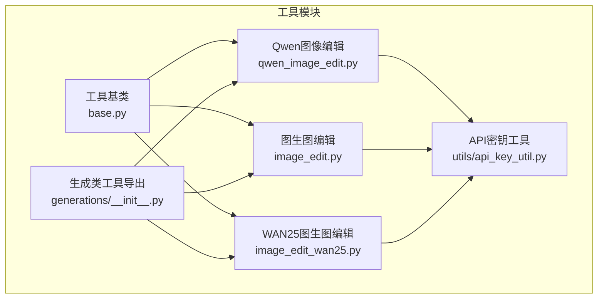
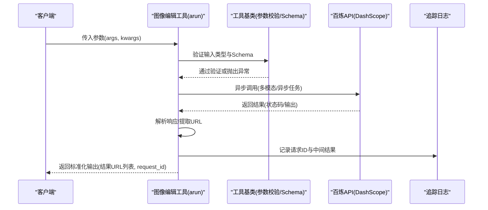
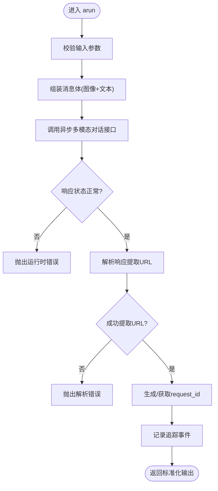
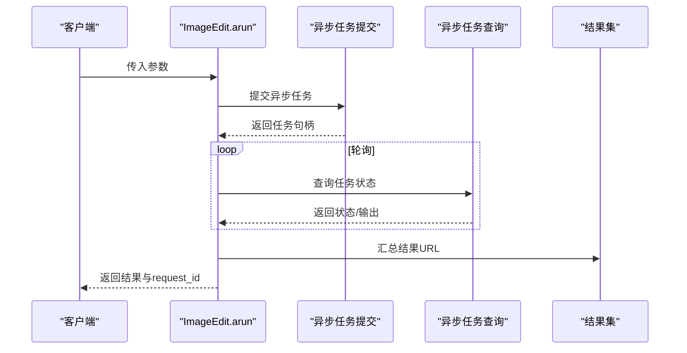
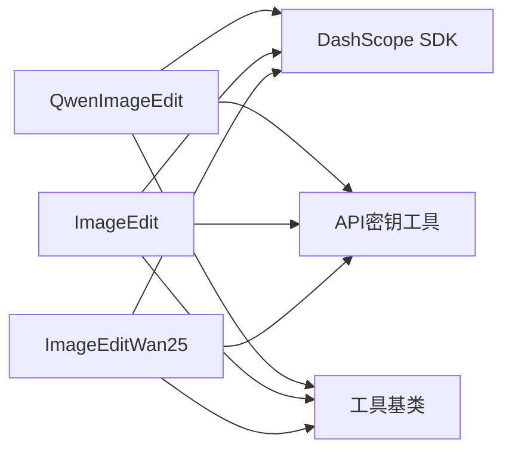

# 图像编辑工具

<cite>
**本文档引用的文件**
- [qwen_image_edit.py](file://src/agentscope_runtime/tools/generations/qwen_image_edit.py)
- [image_edit.py](file://src/agentscope_runtime/tools/generations/image_edit.py)
- [image_edit_wan25.py](file://src/agentscope_runtime/tools/generations/image_edit_wan25.py)
- [base.py](file://src/agentscope_runtime/tools/base.py)
- [api_key_util.py](file://src/agentscope_runtime/tools/utils/api_key_util.py)
- [__init__.py](file://src/agentscope_runtime/tools/generations/__init__.py)
- [test_generations.py](file://tests/tools/test_generations.py)
</cite>

## 目录
1. [简介](#简介)
2. [项目结构](#项目结构)
3. [核心组件](#核心组件)
4. [架构总览](#架构总览)
5. [详细组件分析](#详细组件分析)
6. [依赖关系分析](#依赖关系分析)
7. [性能考量](#性能考量)
8. [故障排除指南](#故障排除指南)
9. [结论](#结论)
10. [附录](#附录)

## 简介
本文件面向图像编辑工具的使用者与维护者，系统性介绍基于阿里云百炼平台的图像编辑能力，涵盖以下内容：
- 图像修复、风格转换、内容感知填充等编辑算法的工具化封装与调用流程
- QwenImageEdit 工具的阿里云百炼模型支持与参数配置
- 输入输出格式、编辑策略选择、质量控制机制
- 编辑效果对比、参数调优建议与常见问题解决方案

## 项目结构
图像编辑工具位于工具模块的生成类子模块中，采用统一的工具基类与参数校验机制，便于扩展与集成。

**图表来源**
- [base.py:34-127](file://src/agentscope_runtime/tools/base.py#L34-L127)
- [__init__.py:20-71](file://src/agentscope_runtime/tools/generations/__init__.py#L20-L71)
- [qwen_image_edit.py:64-205](file://src/agentscope_runtime/tools/generations/qwen_image_edit.py#L64-L205)
- [image_edit.py:79-208](file://src/agentscope_runtime/tools/generations/image_edit.py#L79-L208)
- [image_edit_wan25.py:65-193](file://src/agentscope_runtime/tools/generations/image_edit_wan25.py#L65-L193)
- [api_key_util.py:13-45](file://src/agentscope_runtime/tools/utils/api_key_util.py#L13-L45)

**章节来源**
- [base.py:34-127](file://src/agentscope_runtime/tools/base.py#L34-L127)
- [__init__.py:20-71](file://src/agentscope_runtime/tools/generations/__init__.py#L20-L71)

## 核心组件
本节概述三大图像编辑工具及其职责边界：
- QwenImageEdit：基于多模态对话接口，支持以“图像+文本”指令驱动的图像编辑，适用于复杂图文编辑场景
- ImageEdit：基于异步任务接口，支持多种编辑函数（如去水印、风格化、超分、着色等），适合批量与异步处理
- ImageEditWan25：基于 WAN2.5 模型的图生图编辑，支持多图输入与更强的跨图组合能力

各工具均继承统一的工具基类，具备参数校验、Schema 导出、同步/异步执行等通用能力。

**章节来源**
- [qwen_image_edit.py:64-205](file://src/agentscope_runtime/tools/generations/qwen_image_edit.py#L64-L205)
- [image_edit.py:79-208](file://src/agentscope_runtime/tools/generations/image_edit.py#L79-L208)
- [image_edit_wan25.py:65-193](file://src/agentscope_runtime/tools/generations/image_edit_wan25.py#L65-L193)
- [base.py:34-127](file://src/agentscope_runtime/tools/base.py#L34-L127)

## 架构总览
下图展示图像编辑工具的调用链路与关键交互点：

**图表来源**
- [base.py:94-127](file://src/agentscope_runtime/tools/base.py#L94-L127)
- [qwen_image_edit.py:74-205](file://src/agentscope_runtime/tools/generations/qwen_image_edit.py#L74-L205)
- [image_edit.py:87-208](file://src/agentscope_runtime/tools/generations/image_edit.py#L87-L208)
- [image_edit_wan25.py:73-193](file://src/agentscope_runtime/tools/generations/image_edit_wan25.py#L73-L193)

## 详细组件分析

### QwenImageEdit 组件分析
- 功能定位：以“图像+文本”为输入，通过多模态对话接口实现复杂图文编辑
- 输入参数：
  - image_url：公网可访问的图像URL，支持多种格式与尺寸限制
  - prompt：正向提示词，超过一定长度会自动截断
  - negative_prompt：反向提示词，用于限制不希望出现的内容
  - watermark：是否添加水印
  - ctx：HTTP请求上下文（内部使用）
- 输出参数：
  - results：编辑后的图像URL列表
  - request_id：请求标识
- 关键流程：
  - 参数校验与模型名解析（优先从kwargs或环境变量获取）
  - 组装消息体（图像+文本）
  - 调用异步多模态对话接口
  - 解析响应，提取图像URL
  - 记录追踪事件与请求ID

**图表来源**
- [qwen_image_edit.py:74-205](file://src/agentscope_runtime/tools/generations/qwen_image_edit.py#L74-L205)

**章节来源**
- [qwen_image_edit.py:18-62](file://src/agentscope_runtime/tools/generations/qwen_image_edit.py#L18-L62)
- [qwen_image_edit.py:74-205](file://src/agentscope_runtime/tools/generations/qwen_image_edit.py#L74-L205)
- [api_key_util.py:13-45](file://src/agentscope_runtime/tools/utils/api_key_util.py#L13-L45)

### ImageEdit 组件分析
- 功能定位：基于异步任务接口的图生图编辑，支持多种编辑函数与批量生成
- 支持的编辑函数（示例）：风格化全图/局部、基于掩码的描述编辑、去水印、扩图、超分、着色、涂鸦、卡通特征控制等
- 输入参数：
  - function：编辑功能枚举
  - base_image_url：基础图像URL
  - mask_image_url：当function为带掩码的描述编辑时必填
  - prompt：正向提示词
  - n：生成数量（1~4张，默认1）
  - watermark：是否添加水印
  - ctx：HTTP请求上下文（内部使用）
- 输出参数：
  - results：编辑后的图像URL列表
  - request_id：请求标识
- 关键流程：
  - 提交异步任务
  - 循环轮询任务状态，支持超时控制
  - 成功后提取结果URL

**图表来源**
- [image_edit.py:129-186](file://src/agentscope_runtime/tools/generations/image_edit.py#L129-L186)

**章节来源**
- [image_edit.py:21-77](file://src/agentscope_runtime/tools/generations/image_edit.py#L21-L77)
- [image_edit.py:87-208](file://src/agentscope_runtime/tools/generations/image_edit.py#L87-L208)

### ImageEditWan25 组件分析
- 功能定位：基于 WAN2.5 模型的图生图编辑，支持多图输入与更强的跨图组合能力
- 输入参数：
  - images：图像URL数组
  - prompt：正向提示词
  - negative_prompt：反向提示词
  - n：生成数量（1~4张，默认1）
  - watermark：是否添加水印
  - ctx：HTTP请求上下文（内部使用）
- 输出参数：
  - results：编辑后的图像URL列表
  - request_id：请求标识
- 关键流程：
  - 提交异步任务
  - 轮询任务状态直至完成或失败
  - 成功后提取结果URL

**章节来源**
- [image_edit_wan25.py:20-63](file://src/agentscope_runtime/tools/generations/image_edit_wan25.py#L20-L63)
- [image_edit_wan25.py:73-193](file://src/agentscope_runtime/tools/generations/image_edit_wan25.py#L73-L193)

### 工具基类与参数校验
- 统一的工具基类提供：
  - 输入/输出类型校验
  - Schema 自动解析与导出
  - 同步/异步执行入口
  - 参数字符串化与反序列化
- 该设计确保所有图像编辑工具具备一致的调用体验与错误处理策略

**章节来源**
- [base.py:34-127](file://src/agentscope_runtime/tools/base.py#L34-L127)
- [base.py:162-194](file://src/agentscope_runtime/tools/base.py#L162-L194)

## 依赖关系分析
- 工具层依赖：
  - 基类：统一的工具抽象与参数校验
  - API密钥：集中式获取与优先级策略
  - 百炼SDK：DashScope 的异步多模态与异步任务接口
- 导出与聚合：
  - 生成类工具通过统一导出文件对外暴露

**图表来源**
- [qwen_image_edit.py:9-15](file://src/agentscope_runtime/tools/generations/qwen_image_edit.py#L9-L15)
- [image_edit.py:12-18](file://src/agentscope_runtime/tools/generations/image_edit.py#L12-L18)
- [image_edit_wan25.py:11-17](file://src/agentscope_runtime/tools/generations/image_edit_wan25.py#L11-L17)
- [api_key_util.py:13-45](file://src/agentscope_runtime/tools/utils/api_key_util.py#L13-L45)
- [base.py:34-127](file://src/agentscope_runtime/tools/base.py#L34-L127)

**章节来源**
- [__init__.py:20-71](file://src/agentscope_runtime/tools/generations/__init__.py#L20-L71)

## 性能考量
- 异步并发：
  - ImageEdit 与 ImageEditWan25 使用异步任务接口，支持并发提交与轮询，提升吞吐
- 超时与重试：
  - 内置最大等待时间与轮询间隔，避免长时间阻塞；失败或取消状态直接抛错
- 批量生成：
  - 通过 n 参数控制单次生成数量，结合并发可显著缩短整体耗时
- 建议：
  - 对于长耗时任务，合理设置轮询间隔与超时阈值
  - 多图输入场景建议控制图像数量与分辨率，平衡质量与性能

[本节为通用指导，不直接分析具体文件]

## 故障排除指南
- API密钥缺失或无效
  - 现象：抛出“请设置有效的 DASHSCOPE_API_KEY”类错误
  - 排查：确认环境变量或运行时参数已正确传入
  - 参考路径：[api_key_util.py:13-45](file://src/agentscope_runtime/tools/utils/api_key_util.py#L13-L45)
- 任务提交失败
  - 现象：提交阶段返回非200状态或输出为空
  - 排查：检查输入参数、网络连通性与模型可用性
  - 参考路径：[image_edit.py:140-144](file://src/agentscope_runtime/tools/generations/image_edit.py#L140-L144)，[image_edit_wan25.py:125-129](file://src/agentscope_runtime/tools/generations/image_edit_wan25.py#L125-L129)
- 任务轮询超时
  - 现象：超过最大等待时间仍未完成
  - 排查：检查任务状态、资源配额与并发度
  - 参考路径：[image_edit.py:182-186](file://src/agentscope_runtime/tools/generations/image_edit.py#L182-L186)，[image_edit_wan25.py:167-171](file://src/agentscope_runtime/tools/generations/image_edit_wan25.py#L167-L171)
- 响应解析异常
  - 现象：无法从响应中提取图像URL
  - 排查：确认响应结构与字段命名一致性
  - 参考路径：[qwen_image_edit.py:148-178](file://src/agentscope_runtime/tools/generations/qwen_image_edit.py#L148-L178)，[image_edit.py:204-208](file://src/agentscope_runtime/tools/generations/image_edit.py#L204-L208)，[image_edit_wan25.py:189-193](file://src/agentscope_runtime/tools/generations/image_edit_wan25.py#L189-L193)

**章节来源**
- [api_key_util.py:13-45](file://src/agentscope_runtime/tools/utils/api_key_util.py#L13-L45)
- [image_edit.py:140-186](file://src/agentscope_runtime/tools/generations/image_edit.py#L140-L186)
- [image_edit_wan25.py:125-171](file://src/agentscope_runtime/tools/generations/image_edit_wan25.py#L125-L171)
- [qwen_image_edit.py:148-178](file://src/agentscope_runtime/tools/generations/qwen_image_edit.py#L148-L178)

## 结论
本套图像编辑工具以统一的工具基类与参数校验为基础，分别针对不同场景提供了：
- QwenImageEdit：灵活的“图像+文本”编辑能力
- ImageEdit：稳定的异步任务式图生图编辑
- ImageEditWan25：多图输入与更强组合能力的编辑方案

通过明确的输入输出规范、完善的错误处理与性能优化策略，能够满足从个人创作到企业级应用的多样化需求。

[本节为总结性内容，不直接分析具体文件]

## 附录

### 输入输出格式与参数说明
- QwenImageEdit
  - 输入：image_url、prompt、negative_prompt、watermark、ctx
  - 输出：results（URL列表）、request_id
  - 参考路径：[qwen_image_edit.py:18-62](file://src/agentscope_runtime/tools/generations/qwen_image_edit.py#L18-L62)，[qwen_image_edit.py:48-62](file://src/agentscope_runtime/tools/generations/qwen_image_edit.py#L48-L62)
- ImageEdit
  - 输入：function、base_image_url、mask_image_url、prompt、n、watermark、ctx
  - 输出：results（URL列表）、request_id
  - 参考路径：[image_edit.py:21-77](file://src/agentscope_runtime/tools/generations/image_edit.py#L21-L77)，[image_edit.py:66-77](file://src/agentscope_runtime/tools/generations/image_edit.py#L66-L77)
- ImageEditWan25
  - 输入：images、prompt、negative_prompt、n、watermark、ctx
  - 输出：results（URL列表）、request_id
  - 参考路径：[image_edit_wan25.py:20-63](file://src/agentscope_runtime/tools/generations/image_edit_wan25.py#L20-L63)，[image_edit_wan25.py:52-63](file://src/agentscope_runtime/tools/generations/image_edit_wan25.py#L52-L63)

### 编辑策略选择与质量控制
- 策略选择
  - 复杂图文编辑：优先选择 QwenImageEdit
  - 批量与异步任务：优先选择 ImageEdit 或 ImageEditWan25
  - 多图组合与跨图编辑：优先选择 ImageEditWan25
- 质量控制
  - 合理设置 prompt/negative_prompt，避免歧义
  - 控制 n 与并发度，平衡速度与质量
  - 关注任务状态与超时阈值，及时发现异常

### 编辑效果对比与参数调优建议
- 对比维度
  - 精细度：QwenImageEdit 在复杂图文编辑上更精细
  - 批处理能力：ImageEdit/Wan25 更适合批量与异步场景
  - 多图组合：Wan25 在跨图组合方面表现更佳
- 调优建议
  - 提升清晰度：适当提高 n，或选择更高分辨率的模型（如 WAN2.5）
  - 控制风格：通过 negative_prompt 明确排除不需要的元素
  - 降低噪声：合理设置水印开关与提示词长度

### 测试参考
- 单元测试覆盖了三大工具的基本调用与并发场景，可作为集成与回归测试的参考
- 参考路径：[test_generations.py:448-802](file://tests/tools/test_generations.py#L448-L802)

**章节来源**
- [test_generations.py:448-802](file://tests/tools/test_generations.py#L448-L802)