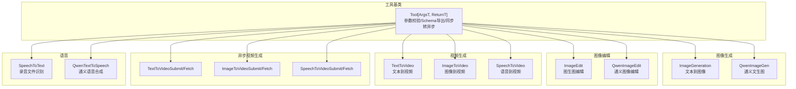
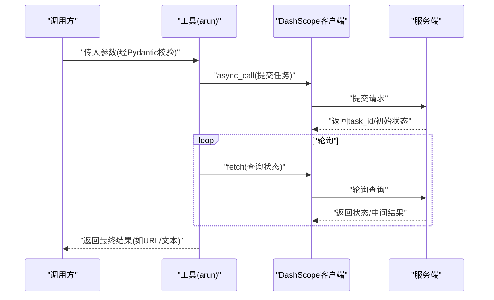
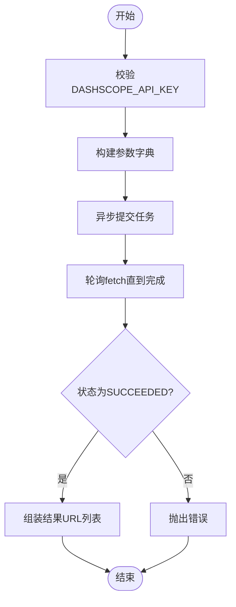
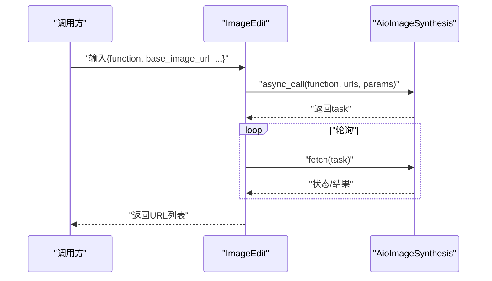
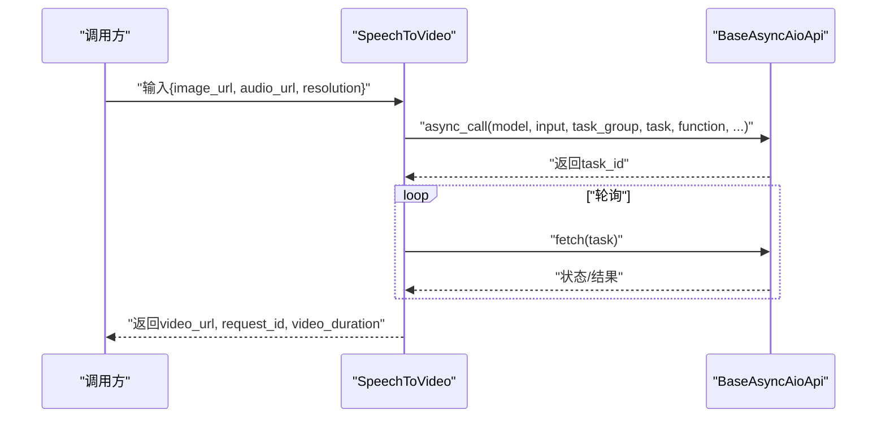
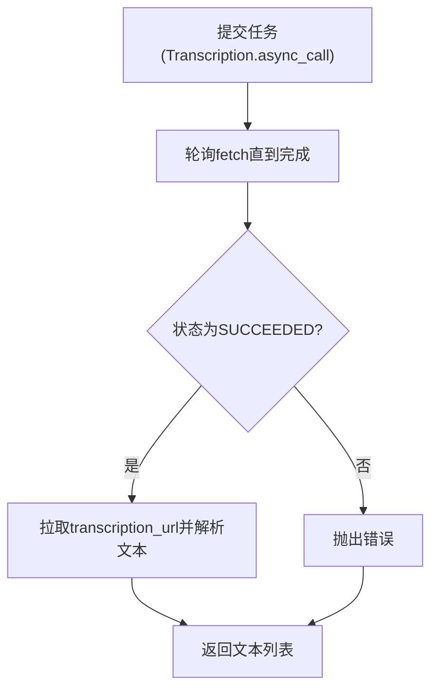
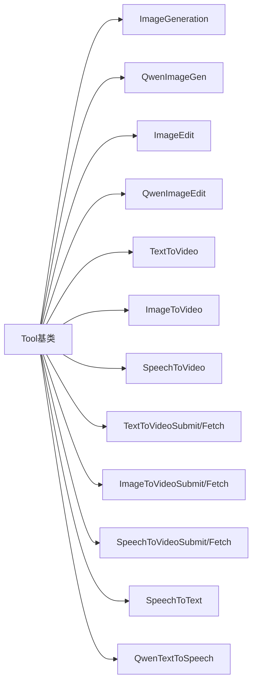

# 生成类工具

<cite>
**本文引用的文件**
- [generations/__init__.py](file://src/agentscope_runtime/tools/generations/__init__.py)
- [base.py](file://src/agentscope_runtime/tools/base.py)
- [image_generation.py](file://src/agentscope_runtime/tools/generations/image_generation.py)
- [qwen_image_generation.py](file://src/agentscope_runtime/tools/generations/qwen_image_generation.py)
- [image_edit.py](file://src/agentscope_runtime/tools/generations/image_edit.py)
- [qwen_image_edit.py](file://src/agentscope_runtime/tools/generations/qwen_image_edit.py)
- [text_to_video.py](file://src/agentscope_runtime/tools/generations/text_to_video.py)
- [image_to_video.py](file://src/agentscope_runtime/tools/generations/image_to_video.py)
- [speech_to_video.py](file://src/agentscope_runtime/tools/generations/speech_to_video.py)
- [async_text_to_video.py](file://src/agentscope_runtime/tools/generations/async_text_to_video.py)
- [async_image_to_video.py](file://src/agentscope_runtime/tools/generations/async_image_to_video.py)
- [async_speech_to_video.py](file://src/agentscope_runtime/tools/generations/async_speech_to_video.py)
- [speech_to_text.py](file://src/agentscope_runtime/tools/generations/speech_to_text.py)
- [qwen_text_to_speech.py](file://src/agentscope_runtime/tools/generations/qwen_text_to_speech.py)
</cite>

## 目录
1. [简介](#简介)
2. [项目结构](#项目结构)
3. [核心组件](#核心组件)
4. [架构总览](#架构总览)
5. [详细组件分析](#详细组件分析)
6. [依赖分析](#依赖分析)
7. [性能考虑](#性能考虑)
8. [故障排查指南](#故障排查指南)
9. [结论](#结论)
10. [附录](#附录)

## 简介
本文件面向生成类工具，系统性梳理图像生成与编辑、视频生成（多模态）、语音合成与识别等能力，覆盖以下工具族：
- 图像生成：ImageGeneration、QwenImageGen
- 图像编辑：ImageEdit、QwenImageEdit
- 视频生成：TextToVideo、ImageToVideo、SpeechToVideo
- 语音合成：QwenTextToSpeech
- 语音识别：SpeechToText
- 异步生成工具：TextToVideoSubmit/Fetch、ImageToVideoSubmit/Fetch、SpeechToVideoSubmit/Fetch

文档重点说明各工具的功能特性、参数配置、使用方法、异步处理机制、错误处理与性能优化策略。

## 项目结构
生成类工具集中于 tools/generations 模块，统一继承基础工具基类 Tool，采用 Pydantic 校验输入输出，通过 DashScope 客户端异步调用实现高性能与可观测性。

图表来源
- [generations/__init__.py:1-76](file://src/agentscope_runtime/tools/generations/__init__.py#L1-L76)
- [base.py:34-265](file://src/agentscope_runtime/tools/base.py#L34-L265)

章节来源
- [generations/__init__.py:1-76](file://src/agentscope_runtime/tools/generations/__init__.py#L1-L76)
- [base.py:34-265](file://src/agentscope_runtime/tools/base.py#L34-L265)

## 核心组件
- 工具基类 Tool：提供泛型输入输出类型、参数 Schema 导出、同步转异步运行、参数校验与返回值序列化等能力。
- 输入/输出模型：均采用 Pydantic BaseModel，字段含中文描述，便于自动生成工具 Schema。
- DashScope 异步客户端：统一通过 AioVideoSynthesis、AioImageSynthesis、Transcription 等异步接口实现并发与低延迟。
- 追踪与日志：集成 trace 注解与 TracingUtil，便于链路追踪与可观测性。

章节来源
- [base.py:34-265](file://src/agentscope_runtime/tools/base.py#L34-L265)
- [image_generation.py:21-203](file://src/agentscope_runtime/tools/generations/image_generation.py#L21-L203)
- [qwen_image_generation.py:18-215](file://src/agentscope_runtime/tools/generations/qwen_image_generation.py#L18-L215)
- [text_to_video.py:21-222](file://src/agentscope_runtime/tools/generations/text_to_video.py#L21-L222)

## 架构总览
生成类工具遵循统一的异步工作流：参数校验 → 提交异步任务 → 轮询任务状态 → 获取结果 → 返回输出。

图表来源
- [text_to_video.py:86-222](file://src/agentscope_runtime/tools/generations/text_to_video.py#L86-L222)
- [image_to_video.py:94-234](file://src/agentscope_runtime/tools/generations/image_to_video.py#L94-L234)
- [speech_to_video.py:148-315](file://src/agentscope_runtime/tools/generations/speech_to_video.py#L148-L315)

## 详细组件分析

### 图像生成工具

#### ImageGeneration（文本到图像）
- 功能要点
  - 支持多分辨率、多数量生成、反向提示词、水印、智能提示扩展等参数。
  - 内置轮询等待任务完成，超时控制与错误处理完善。
- 关键参数
  - prompt、size、negative_prompt、prompt_extend、n、watermark。
- 输出
  - 结果URL列表与 request_id。
- 使用建议
  - 合理设置 n 控制并发与成本；必要时开启 prompt_extend 提升质量。
- 错误处理
  - API密钥缺失、任务提交失败、任务失败/CANCELED、超时均抛出异常。

图表来源
- [image_generation.py:79-203](file://src/agentscope_runtime/tools/generations/image_generation.py#L79-L203)

章节来源
- [image_generation.py:21-203](file://src/agentscope_runtime/tools/generations/image_generation.py#L21-L203)

#### QwenImageGen（通义文生图）
- 功能要点
  - 基于 MultiModalConversation 的文生图能力，支持 negative_prompt、size、n、prompt_extend、watermark。
  - 统一的异步调用与结果解析逻辑。
- 参数与输出
  - 输入：prompt、negative_prompt、size、n、prompt_extend、watermark。
  - 输出：结果URL列表与 request_id。
- 使用建议
  - 对复杂文本建议开启 prompt_extend；注意 size 格式与 n 的取值范围。

章节来源
- [qwen_image_generation.py:18-215](file://src/agentscope_runtime/tools/generations/qwen_image_generation.py#L18-L215)

### 图像编辑工具

#### ImageEdit（图生图编辑）
- 功能要点
  - 支持风格化、局部风格化、描述性编辑、带遮罩描述编辑、去水印、扩图、超分、上色、涂鸦、卡通特征控制等函数。
  - 支持 base_image_url、mask_image_url、prompt、n、watermark。
- 流程
  - 提交任务 → 轮询 → 成功则提取结果URL列表。

图表来源
- [image_edit.py:88-209](file://src/agentscope_runtime/tools/generations/image_edit.py#L88-L209)

章节来源
- [image_edit.py:21-209](file://src/agentscope_runtime/tools/generations/image_edit.py#L21-L209)

#### QwenImageEdit（通义图像编辑）
- 功能要点
  - 以“图像+文本”多模态指令进行编辑，支持 negative_prompt、watermark。
  - 统一的结果解析与 request_id 生成。
- 参数与输出
  - 输入：image_url、prompt、negative_prompt、watermark。
  - 输出：结果URL列表与 request_id。

章节来源
- [qwen_image_edit.py:18-206](file://src/agentscope_runtime/tools/generations/qwen_image_edit.py#L18-L206)

### 视频生成工具

#### TextToVideo（文本到视频）
- 功能要点
  - 文本驱动的无声视频生成，支持分辨率、时长、反向提示词、水印、智能提示扩展。
  - 异步提交与轮询，较长超时时间（10分钟）。
- 参数与输出
  - 输入：prompt、negative_prompt、size、duration、prompt_extend、watermark。
  - 输出：video_url 与 request_id。

章节来源
- [text_to_video.py:21-222](file://src/agentscope_runtime/tools/generations/text_to_video.py#L21-L222)

#### ImageToVideo（图像到视频）
- 功能要点
  - 基于首帧图像与可选文本生成5秒无声视频，支持特效模板、分辨率与时长。
- 参数与输出
  - 输入：image_url、prompt、negative_prompt、template、resolution、duration、prompt_extend、watermark。
  - 输出：video_url 与 request_id。

章节来源
- [image_to_video.py:21-234](file://src/agentscope_runtime/tools/generations/image_to_video.py#L21-L234)

#### SpeechToVideo（语音到视频）
- 功能要点
  - 基于静态图像与音频生成“对口型/表演”视频，支持分辨率选择。
  - 使用 BaseAsyncAioApi 的通用异步接口，返回中包含 usage.duration 用于计费。
- 参数与输出
  - 输入：image_url、audio_url、resolution。
  - 输出：video_url、request_id、video_duration。

图表来源
- [speech_to_video.py:148-315](file://src/agentscope_runtime/tools/generations/speech_to_video.py#L148-L315)

章节来源
- [speech_to_video.py:21-315](file://src/agentscope_runtime/tools/generations/speech_to_video.py#L21-L315)

### 异步生成工具（提交与获取）

#### TextToVideoSubmit/Fetch
- 提交流程
  - 提交任务，返回 task_id 与 task_status。
- 获取流程
  - 通过 task_id 查询，返回 video_url、task_status、request_id。
- 适用场景
  - 需要后台长时间任务与后续轮询的场景。

章节来源
- [async_text_to_video.py:77-321](file://src/agentscope_runtime/tools/generations/async_text_to_video.py#L77-L321)

#### ImageToVideoSubmit/Fetch
- 提交流程
  - 提交图像到视频任务，返回 task_id 与 task_status。
- 获取流程
  - 通过 task_id 查询，返回 video_url、task_status、request_id。

章节来源
- [async_image_to_video.py:91-351](file://src/agentscope_runtime/tools/generations/async_image_to_video.py#L91-L351)

#### SpeechToVideoSubmit/Fetch
- 提交流程
  - 提交语音到视频任务，返回 task_id 与 task_status。
- 获取流程
  - 通过 task_id 查询，返回 video_url、task_status、request_id、video_duration。

章节来源
- [async_speech_to_video.py:72-423](file://src/agentscope_runtime/tools/generations/async_speech_to_video.py#L72-L423)

### 语音合成与识别

#### QwenTextToSpeech（通义语音合成）
- 功能要点
  - 将文本合成为音频，支持 voice 选择。
- 输出
  - audio_url 与 request_id。

章节来源
- [qwen_text_to_speech.py:17-155](file://src/agentscope_runtime/tools/generations/qwen_text_to_speech.py#L17-L155)

#### SpeechToText（录音文件识别）
- 功能要点
  - 批量音频文件识别，支持语言提示（paraformer-v2）。
  - 先提交任务，再轮询至完成，最后从 transcription_url 拉取结果。
- 输出
  - 每个文件对应的识别文本列表与 request_id。

图表来源
- [speech_to_text.py:74-261](file://src/agentscope_runtime/tools/generations/speech_to_text.py#L74-L261)

章节来源
- [speech_to_text.py:23-261](file://src/agentscope_runtime/tools/generations/speech_to_text.py#L23-L261)

## 依赖分析
- 统一依赖
  - DashScope 异步客户端：AioVideoSynthesis、AioImageSynthesis、Transcription、SpeechSynthesizer。
  - Pydantic：参数与返回值的强类型校验与 Schema 导出。
  - 工具基类 Tool：统一的异步运行、参数校验、返回值序列化与函数 Schema。
- 可观测性
  - trace 注解与 TracingUtil：记录关键步骤与 payload，便于问题定位。
- 异步与并发
  - asyncio.sleep 轮询与 fetch 查询，避免阻塞主线程。
  - 超时控制与错误分支，保障稳定性。

图表来源
- [base.py:34-265](file://src/agentscope_runtime/tools/base.py#L34-L265)
- [generations/__init__.py:1-76](file://src/agentscope_runtime/tools/generations/__init__.py#L1-L76)

章节来源
- [base.py:34-265](file://src/agentscope_runtime/tools/base.py#L34-L265)
- [generations/__init__.py:1-76](file://src/agentscope_runtime/tools/generations/__init__.py#L1-L76)

## 性能考虑
- 并发与轮询
  - 使用异步客户端与 asyncio.sleep 实现非阻塞轮询，降低等待开销。
  - 合理设置轮询间隔与最大等待时间，平衡响应速度与资源占用。
- 资源管理
  - 控制 n 与批量规模，避免一次性提交过多任务导致限流或超时。
  - 对于长耗时任务（视频生成），优先使用异步提交/获取模式，减少前端阻塞。
- 模型与参数
  - 合理选择分辨率与时长，兼顾质量与成本。
  - 在需要高质量时启用 prompt_extend，但注意可能增加等待时间。
- 错误与重试
  - 对 FAILED/CANCELED 与超时进行显式处理，必要时进行有限重试或降级策略。

## 故障排查指南
- 常见错误类型
  - API密钥无效或未设置：抛出 ValueError。
  - 任务提交失败：检查参数与网络，确认 status_code 与 output。
  - 任务失败/CANCELED：查看服务端返回的错误信息与 task_status。
  - 超时：调整轮询间隔与最大等待时间，或切换异步提交/获取模式。
- 排查步骤
  - 开启 trace 日志，定位具体步骤与 payload。
  - 校验输入参数（URL格式、分辨率范围、Token长度等）。
  - 对于 SpeechToText，确认 transcription_url 可访问且返回 JSON。
- 建议
  - 对外暴露统一的错误码与用户提示，避免泄露内部细节。
  - 记录 request_id，便于跨系统追踪。

章节来源
- [image_generation.py:106-181](file://src/agentscope_runtime/tools/generations/image_generation.py#L106-L181)
- [text_to_video.py:148-193](file://src/agentscope_runtime/tools/generations/text_to_video.py#L148-L193)
- [speech_to_video.py:203-261](file://src/agentscope_runtime/tools/generations/speech_to_video.py#L203-L261)
- [speech_to_text.py:127-200](file://src/agentscope_runtime/tools/generations/speech_to_text.py#L127-L200)

## 结论
本套生成类工具以 Tool 基类为核心，统一了参数校验、异步调用、轮询与结果解析流程，覆盖图像生成/编辑、视频生成（文本/图像/语音驱动）以及语音合成/识别。通过异步提交与获取模式，满足长耗时任务的生产可用性；通过 trace 与 request_id，提供良好的可观测性与可追溯性。建议在实际使用中结合业务场景合理配置参数、控制并发与超时，并建立完善的错误处理与监控告警机制。

## 附录

### 工具与参数速览
- 图像生成
  - ImageGeneration：prompt、size、negative_prompt、prompt_extend、n、watermark
  - QwenImageGen：prompt、negative_prompt、size、n、prompt_extend、watermark
- 图像编辑
  - ImageEdit：function、base_image_url、mask_image_url、prompt、n、watermark
  - QwenImageEdit：image_url、prompt、negative_prompt、watermark
- 视频生成
  - TextToVideo：prompt、negative_prompt、size、duration、prompt_extend、watermark
  - ImageToVideo：image_url、prompt、negative_prompt、template、resolution、duration、prompt_extend、watermark
  - SpeechToVideo：image_url、audio_url、resolution
- 异步视频生成
  - TextToVideoSubmit/Fetch：task_id
  - ImageToVideoSubmit/Fetch：task_id
  - SpeechToVideoSubmit/Fetch：task_id
- 语音
  - SpeechToText：file_urls、language_hints
  - QwenTextToSpeech：text、voice