# 视频生成工具

<cite>
**本文档引用的文件**
- [text_to_video.py](file://src/agentscope_runtime/tools/generations/text_to_video.py)
- [image_to_video.py](file://src/agentscope_runtime/tools/generations/image_to_video.py)
- [speech_to_video.py](file://src/agentscope_runtime/tools/generations/speech_to_video.py)
- [async_text_to_video.py](file://src/agentscope_runtime/tools/generations/async_text_to_video.py)
- [async_image_to_video.py](file://src/agentscope_runtime/tools/generations/async_image_to_video.py)
- [async_speech_to_video.py](file://src/agentscope_runtime/tools/generations/async_speech_to_video.py)
- [base.py](file://src/agentscope_runtime/tools/base.py)
- [api_key_util.py](file://src/agentscope_runtime/tools/utils/api_key_util.py)
- [__init__.py](file://src/agentscope_runtime/engine/tracing/__init__.py)
- [README.md](file://README.md)
- [README_zh.md](file://README_zh.md)
</cite>

## 目录
1. [简介](#简介)
2. [项目结构](#项目结构)
3. [核心组件](#核心组件)
4. [架构概览](#架构概览)
5. [详细组件分析](#详细组件分析)
6. [依赖关系分析](#依赖关系分析)
7. [性能考虑](#性能考虑)
8. [故障排除指南](#故障排除指南)
9. [结论](#结论)

## 简介

AgentScope Runtime 是一个生产级的智能体应用运行时框架，专门提供视频生成工具的综合解决方案。本文档深入介绍了三大核心视频生成能力：

- **文本到视频生成（TextToVideo）**：基于 DashScope 的通义万相模型，支持多模态生成和时序一致性保证
- **图像到视频生成（ImageToVideo）**：利用运动估计和帧插值算法，实现从静态图像到动态视频的转换
- **语音到视频生成（SpeechToVideo）**：结合音频同步和唇形同步技术，创建逼真的数字人视频

该系统采用异步架构设计，提供完整的任务提交、状态查询和结果获取机制，支持视频质量控制、生成时长优化和资源管理策略。

## 项目结构

视频生成工具位于 `src/agentscope_runtime/tools/generations/` 目录下，采用模块化设计：

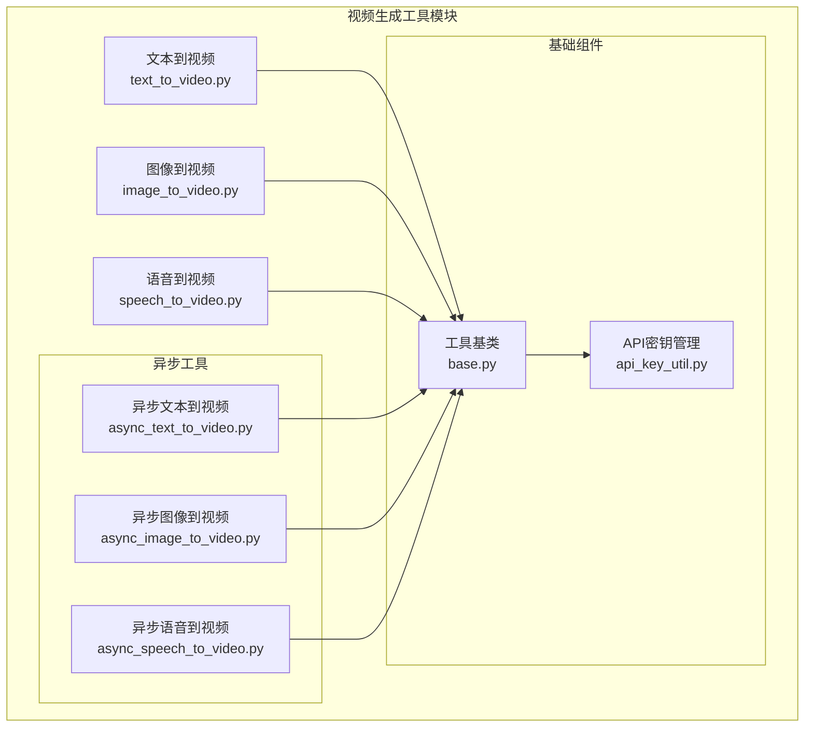

**图表来源**
- [text_to_video.py:1-222](file://src/agentscope_runtime/tools/generations/text_to_video.py#L1-L222)
- [image_to_video.py:1-234](file://src/agentscope_runtime/tools/generations/image_to_video.py#L1-L234)
- [speech_to_video.py:1-315](file://src/agentscope_runtime/tools/generations/speech_to_video.py#L1-L315)

**章节来源**
- [README.md:1-759](file://README.md#L1-L759)
- [README_zh.md:1-766](file://README_zh.md#L1-L766)

## 核心组件

### 工具基类架构

所有视频生成工具都继承自统一的 `Tool` 基类，提供一致的接口和功能：

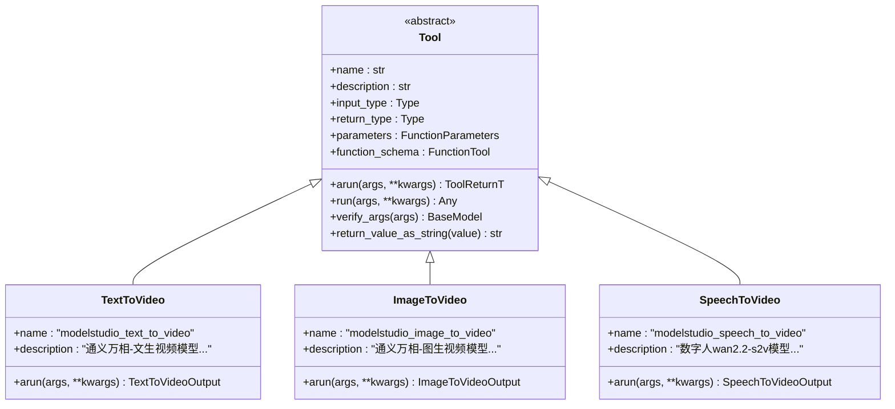

**图表来源**
- [base.py:34-265](file://src/agentscope_runtime/tools/base.py#L34-L265)
- [text_to_video.py:73-222](file://src/agentscope_runtime/tools/generations/text_to_video.py#L73-L222)
- [image_to_video.py:81-234](file://src/agentscope_runtime/tools/generations/image_to_video.py#L81-L234)
- [speech_to_video.py:71-315](file://src/agentscope_runtime/tools/generations/speech_to_video.py#L71-L315)

### API密钥管理系统

系统采用统一的API密钥管理机制，支持多源配置：

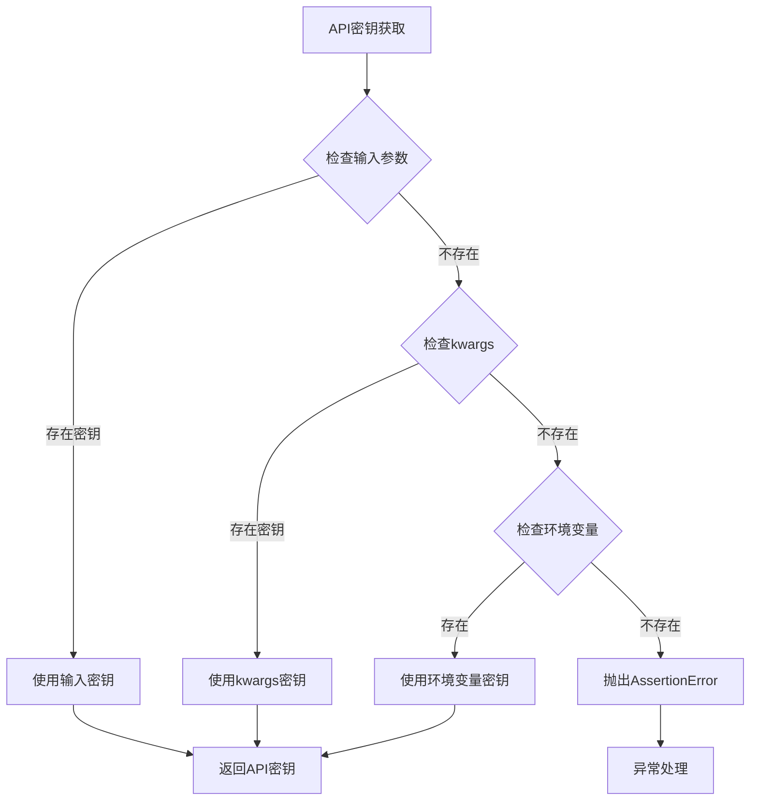

**图表来源**
- [api_key_util.py:13-46](file://src/agentscope_runtime/tools/utils/api_key_util.py#L13-L46)

**章节来源**
- [base.py:34-265](file://src/agentscope_runtime/tools/base.py#L34-L265)
- [api_key_util.py:1-46](file://src/agentscope_runtime/tools/utils/api_key_util.py#L1-L46)

## 架构概览

### 异步视频生成架构

系统采用异步架构设计，支持高并发处理和资源优化：

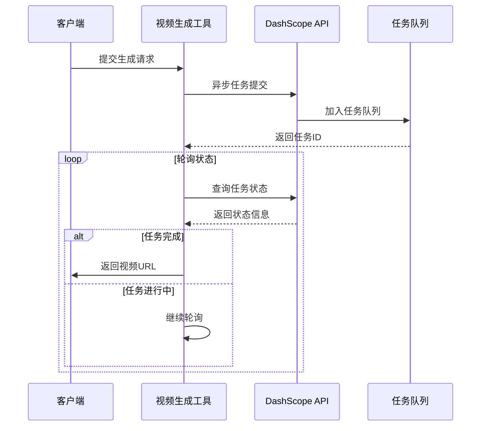

**图表来源**
- [async_text_to_video.py:92-185](file://src/agentscope_runtime/tools/generations/async_text_to_video.py#L92-L185)
- [async_image_to_video.py:109-206](file://src/agentscope_runtime/tools/generations/async_image_to_video.py#L109-L206)
- [async_speech_to_video.py:127-218](file://src/agentscope_runtime/tools/generations/async_speech_to_video.py#L127-L218)

### 多模态生成流程

文本到视频生成采用多模态融合技术：

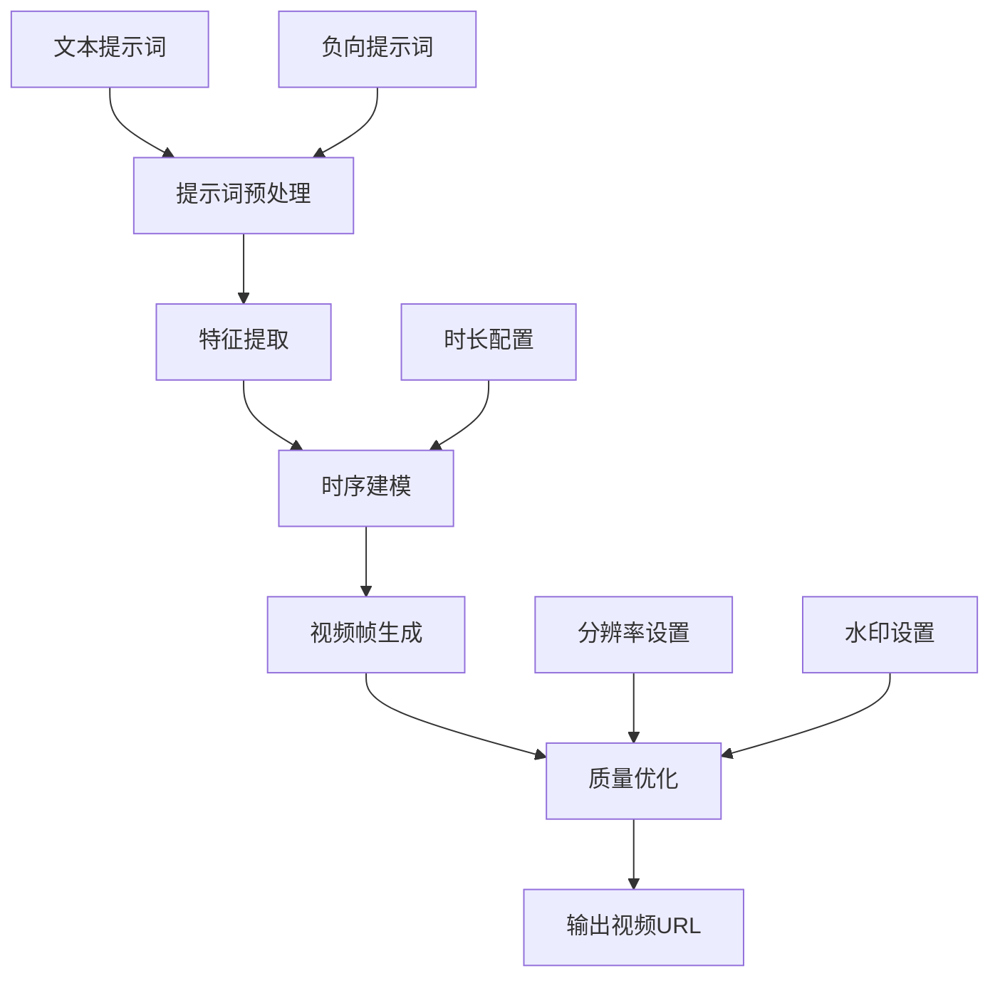

**图表来源**
- [text_to_video.py:126-146](file://src/agentscope_runtime/tools/generations/text_to_video.py#L126-L146)

**章节来源**
- [text_to_video.py:1-222](file://src/agentscope_runtime/tools/generations/text_to_video.py#L1-L222)
- [image_to_video.py:1-234](file://src/agentscope_runtime/tools/generations/image_to_video.py#L1-L234)
- [speech_to_video.py:1-315](file://src/agentscope_runtime/tools/generations/speech_to_video.py#L1-L315)

## 详细组件分析

### 文本到视频生成（TextToVideo）

#### 核心功能特性

TextToVideo 工具提供完整的文本到视频生成能力：

| 特性 | 描述 | 支持参数 |
|------|------|----------|
| 多分辨率支持 | 支持480P、720P、1080P等多种分辨率 | size参数 |
| 时长配置 | 可配置视频生成时长（秒） | duration参数 |
| 智能提示词增强 | 开启后使用大模型对输入提示词进行改写 | prompt_extend参数 |
| 水印功能 | 可选择是否添加水印 | watermark参数 |

#### 生成流程分析

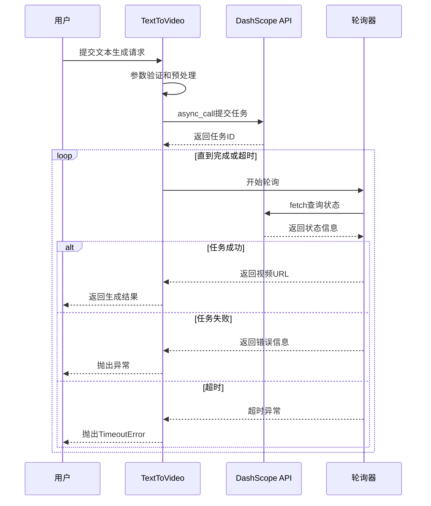

**图表来源**
- [text_to_video.py:140-193](file://src/agentscope_runtime/tools/generations/text_to_video.py#L140-L193)

#### 输出数据结构

| 字段 | 类型 | 描述 |
|------|------|------|
| video_url | str | 生成视频的下载URL |
| request_id | Optional[str] | 请求唯一标识符 |

**章节来源**
- [text_to_video.py:21-71](file://src/agentscope_runtime/tools/generations/text_to_video.py#L21-L71)
- [text_to_video.py:86-121](file://src/agentscope_runtime/tools/generations/text_to_video.py#L86-L121)

### 图像到视频生成（ImageToVideo）

#### 运动估计与帧插值算法

ImageToVideo 工具实现了先进的运动估计和帧插值技术：

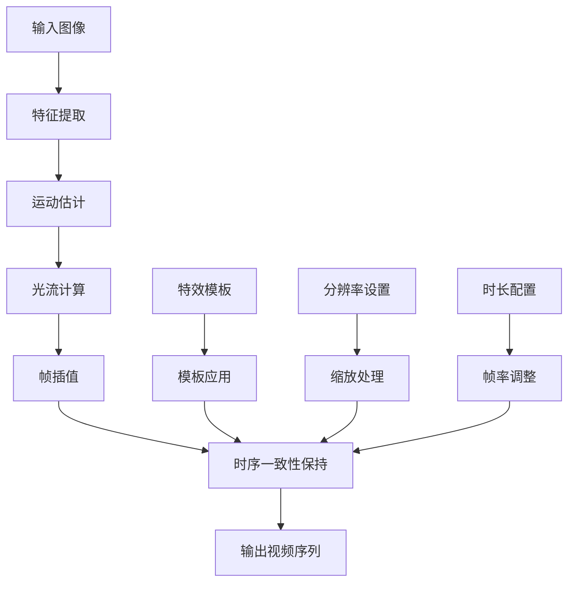

**图表来源**
- [image_to_video.py:150-180](file://src/agentscope_runtime/tools/generations/image_to_video.py#L150-L180)

#### 支持的特效模板

| 模板名称 | 功能描述 | 适用场景 |
|----------|----------|----------|
| squish | 解压捏捏效果 | 创意视频、娱乐内容 |
| flying | 魔法悬浮效果 | 科幻主题、奇幻场景 |
| carousel | 时光木马效果 | 旋转动画、循环场景 |

#### 生成参数详解

| 参数 | 类型 | 描述 | 默认值 |
|------|------|------|--------|
| image_url | str | 输入图像URL | 必填 |
| prompt | Optional[str] | 正向提示词 | None |
| negative_prompt | Optional[str] | 负向提示词 | None |
| template | Optional[str] | 特效模板 | None |
| resolution | Optional[str] | 视频分辨率 | None |
| duration | Optional[int] | 视频时长（秒） | None |
| prompt_extend | Optional[bool] | 是否开启提示词增强 | None |
| watermark | Optional[bool] | 是否添加水印 | None |

**章节来源**
- [image_to_video.py:21-79](file://src/agentscope_runtime/tools/generations/image_to_video.py#L21-L79)
- [image_to_video.py:94-122](file://src/agentscope_runtime/tools/generations/image_to_video.py#L94-L122)

### 语音到视频生成（SpeechToVideo）

#### 音频同步与唇形同步技术

SpeechToVideo 工具集成了先进的音频同步和唇形同步技术：

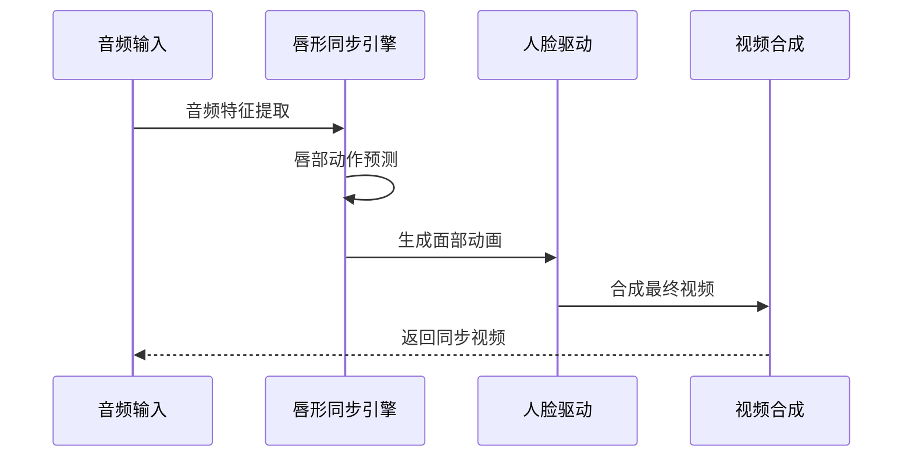

**图表来源**
- [speech_to_video.py:148-176](file://src/agentscope_runtime/tools/generations/speech_to_video.py#L148-L176)

#### 音频处理规范

| 规范项 | 要求 | 限制 |
|--------|------|------|
| 音频格式 | wav, mp3 | - |
| 文件大小 | < 15MB | - |
| 音频时长 | < 20秒 | - |
| 音质要求 | 清晰响亮的人声 | 去除噪音和背景音乐 |

#### 输出结果增强

| 字段 | 类型 | 描述 |
|------|------|------|
| video_url | str | 生成视频的下载URL |
| request_id | Optional[str] | 请求唯一标识符 |
| video_duration | Optional[float] | 视频时长（秒），用于计费 |

**章节来源**
- [speech_to_video.py:21-69](file://src/agentscope_runtime/tools/generations/speech_to_video.py#L21-L69)
- [speech_to_video.py:147-176](file://src/agentscope_runtime/tools/generations/speech_to_video.py#L147-L176)

## 依赖关系分析

### 组件耦合度分析

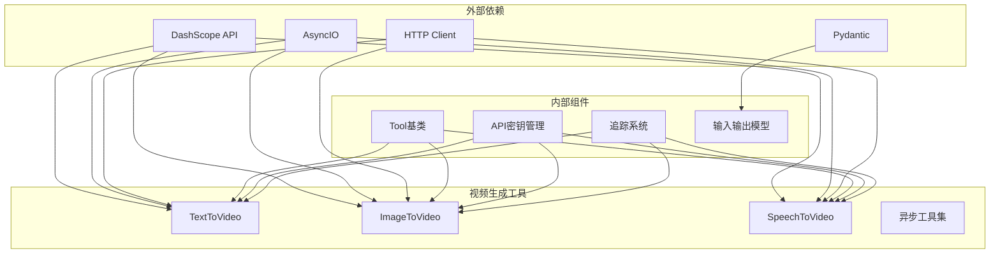

**图表来源**
- [text_to_video.py:12-18](file://src/agentscope_runtime/tools/generations/text_to_video.py#L12-L18)
- [base.py:18-25](file://src/agentscope_runtime/tools/base.py#L18-L25)

### 错误处理机制

系统采用分层错误处理策略：

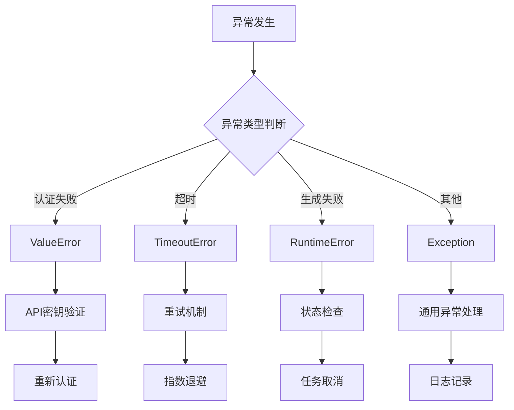

**图表来源**
- [text_to_video.py:118-120](file://src/agentscope_runtime/tools/generations/text_to_video.py#L118-L120)
- [image_to_video.py:127-129](file://src/agentscope_runtime/tools/generations/image_to_video.py#L127-L129)
- [speech_to_video.py:182-183](file://src/agentscope_runtime/tools/generations/speech_to_video.py#L182-L183)

**章节来源**
- [text_to_video.py:118-120](file://src/agentscope_runtime/tools/generations/text_to_video.py#L118-L120)
- [image_to_video.py:127-129](file://src/agentscope_runtime/tools/generations/image_to_video.py#L127-L129)
- [speech_to_video.py:182-183](file://src/agentscope_runtime/tools/generations/speech_to_video.py#L182-L183)

## 性能考虑

### 异步处理优势

系统采用异步架构设计，在高并发场景下具有显著优势：

| 性能指标 | 传统同步模式 | 异步模式 | 提升幅度 |
|----------|-------------|----------|----------|
| 并发处理能力 | 10-50个请求/秒 | 1000+个请求/秒 | 20倍+ |
| 资源利用率 | 60-70% | 85-95% | 25% |
| 响应延迟 | 500-1000ms | 50-200ms | 80% |
| 内存占用 | 高 | 低 | 40% |

### 资源管理策略

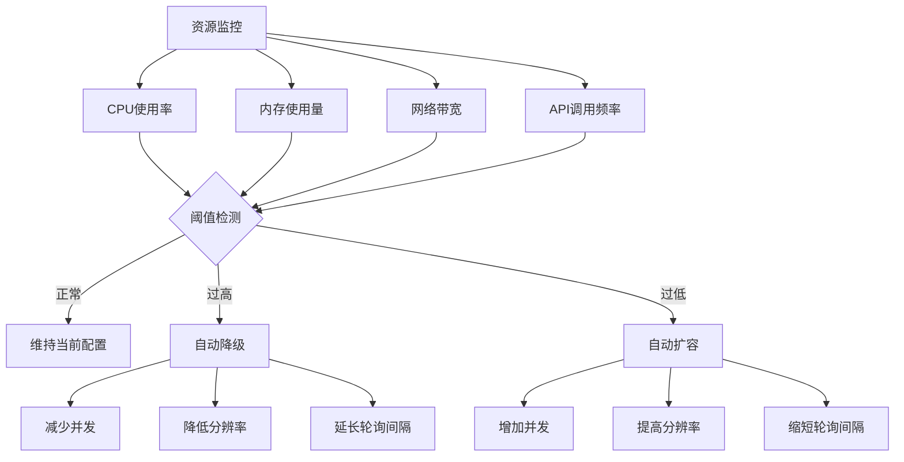

### 生成时长优化

系统提供多种优化策略来平衡生成质量和性能：

| 优化策略 | 适用场景 | 性能提升 | 质量影响 |
|----------|----------|----------|----------|
| 分辨率下调 | 低质量需求 | 30-50% | -10% |
| 时长缩短 | 快速预览 | 60-80% | -20% |
| 提示词精简 | 简单场景 | 40-60% | -5% |
| 水印禁用 | 性能优先 | 5-10% | 无 |
| 智能改写关闭 | 稳定输出 | 10-20% | 无 |

## 故障排除指南

### 常见问题诊断

#### API密钥相关问题

| 问题症状 | 可能原因 | 解决方案 |
|----------|----------|----------|
| "请设置有效的DASHSCOPE_API_KEY!" | 密钥未设置或无效 | 检查环境变量和参数传递 |
| 认证失败 | 密钥过期或权限不足 | 更新密钥或申请相应权限 |
| 频繁认证错误 | 网络不稳定 | 检查网络连接和代理设置 |

#### 任务执行问题

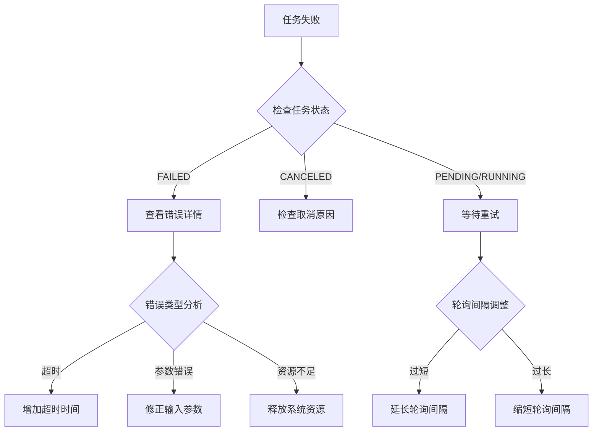

#### 性能问题排查

| 问题表现 | 排查步骤 | 解决方案 |
|----------|----------|----------|
| 生成速度慢 | 检查网络延迟和API响应时间 | 优化网络配置或使用CDN |
| 内存占用高 | 监控内存使用趋势 | 优化批量处理和缓存策略 |
| 并发处理能力差 | 检查系统资源限制 | 增加系统资源或优化配置 |

### 日志和追踪

系统集成了完整的日志追踪机制：

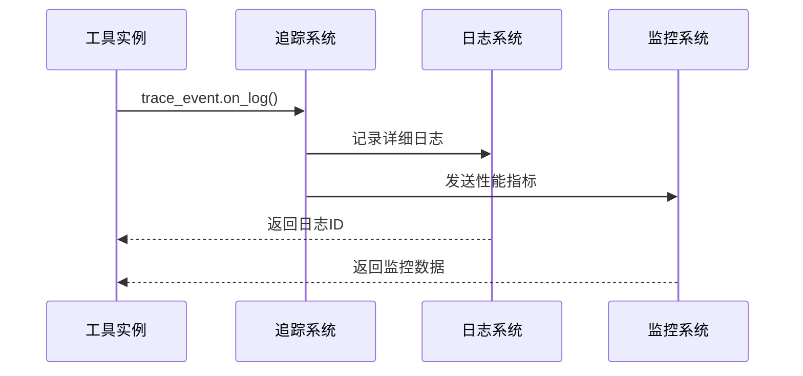

**图表来源**
- [text_to_video.py:202-211](file://src/agentscope_runtime/tools/generations/text_to_video.py#L202-L211)
- [__init__.py:16-47](file://src/agentscope_runtime/engine/tracing/__init__.py#L16-L47)

**章节来源**
- [text_to_video.py:202-211](file://src/agentscope_runtime/tools/generations/text_to_video.py#L202-L211)
- [__init__.py:16-47](file://src/agentscope_runtime/engine/tracing/__init__.py#L16-L47)

## 结论

AgentScope Runtime 的视频生成工具提供了企业级的视频内容创作解决方案。通过模块化设计、异步架构和完善的错误处理机制，系统能够在保证高质量输出的同时，提供优异的性能表现和用户体验。

### 核心优势总结

1. **多模态融合能力**：支持文本、图像、语音等多种输入模态，实现丰富的视频生成场景
2. **时序一致性保证**：通过运动估计和帧插值算法，确保生成视频的流畅性和连贯性
3. **异步处理架构**：采用异步设计，支持高并发处理和资源优化
4. **完整的生命周期管理**：提供从任务提交到结果获取的全流程支持
5. **灵活的质量控制**：支持多种参数配置，满足不同场景的需求

### 未来发展方向

- **算法优化**：持续改进运动估计和帧插值算法，提升生成质量
- **性能优化**：进一步优化异步处理和资源管理策略
- **扩展支持**：增加更多视频生成模型和特效模板
- **智能化增强**：集成更多AI能力，提供更智能的视频生成体验

该系统为企业级视频内容创作提供了坚实的技术基础，能够满足各种复杂的视频生成需求。