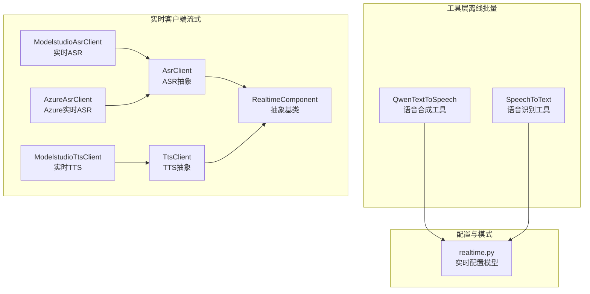
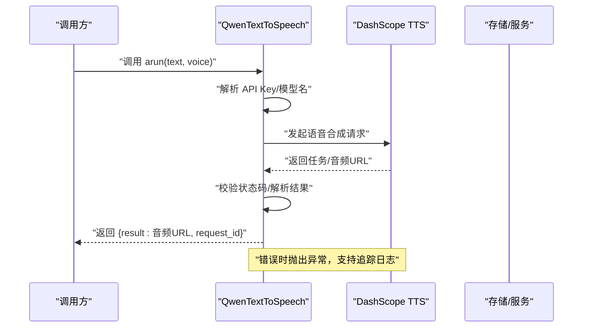
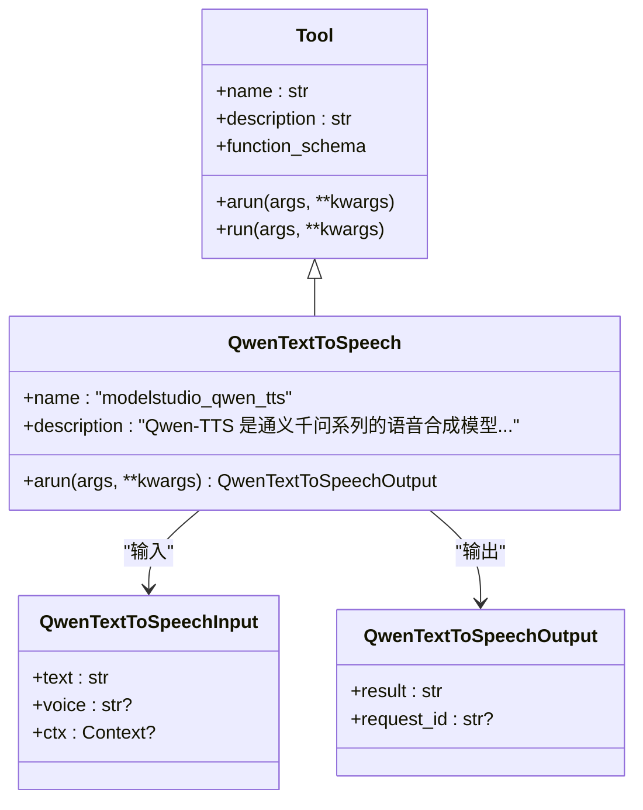
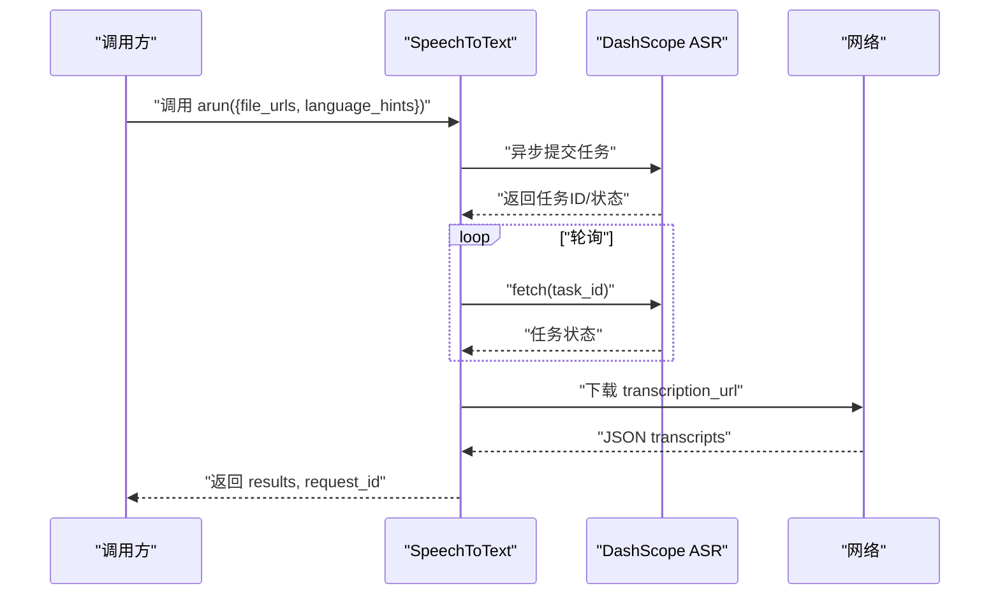
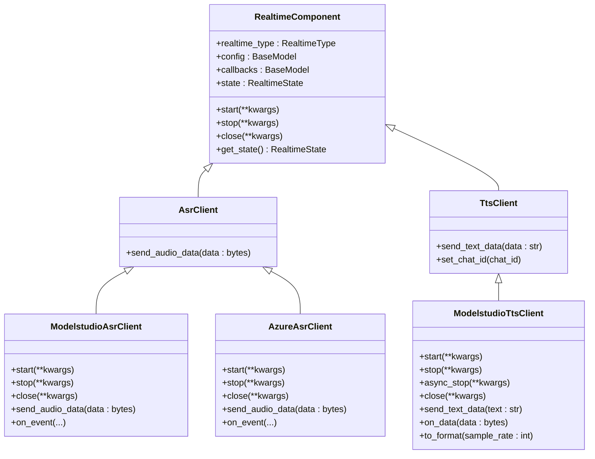
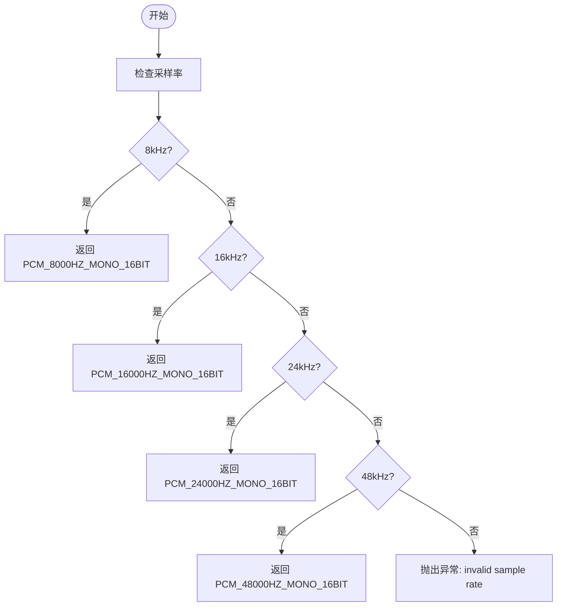
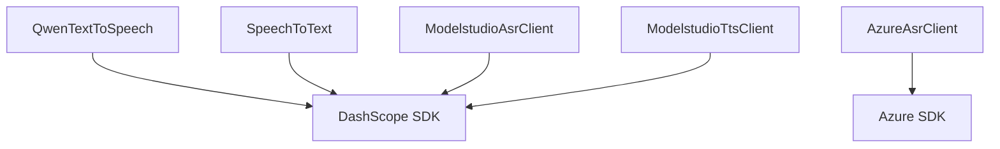

# 语音合成与识别工具

<cite>
**本文引用的文件**   
- [qwen_text_to_speech.py](file://src/agentscope_runtime/tools/generations/qwen_text_to_speech.py)
- [speech_to_text.py](file://src/agentscope_runtime/tools/generations/speech_to_text.py)
- [base.py](file://src/agentscope_runtime/tools/base.py)
- [realtime_tool.py](file://src/agentscope_runtime/tools/realtime_clients/realtime_tool.py)
- [asr_client.py](file://src/agentscope_runtime/tools/realtime_clients/asr_client.py)
- [tts_client.py](file://src/agentscope_runtime/tools/realtime_clients/tts_client.py)
- [modelstudio_asr_client.py](file://src/agentscope_runtime/tools/realtime_clients/modelstudio_asr_client.py)
- [modelstudio_tts_client.py](file://src/agentscope_runtime/tools/realtime_clients/modelstudio_tts_client.py)
- [azure_asr_client.py](file://src/agentscope_runtime/tools/realtime_clients/azure_asr_client.py)
- [realtime.py](file://src/agentscope_runtime/engine/schemas/realtime.py)
- [test_tts.py](file://tests/tools/test_tts.py)
- [test_asr.py](file://tests/tools/test_asr.py)
- [realtime_clients.md](file://cookbook/zh/tools/realtime_clients.md)
</cite>

## 目录
1. [简介](#简介)
2. [项目结构](#项目结构)
3. [核心组件](#核心组件)
4. [架构总览](#架构总览)
5. [详细组件分析](#详细组件分析)
6. [依赖分析](#依赖分析)
7. [性能考虑](#性能考虑)
8. [故障排查指南](#故障排查指南)
9. [结论](#结论)
10. [附录](#附录)

## 简介
本文件面向“语音合成与识别工具”的使用者与开发者，系统化梳理以下能力与接口：
- 语音合成（Text-to-Speech, TTS）：基于 Qwen 的离线批量合成工具，支持文本输入、音色选择、请求追踪与结果回传。
- 语音识别（Automatic Speech Recognition, ASR）：基于 DashScope Paraformer 的离线批量识别工具，支持多文件批量识别、任务轮询与结果提取。
- 实时语音（流式）：提供基于 ModelStudio 与 Azure 的实时 ASR/TTS 客户端，支持采样率、格式、通道数、VAD 超时等参数配置，以及回调事件驱动的数据流处理。

文档同时覆盖音频格式支持、采样率配置、延迟控制机制、质量评估方法、参数调优与性能优化建议，帮助在不同场景下获得稳定、高质量的语音体验。

## 项目结构
围绕语音能力的关键模块分布如下：
- 工具层（离线批量）：生成类工具（TTS/ASR），封装 DashScope API，统一输入输出与错误处理。
- 实时客户端（流式）：ASR/TTS 两类实时客户端，分别对接 ModelStudio 与 Azure，支持回调事件与状态机。
- 配置与模式：实时配置模型（采样率、格式、通道、VAD 超时等），定义供应商枚举与事件类型。
- 测试与示例：提供端到端测试脚本，演示实时客户端的启动、发送音频/文本、停止与关闭流程。

图表来源
- [qwen_text_to_speech.py:1-155](file://src/agentscope_runtime/tools/generations/qwen_text_to_speech.py#L1-L155)
- [speech_to_text.py:1-261](file://src/agentscope_runtime/tools/generations/speech_to_text.py#L1-L261)
- [realtime_tool.py:1-56](file://src/agentscope_runtime/tools/realtime_clients/realtime_tool.py#L1-L56)
- [asr_client.py:1-28](file://src/agentscope_runtime/tools/realtime_clients/asr_client.py#L1-L28)
- [tts_client.py:1-34](file://src/agentscope_runtime/tools/realtime_clients/tts_client.py#L1-L34)
- [modelstudio_asr_client.py:1-152](file://src/agentscope_runtime/tools/realtime_clients/modelstudio_asr_client.py#L1-L152)
- [modelstudio_tts_client.py:1-200](file://src/agentscope_runtime/tools/realtime_clients/modelstudio_tts_client.py#L1-L200)
- [azure_asr_client.py:1-196](file://src/agentscope_runtime/tools/realtime_clients/azure_asr_client.py#L1-L196)
- [realtime.py:1-255](file://src/agentscope_runtime/engine/schemas/realtime.py#L1-L255)

章节来源
- [qwen_text_to_speech.py:1-155](file://src/agentscope_runtime/tools/generations/qwen_text_to_speech.py#L1-L155)
- [speech_to_text.py:1-261](file://src/agentscope_runtime/tools/generations/speech_to_text.py#L1-L261)
- [realtime_tool.py:1-56](file://src/agentscope_runtime/tools/realtime_clients/realtime_tool.py#L1-L56)
- [realtime.py:1-255](file://src/agentscope_runtime/engine/schemas/realtime.py#L1-L255)

## 核心组件
- QwenTextToSpeech（离线批量合成）
  - 输入：文本、可选音色；输出：音频 URL、请求 ID；通过 DashScope 语音合成服务调用，支持请求追踪与错误处理。
  - 关键点：API Key 来源、模型名环境变量、响应解析与异常抛出。
- SpeechToText（离线批量识别）
  - 输入：音频 URL 列表、可选语言提示；输出：逐文件识别文本列表；内部使用异步提交+轮询获取任务结果。
  - 关键点：任务状态轮询、超时控制、结果提取与错误处理。
- 实时客户端（流式）
  - 抽象基类：RealtimeComponent 定义状态机（空闲/运行）、类型枚举（TTS/ASR/语音/视频）。
  - ModelStudio 实时：ModelstudioAsrClient/ModelstudioTtsClient，支持采样率映射、回调事件、首包延迟统计。
  - Azure 实时：AzureAsrClient，支持 VAD 超时、初始静音超时、语言设置、连续识别会话事件回调。

章节来源
- [qwen_text_to_speech.py:53-155](file://src/agentscope_runtime/tools/generations/qwen_text_to_speech.py#L53-L155)
- [speech_to_text.py:61-261](file://src/agentscope_runtime/tools/generations/speech_to_text.py#L61-L261)
- [realtime_tool.py:21-56](file://src/agentscope_runtime/tools/realtime_clients/realtime_tool.py#L21-L56)
- [modelstudio_asr_client.py:34-152](file://src/agentscope_runtime/tools/realtime_clients/modelstudio_asr_client.py#L34-L152)
- [modelstudio_tts_client.py:34-200](file://src/agentscope_runtime/tools/realtime_clients/modelstudio_tts_client.py#L34-L200)
- [azure_asr_client.py:33-196](file://src/agentscope_runtime/tools/realtime_clients/azure_asr_client.py#L33-L196)

## 架构总览
离线批量与实时流式两条路径并行：
- 离线路径：工具类封装 DashScope API，完成请求、校验、解析与追踪。
- 实时路径：客户端负责音频/文本流的发送、状态切换与事件回调，配置模型统一参数来源与默认值。

图表来源
- [qwen_text_to_speech.py:64-155](file://src/agentscope_runtime/tools/generations/qwen_text_to_speech.py#L64-L155)

章节来源
- [qwen_text_to_speech.py:64-155](file://src/agentscope_runtime/tools/generations/qwen_text_to_speech.py#L64-L155)

## 详细组件分析

### 语音合成工具（QwenTextToSpeech）
- 功能要点
  - 文本输入：支持中文、英文、中英混合，Token 长度上限约束。
  - 音色选择：通过 voice 参数选择不同音色。
  - 模型与密钥：模型名可由环境变量或参数指定；API Key 通过工具统一获取。
  - 结果与追踪：返回音频 URL 与请求 ID；支持追踪事件记录。
- 错误处理
  - API Key 缺失或无效时抛出值错误；
  - API 调用失败或响应异常时抛出运行时错误；
  - 响应解析失败时抛出运行时错误。
- 性能与可用性
  - 采用异步调用与统一追踪，便于问题定位与指标采集。

图表来源
- [base.py:34-265](file://src/agentscope_runtime/tools/base.py#L34-L265)
- [qwen_text_to_speech.py:17-51](file://src/agentscope_runtime/tools/generations/qwen_text_to_speech.py#L17-L51)
- [qwen_text_to_speech.py:53-155](file://src/agentscope_runtime/tools/generations/qwen_text_to_speech.py#L53-L155)

章节来源
- [qwen_text_to_speech.py:17-155](file://src/agentscope_runtime/tools/generations/qwen_text_to_speech.py#L17-L155)
- [base.py:34-265](file://src/agentscope_runtime/tools/base.py#L34-L265)

### 语音识别工具（SpeechToText）
- 功能要点
  - 输入：音频 URL 列表；可选语言提示（paraformer-v2 模型适用）。
  - 批量识别：支持单文件与多文件识别，返回每文件对应的文本。
  - 任务轮询：异步提交任务后定时轮询，直到成功或失败。
- 错误处理
  - 提交任务失败、获取结果失败、任务状态异常均抛出运行时错误；
  - 超时控制：最大等待时间与轮询间隔可配置。
- 结果提取
  - 从 transcription_url 获取 JSON，解析 transcripts 并拼接文本。

图表来源
- [speech_to_text.py:74-261](file://src/agentscope_runtime/tools/generations/speech_to_text.py#L74-L261)

章节来源
- [speech_to_text.py:74-261](file://src/agentscope_runtime/tools/generations/speech_to_text.py#L74-L261)

### 实时语音（ASR/TTS）
- 抽象基类与状态机
  - RealtimeComponent 定义实时组件通用行为：状态（空闲/运行）、类型枚举、生命周期方法。
- ModelStudio 实时客户端
  - ModelstudioAsrClient：实时音频帧发送、VAD 超时配置、事件回调（句子结束标志、文本）。
  - ModelstudioTtsClient：实时文本输入、音频格式映射（按采样率）、首包延迟统计、回调事件。
- Azure 实时客户端
  - AzureAsrClient：连续识别会话、初始静音超时、最大结束静音、语言设置、识别事件回调。

图表来源
- [realtime_tool.py:21-56](file://src/agentscope_runtime/tools/realtime_clients/realtime_tool.py#L21-L56)
- [asr_client.py:13-28](file://src/agentscope_runtime/tools/realtime_clients/asr_client.py#L13-L28)
- [tts_client.py:13-34](file://src/agentscope_runtime/tools/realtime_clients/tts_client.py#L13-L34)
- [modelstudio_asr_client.py:34-152](file://src/agentscope_runtime/tools/realtime_clients/modelstudio_asr_client.py#L34-L152)
- [modelstudio_tts_client.py:34-200](file://src/agentscope_runtime/tools/realtime_clients/modelstudio_tts_client.py#L34-L200)
- [azure_asr_client.py:33-196](file://src/agentscope_runtime/tools/realtime_clients/azure_asr_client.py#L33-L196)

章节来源
- [realtime_tool.py:21-56](file://src/agentscope_runtime/tools/realtime_clients/realtime_tool.py#L21-L56)
- [modelstudio_asr_client.py:34-152](file://src/agentscope_runtime/tools/realtime_clients/modelstudio_asr_client.py#L34-L152)
- [modelstudio_tts_client.py:34-200](file://src/agentscope_runtime/tools/realtime_clients/modelstudio_tts_client.py#L34-L200)
- [azure_asr_client.py:33-196](file://src/agentscope_runtime/tools/realtime_clients/azure_asr_client.py#L33-L196)

### 实时配置与参数映射
- 配置模型
  - AsrConfig/TtsConfig：通用字段（模型、语言/音色、采样率、格式、位深、声道数、静音超时等）。
  - ModelstudioAsrConfig/ModelstudioTtsConfig：默认模型、采样率、格式、VAD 超时等。
  - AzureAsrConfig/AzureTtsConfig：Azure 侧默认采样率、格式、位深、声道数、语言等。
- 采样率到音频格式映射（ModelStudio TTS）
  - 提供 8k/16k/22.05k/24k/44.1k/48k 的 PCM 映射，不支持的采样率将抛出异常。

图表来源
- [modelstudio_tts_client.py:184-200](file://src/agentscope_runtime/tools/realtime_clients/modelstudio_tts_client.py#L184-L200)
- [realtime.py:46-85](file://src/agentscope_runtime/engine/schemas/realtime.py#L46-L85)

章节来源
- [realtime.py:46-85](file://src/agentscope_runtime/engine/schemas/realtime.py#L46-L85)
- [modelstudio_tts_client.py:184-200](file://src/agentscope_runtime/tools/realtime_clients/modelstudio_tts_client.py#L184-L200)

## 依赖分析
- 组件耦合
  - 工具层（离线）：QwenTextToSpeech/SpeechToText 依赖 DashScope SDK 与统一的 API Key 获取逻辑。
  - 实时层：ModelStudio/Azure 客户端依赖各自 SDK（dashscope、azure-cognitiveservices-speech），并通过回调与状态机解耦上层业务。
- 外部依赖
  - DashScope SDK：用于批量 TTS/ASR 与实时识别器。
  - Azure SDK：用于实时 ASR 识别与会话事件。
- 环境变量
  - DASHSCOPE_API_KEY：必需，用于 DashScope 认证。
  - AZURE_KEY、AZURE_REGION：可选，用于 Azure 语音认证与区域配置。
  - 其他：采样率、音频格式、实时缓冲区大小等可通过环境变量或配置对象传入。

图表来源
- [qwen_text_to_speech.py:8-14](file://src/agentscope_runtime/tools/generations/qwen_text_to_speech.py#L8-L14)
- [speech_to_text.py:12-20](file://src/agentscope_runtime/tools/generations/speech_to_text.py#L12-L20)
- [azure_asr_client.py:9-15](file://src/agentscope_runtime/tools/realtime_clients/azure_asr_client.py#L9-L15)
- [modelstudio_asr_client.py:9-14](file://src/agentscope_runtime/tools/realtime_clients/modelstudio_asr_client.py#L9-L14)
- [modelstudio_tts_client.py:9-13](file://src/agentscope_runtime/tools/realtime_clients/modelstudio_tts_client.py#L9-L13)

章节来源
- [qwen_text_to_speech.py:8-14](file://src/agentscope_runtime/tools/generations/qwen_text_to_speech.py#L8-L14)
- [speech_to_text.py:12-20](file://src/agentscope_runtime/tools/generations/speech_to_text.py#L12-L20)
- [azure_asr_client.py:9-15](file://src/agentscope_runtime/tools/realtime_clients/azure_asr_client.py#L9-L15)
- [modelstudio_asr_client.py:9-14](file://src/agentscope_runtime/tools/realtime_clients/modelstudio_asr_client.py#L9-L14)
- [modelstudio_tts_client.py:9-13](file://src/agentscope_runtime/tools/realtime_clients/modelstudio_tts_client.py#L9-L13)

## 性能考虑
- 离线批量
  - 合理设置模型名与 API Key，减少鉴权失败与重试开销。
  - 批量识别时尽量复用连接与会话，避免频繁初始化。
- 实时流式
  - 采样率与格式映射需与下游播放/编码器匹配，避免额外转换开销。
  - VAD 超时与静音阈值影响首包延迟与识别准确率，需根据场景调优。
  - 回调事件驱动的数据处理可降低阻塞，但需注意回调中的同步操作。
- 网络与资源
  - 保持稳定的网络连接，必要时实现断线重连与退避策略。
  - 控制实时缓冲区大小，在延迟与稳定性之间取得平衡。

## 故障排查指南
- 常见错误与定位
  - API Key 未设置或无效：检查环境变量与工具参数传递。
  - 任务提交/获取失败：查看状态码与消息，确认模型名与文件 URL 可访问。
  - 轮询超时：适当增大等待时间或检查任务是否被取消/失败。
  - 响应解析失败：确认返回结构与字段是否存在。
- 实时客户端
  - Azure ASR：关注初始静音超时与最大结束静音配置，避免过早结束或延迟触发。
  - ModelStudio TTS：首包延迟可用于评估冷启动与网络状况，异常采样率将直接报错。
- 测试参考
  - 单测脚本展示了启动、发送数据、停止与关闭的完整流程，可作为集成调试的参考模板。

章节来源
- [speech_to_text.py:141-200](file://src/agentscope_runtime/tools/generations/speech_to_text.py#L141-L200)
- [modelstudio_tts_client.py:162-182](file://src/agentscope_runtime/tools/realtime_clients/modelstudio_tts_client.py#L162-L182)
- [azure_asr_client.py:162-196](file://src/agentscope_runtime/tools/realtime_clients/azure_asr_client.py#L162-L196)
- [test_tts.py:26-55](file://tests/tools/test_tts.py#L26-L55)
- [test_asr.py:26-51](file://tests/tools/test_asr.py#L26-L51)

## 结论
本工具集提供了从离线批量到实时流式的完整语音能力覆盖：
- 离线批量：QwenTextToSpeech 与 SpeechToText 提供稳定、可追踪的合成与识别能力。
- 实时流式：ModelStudio 与 Azure 客户端支持灵活的采样率、格式与 VAD 配置，满足低延迟与高可用需求。
通过合理的参数调优与性能优化，可在不同场景下获得高质量的语音体验。

## 附录

### 语音质量评估与参数调优
- 采样率与格式
  - 常用采样率：8k/16k/24k/48k；格式：PCM/WAV/MP3/OGG；需与下游设备/编解码器匹配。
  - ModelStudio TTS 支持多种采样率映射，不支持的采样率将报错。
- 语言与音色
  - 识别：通过语言提示（paraformer-v2）提升多语言场景下的准确性。
  - 合成：选择合适音色以匹配目标受众与场景。
- 延迟控制
  - 实时场景下，合理设置 VAD 超时、初始静音超时与缓冲区大小，有助于降低端到端延迟。
- 环境变量与配置
  - DASHSCOPE_API_KEY、AZURE_KEY、AZURE_REGION、ASR_SAMPLE_RATE、TTS_AUDIO_FORMAT、REALTIME_BUFFER_SIZE 等。

章节来源
- [realtime_clients.md:98-359](file://cookbook/zh/tools/realtime_clients.md#L98-L359)
- [realtime.py:46-85](file://src/agentscope_runtime/engine/schemas/realtime.py#L46-L85)
- [modelstudio_tts_client.py:184-200](file://src/agentscope_runtime/tools/realtime_clients/modelstudio_tts_client.py#L184-L200)