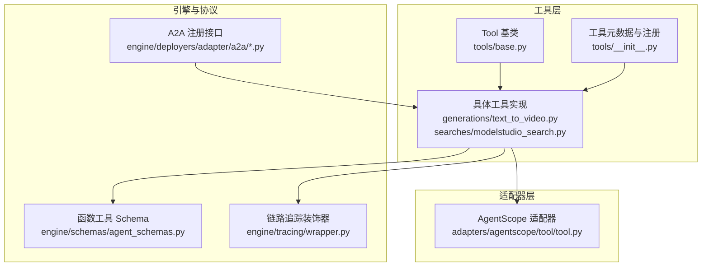
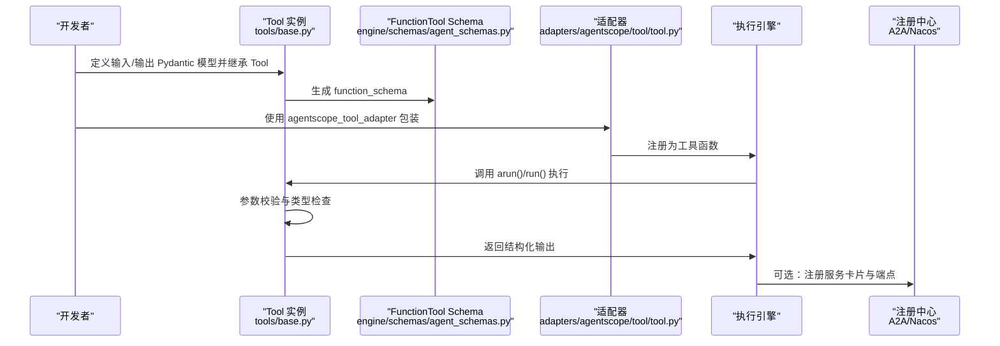
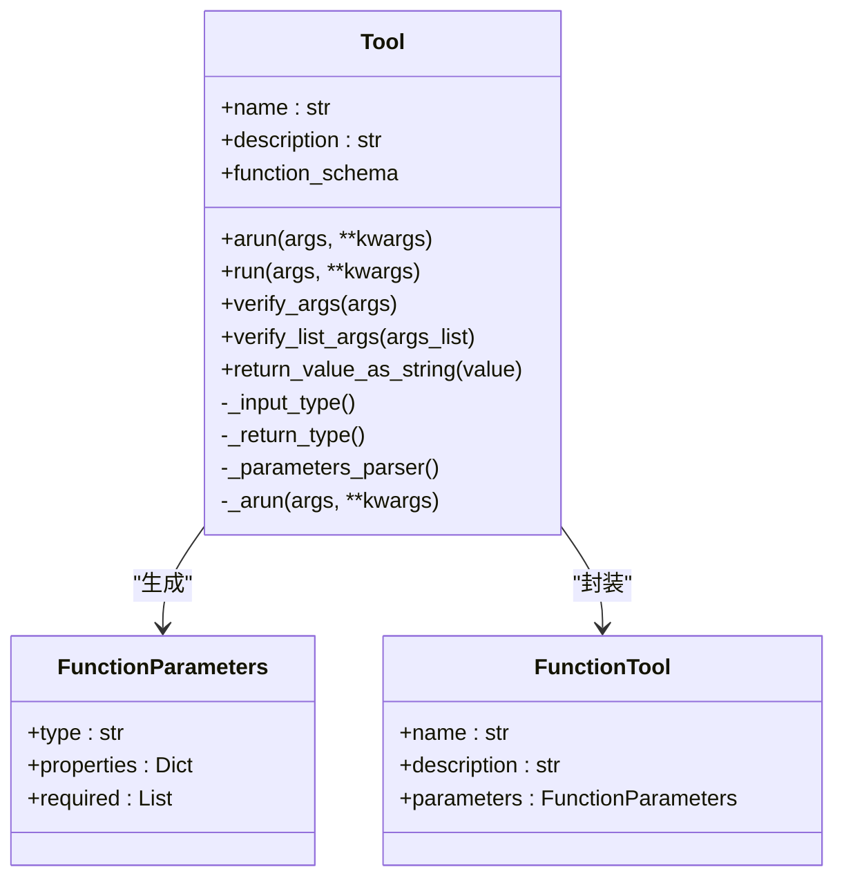
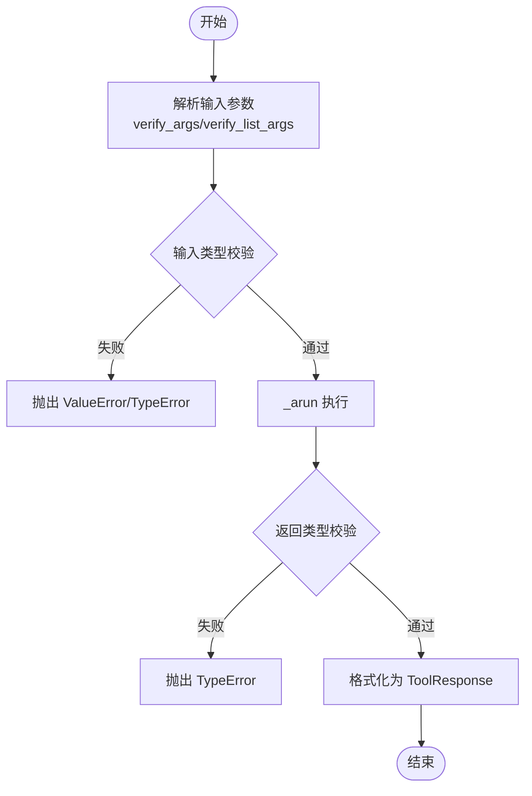
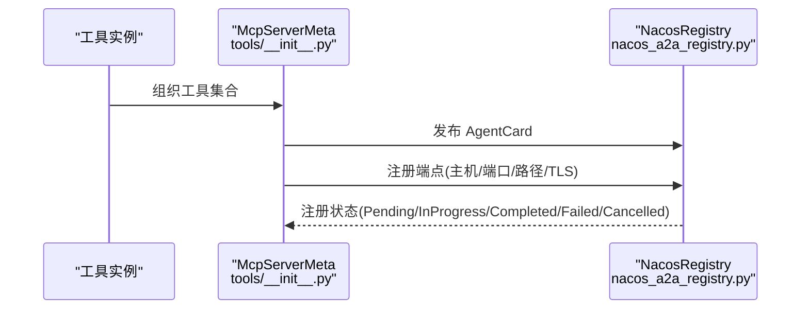
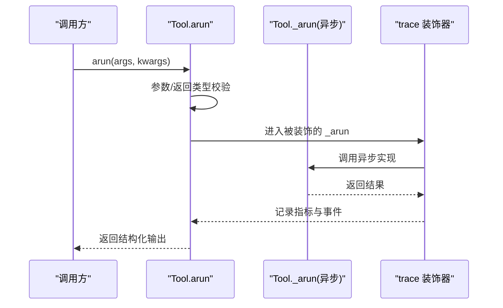
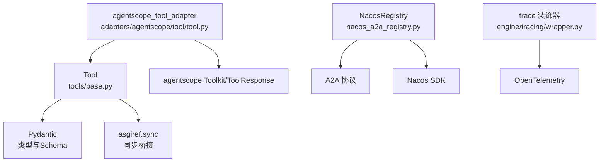

# 自定义工具开发

<cite>
**本文档引用的文件**
- [tools/base.py](file://src/agentscope_runtime/tools/base.py)
- [adapters/agentscope/tool/tool.py](file://src/agentscope_runtime/adapters/agentscope/tool/tool.py)
- [tools/__init__.py](file://src/agentscope_runtime/tools/__init__.py)
- [tools/generations/text_to_video.py](file://src/agentscope_runtime/tools/generations/text_to_video.py)
- [tools/searches/modelstudio_search.py](file://src/agentscope_runtime/tools/searches/modelstudio_search.py)
- [engine/schemas/agent_schemas.py](file://src/agentscope_runtime/engine/schemas/agent_schemas.py)
- [tools/utils/api_key_util.py](file://src/agentscope_runtime/tools/utils/api_key_util.py)
- [engine/tracing/wrapper.py](file://src/agentscope_runtime/engine/tracing/wrapper.py)
- [engine/deployers/adapter/a2a/a2a_registry.py](file://src/agentscope_runtime/engine/deployers/adapter/a2a/a2a_registry.py)
- [engine/deployers/adapter/a2a/nacos_a2a_registry.py](file://src/agentscope_runtime/engine/deployers/adapter/a2a/nacos_a2a_registry.py)
- [tools/_constants.py](file://src/agentscope_runtime/tools/_constants.py)
- [cookbook/zh/tools/tools.md](file://cookbook/zh/tools/tools.md)
- [tests/tools/test_search.py](file://tests/tools/test_search.py)
- [.github/workflows/unit_test_tool.yml](file://.github/workflows/unit_test_tool.yml)
</cite>

## 目录
1. [简介](#简介)
2. [项目结构](#项目结构)
3. [核心组件](#核心组件)
4. [架构总览](#架构总览)
5. [详细组件分析](#详细组件分析)
6. [依赖关系分析](#依赖关系分析)
7. [性能考量](#性能考量)
8. [故障排除指南](#故障排除指南)
9. [结论](#结论)
10. [附录](#附录)

## 简介
本指南面向需要在 AgentScope Runtime 中开发自定义工具的工程师，系统阐述 Tool 基类的继承与实现要求、工具参数验证与输入输出规范、异常处理策略、工具元数据与注册流程、异步实现与并发处理机制、最佳实践与设计模式、测试与调试方法、性能优化建议、安全与权限控制，以及工具打包、发布与版本管理策略。文档结合仓库中的真实实现，提供可操作的开发步骤与可视化图示，帮助快速构建类型安全、可观测、可移植的工具组件。

## 项目结构
AgentScope Runtime 的工具体系围绕统一的 Tool 基类展开，通过适配器对接不同执行引擎（如 AgentScope、LangGraph、AutoGen、MCP），并通过注册中心实现服务发现与编排。核心目录与文件如下：
- 工具基类与通用工具：src/agentscope_runtime/tools/
- 适配器层：src/agentscope_runtime/adapters/
- 引擎与协议：src/agentscope_runtime/engine/
- 示例与测试：examples/、tests/
- 文档与手册：cookbook/

**图表来源**
- [tools/base.py:34-265](file://src/agentscope_runtime/tools/base.py#L34-L265)
- [tools/generations/text_to_video.py:73-222](file://src/agentscope_runtime/tools/generations/text_to_video.py#L73-L222)
- [tools/searches/modelstudio_search.py:102-878](file://src/agentscope_runtime/tools/searches/modelstudio_search.py#L102-L878)
- [adapters/agentscope/tool/tool.py:17-232](file://src/agentscope_runtime/adapters/agentscope/tool/tool.py#L17-L232)
- [engine/schemas/agent_schemas.py:80-121](file://src/agentscope_runtime/engine/schemas/agent_schemas.py#L80-L121)
- [engine/tracing/wrapper.py:94-607](file://src/agentscope_runtime/engine/tracing/wrapper.py#L94-L607)
- [engine/deployers/adapter/a2a/a2a_registry.py:45-77](file://src/agentscope_runtime/engine/deployers/adapter/a2a/a2a_registry.py#L45-L77)
- [engine/deployers/adapter/a2a/nacos_a2a_registry.py:221-768](file://src/agentscope_runtime/engine/deployers/adapter/a2a/nacos_a2a_registry.py#L221-L768)

**章节来源**
- [tools/base.py:34-265](file://src/agentscope_runtime/tools/base.py#L34-L265)
- [tools/__init__.py:65-120](file://src/agentscope_runtime/tools/__init__.py#L65-L120)

## 核心组件
- Tool 基类：提供泛型输入输出类型、参数 Schema 自动生成、异步/同步执行入口、参数验证与序列化工具方法。
- 函数工具 Schema：由基类生成，用于工具调用栈的参数描述与校验。
- 适配器：将 Tool 包装为不同框架可用的工具函数，负责参数校验、错误处理与结果格式化。
- 注册中心：提供服务注册与发现能力，支持 A2A 协议与 Nacos 等实现。
- 链路追踪：统一的 trace 装饰器，贯穿异步/同步/生成器函数，提供可观测性。

**章节来源**
- [tools/base.py:34-265](file://src/agentscope_runtime/tools/base.py#L34-L265)
- [engine/schemas/agent_schemas.py:80-121](file://src/agentscope_runtime/engine/schemas/agent_schemas.py#L80-L121)
- [adapters/agentscope/tool/tool.py:17-232](file://src/agentscope_runtime/adapters/agentscope/tool/tool.py#L17-L232)
- [engine/deployers/adapter/a2a/a2a_registry.py:45-77](file://src/agentscope_runtime/engine/deployers/adapter/a2a/a2a_registry.py#L45-L77)

## 架构总览
下图展示了从工具实现到适配器、Schema 生成、链路追踪与注册中心的整体流程。

**图表来源**
- [tools/base.py:69-73](file://src/agentscope_runtime/tools/base.py#L69-L73)
- [adapters/agentscope/tool/tool.py:17-169](file://src/agentscope_runtime/adapters/agentscope/tool/tool.py#L17-L169)
- [engine/deployers/adapter/a2a/nacos_a2a_registry.py:256-573](file://src/agentscope_runtime/engine/deployers/adapter/a2a/nacos_a2a_registry.py#L256-L573)

## 详细组件分析

### Tool 基类与实现要求
- 泛型约束：Tool[ToolArgsT, ToolReturnT] 通过 TypeVar 约束输入与输出类型，运行时通过 get_args 获取并进行类型校验。
- 输入/输出类型提取：_input_type() 与 _return_type() 用于运行期类型检查。
- 参数 Schema 生成：_parameters_parser() 将输入模型转换为 FunctionParameters，支持 $defs 展开与 required 字段标准化。
- 异步执行入口：arun(args, **kwargs) 负责参数与返回值类型校验，并调用 _arun(args, **kwargs)。
- 同步执行入口：run(args, **kwargs) 通过 async_to_sync 在同步上下文中安全调用异步实现。
- 参数验证工具：verify_args()/verify_list_args() 支持字符串/字典/BaseModel 三种输入形式的统一校验。
- 结果序列化：return_value_as_string() 将结果转换为字符串，便于审计与跨适配器传递。

**图表来源**
- [tools/base.py:34-265](file://src/agentscope_runtime/tools/base.py#L34-L265)
- [engine/schemas/agent_schemas.py:80-121](file://src/agentscope_runtime/engine/schemas/agent_schemas.py#L80-L121)

**章节来源**
- [tools/base.py:34-265](file://src/agentscope_runtime/tools/base.py#L34-L265)
- [engine/schemas/agent_schemas.py:80-121](file://src/agentscope_runtime/engine/schemas/agent_schemas.py#L80-L121)

### 参数验证、输入输出规范与异常处理
- 参数验证：Tool.verify_args() 支持字符串/字典/BaseModel，内部使用 Pydantic 模型校验，失败抛出 ValueError。
- 输入类型检查：arun() 在进入 _arun 前检查 args 是否为 input_type 子类，否则抛出 TypeError。
- 返回类型检查：arun() 在 _arun 返回后检查是否为 return_type 子类，否则抛出 TypeError。
- 适配器异常处理：agentscope_tool_adapter() 将输入校验、执行与结果格式化过程中的异常转换为 ToolResponse，metadata 标记 error=true，便于上层捕获与降级。

**图表来源**
- [tools/base.py:214-246](file://src/agentscope_runtime/tools/base.py#L214-L246)
- [adapters/agentscope/tool/tool.py:59-143](file://src/agentscope_runtime/adapters/agentscope/tool/tool.py#L59-L143)

**章节来源**
- [tools/base.py:111-127](file://src/agentscope_runtime/tools/base.py#L111-L127)
- [adapters/agentscope/tool/tool.py:59-143](file://src/agentscope_runtime/adapters/agentscope/tool/tool.py#L59-L143)

### 工具元数据与注册流程
- 元数据定义：工具通过 name 与 description 作为元数据标识，function_schema 作为函数调用的 JSON Schema。
- 工具注册：tools/__init__.py 中的 McpServerMeta 与 components 列表用于组织工具集合，便于批量注册与服务编排。
- 服务注册：A2ARegistry 抽象接口与 NacosRegistry 实现提供服务卡片发布与端点注册，支持异步任务与后台线程，具备超时与取消控制。

**图表来源**
- [tools/__init__.py:65-120](file://src/agentscope_runtime/tools/__init__.py#L65-L120)
- [engine/deployers/adapter/a2a/nacos_a2a_registry.py:256-573](file://src/agentscope_runtime/engine/deployers/adapter/a2a/nacos_a2a_registry.py#L256-L573)

**章节来源**
- [tools/__init__.py:65-120](file://src/agentscope_runtime/tools/__init__.py#L65-L120)
- [engine/deployers/adapter/a2a/a2a_registry.py:45-77](file://src/agentscope_runtime/engine/deployers/adapter/a2a/a2a_registry.py#L45-L77)
- [engine/deployers/adapter/a2a/nacos_a2a_registry.py:221-768](file://src/agentscope_runtime/engine/deployers/adapter/a2a/nacos_a2a_registry.py#L221-L768)

### 异步实现与并发处理机制
- 异步优先：_arun 必须为异步方法，arun() 作为统一入口负责类型校验与返回值检查。
- 并发与阻塞：agentscope_tool_adapter() 在同步环境下使用 ThreadPoolExecutor+asyncio.run 包裹异步执行，避免在已有事件循环中重复创建。
- 超时与轮询：以文生视频工具为例，异步提交任务后通过轮询等待完成，设置最大等待时间与轮询间隔，防止长时间阻塞。
- 链路追踪：trace 装饰器支持异步/同步/生成器函数，自动注入请求 ID、首包延迟、合并输出等指标，便于性能分析与问题定位。

**图表来源**
- [tools/base.py:75-127](file://src/agentscope_runtime/tools/base.py#L75-L127)
- [engine/tracing/wrapper.py:94-607](file://src/agentscope_runtime/engine/tracing/wrapper.py#L94-L607)
- [adapters/agentscope/tool/tool.py:82-98](file://src/agentscope_runtime/adapters/agentscope/tool/tool.py#L82-L98)

**章节来源**
- [tools/generations/text_to_video.py:86-222](file://src/agentscope_runtime/tools/generations/text_to_video.py#L86-L222)
- [engine/tracing/wrapper.py:94-607](file://src/agentscope_runtime/engine/tracing/wrapper.py#L94-L607)
- [adapters/agentscope/tool/tool.py:82-98](file://src/agentscope_runtime/adapters/agentscope/tool/tool.py#L82-L98)

### 最佳实践与设计模式
- 单一职责：每个 Tool 专注一类企业能力，便于组合与替换。
- 类型边界：使用 Pydantic 输入/输出模型，提前在网络请求前完成参数校验。
- 适配器友好：共享的 function_schema 使不同框架适配器无需额外胶水代码。
- 异步优先：_arun 恒为异步，run() 仅在同步场景充当桥接。
- 观测能力就绪：通过 trace 装饰器集中注入链路追踪、重试与日志。
- 配置与凭证：通过 tools/utils/api_key_util.py 统一获取 API Key，支持多来源优先级。

**章节来源**
- [cookbook/zh/tools/tools.md:18-35](file://cookbook/zh/tools/tools.md#L18-L35)
- [tools/utils/api_key_util.py:13-46](file://src/agentscope_runtime/tools/utils/api_key_util.py#L13-L46)

## 依赖关系分析
- 工具基类依赖 Pydantic 进行类型与 Schema 生成，依赖 asgiref.sync 提供同步桥接。
- 适配器依赖 agentscope 的 Toolkit/ToolResponse，将 Tool 的输入/输出映射为 AgentScope 的工具调用格式。
- 注册中心依赖 A2A 协议与 Nacos SDK，支持多传输配置与后台注册任务。
- 链路追踪依赖 OpenTelemetry，提供批量导出与本地日志处理器。

**图表来源**
- [tools/base.py:18-20](file://src/agentscope_runtime/tools/base.py#L18-L20)
- [adapters/agentscope/tool/tool.py:11-14](file://src/agentscope_runtime/adapters/agentscope/tool/tool.py#L11-L14)
- [engine/deployers/adapter/a2a/nacos_a2a_registry.py:110-148](file://src/agentscope_runtime/engine/deployers/adapter/a2a/nacos_a2a_registry.py#L110-L148)
- [engine/tracing/wrapper.py:35-54](file://src/agentscope_runtime/engine/tracing/wrapper.py#L35-L54)

**章节来源**
- [tools/base.py:18-20](file://src/agentscope_runtime/tools/base.py#L18-L20)
- [adapters/agentscope/tool/tool.py:11-14](file://src/agentscope_runtime/adapters/agentscope/tool/tool.py#L11-L14)
- [engine/deployers/adapter/a2a/nacos_a2a_registry.py:110-148](file://src/agentscope_runtime/engine/deployers/adapter/a2a/nacos_a2a_registry.py#L110-L148)
- [engine/tracing/wrapper.py:35-54](file://src/agentscope_runtime/engine/tracing/wrapper.py#L35-L54)

## 性能考量
- 异步执行：优先使用 _arun 异步实现，减少阻塞与上下文切换开销。
- 轮询与超时：对于长耗时任务，合理设置轮询间隔与最大等待时间，避免资源占用过高。
- 缓存与复用：在工具实例初始化阶段完成连接建立与凭证加载，避免重复初始化。
- 观测指标：通过 trace 装饰器收集首包延迟、合并输出等指标，辅助性能优化。
- 并发控制：在适配器层使用线程池包装同步执行，避免阻塞事件循环。

[本节为通用指导，无需特定文件引用]

## 故障排除指南
- 参数校验失败：检查输入是否为正确的 Pydantic 模型或可解析的 JSON 字符串，确认字段类型与必填项。
- 返回类型不符：确保 _arun 返回值符合声明的 ToolReturnT 类型，避免自定义输出未遵循模型定义。
- 适配器错误：agentscope_tool_adapter() 将异常转换为 ToolResponse，metadata 标记 error=true，可在上层捕获并记录。
- 注册失败：NacosRegistry 提供注册状态查询与等待方法，检查网络连通性、认证配置与超时设置。
- 测试与覆盖率：单元测试工作流覆盖工具测试，可通过 pytest 运行并生成覆盖率报告。

**章节来源**
- [adapters/agentscope/tool/tool.py:59-143](file://src/agentscope_runtime/adapters/agentscope/tool/tool.py#L59-L143)
- [engine/deployers/adapter/a2a/nacos_a2a_registry.py:574-623](file://src/agentscope_runtime/engine/deployers/adapter/a2a/nacos_a2a_registry.py#L574-L623)
- [.github/workflows/unit_test_tool.yml:59-65](file://.github/workflows/unit_test_tool.yml#L59-L65)

## 结论
通过统一的 Tool 基类与适配器体系，AgentScope Runtime 为自定义工具提供了类型安全、可观测、可移植的开发范式。遵循单一职责、类型边界、异步优先与适配器友好的设计原则，结合链路追踪与注册中心能力，能够高效构建可维护、可扩展的工具组件，并在多框架间无缝复用。

[本节为总结，无需特定文件引用]

## 附录

### 开发步骤清单
- 定义输入/输出 Pydantic 模型，继承 Tool[Input, Output]。
- 实现 _arun(args, **kwargs) 异步方法，确保返回值符合输出模型。
- 在工具类中设置 name 与 description，确保 function_schema 可用。
- 使用 agentscope_tool_adapter() 包装为 AgentScope 工具并注册到 Toolkit。
- 通过 trace 装饰器增强可观测性，必要时设置 trace_name 与 trace_type。
- 配置 API Key 与环境变量，确保外部服务调用正常。
- 编写单元测试，覆盖参数校验、异常分支与关键路径。

**章节来源**
- [cookbook/zh/tools/tools.md:36-71](file://cookbook/zh/tools/tools.md#L36-L71)
- [tools/utils/api_key_util.py:13-46](file://src/agentscope_runtime/tools/utils/api_key_util.py#L13-L46)
- [engine/tracing/wrapper.py:94-607](file://src/agentscope_runtime/engine/tracing/wrapper.py#L94-L607)

### 安全与权限控制
- 凭证管理：通过 tools/utils/api_key_util.py 统一获取 API Key，支持多来源优先级，避免硬编码。
- 环境变量：在容器或部署环境中设置 DASHSCOPE_API_KEY 等敏感信息，避免泄露。
- 注册中心安全：NacosRegistry 支持用户名密码与 AccessKey 认证，按需启用 TLS。

**章节来源**
- [tools/utils/api_key_util.py:13-46](file://src/agentscope_runtime/tools/utils/api_key_util.py#L13-L46)
- [engine/deployers/adapter/a2a/nacos_a2a_registry.py:110-148](file://src/agentscope_runtime/engine/deployers/adapter/a2a/nacos_a2a_registry.py#L110-L148)

### 测试与调试
- 单元测试：使用 pytest 运行 tests/tools/*，覆盖工具执行与参数校验。
- 覆盖率：通过 .github/workflows/unit_test_tool.yml 配置覆盖率统计。
- 调试技巧：在 _arun 中使用 trace 装饰器记录输入/输出与中间事件，定位性能瓶颈与异常路径。

**章节来源**
- [tests/tools/test_search.py:23-46](file://tests/tools/test_search.py#L23-L46)
- [.github/workflows/unit_test_tool.yml:59-65](file://.github/workflows/unit_test_tool.yml#L59-L65)
- [engine/tracing/wrapper.py:94-607](file://src/agentscope_runtime/engine/tracing/wrapper.py#L94-L607)

### 打包、发布与版本管理
- 环境变量：通过 tools/_constants.py 统一管理 DashScope 基础 URL 与 API Key，便于在不同环境切换。
- 版本策略：工具与服务卡片版本可与运行时版本对齐，注册中心支持版本字段管理。
- 发布流程：结合 CI 工作流与覆盖率报告，确保变更质量与可追溯性。

**章节来源**
- [tools/_constants.py:4-19](file://src/agentscope_runtime/tools/_constants.py#L4-L19)
- [engine/deployers/adapter/a2a/nacos_a2a_registry.py:400-411](file://src/agentscope_runtime/engine/deployers/adapter/a2a/nacos_a2a_registry.py#L400-L411)