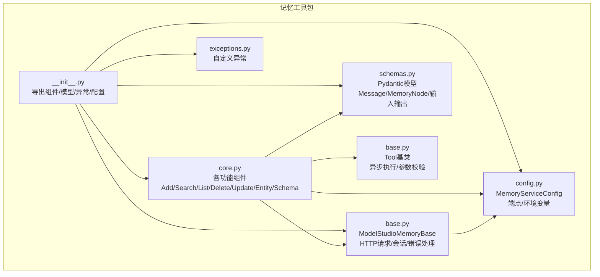
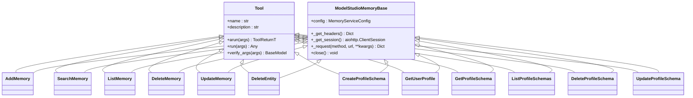
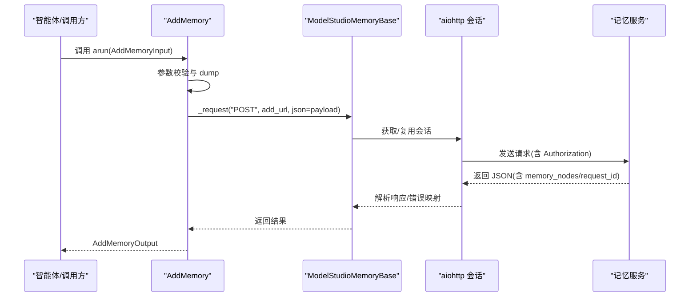
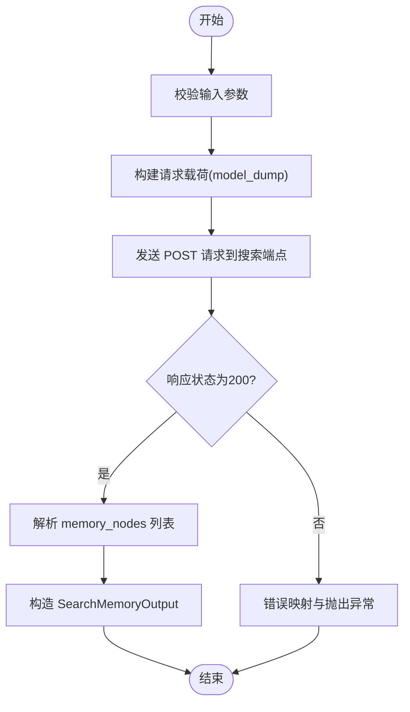
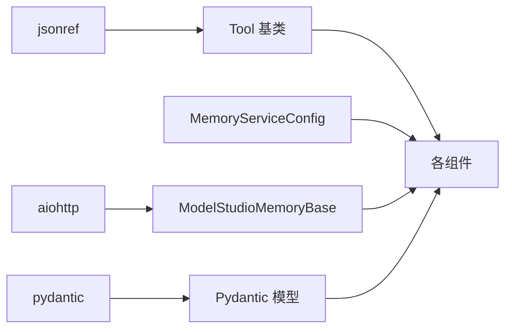

# 记忆工具

<cite>
**本文引用的文件**
- [__init__.py](file://src/agentscope_runtime/tools/modelstudio_memory/__init__.py)
- [base.py](file://src/agentscope_runtime/tools/modelstudio_memory/base.py)
- [core.py](file://src/agentscope_runtime/tools/modelstudio_memory/core.py)
- [config.py](file://src/agentscope_runtime/tools/modelstudio_memory/config.py)
- [schemas.py](file://src/agentscope_runtime/tools/modelstudio_memory/schemas.py)
- [exceptions.py](file://src/agentscope_runtime/tools/modelstudio_memory/exceptions.py)
- [base.py](file://src/agentscope_runtime/tools/base.py)
- [modelstudio_memory.md](file://cookbook/zh/tools/modelstudio_memory.md)
- [memory_demo.py](file://examples/modelstudio_memory/memory_demo.py)
</cite>

## 目录
1. [简介](#简介)
2. [项目结构](#项目结构)
3. [核心组件](#核心组件)
4. [架构总览](#架构总览)
5. [详细组件分析](#详细组件分析)
6. [依赖关系分析](#依赖关系分析)
7. [性能考虑](#性能考虑)
8. [故障排查指南](#故障排查指南)
9. [结论](#结论)
10. [附录](#附录)

## 简介
本文件面向“记忆工具”（ModelStudio Memory）的技术文档，系统阐述其架构设计、数据存储机制、核心组件功能与接口规范、配置与会话管理、持久化策略、数据结构与查询机制、初始化与参数设置、异常处理与错误恢复、数据一致性保障，以及与智能体的集成方式与交互模式。文档同时提供内存管理与性能优化的最佳实践，帮助开发者高效、稳定地在智能体应用中使用记忆能力。

## 项目结构
记忆工具位于 agentscope_runtime 的工具模块下，采用“组件 + 模型 + 配置 + 异常”的分层组织：
- 组件层：AddMemory、SearchMemory、ListMemory、DeleteMemory、UpdateMemory、DeleteEntity、CreateProfileSchema、GetUserProfile、GetProfileSchema、ListProfileSchemas、DeleteProfileSchema、UpdateProfileSchema
- 模型层：基于 Pydantic 的输入/输出模型与数据结构
- 配置层：MemoryServiceConfig，负责环境变量解析与端点生成
- 基类层：ModelStudioMemoryBase，封装通用 HTTP 请求、会话管理与错误处理
- 工具基类：Tool，统一异步执行、参数校验与函数模式导出

图表来源
- [__init__.py:1-155](file://src/agentscope_runtime/tools/modelstudio_memory/__init__.py#L1-L155)
- [base.py:25-221](file://src/agentscope_runtime/tools/modelstudio_memory/base.py#L25-L221)
- [core.py:1-1150](file://src/agentscope_runtime/tools/modelstudio_memory/core.py#L1-L1150)
- [config.py:15-99](file://src/agentscope_runtime/tools/modelstudio_memory/config.py#L15-L99)
- [schemas.py:1-514](file://src/agentscope_runtime/tools/modelstudio_memory/schemas.py#L1-L514)
- [exceptions.py:1-61](file://src/agentscope_runtime/tools/modelstudio_memory/exceptions.py#L1-L61)
- [base.py:34-265](file://src/agentscope_runtime/tools/base.py#L34-L265)

章节来源
- [__init__.py:1-155](file://src/agentscope_runtime/tools/modelstudio_memory/__init__.py#L1-L155)
- [config.py:15-99](file://src/agentscope_runtime/tools/modelstudio_memory/config.py#L15-L99)
- [base.py:25-221](file://src/agentscope_runtime/tools/modelstudio_memory/base.py#L25-L221)
- [core.py:1-1150](file://src/agentscope_runtime/tools/modelstudio_memory/core.py#L1-L1150)
- [schemas.py:1-514](file://src/agentscope_runtime/tools/modelstudio_memory/schemas.py#L1-L514)
- [exceptions.py:1-61](file://src/agentscope_runtime/tools/modelstudio_memory/exceptions.py#L1-L61)
- [base.py:34-265](file://src/agentscope_runtime/tools/base.py#L34-L265)

## 核心组件
- AddMemory：将对话消息作为记忆节点存储，支持画像提取与元数据
- SearchMemory：基于语义相似度检索相关记忆
- ListMemory：按分页列出用户记忆
- DeleteMemory：删除指定记忆节点
- UpdateMemory：更新记忆节点内容
- DeleteEntity：删除实体及其关联数据
- CreateProfileSchema / GetProfileSchema / ListProfileSchemas / UpdateProfileSchema / DeleteProfileSchema：用户画像 Schema 的增删改查
- GetUserProfile：获取自动提取的用户画像

章节来源
- [__init__.py:48-61](file://src/agentscope_runtime/tools/modelstudio_memory/__init__.py#L48-L61)
- [core.py:55-1150](file://src/agentscope_runtime/tools/modelstudio_memory/core.py#L55-L1150)

## 架构总览
记忆工具遵循“组件模式 + 异步执行 + 参数校验 + 统一错误处理”的设计：
- 组件继承 Tool 并组合 ModelStudioMemoryBase，获得异步运行、参数校验与函数模式导出能力
- ModelStudioMemoryBase 封装 aiohttp 会话、统一请求头、错误映射与资源关闭
- MemoryServiceConfig 负责从环境变量加载配置并生成 API 端点
- Pydantic 模型确保输入输出的数据结构与约束

图表来源
- [base.py:34-265](file://src/agentscope_runtime/tools/base.py#L34-L265)
- [base.py:25-221](file://src/agentscope_runtime/tools/modelstudio_memory/base.py#L25-L221)
- [core.py:55-1150](file://src/agentscope_runtime/tools/modelstudio_memory/core.py#L55-L1150)

## 详细组件分析

### 配置管理（MemoryServiceConfig）
- 支持从环境变量加载：
  - DASHSCOPE_API_KEY：必填
  - MEMORY_SERVICE_ENDPOINT：可选，默认 https://dashscope.aliyuncs.com/api/v2/apps/memory
  - MODELSTUDIO_SERVICE_ID：可选，默认 memory_service
- 提供端点生成方法：
  - add、search、list、profile_schemas、user_profile、memory_nodes、entities 等路径拼接

章节来源
- [config.py:15-99](file://src/agentscope_runtime/tools/modelstudio_memory/config.py#L15-L99)

### 基类与通用能力（ModelStudioMemoryBase）
- 会话管理：惰性创建 aiohttp.ClientSession，支持异步上下文管理器与手动 close
- 请求头：统一 Content-Type、User-Agent、Authorization（Bearer + api_key）
- 统一错误处理：对 400/401/403/404/5xx 进行映射，解析 JSON 或文本错误体，记录 request_id 与错误码
- 日志：调试级别记录请求与响应摘要

章节来源
- [base.py:25-221](file://src/agentscope_runtime/tools/modelstudio_memory/base.py#L25-L221)

### 数据模型与结构（Pydantic）
- Message：角色与内容
- MemoryNode：记忆节点（含 id、content、event、old_content、时间戳、元数据）
- 输入/输出模型覆盖：
  - AddMemoryInput/Output
  - SearchMemoryInput/Output
  - ListMemoryInput/Output
  - DeleteMemoryInput/Output
  - UpdateMemoryInput/Output
  - ProfileSchema 相关（Create/Get/List/Update/Delete 及属性模型）
  - User Profile 相关（UserProfile、UserProfileAttribute）

章节来源
- [schemas.py:10-514](file://src/agentscope_runtime/tools/modelstudio_memory/schemas.py#L10-L514)

### 异常体系（MemoryAPIError 等）
- MemoryAPIError：通用 API 错误，携带状态码、错误码、request_id
- MemoryAuthenticationError：401/403
- MemoryNotFoundError：404
- MemoryValidationError：400
- MemoryNetworkError：网络异常

章节来源
- [exceptions.py:1-61](file://src/agentscope_runtime/tools/modelstudio_memory/exceptions.py#L1-L61)

### 组件接口规范与行为
- AddMemory
  - 功能：提交对话消息，生成记忆节点；可选传入 profile_schema 触发画像提取
  - 关键参数：user_id、messages、meta_data、memory_library_id、project_id、profile_schema、custom_instructions、expired_in_days
  - 输出：memory_nodes 列表、request_id
- SearchMemory
  - 功能：基于上下文检索相关记忆
  - 关键参数：user_id、messages、top_k、min_score、memory_library_id、project_ids、source、enable_rewrite/judge/rerank
  - 输出：memory_nodes 列表、request_id
- ListMemory
  - 功能：分页列出用户记忆
  - 关键参数：user_id、page_num、page_size、memory_library_id、project_id
  - 输出：memory_nodes、page_size、page_num、total、request_id
- DeleteMemory
  - 功能：删除指定记忆节点
  - 关键参数：user_id、memory_node_id、memory_library_id
  - 输出：request_id
- UpdateMemory
  - 功能：更新记忆节点内容
  - 关键参数：memory_node_id、custom_content、timestamp、meta_data、memory_library_id
  - 输出：request_id
- DeleteEntity
  - 功能：删除实体及其关联数据
  - 关键参数：entity_type、entity_id、memory_library_id
  - 输出：request_id
- CreateProfileSchema / GetProfileSchema / ListProfileSchemas / UpdateProfileSchema / DeleteProfileSchema
  - 功能：画像 Schema 的创建、查询、列表、更新、删除
  - 关键参数：schema_id、name/description、attributes_operations、memory_library_id 等
  - 输出：profile_schema_id、request_id、profile、summary 列表等
- GetUserProfile
  - 功能：获取自动提取的用户画像
  - 关键参数：schema_id、user_id、memory_library_id
  - 输出：profile、request_id

章节来源
- [core.py:55-1150](file://src/agentscope_runtime/tools/modelstudio_memory/core.py#L55-L1150)
- [schemas.py:51-514](file://src/agentscope_runtime/tools/modelstudio_memory/schemas.py#L51-L514)

### 初始化与参数设置
- 初始化方式
  - 通过构造函数传入 MemoryServiceConfig 实例
  - 不传入则自动从环境变量加载（MemoryServiceConfig.from_env）
- 环境变量
  - DASHSCOPE_API_KEY：必填
  - MEMORY_SERVICE_ENDPOINT：可选
  - MODELSTUDIO_SERVICE_ID：可选
- 典型参数
  - AddMemory：user_id、messages、meta_data、profile_schema、expired_in_days
  - SearchMemory：user_id、messages、top_k、min_score、filters
  - ListMemory：user_id、page_num、page_size
  - ProfileSchema：name、description、attributes

章节来源
- [config.py:30-60](file://src/agentscope_runtime/tools/modelstudio_memory/config.py#L30-L60)
- [core.py:55-1150](file://src/agentscope_runtime/tools/modelstudio_memory/core.py#L55-L1150)
- [modelstudio_memory.md:88-94](file://cookbook/zh/tools/modelstudio_memory.md#L88-L94)

### 会话管理与持久化策略
- 会话管理
  - ModelStudioMemoryBase 内部维护 aiohttp.ClientSession，惰性创建并在 close 或异步上下文退出时关闭
  - 建议在业务结束时显式调用 close，或使用 async with 上下文管理器
- 持久化策略
  - 记忆节点由服务端持久化，客户端不直接管理本地存储
  - 支持 memory_library_id 与 project_id 进行逻辑隔离
  - expired_in_days 控制过期策略（7/30/180 或 -1 表示永不过期）

章节来源
- [base.py:67-76](file://src/agentscope_runtime/tools/modelstudio_memory/base.py#L67-L76)
- [base.py:198-221](file://src/agentscope_runtime/tools/modelstudio_memory/base.py#L198-L221)
- [core.py:55-1150](file://src/agentscope_runtime/tools/modelstudio_memory/core.py#L55-L1150)
- [schemas.py:51-83](file://src/agentscope_runtime/tools/modelstudio_memory/schemas.py#L51-L83)

### 数据结构化存储与查询机制
- 结构化存储
  - MemoryNode：统一存储格式，支持事件类型（ADD/DELETE/UPDATE）、旧内容、时间戳、元数据
  - ProfileSchema：定义画像字段结构，支持默认值与描述
  - UserProfile：聚合 schema 名称/描述与属性值
- 查询机制
  - SearchMemory 支持 top_k 与 min_score 控制召回规模与质量
  - ListMemory 支持分页与过滤条件（memory_library_id、project_id、source）
  - 支持启用重写、判断与重排等增强选项

章节来源
- [schemas.py:18-48](file://src/agentscope_runtime/tools/modelstudio_memory/schemas.py#L18-L48)
- [schemas.py:214-291](file://src/agentscope_runtime/tools/modelstudio_memory/schemas.py#L214-L291)
- [schemas.py:293-309](file://src/agentscope_runtime/tools/modelstudio_memory/schemas.py#L293-L309)
- [core.py:98-247](file://src/agentscope_runtime/tools/modelstudio_memory/core.py#L98-L247)
- [core.py:284-339](file://src/agentscope_runtime/tools/modelstudio_memory/core.py#L284-L339)

### 与智能体的集成方式与交互模式
- 函数模式导出
  - 所有组件继承 Tool，具备函数名、描述与参数模式导出，可用于智能体工具注册
- 异步执行
  - 统一使用 arun 异步执行，内部进行参数校验与返回值校验
- 与 LLM 的结合
  - SearchMemory 返回的记忆节点可作为上下文注入到 LLM 提示词中，实现个性化回答
- 示例参考
  - memory_demo.py 展示了从创建 Schema、添加记忆、检索记忆到生成回答的完整链路

章节来源
- [base.py:34-143](file://src/agentscope_runtime/tools/base.py#L34-L143)
- [core.py:55-1150](file://src/agentscope_runtime/tools/modelstudio_memory/core.py#L55-L1150)
- [memory_demo.py:1-742](file://examples/modelstudio_memory/memory_demo.py#L1-L742)

### API 调用序列（以 AddMemory 为例）

图表来源
- [core.py:94-158](file://src/agentscope_runtime/tools/modelstudio_memory/core.py#L94-L158)
- [base.py:78-197](file://src/agentscope_runtime/tools/modelstudio_memory/base.py#L78-L197)

### 复杂逻辑流程（以 SearchMemory 为例）

图表来源
- [core.py:194-247](file://src/agentscope_runtime/tools/modelstudio_memory/core.py#L194-L247)
- [base.py:101-197](file://src/agentscope_runtime/tools/modelstudio_memory/base.py#L101-L197)

## 依赖关系分析
- 组件依赖
  - 所有组件均依赖 Tool 基类（参数校验、函数模式导出）
  - 所有组件均依赖 ModelStudioMemoryBase（HTTP 会话、请求与错误处理）
  - 所有组件均依赖 MemoryServiceConfig（端点与配置）
  - 所有组件均依赖 schemas 中的 Pydantic 模型
- 外部依赖
  - aiohttp：异步 HTTP 客户端
  - pydantic：数据模型与校验
  - jsonref：参数模式中的 $defs 替换

图表来源
- [base.py:34-265](file://src/agentscope_runtime/tools/base.py#L34-L265)
- [base.py:25-221](file://src/agentscope_runtime/tools/modelstudio_memory/base.py#L25-L221)
- [config.py:15-99](file://src/agentscope_runtime/tools/modelstudio_memory/config.py#L15-L99)
- [schemas.py:1-514](file://src/agentscope_runtime/tools/modelstudio_memory/schemas.py#L1-L514)

章节来源
- [base.py:34-265](file://src/agentscope_runtime/tools/base.py#L34-L265)
- [base.py:25-221](file://src/agentscope_runtime/tools/modelstudio_memory/base.py#L25-L221)
- [config.py:15-99](file://src/agentscope_runtime/tools/modelstudio_memory/config.py#L15-L99)
- [schemas.py:1-514](file://src/agentscope_runtime/tools/modelstudio_memory/schemas.py#L1-L514)

## 性能考虑
- 异步与连接复用
  - 使用 aiohttp.ClientSession 惰性创建并复用，减少连接开销
  - 建议在长生命周期内复用组件实例，避免频繁创建/销毁会话
- 分页与召回控制
  - SearchMemory 的 top_k 与 min_score 影响性能与准确性，建议根据场景调整
  - ListMemory 的 page_size 控制单次拉取量，避免一次性传输过多数据
- 元数据与过滤
  - 合理使用 meta_data、project_id、source 等过滤条件，减少无关数据传输
- 一致性等待
  - 新增记忆后建议等待短暂时间再查询，确保服务端索引与画像提取完成
- 资源清理
  - 在业务结束时调用 close 或使用异步上下文管理器释放连接

章节来源
- [base.py:67-76](file://src/agentscope_runtime/tools/modelstudio_memory/base.py#L67-L76)
- [base.py:198-221](file://src/agentscope_runtime/tools/modelstudio_memory/base.py#L198-L221)
- [core.py:194-247](file://src/agentscope_runtime/tools/modelstudio_memory/core.py#L194-L247)
- [memory_demo.py:628-632](file://examples/modelstudio_memory/memory_demo.py#L628-L632)

## 故障排查指南
- 常见错误与定位
  - MemoryAuthenticationError：检查 DASHSCOPE_API_KEY 是否正确设置
  - MemoryNotFoundError：确认资源 ID 是否存在，或是否被删除
  - MemoryValidationError：检查输入参数是否符合 Pydantic 模型约束
  - MemoryNetworkError：检查网络连通性与代理设置
- 错误信息解析
  - 统一异常包含 status_code、error_code、request_id，便于定位问题
  - 日志中包含请求 URL 与状态码，有助于复现问题
- 恢复建议
  - 对于临时网络波动，可重试（指数退避策略）
  - 对于参数错误，依据异常信息修正后再试
  - 对于认证失败，重新设置环境变量并验证权限

章节来源
- [base.py:142-197](file://src/agentscope_runtime/tools/modelstudio_memory/base.py#L142-L197)
- [exceptions.py:8-61](file://src/agentscope_runtime/tools/modelstudio_memory/exceptions.py#L8-L61)
- [memory_demo.py:595-606](file://examples/modelstudio_memory/memory_demo.py#L595-L606)

## 结论
记忆工具通过清晰的组件化设计、严格的参数校验与完善的错误处理，为智能体提供了稳定可靠的对话记忆与用户画像能力。配合异步执行与连接复用，可在高并发场景下保持良好性能。建议在实际集成中关注一致性等待、分页与召回控制、资源清理与错误恢复策略，以获得最佳体验。

## 附录

### 初始化与使用示例（参考）
- 完整演示脚本展示了从创建 Schema、添加记忆、检索记忆、获取画像到删除记忆的全流程
- 可作为快速上手与回归测试的参考

章节来源
- [memory_demo.py:1-742](file://examples/modelstudio_memory/memory_demo.py#L1-L742)