# 开发指南

<cite>
**本文引用的文件**   
- [README.md](file://README.md)
- [CONTRIBUTING.md](file://CONTRIBUTING.md)
- [pyproject.toml](file://pyproject.toml)
- [setup.py](file://setup.py)
- [src/agentscope_runtime/version.py](file://src/agentscope_runtime/version.py)
- [.pre-commit-config.yaml](file://.pre-commit-config.yaml)
- [.eslintrc](file://.eslintrc)
- [.stylelintrc](file://.stylelintrc)
- [.flake8](file://.flake8)
- [.github/PULL_REQUEST_TEMPLATE.md](file://.github/PULL_REQUEST_TEMPLATE.md)
- [.github/release-drafter.yml](file://.github/release-drafter.yml)
- [src/agentscope_runtime/engine/__init__.py](file://src/agentscope_runtime/engine/__init__.py)
- [src/agentscope_runtime/engine/runner.py](file://src/agentscope_runtime/engine/runner.py)
- [src/agentscope_runtime/engine/app/agent_app.py](file://src/agentscope_runtime/engine/app/agent_app.py)
- [src/agentscope_runtime/engine/deployers/base.py](file://src/agentscope_runtime/engine/deployers/base.py)
- [src/agentscope_runtime/engine/deployers/local_deployer.py](file://src/agentscope_runtime/engine/deployers/local_deployer.py)
- [src/agentscope_runtime/engine/deployers/kubernetes_deployer.py](file://src/agentscope_runtime/engine/deployers/kubernetes_deployer.py)
- [src/agentscope_runtime/engine/deployers/knative_deployer.py](file://src/agentscope_runtime/engine/deployers/knative_deployer.py)
- [src/agentscope_runtime/engine/deployers/kruise_deployer.py](file://src/agentscope_runtime/engine/deployers/kruise_deployer.py)
- [src/agentscope_runtime/engine/deployers/modelstudio_deployer.py](file://src/agentscope_runtime/engine/deployers/modelstudio_deployer.py)
- [src/agentscope_runtime/engine/deployers/pai_deployer.py](file://src/agentscope_runtime/engine/deployers/pai_deployer.py)
- [src/agentscope_runtime/engine/deployers/agentrun_deployer.py](file://src/agentscope_runtime/engine/deployers/agentrun_deployer.py)
- [src/agentscope_runtime/engine/deployers/fc_deployer.py](file://src/agentscope_runtime/engine/deployers/fc_deployer.py)
- [src/agentscope_runtime/engine/helpers/runner.py](file://src/agentscope_runtime/engine/helpers/runner.py)
- [src/agentscope_runtime/engine/services/service_factory.py](file://src/agentscope_runtime/engine/services/service_factory.py)
- [src/agentscope_runtime/engine/services/base.py](file://src/agentscope_runtime/engine/services/base.py)
- [src/agentscope_runtime/engine/tracing/base.py](file://src/agentscope_runtime/engine/tracing/base.py)
- [src/agentscope_runtime/engine/tracing/wrapper.py](file://src/agentscope_runtime/engine/tracing/wrapper.py)
- [src/agentscope_runtime/engine/tracing/tracing_util.py](file://src/agentscope_runtime/engine/tracing/tracing_util.py)
- [src/agentscope_runtime/engine/tracing/message_util.py](file://src/agentscope_runtime/engine/tracing/message_util.py)
- [src/agentscope_runtime/engine/tracing/tracing_metric.py](file://src/agentscope_runtime/engine/tracing/tracing_metric.py)
- [src/agentscope_runtime/engine/tracing/asyncio_util.py](file://src/agentscope_runtime/engine/tracing/asyncio_util.py)
- [src/agentscope_runtime/engine/tracing/local_logging_handler.py](file://src/agentscope_runtime/engine/tracing/local_logging_handler.py)
- [src/agentscope_runtime/engine/schemas/agent_schemas.py](file://src/agentscope_runtime/engine/schemas/agent_schemas.py)
- [src/agentscope_runtime/engine/schemas/session.py](file://src/agentscope_runtime/engine/schemas/session.py)
- [src/agentscope_runtime/engine/schemas/response_api.py](file://src/agentscope_runtime/engine/schemas/response_api.py)
- [src/agentscope_runtime/engine/schemas/oai_llm.py](file://src/agentscope_runtime/engine/schemas/oai_llm.py)
- [src/agentscope_runtime/engine/schemas/embedding.py](file://src/agentscope_runtime/engine/schemas/embedding.py)
- [src/agentscope_runtime/engine/schemas/realtime.py](file://src/agentscope_runtime/engine/schemas/realtime.py)
- [src/agentscope_runtime/engine/schemas/modelstudio_llm.py](file://src/agentscope_runtime/engine/schemas/modelstudio_llm.py)
- [src/agentscope_runtime/engine/schemas/exception.py](file://src/agentscope_runtime/engine/schemas/exception.py)
- [src/agentscope_runtime/cli/cli.py](file://src/agentscope_runtime/cli/cli.py)
- [src/agentscope_runtime/cli/commands/run.py](file://src/agentscope_runtime/cli/commands/run.py)
- [src/agentscope_runtime/cli/commands/chat.py](file://src/agentscope_runtime/cli/commands/chat.py)
- [src/agentscope_runtime/cli/commands/invoke.py](file://src/agentscope_runtime/cli/commands/invoke.py)
- [src/agentscope_runtime/cli/commands/deploy.py](file://src/agentscope_runtime/cli/commands/deploy.py)
- [src/agentscope_runtime/cli/commands/web.py](file://src/agentscope_runtime/cli/commands/web.py)
- [src/agentscope_runtime/cli/utils/validators.py](file://src/agentscope_runtime/cli/utils/validators.py)
- [src/agentscope_runtime/common/container_clients/docker_client.py](file://src/agentscope_runtime/common/container_clients/docker_client.py)
- [src/agentscope_runtime/common/container_clients/gvisor_client.py](file://src/agentscope_runtime/common/container_clients/gvisor_client.py)
- [src/agentscope_runtime/common/container_clients/boxlite_client.py](file://src/agentscope_runtime/common/container_clients/boxlite_client.py)
- [src/agentscope_runtime/common/container_clients/knative_client.py](file://src/agentscope_runtime/common/container_clients/knative_client.py)
- [src/agentscope_runtime/common/container_clients/kruise_client.py](file://src/agentscope_runtime/common/container_clients/kruise_client.py)
- [src/agentscope_runtime/common/container_clients/kubernetes_client.py](file://src/agentscope_runtime/common/container_clients/kubernetes_client.py)
- [src/agentscope_runtime/common/container_clients/fc_client.py](file://src/agentscope_runtime/common/container_clients/fc_client.py)
- [src/agentscope_runtime/common/container_clients/agentrun_client.py](file://src/agentscope_runtime/common/container_clients/agentrun_client.py)
- [src/agentscope_runtime/common/container_clients/pai_client.py](file://src/agentscope_runtime/common/container_clients/pai_client.py)
- [src/agentscope_runtime/common/container_clients/base_client.py](file://src/agentscope_runtime/common/container_clients/base_client.py)
- [src/agentscope_runtime/common/collections/in_memory_mapping.py](file://src/agentscope_runtime/common/collections/in_memory_mapping.py)
- [src/agentscope_runtime/common/collections/redis_mapping.py](file://src/agentscope_runtime/common/collections/redis_mapping.py)
- [src/agentscope_runtime/common/collections/in_memory_queue.py](file://src/agentscope_runtime/common/collections/in_memory_queue.py)
- [src/agentscope_runtime/common/collections/redis_queue.py](file://src/agentscope_runtime/common/collections/redis_queue.py)
- [src/agentscope_runtime/common/collections/in_memory_set.py](file://src/agentscope_runtime/common/collections/in_memory_set.py)
- [src/agentscope_runtime/common/collections/redis_set.py](file://src/agentscope_runtime/common/collections/redis_set.py)
- [src/agentscope_runtime/common/utils/logging.py](file://src/agentscope_runtime/common/utils/logging.py)
- [src/agentscope_runtime/common/utils/lazy_loader.py](file://src/agentscope_runtime/common/utils/lazy_loader.py)
- [src/agentscope_runtime/common/utils/deprecation.py](file://src/agentscope_runtime/common/utils/deprecation.py)
- [src/agentscope_runtime/sandbox/__init__.py](file://src/agentscope_runtime/sandbox/__init__.py)
- [src/agentscope_runtime/sandbox/base.py](file://src/agentscope_runtime/sandbox/base.py)
- [src/agentscope_runtime/sandbox/gui.py](file://src/agentscope_runtime/sandbox/gui.py)
- [src/agentscope_runtime/sandbox/browser.py](file://src/agentscope_runtime/sandbox/browser.py)
- [src/agentscope_runtime/sandbox/filesystem.py](file://src/agentscope_runtime/sandbox/filesystem.py)
- [src/agentscope_runtime/sandbox/mobile.py](file://src/agentscope_runtime/sandbox/mobile.py)
- [src/agentscope_runtime/sandbox/training_box.py](file://src/agentscope_runtime/sandbox/training_box.py)
- [src/agentscope_runtime/sandbox/agentbay.py](file://src/agentscope_runtime/sandbox/agentbay.py)
- [src/agentscope_runtime/sandbox/client/base.py](file://src/agentscope_runtime/sandbox/client/base.py)
- [src/agentscope_runtime/sandbox/client/http_client.py](file://src/agentscope_runtime/sandbox/client/http_client.py)
- [src/agentscope_runtime/sandbox/client/async_http_client.py](file://src/agentscope_runtime/sandbox/client/async_http_client.py)
- [src/agentscope_runtime/sandbox/manager/sandbox_manager.py](file://src/agentscope_runtime/sandbox/manager/sandbox_manager.py)
- [src/agentscope_runtime/sandbox/manager/workspace_mixin.py](file://src/agentscope_runtime/sandbox/manager/workspace_mixin.py)
- [src/agentscope_runtime/sandbox/manager/heartbeat_mixin.py](file://src/agentscope_runtime/sandbox/manager/heartbeat_mixin.py)
- [src/agentscope_runtime/sandbox/manager/storage/data_storage.py](file://src/agentscope_runtime/sandbox/manager/storage/data_storage.py)
- [src/agentscope_runtime/sandbox/manager/storage/local_storage.py](file://src/agentscope_runtime/sandbox/manager/storage/local_storage.py)
- [src/agentscope_runtime/sandbox/manager/storage/oss_storage.py](file://src/agentscope_runtime/sandbox/manager/storage/oss_storage.py)
- [src/agentscope_runtime/sandbox/services/sandbox_service.py](file://src/agentscope_runtime/sandbox/services/sandbox_service.py)
- [src/agentscope_runtime/sandbox/services/sandbox_service_factory.py](file://src/agentscope_runtime/sandbox/services/sandbox_service_factory.py)
- [src/agentscope_runtime/tools/base.py](file://src/agentscope_runtime/tools/base.py)
- [src/agentscope_runtime/tools/RAGs/modelstudio_rag.py](file://src/agentscope_runtime/tools/RAGs/modelstudio_rag.py)
- [src/agentscope_runtime/tools/searches/modelstudio_search.py](file://src/agentscope_runtime/tools/searches/modelstudio_search.py)
- [src/agentscope_runtime/tools/generations/image_generation.py](file://src/agentscope_runtime/tools/generations/image_generation.py)
- [src/agentscope_runtime/tools/realtime_clients/asr_client.py](file://src/agentscope_runtime/tools/realtime_clients/asr_client.py)
- [src/agentscope_runtime/tools/realtime_clients/tts_client.py](file://src/agentscope_runtime/tools/realtime_clients/tts_client.py)
- [src/agentscope_runtime/adapters/agentscope/tool/tool.py](file://src/agentscope_runtime/adapters/agentscope/tool/tool.py)
- [src/agentscope_runtime/adapters/agentscope/tool/sandbox_tool.py](file://src/agentscope_runtime/adapters/agentscope/tool/sandbox_tool.py)
- [src/agentscope_runtime/adapters/agentscope/message.py](file://src/agentscope_runtime/adapters/agentscope/message.py)
- [src/agentscope_runtime/adapters/agentscope/stream.py](file://src/agentscope_runtime/adapters/agentscope/stream.py)
- [src/agentscope_runtime/adapters/langgraph/message.py](file://src/agentscope_runtime/adapters/langgraph/message.py)
- [src/agentscope_runtime/adapters/langgraph/stream.py](file://src/agentscope_runtime/adapters/langgraph/stream.py)
- [src/agentscope_runtime/adapters/ms_agent_framework/message.py](file://src/agentscope_runtime/adapters/ms_agent_framework/message.py)
- [src/agentscope_runtime/adapters/ms_agent_framework/stream.py](file://src/agentscope_runtime/adapters/ms_agent_framework/stream.py)
- [src/agentscope_runtime/adapters/agno/message.py](file://src/agentscope_runtime/adapters/agno/message.py)
- [src/agentscope_runtime/adapters/agno/stream.py](file://src/agentscope_runtime/adapters/agno/stream.py)
- [src/agentscope_runtime/adapters/text/stream.py](file://src/agentscope_runtime/adapters/text/stream.py)
- [src/agentscope_runtime/adapters/autogen/tool/tool.py](file://src/agentscope_runtime/adapters/autogen/tool/tool.py)
- [src/agentscope_runtime/adapters/utils.py](file://src/agentscope_runtime/adapters/utils.py)
- [tests/unit/test_runner_stream.py](file://tests/unit/test_runner_stream.py)
- [tests/deploy/test_local_deployer.py](file://tests/deploy/test_local_deployer.py)
- [tests/deploy/test_kubernetes_deployer.py](file://tests/deploy/test_kubernetes_deployer.py)
- [tests/deploy/test_knative_deployer.py](file://tests/deploy/test_knative_deployer.py)
- [tests/deploy/test_kruise_deployer.py](file://tests/deploy/test_kruise_deployer.py)
- [tests/deploy/test_modelstudio_deployer.py](file://tests/deploy/test_modelstudio_deployer.py)
- [tests/deploy/test_pai_deployer.py](file://tests/deploy/test_pai_deployer.py)
- [tests/deploy/test_agentrun_deployer.py](file://tests/deploy/test_agentrun_deployer.py)
- [tests/deploy/test_fc_deployer.py](file://tests/deploy/test_fc_deployer.py)
- [tests/integrated/test_agent_app.py](file://tests/integrated/test_agent_app.py)
- [tests/integrated/test_runner_stream_agentscope.py](file://tests/integrated/test_runner_stream_agentscope.py)
- [tests/sandbox/test_sandbox.py](file://tests/sandbox/test_sandbox.py)
- [tests/sandbox/test_sandbox_service.py](file://tests/sandbox/test_sandbox_service.py)
- [cookbook/zh/contribute.md](file://cookbook/zh/contribute.md)
- [cookbook/zh/install.md](file://cookbook/zh/install.md)
- [cookbook/zh/ut.md](file://cookbook/zh/ut.md)
- [cookbook/zh/deployment.md](file://cookbook/zh/deployment.md)
- [cookbook/zh/cli.md](file://cookbook/zh/cli.md)
- [cookbook/zh/quickstart.md](file://cookbook/zh/quickstart.md)
- [cookbook/zh/use.md](file://cookbook/zh/use.md)
- [cookbook/zh/webui.md](file://cookbook/zh/webui.md)
- [cookbook/zh/agent_app.md](file://cookbook/zh/agent_app.md)
- [cookbook/zh/sandbox/sandbox.md](file://cookbook/zh/sandbox/sandbox.md)
- [cookbook/zh/sandbox/training_sandbox.md](file://cookbook/zh/sandbox/training_sandbox.md)
- [cookbook/zh/sandbox/troubleshooting.md](file://cookbook/zh/sandbox/troubleshooting.md)
- [cookbook/zh/tools/tools.md](file://cookbook/zh/tools/tools.md)
- [cookbook/zh/tools/modelstudio_rag.md](file://cookbook/zh/tools/modelstudio_rag.md)
- [cookbook/zh/tools/modelstudio_search.md](file://cookbook/zh/tools/modelstudio_search.md)
- [cookbook/zh/tools/realtime_clients.md](file://cookbook/zh/tools/realtime_clients.md)
- [cookbook/zh/protocol.md](file://cookbook/zh/protocol.md)
- [cookbook/zh/a2a_registry.md](file://cookbook/zh/a2a_registry.md)
- [cookbook/zh/advanced_deployment.md](file://cookbook/zh/advanced_deployment.md)
- [cookbook/zh/tracing.md](file://cookbook/zh/tracing.md)
- [cookbook/zh/concept.md](file://cookbook/zh/concept.md)
- [cookbook/zh/engines/engines.md](file://cookbook/zh/engines/engines.md)
- [cookbook/zh/engines/engines.md](file://cookbook/zh/engines/engines.md)
</cite>

## 目录
1. [简介](#简介)
2. [项目结构](#项目结构)
3. [核心组件](#核心组件)
4. [架构总览](#架构总览)
5. [详细组件分析](#详细组件分析)
6. [依赖关系分析](#依赖关系分析)
7. [性能与可扩展性](#性能与可扩展性)
8. [测试策略与测试套件](#测试策略与测试套件)
9. [发布流程与版本管理](#发布流程与版本管理)
10. [代码审查与质量保证](#代码审查与质量保证)
11. [IDE配置与开发工具推荐](#ide配置与开发工具推荐)
12. [CI/CD流水线与自动化测试](#cicd流水线与自动化测试)
13. [社区参与与沟通渠道](#社区参与与沟通渠道)
14. [结论](#结论)

## 简介
本指南面向AgentScope Runtime的开发者，覆盖从环境搭建、代码贡献、测试策略、发布流程、质量保证到CI/CD与社区协作的完整开发实践。内容基于仓库中的文档、配置与源码进行系统化整理，帮助新老贡献者快速上手并高质量交付。

## 项目结构
项目采用多模块分层组织，核心包括引擎（Engine）、沙箱（Sandbox）、工具（Tools）、适配器（Adapters）、CLI与部署（Deployers）等。包结构清晰，遵循“功能域+层次”的组织方式，便于维护与扩展。

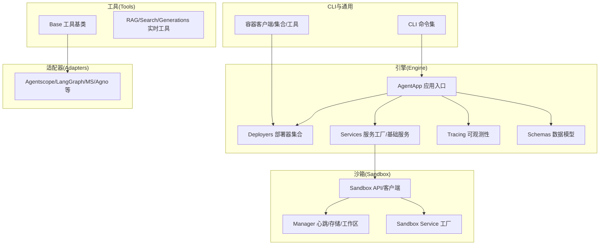

图表来源
- [src/agentscope_runtime/engine/app/agent_app.py](file://src/agentscope_runtime/engine/app/agent_app.py)
- [src/agentscope_runtime/engine/deployers/base.py](file://src/agentscope_runtime/engine/deployers/base.py)
- [src/agentscope_runtime/engine/services/service_factory.py](file://src/agentscope_runtime/engine/services/service_factory.py)
- [src/agentscope_runtime/engine/tracing/base.py](file://src/agentscope_runtime/engine/tracing/base.py)
- [src/agentscope_runtime/engine/schemas/agent_schemas.py](file://src/agentscope_runtime/engine/schemas/agent_schemas.py)
- [src/agentscope_runtime/sandbox/__init__.py](file://src/agentscope_runtime/sandbox/__init__.py)
- [src/agentscope_runtime/sandbox/services/sandbox_service_factory.py](file://src/agentscope_runtime/sandbox/services/sandbox_service_factory.py)
- [src/agentscope_runtime/tools/base.py](file://src/agentscope_runtime/tools/base.py)
- [src/agentscope_runtime/adapters/agentscope/message.py](file://src/agentscope_runtime/adapters/agentscope/message.py)
- [src/agentscope_runtime/cli/cli.py](file://src/agentscope_runtime/cli/cli.py)
- [src/agentscope_runtime/common/container_clients/base_client.py](file://src/agentscope_runtime/common/container_clients/base_client.py)

章节来源
- [README.md:109-140](file://README.md#L109-L140)
- [pyproject.toml:1-104](file://pyproject.toml#L1-L104)

## 核心组件
- 引擎应用（AgentApp）：提供Agent作为服务的统一入口，支持生命周期管理、消息流式输出、状态持久化与协议适配。
- 部署器（Deployers）：封装本地、K8s、Knative、Kruise、FC、PAI、AgentRun、ModelStudio等多种部署后端。
- 沙箱（Sandbox）：提供隔离执行环境，支持GUI、浏览器、文件系统、移动端、训练盒等类型，并配套管理器与服务工厂。
- 工具（Tools）：内置RAG、搜索、生成、实时语音等工具，支持与Agent框架集成。
- 适配器（Adapters）：对不同Agent框架的消息与流式输出进行适配。
- CLI：命令行工具，支持运行、聊天、调用、部署、状态查询、Web界面等。
- 通用模块：容器客户端、集合（内存/Redis）、日志与懒加载等基础设施。

章节来源
- [src/agentscope_runtime/engine/app/agent_app.py](file://src/agentscope_runtime/engine/app/agent_app.py)
- [src/agentscope_runtime/engine/deployers/base.py](file://src/agentscope_runtime/engine/deployers/base.py)
- [src/agentscope_runtime/sandbox/base.py](file://src/agentscope_runtime/sandbox/base.py)
- [src/agentscope_runtime/tools/base.py](file://src/agentscope_runtime/tools/base.py)
- [src/agentscope_runtime/adapters/agentscope/message.py](file://src/agentscope_runtime/adapters/agentscope/message.py)
- [src/agentscope_runtime/cli/cli.py](file://src/agentscope_runtime/cli/cli.py)
- [src/agentscope_runtime/common/container_clients/base_client.py](file://src/agentscope_runtime/common/container_clients/base_client.py)

## 架构总览
下图展示从CLI到AgentApp，再到部署器与沙箱服务的整体调用链路与职责边界。

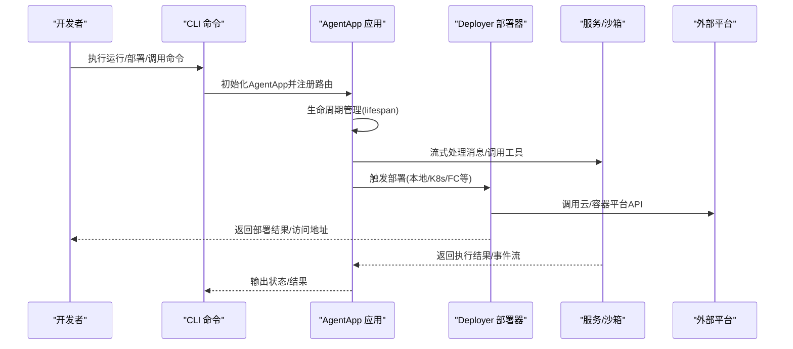

图表来源
- [src/agentscope_runtime/cli/commands/run.py](file://src/agentscope_runtime/cli/commands/run.py)
- [src/agentscope_runtime/cli/commands/deploy.py](file://src/agentscope_runtime/cli/commands/deploy.py)
- [src/agentscope_runtime/engine/app/agent_app.py](file://src/agentscope_runtime/engine/app/agent_app.py)
- [src/agentscope_runtime/engine/deployers/base.py](file://src/agentscope_runtime/engine/deployers/base.py)
- [src/agentscope_runtime/sandbox/services/sandbox_service.py](file://src/agentscope_runtime/sandbox/services/sandbox_service.py)

## 详细组件分析

### 引擎应用（AgentApp）
- 职责：基于FastAPI构建Agent服务，提供流式响应、会话状态管理、生命周期钩子与协议适配。
- 关键点：支持多框架适配（Agentscope/LangGraph/MS/Agno），消息流式输出，状态加载/保存。
- 典型流程：初始化lifespan -> 注册query处理器 -> 启动服务 -> 处理请求 -> 流式返回 -> 清理资源。

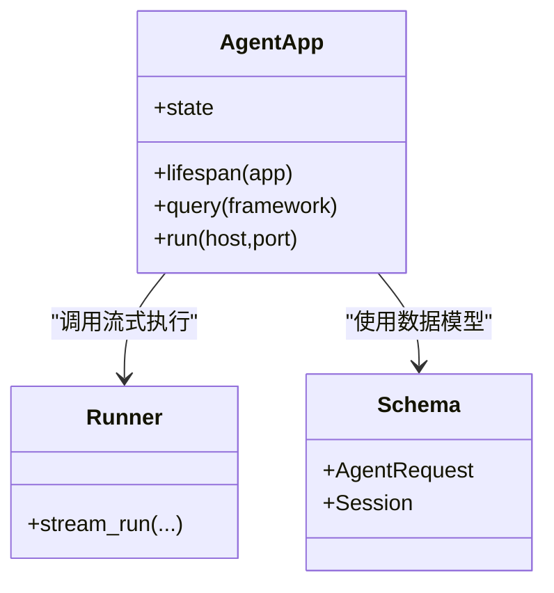

图表来源
- [src/agentscope_runtime/engine/app/agent_app.py](file://src/agentscope_runtime/engine/app/agent_app.py)
- [src/agentscope_runtime/engine/helpers/runner.py](file://src/agentscope_runtime/engine/helpers/runner.py)
- [src/agentscope_runtime/engine/schemas/agent_schemas.py](file://src/agentscope_runtime/engine/schemas/agent_schemas.py)
- [src/agentscope_runtime/engine/schemas/session.py](file://src/agentscope_runtime/engine/schemas/session.py)

章节来源
- [src/agentscope_runtime/engine/app/agent_app.py](file://src/agentscope_runtime/engine/app/agent_app.py)
- [src/agentscope_runtime/engine/helpers/runner.py](file://src/agentscope_runtime/engine/helpers/runner.py)
- [src/agentscope_runtime/engine/schemas/agent_schemas.py](file://src/agentscope_runtime/engine/schemas/agent_schemas.py)

### 部署器（Deployers）
- 支持后端：本地、Kubernetes、Knative、Kruise、阿里云FC、PAI、AgentRun、ModelStudio。
- 统一接口：继承自基础部署器，实现各自平台的打包、镜像构建、服务暴露与路由配置。
- 配置模式：通过配置对象或环境变量控制镜像、命名空间、标签与平台参数。

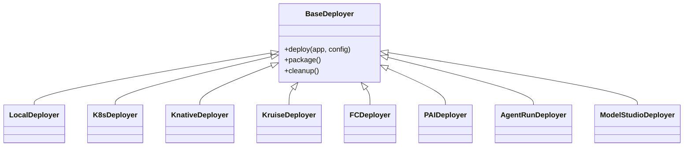

图表来源
- [src/agentscope_runtime/engine/deployers/base.py](file://src/agentscope_runtime/engine/deployers/base.py)
- [src/agentscope_runtime/engine/deployers/local_deployer.py](file://src/agentscope_runtime/engine/deployers/local_deployer.py)
- [src/agentscope_runtime/engine/deployers/kubernetes_deployer.py](file://src/agentscope_runtime/engine/deployers/kubernetes_deployer.py)
- [src/agentscope_runtime/engine/deployers/knative_deployer.py](file://src/agentscope_runtime/engine/deployers/knative_deployer.py)
- [src/agentscope_runtime/engine/deployers/kruise_deployer.py](file://src/agentscope_runtime/engine/deployers/kruise_deployer.py)
- [src/agentscope_runtime/engine/deployers/fc_deployer.py](file://src/agentscope_runtime/engine/deployers/fc_deployer.py)
- [src/agentscope_runtime/engine/deployers/pai_deployer.py](file://src/agentscope_runtime/engine/deployers/pai_deployer.py)
- [src/agentscope_runtime/engine/deployers/agentrun_deployer.py](file://src/agentscope_runtime/engine/deployers/agentrun_deployer.py)
- [src/agentscope_runtime/engine/deployers/modelstudio_deployer.py](file://src/agentscope_runtime/engine/deployers/modelstudio_deployer.py)

章节来源
- [src/agentscope_runtime/engine/deployers/base.py](file://src/agentscope_runtime/engine/deployers/base.py)
- [src/agentscope_runtime/engine/deployers/local_deployer.py](file://src/agentscope_runtime/engine/deployers/local_deployer.py)
- [src/agentscope_runtime/engine/deployers/kubernetes_deployer.py](file://src/agentscope_runtime/engine/deployers/kubernetes_deployer.py)
- [src/agentscope_runtime/engine/deployers/knative_deployer.py](file://src/agentscope_runtime/engine/deployers/knative_deployer.py)
- [src/agentscope_runtime/engine/deployers/kruise_deployer.py](file://src/agentscope_runtime/engine/deployers/kruise_deployer.py)
- [src/agentscope_runtime/engine/deployers/fc_deployer.py](file://src/agentscope_runtime/engine/deployers/fc_deployer.py)
- [src/agentscope_runtime/engine/deployers/pai_deployer.py](file://src/agentscope_runtime/engine/deployers/pai_deployer.py)
- [src/agentscope_runtime/engine/deployers/agentrun_deployer.py](file://src/agentscope_runtime/engine/deployers/agentrun_deployer.py)
- [src/agentscope_runtime/engine/deployers/modelstudio_deployer.py](file://src/agentscope_runtime/engine/deployers/modelstudio_deployer.py)

### 沙箱（Sandbox）
- 类型：基础、GUI、浏览器、文件系统、移动端、训练盒、AgentBay等。
- 管理：提供管理器、心跳、工作区与存储（本地/对象存储）。
- 服务：沙箱服务工厂按需创建对应服务，支持同步与异步两种模式。

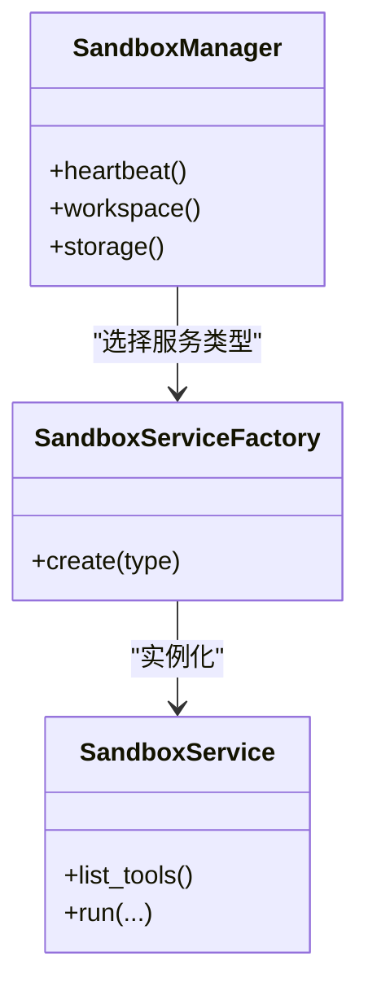

图表来源
- [src/agentscope_runtime/sandbox/manager/sandbox_manager.py](file://src/agentscope_runtime/sandbox/manager/sandbox_manager.py)
- [src/agentscope_runtime/sandbox/services/sandbox_service_factory.py](file://src/agentscope_runtime/sandbox/services/sandbox_service_factory.py)
- [src/agentscope_runtime/sandbox/services/sandbox_service.py](file://src/agentscope_runtime/sandbox/services/sandbox_service.py)

章节来源
- [src/agentscope_runtime/sandbox/manager/sandbox_manager.py](file://src/agentscope_runtime/sandbox/manager/sandbox_manager.py)
- [src/agentscope_runtime/sandbox/services/sandbox_service_factory.py](file://src/agentscope_runtime/sandbox/services/sandbox_service_factory.py)
- [src/agentscope_runtime/sandbox/services/sandbox_service.py](file://src/agentscope_runtime/sandbox/services/sandbox_service.py)

### 工具（Tools）
- 分类：RAG、搜索、图像/视频生成、实时语音（ASR/TTS）等。
- 基类：统一接口定义，便于与Agent框架集成与适配。
- MCP包装：通过MCP协议桥接外部能力。

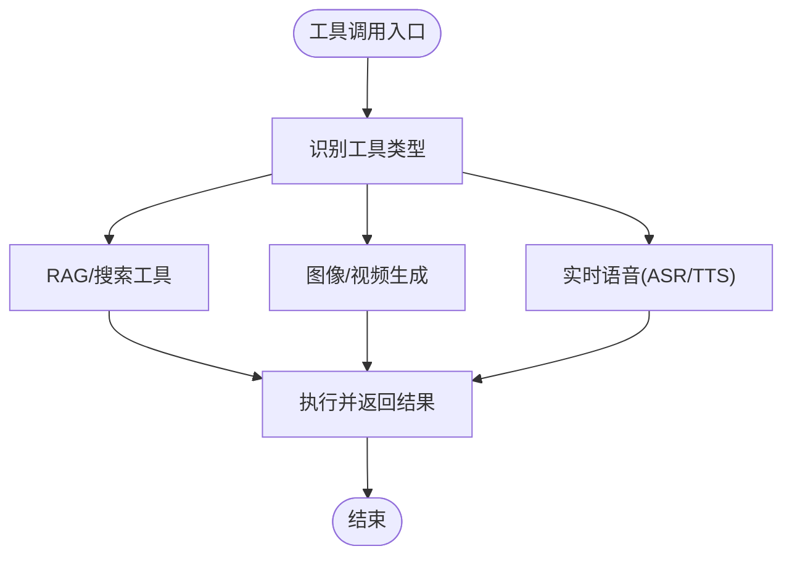

图表来源
- [src/agentscope_runtime/tools/base.py](file://src/agentscope_runtime/tools/base.py)
- [src/agentscope_runtime/tools/RAGs/modelstudio_rag.py](file://src/agentscope_runtime/tools/RAGs/modelstudio_rag.py)
- [src/agentscope_runtime/tools/searches/modelstudio_search.py](file://src/agentscope_runtime/tools/searches/modelstudio_search.py)
- [src/agentscope_runtime/tools/generations/image_generation.py](file://src/agentscope_runtime/tools/generations/image_generation.py)
- [src/agentscope_runtime/tools/realtime_clients/asr_client.py](file://src/agentscope_runtime/tools/realtime_clients/asr_client.py)
- [src/agentscope_runtime/tools/realtime_clients/tts_client.py](file://src/agentscope_runtime/tools/realtime_clients/tts_client.py)

章节来源
- [src/agentscope_runtime/tools/base.py](file://src/agentscope_runtime/tools/base.py)
- [src/agentscope_runtime/tools/RAGs/modelstudio_rag.py](file://src/agentscope_runtime/tools/RAGs/modelstudio_rag.py)
- [src/agentscope_runtime/tools/searches/modelstudio_search.py](file://src/agentscope_runtime/tools/searches/modelstudio_search.py)
- [src/agentscope_runtime/tools/generations/image_generation.py](file://src/agentscope_runtime/tools/generations/image_generation.py)
- [src/agentscope_runtime/tools/realtime_clients/asr_client.py](file://src/agentscope_runtime/tools/realtime_clients/asr_client.py)
- [src/agentscope_runtime/tools/realtime_clients/tts_client.py](file://src/agentscope_runtime/tools/realtime_clients/tts_client.py)

### 适配器（Adapters）
- 作用：将不同Agent框架的消息与流式输出转换为统一格式，便于引擎统一处理。
- 支持：Agentscope、LangGraph、MS Agent Framework、Agno、AutoGen等。

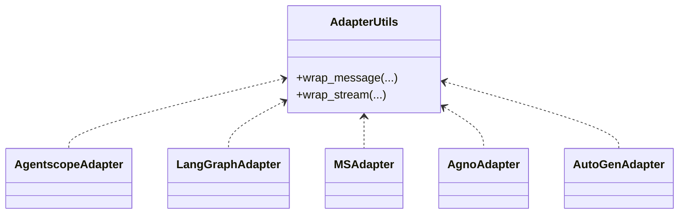

图表来源
- [src/agentscope_runtime/adapters/utils.py](file://src/agentscope_runtime/adapters/utils.py)
- [src/agentscope_runtime/adapters/agentscope/message.py](file://src/agentscope_runtime/adapters/agentscope/message.py)
- [src/agentscope_runtime/adapters/agentscope/stream.py](file://src/agentscope_runtime/adapters/agentscope/stream.py)
- [src/agentscope_runtime/adapters/langgraph/message.py](file://src/agentscope_runtime/adapters/langgraph/message.py)
- [src/agentscope_runtime/adapters/langgraph/stream.py](file://src/agentscope_runtime/adapters/langgraph/stream.py)
- [src/agentscope_runtime/adapters/ms_agent_framework/message.py](file://src/agentscope_runtime/adapters/ms_agent_framework/message.py)
- [src/agentscope_runtime/adapters/ms_agent_framework/stream.py](file://src/agentscope_runtime/adapters/ms_agent_framework/stream.py)
- [src/agentscope_runtime/adapters/agno/message.py](file://src/agentscope_runtime/adapters/agno/message.py)
- [src/agentscope_runtime/adapters/agno/stream.py](file://src/agentscope_runtime/adapters/agno/stream.py)
- [src/agentscope_runtime/adapters/autogen/tool/tool.py](file://src/agentscope_runtime/adapters/autogen/tool/tool.py)

章节来源
- [src/agentscope_runtime/adapters/utils.py](file://src/agentscope_runtime/adapters/utils.py)
- [src/agentscope_runtime/adapters/agentscope/message.py](file://src/agentscope_runtime/adapters/agentscope/message.py)
- [src/agentscope_runtime/adapters/agentscope/stream.py](file://src/agentscope_runtime/adapters/agentscope/stream.py)
- [src/agentscope_runtime/adapters/langgraph/message.py](file://src/agentscope_runtime/adapters/langgraph/message.py)
- [src/agentscope_runtime/adapters/langgraph/stream.py](file://src/agentscope_runtime/adapters/langgraph/stream.py)
- [src/agentscope_runtime/adapters/ms_agent_framework/message.py](file://src/agentscope_runtime/adapters/ms_agent_framework/message.py)
- [src/agentscope_runtime/adapters/ms_agent_framework/stream.py](file://src/agentscope_runtime/adapters/ms_agent_framework/stream.py)
- [src/agentscope_runtime/adapters/agno/message.py](file://src/agentscope_runtime/adapters/agno/message.py)
- [src/agentscope_runtime/adapters/agno/stream.py](file://src/agentscope_runtime/adapters/agno/stream.py)
- [src/agentscope_runtime/adapters/autogen/tool/tool.py](file://src/agentscope_runtime/adapters/autogen/tool/tool.py)

### CLI与通用模块
- CLI：run/chat/invoke/deploy/status/stop/web等命令，简化开发与运维操作。
- 通用：容器客户端（Docker/gVisor/Boxlite/K8s/Knative/Kruise/FC/AgentRun/PAI）、集合（内存/Redis映射/队列/集合）、日志与懒加载工具。

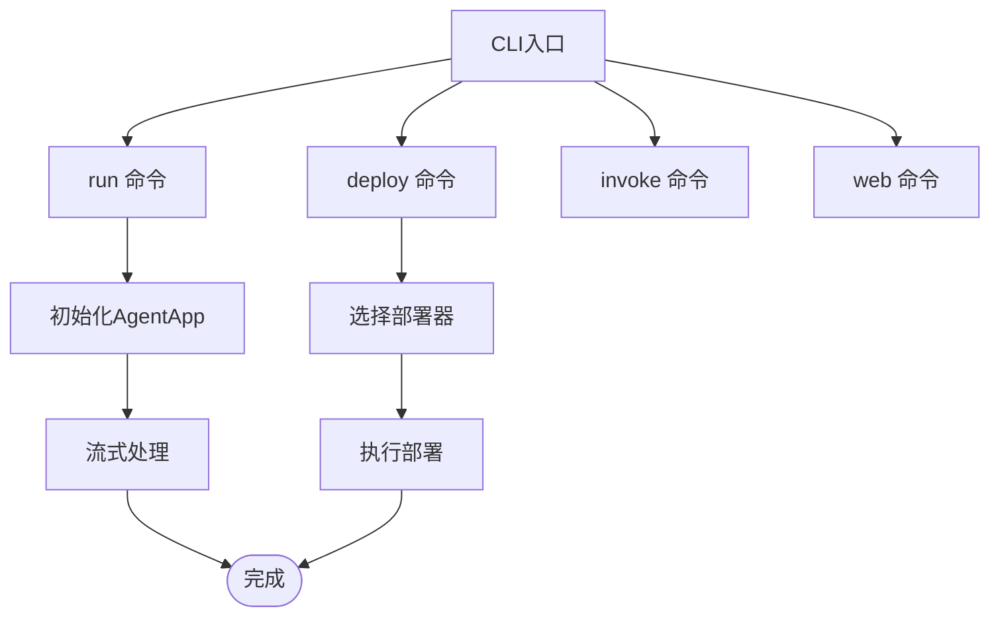

图表来源
- [src/agentscope_runtime/cli/cli.py](file://src/agentscope_runtime/cli/cli.py)
- [src/agentscope_runtime/cli/commands/run.py](file://src/agentscope_runtime/cli/commands/run.py)
- [src/agentscope_runtime/cli/commands/deploy.py](file://src/agentscope_runtime/cli/commands/deploy.py)
- [src/agentscope_runtime/cli/commands/invoke.py](file://src/agentscope_runtime/cli/commands/invoke.py)
- [src/agentscope_runtime/cli/commands/web.py](file://src/agentscope_runtime/cli/commands/web.py)
- [src/agentscope_runtime/common/container_clients/docker_client.py](file://src/agentscope_runtime/common/container_clients/docker_client.py)
- [src/agentscope_runtime/common/container_clients/kubernetes_client.py](file://src/agentscope_runtime/common/container_clients/kubernetes_client.py)
- [src/agentscope_runtime/common/collections/in_memory_mapping.py](file://src/agentscope_runtime/common/collections/in_memory_mapping.py)
- [src/agentscope_runtime/common/collections/redis_mapping.py](file://src/agentscope_runtime/common/collections/redis_mapping.py)

章节来源
- [src/agentscope_runtime/cli/cli.py](file://src/agentscope_runtime/cli/cli.py)
- [src/agentscope_runtime/cli/commands/run.py](file://src/agentscope_runtime/cli/commands/run.py)
- [src/agentscope_runtime/cli/commands/deploy.py](file://src/agentscope_runtime/cli/commands/deploy.py)
- [src/agentscope_runtime/cli/commands/invoke.py](file://src/agentscope_runtime/cli/commands/invoke.py)
- [src/agentscope_runtime/cli/commands/web.py](file://src/agentscope_runtime/cli/commands/web.py)
- [src/agentscope_runtime/common/container_clients/docker_client.py](file://src/agentscope_runtime/common/container_clients/docker_client.py)
- [src/agentscope_runtime/common/container_clients/kubernetes_client.py](file://src/agentscope_runtime/common/container_clients/kubernetes_client.py)
- [src/agentscope_runtime/common/collections/in_memory_mapping.py](file://src/agentscope_runtime/common/collections/in_memory_mapping.py)
- [src/agentscope_runtime/common/collections/redis_mapping.py](file://src/agentscope_runtime/common/collections/redis_mapping.py)

## 依赖关系分析
- 运行时依赖：FastAPI、Uvicorn、OpenAI SDK、Pydantic、Docker、Redis、Kubernetes、Celery、A2A SDK、Jinja2、DashScope等。
- 可选扩展：LangChain/LangGraph/AutoGen、Azure/ModelStudio/FC/PAI/AgentRun等平台SDK。
- 包管理：通过pyproject.toml声明依赖与脚本入口；setup.py委托setuptools构建。

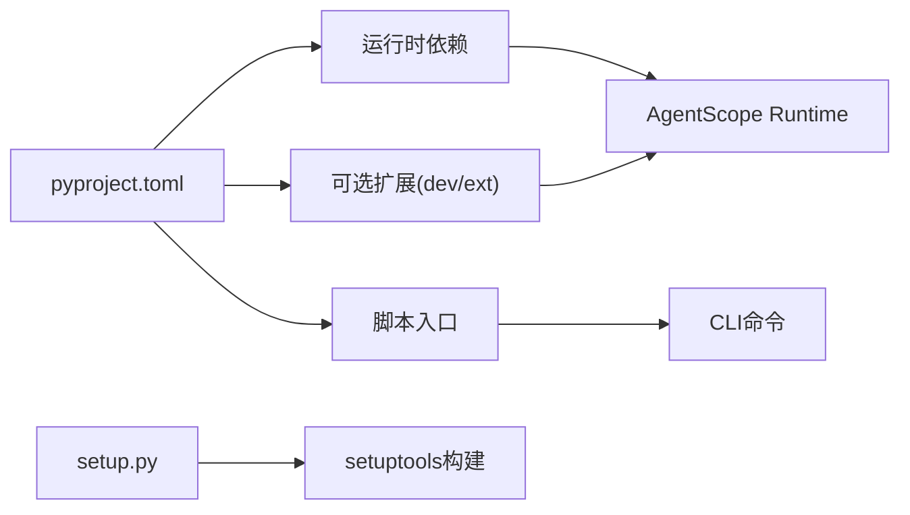

图表来源
- [pyproject.toml:1-104](file://pyproject.toml#L1-L104)
- [setup.py:1-5](file://setup.py#L1-L5)

章节来源
- [pyproject.toml:1-104](file://pyproject.toml#L1-L104)
- [setup.py:1-5](file://setup.py#L1-L5)

## 性能与可扩展性
- 并发与流式：AgentApp与Runner支持异步与流式输出，降低延迟并提升吞吐。
- 容器化与弹性：支持K8s/Knative/Kruise弹性扩缩容，结合Redis/Celery实现分布式任务与状态管理。
- 沙箱隔离：通过Docker/gVisor/Boxlite等后端隔离工具执行，保障安全与稳定性。
- 观测性：Tracing模块提供本地日志、消息追踪与指标采集，便于问题定位与性能优化。

章节来源
- [src/agentscope_runtime/engine/helpers/runner.py](file://src/agentscope_runtime/engine/helpers/runner.py)
- [src/agentscope_runtime/engine/tracing/base.py](file://src/agentscope_runtime/engine/tracing/base.py)
- [src/agentscope_runtime/engine/tracing/tracing_util.py](file://src/agentscope_runtime/engine/tracing/tracing_util.py)
- [src/agentscope_runtime/engine/tracing/tracing_metric.py](file://src/agentscope_runtime/engine/tracing/tracing_metric.py)
- [src/agentscope_runtime/common/container_clients/docker_client.py](file://src/agentscope_runtime/common/container_clients/docker_client.py)
- [src/agentscope_runtime/common/container_clients/kubernetes_client.py](file://src/agentscope_runtime/common/container_clients/kubernetes_client.py)

## 测试策略与测试套件
- 单元测试（Unit）：覆盖适配器、网络工具、沙箱服务工厂、中断混合等。
- 集成测试（Integrated）：覆盖AgentApp流式执行、多框架集成、Runner流式代理等。
- 部署测试（Deploy）：覆盖本地/K8s/Knative/Kruise/FC/PAI/AgentRun/ModelStudio部署器。
- 沙箱测试（Sandbox）：覆盖心跳、重连恢复、各类沙箱类型与服务。

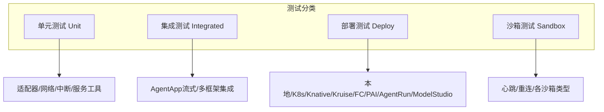

图表来源
- [tests/unit/test_runner_stream.py](file://tests/unit/test_runner_stream.py)
- [tests/integrated/test_agent_app.py](file://tests/integrated/test_agent_app.py)
- [tests/deploy/test_local_deployer.py](file://tests/deploy/test_local_deployer.py)
- [tests/sandbox/test_sandbox.py](file://tests/sandbox/test_sandbox.py)

章节来源
- [tests/unit/test_runner_stream.py](file://tests/unit/test_runner_stream.py)
- [tests/integrated/test_agent_app.py](file://tests/integrated/test_agent_app.py)
- [tests/deploy/test_local_deployer.py](file://tests/deploy/test_local_deployer.py)
- [tests/sandbox/test_sandbox.py](file://tests/sandbox/test_sandbox.py)

## 发布流程与版本管理
- 版本号：项目版本在版本文件中声明，同时pyproject.toml中定义。
- 发布入口：通过脚本入口将CLI与沙箱相关命令暴露给用户。
- 自动化发布：使用Release Drafter根据PR标签自动汇总变更日志并生成草稿版本。

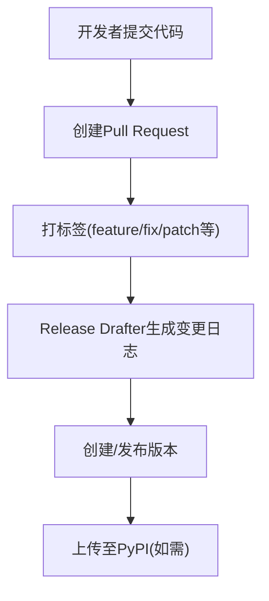

图表来源
- [src/agentscope_runtime/version.py](file://src/agentscope_runtime/version.py)
- [pyproject.toml:45-51](file://pyproject.toml#L45-L51)
- [.github/release-drafter.yml:1-33](file://.github/release-drafter.yml#L1-L33)

章节来源
- [src/agentscope_runtime/version.py](file://src/agentscope_runtime/version.py)
- [pyproject.toml:45-51](file://pyproject.toml#L45-L51)
- [.github/release-drafter.yml:1-33](file://.github/release-drafter.yml#L1-L33)

## 代码审查与质量保证
- 提交前检查：安装并启用pre-commit钩子，确保格式化、静态检查与ESLint/Stylelint修复。
- 代码风格：Black、Flake8、Pylint、ESLint、Stylelint等工具协同保证一致性。
- 文档与变更：PR模板要求描述影响范围、测试方法与安全注意事项。

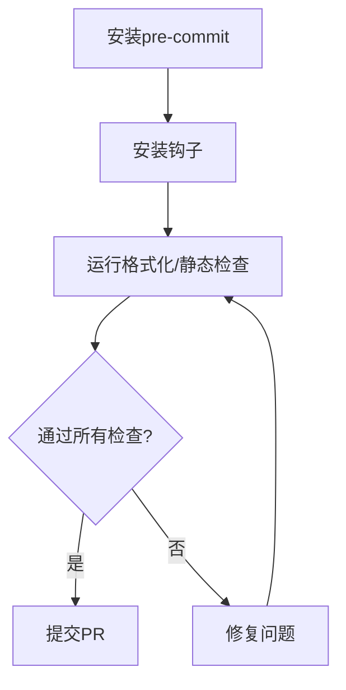

图表来源
- [.pre-commit-config.yaml:1-122](file://.pre-commit-config.yaml#L1-L122)
- [.eslintrc:1-24](file://.eslintrc#L1-L24)
- [.stylelintrc:1-6](file://.stylelintrc#L1-L6)
- [.flake8:1-12](file://.flake8#L1-L12)
- [.github/PULL_REQUEST_TEMPLATE.md:1-34](file://.github/PULL_REQUEST_TEMPLATE.md#L1-L34)

章节来源
- [.pre-commit-config.yaml:1-122](file://.pre-commit-config.yaml#L1-L122)
- [.eslintrc:1-24](file://.eslintrc#L1-L24)
- [.stylelintrc:1-6](file://.stylelintrc#L1-L6)
- [.flake8:1-12](file://.flake8#L1-L12)
- [.github/PULL_REQUEST_TEMPLATE.md:1-34](file://.github/PULL_REQUEST_TEMPLATE.md#L1-L34)

## IDE配置与开发工具推荐
- Python环境：建议使用Python 3.10+，推荐IDE（如PyCharm）启用Black、Flake8、Pylint插件。
- 前端（WebUI）：Vite + TypeScript + React，建议启用ESLint与Prettier。
- Git钩子：安装pre-commit并启用所有钩子，避免提交不合规代码。
- 包管理：使用pip与可选扩展组（dev/ext）满足开发与集成需求。

章节来源
- [pyproject.toml:53-99](file://pyproject.toml#L53-L99)
- [.pre-commit-config.yaml:1-122](file://.pre-commit-config.yaml#L1-L122)
- [web/starter_webui/vite.config.ts](file://web/starter_webui/vite.config.ts)

## CI/CD流水线与自动化测试
- 自动化测试：pytest配置已启用异步模式，建议在CI中运行全量测试套件。
- 代码质量：pre-commit钩子在本地强制执行，CI可复用相同规则。
- 发布流程：Release Drafter根据PR标签自动生成变更日志，便于快速发布。

章节来源
- [pyproject.toml:101-104](file://pyproject.toml#L101-L104)
- [.pre-commit-config.yaml:1-122](file://.pre-commit-config.yaml#L1-L122)
- [.github/release-drafter.yml:1-33](file://.github/release-drafter.yml#L1-L33)

## 社区参与与沟通渠道
- 讨论与反馈：GitHub Discussions、Discord、钉钉群。
- 贡献指南：参见贡献文档与PR模板，遵循Issue与PR流程。
- 文档站点：提供中英文教程与示例，便于学习与参考。

章节来源
- [README.md:627-659](file://README.md#L627-L659)
- [CONTRIBUTING.md:1-111](file://CONTRIBUTING.md#L1-L111)
- [.github/PULL_REQUEST_TEMPLATE.md:1-34](file://.github/PULL_REQUEST_TEMPLATE.md#L1-L34)

## 结论
本指南系统梳理了AgentScope Runtime的开发环境、组件架构、测试策略、发布与质量保证、CI/CD与社区协作等关键环节。建议开发者在本地先完成pre-commit检查与单元/集成测试，再提交PR并配合Release Drafter完成版本发布。通过CLI与部署器，可快速将Agent应用以流式API形式部署到多种平台，实现安全、可观测与可扩展的Agent服务。