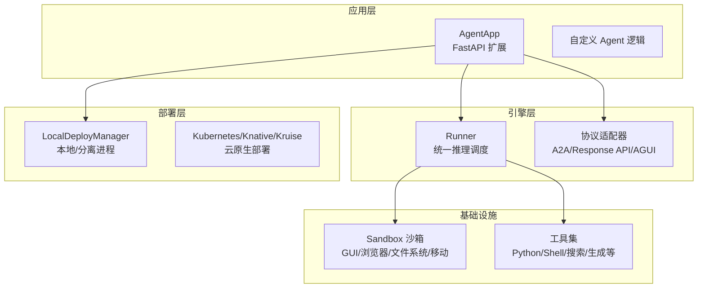
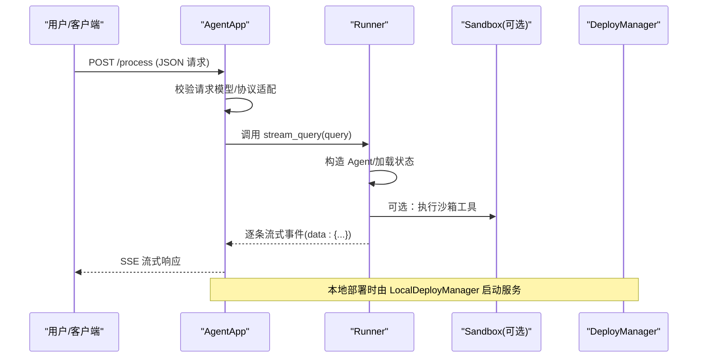
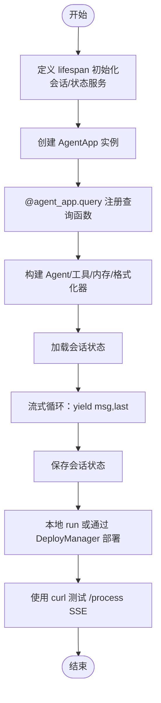
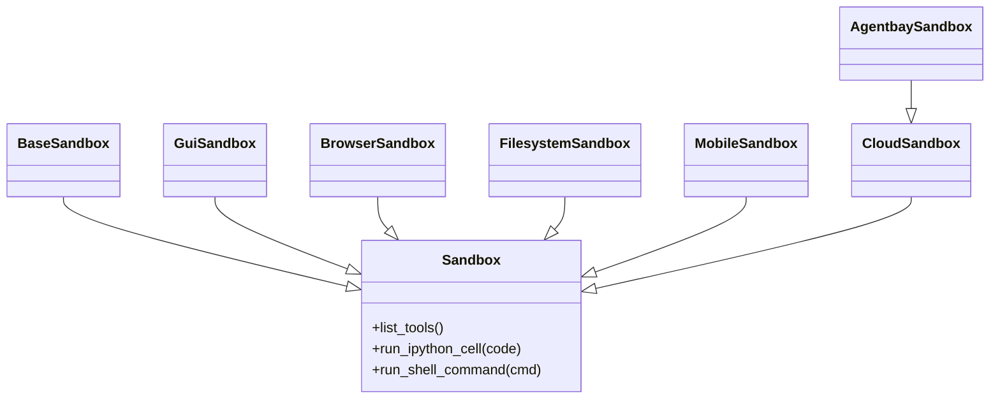
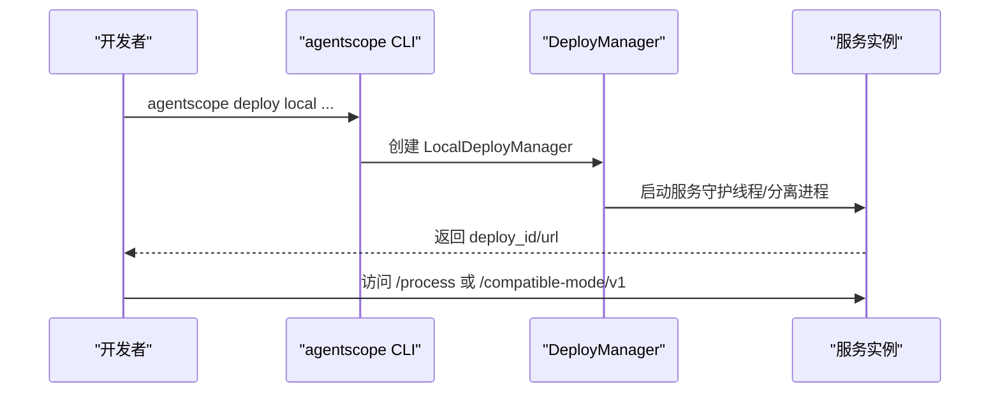
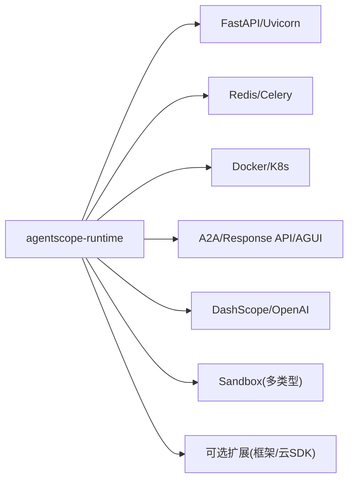

# 快速开始

<cite>
**本文引用的文件**
- [README.md](file://README.md)
- [pyproject.toml](file://pyproject.toml)
- [setup.py](file://setup.py)
- [src/agentscope_runtime/engine/__init__.py](file://src/agentscope_runtime/engine/__init__.py)
- [src/agentscope_runtime/engine/app/agent_app.py](file://src/agentscope_runtime/engine/app/agent_app.py)
- [src/agentscope_runtime/engine/deployers/local_deployer.py](file://src/agentscope_runtime/engine/deployers/local_deployer.py)
- [src/agentscope_runtime/cli/cli.py](file://src/agentscope_runtime/cli/cli.py)
- [src/agentscope_runtime/sandbox/__init__.py](file://src/agentscope_runtime/sandbox/__init__.py)
- [cookbook/zh/quickstart.md](file://cookbook/zh/quickstart.md)
- [examples/integrations/langgraph/run_langgraph_agent.py](file://examples/integrations/langgraph/run_langgraph_agent.py)
- [examples/deployments/local_deploy_config.yaml](file://examples/deployments/local_deploy_config.yaml)
- [examples/deployments/daemon_local_deploy/app_deploy.py](file://examples/deployments/daemon_local_deploy/app_deploy.py)
- [examples/sandbox/custom_sandbox/README.md](file://examples/sandbox/custom_sandbox/README.md)
- [examples/sandbox/agentbay_sandbox/README.md](file://examples/sandbox/agentbay_sandbox/README.md)
</cite>

## 目录
1. [简介](#简介)
2. [项目结构](#项目结构)
3. [核心组件](#核心组件)
4. [架构总览](#架构总览)
5. [详细组件解析](#详细组件解析)
6. [依赖关系分析](#依赖关系分析)
7. [性能考虑](#性能考虑)
8. [故障排查指南](#故障排查指南)
9. [结论](#结论)
10. [附录](#附录)

## 简介
本指南面向初学者与进阶用户，帮助你在最短时间内完成 AgentScope Runtime 的安装、配置与运行，涵盖以下目标：
- 从 PyPI 与源码两种方式安装
- 明确前置条件与依赖
- 创建最小 Agent API 服务（支持流式输出）
- 体验安全沙箱（Sandbox）能力
- 本地部署与访问示例
- 使用 curl 测试 SSE 流式输出
- 提供常见问题排查建议

## 项目结构
AgentScope Runtime 采用“引擎 + 适配器 + 沙箱 + 工具”的分层设计，核心入口为 Engine（AgentApp/FastAPI 扩展）、部署器（Local/Kubernetes/Knative 等）、沙箱（GUI/浏览器/文件系统/移动/训练盒等）与工具生态。

图示来源
- [src/agentscope_runtime/engine/app/agent_app.py:60-220](file://src/agentscope_runtime/engine/app/agent_app.py#L60-L220)
- [src/agentscope_runtime/engine/deployers/local_deployer.py:27-170](file://src/agentscope_runtime/engine/deployers/local_deployer.py#L27-L170)
- [src/agentscope_runtime/sandbox/__init__.py:6-16](file://src/agentscope_runtime/sandbox/__init__.py#L6-L16)

章节来源
- [src/agentscope_runtime/engine/__init__.py:5-34](file://src/agentscope_runtime/engine/__init__.py#L5-L34)
- [src/agentscope_runtime/engine/app/agent_app.py:60-220](file://src/agentscope_runtime/engine/app/agent_app.py#L60-L220)

## 核心组件
- AgentApp：基于 FastAPI 的 Agent 应用核心，负责生命周期、路由、协议适配与流式输出。
- Runner：统一的推理调度器，承载框架无关的 query 处理与流式事件生成。
- DeployManager：部署抽象，提供本地/分离进程等多种部署模式。
- Sandbox：多类型隔离沙箱，支持 GUI、浏览器、文件系统、移动设备等场景。
- CLI：命令行工具，提供 run/deploy/list/status/stop/invoke/sandbox 等子命令。

章节来源
- [src/agentscope_runtime/engine/app/agent_app.py:60-220](file://src/agentscope_runtime/engine/app/agent_app.py#L60-L220)
- [src/agentscope_runtime/engine/deployers/local_deployer.py:27-170](file://src/agentscope_runtime/engine/deployers/local_deployer.py#L27-L170)
- [src/agentscope_runtime/sandbox/__init__.py:6-16](file://src/agentscope_runtime/sandbox/__init__.py#L6-L16)
- [src/agentscope_runtime/cli/cli.py:30-54](file://src/agentscope_runtime/cli/cli.py#L30-L54)

## 架构总览
AgentApp 继承 FastAPI 并集成 Runner，自动注册健康检查、根路径信息与协议适配器提供的多协议端点；部署器负责将服务以线程守护或分离进程方式启动，并支持状态管理与优雅停机。

图示来源
- [src/agentscope_runtime/engine/app/agent_app.py:781-803](file://src/agentscope_runtime/engine/app/agent_app.py#L781-L803)
- [src/agentscope_runtime/engine/deployers/local_deployer.py:175-258](file://src/agentscope_runtime/engine/deployers/local_deployer.py#L175-L258)

## 详细组件解析

### 安装与前置条件
- 运行环境
  - Python 版本：3.10 或更高
  - 包管理器：pip 或 uv
- 从 PyPI 安装
  - 核心依赖：agentscope-runtime
  - 可选扩展：agentscope-runtime[ext]
  - 预览版本：pip install --pre agentscope-runtime
- 从源码安装（推荐用于沙箱定制）
  - 克隆仓库并使用可编辑模式安装，便于修改与即时生效
- 依赖说明（关键）
  - FastAPI、Uvicorn、OpenAI SDK、Pydantic、Redis、Docker、Kubernetes、Celery、A2A 协议等

章节来源
- [README.md:111-140](file://README.md#L111-L140)
- [pyproject.toml:6-32](file://pyproject.toml#L6-L32)
- [pyproject.toml:53-99](file://pyproject.toml#L53-L99)
- [setup.py:1-5](file://setup.py#L1-L5)

### 最小 Agent API 服务（SSE 流式输出）
- 步骤概览
  - 定义 lifespan 生命周期（初始化会话/状态服务，退出时清理）
  - 创建 AgentApp 实例，绑定查询处理函数（query 装饰器）
  - 在查询函数中构造 Agent、加载/保存会话状态、使用流式消息管道
  - 启动服务或通过 LocalDeployManager 部署
- 关键要点
  - 使用 stream_printing_messages 产出 (msg, last) 元组，驱动 SSE 输出
  - 支持 A2A、Response API、兼容 OpenAI SDK 的 Response API 模式
- curl 测试
  - 目标端点：POST /process
  - Content-Type：application/json
  - 示例请求体包含用户输入消息数组
  - 观察 data: 开头的逐条事件，直至 response completed

图示来源
- [README.md:141-270](file://README.md#L141-L270)
- [cookbook/zh/quickstart.md:63-172](file://cookbook/zh/quickstart.md#L63-L172)

章节来源
- [README.md:141-270](file://README.md#L141-L270)
- [cookbook/zh/quickstart.md:63-172](file://cookbook/zh/quickstart.md#L63-L172)

### Sandbox 示例（安全工具执行）
- 支持类型
  - BaseSandbox：Python/Shell 工具执行
  - GuiSandbox：虚拟桌面（含 VNC）
  - BrowserSandbox：浏览器自动化
  - FilesystemSandbox：文件系统操作
  - MobileSandbox：Android 模拟器（需内核模块与架构要求）
  - CloudSandbox/AgentbaySandbox：云沙箱（无需本地容器）
- 运行方式
  - 本地：Docker/gVisor/BoxLite 任选其一，通过 CONTAINER_DEPLOYMENT 切换
  - 生产：Kubernetes/函数计算等
- 配置镜像仓库/命名空间/标签
  - 通过环境变量 RUNTIME_SANDBOX_REGISTRY/NAMESPACE/TAG 控制镜像路径
- 服务化部署（Serverless）
  - 将容器部署切换至 FC 等后端，使用 runtime-sandbox-server 启动

图示来源
- [src/agentscope_runtime/sandbox/__init__.py:6-16](file://src/agentscope_runtime/sandbox/__init__.py#L6-L16)
- [examples/sandbox/agentbay_sandbox/README.md:49-86](file://examples/sandbox/agentbay_sandbox/README.md#L49-L86)

章节来源
- [README.md:272-536](file://README.md#L272-L536)
- [src/agentscope_runtime/sandbox/__init__.py:6-16](file://src/agentscope_runtime/sandbox/__init__.py#L6-L16)
- [examples/sandbox/custom_sandbox/README.md:5-21](file://examples/sandbox/custom_sandbox/README.md#L5-L21)
- [examples/sandbox/agentbay_sandbox/README.md:88-133](file://examples/sandbox/agentbay_sandbox/README.md#L88-L133)

### 部署示例（本地/兼容模式）
- 本地部署
  - LocalDeployManager 支持守护线程与分离进程两种模式
  - 可通过 YAML 配置 host/port、环境变量等
- 兼容模式
  - 通过 OpenAI SDK 的 Response API 模式访问服务
  - base_url 指向 /compatible-mode/v1
- 云原生/Serverless
  - 支持 Kubernetes/Knative/Kruise、函数计算等部署器

图示来源
- [src/agentscope_runtime/cli/cli.py:46-54](file://src/agentscope_runtime/cli/cli.py#L46-L54)
- [src/agentscope_runtime/engine/deployers/local_deployer.py:68-170](file://src/agentscope_runtime/engine/deployers/local_deployer.py#L68-L170)
- [examples/deployments/local_deploy_config.yaml:1-16](file://examples/deployments/local_deploy_config.yaml#L1-L16)

章节来源
- [README.md:538-617](file://README.md#L538-L617)
- [src/agentscope_runtime/engine/deployers/local_deployer.py:68-170](file://src/agentscope_runtime/engine/deployers/local_deployer.py#L68-L170)
- [examples/deployments/daemon_local_deploy/app_deploy.py:122-127](file://examples/deployments/daemon_local_deploy/app_deploy.py#L122-L127)

### 从 LangGraph 集成示例看 AgentApp 扩展
- 使用 AgentApp.query(framework="langgraph")，在查询函数中以流式方式返回节点消息
- 可结合 Checkpoint/Store 实现短期/长期记忆
- 自定义端点与任务队列可用于扩展业务接口

章节来源
- [examples/integrations/langgraph/run_langgraph_agent.py:59-106](file://examples/integrations/langgraph/run_langgraph_agent.py#L59-L106)

## 依赖关系分析
- 核心依赖
  - Web 框架：FastAPI、Uvicorn
  - 协议与适配：A2A、Response API、AGUI
  - 状态与存储：Redis、Celery、Kubernetes
  - 沙箱与容器：Docker、Kubernetes、gVisor、BoxLite
  - 大模型与工具：DashScope、OpenAI SDK、工具集
- 可选扩展
  - LangChain/LangGraph/AutoGen/Microsoft Agent Framework 等框架适配
  - 云平台 SDK（阿里云 FC/ACK/ModelStudio 等）

图示来源
- [pyproject.toml:7-32](file://pyproject.toml#L7-L32)
- [pyproject.toml:68-99](file://pyproject.toml#L68-L99)

章节来源
- [pyproject.toml:6-32](file://pyproject.toml#L6-L32)
- [pyproject.toml:68-99](file://pyproject.toml#L68-L99)

## 性能考虑
- 流式输出
  - 使用 stream_printing_messages 与 StreamingResponse，降低首字节延迟
- 并发与中断
  - 支持分布式中断后端（Redis/本地），便于任务预占与恢复
- 部署模式
  - 分离进程模式适合生产，守护线程模式适合开发调试
- 沙箱并发
  - 异步沙箱（Async）支持非阻塞并发工具执行，提升吞吐

## 故障排查指南
- 无法启动本地服务
  - 检查 host/port 是否被占用；确认防火墙放行
  - 若使用 0.0.0.0，连接检查会自动转为 127.0.0.1
- SSE 输出异常
  - 确认请求头 Content-Type: application/json
  - 确认请求体包含 input 字段（消息数组）
- 沙箱无法拉取镜像
  - 切换 RUNTIME_SANDBOX_REGISTRY/NAMESPACE/TAG 环境变量
  - Linux 主机需满足 Binder/ASHMEM 内核模块要求（移动端沙箱）
- 移动端沙箱兼容性
  - ARM64 架构可能存在兼容性或性能问题，建议使用 x86_64 主机
- 部署后无法访问
  - 检查 DeployManager 返回的 url 与 deploy_id
  - 云原生部署需确认网络策略/暴露方式

章节来源
- [src/agentscope_runtime/engine/deployers/local_deployer.py:566-595](file://src/agentscope_runtime/engine/deployers/local_deployer.py#L566-L595)
- [README.md:413-426](file://README.md#L413-L426)
- [README.md:524-536](file://README.md#L524-L536)

## 结论
通过本快速开始，你已掌握：
- 从 PyPI/源码安装与前置条件
- 创建最小 Agent API 服务并验证 SSE 输出
- 使用 Sandbox 安全执行工具
- 本地部署与兼容模式访问
- 基于 curl 的端到端验证流程

建议进一步阅读官方 Cookbook 与各部署器文档，逐步过渡到生产级可观测性、灰度发布与弹性扩缩容。

## 附录

### A. 从 PyPI 安装（推荐）
- 安装核心包与可选扩展
- 如需预览版本，使用 --pre 参数

章节来源
- [README.md:117-128](file://README.md#L117-L128)

### B. 从源码安装（定制沙箱）
- 使用可编辑模式安装，便于修改与即时生效
- 自定义沙箱类需注册到 SandboxRegistry

章节来源
- [examples/sandbox/custom_sandbox/README.md:5-21](file://examples/sandbox/custom_sandbox/README.md#L5-L21)

### C. curl 测试 SSE 输出
- 目标端点：POST /process
- 请求头：Content-Type: application/json
- 请求体：包含 input 字段的消息数组
- 观察 data: 开头的事件流，直至 response completed

章节来源
- [README.md:242-270](file://README.md#L242-L270)
- [cookbook/zh/quickstart.md:174-204](file://cookbook/zh/quickstart.md#L174-L204)