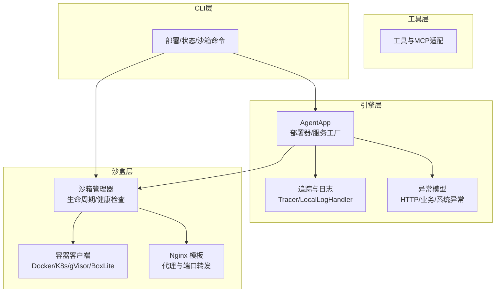
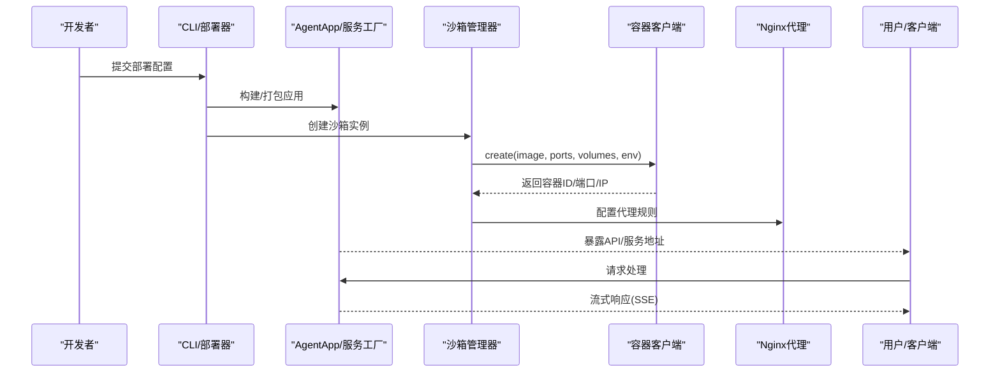
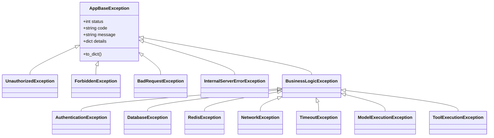
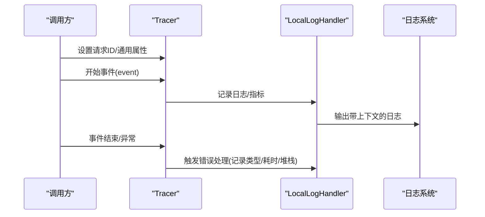
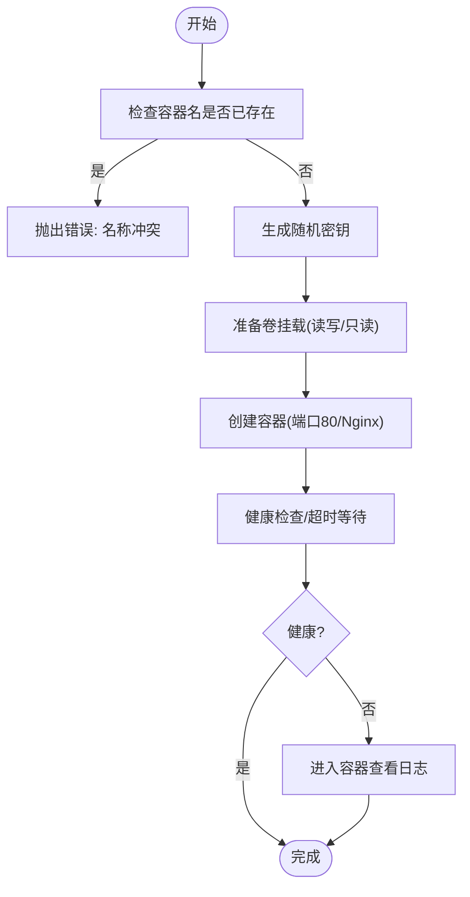
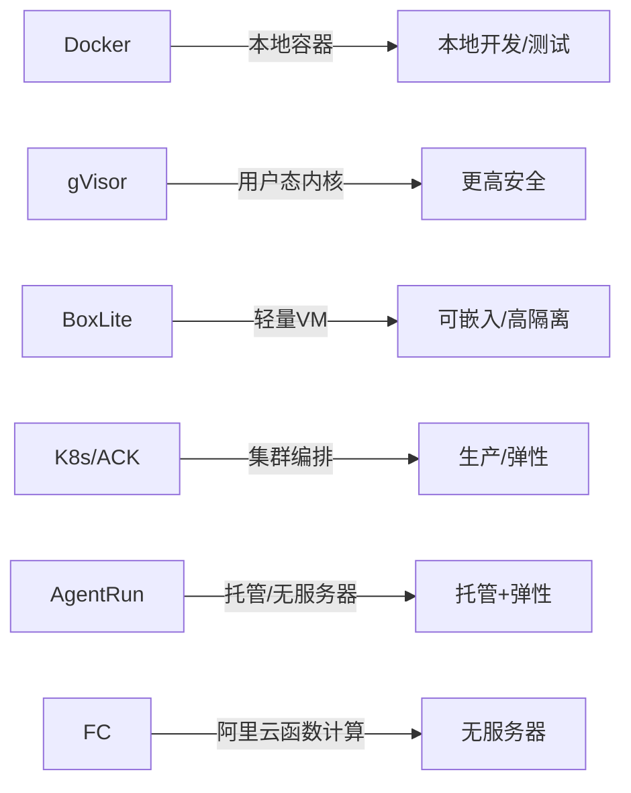
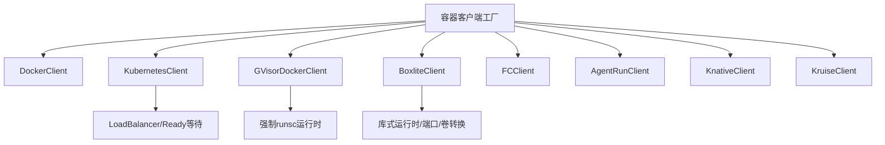

# 故障排除

<cite>
**本文引用的文件**
- [README.md](file://README.md)
- [troubleshooting.md（中文沙盒）](file://cookbook/zh/sandbox/troubleshooting.md)
- [exception.py（引擎异常模型）](file://src/agentscope_runtime/engine/schemas/exception.py)
- [logging.py（通用日志工具）](file://src/agentscope_runtime/common/utils/logging.py)
- [local_logging_handler.py（追踪日志处理器）](file://src/agentscope_runtime/engine/tracing/local_logging_handler.py)
- [tracing_util.py（追踪上下文工具）](file://src/agentscope_runtime/engine/tracing/tracing_util.py)
- [manager_config.py（沙箱管理配置校验）](file://src/agentscope_runtime/sandbox/model/manager_config.py)
- [sandbox_manager.py（沙箱生命周期与健康检查）](file://src/agentscope_runtime/sandbox/manager/sandbox_manager.py)
- [http_client.py（沙箱HTTP客户端）](file://src/agentscope_runtime/sandbox/client/http_client.py)
- [kubernetes_client.py（Kubernetes 客户端）](file://src/agentscope_runtime/common/container_clients/kubernetes_client.py)
- [gvisor_client.py（gVisor Docker 客户端）](file://src/agentscope_runtime/common/container_clients/gvisor_client.py)
- [boxlite_client.py（BoxLite 客户端）](file://src/agentscope_runtime/common/container_clients/boxlite_client.py)
- [__init__.py（容器客户端工厂）](file://src/agentscope_runtime/common/container_clients/__init__.py)
- [nginx.conf.template（沙箱Nginx模板）](file://src/agentscope_runtime/sandbox/box/gui/box/config/nginx.conf.template)
- [local_deploy_config.yaml（本地部署配置示例）](file://examples/deployments/local_deploy_config.yaml)
- [test_heartbeat.py（心跳与恢复测试）](file://tests/sandbox/test_heartbeat.py)
- [advanced.md（沙箱高级用法与后端对比）](file://cookbook/en/sandbox/advanced.md)
</cite>

## 目录
1. [简介](#简介)
2. [项目结构](#项目结构)
3. [核心组件](#核心组件)
4. [架构总览](#架构总览)
5. [详细组件分析](#详细组件分析)
6. [依赖关系分析](#依赖关系分析)
7. [性能考量](#性能考量)
8. [故障排除指南](#故障排除指南)
9. [结论](#结论)
10. [附录](#附录)

## 简介
本指南面向 AgentScope Runtime 的使用者与运维人员，聚焦于常见问题的识别与解决、调试技巧与诊断工具使用、错误码与异常处理、日志分析与定位、性能与资源瓶颈排查、网络与配置问题、容器与部署相关故障以及社区支持与问题反馈渠道。内容基于仓库中的源码与文档，提供可操作的排障步骤与可视化流程图。

## 项目结构
AgentScope Runtime 由“引擎（Engine）”“沙盒（Sandbox）”“工具（Tools）”“CLI 与部署（CLI/Deployers）”等模块组成，并通过统一的日志与追踪体系贯穿运行期。关键路径如下：
- 引擎层：AgentApp、部署器、服务工厂、追踪与日志
- 沙盒层：沙箱管理器、容器客户端（Docker/K8s/gVisor/BoxLite）、Nginx 代理模板
- 工具层：各类工具与 MCP 适配
- CLI 层：部署、状态查询、沙箱管理等命令

图表来源
- [exception.py（引擎异常模型）:1-605](file://src/agentscope_runtime/engine/schemas/exception.py#L1-L605)
- [local_logging_handler.py（追踪日志处理器）:336-369](file://src/agentscope_runtime/engine/tracing/local_logging_handler.py#L336-L369)
- [manager_config.py（沙箱管理配置校验）:318-375](file://src/agentscope_runtime/sandbox/model/manager_config.py#L318-L375)
- [sandbox_manager.py（沙箱生命周期与健康检查）:824-861](file://src/agentscope_runtime/sandbox/manager/sandbox_manager.py#L824-L861)
- [kubernetes_client.py（Kubernetes 客户端）:646-912](file://src/agentscope_runtime/common/container_clients/kubernetes_client.py#L646-L912)

章节来源
- [README.md:1-759](file://README.md#L1-L759)

## 核心组件
- 异常体系：按 HTTP 状态与业务语义分层，覆盖认证、权限、参数、速率限制、数据库/Redis/外部服务、网络/超时、模型执行、工具执行等场景，便于统一返回与前端消费。
- 日志与追踪：提供本地日志处理器与请求级上下文注入，支持跨线程携带请求 ID 与通用属性，便于串联全链路。
- 沙箱生命周期：从创建、健康检查、端口映射、卷挂载到停止/移除；支持多种容器后端与隔离级别。
- 部署与网络：本地/云/Serverless 多模式部署，Nginx 代理模板与超时配置，K8s 负载均衡与 Ready 等待。

章节来源
- [exception.py（引擎异常模型）:1-605](file://src/agentscope_runtime/engine/schemas/exception.py#L1-L605)
- [logging.py（通用日志工具）:1-45](file://src/agentscope_runtime/common/utils/logging.py#L1-L45)
- [tracing_util.py（追踪上下文工具）:1-136](file://src/agentscope_runtime/engine/tracing/tracing_util.py#L1-L136)
- [manager_config.py（沙箱管理配置校验）:318-375](file://src/agentscope_runtime/sandbox/model/manager_config.py#L318-L375)
- [sandbox_manager.py（沙箱生命周期与健康检查）:824-861](file://src/agentscope_runtime/sandbox/manager/sandbox_manager.py#L824-L861)
- [nginx.conf.template（沙箱Nginx模板）:1-47](file://src/agentscope_runtime/sandbox/box/gui/box/config/nginx.conf.template#L1-L47)

## 架构总览
AgentApp 作为统一入口，结合部署器将应用打包并部署到不同后端（本地、K8s、FC、AgentRun 等）。沙箱管理器负责容器生命周期与健康检查，Nginx 作为反向代理承载 GUI/VNC/Websockify 等流量。异常与日志贯穿全链路，追踪工具提供请求级上下文传播。

图表来源
- [sandbox_manager.py（沙箱生命周期与健康检查）:824-861](file://src/agentscope_runtime/sandbox/manager/sandbox_manager.py#L824-L861)
- [kubernetes_client.py（Kubernetes 客户端）:872-912](file://src/agentscope_runtime/common/container_clients/kubernetes_client.py#L872-L912)
- [nginx.conf.template（沙箱Nginx模板）:13-46](file://src/agentscope_runtime/sandbox/box/gui/box/config/nginx.conf.template#L13-L46)

## 详细组件分析

### 组件A：异常与错误处理
- 分层设计：HTTP 状态类异常（4xx/5xx）与业务异常（CODE + message + details），便于统一序列化与前端展示。
- 典型场景：鉴权失败、参数缺失/非法、资源不存在、数据库/Redis/外部服务不可用、网络超时、模型执行失败、工具执行失败等。
- 建议：在业务层捕获并转换为业务异常，保留原始 details 用于诊断；对外统一返回 CODE + message + 可选 trace_id。

图表来源
- [exception.py（引擎异常模型）:11-605](file://src/agentscope_runtime/engine/schemas/exception.py#L11-L605)

章节来源
- [exception.py（引擎异常模型）:1-605](file://src/agentscope_runtime/engine/schemas/exception.py#L1-L605)

### 组件B：日志与追踪
- 日志：统一格式化器 ColorFormatter，支持彩色输出与相对路径显示；setup_logger 提供便捷初始化。
- 追踪：TracingUtil 支持设置/获取请求 ID 与通用属性，跨线程通过 Baggage 传递；LocalLogHandler 在事件错误时记录类型、耗时与堆栈摘要。
- 建议：在 CLI 与引擎入口设置全局属性（如 APPLICATION_ID/ENV/WORKSPACE_ID），便于跨服务检索。

图表来源
- [tracing_util.py（追踪上下文工具）:23-136](file://src/agentscope_runtime/engine/tracing/tracing_util.py#L23-L136)
- [local_logging_handler.py（追踪日志处理器）:336-369](file://src/agentscope_runtime/engine/tracing/local_logging_handler.py#L336-L369)
- [logging.py（通用日志工具）:31-45](file://src/agentscope_runtime/common/utils/logging.py#L31-L45)

章节来源
- [tracing_util.py（追踪上下文工具）:1-136](file://src/agentscope_runtime/engine/tracing/tracing_util.py#L1-L136)
- [local_logging_handler.py（追踪日志处理器）:336-369](file://src/agentscope_runtime/engine/tracing/local_logging_handler.py#L336-L369)
- [logging.py（通用日志工具）:1-45](file://src/agentscope_runtime/common/utils/logging.py#L1-L45)

### 组件C：沙箱生命周期与健康检查
- 关键流程：名称冲突检测、随机密钥生成、卷挂载（读写/只读）、容器创建（端口80/Nginx）、健康检查与超时等待。
- 常见问题：容器未启动、健康检查失败、端口冲突、卷挂载失败、后端不兼容。
- 建议：优先使用健康检查接口与日志定位；必要时进入容器查看 agentscope_runtime.*.log 与 supervisord.log。

图表来源
- [sandbox_manager.py（沙箱生命周期与健康检查）:824-861](file://src/agentscope_runtime/sandbox/manager/sandbox_manager.py#L824-L861)
- [http_client.py（沙箱HTTP客户端）:71-89](file://src/agentscope_runtime/sandbox/client/http_client.py#L71-L89)
- [troubleshooting.md（中文沙盒）:34-84](file://cookbook/zh/sandbox/troubleshooting.md#L34-L84)

章节来源
- [sandbox_manager.py（沙箱生命周期与健康检查）:824-861](file://src/agentscope_runtime/sandbox/manager/sandbox_manager.py#L824-L861)
- [http_client.py（沙箱HTTP客户端）:49-89](file://src/agentscope_runtime/sandbox/client/http_client.py#L49-L89)
- [troubleshooting.md（中文沙盒）:1-84](file://cookbook/zh/sandbox/troubleshooting.md#L1-L84)

### 组件D：容器后端与隔离对比
- 后端选择：Docker/gVisor/BoxLite/K8s/AgentRun/FC 等，隔离强度、启动时间、是否需要守护进程、OCI 支持、嵌入性、平台支持与适用场景不同。
- 建议：本地开发优先 Docker/gVisor；高隔离需求可用 BoxLite；生产弹性与编排用 K8s/ACK；Serverless 用 FC/AgentRun。

图表来源
- [advanced.md（沙箱高级用法与后端对比）:129-143](file://cookbook/en/sandbox/advanced.md#L129-L143)
- [__init__.py（容器客户端工厂）:32-55](file://src/agentscope_runtime/common/container_clients/__init__.py#L32-L55)

章节来源
- [advanced.md（沙箱高级用法与后端对比）:129-143](file://cookbook/en/sandbox/advanced.md#L129-L143)
- [__init__.py（容器客户端工厂）:1-55](file://src/agentscope_runtime/common/container_clients/__init__.py#L1-L55)

## 依赖关系分析
- 容器客户端工厂根据 CONTAINER_DEPLOYMENT 映射到具体客户端（Docker/K8s/gVisor/BoxLite/FC/AgentRun/Knative/Kruise），避免硬编码耦合。
- Kubernetes 客户端负责 Deployment/Service 创建、负载均衡 IP 获取与 Ready 等待；gVisor 客户端强制 runsc 运行时；BoxLite 客户端提供库式运行时与端口/卷格式转换。
- 沙箱管理器依赖容器客户端进行生命周期管理，依赖 Nginx 模板进行代理配置。

图表来源
- [__init__.py（容器客户端工厂）:32-55](file://src/agentscope_runtime/common/container_clients/__init__.py#L32-L55)
- [kubernetes_client.py（Kubernetes 客户端）:872-912](file://src/agentscope_runtime/common/container_clients/kubernetes_client.py#L872-L912)
- [gvisor_client.py（gVisor Docker 客户端）:8-38](file://src/agentscope_runtime/common/container_clients/gvisor_client.py#L8-L38)
- [boxlite_client.py（BoxLite 客户端）:123-241](file://src/agentscope_runtime/common/container_clients/boxlite_client.py#L123-L241)

章节来源
- [__init__.py（容器客户端工厂）:1-55](file://src/agentscope_runtime/common/container_clients/__init__.py#L1-L55)
- [kubernetes_client.py（Kubernetes 客户端）:646-912](file://src/agentscope_runtime/common/container_clients/kubernetes_client.py#L646-L912)
- [gvisor_client.py（gVisor Docker 客户端）:1-38](file://src/agentscope_runtime/common/container_clients/gvisor_client.py#L1-L38)
- [boxlite_client.py（BoxLite 客户端）:110-334](file://src/agentscope_runtime/common/container_clients/boxlite_client.py#L110-L334)

## 性能考量
- 启动时间与隔离强度：gVisor/BoxLite/K8s/ACK/FC 的启动时间与隔离强度不同，需结合场景权衡。
- 端口与代理：Nginx 模板中的超时参数影响长连接与大流量稳定性，建议按实际场景调整。
- 资源与并发：K8s 部署时合理设置副本数、CPU/内存配额；沙箱卷挂载与只读挂载会影响 IO；健康检查间隔与超时应与业务 SLA 匹配。

章节来源
- [advanced.md（沙箱高级用法与后端对比）:129-143](file://cookbook/en/sandbox/advanced.md#L129-L143)
- [nginx.conf.template（沙箱Nginx模板）:6-8](file://src/agentscope_runtime/sandbox/box/gui/box/config/nginx.conf.template#L6-L8)

## 故障排除指南

### 一、常见问题与快速定位
- Docker 连接失败
  - 症状：Docker Python SDK 无法连接到服务（例如 Colima 环境）。
  - 排查：设置 DOCKER_HOST 指向 Colima 的 sock；确认 Docker 守护进程可用。
  - 参考：[troubleshooting.md（中文沙盒）:18-33](file://cookbook/zh/sandbox/troubleshooting.md#L18-L33)

- 沙盒启动超时/健康检查失败
  - 症状：TimeoutError：运行时服务未在指定时间内启动。
  - 排查：列出容器、进入容器、查看 agentscope_runtime.*.log、supervisord.log、nginx.*.log；检查环境变量与网络。
  - 参考：[troubleshooting.md（中文沙盒）:34-84](file://cookbook/zh/sandbox/troubleshooting.md#L34-L84)

- 参数/配置错误
  - 症状：启动时报错提示必需字段未设置（如 Redis/AgentRun/FC 等）。
  - 排查：核对 manager_config 中的必填项；检查环境变量与部署配置文件。
  - 参考：[manager_config.py（沙箱管理配置校验）:318-375](file://src/agentscope_runtime/sandbox/model/manager_config.py#L318-L375)

- 网络/代理问题
  - 症状：访问沙箱 GUI/VNC/Websockify 失败或超时。
  - 排查：检查 Nginx 模板中的超时与端口映射；确认宿主端口开放与防火墙策略。
  - 参考：[nginx.conf.template（沙箱Nginx模板）:1-47](file://src/agentscope_runtime/sandbox/box/gui/box/config/nginx.conf.template#L1-L47)

- 心跳与恢复
  - 症状：长时间无心跳导致回收并要求恢复。
  - 排查：观察心跳扫描与恢复逻辑；确认容器重建后 session 映射更新。
  - 参考：[test_heartbeat.py（心跳与恢复测试）:169-205](file://tests/sandbox/test_heartbeat.py#L169-L205)

章节来源
- [troubleshooting.md（中文沙盒）:1-84](file://cookbook/zh/sandbox/troubleshooting.md#L1-L84)
- [manager_config.py（沙箱管理配置校验）:318-375](file://src/agentscope_runtime/sandbox/model/manager_config.py#L318-L375)
- [nginx.conf.template（沙箱Nginx模板）:1-47](file://src/agentscope_runtime/sandbox/box/gui/box/config/nginx.conf.template#L1-L47)
- [test_heartbeat.py（心跳与恢复测试）:169-205](file://tests/sandbox/test_heartbeat.py#L169-L205)

### 二、调试技巧与诊断工具
- 使用健康检查接口
  - 通过 HTTP 客户端检查 /healthz；失败时返回 False，可用于自动化重试与告警。
  - 参考：[http_client.py（沙箱HTTP客户端）:71-89](file://src/agentscope_runtime/sandbox/client/http_client.py#L71-L89)

- 日志与追踪
  - 设置全局日志级别与格式；在请求入口设置请求 ID 与通用属性，便于跨服务检索。
  - 参考：[logging.py（通用日志工具）:31-45](file://src/agentscope_runtime/common/utils/logging.py#L31-L45)，[tracing_util.py（追踪上下文工具）:23-136](file://src/agentscope_runtime/engine/tracing/tracing_util.py#L23-L136)

- 异常统一处理
  - 将业务异常转换为统一的 CODE/message/details 结构；保留原始堆栈信息便于回溯。
  - 参考：[exception.py（引擎异常模型）:11-605](file://src/agentscope_runtime/engine/schemas/exception.py#L11-L605)

章节来源
- [http_client.py（沙箱HTTP客户端）:49-89](file://src/agentscope_runtime/sandbox/client/http_client.py#L49-L89)
- [logging.py（通用日志工具）:1-45](file://src/agentscope_runtime/common/utils/logging.py#L1-L45)
- [tracing_util.py（追踪上下文工具）:1-136](file://src/agentscope_runtime/engine/tracing/tracing_util.py#L1-L136)
- [exception.py（引擎异常模型）:1-605](file://src/agentscope_runtime/engine/schemas/exception.py#L1-L605)

### 三、错误码与异常处理
- 常见错误分类
  - 认证/授权：AUTH_FAILED/TOKEN_EXPIRED/INVALID_TOKEN/PERMISSION_DENIED/ACCESS_DENIED
  - 资源：RESOURCE_NOT_FOUND/USER_NOT_FOUND/TASK_NOT_FOUND
  - 参数：INVALID_PARAMETER/MISSING_PARAMETER/PARAMETER_VALIDATION
  - 限流：RATE_LIMIT_EXCEEDED
  - 业务：WORKFLOW_ERROR/AGENT_ERROR/RESPONSE_ERROR
  - 系统：DATABASE_ERROR/REDIS_ERROR/EXTERNAL_SERVICE_ERROR
  - 网络/超时：NETWORK_ERROR/TIMEOUT
  - 模型/工具：MODEL_EXECUTION_FAILED/MODEL_TIMEOUT/MODEL_NOT_FOUND/MODEL_UNAUTHORIZED_ACCESS/MODEL_QUOTA_EXCEEDED/MODEL_CONTEXT_LENGTH_EXCEEDED/TOOL_EXECUTION_FAILED/TOOL_NOT_FOUND
- 建议：在 API 层统一捕获并转换为 HTTP 状态码 + 业务 CODE + 详细信息；在前端展示友好提示并记录 trace_id。

章节来源
- [exception.py（引擎异常模型）:212-605](file://src/agentscope_runtime/engine/schemas/exception.py#L212-L605)

### 四、日志分析与问题定位
- 容器内日志
  - agentscope_runtime.err.log / .out.log：服务错误与标准输出
  - supervisord.log：进程管理日志
  - nginx.err.log / .out.log：反向代理错误与访问日志
- 建议
  - 使用 tail -f 实时查看；grep 关键词（如 ERROR/Exception/Timeout）快速定位；
  - 对比同一时间段的请求日志与业务日志，定位异常根因。

章节来源
- [troubleshooting.md（中文沙盒）:58-84](file://cookbook/zh/sandbox/troubleshooting.md#L58-L84)

### 五、性能问题与资源瓶颈排查
- 启动慢
  - 检查镜像拉取、K8s 调度、冷启动（FC/AgentRun）；对比后端对比表选择合适方案。
  - 参考：[advanced.md（沙箱高级用法与后端对比）:129-143](file://cookbook/en/sandbox/advanced.md#L129-L143)
- CPU/内存压力
  - K8s 中调整副本数与资源配额；沙箱卷只读挂载减少 IO；优化 Nginx 超时参数。
  - 参考：[kubernetes_client.py（Kubernetes 客户端）:872-912](file://src/agentscope_runtime/common/container_clients/kubernetes_client.py#L872-L912)，[nginx.conf.template（沙箱Nginx模板）:6-8](file://src/agentscope_runtime/sandbox/box/gui/box/config/nginx.conf.template#L6-L8)

### 六、网络连接与配置问题
- Docker/Colima
  - 设置 DOCKER_HOST 指向 Colima sock；确认 SDK 版本与权限。
  - 参考：[troubleshooting.md（中文沙盒）:26-33](file://cookbook/zh/sandbox/troubleshooting.md#L26-L33)
- Nginx 代理
  - 检查 location /fastapi 与 /websockify 的 proxy_pass；确认端口映射与升级头。
  - 参考：[nginx.conf.template（沙箱Nginx模板）:13-46](file://src/agentscope_runtime/sandbox/box/gui/box/config/nginx.conf.template#L13-L46)
- K8s 服务
  - 等待 LoadBalancer IP；确认节点 IP 类型（External/Internal）。
  - 参考：[kubernetes_client.py（Kubernetes 客户端）:646-668](file://src/agentscope_runtime/common/container_clients/kubernetes_client.py#L646-L668)

### 七、容器与部署相关故障
- 容器后端差异
  - Docker/gVisor/BoxLite 是否需要守护进程；OCI 支持与嵌入性不同。
  - 参考：[advanced.md（沙箱高级用法与后端对比）:129-143](file://cookbook/en/sandbox/advanced.md#L129-L143)
- gVisor 运行时
  - 强制 runsc 运行时；确保系统已安装并加载 runsc。
  - 参考：[gvisor_client.py（gVisor Docker 客户端）:8-38](file://src/agentscope_runtime/common/container_clients/gvisor_client.py#L8-L38)
- BoxLite 运行时
  - 库式运行时，注意端口/卷格式转换与清理钩子。
  - 参考：[boxlite_client.py（BoxLite 客户端）:123-241](file://src/agentscope_runtime/common/container_clients/boxlite_client.py#L123-L241)
- 部署配置
  - 本地部署示例包含 host/port/environment 等关键字段。
  - 参考：[local_deploy_config.yaml（本地部署配置示例）:1-16](file://examples/deployments/local_deploy_config.yaml#L1-L16)

章节来源
- [advanced.md（沙箱高级用法与后端对比）:129-143](file://cookbook/en/sandbox/advanced.md#L129-L143)
- [gvisor_client.py（gVisor Docker 客户端）:1-38](file://src/agentscope_runtime/common/container_clients/gvisor_client.py#L1-L38)
- [boxlite_client.py（BoxLite 客户端）:110-334](file://src/agentscope_runtime/common/container_clients/boxlite_client.py#L110-L334)
- [local_deploy_config.yaml（本地部署配置示例）:1-16](file://examples/deployments/local_deploy_config.yaml#L1-L16)

### 八、社区支持与问题报告
- 社区渠道
  - Discord：加入讨论与技术支持
  - 钉钉：技术交流群
- 问题报告
  - 使用 GitHub Issues 提交；提供复现步骤、系统信息与日志片段
  - 参考：[README.md:627-660](file://README.md#L627-L660)

章节来源
- [README.md:627-660](file://README.md#L627-L660)

## 结论
通过统一的异常模型、完善的日志与追踪、清晰的沙箱生命周期与健康检查机制，以及多后端容器客户端与部署配置，AgentScope Runtime 提供了可运维、可观测、可扩展的运行时基础。遵循本指南的排障步骤与最佳实践，可快速定位并解决问题，保障服务稳定运行。

## 附录
- 快速检查清单
  - 环境变量与配置文件齐全（Redis/AgentRun/FC 等）
  - Docker/Colima 连接正常
  - 沙箱健康检查通过，日志无致命错误
  - Nginx 代理与端口映射正确
  - K8s 服务 Ready，LoadBalancer IP 可用
  - 请求 ID 与通用属性已在追踪中设置
  - 异常统一转换为 CODE/message/details 并记录 trace_id