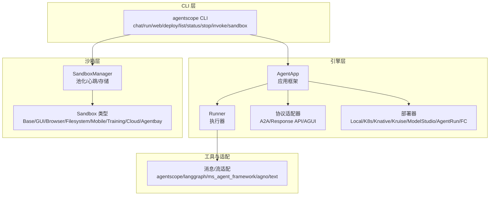
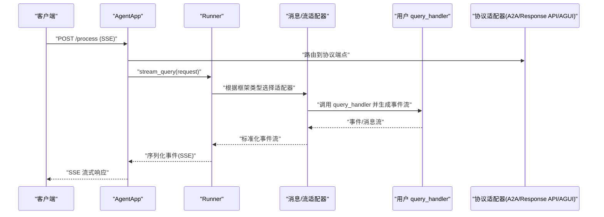
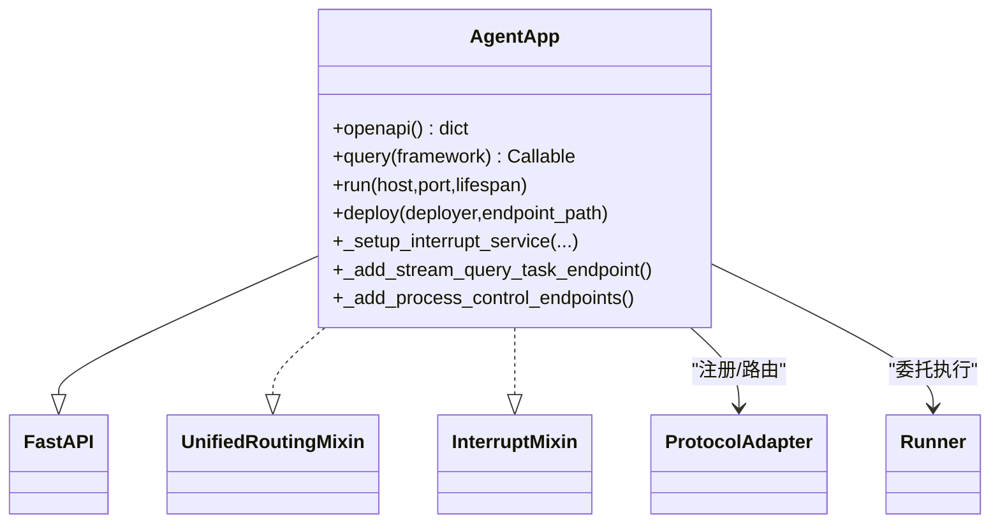
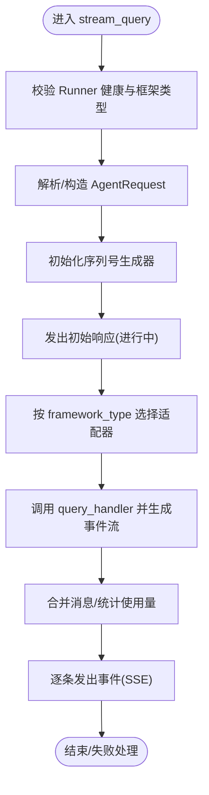
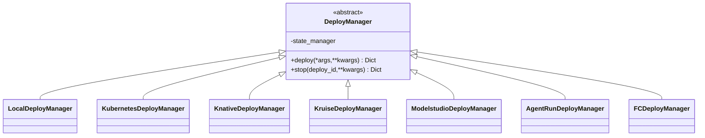
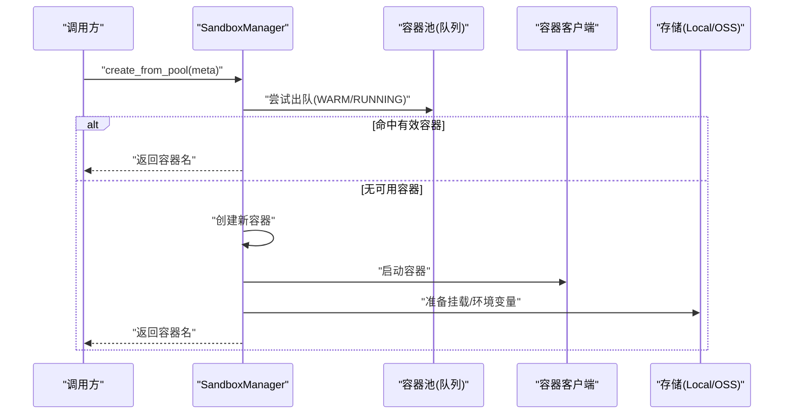
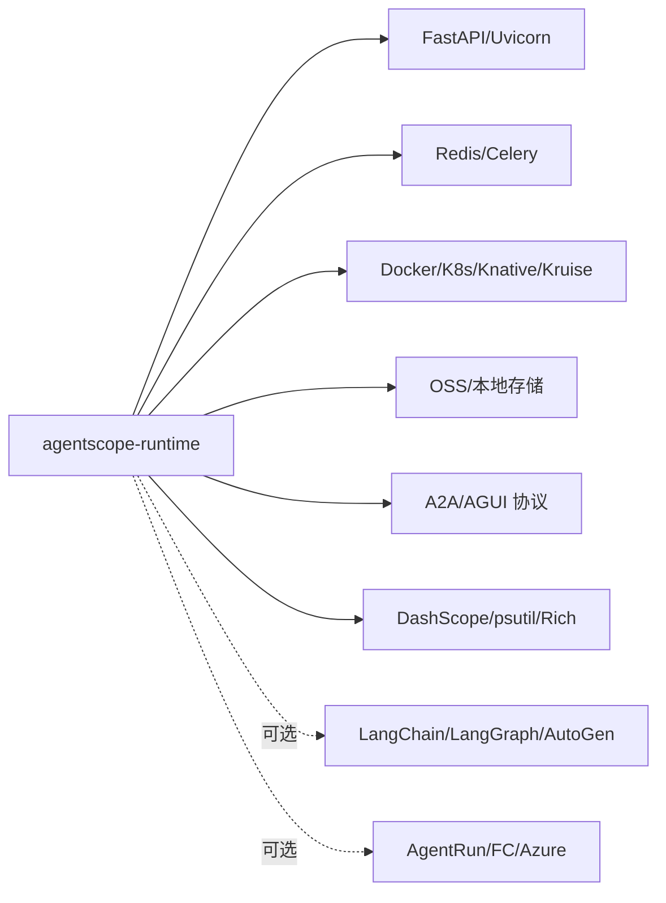

# 最佳实践

<cite>
**本文引用的文件**
- [README.md](file://README.md)
- [src/agentscope_runtime/__init__.py](file://src/agentscope_runtime/__init__.py)
- [src/agentscope_runtime/engine/__init__.py](file://src/agentscope_runtime/engine/__init__.py)
- [src/agentscope_runtime/engine/app/agent_app.py](file://src/agentscope_runtime/engine/app/agent_app.py)
- [src/agentscope_runtime/engine/runner.py](file://src/agentscope_runtime/engine/runner.py)
- [src/agentscope_runtime/engine/deployers/base.py](file://src/agentscope_runtime/engine/deployers/base.py)
- [src/agentscope_runtime/sandbox/__init__.py](file://src/agentscope_runtime/sandbox/__init__.py)
- [src/agentscope_runtime/sandbox/manager/sandbox_manager.py](file://src/agentscope_runtime/sandbox/manager/sandbox_manager.py)
- [src/agentscope_runtime/cli/cli.py](file://src/agentscope_runtime/cli/cli.py)
- [src/agentscope_runtime/common/utils/logging.py](file://src/agentscope_runtime/common/utils/logging.py)
- [pyproject.toml](file://pyproject.toml)
- [examples/deployments/local_deploy_config.yaml](file://examples/deployments/local_deploy_config.yaml)
- [examples/deployments/k8s_deploy/k8s_deploy_config.yaml](file://examples/deployments/k8s_deploy/k8s_deploy_config.yaml)
- [src/agentscope_runtime/version.py](file://src/agentscope_runtime/version.py)
</cite>

## 目录
1. [简介](#简介)
2. [项目结构](#项目结构)
3. [核心组件](#核心组件)
4. [架构总览](#架构总览)
5. [详细组件分析](#详细组件分析)
6. [依赖分析](#依赖分析)
7. [性能考虑](#性能考虑)
8. [故障排除指南](#故障排除指南)
9. [结论](#结论)
10. [附录](#附录)

## 简介
本指南面向在生产环境中使用 AgentScope Runtime 的工程团队，系统性地总结开发规范、代码组织原则、部署策略与生产配置、性能优化、故障排除、测试与质量保障、监控与维护、版本与升级策略以及团队协作与项目管理建议。内容基于仓库源码与示例配置进行提炼，确保可操作、可落地。

## 项目结构
AgentScope Runtime 采用模块化分层设计：
- 引擎层（Engine）：提供 AgentApp 应用框架、Runner 执行器、协议适配器、部署器等核心能力。
- 沙箱层（Sandbox）：提供多种沙盒类型（基础、GUI、浏览器、文件系统、移动端、训练沙盒等），并支持本地/远程模式与池化管理。
- CLI 层：统一命令行入口，提供聊天、运行、部署、状态查询、停止、调用、沙箱管理等功能。
- 工具与适配层：对主流框架（如 AgentScope、LangGraph、MS Agent Framework、Agno）的消息与流式输出进行适配。
- 配置与示例：提供本地与 Kubernetes 等部署配置样例，便于快速上手与生产迁移。

图表来源
- [src/agentscope_runtime/engine/app/agent_app.py](file://src/agentscope_runtime/engine/app/agent_app.py)
- [src/agentscope_runtime/engine/runner.py](file://src/agentscope_runtime/engine/runner.py)
- [src/agentscope_runtime/engine/deployers/base.py](file://src/agentscope_runtime/engine/deployers/base.py)
- [src/agentscope_runtime/sandbox/manager/sandbox_manager.py](file://src/agentscope_runtime/sandbox/manager/sandbox_manager.py)
- [src/agentscope_runtime/cli/cli.py](file://src/agentscope_runtime/cli/cli.py)

章节来源
- [README.md](file://README.md)
- [src/agentscope_runtime/engine/__init__.py](file://src/agentscope_runtime/engine/__init__.py)
- [src/agentscope_runtime/sandbox/__init__.py](file://src/agentscope_runtime/sandbox/__init__.py)

## 核心组件
- AgentApp：基于 FastAPI 的应用框架，内置统一路由与中断服务，支持多协议适配（A2A、Response API、AGUI），提供健康检查、任务队列与后台任务端点。
- Runner：统一的执行器，负责将请求转换为框架特定的消息流，并通过适配器输出标准化事件流；支持多框架类型（agentscope、langgraph、agno、ms_agent_framework、text）。
- 部署器：抽象接口 DeployManager 定义统一的部署与停止行为，具体实现覆盖本地、Kubernetes、Knative、Kruise、ModelStudio、AgentRun、FC 等平台。
- 沙箱管理器：支持容器池化、心跳扫描、会话映射、存储（本地/OSS）、远程/本地双模调用，提供多类型沙盒生命周期管理。
- CLI：集中式命令行工具，封装常见运维操作，便于本地开发与生产部署。

章节来源
- [src/agentscope_runtime/engine/app/agent_app.py](file://src/agentscope_runtime/engine/app/agent_app.py)
- [src/agentscope_runtime/engine/runner.py](file://src/agentscope_runtime/engine/runner.py)
- [src/agentscope_runtime/engine/deployers/base.py](file://src/agentscope_runtime/engine/deployers/base.py)
- [src/agentscope_runtime/sandbox/manager/sandbox_manager.py](file://src/agentscope_runtime/sandbox/manager/sandbox_manager.py)
- [src/agentscope_runtime/cli/cli.py](file://src/agentscope_runtime/cli/cli.py)

## 架构总览
AgentApp 将 Runner 与协议适配器集成，统一暴露 RESTful 接口；Runner 负责将请求转为框架消息并通过适配器输出事件流；部署器负责将应用打包并发布到目标平台；沙箱管理器负责安全隔离的工具执行环境。

图表来源
- [src/agentscope_runtime/engine/app/agent_app.py](file://src/agentscope_runtime/engine/app/agent_app.py)
- [src/agentscope_runtime/engine/runner.py](file://src/agentscope_runtime/engine/runner.py)

## 详细组件分析

### 组件一：AgentApp 应用框架
- 设计要点
  - 继承 FastAPI 并混入 UnifiedRoutingMixin 与 InterruptMixin，统一路由与分布式中断。
  - 生命周期：通过 FastAPI lifespan 管理内部 Runner、钩子函数与中断服务的启动/关闭。
  - 协议适配：默认注册 A2A、Response API、AGUI 三种协议适配器，自动注入 OpenAPI schema。
  - 中断服务：支持 Redis 或本地后端，提供任务预占与恢复能力。
  - 后台任务：可选启用任务队列与清理 Worker，仅保存最终响应，不持久化中间事件。
  - 进程控制：提供优雅停机与进程状态查询端点，便于外部管理。
- 开发规范
  - 使用 lifespan 替代手动 init/shutdown，避免版本弃用警告。
  - 在 query 装饰器中指定框架类型，确保消息与流适配正确。
  - 如需中断能力，显式配置中断后端或 Redis URL。
  - 启用 stream_task 时，注意任务清理周期与超时设置。
- 性能建议
  - 合理设置 stream_task_timeout，避免长时间悬挂任务。
  - 在高并发场景下优先使用 Redis 中断后端，提升一致性与可观测性。
  - 使用统一路由与中间件，减少重复逻辑。

图表来源
- [src/agentscope_runtime/engine/app/agent_app.py](file://src/agentscope_runtime/engine/app/agent_app.py)

章节来源
- [src/agentscope_runtime/engine/app/agent_app.py](file://src/agentscope_runtime/engine/app/agent_app.py)

### 组件二：Runner 执行器
- 设计要点
  - 统一的 query_handler/init_handler/shutdown_handler 生命周期。
  - 多框架适配：agentscope、langgraph、agno、ms_agent_framework、text。
  - 事件序列号生成与完成状态合并，支持错误包装与使用量统计。
  - 支持同步/异步生成器、协程与普通返回值。
- 开发规范
  - 显式设置 framework_type，避免非法类型导致运行时错误。
  - 在 handler 内部使用流式输出，遵循事件模型约定。
  - 对异常进行捕获并转换为标准错误对象，便于前端展示。
- 性能建议
  - 尽量使用异步 handler 以提升吞吐。
  - 控制事件粒度，避免过细导致 SSE 压力过大。

图表来源
- [src/agentscope_runtime/engine/runner.py](file://src/agentscope_runtime/engine/runner.py)

章节来源
- [src/agentscope_runtime/engine/runner.py](file://src/agentscope_runtime/engine/runner.py)

### 组件三：部署器（DeployManager 抽象）
- 设计要点
  - 抽象类定义 deploy/stop 两个核心方法，统一状态管理。
  - 具体实现覆盖本地、K8s、Knative、Kruise、ModelStudio、AgentRun、FC 等。
- 开发规范
  - 在部署前准备好 requirements、environment、runtime_config 等参数。
  - 生产环境优先使用容器镜像与平台原生资源限制。
- 性能建议
  - 合理设置副本数与资源请求/限制，避免资源争抢。
  - 使用健康检查与部署超时，确保上线质量。

图表来源
- [src/agentscope_runtime/engine/deployers/base.py](file://src/agentscope_runtime/engine/deployers/base.py)

章节来源
- [src/agentscope_runtime/engine/deployers/base.py](file://src/agentscope_runtime/engine/deployers/base.py)

### 组件四：沙箱管理器（SandboxManager）
- 设计要点
  - 支持本地/远程双模：远程模式通过 HTTP 访问，本地模式直接调用。
  - 池化管理：基于 Redis/内存队列的容器池，支持心跳扫描与回收。
  - 存储：本地或 OSS，支持挂载目录与只读挂载。
  - 多类型沙盒：Base/GUI/Browser/Filesystem/Mobile/Training/Cloud/Agentbay。
- 开发规范
  - 在生产环境开启 Redis 以支持分布式心跳与会话映射。
  - 严格校验环境变量与镜像版本，避免过期容器被复用。
  - 使用远程装饰器（remote_wrapper/remote_wrapper_async）屏蔽本地/远程差异。
- 性能建议
  - 合理设置池大小与实例上限，避免资源耗尽。
  - 使用心跳扫描与释放清理线程，及时回收僵尸容器。

图表来源
- [src/agentscope_runtime/sandbox/manager/sandbox_manager.py](file://src/agentscope_runtime/sandbox/manager/sandbox_manager.py)

章节来源
- [src/agentscope_runtime/sandbox/manager/sandbox_manager.py](file://src/agentscope_runtime/sandbox/manager/sandbox_manager.py)

### 组件五：CLI 命令行工具
- 设计要点
  - 统一入口 agentscope，注册 chat/run/web/deploy/list/status/stop/invoke/sandbox 等子命令。
  - 默认 TRACE_ENABLE_LOG=false，避免生产日志噪声。
- 开发规范
  - 使用 agentscope deploy 一键部署至本地或云平台。
  - 使用 agentscope status/stop 管理已部署实例。
- 性能建议
  - 在 CI/CD 中结合配置文件批量部署，减少交互成本。

章节来源
- [src/agentscope_runtime/cli/cli.py](file://src/agentscope_runtime/cli/cli.py)

## 依赖分析
- 运行时依赖
  - Web 框架：FastAPI、Uvicorn
  - 消息协议：A2A、AGUI 协议适配
  - 缓存与队列：Redis、Celery
  - 容器与编排：Docker、Kubernetes、Knative、Kruise
  - 存储：本地文件系统、OSS
  - 日志与可观测：psutil、Rich、DashScope
- 可选扩展
  - LangChain、LangGraph、AutoGen、MS Agent Framework、AgentRun、FC、Azure 认知服务等

图表来源
- [pyproject.toml](file://pyproject.toml)

章节来源
- [pyproject.toml](file://pyproject.toml)

## 性能考虑
- 流式输出与事件粒度
  - Runner 输出事件应保持适度粒度，避免过多小事件造成 SSE 压力。
  - 使用序列号生成器统一事件编号，便于前端渲染与调试。
- 中断与任务队列
  - 分布式中断后端（Redis）可提升一致性与可控性，适合高并发场景。
  - 后台任务仅保存最终响应，降低存储与网络开销。
- 容器与池化
  - 沙箱池化可显著降低冷启动时间；合理设置池大小与实例上限。
  - 心跳扫描与释放清理线程定期回收无效容器，避免资源泄漏。
- 部署与编排
  - K8s 中设置合理的 requests/limits，避免 OOM 与调度抖动。
  - 使用健康检查与部署超时，确保上线质量与回滚能力。

## 故障排除指南
- 常见问题定位
  - AgentApp 生命周期：确认使用 lifespan 注入启动/清理逻辑，避免弃用的 init/shutdown。
  - Runner 健康状态：确保在调用 stream_query 前已 start 或使用 async with Runner。
  - 协议适配：检查 framework_type 是否在允许列表内，否则抛出运行时错误。
  - 沙箱池化：若容器不可用，检查 Redis 连接、镜像版本与容器状态。
- 日志与可观测
  - CLI 默认关闭 TRACE_ENABLE_LOG，可在需要时开启以获取更详细追踪。
  - 使用 /health 与 /admin/status 端点快速判断服务健康与进程状态。
- 调试方法
  - 本地开发：使用 agentscope run 与本地部署配置文件快速验证。
  - 远程/容器：通过 agentscope status 查看部署状态，必要时 agentscope stop 清理。
  - 沙箱：在远程模式下，使用远程装饰器屏蔽本地/远程差异，便于调试。

章节来源
- [src/agentscope_runtime/engine/app/agent_app.py](file://src/agentscope_runtime/engine/app/agent_app.py)
- [src/agentscope_runtime/engine/runner.py](file://src/agentscope_runtime/engine/runner.py)
- [src/agentscope_runtime/sandbox/manager/sandbox_manager.py](file://src/agentscope_runtime/sandbox/manager/sandbox_manager.py)
- [src/agentscope_runtime/cli/cli.py](file://src/agentscope_runtime/cli/cli.py)

## 结论
通过统一的应用框架（AgentApp）、执行器（Runner）、协议适配与部署器，AgentScope Runtime 提供了从开发到生产的完整闭环。结合沙箱池化与可观测能力，团队可在保证安全性与隔离性的前提下，实现弹性伸缩与高效运维。建议在生产中遵循本文的开发规范、部署策略与故障排除流程，持续优化性能与稳定性。

## 附录

### A. 开发规范与代码组织
- 代码风格与依赖
  - 依赖 Black、flake8、ESLint 等工具，确保一致的代码风格。
  - 使用 pyproject.toml 管理依赖与可选扩展，区分 dev 与 ext。
- 模块划分
  - 引擎层：app、runner、deployers、schemas、tracing、adapters
  - 沙箱层：manager、client、model、registry、utils、components
  - CLI 层：commands、loaders、state、utils
- 版本与日志
  - 版本由 version.py 统一管理，初始化时设置全局日志格式与级别。

章节来源
- [pyproject.toml](file://pyproject.toml)
- [src/agentscope_runtime/version.py](file://src/agentscope_runtime/version.py)
- [src/agentscope_runtime/common/utils/logging.py](file://src/agentscope_runtime/common/utils/logging.py)

### B. 部署策略与生产配置
- 本地部署
  - 使用 agentscope deploy local 指定 host/port 与环境变量，参考本地配置样例。
- Kubernetes 部署
  - 使用 agentscope deploy k8s，配置副本数、资源限制、镜像拉取策略与部署超时。
- 其他平台
  - ModelStudio、AgentRun、FC、Knative、Kruise 等平台均有对应部署器与示例配置。

章节来源
- [examples/deployments/local_deploy_config.yaml](file://examples/deployments/local_deploy_config.yaml)
- [examples/deployments/k8s_deploy/k8s_deploy_config.yaml](file://examples/deployments/k8s_deploy/k8s_deploy_config.yaml)

### C. 测试与质量保证
- 单元测试与集成测试
  - tests 目录包含部署、沙箱、工具等多类测试，建议在 PR 中保持覆盖率稳定。
- 质量门禁
  - 使用 pytest、pytest-asyncio、pytest-cov 等工具，结合 pre-commit 钩子确保提交质量。

章节来源
- [pyproject.toml](file://pyproject.toml)

### D. 监控与维护
- 健康检查与进程状态
  - /health：检查服务与 Runner 状态
  - /admin/status：查看进程 PID、内存、CPU、运行时长
- 日志与追踪
  - CLI 默认日志格式包含颜色与文件路径，便于快速定位。
  - 可通过环境变量调整 TRACE_ENABLE_LOG 以增强追踪。

章节来源
- [src/agentscope_runtime/engine/app/agent_app.py](file://src/agentscope_runtime/engine/app/agent_app.py)
- [src/agentscope_runtime/common/utils/logging.py](file://src/agentscope_runtime/common/utils/logging.py)

### E. 版本管理与升级策略
- 版本号
  - 当前版本由 version.py 统一管理，遵循语义化版本。
- 升级建议
  - 关注 CHANGELOG 中的破坏性变更与弃用提示，逐步迁移至新的生命周期管理方式。
  - 升级依赖时优先在 dev 环境验证，再推进到生产。

章节来源
- [src/agentscope_runtime/version.py](file://src/agentscope_runtime/version.py)
- [README.md](file://README.md)

### F. 团队协作与项目管理
- 文档与示例
  - Cookbook 提供英文与中文文档，涵盖概念、部署、工具与高级用法。
- 贡献流程
  - 通过 Issue/PR 参与贡献，遵循模板与规范，保持高质量交付。
- 社区与支持
  - Discord、钉钉群等渠道可用于交流与求助。

章节来源
- [README.md](file://README.md)