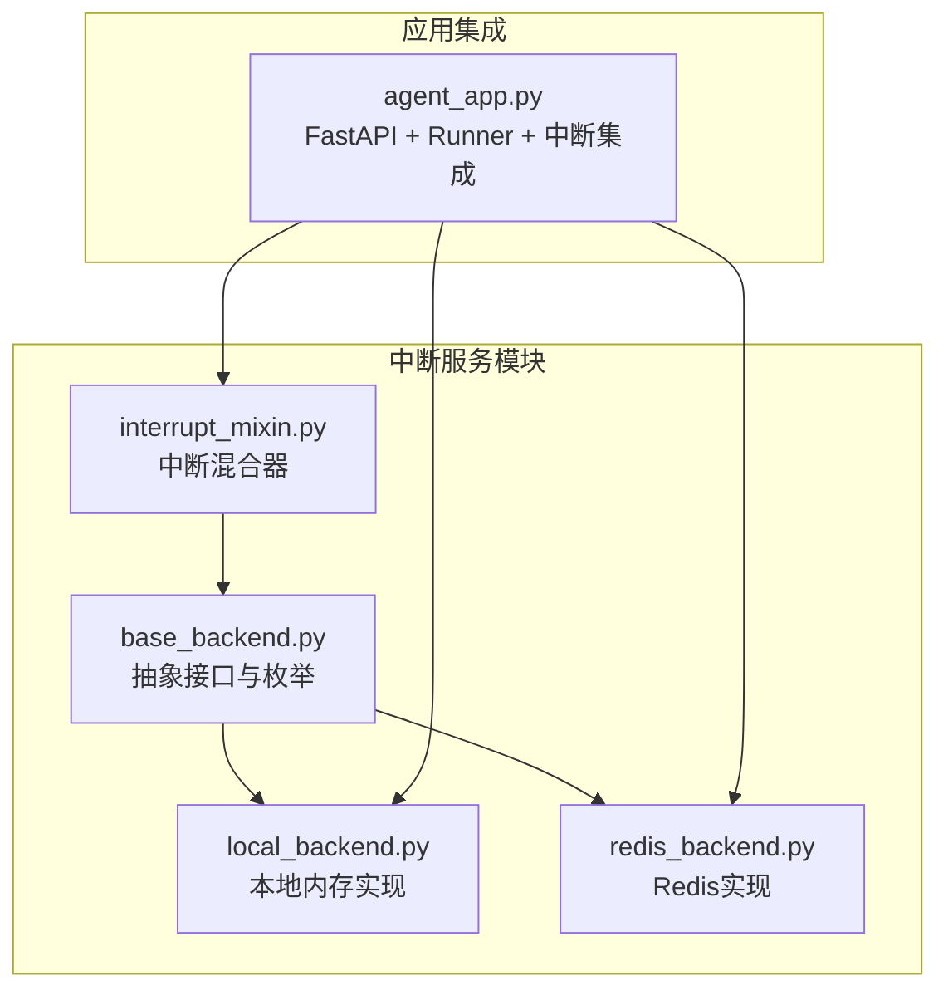
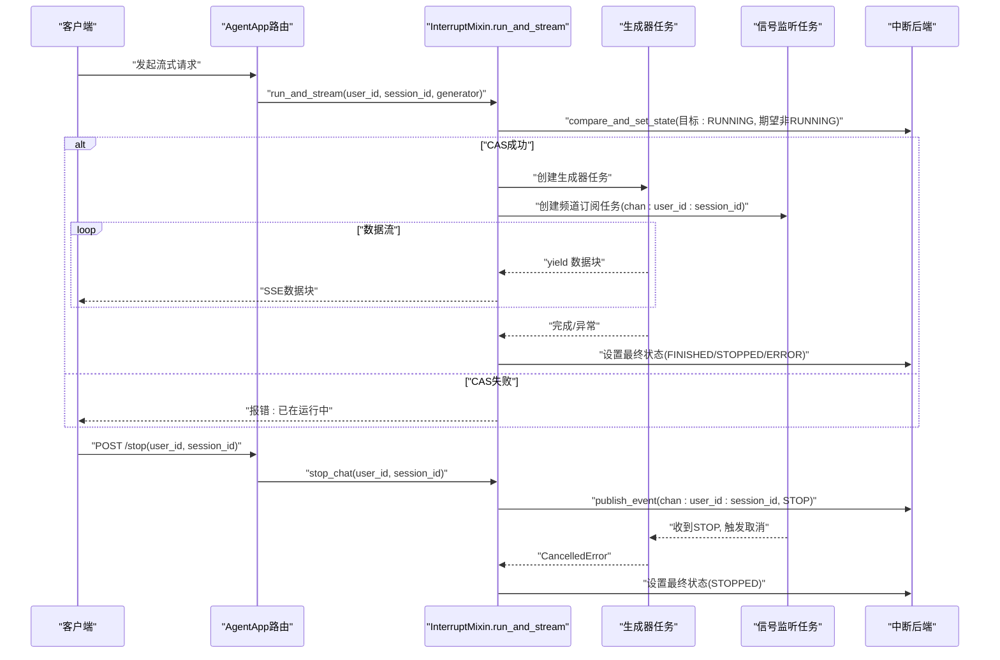
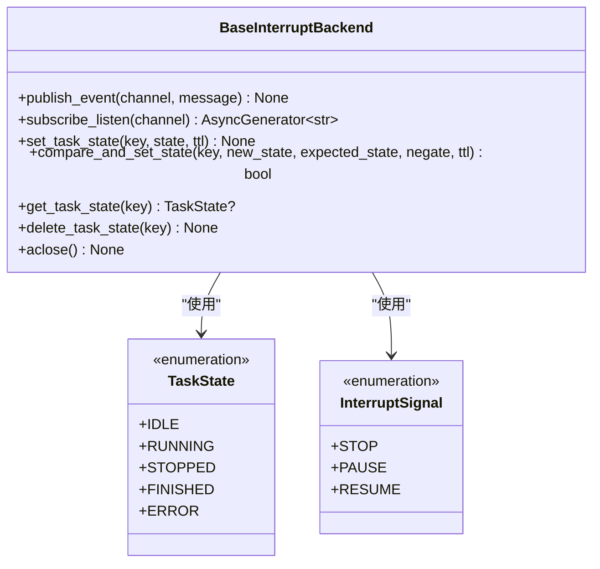
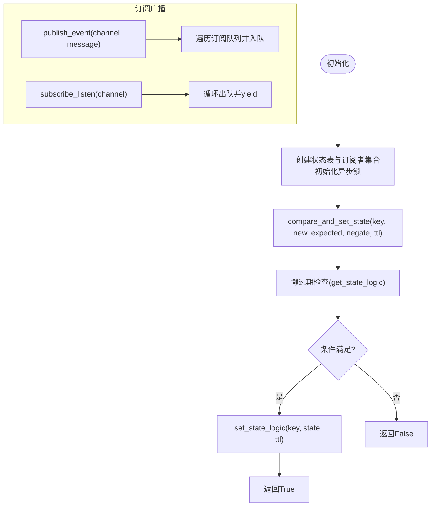
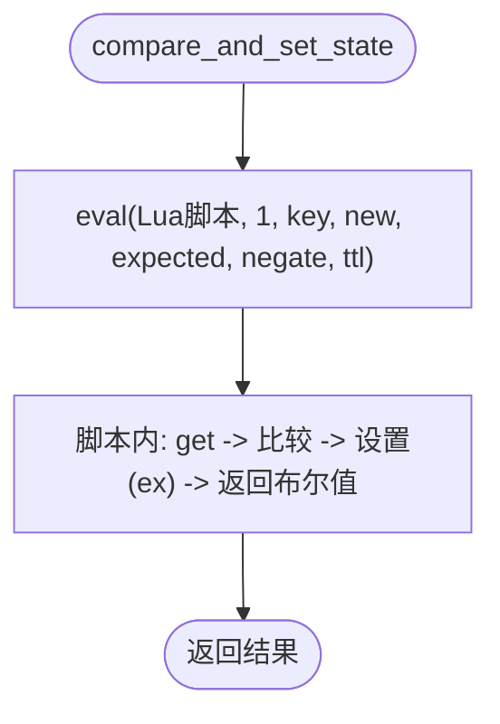
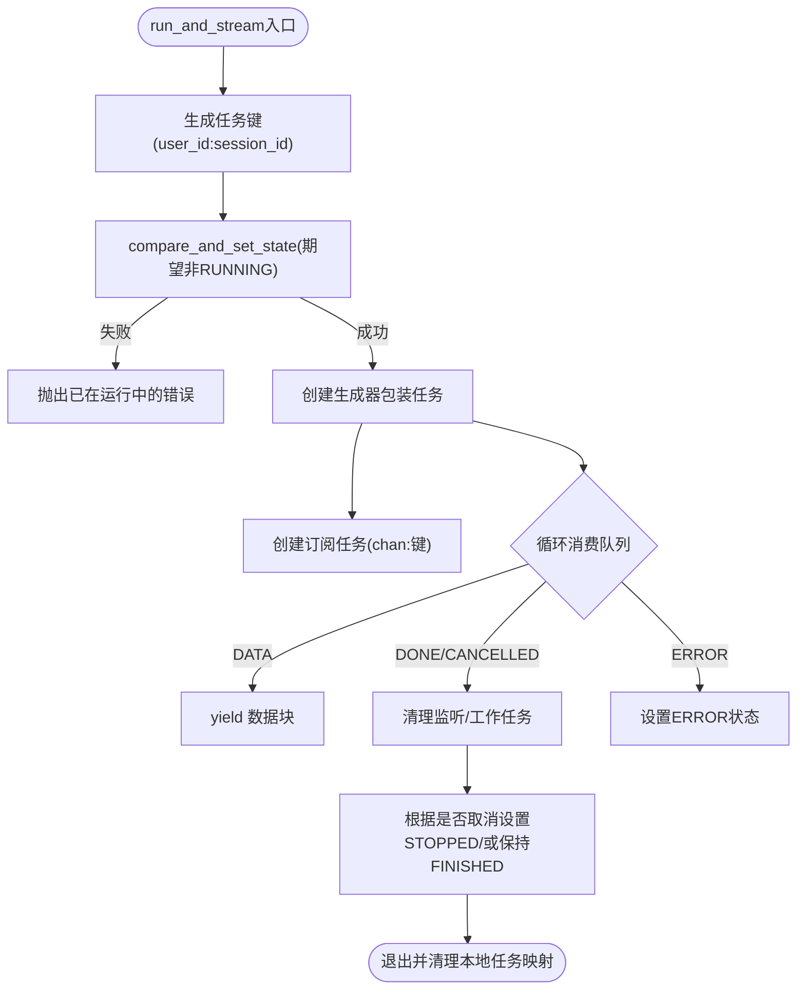
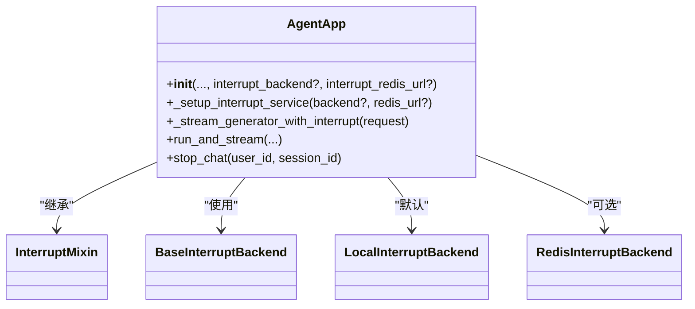
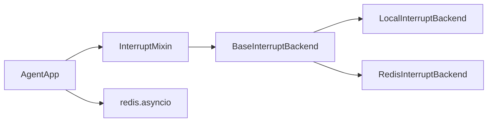

# 分布式中断服务

<cite>
**本文引用的文件**
- [interrupt_mixin.py](file://src/agentscope_runtime/engine/deployers/utils/service_utils/interrupt/interrupt_mixin.py)
- [base_backend.py](file://src/agentscope_runtime/engine/deployers/utils/service_utils/interrupt/base_backend.py)
- [local_backend.py](file://src/agentscope_runtime/engine/deployers/utils/service_utils/interrupt/local_backend.py)
- [redis_backend.py](file://src/agentscope_runtime/engine/deployers/utils/service_utils/interrupt/redis_backend.py)
- [agent_app.py](file://src/agentscope_runtime/engine/app/agent_app.py)
- [interrupt_and_restore_example.py](file://examples/interrupt/interrupt_and_restore_example.py)
- [test_interrupt_mixin.py](file://tests/unit/test_interrupt_mixin.py)
- [agent_app.md](file://cookbook/zh/agent_app.md)
</cite>

## 目录
1. [简介](#简介)
2. [项目结构](#项目结构)
3. [核心组件](#核心组件)
4. [架构总览](#架构总览)
5. [详细组件分析](#详细组件分析)
6. [依赖关系分析](#依赖关系分析)
7. [性能考量](#性能考量)
8. [故障排除指南](#故障排除指南)
9. [结论](#结论)
10. [附录](#附录)

## 简介
本文件系统化阐述分布式中断服务的设计目标与实现原理，覆盖本地中断与Redis中断后端的工作机制，详解中断混合器（InterruptMixin）的作用与使用方法，解释分布式环境下的中断处理策略、状态同步与一致性保障，并提供配置示例、故障排除指南以及性能与扩展性建议。内容从基础概念到高级实现层层递进，兼顾工程实践与可维护性。

## 项目结构
中断服务位于引擎的“服务工具”模块下，采用“抽象接口 + 多种后端实现”的分层设计：
- 抽象层：定义统一的状态枚举、信号枚举与后端接口规范
- 本地后端：基于内存与异步队列的单进程实现
- Redis后端：基于发布/订阅与Lua脚本的分布式实现
- 混合器：封装运行与流式生成、监听中断信号、状态管理与资源清理
- 应用集成：AgentApp继承混合器并按配置选择后端

图表来源
- [base_backend.py:1-90](file://src/agentscope_runtime/engine/deployers/utils/service_utils/interrupt/base_backend.py#L1-L90)
- [local_backend.py:1-132](file://src/agentscope_runtime/engine/deployers/utils/service_utils/interrupt/local_backend.py#L1-L132)
- [redis_backend.py:1-107](file://src/agentscope_runtime/engine/deployers/utils/service_utils/interrupt/redis_backend.py#L1-L107)
- [interrupt_mixin.py:1-151](file://src/agentscope_runtime/engine/deployers/utils/service_utils/interrupt/interrupt_mixin.py#L1-L151)
- [agent_app.py:60-247](file://src/agentscope_runtime/engine/app/agent_app.py#L60-L247)

章节来源
- [agent_app.py:60-247](file://src/agentscope_runtime/engine/app/agent_app.py#L60-L247)

## 核心组件
- 抽象接口与枚举
  - TaskState：任务生命周期状态（空闲、运行中、已停止、已完成、错误）
  - InterruptSignal：控制信号（停止、暂停、继续）
  - BaseInterruptBackend：定义发布/订阅、状态设置与CAS、获取/删除状态、资源释放等接口
- 本地中断后端
  - 使用内存字典存储状态，异步锁保证原子性；使用队列集合实现频道订阅与广播
- Redis中断后端
  - 基于发布/订阅通道接收信号；使用Lua脚本实现原子CAS，键名带前缀以隔离命名空间
- 中断混合器
  - 提供run_and_stream执行器、stop_chat广播器、生命周期资源管理
- 应用集成
  - AgentApp继承混合器，根据构造参数选择后端（本地/Redis/自定义），并在流式生成中启用中断控制

章节来源
- [base_backend.py:7-90](file://src/agentscope_runtime/engine/deployers/utils/service_utils/interrupt/base_backend.py#L7-L90)
- [local_backend.py:9-132](file://src/agentscope_runtime/engine/deployers/utils/service_utils/interrupt/local_backend.py#L9-L132)
- [redis_backend.py:7-107](file://src/agentscope_runtime/engine/deployers/utils/service_utils/interrupt/redis_backend.py#L7-L107)
- [interrupt_mixin.py:8-151](file://src/agentscope_runtime/engine/deployers/utils/service_utils/interrupt/interrupt_mixin.py#L8-L151)
- [agent_app.py:60-247](file://src/agentscope_runtime/engine/app/agent_app.py#L60-L247)

## 架构总览
分布式中断服务通过“状态持久化 + 事件广播 + 协程取消”的组合，在多节点环境下实现跨进程的中断控制与状态同步。

图表来源
- [interrupt_mixin.py:38-139](file://src/agentscope_runtime/engine/deployers/utils/service_utils/interrupt/interrupt_mixin.py#L38-L139)
- [base_backend.py:25-90](file://src/agentscope_runtime/engine/deployers/utils/service_utils/interrupt/base_backend.py#L25-L90)
- [agent_app.py:669-688](file://src/agentscope_runtime/engine/app/agent_app.py#L669-L688)

## 详细组件分析

### 抽象接口与枚举（BaseInterruptBackend）
- 设计要点
  - 将“状态持久化”和“事件通信”解耦，便于替换后端
  - 通过CAS操作保证跨节点状态变更的一致性
  - 明确生命周期钩子（aclose）以释放连接资源
- 关键方法
  - 发布/订阅：publish_event、subscribe_listen
  - 状态管理：set_task_state、compare_and_set_state、get_task_state、delete_task_state
  - 资源管理：aclose

图表来源
- [base_backend.py:7-90](file://src/agentscope_runtime/engine/deployers/utils/service_utils/interrupt/base_backend.py#L7-L90)

章节来源
- [base_backend.py:7-90](file://src/agentscope_runtime/engine/deployers/utils/service_utils/interrupt/base_backend.py#L7-L90)

### 本地中断后端（LocalInterruptBackend）
- 设计要点
  - 使用内存字典保存状态，键带前缀；过期时间采用懒过期策略
  - 使用异步锁保护复合操作（读改写），避免竞态
  - 订阅者集合以频道为键，消息通过队列广播
- 适用场景
  - 单机/单进程环境，无需外部依赖
- 注意事项
  - 不具备跨进程/跨节点的分布式能力

图表来源
- [local_backend.py:16-132](file://src/agentscope_runtime/engine/deployers/utils/service_utils/interrupt/local_backend.py#L16-L132)

章节来源
- [local_backend.py:9-132](file://src/agentscope_runtime/engine/deployers/utils/service_utils/interrupt/local_backend.py#L9-L132)

### Redis中断后端（RedisInterruptBackend）
- 设计要点
  - 使用发布/订阅通道进行跨节点事件广播
  - 通过Lua脚本实现原子CAS，保证“读-比较-设置”不可被打断
  - 键名统一加前缀，避免命名冲突
- 适用场景
  - 分布式部署，需要跨节点中断控制
- 性能与可靠性
  - Lua脚本减少网络往返与竞态风险
  - TTL控制过期，避免脏数据堆积

图表来源
- [redis_backend.py:44-90](file://src/agentscope_runtime/engine/deployers/utils/service_utils/interrupt/redis_backend.py#L44-L90)

章节来源
- [redis_backend.py:7-107](file://src/agentscope_runtime/engine/deployers/utils/service_utils/interrupt/redis_backend.py#L7-L107)

### 中断混合器（InterruptMixin）
- 设计要点
  - run_and_stream：原子状态转换、生成器包装、监听任务、状态收尾、资源清理
  - stop_chat：向特定频道广播停止信号
  - 生命周期管理：关闭后端连接
- 关键流程
  - 生成器包装：在运行中将数据入队，异常/取消分别标记状态并入队
  - 监听任务：订阅频道，收到停止信号即取消工作协程
  - 最终状态：根据是否被取消设置STOPPED或FINISHED，错误状态直接写入ERROR

图表来源
- [interrupt_mixin.py:38-139](file://src/agentscope_runtime/engine/deployers/utils/service_utils/interrupt/interrupt_mixin.py#L38-L139)

章节来源
- [interrupt_mixin.py:8-151](file://src/agentscope_runtime/engine/deployers/utils/service_utils/interrupt/interrupt_mixin.py#L8-L151)

### 应用集成（AgentApp）
- 设计要点
  - 继承FastAPI与多个混入，集成路由、协议适配、流式任务等能力
  - 在构造阶段根据参数选择中断后端：自定义 > Redis > 本地
  - 在流式生成路径中启用中断控制，将请求解析为user_id/session_id并交由混合器处理
- 生命周期
  - 统一生命周期管理，确保中断后端在应用关闭时正确释放

图表来源
- [agent_app.py:60-247](file://src/agentscope_runtime/engine/app/agent_app.py#L60-L247)

章节来源
- [agent_app.py:60-247](file://src/agentscope_runtime/engine/app/agent_app.py#L60-L247)

## 依赖关系分析
- 组件耦合
  - AgentApp对InterruptMixin强依赖，对后端弱依赖（通过接口注入）
  - 混合器仅依赖抽象接口，便于替换后端
- 外部依赖
  - Redis后端依赖redis.asyncio客户端
  - 本地后端依赖Python标准库异步原语
- 潜在环路
  - 无直接循环导入；后端实现不反向依赖应用层

图表来源
- [agent_app.py:42-47](file://src/agentscope_runtime/engine/app/agent_app.py#L42-L47)
- [redis_backend.py:2-4](file://src/agentscope_runtime/engine/deployers/utils/service_utils/interrupt/redis_backend.py#L2-L4)

章节来源
- [agent_app.py:42-47](file://src/agentscope_runtime/engine/app/agent_app.py#L42-L47)
- [redis_backend.py:2-4](file://src/agentscope_runtime/engine/deployers/utils/service_utils/interrupt/redis_backend.py#L2-L4)

## 性能考量
- 状态一致性与开销
  - 本地后端：内存访问与异步锁，适合低延迟单机场景
  - Redis后端：网络往返与Lua脚本执行，适合分布式场景
- 并发控制
  - 通过CAS确保同一会话只允许一个运行中的任务，避免竞态
- 资源管理
  - 监听与工作协程在finally中统一取消与等待，避免泄漏
- 扩展性建议
  - 对高并发场景，优先使用Redis后端并合理设置TTL
  - 对本地开发与测试，使用本地后端提升响应速度
  - 结合任务清理工作线程定期回收已完成任务记录

[本节为通用性能讨论，无需列出具体文件来源]

## 故障排除指南
- 常见问题与定位
  - “已在运行中”错误：同一会话重复提交导致CAS失败，检查前端是否重复发起
  - 中断无效：确认stop_chat请求携带正确的user_id与session_id，且Redis后端可用
  - 状态未更新：检查后端是否正确设置最终状态（STOPPED/ERROR），关注异常分支
  - 资源泄漏：确认finally中监听与工作任务均被取消并等待
- 单元测试参考
  - 测试覆盖正常完成、并发冲突、中断广播、异常状态与清理行为
- 示例验证
  - 使用示例应用演示中断与状态保存流程，结合日志观察中断路径

章节来源
- [test_interrupt_mixin.py:64-191](file://tests/unit/test_interrupt_mixin.py#L64-L191)
- [interrupt_and_restore_example.py:103-136](file://examples/interrupt/interrupt_and_restore_example.py#L103-L136)

## 结论
分布式中断服务通过抽象接口与多后端实现，将状态管理与事件通信解耦，既能在单机场景下快速落地，又可在分布式环境中提供可靠的跨节点中断控制。InterruptMixin将中断控制与流式生成无缝集成，配合AgentApp的生命周期管理，形成一套可扩展、可维护的中断解决方案。

[本节为总结性内容，无需列出具体文件来源]

## 附录

### 配置示例与最佳实践
- 本地模式（默认）
  - 适用于单机/单进程，无需Redis
- Redis模式（推荐）
  - 适用于分布式部署，需提供Redis连接URL
- 自定义后端
  - 实现BaseInterruptBackend接口并注入到AgentApp

章节来源
- [agent_app.md:642-670](file://cookbook/zh/agent_app.md#L642-L670)
- [agent_app.py:222-247](file://src/agentscope_runtime/engine/app/agent_app.py#L222-L247)

### 使用示例（关键路径）
- 中断触发端点：POST /stop，携带user_id与session_id
- 请求处理：在@agent_app.query装饰的处理器中捕获CancelledError并保存状态

章节来源
- [interrupt_and_restore_example.py:155-168](file://examples/interrupt/interrupt_and_restore_example.py#L155-L168)
- [interrupt_and_restore_example.py:103-136](file://examples/interrupt/interrupt_and_restore_example.py#L103-L136)