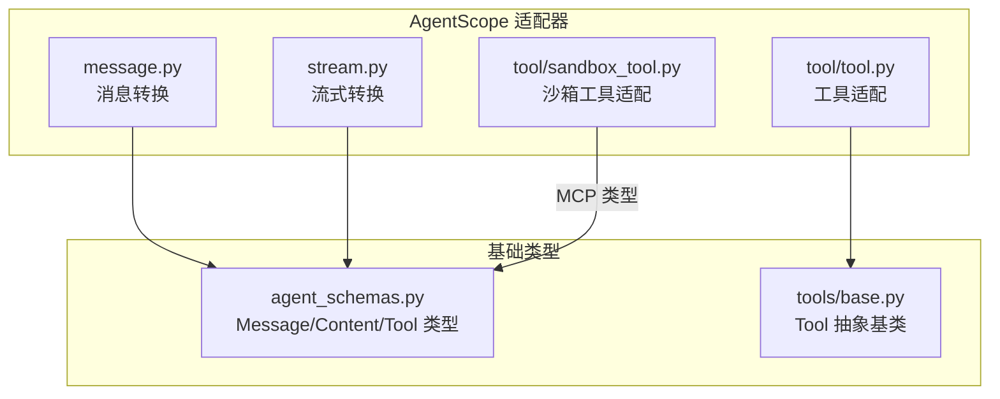
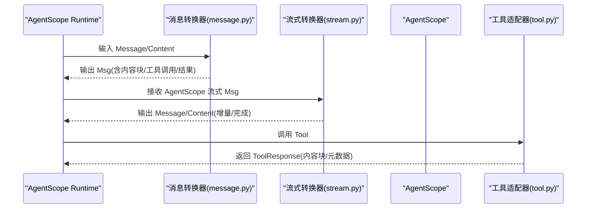
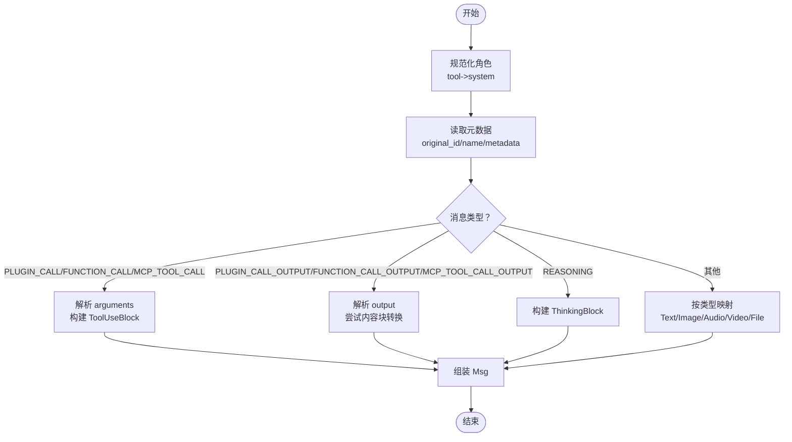
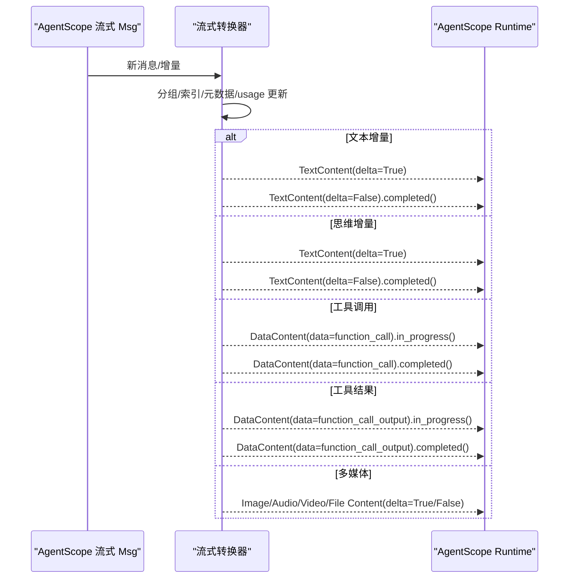
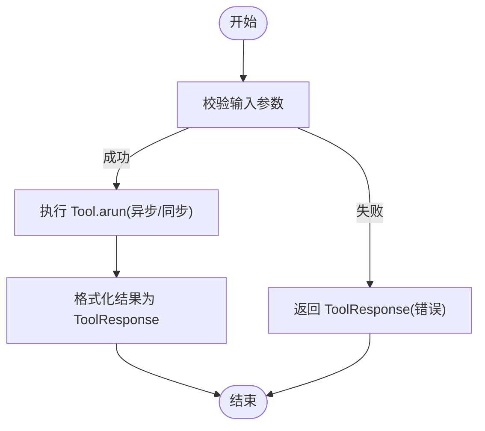
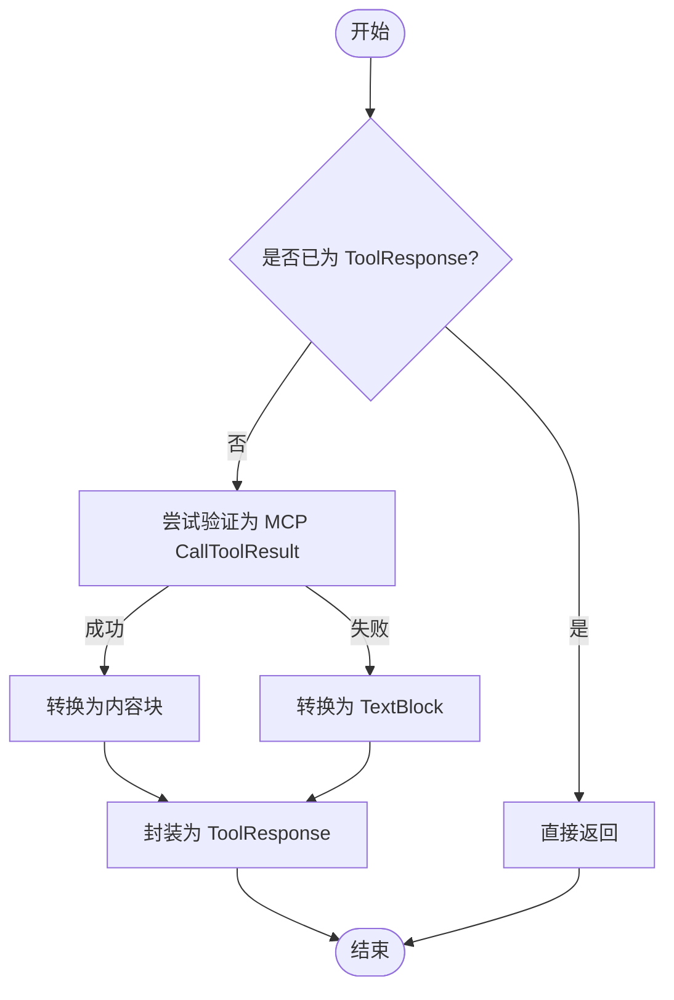
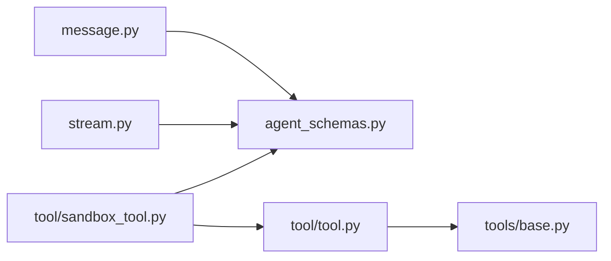

# AgentScope适配器

<cite>
**本文引用的文件列表**
- [message.py](file://src/agentscope_runtime/adapters/agentscope/message.py)
- [stream.py](file://src/agentscope_runtime/adapters/agentscope/stream.py)
- [tool.py](file://src/agentscope_runtime/adapters/agentscope/tool/tool.py)
- [sandbox_tool.py](file://src/agentscope_runtime/adapters/agentscope/tool/sandbox_tool.py)
- [base.py](file://src/agentscope_runtime/tools/base.py)
- [agent_schemas.py](file://src/agentscope_runtime/engine/schemas/agent_schemas.py)
- [test_agentscope_tool_adapter.py](file://tests/tools/test_agentscope_tool_adapter.py)
</cite>

## 目录
1. [简介](#简介)
2. [项目结构](#项目结构)
3. [核心组件](#核心组件)
4. [架构总览](#架构总览)
5. [详细组件分析](#详细组件分析)
6. [依赖关系分析](#依赖关系分析)
7. [性能考量](#性能考量)
8. [故障排查指南](#故障排查指南)
9. [结论](#结论)
10. [附录](#附录)

## 简介
本文件面向希望在 AgentScope Runtime 中使用 AgentScope 适配器的开发者，系统性阐述 AgentScope 适配器的消息转换机制与工具调用/结果转换流程。内容覆盖：
- 消息类型映射与内容块转换（文本、图像、音频、视频、文件、思维块）
- 角色处理与元数据保留
- 工具调用与结果转换（含 MCP 结果到内容块的转换）
- 适配器配置选项与使用示例
- 错误处理与边界情况
- 与 AgentScope Runtime 内部 Msg 对象的双向转换

## 项目结构
AgentScope 适配器位于适配器目录下，主要由以下模块组成：
- 消息转换：将 AgentScope Runtime 的 Message/Content 转换为 AgentScope 的 Msg；以及将 AgentScope 的流式 Msg 转换回 AgentScope Runtime 的 Message/Content
- 工具适配：将 agentscope_runtime 的 Tool 包装为 AgentScope 的 RegisteredToolFunction，或对沙箱工具输出进行统一转换
- 基础类型：基于引擎的 schema 定义，支撑消息类型、内容块类型、工具调用类型等

图表来源
- [message.py:1-394](file://src/agentscope_runtime/adapters/agentscope/message.py#L1-L394)
- [stream.py:1-684](file://src/agentscope_runtime/adapters/agentscope/stream.py#L1-L684)
- [tool.py:1-232](file://src/agentscope_runtime/adapters/agentscope/tool/tool.py#L1-L232)
- [sandbox_tool.py:1-70](file://src/agentscope_runtime/adapters/agentscope/tool/sandbox_tool.py#L1-L70)
- [agent_schemas.py:1-800](file://src/agentscope_runtime/engine/schemas/agent_schemas.py#L1-L800)
- [base.py:1-265](file://src/agentscope_runtime/tools/base.py#L1-L265)

章节来源
- [message.py:1-394](file://src/agentscope_runtime/adapters/agentscope/message.py#L1-L394)
- [stream.py:1-684](file://src/agentscope_runtime/adapters/agentscope/stream.py#L1-L684)
- [tool.py:1-232](file://src/agentscope_runtime/adapters/agentscope/tool/tool.py#L1-L232)
- [sandbox_tool.py:1-70](file://src/agentscope_runtime/adapters/agentscope/tool/sandbox_tool.py#L1-L70)
- [agent_schemas.py:1-800](file://src/agentscope_runtime/engine/schemas/agent_schemas.py#L1-L800)
- [base.py:1-265](file://src/agentscope_runtime/tools/base.py#L1-L265)

## 核心组件
- 消息转换器：负责将 AgentScope Runtime 的 Message 列表转换为 AgentScope 的 Msg 对象，支持多类型内容块与工具调用/结果的双向映射
- 流式转换器：将 AgentScope 的流式 Msg（包含文本、思维、工具调用/结果、多媒体内容）转换为 AgentScope Runtime 的 Message/Content 流
- 工具适配器：将 agentscope_runtime 的 Tool 包装为 AgentScope 的 RegisteredToolFunction，自动执行输入校验、异步/同步执行、结果序列化
- 沙箱工具适配器：将沙箱工具的任意返回值转换为 ToolResponse，必要时将 MCP CallToolResult 转换为 AgentScope 的内容块

章节来源
- [message.py:53-394](file://src/agentscope_runtime/adapters/agentscope/message.py#L53-L394)
- [stream.py:33-684](file://src/agentscope_runtime/adapters/agentscope/stream.py#L33-L684)
- [tool.py:17-232](file://src/agentscope_runtime/adapters/agentscope/tool/tool.py#L17-L232)
- [sandbox_tool.py:15-70](file://src/agentscope_runtime/adapters/agentscope/tool/sandbox_tool.py#L15-L70)

## 架构总览
AgentScope 适配器在 AgentScope Runtime 与 AgentScope 之间建立桥梁，实现如下关键能力：
- 将外部输入（AgentScope Runtime 的 Message/Content）转换为 AgentScope 的 Msg，以便 AgentScope 框架消费
- 将 AgentScope 的流式输出（Msg）转换回 AgentScope Runtime 的 Message/Content，支持增量更新与完成事件
- 将 agentscope_runtime 的 Tool 统一包装为 AgentScope 的工具函数，支持参数校验、异步执行、结果格式化
- 对沙箱工具输出进行标准化，兼容 MCP 结果并转换为内容块

图表来源
- [message.py:53-394](file://src/agentscope_runtime/adapters/agentscope/message.py#L53-L394)
- [stream.py:33-684](file://src/agentscope_runtime/adapters/agentscope/stream.py#L33-L684)
- [tool.py:17-232](file://src/agentscope_runtime/adapters/agentscope/tool/tool.py#L17-L232)

## 详细组件分析

### 消息转换器（message_to_agentscope_msg）
职责
- 将 AgentScope Runtime 的 Message/Content 转换为 AgentScope 的 Msg
- 支持文本、图像、音频、视频、文件、思维、工具调用与工具结果的映射
- 角色规范化（tool 角色映射为 system），元数据保留与原始 id 名称恢复
- 对工具调用/结果进行参数解析与内容块转换，支持 MCP CallToolResult 的内容块转换

关键流程
- 角色处理：将“tool”角色映射为“system”，其余默认为“assistant”
- 元数据处理：从 metadata 中恢复 original_id/original_name/metadata
- 工具调用映射：从 content.data.arguments 解析参数，构建 ToolUseBlock
- 工具结果映射：从 content.data.output 解析输出，尝试转为内容块（Text/Image/Audio/Video），否则回退为原始字符串
- 其他消息：按类型映射到 TextBlock/ImageBlock/AudioBlock/VideoBlock/FileBlock

图表来源
- [message.py:53-394](file://src/agentscope_runtime/adapters/agentscope/message.py#L53-L394)

章节来源
- [message.py:53-394](file://src/agentscope_runtime/adapters/agentscope/message.py#L53-L394)

### 流式转换器（adapt_agentscope_message_stream）
职责
- 将 AgentScope 的流式 Msg 转换为 AgentScope Runtime 的 Message/Content 流
- 支持文本增量、思维增量、工具调用/结果增量、多媒体内容增量
- 维护消息状态（进度/完成）、索引管理、usage/metadata 传递
- 支持自定义转换器（type_converters），允许对特定内容块类型进行自定义生成

关键流程
- 消息分组：按 msg.id 分组，同一 id 下的内容合并为一条 Message
- 文本增量：将字符串内容拆分为 TextContent 增量，支持去重前缀
- 思维增量：将 thinking 内容拆分为 TextContent 增量
- 工具调用/结果：根据 call_id 创建/复用 Message，增量更新 arguments/output
- 多媒体内容：将 Image/Audio/Video/File 的 source（url/base64）转换为对应 Content 类型
- 完成事件：在 last 或工具开始时发出 completed 事件

图表来源
- [stream.py:33-684](file://src/agentscope_runtime/adapters/agentscope/stream.py#L33-L684)

章节来源
- [stream.py:33-684](file://src/agentscope_runtime/adapters/agentscope/stream.py#L33-L684)

### 工具适配器（agentscope_tool_adapter / agentscope_toolkit_adapter）
职责
- 将 agentscope_runtime 的 Tool 包装为 AgentScope 的 RegisteredToolFunction
- 自动执行输入参数校验（基于 Tool.input_type），支持异步/同步执行
- 统一结果格式化为 ToolResponse，内容块为文本，元数据携带原始结果
- 支持批量创建 Toolkit 并进行名称/描述覆盖

关键流程
- 输入校验：若 Tool.input_type 存在，使用 model_validate 校验参数
- 执行策略：检测 Tool.arun 是否为协程，必要时在新线程池中运行 asyncio.run
- 结果格式化：优先使用 model_dump 序列化，否则转字符串；封装为 ToolResponse
- Schema 转换：将 Tool.function_schema 转换为 AgentScope 的 function schema

图表来源
- [tool.py:17-232](file://src/agentscope_runtime/adapters/agentscope/tool/tool.py#L17-L232)
- [base.py:34-265](file://src/agentscope_runtime/tools/base.py#L34-L265)

章节来源
- [tool.py:17-232](file://src/agentscope_runtime/adapters/agentscope/tool/tool.py#L17-L232)
- [base.py:34-265](file://src/agentscope_runtime/tools/base.py#L34-L265)

### 沙箱工具适配器（sandbox_tool_adapter）
职责
- 将沙箱工具的任意返回值转换为 ToolResponse
- 若返回值可验证为 MCP CallToolResult，则转换为 AgentScope 的内容块
- 否则回退为 TextBlock，记录警告日志

图表来源
- [sandbox_tool.py:15-70](file://src/agentscope_runtime/adapters/agentscope/tool/sandbox_tool.py#L15-L70)

章节来源
- [sandbox_tool.py:15-70](file://src/agentscope_runtime/adapters/agentscope/tool/sandbox_tool.py#L15-L70)

## 依赖关系分析
- 消息转换依赖引擎的 Message/Content 类型与 MessageType 常量
- 流式转换依赖引擎的 Message/Content 类型与工具调用/输出类型
- 工具适配依赖 agentscope 的 Toolkit/ToolResponse 与工具函数 schema
- 沙箱工具适配依赖 MCP 的 CallToolResult 与 MCPClientBase 的内容块转换

图表来源
- [message.py:1-30](file://src/agentscope_runtime/adapters/agentscope/message.py#L1-L30)
- [stream.py:14-28](file://src/agentscope_runtime/adapters/agentscope/stream.py#L14-L28)
- [tool.py:14-14](file://src/agentscope_runtime/adapters/agentscope/tool/tool.py#L14-L14)
- [sandbox_tool.py:6-9](file://src/agentscope_runtime/adapters/agentscope/tool/sandbox_tool.py#L6-L9)
- [agent_schemas.py:18-36](file://src/agentscope_runtime/engine/schemas/agent_schemas.py#L18-L36)
- [base.py:34-74](file://src/agentscope_runtime/tools/base.py#L34-L74)

章节来源
- [message.py:1-30](file://src/agentscope_runtime/adapters/agentscope/message.py#L1-L30)
- [stream.py:14-28](file://src/agentscope_runtime/adapters/agentscope/stream.py#L14-L28)
- [tool.py:14-14](file://src/agentscope_runtime/adapters/agentscope/tool/tool.py#L14-L14)
- [sandbox_tool.py:6-9](file://src/agentscope_runtime/adapters/agentscope/tool/sandbox_tool.py#L6-L9)
- [agent_schemas.py:18-36](file://src/agentscope_runtime/engine/schemas/agent_schemas.py#L18-L36)
- [base.py:34-74](file://src/agentscope_runtime/tools/base.py#L34-L74)

## 性能考量
- 流式转换采用增量拼接与索引管理，避免重复传输相同内容
- 工具执行在独立线程池中运行异步函数，减少阻塞
- 内容块转换尽量复用对象属性，减少不必要的序列化
- 建议在高并发场景下合理设置线程池大小与超时参数

## 故障排查指南
常见问题与处理
- 工具输入校验失败：检查 Tool.input_type 的字段与必填项，确保传入参数符合 schema
- 工具执行异常：查看 ToolResponse 的 metadata.error 标记，定位具体异常信息
- 流式转换异常：确认 Msg.content 类型与索引一致性，避免重复索引导致的数据错位
- MCP 结果无法转换：检查 CallToolResult 的 content 结构，确保为合法数组/对象
- 角色映射异常：tool 角色会被强制映射为 system，避免在 AgentScope 中使用 tool 角色

章节来源
- [tool.py:59-143](file://src/agentscope_runtime/adapters/agentscope/tool/tool.py#L59-L143)
- [stream.py:144-180](file://src/agentscope_runtime/adapters/agentscope/stream.py#L144-L180)
- [message.py:87-91](file://src/agentscope_runtime/adapters/agentscope/message.py#L87-L91)

## 结论
AgentScope 适配器提供了从 AgentScope Runtime 到 AgentScope 的完整消息与工具链路支持，具备：
- 完整的消息类型映射与内容块转换
- 流式增量输出与完成事件的精确控制
- 工具调用与结果的统一格式化
- 对沙箱工具输出的兼容性处理

通过合理的配置与错误处理，开发者可以在 AgentScope Runtime 中无缝集成 AgentScope 生态的智能体与工具体系。

## 附录

### 配置选项与使用示例
- 消息转换器
  - type_converters：为特定 message.type 注册自定义转换器，跳过内置逻辑
  - 元数据：支持 original_id/original_name/metadata 的恢复
- 流式转换器
  - type_converters：为特定内容块类型注册自定义转换器（需返回迭代器/异步迭代器）
  - 支持自定义内容块类型与增量行为
- 工具适配器
  - name/description 覆盖：可为工具指定新的名称与描述
  - 批量工具包：agentscope_toolkit_adapter 支持批量创建 Toolkit
- 沙箱工具适配器
  - 保持原函数签名与文档，自动将返回值转换为 ToolResponse

章节来源
- [message.py:56-90](file://src/agentscope_runtime/adapters/agentscope/message.py#L56-L90)
- [stream.py:35-55](file://src/agentscope_runtime/adapters/agentscope/stream.py#L35-L55)
- [tool.py:17-57](file://src/agentscope_runtime/adapters/agentscope/tool/tool.py#L17-L57)
- [sandbox_tool.py:15-30](file://src/agentscope_runtime/adapters/agentscope/tool/sandbox_tool.py#L15-L30)

### 测试参考
- 工具适配器测试覆盖了创建、参数校验、执行与 JSON Schema 生成
- 集成测试展示了与 AgentScope ReActAgent 的端到端工作流

章节来源
- [test_agentscope_tool_adapter.py:1-364](file://tests/tools/test_agentscope_tool_adapter.py#L1-L364)