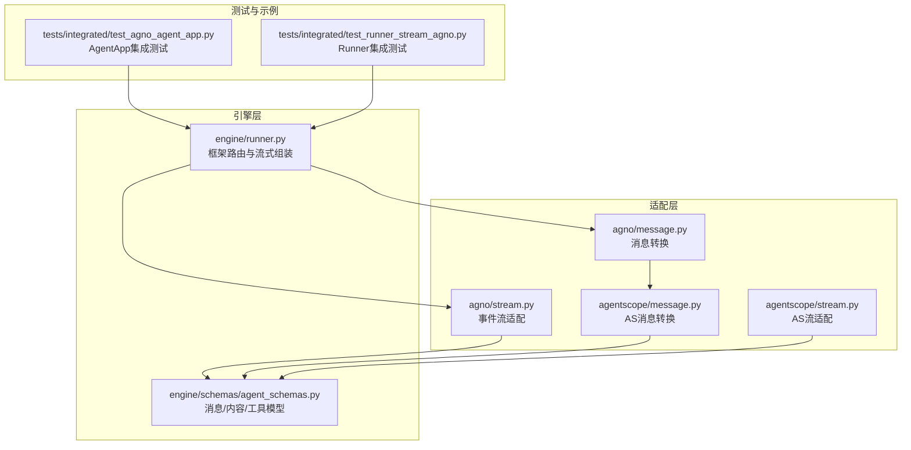
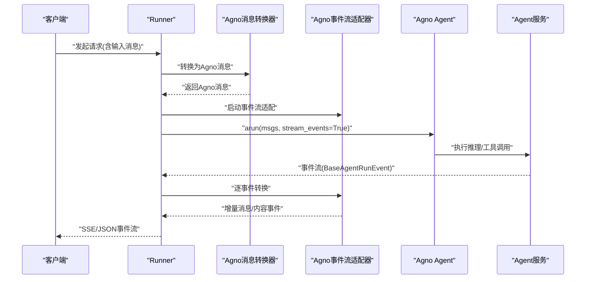
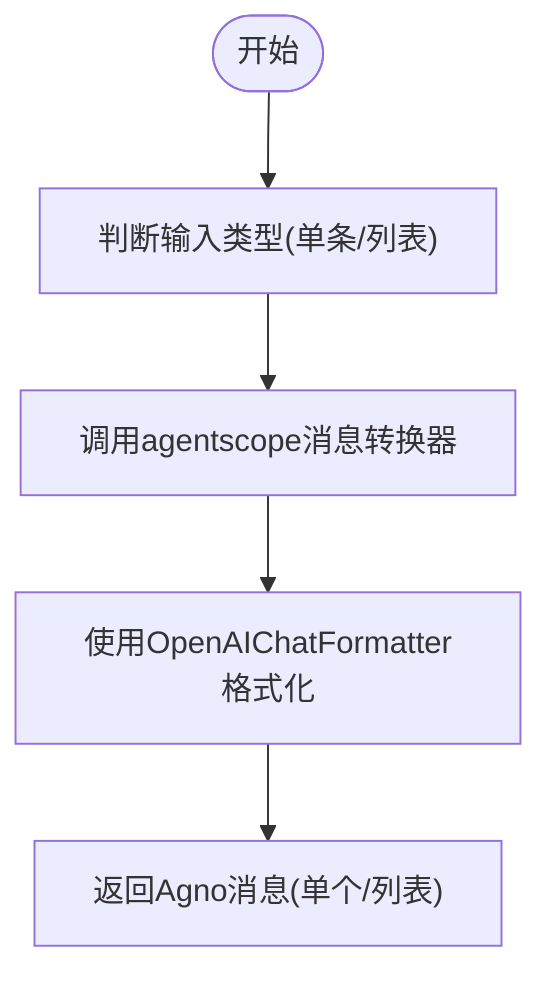
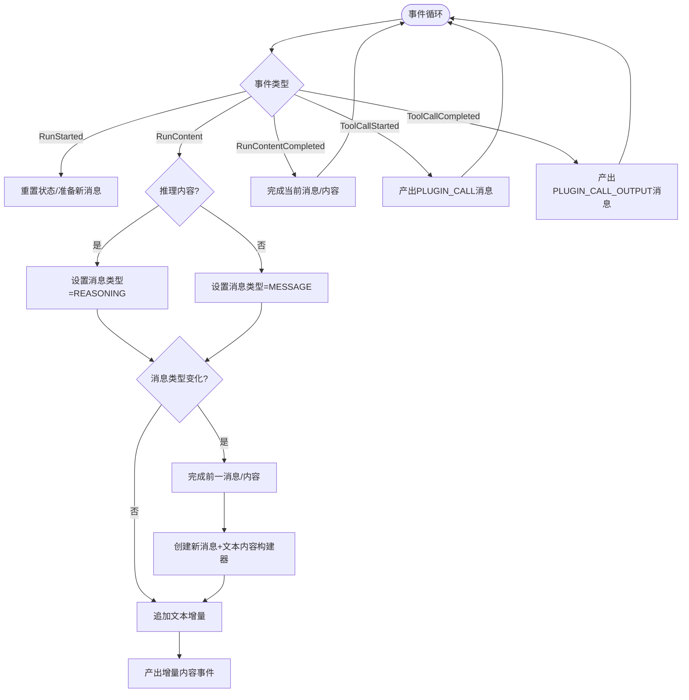
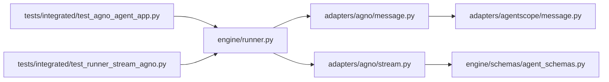

# Agno适配器

<cite>
**本文引用的文件**
- [message.py](file://src/agentscope_runtime/adapters/agno/message.py)
- [stream.py](file://src/agentscope_runtime/adapters/agno/stream.py)
- [message.py](file://src/agentscope_runtime/adapters/agentscope/message.py)
- [stream.py](file://src/agentscope_runtime/adapters/agentscope/stream.py)
- [agent_schemas.py](file://src/agentscope_runtime/engine/schemas/agent_schemas.py)
- [runner.py](file://src/agentscope_runtime/engine/runner.py)
- [test_agno_agent_app.py](file://tests/integrated/test_agno_agent_app.py)
- [test_runner_stream_agno.py](file://tests/integrated/test_runner_stream_agno.py)
- [a2a_registry.md](file://cookbook/zh/a2a_registry.md)
</cite>

## 目录
1. [简介](#简介)
2. [项目结构](#项目结构)
3. [核心组件](#核心组件)
4. [架构总览](#架构总览)
5. [详细组件分析](#详细组件分析)
6. [依赖关系分析](#依赖关系分析)
7. [性能考量](#性能考量)
8. [故障排查指南](#故障排查指南)
9. [结论](#结论)
10. [附录](#附录)

## 简介
本文件面向希望在AgentScope Runtime中接入Agno框架的开发者，系统性阐述Agno适配器的消息转换机制与流式处理实现。内容涵盖：
- Agno消息格式到AgentScope消息格式的双向转换流程
- 会话管理与状态保持策略
- Agno特有事件类型与参数处理
- 适配器配置选项与使用示例
- 与AgentScope生态系统的集成方法（含A2A注册与发现）

## 项目结构
Agno适配器位于适配层目录，负责将AgentScope内部消息模型与Agno事件流进行桥接，并通过Runner在运行时按框架类型选择对应的适配器。

图表来源
- [message.py:1-39](file://src/agentscope_runtime/adapters/agno/message.py#L1-L39)
- [stream.py:1-124](file://src/agentscope_runtime/adapters/agno/stream.py#L1-L124)
- [message.py:1-394](file://src/agentscope_runtime/adapters/agentscope/message.py#L1-L394)
- [stream.py:1-684](file://src/agentscope_runtime/adapters/agentscope/stream.py#L1-L684)
- [agent_schemas.py:1-800](file://src/agentscope_runtime/engine/schemas/agent_schemas.py#L1-L800)
- [runner.py:270-356](file://src/agentscope_runtime/engine/runner.py#L270-L356)
- [test_agno_agent_app.py:1-248](file://tests/integrated/test_agno_agent_app.py#L1-L248)
- [test_runner_stream_agno.py:1-206](file://tests/integrated/test_runner_stream_agno.py#L1-L206)

章节来源
- [runner.py:270-356](file://src/agentscope_runtime/engine/runner.py#L270-L356)
- [agent_schemas.py:1-800](file://src/agentscope_runtime/engine/schemas/agent_schemas.py#L1-L800)

## 核心组件
- 消息转换器（Agno侧）
  - 将AgentScope内部消息模型转换为Agno可消费的OpenAI兼容消息格式
  - 支持单条或多条消息批量转换
  - 支持自定义类型转换器映射
- 事件流适配器（Agno侧）
  - 将Agno事件流转换为AgentScope的增量消息/内容事件
  - 支持推理内容、文本内容、工具调用开始/结束等事件
  - 维护消息与内容的增量拼接与完成态

章节来源
- [message.py:10-39](file://src/agentscope_runtime/adapters/agno/message.py#L10-L39)
- [stream.py:32-124](file://src/agentscope_runtime/adapters/agno/stream.py#L32-L124)

## 架构总览
Agno适配器在运行时由Runner根据framework_type选择，将AgentScope请求转换为Agno消息后交由Agno Agent执行，再将Agno事件流转换回AgentScope消息流。

图表来源
- [runner.py:280-294](file://src/agentscope_runtime/engine/runner.py#L280-L294)
- [message.py:10-39](file://src/agentscope_runtime/adapters/agno/message.py#L10-L39)
- [stream.py:32-124](file://src/agentscope_runtime/adapters/agno/stream.py#L32-L124)

## 详细组件分析

### 消息转换器（Agno侧）
职责
- 将AgentScope内部消息模型转换为Agno可消费的OpenAI兼容消息
- 通过内置的OpenAIChatFormatter完成最终格式化
- 支持自定义type_converters映射，允许针对特定message.type进行定制转换

关键流程
- 输入：单条或多条AgentScope Message
- 中间：委托agentscope/message.py中的通用转换逻辑生成Msg对象
- 输出：单个或多个Agno消息字典

图表来源
- [message.py:10-39](file://src/agentscope_runtime/adapters/agno/message.py#L10-L39)
- [message.py:53-394](file://src/agentscope_runtime/adapters/agentscope/message.py#L53-L394)

章节来源
- [message.py:10-39](file://src/agentscope_runtime/adapters/agno/message.py#L10-L39)
- [message.py:53-394](file://src/agentscope_runtime/adapters/agentscope/message.py#L53-L394)

### 事件流适配器（Agno侧）
职责
- 将Agno事件流转换为AgentScope增量消息/内容事件
- 维护消息与内容的增量拼接与完成态
- 处理推理内容、文本内容、工具调用开始/结束等事件

事件类型与处理要点
- RunStartedEvent：标记新一轮对话开始，重置状态
- RunContentEvent：区分推理内容与普通文本内容，分别映射为REASONING与MESSAGE类型
- RunContentCompletedEvent：完成当前消息与内容
- ToolCallStartedEvent：将工具调用参数封装为DataContent，类型为PLUGIN_CALL
- ToolCallCompletedEvent：将工具结果封装为DataContent，类型为PLUGIN_CALL_OUTPUT

图表来源
- [stream.py:32-124](file://src/agentscope_runtime/adapters/agno/stream.py#L32-L124)

章节来源
- [stream.py:32-124](file://src/agentscope_runtime/adapters/agno/stream.py#L32-L124)

### 会话管理与状态保持
- 会话ID传递
  - Runner在构建查询参数时携带session_id，Agno Agent据此维护上下文
- 上下文注入
  - Agent初始化时可开启add_history_to_context，使历史消息参与上下文
- 流式状态
  - 适配器通过消息类型与内容索引实现增量拼接与完成态，保证多轮对话的连续性

章节来源
- [test_agno_agent_app.py:41-63](file://tests/integrated/test_agno_agent_app.py#L41-L63)
- [test_runner_stream_agno.py:32-69](file://tests/integrated/test_runner_stream_agno.py#L32-L69)

### Agno特有消息类型与参数处理
- 工具调用
  - 开始事件：将工具参数序列化为JSON字符串，封装为DataContent，类型为PLUGIN_CALL
  - 结束事件：将工具结果序列化为JSON字符串，封装为DataContent，类型为PLUGIN_CALL_OUTPUT
- 推理内容
  - 通过reasoning_content区分推理与普通文本，映射为REASONING类型消息
- 文本内容
  - 逐块增量输出，支持完成态事件触发最终消息完成

章节来源
- [stream.py:84-122](file://src/agentscope_runtime/adapters/agno/stream.py#L84-L122)
- [agent_schemas.py:18-44](file://src/agentscope_runtime/engine/schemas/agent_schemas.py#L18-L44)

### 适配器配置选项与使用示例
- Runner配置
  - 设置framework_type为"agno"，Runner将自动加载Agno适配器
- 自定义类型转换器
  - in_type_converters/out_type_converters用于消息/内容的自定义转换
- AgentApp集成
  - 通过AgentApp.query(framework="agno")注册Agno框架处理逻辑
  - 支持OpenAI兼容模式端点与SSE事件流
- 多轮会话
  - 通过session_id在多轮对话中保持上下文

章节来源
- [runner.py:280-294](file://src/agentscope_runtime/engine/runner.py#L280-L294)
- [test_agno_agent_app.py:34-63](file://tests/integrated/test_agno_agent_app.py#L34-L63)
- [test_runner_stream_agno.py:18-83](file://tests/integrated/test_runner_stream_agno.py#L18-L83)

### 与AgentScope生态系统的集成方法
- A2A注册与发现
  - 通过a2a_config配置AgentCard与运行时参数
  - 支持Nacos等注册中心，实现服务发现与版本管理
  - 提供多种配置方式（a2a_config、环境变量、deploy时传入adapter）
- 传输协议
  - 支持HTTP/JSONRPC等多种传输类型
  - 可配置TLS、额外通道参数等

章节来源
- [a2a_registry.md:1-345](file://cookbook/zh/a2a_registry.md#L1-L345)

## 依赖关系分析
- 适配器依赖
  - Agno消息转换器依赖agentscope消息转换器与OpenAIChatFormatter
  - Agno事件流适配器依赖AgentScope消息/内容模型与ResponseBuilder
- 运行时路由
  - Runner根据framework_type动态导入对应适配器
- 测试验证
  - 集成测试覆盖AgentApp与Runner两种使用场景，验证SSE事件流与会话保持

图表来源
- [runner.py:280-294](file://src/agentscope_runtime/engine/runner.py#L280-L294)
- [message.py:1-39](file://src/agentscope_runtime/adapters/agno/message.py#L1-L39)
- [stream.py:1-124](file://src/agentscope_runtime/adapters/agno/stream.py#L1-L124)
- [message.py:1-394](file://src/agentscope_runtime/adapters/agentscope/message.py#L1-L394)
- [agent_schemas.py:1-800](file://src/agentscope_runtime/engine/schemas/agent_schemas.py#L1-L800)
- [test_agno_agent_app.py:1-248](file://tests/integrated/test_agno_agent_app.py#L1-L248)
- [test_runner_stream_agno.py:1-206](file://tests/integrated/test_runner_stream_agno.py#L1-L206)

章节来源
- [runner.py:280-294](file://src/agentscope_runtime/engine/runner.py#L280-L294)
- [message.py:1-39](file://src/agentscope_runtime/adapters/agno/message.py#L1-L39)
- [stream.py:1-124](file://src/agentscope_runtime/adapters/agno/stream.py#L1-L124)
- [message.py:1-394](file://src/agentscope_runtime/adapters/agentscope/message.py#L1-L394)
- [agent_schemas.py:1-800](file://src/agentscope_runtime/engine/schemas/agent_schemas.py#L1-L800)
- [test_agno_agent_app.py:1-248](file://tests/integrated/test_agno_agent_app.py#L1-L248)
- [test_runner_stream_agno.py:1-206](file://tests/integrated/test_runner_stream_agno.py#L1-L206)

## 性能考量
- 异步事件流
  - 适配器基于AsyncIterator实现，避免阻塞，提升吞吐
- 增量拼接
  - 通过内容索引与增量标志位减少重复序列化开销
- 批量转换
  - 支持批量消息转换，降低格式化成本
- 工具调用
  - 工具调用参数与结果均以JSON字符串形式传输，避免复杂对象序列化

## 故障排查指南
- 事件流中断
  - 确认Agno Agent已开启stream_events=True
  - 检查事件类型是否被正确识别（推理/文本/工具调用）
- 工具调用失败
  - 核对工具参数与结果的JSON序列化是否成功
  - 捕获异常并降级为字符串表示
- 会话上下文丢失
  - 确认session_id在请求与Agent初始化时均正确传递
  - 检查add_history_to_context配置
- SSE事件解析
  - 确保客户端正确解析SSE事件，忽略非JSON心跳行

章节来源
- [stream.py:103-122](file://src/agentscope_runtime/adapters/agno/stream.py#L103-L122)
- [test_agno_agent_app.py:92-151](file://tests/integrated/test_agno_agent_app.py#L92-L151)

## 结论
Agno适配器通过清晰的消息转换与事件流适配，实现了AgentScope与Agno框架的无缝对接。其异步流式设计、会话状态保持与工具调用处理，满足了实时交互与多轮对话的需求。结合A2A注册与发现机制，可在更大范围内实现Agent服务的自动化部署与治理。

## 附录
- 快速开始
  - 在Runner中设置framework_type="agno"
  - 在AgentApp中注册framework="agno"的查询处理
  - 通过SSE事件流接收增量消息
- 最佳实践
  - 使用自定义type_converters处理特殊消息类型
  - 为工具调用提供稳定的JSON参数与结果格式
  - 合理配置会话ID与上下文注入，确保多轮对话连贯性