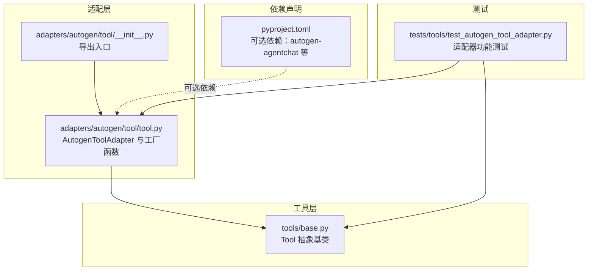
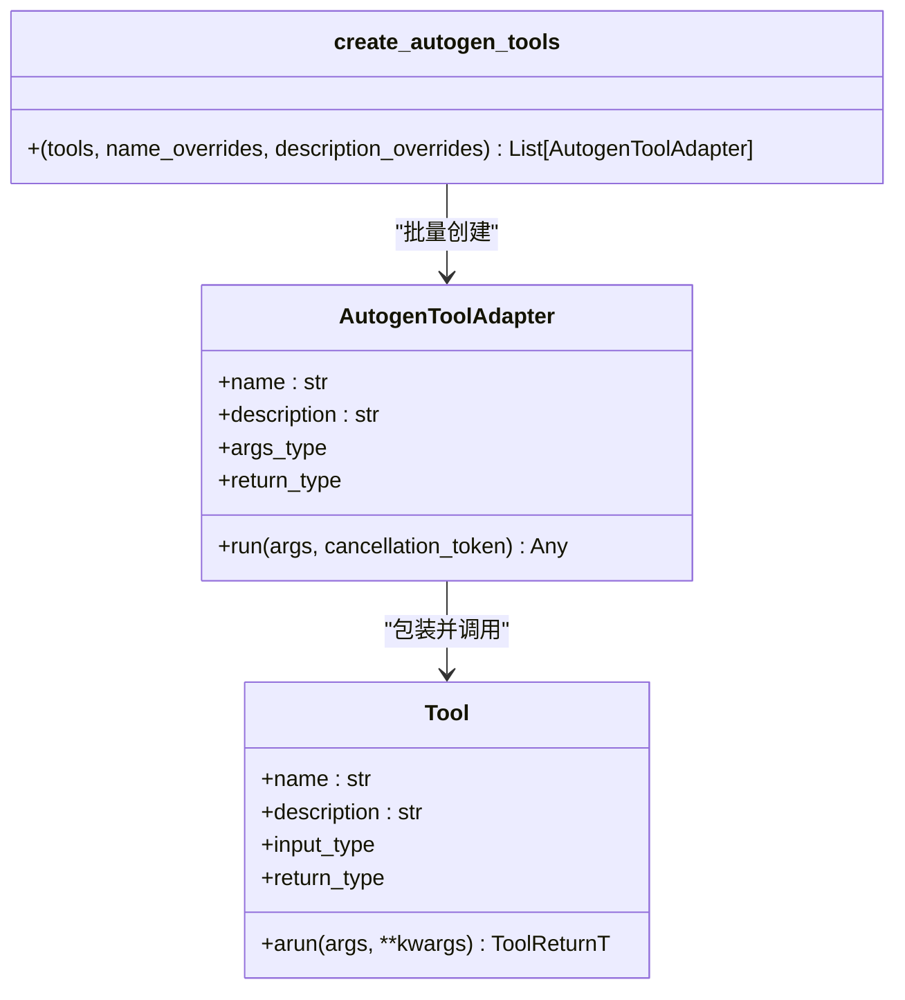
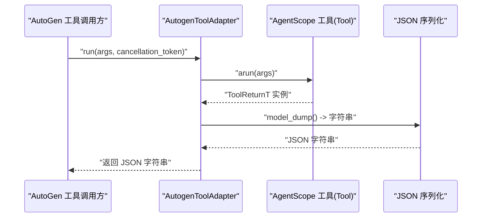
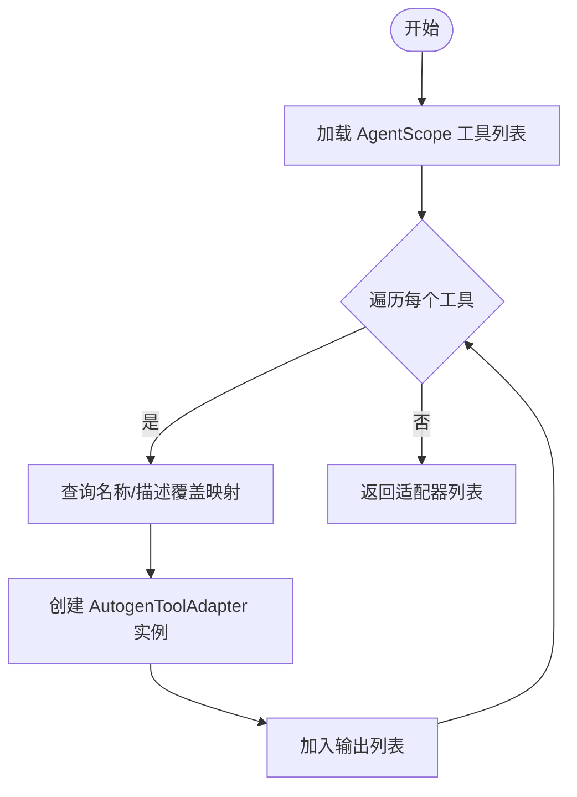
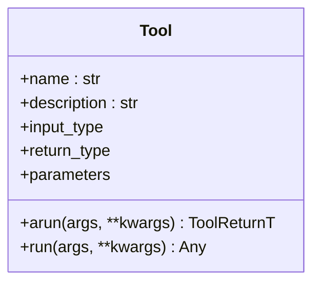
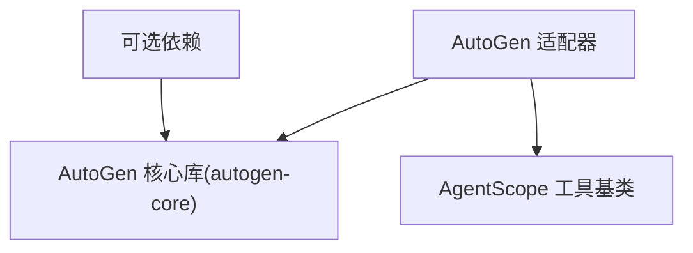

# AutoGen适配器

<cite>
**本文引用的文件**
- [src/agentscope_runtime/adapters/autogen/tool/tool.py](file://src/agentscope_runtime/adapters/autogen/tool/tool.py)
- [src/agentscope_runtime/adapters/autogen/tool/__init__.py](file://src/agentscope_runtime/adapters/autogen/tool/__init__.py)
- [src/agentscope_runtime/tools/base.py](file://src/agentscope_runtime/tools/base.py)
- [tests/tools/test_autogen_tool_adapter.py](file://tests/tools/test_autogen_tool_adapter.py)
- [pyproject.toml](file://pyproject.toml)
</cite>

## 目录
1. [简介](#简介)
2. [项目结构](#项目结构)
3. [核心组件](#核心组件)
4. [架构总览](#架构总览)
5. [组件详解](#组件详解)
6. [依赖关系分析](#依赖关系分析)
7. [性能与可靠性](#性能与可靠性)
8. [故障排查指南](#故障排查指南)
9. [结论](#结论)
10. [附录：配置与使用示例](#附录配置与使用示例)

## 简介
本章节面向希望在AutoGen生态中复用AgentScope工具集的开发者，系统阐述AutoGen适配器的设计目标、工具适配机制、参数与结果的序列化/反序列化策略、以及在团队协作模式下的消息与工具执行流程。文档同时提供可直接落地的配置项说明、集成步骤与最佳实践，帮助读者快速完成从AgentScope工具到AutoGen工具的桥接。

## 项目结构
AutoGen适配器位于适配层目录下，核心实现集中在AutoGen工具适配模块；配套有基础工具抽象类与单元测试，确保适配器行为符合预期。

**图表来源**
- [src/agentscope_runtime/adapters/autogen/tool/tool.py:1-212](file://src/agentscope_runtime/adapters/autogen/tool/tool.py#L1-L212)
- [src/agentscope_runtime/adapters/autogen/tool/__init__.py:1-8](file://src/agentscope_runtime/adapters/autogen/tool/__init__.py#L1-L8)
- [src/agentscope_runtime/tools/base.py:1-200](file://src/agentscope_runtime/tools/base.py#L1-L200)
- [tests/tools/test_autogen_tool_adapter.py:1-112](file://tests/tools/test_autogen_tool_adapter.py#L1-L112)
- [pyproject.toml:68-99](file://pyproject.toml#L68-L99)

**章节来源**
- [src/agentscope_runtime/adapters/autogen/tool/tool.py:1-212](file://src/agentscope_runtime/adapters/autogen/tool/tool.py#L1-L212)
- [src/agentscope_runtime/adapters/autogen/tool/__init__.py:1-8](file://src/agentscope_runtime/adapters/autogen/tool/__init__.py#L1-L8)
- [src/agentscope_runtime/tools/base.py:1-200](file://src/agentscope_runtime/tools/base.py#L1-L200)
- [tests/tools/test_autogen_tool_adapter.py:1-112](file://tests/tools/test_autogen_tool_adapter.py#L1-L112)
- [pyproject.toml:68-99](file://pyproject.toml#L68-L99)

## 核心组件
- AutoGen工具适配器（AutogenToolAdapter）：将AgentScope的Tool实例包装为AutoGen可识别的工具，负责参数校验、异步执行、结果序列化与异常增强。
- 工具适配工厂（create_autogen_tools）：批量生成适配器实例，支持按名称与描述进行覆盖。
- AgentScope工具基类（Tool）：定义输入/输出类型、参数Schema、异步执行接口与同步转异步封装。

关键职责与交互：
- 输入参数：接收AutoGen传入的Pydantic模型实例，由适配器委托给AgentScope工具的异步执行方法。
- 输出结果：将AgentScope工具返回的Pydantic模型统一序列化为JSON字符串，满足AutoGen对工具返回值的要求。
- 异常处理：捕获底层执行异常并增强错误上下文，便于定位问题。

**章节来源**
- [src/agentscope_runtime/adapters/autogen/tool/tool.py:28-138](file://src/agentscope_runtime/adapters/autogen/tool/tool.py#L28-L138)
- [src/agentscope_runtime/adapters/autogen/tool/tool.py:140-212](file://src/agentscope_runtime/adapters/autogen/tool/tool.py#L140-L212)
- [src/agentscope_runtime/tools/base.py:34-143](file://src/agentscope_runtime/tools/base.py#L34-L143)

## 架构总览
AutoGen适配器通过继承AutoGen的工具基类，结合AgentScope工具的泛型输入/输出类型，实现“输入校验—异步执行—结果序列化”的完整链路。工厂函数负责批量适配，简化多工具场景下的集成成本。

**图表来源**
- [src/agentscope_runtime/adapters/autogen/tool/tool.py:28-138](file://src/agentscope_runtime/adapters/autogen/tool/tool.py#L28-L138)
- [src/agentscope_runtime/adapters/autogen/tool/tool.py:140-212](file://src/agentscope_runtime/adapters/autogen/tool/tool.py#L140-L212)
- [src/agentscope_runtime/tools/base.py:34-143](file://src/agentscope_runtime/tools/base.py#L34-L143)

## 组件详解

### AutoGen工具适配器（AutogenToolAdapter）
- 角色定位：将AgentScope的Tool实例无缝接入AutoGen工具体系，屏蔽类型差异与序列化细节。
- 关键点：
  - 构造阶段：读取AgentScope工具的name、description、input_type、return_type，并据此构建AutoGen工具签名。
  - 执行阶段：接收AutoGen传入的Pydantic模型实例，调用AgentScope工具的异步执行方法；将返回值统一序列化为JSON字符串。
  - 错误处理：捕获异常并附加工具名等上下文信息，提升可观测性。

**图表来源**
- [src/agentscope_runtime/adapters/autogen/tool/tool.py:109-138](file://src/agentscope_runtime/adapters/autogen/tool/tool.py#L109-L138)
- [src/agentscope_runtime/tools/base.py:94-127](file://src/agentscope_runtime/tools/base.py#L94-L127)

**章节来源**
- [src/agentscope_runtime/adapters/autogen/tool/tool.py:28-138](file://src/agentscope_runtime/adapters/autogen/tool/tool.py#L28-L138)

### 工具适配工厂（create_autogen_tools）
- 功能：批量创建适配器实例，支持按工具名覆盖名称与描述，便于在AutoGen中呈现更友好的工具清单。
- 使用建议：在多工具场景下优先使用该工厂，减少重复样板代码。

**图表来源**
- [src/agentscope_runtime/adapters/autogen/tool/tool.py:140-212](file://src/agentscope_runtime/adapters/autogen/tool/tool.py#L140-L212)

**章节来源**
- [src/agentscope_runtime/adapters/autogen/tool/tool.py:140-212](file://src/agentscope_runtime/adapters/autogen/tool/tool.py#L140-L212)

### AgentScope工具基类（Tool）
- 职责：定义工具的泛型输入/输出类型、参数Schema解析、异步执行接口与同步转异步封装。
- 与适配器的关系：适配器通过读取其input_type、return_type来构造AutoGen工具签名；通过调用arun完成实际执行。

**图表来源**
- [src/agentscope_runtime/tools/base.py:34-143](file://src/agentscope_runtime/tools/base.py#L34-L143)

**章节来源**
- [src/agentscope_runtime/tools/base.py:34-143](file://src/agentscope_runtime/tools/base.py#L34-L143)

## 依赖关系分析
- AutoGen适配器对AutoGen核心库存在运行时依赖，若未安装相应包，会抛出导入异常提示用户安装。
- 项目在可选依赖中声明了AutoGen相关生态组件，便于在具备AutoGen环境时启用适配能力。

**图表来源**
- [src/agentscope_runtime/adapters/autogen/tool/tool.py:13-21](file://src/agentscope_runtime/adapters/autogen/tool/tool.py#L13-L21)
- [pyproject.toml:68-99](file://pyproject.toml#L68-L99)

**章节来源**
- [src/agentscope_runtime/adapters/autogen/tool/tool.py:13-21](file://src/agentscope_runtime/adapters/autogen/tool/tool.py#L13-L21)
- [pyproject.toml:68-99](file://pyproject.toml#L68-L99)

## 性能与可靠性
- 异步执行：适配器直接委托AgentScope工具的异步执行方法，避免阻塞；请确保运行环境中已正确配置事件循环。
- 结果序列化：统一采用JSON序列化，保证跨框架传输一致性；如工具返回对象较大，需关注序列化开销。
- 类型校验：适配器在构造阶段读取AgentScope工具的输入/输出类型，有助于在调用前发现类型不匹配问题。
- 取消令牌：AutoGen调用方可传递取消令牌，适配器在执行过程中应尊重取消信号（当前实现以异常形式体现）。

[本节为通用性能讨论，无需特定文件来源]

## 故障排查指南
- 无法导入AutoGen相关模块
  - 现象：启动时报错提示需要安装autogen-core。
  - 处理：根据提示安装autogen-core或启用包含该依赖的可选组。
  - 参考来源
    - [src/agentscope_runtime/adapters/autogen/tool/tool.py:13-21](file://src/agentscope_runtime/adapters/autogen/tool/tool.py#L13-L21)
    - [pyproject.toml:68-99](file://pyproject.toml#L68-L99)
- 工具执行失败
  - 现象：适配器抛出运行时异常，包含工具名与原始错误信息。
  - 排查：检查AgentScope工具的输入参数是否符合其输入类型定义；确认工具内部逻辑与外部依赖可用。
  - 参考来源
    - [src/agentscope_runtime/adapters/autogen/tool/tool.py:133-137](file://src/agentscope_runtime/adapters/autogen/tool/tool.py#L133-L137)
- 参数Schema不匹配
  - 现象：AgentScope工具在arun阶段因输入类型不符而抛出类型错误。
  - 排查：确认AutoGen传入的参数模型与AgentScope工具的input_type一致。
  - 参考来源
    - [src/agentscope_runtime/tools/base.py:111-127](file://src/agentscope_runtime/tools/base.py#L111-L127)
- 工具返回类型不符
  - 现象：AgentScope工具返回值不符合其return_type定义。
  - 排查：修正工具实现，确保返回值类型与声明一致。
  - 参考来源
    - [src/agentscope_runtime/tools/base.py:121-127](file://src/agentscope_runtime/tools/base.py#L121-L127)

**章节来源**
- [src/agentscope_runtime/adapters/autogen/tool/tool.py:13-21](file://src/agentscope_runtime/adapters/autogen/tool/tool.py#L13-L21)
- [src/agentscope_runtime/adapters/autogen/tool/tool.py:133-137](file://src/agentscope_runtime/adapters/autogen/tool/tool.py#L133-L137)
- [src/agentscope_runtime/tools/base.py:111-127](file://src/agentscope_runtime/tools/base.py#L111-L127)
- [src/agentscope_runtime/tools/base.py:121-127](file://src/agentscope_runtime/tools/base.py#L121-L127)
- [pyproject.toml:68-99](file://pyproject.toml#L68-L99)

## 结论
AutoGen适配器以最小侵入的方式将AgentScope工具融入AutoGen生态，通过类型推断、异步执行与统一序列化，实现了跨框架的工具复用。配合工厂函数与完善的测试用例，开发者可以高效地在AutoGen中使用AgentScope工具集，并在出现异常时快速定位问题。

[本节为总结性内容，无需特定文件来源]

## 附录：配置与使用示例

### 配置选项
- 安装可选依赖
  - 在启用AutoGen适配器前，请确保安装包含AutoGen生态的可选依赖组。
  - 参考来源
    - [pyproject.toml:68-99](file://pyproject.toml#L68-L99)
- 工具名称与描述覆盖
  - 使用工厂函数时，可通过name_overrides与description_overrides为工具设置自定义展示名与描述。
  - 参考来源
    - [src/agentscope_runtime/adapters/autogen/tool/tool.py:196-209](file://src/agentscope_runtime/adapters/autogen/tool/tool.py#L196-L209)

### 使用示例（路径指引）
- 单工具适配与调用
  - 示例路径：[src/agentscope_runtime/adapters/autogen/tool/tool.py:43-81](file://src/agentscope_runtime/adapters/autogen/tool/tool.py#L43-L81)
- 批量适配多个工具
  - 示例路径：[src/agentscope_runtime/adapters/autogen/tool/tool.py:161-195](file://src/agentscope_runtime/adapters/autogen/tool/tool.py#L161-L195)
- 运行适配器并验证结果
  - 示例路径：[tests/tools/test_autogen_tool_adapter.py:80-98](file://tests/tools/test_autogen_tool_adapter.py#L80-L98)

### 最佳实践
- 明确输入/输出类型：确保AgentScope工具的泛型类型与参数Schema清晰，便于AutoGen自动推理工具签名。
- 使用工厂函数：在多工具场景下优先使用create_autogen_tools，统一管理工具元数据。
- 增强错误信息：在工具内部抛出异常时尽量包含上下文信息，适配器会在上层增强工具名等信息，便于排障。
- 注意序列化成本：对于大对象返回值，评估JSON序列化的性能影响，必要时优化工具返回结构。
- 保持类型一致性：严格遵守AgentScope工具的输入/输出类型约束，避免在运行期出现类型错误。

**章节来源**
- [src/agentscope_runtime/adapters/autogen/tool/tool.py:43-81](file://src/agentscope_runtime/adapters/autogen/tool/tool.py#L43-L81)
- [src/agentscope_runtime/adapters/autogen/tool/tool.py:161-195](file://src/agentscope_runtime/adapters/autogen/tool/tool.py#L161-L195)
- [tests/tools/test_autogen_tool_adapter.py:80-98](file://tests/tools/test_autogen_tool_adapter.py#L80-L98)