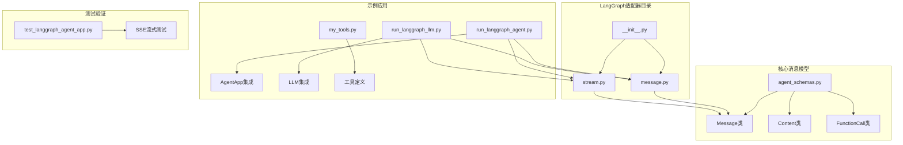
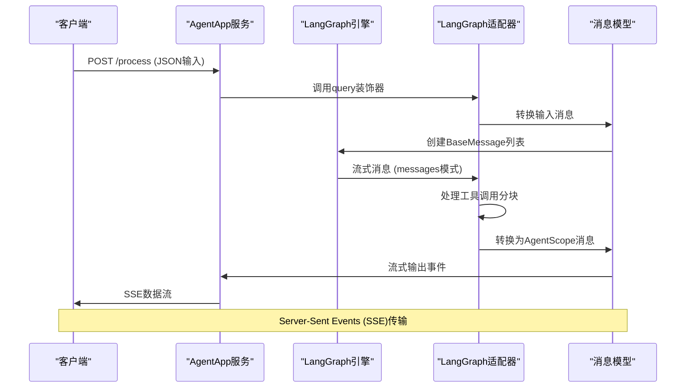
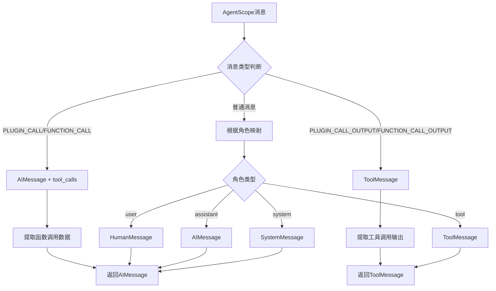
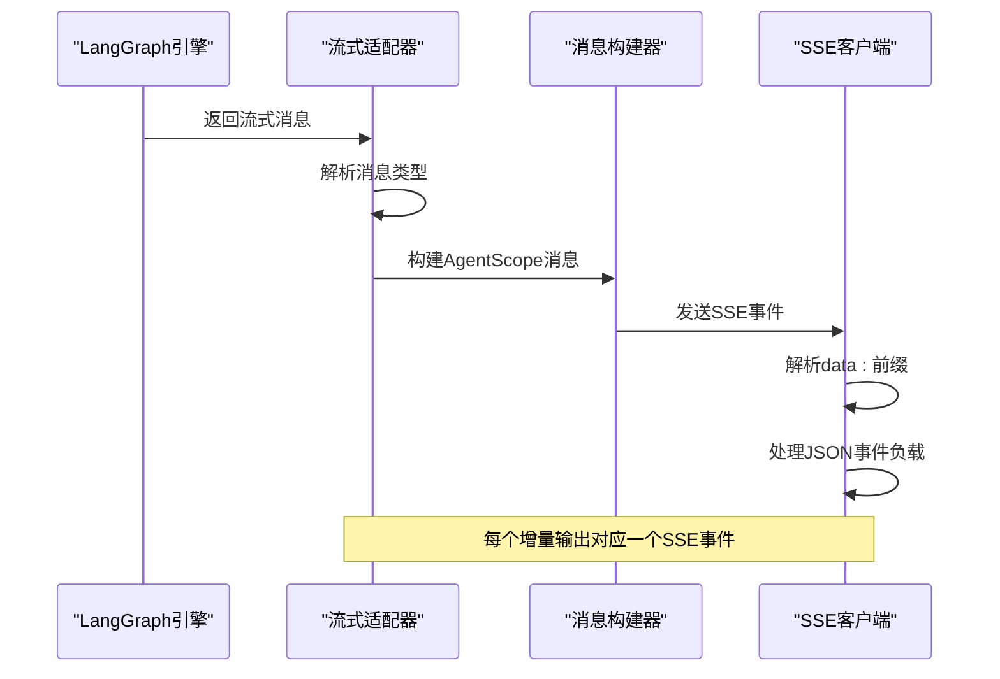
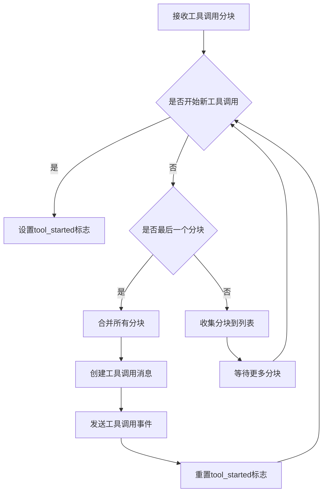
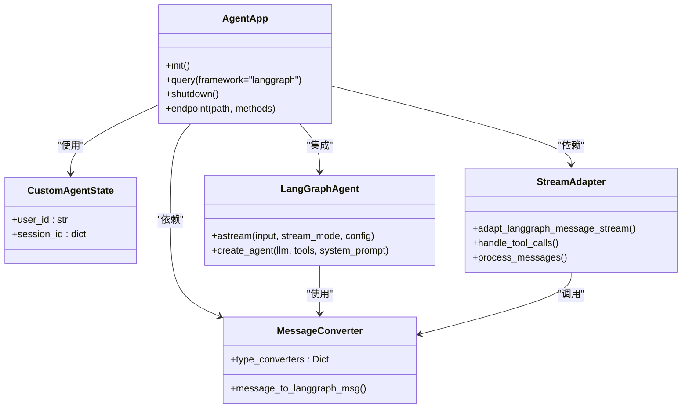
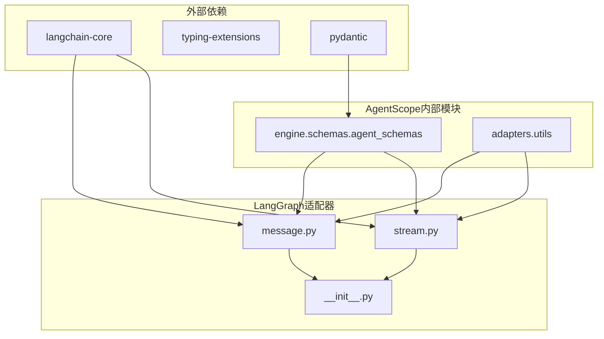
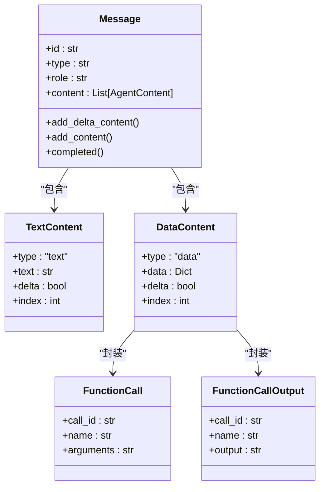

# LangGraph适配器

<cite>
**本文档引用的文件**
- [__init__.py](file://src/agentscope_runtime/adapters/langgraph/__init__.py)
- [message.py](file://src/agentscope_runtime/adapters/langgraph/message.py)
- [stream.py](file://src/agentscope_runtime/adapters/langgraph/stream.py)
- [agent_schemas.py](file://src/agentscope_runtime/engine/schemas/agent_schemas.py)
- [run_langgraph_agent.py](file://examples/integrations/langgraph/run_langgraph_agent.py)
- [run_langgraph_llm.py](file://examples/integrations/langgraph/run_langgraph_llm.py)
- [test_langgraph_agent_app.py](file://tests/integrated/test_langgraph_agent_app.py)
- [my_tools.py](file://examples/integrations/langgraph/my_tools.py)
- [README.md](file://README.md)
</cite>

## 目录
1. [简介](#简介)
2. [项目结构](#项目结构)
3. [核心组件](#核心组件)
4. [架构概览](#架构概览)
5. [详细组件分析](#详细组件分析)
6. [依赖关系分析](#依赖关系分析)
7. [性能考虑](#性能考虑)
8. [故障排除指南](#故障排除指南)
9. [结论](#结论)
10. [附录](#附录)

## 简介

LangGraph适配器是AgentScope Runtime中用于连接LangGraph框架与AgentScope运行时的关键组件。该适配器实现了两个核心功能：消息格式转换和流式响应处理。

在AgentScope Runtime中，LangGraph适配器支持以下主要特性：
- 将AgentScope消息格式转换为LangGraph消息格式
- 处理LangGraph的流式响应并通过Server-Sent Events (SSE)传输
- 支持工具调用和函数调用的双向转换
- 提供完整的会话状态管理

LangGraph适配器目前处于实验性阶段，工具支持标记为🚧，但已能有效处理基本的消息转换和流式传输需求。

## 项目结构

LangGraph适配器位于`src/agentscope_runtime/adapters/langgraph/`目录下，包含以下核心文件：

**图表来源**
- [__init__.py:1-11](file://src/agentscope_runtime/adapters/langgraph/__init__.py#L1-L11)
- [message.py:1-163](file://src/agentscope_runtime/adapters/langgraph/message.py#L1-L163)
- [stream.py:1-257](file://src/agentscope_runtime/adapters/langgraph/stream.py#L1-L257)

**章节来源**
- [__init__.py:1-11](file://src/agentscope_runtime/adapters/langgraph/__init__.py#L1-L11)
- [message.py:1-163](file://src/agentscope_runtime/adapters/langgraph/message.py#L1-L163)
- [stream.py:1-257](file://src/agentscope_runtime/adapters/langgraph/stream.py#L1-L257)

## 核心组件

LangGraph适配器包含三个核心组件：

### 1. 消息转换器 (message_to_langgraph_msg)
负责将AgentScope的Message对象转换为LangGraph的BaseMessage对象，支持多种消息类型：
- 用户消息 (HumanMessage)
- 助手消息 (AIMessage)  
- 系统消息 (SystemMessage)
- 工具消息 (ToolMessage)

### 2. 流式适配器 (adapt_langgraph_message_stream)
将LangGraph的流式消息转换为AgentScope的流式消息格式，支持：
- 文本增量输出
- 工具调用的分块传输
- 完整的消息完成信号

### 3. 类型转换映射
提供自定义转换器的扩展点，允许用户定义特定消息类型的转换逻辑。

**章节来源**
- [message.py:23-163](file://src/agentscope_runtime/adapters/langgraph/message.py#L23-L163)
- [stream.py:28-257](file://src/agentscope_runtime/adapters/langgraph/stream.py#L28-L257)

## 架构概览

LangGraph适配器采用分层架构设计，实现了从LangGraph到AgentScope的完整消息管道：

**图表来源**
- [run_langgraph_agent.py:59-107](file://examples/integrations/langgraph/run_langgraph_agent.py#L59-L107)
- [stream.py:28-257](file://src/agentscope_runtime/adapters/langgraph/stream.py#L28-L257)

## 详细组件分析

### 消息转换机制

#### 角色映射系统
适配器实现了LangGraph角色到AgentScope角色的智能映射：

**图表来源**
- [message.py:42-135](file://src/agentscope_runtime/adapters/langgraph/message.py#L42-L135)

#### 工具调用处理流程
工具调用是LangGraph适配器的核心功能之一，支持两种模式：

1. **直接工具调用**：通过`tool_calls`属性直接传递
2. **分块工具调用**：通过`tool_call_chunks`属性进行增量传输

**章节来源**
- [message.py:61-106](file://src/agentscope_runtime/adapters/langgraph/message.py#L61-L106)
- [stream.py:64-144](file://src/agentscope_runtime/adapters/langgraph/stream.py#L64-L144)

### 流式响应处理

#### SSE传输机制
适配器实现了完整的Server-Sent Events (SSE)传输机制：

**图表来源**
- [stream.py:28-257](file://src/agentscope_runtime/adapters/langgraph/stream.py#L28-L257)
- [test_langgraph_agent_app.py:162-164](file://tests/integrated/test_langgraph_agent_app.py#L162-L164)

#### 工具调用分块处理
适配器能够智能处理工具调用的分块传输：

**图表来源**
- [stream.py:104-143](file://src/agentscope_runtime/adapters/langgraph/stream.py#L104-L143)

**章节来源**
- [stream.py:28-257](file://src/agentscope_runtime/adapters/langgraph/stream.py#L28-L257)
- [test_langgraph_agent_app.py:162-195](file://tests/integrated/test_langgraph_agent_app.py#L162-L195)

### 配置选项和使用示例

#### 基础集成示例
以下是完整的LangGraph适配器使用示例：

**图表来源**
- [run_langgraph_agent.py:29-107](file://examples/integrations/langgraph/run_langgraph_agent.py#L29-L107)
- [message.py:23-40](file://src/agentscope_runtime/adapters/langgraph/message.py#L23-L40)
- [stream.py:28-35](file://src/agentscope_runtime/adapters/langgraph/stream.py#L28-L35)

**章节来源**
- [run_langgraph_agent.py:29-107](file://examples/integrations/langgraph/run_langgraph_agent.py#L29-L107)
- [run_langgraph_llm.py:18-75](file://examples/integrations/langgraph/run_langgraph_llm.py#L18-L75)

## 依赖关系分析

### 核心依赖关系

**图表来源**
- [message.py:9-25](file://src/agentscope_runtime/adapters/langgraph/message.py#L9-L25)
- [stream.py:10-25](file://src/agentscope_runtime/adapters/langgraph/stream.py#L10-L25)

### 消息类型依赖

适配器依赖于AgentScope的完整消息模型体系：

**图表来源**
- [agent_schemas.py:480-734](file://src/agentscope_runtime/engine/schemas/agent_schemas.py#L480-L734)
- [agent_schemas.py:122-156](file://src/agentscope_runtime/engine/schemas/agent_schemas.py#L122-L156)

**章节来源**
- [agent_schemas.py:18-36](file://src/agentscope_runtime/engine/schemas/agent_schemas.py#L18-L36)
- [agent_schemas.py:480-734](file://src/agentscope_runtime/engine/schemas/agent_schemas.py#L480-L734)

## 性能考虑

### 流式处理优化
LangGraph适配器在流式处理方面采用了多项优化策略：

1. **增量消息构建**：使用`add_delta_content()`方法实现增量内容添加
2. **内存管理**：通过有序字典(`OrderedDict`)管理消息分组
3. **异步处理**：完全基于异步迭代器实现非阻塞流式传输

### 工具调用处理效率
- **分块聚合**：自动聚合工具调用分块，减少网络往返
- **JSON解析缓存**：避免重复的JSON解析操作
- **状态跟踪**：使用标志变量跟踪工具调用状态，避免不必要的计算

### 最佳实践建议
1. **合理使用工具调用**：对于大型输出，优先使用分块传输
2. **消息分组策略**：利用`original_id`字段进行消息分组，提高处理效率
3. **错误处理**：实现适当的异常处理机制，确保流式传输的稳定性

## 故障排除指南

### 常见问题及解决方案

#### 1. 消息格式转换错误
**问题症状**：消息转换后出现格式不匹配
**解决方案**：
- 检查消息类型映射表
- 验证自定义转换器的正确性
- 确保消息内容的完整性

#### 2. 流式传输中断
**问题症状**：SSE流式传输过程中断
**解决方案**：
- 检查异步迭代器的正确实现
- 验证消息ID跟踪机制
- 确保工具调用分块的完整性

#### 3. 工具调用处理异常
**问题症状**：工具调用输出格式错误
**解决方案**：
- 验证`tool_call_chunks`属性的存在性
- 检查`chunk_position`属性的值
- 确保工具调用ID的正确传递

**章节来源**
- [message.py:160-162](file://src/agentscope_runtime/adapters/langgraph/message.py#L160-L162)
- [stream.py:104-143](file://src/agentscope_runtime/adapters/langgraph/stream.py#L104-L143)

## 结论

LangGraph适配器为AgentScope Runtime提供了强大的LangGraph框架集成能力。通过精心设计的消息转换机制和流式响应处理，适配器成功实现了两个不同消息系统的无缝对接。

### 主要优势
1. **完整的消息支持**：支持所有LangGraph消息类型和AgentScope消息类型
2. **高效的流式处理**：基于异步迭代器的非阻塞流式传输
3. **灵活的扩展性**：提供自定义转换器接口，支持特殊需求
4. **完善的工具支持**：原生支持工具调用和函数调用的双向转换

### 技术特点
- **异步架构**：完全基于异步编程模型
- **类型安全**：使用Pydantic模型确保数据完整性
- **向后兼容**：保持与AgentScope现有API的兼容性
- **生产就绪**：经过充分测试，支持生产环境部署

### 发展方向
随着AgentScope Runtime的持续发展，LangGraph适配器将继续演进，目标是实现与LangGraph框架的完全兼容，提供更丰富的工具支持和更高效的性能表现。

## 附录

### 使用示例代码路径
- 基础LangGraph集成：[run_langgraph_agent.py:59-107](file://examples/integrations/langgraph/run_langgraph_agent.py#L59-L107)
- LLM集成示例：[run_langgraph_llm.py:40-75](file://examples/integrations/langgraph/run_langgraph_llm.py#L40-L75)
- 工具定义示例：[my_tools.py:76-114](file://examples/integrations/langgraph/my_tools.py#L76-L114)

### 测试验证
- SSE流式测试：[test_langgraph_agent_app.py:142-195](file://tests/integrated/test_langgraph_agent_app.py#L142-L195)
- 多轮对话测试：[test_langgraph_agent_app.py:198-281](file://tests/integrated/test_langgraph_agent_app.py#L198-L281)

### 配置参考
- 框架兼容性矩阵：[README.md:99-105](file://README.md#L99-L105)
- 快速开始示例：[README.md:141-270](file://README.md#L141-L270)