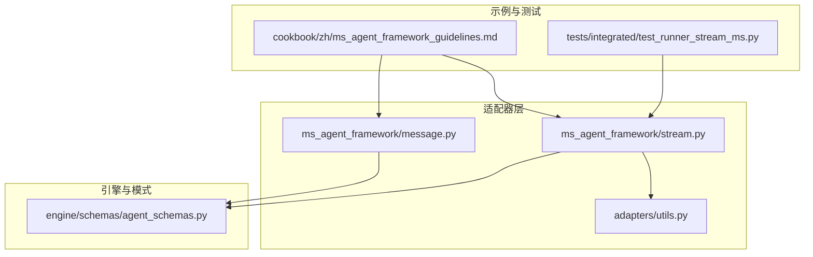
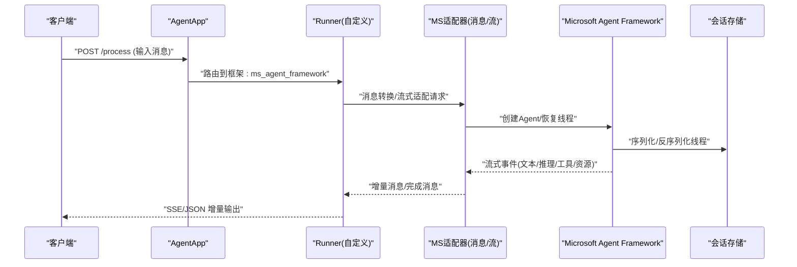
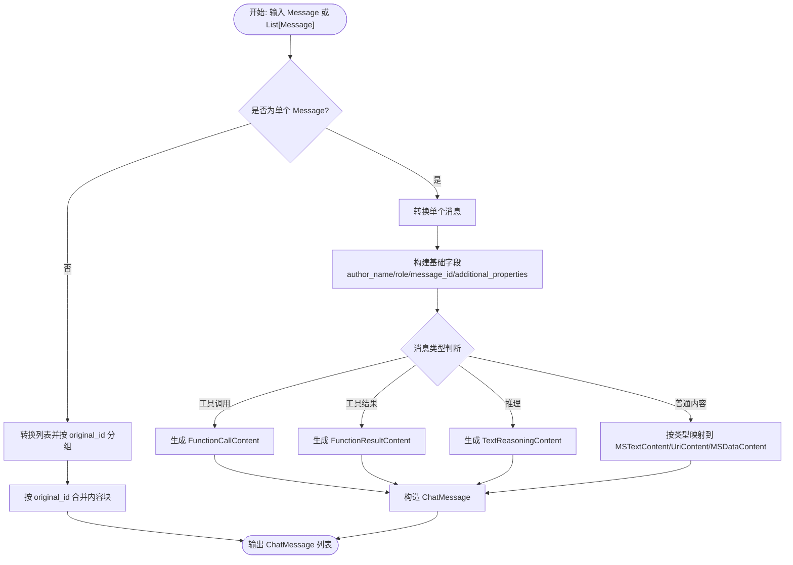
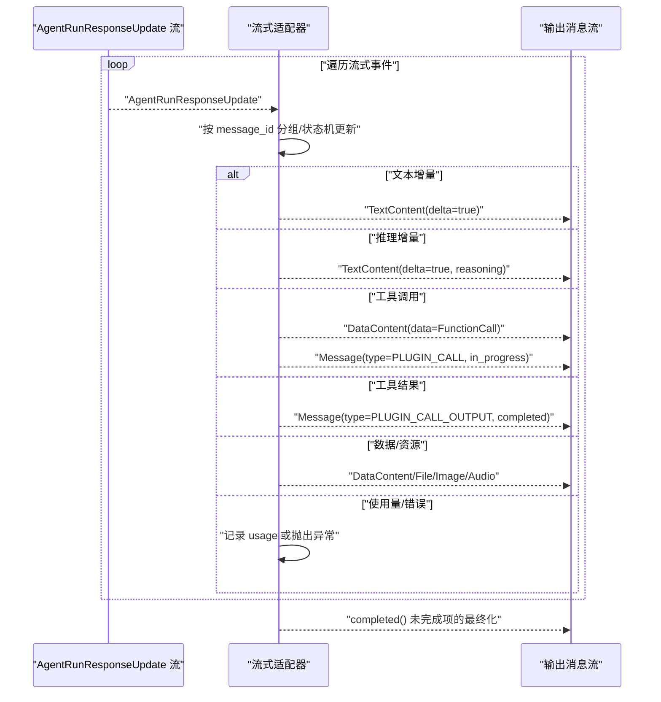
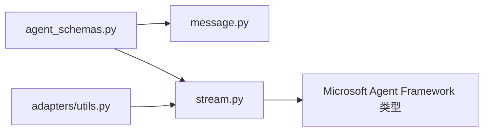

# MS Agent Framework适配器

<cite>
**本文档引用的文件**
- [message.py](file://src/agentscope_runtime/adapters/ms_agent_framework/message.py)
- [stream.py](file://src/agentscope_runtime/adapters/ms_agent_framework/stream.py)
- [agent_schemas.py](file://src/agentscope_runtime/engine/schemas/agent_schemas.py)
- [utils.py](file://src/agentscope_runtime/adapters/utils.py)
- [ms_agent_framework_guidelines.md](file://cookbook/zh/ms_agent_framework_guidelines.md)
- [test_runner_stream_ms.py](file://tests/integrated/test_runner_stream_ms.py)
</cite>

## 目录
1. [简介](#简介)
2. [项目结构](#项目结构)
3. [核心组件](#核心组件)
4. [架构总览](#架构总览)
5. [详细组件分析](#详细组件分析)
6. [依赖关系分析](#依赖关系分析)
7. [性能考虑](#性能考虑)
8. [故障排除指南](#故障排除指南)
9. [结论](#结论)
10. [附录](#附录)

## 简介
本文件面向需要在 AgentScope Runtime 中集成 Microsoft Agent Framework 的开发者，系统性阐述 MS Agent Framework 适配器的消息转换机制与流式处理实现。内容涵盖：
- 将 AgentScope 的消息格式转换为 Microsoft Agent Framework 消息格式的完整流程
- 代理状态管理与对话历史处理策略
- Microsoft 框架特有消息类型的识别与参数映射
- 适配器的配置选项与使用示例
- 与 Azure AI 服务的集成方法与认证处理建议
- 面向开发者的实践指导与最佳实践

## 项目结构
MS Agent Framework 适配器位于适配器目录下，核心文件包括消息转换模块与流式处理模块，二者分别负责离线消息格式转换与在线流式事件转换。

**图表来源**
- [message.py:1-216](file://src/agentscope_runtime/adapters/ms_agent_framework/message.py#L1-L216)
- [stream.py:1-420](file://src/agentscope_runtime/adapters/ms_agent_framework/stream.py#L1-L420)
- [agent_schemas.py:1-200](file://src/agentscope_runtime/engine/schemas/agent_schemas.py#L1-L200)
- [utils.py:1-7](file://src/agentscope_runtime/adapters/utils.py#L1-L7)
- [ms_agent_framework_guidelines.md:1-183](file://cookbook/zh/ms_agent_framework_guidelines.md#L1-L183)
- [test_runner_stream_ms.py:1-214](file://tests/integrated/test_runner_stream_ms.py#L1-L214)

**章节来源**
- [message.py:1-216](file://src/agentscope_runtime/adapters/ms_agent_framework/message.py#L1-L216)
- [stream.py:1-420](file://src/agentscope_runtime/adapters/ms_agent_framework/stream.py#L1-L420)
- [agent_schemas.py:1-200](file://src/agentscope_runtime/engine/schemas/agent_schemas.py#L1-L200)
- [utils.py:1-7](file://src/agentscope_runtime/adapters/utils.py#L1-L7)
- [ms_agent_framework_guidelines.md:1-183](file://cookbook/zh/ms_agent_framework_guidelines.md#L1-L183)
- [test_runner_stream_ms.py:1-214](file://tests/integrated/test_runner_stream_ms.py#L1-L214)

## 核心组件
- 消息转换器：将 AgentScope 的 Message/Content 结构转换为 Microsoft Agent Framework 的 ChatMessage/Contents 结构，支持文本、图像、音频、数据、推理等类型，并对工具调用与结果进行特殊处理。
- 流式适配器：将 Microsoft Agent Framework 的流式更新事件转换为 AgentScope 的增量消息流，支持文本增量、推理增量、工具调用、工具结果以及资源链接等类型。
- 工具函数：提供对象属性更新能力，用于在流式过程中附加使用量统计等元信息。

关键职责与边界：
- 转换器负责“离线”批量消息的格式映射与分组，确保原始消息 ID 与作者名等元信息在转换后得以保留。
- 流式适配器负责“在线”增量事件的解析与聚合，按消息 ID 分组并产出完整的 Message 对象。

**章节来源**
- [message.py:23-216](file://src/agentscope_runtime/adapters/ms_agent_framework/message.py#L23-L216)
- [stream.py:36-420](file://src/agentscope_runtime/adapters/ms_agent_framework/stream.py#L36-L420)
- [utils.py:2-6](file://src/agentscope_runtime/adapters/utils.py#L2-L6)

## 架构总览
MS Agent Framework 适配器在 AgentScope Runtime 中的定位如下：

**图表来源**
- [test_runner_stream_ms.py:17-91](file://tests/integrated/test_runner_stream_ms.py#L17-L91)
- [stream.py:36-420](file://src/agentscope_runtime/adapters/ms_agent_framework/stream.py#L36-L420)
- [ms_agent_framework_guidelines.md:46-101](file://cookbook/zh/ms_agent_framework_guidelines.md#L46-L101)

## 详细组件分析

### 组件A：消息转换器（AgentScope → Microsoft Agent Framework）
职责概述：
- 接收单个或多个 AgentScope Message
- 将角色、作者名、消息 ID、附加属性从元数据中提取并写入 Microsoft ChatMessage
- 根据内容类型映射到 Microsoft 的内容块（文本、URI、数据、推理、工具调用/结果）
- 对工具调用与结果进行特殊处理，确保 call_id 与参数正确传递
- 支持自定义转换器映射，允许按消息类型覆盖默认转换逻辑
- 对列表输入进行按原始 ID 分组合并，保证多轮对话的连贯性

**图表来源**
- [message.py:23-216](file://src/agentscope_runtime/adapters/ms_agent_framework/message.py#L23-L216)

关键实现要点：
- 元数据优先：当存在 original_id/original_name/metadata 时，优先使用原始值以保持跨系统一致性。
- 类型映射：文本、图像、音频、数据、文件分别映射到 MSTextContent、UriContent、MSDataContent 等；视频类型当前未实现。
- 工具调用：从内容块的 data.arguments 中解析参数，若为字符串则尝试 JSON 解析；若为空则回退为空字典。
- 工具结果：从内容块的 data.output 中解析输出，若为非字符串则转为字符串或 JSON 字符串。
- 列表分组：将同一原始消息 ID 的多个内容块合并到一个 ChatMessage 中，确保对话连贯。

**章节来源**
- [message.py:23-216](file://src/agentscope_runtime/adapters/ms_agent_framework/message.py#L23-L216)

### 组件B：流式适配器（Microsoft Agent Framework → AgentScope）
职责概述：
- 接收 Microsoft Agent Framework 的流式更新事件
- 按消息 ID 分组，维护文本增量、数据增量、工具调用、工具结果等状态
- 将增量内容聚合为 AgentScope 的 Message/Content，并在必要时发出“进行中/已完成”的状态变更
- 处理使用量统计、错误事件与资源链接（图像/音频/文件）

**图表来源**
- [stream.py:36-420](file://src/agentscope_runtime/adapters/ms_agent_framework/stream.py#L36-L420)

关键实现要点：
- 状态机：维护 text_delta_content、data_delta_content、message、reasoning_message、plugin_call_message 等状态，确保按消息 ID 正确聚合。
- 工具调用处理：区分首次调用与后续增量，首次调用时创建进行中消息，后续增量直接追加到 DataContent。
- 工具结果处理：将结果封装为 FunctionCallOutput 并以 PLUGIN_CALL_OUTPUT 消息形式一次性输出。
- 资源类型：根据类型自动选择 ImageContent/AudioContent/FileContent，并填充相应字段。
- 错误处理：遇到 ErrorContent 时抛出运行时异常，便于上层统一处理。

**章节来源**
- [stream.py:36-420](file://src/agentscope_runtime/adapters/ms_agent_framework/stream.py#L36-L420)

### 组件C：工具函数（对象属性更新）
职责概述：
- 在不破坏对象结构的前提下，动态更新对象的属性（如 usage），用于在流式过程中附加统计信息。

**章节来源**
- [utils.py:2-6](file://src/agentscope_runtime/adapters/utils.py#L2-L6)

## 依赖关系分析
- 适配器依赖 AgentScope 的消息与内容模型（Message、Content、MessageType 等）。
- 流式适配器依赖 Microsoft Agent Framework 的 AgentRunResponseUpdate 与内容块类型（文本、URI、数据、推理、工具调用/结果、错误、用量）。
- 工具函数被流式适配器用于更新对象属性。

**图表来源**
- [agent_schemas.py:18-36](file://src/agentscope_runtime/engine/schemas/agent_schemas.py#L18-L36)
- [message.py:17-33](file://src/agentscope_runtime/adapters/ms_agent_framework/message.py#L17-L33)
- [stream.py:20-33](file://src/agentscope_runtime/adapters/ms_agent_framework/stream.py#L20-L33)
- [utils.py:2-6](file://src/agentscope_runtime/adapters/utils.py#L2-L6)

**章节来源**
- [agent_schemas.py:1-200](file://src/agentscope_runtime/engine/schemas/agent_schemas.py#L1-L200)
- [message.py:1-33](file://src/agentscope_runtime/adapters/ms_agent_framework/message.py#L1-L33)
- [stream.py:1-33](file://src/agentscope_runtime/adapters/ms_agent_framework/stream.py#L1-L33)
- [utils.py:1-7](file://src/agentscope_runtime/adapters/utils.py#L1-L7)

## 性能考虑
- 流式处理的内存占用：流式适配器在内存中维护多个增量对象，建议在高并发场景下限制每条会话的增量长度或定期清理已完成的消息。
- JSON 解析开销：消息转换器对字符串参数尝试 JSON 解析，建议在上游尽量提供结构化数据以减少解析失败与回退成本。
- 分组与去重：列表转换阶段按 original_id 合并内容块，避免重复消息导致的渲染与存储开销。
- 错误早发现：流式适配器遇到错误内容即抛出异常，有助于快速定位问题，但需在上层做好异常捕获与降级处理。

## 故障排除指南
常见问题与排查步骤：
- 工具调用参数为空：检查上游是否提供了正确的 arguments 字段；若为字符串，确认其为合法 JSON。
- 工具结果输出异常：确认输出为可序列化对象，若为复杂对象，确保能被 JSON 序列化。
- 资源类型不匹配：当前视频类型尚未实现，遇到 video 类型时请暂时降级为图片或文件类型。
- 流式中断：若出现中途无输出或阻塞，检查消息 ID 是否一致以及是否有遗漏的工具调用结束标记。
- 错误事件：遇到 ErrorContent 时，适配器会抛出运行时异常，需在上层捕获并记录详细信息。

**章节来源**
- [stream.py:369-375](file://src/agentscope_runtime/adapters/ms_agent_framework/stream.py#L369-L375)
- [message.py:89-117](file://src/agentscope_runtime/adapters/ms_agent_framework/message.py#L89-L117)

## 结论
MS Agent Framework 适配器通过消息转换器与流式适配器实现了 AgentScope 与 Microsoft Agent Framework 的双向桥接，支持多轮对话、会话记忆、工具调用与资源传输，并提供稳健的流式输出能力。结合示例与测试用例，开发者可快速完成集成与定制。

## 附录

### 配置选项与使用示例
- 运行示例与 OpenAI 兼容模式：参考示例脚本与文档，设置 API Key 与兼容模式端点。
- 会话存储：示例中使用内存存储进行线程序列化/反序列化，生产环境建议替换为持久化存储。
- 模型与客户端：示例使用 DashScope 的 Qwen 模型，可通过替换模型 ID 与 base_url 切换至其他提供商。

**章节来源**
- [ms_agent_framework_guidelines.md:108-183](file://cookbook/zh/ms_agent_framework_guidelines.md#L108-L183)
- [test_runner_stream_ms.py:17-91](file://tests/integrated/test_runner_stream_ms.py#L17-L91)

### 与 Azure AI 服务的集成方法与认证处理
- 认证：通过环境变量或配置文件注入 API Key；在兼容模式下，将 base_url 指向 Azure AI 服务提供的兼容端点。
- 模型切换：根据 Azure 支持的模型列表调整模型 ID，并在客户端初始化时传入相应的 base_url 与认证参数。
- 错误处理：Azure 服务可能返回特定的错误码与详情，建议在上层统一捕获并映射为标准异常以便适配器处理。

**章节来源**
- [ms_agent_framework_guidelines.md:120-124](file://cookbook/zh/ms_agent_framework_guidelines.md#L120-L124)
- [ms_agent_framework_guidelines.md:158-170](file://cookbook/zh/ms_agent_framework_guidelines.md#L158-L170)