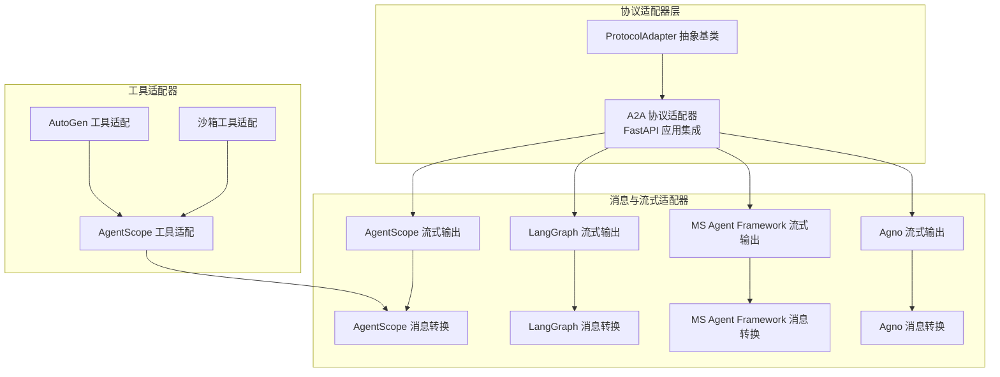
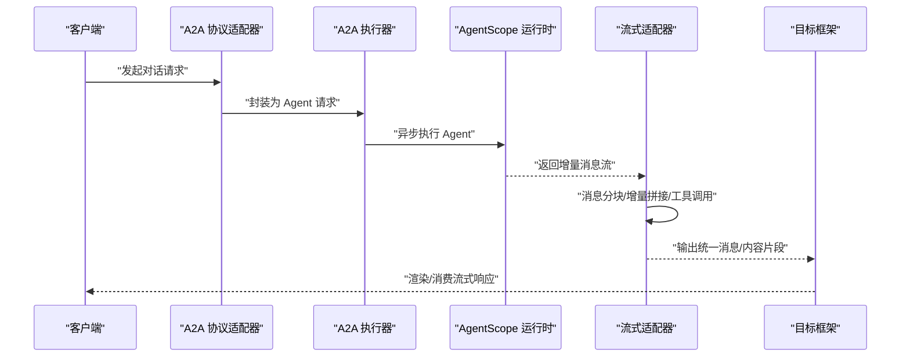
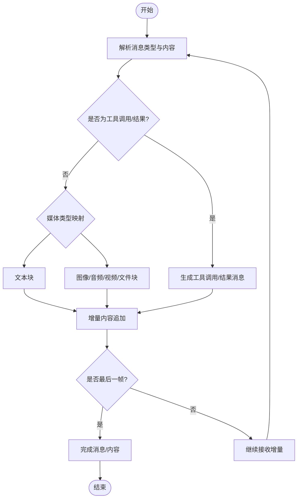
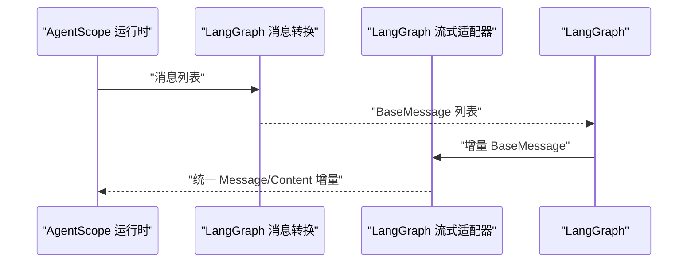
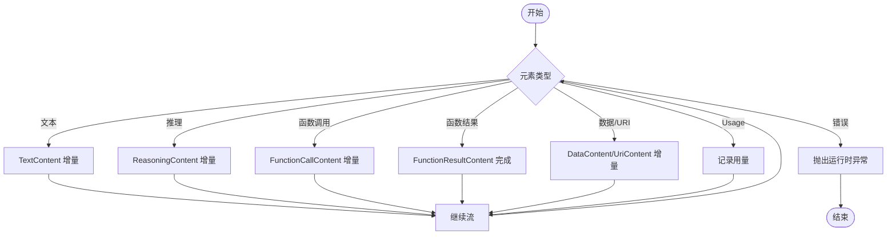
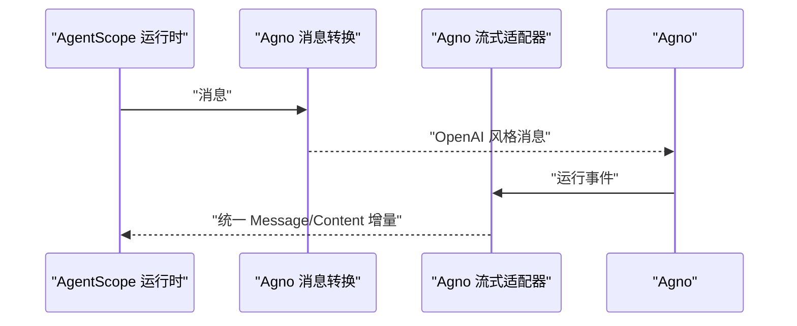
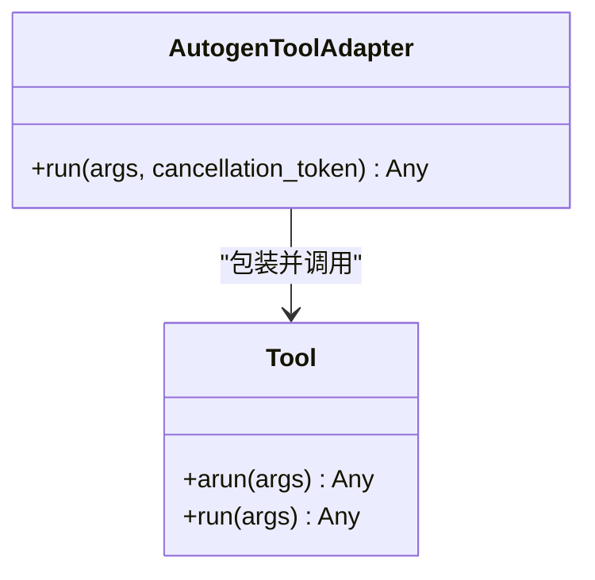
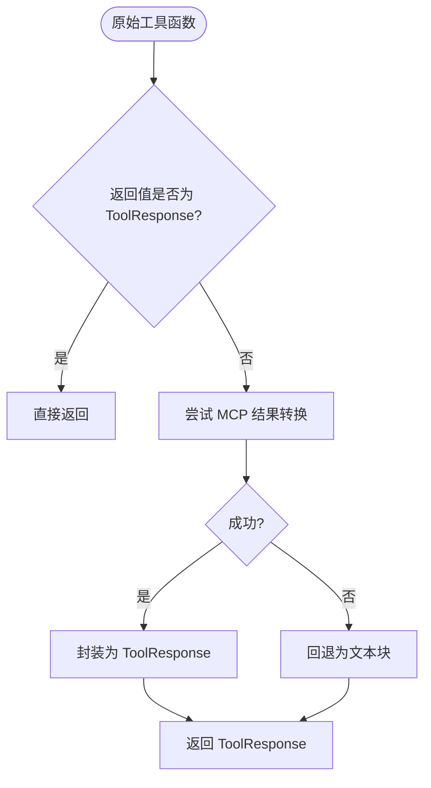
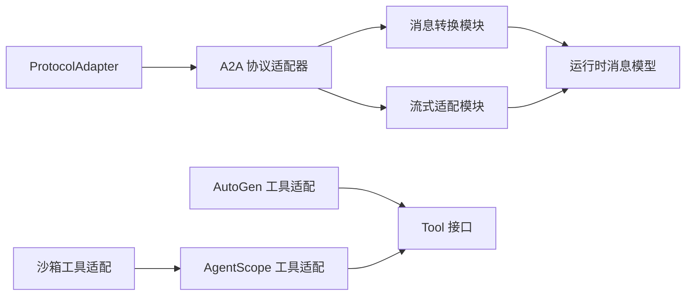

# 协议适配器机制

<cite>
**本文引用的文件**
- [adapters/utils.py](file://src/agentscope_runtime/adapters/utils.py)
- [engine/deployers/adapter/protocol_adapter.py](file://src/agentscope_runtime/engine/deployers/adapter/protocol_adapter.py)
- [engine/deployers/adapter/a2a/a2a_protocol_adapter.py](file://src/agentscope_runtime/engine/deployers/adapter/a2a/a2a_protocol_adapter.py)
- [engine/deployers/adapter/a2a/a2a_agent_adapter.py](file://src/agentscope_runtime/engine/deployers/adapter/a2a/a2a_agent_adapter.py)
- [adapters/agentscope/message.py](file://src/agentscope_runtime/adapters/agentscope/message.py)
- [adapters/agentscope/stream.py](file://src/agentscope_runtime/adapters/agentscope/stream.py)
- [adapters/langgraph/message.py](file://src/agentscope_runtime/adapters/langgraph/message.py)
- [adapters/langgraph/stream.py](file://src/agentscope_runtime/adapters/langgraph/stream.py)
- [adapters/ms_agent_framework/message.py](file://src/agentscope_runtime/adapters/ms_agent_framework/message.py)
- [adapters/ms_agent_framework/stream.py](file://src/agentscope_runtime/adapters/ms_agent_framework/stream.py)
- [adapters/agno/message.py](file://src/agentscope_runtime/adapters/agno/message.py)
- [adapters/agno/stream.py](file://src/agentscope_runtime/adapters/agno/stream.py)
- [adapters/autogen/tool/tool.py](file://src/agentscope_runtime/adapters/autogen/tool/tool.py)
- [adapters/agentscope/tool/tool.py](file://src/agentscope_runtime/adapters/agentscope/tool/tool.py)
- [adapters/agentscope/tool/sandbox_tool.py](file://src/agentscope_runtime/adapters/agentscope/tool/sandbox_tool.py)
</cite>

## 目录
1. [引言](#引言)
2. [项目结构](#项目结构)
3. [核心组件](#核心组件)
4. [架构总览](#架构总览)
5. [详细组件分析](#详细组件分析)
6. [依赖分析](#依赖分析)
7. [性能考量](#性能考量)
8. [故障排查指南](#故障排查指南)
9. [结论](#结论)
10. [附录：适配器开发与自定义示例](#附录适配器开发与自定义示例)

## 引言
本文件系统化阐述 agentscope-runtime 的“协议适配器机制”，聚焦于如何在统一的运行时消息模型与流式接口之上，实现对多框架（AgentScope、LangGraph、MS Agent Framework、Agno、AutoGen 等）的协议桥接。文档涵盖：
- 适配器系统的设计架构与多框架兼容原理
- 各类协议适配器（AgentScope 适配器、LangGraph 适配器、MS Agent Framework 适配器、Agno 适配器、AutoGen 适配器）的工作原理与使用方法
- 消息转换、工具包装与流式处理机制
- 适配器开发指南与自定义适配器实现示例
- 性能优化建议与调试技巧

## 项目结构
协议适配器相关代码主要分布在以下位置：
- 顶层协议适配器基类与 A2A 协议适配器：engine/deployers/adapter
- 各框架的消息转换与流式适配器：adapters/<framework>/
- 工具包装与沙箱工具适配：adapters/*/tool/

图表来源
- [engine/deployers/adapter/protocol_adapter.py:1-25](file://src/agentscope_runtime/engine/deployers/adapter/protocol_adapter.py#L1-L25)
- [engine/deployers/adapter/a2a/a2a_protocol_adapter.py:136-498](file://src/agentscope_runtime/engine/deployers/adapter/a2a/a2a_protocol_adapter.py#L136-L498)
- [adapters/agentscope/stream.py:33-684](file://src/agentscope_runtime/adapters/agentscope/stream.py#L33-L684)
- [adapters/langgraph/stream.py:28-257](file://src/agentscope_runtime/adapters/langgraph/stream.py#L28-L257)
- [adapters/ms_agent_framework/stream.py:36-420](file://src/agentscope_runtime/adapters/ms_agent_framework/stream.py#L36-L420)
- [adapters/agno/stream.py:32-124](file://src/agentscope_runtime/adapters/agno/stream.py#L32-L124)

章节来源
- [engine/deployers/adapter/protocol_adapter.py:1-25](file://src/agentscope_runtime/engine/deployers/adapter/protocol_adapter.py#L1-L25)
- [engine/deployers/adapter/a2a/a2a_protocol_adapter.py:136-498](file://src/agentscope_runtime/engine/deployers/adapter/a2a/a2a_protocol_adapter.py#L136-L498)

## 核心组件
- 协议适配器抽象基类：定义统一的 add_endpoint 接口，用于向具体 Web 框架（如 FastAPI）注册协议端点。
- A2A 协议适配器：基于 a2a-server 提供 AgentCard、任务管理、Well-Known 端点与传输配置，支持服务发现注册。
- 各框架消息与流式适配器：负责将 AgentScope 运行时消息模型转换为各框架的消息类型，并支持增量流式输出。
- 工具适配器：将 agentscope-runtime 的 Tool 包装为 AutoGen 或 AgentScope 的工具接口，保证参数校验、异步执行与结果格式化。

章节来源
- [engine/deployers/adapter/protocol_adapter.py:6-25](file://src/agentscope_runtime/engine/deployers/adapter/protocol_adapter.py#L6-L25)
- [engine/deployers/adapter/a2a/a2a_protocol_adapter.py:136-498](file://src/agentscope_runtime/engine/deployers/adapter/a2a/a2a_protocol_adapter.py#L136-L498)
- [adapters/agentscope/message.py:53-394](file://src/agentscope_runtime/adapters/agentscope/message.py#L53-L394)
- [adapters/agentscope/stream.py:33-684](file://src/agentscope_runtime/adapters/agentscope/stream.py#L33-L684)
- [adapters/autogen/tool/tool.py:28-212](file://src/agentscope_runtime/adapters/autogen/tool/tool.py#L28-L212)
- [adapters/agentscope/tool/tool.py:17-232](file://src/agentscope_runtime/adapters/agentscope/tool/tool.py#L17-L232)

## 架构总览
下图展示了从 A2A 协议适配器到各框架流式输出的整体调用链路与数据转换：

图表来源
- [engine/deployers/adapter/a2a/a2a_protocol_adapter.py:222-258](file://src/agentscope_runtime/engine/deployers/adapter/a2a/a2a_protocol_adapter.py#L222-L258)
- [engine/deployers/adapter/a2a/a2a_agent_adapter.py:27-70](file://src/agentscope_runtime/engine/deployers/adapter/a2a/a2a_agent_adapter.py#L27-L70)
- [adapters/agentscope/stream.py:33-684](file://src/agentscope_runtime/adapters/agentscope/stream.py#L33-L684)

## 详细组件分析

### AgentScope 适配器
- 消息转换：将 AgentScope 运行时消息转换为 AgentScope 的 Msg 对象，支持文本、图像、音频、视频、文件、思维、工具调用与结果等类型；可按类型映射或自定义转换器处理。
- 流式输出：将 AgentScope 的增量消息流转换为统一的 Message/Content 增量事件，支持文本增量、思维增量、工具调用与结果的分片输出，并在最后完成消息与内容的收尾。

图表来源
- [adapters/agentscope/message.py:53-394](file://src/agentscope_runtime/adapters/agentscope/message.py#L53-L394)
- [adapters/agentscope/stream.py:33-684](file://src/agentscope_runtime/adapters/agentscope/stream.py#L33-L684)

章节来源
- [adapters/agentscope/message.py:53-394](file://src/agentscope_runtime/adapters/agentscope/message.py#L53-L394)
- [adapters/agentscope/stream.py:33-684](file://src/agentscope_runtime/adapters/agentscope/stream.py#L33-L684)

### LangGraph 适配器
- 消息转换：将 AgentScope 运行时消息转换为 LangGraph 的 BaseMessage（Human/AI/System/Tool），支持工具调用与工具结果的双向转换。
- 流式输出：根据 LangGraph 的消息角色与工具调用片段，生成统一的 Message/Content 增量事件，处理工具调用的 chunk 场景与最终合并。

图表来源
- [adapters/langgraph/message.py:23-163](file://src/agentscope_runtime/adapters/langgraph/message.py#L23-L163)
- [adapters/langgraph/stream.py:28-257](file://src/agentscope_runtime/adapters/langgraph/stream.py#L28-L257)

章节来源
- [adapters/langgraph/message.py:23-163](file://src/agentscope_runtime/adapters/langgraph/message.py#L23-L163)
- [adapters/langgraph/stream.py:28-257](file://src/agentscope_runtime/adapters/langgraph/stream.py#L28-L257)

### MS Agent Framework 适配器
- 消息转换：将 AgentScope 运行时消息转换为 Microsoft Agent Framework 的 ChatMessage，支持文本、URI 内容、函数调用与结果、推理内容等。
- 流式输出：将框架的 AgentRunResponseUpdate 流转换为统一的 Message/Content 增量事件，处理 Usage、错误内容与媒体类型映射。

图表来源
- [adapters/ms_agent_framework/message.py:23-216](file://src/agentscope_runtime/adapters/ms_agent_framework/message.py#L23-L216)
- [adapters/ms_agent_framework/stream.py:36-420](file://src/agentscope_runtime/adapters/ms_agent_framework/stream.py#L36-L420)

章节来源
- [adapters/ms_agent_framework/message.py:23-216](file://src/agentscope_runtime/adapters/ms_agent_framework/message.py#L23-L216)
- [adapters/ms_agent_framework/stream.py:36-420](file://src/agentscope_runtime/adapters/ms_agent_framework/stream.py#L36-L420)

### Agno 适配器
- 消息转换：将 AgentScope 运行时消息转换为 OpenAI 风格的聊天消息，便于与 Agno 的运行时交互。
- 流式输出：将 Agno 的运行事件转换为统一的 Message/Content 增量事件，支持推理内容与工具调用/结果的完成事件。

图表来源
- [adapters/agno/message.py:10-40](file://src/agentscope_runtime/adapters/agno/message.py#L10-L40)
- [adapters/agno/stream.py:32-124](file://src/agentscope_runtime/adapters/agno/stream.py#L32-L124)

章节来源
- [adapters/agno/message.py:10-40](file://src/agentscope_runtime/adapters/agno/message.py#L10-L40)
- [adapters/agno/stream.py:32-124](file://src/agentscope_runtime/adapters/agno/stream.py#L32-L124)

### AutoGen 适配器
- 工具适配：将 agentscope-runtime 的 Tool 包装为 AutoGen 的 BaseTool，自动推断输入/输出模式，支持同步与异步执行，并进行 JSON 序列化与错误包装。
- 工具包适配：批量创建 AutoGen 工具，支持名称与描述覆盖。

图表来源
- [adapters/autogen/tool/tool.py:28-212](file://src/agentscope_runtime/adapters/autogen/tool/tool.py#L28-L212)

章节来源
- [adapters/autogen/tool/tool.py:28-212](file://src/agentscope_runtime/adapters/autogen/tool/tool.py#L28-L212)

### AgentScope 工具适配与沙箱工具适配
- AgentScope 工具适配：将 agentscope-runtime 的 Tool 转换为 AgentScope 的 RegisteredToolFunction，自动进行输入校验、异步/同步执行与结果格式化。
- 沙箱工具适配：确保沙箱工具返回值被转换为 ToolResponse，优先尝试 MCP 结果转换，否则回退为文本块。

图表来源
- [adapters/agentscope/tool/sandbox_tool.py:15-70](file://src/agentscope_runtime/adapters/agentscope/tool/sandbox_tool.py#L15-L70)
- [adapters/agentscope/tool/tool.py:17-232](file://src/agentscope_runtime/adapters/agentscope/tool/tool.py#L17-L232)

章节来源
- [adapters/agentscope/tool/sandbox_tool.py:15-70](file://src/agentscope_runtime/adapters/agentscope/tool/sandbox_tool.py#L15-L70)
- [adapters/agentscope/tool/tool.py:17-232](file://src/agentscope_runtime/adapters/agentscope/tool/tool.py#L17-L232)

## 依赖分析
- 协议适配器抽象：所有具体协议适配器均继承自 ProtocolAdapter，统一 add_endpoint 接口，便于扩展新的协议。
- A2A 协议适配器：依赖 a2a-server 的 AgentCard、任务存储与 FastAPI 应用集成；支持可选的服务注册（Registry）。
- 消息与流式适配器：依赖运行时消息模型（Message/Content/MessageType），并通过类型转换器实现灵活扩展。
- 工具适配器：依赖 agentscope-runtime 的 Tool 接口与 AgentScope/AutoGen 的工具接口，实现跨框架的工具复用。

图表来源
- [engine/deployers/adapter/protocol_adapter.py:6-25](file://src/agentscope_runtime/engine/deployers/adapter/protocol_adapter.py#L6-L25)
- [engine/deployers/adapter/a2a/a2a_protocol_adapter.py:136-498](file://src/agentscope_runtime/engine/deployers/adapter/a2a/a2a_protocol_adapter.py#L136-L498)
- [adapters/autogen/tool/tool.py:28-212](file://src/agentscope_runtime/adapters/autogen/tool/tool.py#L28-L212)
- [adapters/agentscope/tool/tool.py:17-232](file://src/agentscope_runtime/adapters/agentscope/tool/tool.py#L17-L232)
- [adapters/agentscope/tool/sandbox_tool.py:15-70](file://src/agentscope_runtime/adapters/agentscope/tool/sandbox_tool.py#L15-L70)

章节来源
- [engine/deployers/adapter/protocol_adapter.py:6-25](file://src/agentscope_runtime/engine/deployers/adapter/protocol_adapter.py#L6-L25)
- [engine/deployers/adapter/a2a/a2a_protocol_adapter.py:136-498](file://src/agentscope_runtime/engine/deployers/adapter/a2a/a2a_protocol_adapter.py#L136-L498)

## 性能考量
- 流式处理：各流式适配器通过增量内容追加与消息完成事件，减少一次性大对象的序列化开销，提升前端渲染与网络传输效率。
- 深拷贝与状态管理：AgentScope 流式适配器对消息进行深拷贝以避免并发修改，建议在高并发场景中控制消息体量与内容复杂度。
- 工具执行：AgentScope 工具适配器在无事件循环时安全地启动事件循环，但频繁切换事件循环可能带来额外开销；建议在已有事件循环环境中复用。
- MCP 结果转换：沙箱工具适配器优先尝试 MCP 结果转换，失败时回退为文本块，避免异常传播导致的性能问题。
- AutoGen 工具适配：统一进行 JSON 序列化与错误包装，避免框架间类型不匹配带来的重复转换成本。

## 故障排查指南
- 日志级别：AgentScope 流式适配器设置日志级别为 ERROR，便于在生产环境降低噪声；如需调试，可临时调整日志级别。
- 错误转换：MS Agent Framework 流式适配器遇到错误内容时会抛出运行时异常，便于快速定位问题；请检查工具调用与结果格式。
- 类型转换器：各消息转换模块支持 type_converters 参数，若自定义转换器返回类型不符合要求，将触发类型错误；请确保返回生成器/迭代器或异步生成器。
- A2A 注册失败：A2A 协议适配器在注册失败时仅记录警告并继续启动，不影响主流程；请检查注册中心配置与网络连通性。
- 工具适配异常：AutoGen 工具适配器在执行失败时会增强错误信息，便于定位具体工具与参数；请检查工具输入与权限。

章节来源
- [adapters/agentscope/stream.py:30-31](file://src/agentscope_runtime/adapters/agentscope/stream.py#L30-L31)
- [adapters/ms_agent_framework/stream.py:370-377](file://src/agentscope_runtime/adapters/ms_agent_framework/stream.py#L370-L377)
- [adapters/agentscope/tool/sandbox_tool.py:48-68](file://src/agentscope_runtime/adapters/agentscope/tool/sandbox_tool.py#L48-L68)
- [engine/deployers/adapter/a2a/a2a_protocol_adapter.py:291-298](file://src/agentscope_runtime/engine/deployers/adapter/a2a/a2a_protocol_adapter.py#L291-L298)
- [adapters/autogen/tool/tool.py:133-137](file://src/agentscope_runtime/adapters/autogen/tool/tool.py#L133-L137)

## 结论
协议适配器机制通过统一的运行时消息模型与流式接口，实现了对多框架的无缝桥接。A2A 协议适配器提供标准化的端点与服务发现能力，各类消息与流式适配器确保不同框架的语义一致性，工具适配器则保障了跨框架的工具复用与执行稳定性。该体系为开发者提供了清晰的扩展路径与良好的性能表现。

## 附录：适配器开发与自定义示例
- 自定义消息转换器：在消息转换函数中传入 type_converters，针对特定 message.type 提供自定义转换逻辑，返回 AgentScope Msg 或列表。
- 自定义流式转换器：在 AgentScope 流式适配器中传入 type_converters，为自定义块类型提供异步/同步生成器，实现增量输出。
- 新增协议适配器：继承 ProtocolAdapter 并实现 add_endpoint，注册目标框架的路由与处理器；参考 A2A 协议适配器的实现方式。
- 工具适配扩展：基于 AutoGen/AgentScope 工具适配器模式，包装第三方工具为对应框架的工具接口，确保输入校验与结果格式化。

章节来源
- [adapters/agentscope/message.py:56-86](file://src/agentscope_runtime/adapters/agentscope/message.py#L56-L86)
- [adapters/agentscope/stream.py:37-181](file://src/agentscope_runtime/adapters/agentscope/stream.py#L37-L181)
- [engine/deployers/adapter/protocol_adapter.py:10-25](file://src/agentscope_runtime/engine/deployers/adapter/protocol_adapter.py#L10-L25)
- [engine/deployers/adapter/a2a/a2a_protocol_adapter.py:222-258](file://src/agentscope_runtime/engine/deployers/adapter/a2a/a2a_protocol_adapter.py#L222-L258)
- [adapters/autogen/tool/tool.py:140-212](file://src/agentscope_runtime/adapters/autogen/tool/tool.py#L140-L212)
- [adapters/agentscope/tool/tool.py:172-232](file://src/agentscope_runtime/adapters/agentscope/tool/tool.py#L172-L232)