# 适配器工具函数

<cite>
**本文档引用的文件**
- [adapters/utils.py](file://src/agentscope_runtime/adapters/utils.py)
- [adapters/agentscope/tool/tool.py](file://src/agentscope_runtime/adapters/agentscope/tool/tool.py)
- [adapters/agentscope/tool/sandbox_tool.py](file://src/agentscope_runtime/adapters/agentscope/tool/sandbox_tool.py)
- [engine/deployers/adapter/a2a/a2a_adapter_utils.py](file://src/agentscope_runtime/engine/deployers/adapter/a2a/a2a_adapter_utils.py)
- [engine/deployers/adapter/a2a/a2a_protocol_adapter.py](file://src/agentscope_runtime/engine/deployers/adapter/a2a/a2a_protocol_adapter.py)
- [engine/deployers/adapter/a2a/a2a_agent_adapter.py](file://src/agentscope_runtime/engine/deployers/adapter/a2a/a2a_agent_adapter.py)
- [engine/deployers/adapter/agui/agui_adapter_utils.py](file://src/agentscope_runtime/engine/deployers/adapter/agui/agui_adapter_utils.py)
- [engine/deployers/adapter/responses/response_api_adapter_utils.py](file://src/agentscope_runtime/engine/deployers/adapter/responses/response_api_adapter_utils.py)
- [engine/deployers/adapter/protocol_adapter.py](file://src/agentscope_runtime/engine/deployers/adapter/protocol_adapter.py)
- [engine/schemas/agent_schemas.py](file://src/agentscope_runtime/engine/schemas/agent_schemas.py)
- [tools/base.py](file://src/agentscope_runtime/tools/base.py)
- [cli/utils/validators.py](file://src/agentscope_runtime/cli/utils/validators.py)
</cite>

## 目录
1. [简介](#简介)
2. [项目结构](#项目结构)
3. [核心组件](#核心组件)
4. [架构总览](#架构总览)
5. [详细组件分析](#详细组件分析)
6. [依赖关系分析](#依赖关系分析)
7. [性能考虑](#性能考虑)
8. [故障排查指南](#故障排查指南)
9. [结论](#结论)

## 简介
本文件聚焦于协议适配器系统中的通用工具函数与辅助方法，涵盖消息验证、类型转换、错误处理与调试工具等关键能力。文档面向适配器开发者，提供可操作的开发指导、调试技巧与性能优化建议，并通过图示展示适配流程与数据流。

## 项目结构
适配器工具函数主要分布在以下模块：
- 通用适配器工具：adapters/utils.py
- AgentScope 工具适配：adapters/agentscope/tool/tool.py、adapters/agentscope/tool/sandbox_tool.py
- 协议适配器基类与具体实现：engine/deployers/adapter/protocol_adapter.py、engine/deployers/adapter/a2a/*、engine/deployers/adapter/agui/*、engine/deployers/adapter/responses/*
- 数据模型与类型定义：engine/schemas/agent_schemas.py
- 工具基类与类型转换：tools/base.py
- CLI 输入校验：cli/utils/validators.py

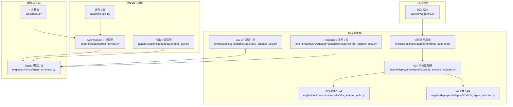

**图表来源**
- [adapters/utils.py:1-7](file://src/agentscope_runtime/adapters/utils.py#L1-L7)
- [adapters/agentscope/tool/tool.py:1-232](file://src/agentscope_runtime/adapters/agentscope/tool/tool.py#L1-L232)
- [adapters/agentscope/tool/sandbox_tool.py:1-70](file://src/agentscope_runtime/adapters/agentscope/tool/sandbox_tool.py#L1-L70)
- [engine/deployers/adapter/protocol_adapter.py:1-25](file://src/agentscope_runtime/engine/deployers/adapter/protocol_adapter.py#L1-L25)
- [engine/deployers/adapter/a2a/a2a_adapter_utils.py:1-405](file://src/agentscope_runtime/engine/deployers/adapter/a2a/a2a_adapter_utils.py#L1-L405)
- [engine/deployers/adapter/a2a/a2a_protocol_adapter.py:1-498](file://src/agentscope_runtime/engine/deployers/adapter/a2a/a2a_protocol_adapter.py#L1-L498)
- [engine/deployers/adapter/a2a/a2a_agent_adapter.py:1-70](file://src/agentscope_runtime/engine/deployers/adapter/a2a/a2a_agent_adapter.py#L1-L70)
- [engine/deployers/adapter/agui/agui_adapter_utils.py:1-658](file://src/agentscope_runtime/engine/deployers/adapter/agui/agui_adapter_utils.py#L1-L658)
- [engine/deployers/adapter/responses/response_api_adapter_utils.py:1-800](file://src/agentscope_runtime/engine/deployers/adapter/responses/response_api_adapter_utils.py#L1-L800)
- [engine/schemas/agent_schemas.py:1-800](file://src/agentscope_runtime/engine/schemas/agent_schemas.py#L1-L800)
- [tools/base.py:1-265](file://src/agentscope_runtime/tools/base.py#L1-L265)
- [cli/utils/validators.py:1-119](file://src/agentscope_runtime/cli/utils/validators.py#L1-L119)

**章节来源**
- [adapters/utils.py:1-7](file://src/agentscope_runtime/adapters/utils.py#L1-L7)
- [adapters/agentscope/tool/tool.py:1-232](file://src/agentscope_runtime/adapters/agentscope/tool/tool.py#L1-L232)
- [adapters/agentscope/tool/sandbox_tool.py:1-70](file://src/agentscope_runtime/adapters/agentscope/tool/sandbox_tool.py#L1-L70)
- [engine/deployers/adapter/protocol_adapter.py:1-25](file://src/agentscope_runtime/engine/deployers/adapter/protocol_adapter.py#L1-L25)
- [engine/deployers/adapter/a2a/a2a_adapter_utils.py:1-405](file://src/agentscope_runtime/engine/deployers/adapter/a2a/a2a_adapter_utils.py#L1-L405)
- [engine/deployers/adapter/a2a/a2a_protocol_adapter.py:1-498](file://src/agentscope_runtime/engine/deployers/adapter/a2a/a2a_protocol_adapter.py#L1-L498)
- [engine/deployers/adapter/a2a/a2a_agent_adapter.py:1-70](file://src/agentscope_runtime/engine/deployers/adapter/a2a/a2a_agent_adapter.py#L1-L70)
- [engine/deployers/adapter/agui/agui_adapter_utils.py:1-658](file://src/agentscope_runtime/engine/deployers/adapter/agui/agui_adapter_utils.py#L1-L658)
- [engine/deployers/adapter/responses/response_api_adapter_utils.py:1-800](file://src/agentscope_runtime/engine/deployers/adapter/responses/response_api_adapter_utils.py#L1-L800)
- [engine/schemas/agent_schemas.py:1-800](file://src/agentscope_runtime/engine/schemas/agent_schemas.py#L1-L800)
- [tools/base.py:1-265](file://src/agentscope_runtime/tools/base.py#L1-L265)
- [cli/utils/validators.py:1-119](file://src/agentscope_runtime/cli/utils/validators.py#L1-L119)

## 核心组件
- 通用属性更新工具：用于在对象上批量更新已存在属性，便于适配器参数注入与配置覆盖。
- AgentScope 工具适配器：将自研工具包装为 AgentScope 可识别的工具函数，内置输入验证、异步执行与结果格式化。
- 沙箱工具适配器：统一沙箱工具返回值为 ToolResponse，保证 Toolkit 的一致性。
- 协议适配器基类：定义协议适配器的统一接口，支持按协议添加端点。
- A2A 适配工具集：负责 A2A 协议与内部 Agent API 的双向转换（消息、内容、状态、任务）。
- AG-UI 适配工具集：负责 AG-UI 事件与 Agent API 事件之间的双向转换。
- Responses 适配工具集：负责 Responses API 与 Agent API 的双向转换，支持流式与非流式场景。
- Agent 模型定义：统一的消息、内容、工具、状态等数据结构。
- 工具基类：提供工具的输入/输出类型推断、参数模式生成、同步/异步执行与类型校验。
- CLI 输入校验：提供部署与运行时常用的输入校验逻辑。

**章节来源**
- [adapters/utils.py:1-7](file://src/agentscope_runtime/adapters/utils.py#L1-L7)
- [adapters/agentscope/tool/tool.py:17-169](file://src/agentscope_runtime/adapters/agentscope/tool/tool.py#L17-L169)
- [adapters/agentscope/tool/sandbox_tool.py:15-70](file://src/agentscope_runtime/adapters/agentscope/tool/sandbox_tool.py#L15-L70)
- [engine/deployers/adapter/protocol_adapter.py:6-25](file://src/agentscope_runtime/engine/deployers/adapter/protocol_adapter.py#L6-L25)
- [engine/deployers/adapter/a2a/a2a_adapter_utils.py:35-405](file://src/agentscope_runtime/engine/deployers/adapter/a2a/a2a_adapter_utils.py#L35-L405)
- [engine/deployers/adapter/agui/agui_adapter_utils.py:64-658](file://src/agentscope_runtime/engine/deployers/adapter/agui/agui_adapter_utils.py#L64-L658)
- [engine/deployers/adapter/responses/response_api_adapter_utils.py:103-800](file://src/agentscope_runtime/engine/deployers/adapter/responses/response_api_adapter_utils.py#L103-L800)
- [engine/schemas/agent_schemas.py:18-800](file://src/agentscope_runtime/engine/schemas/agent_schemas.py#L18-L800)
- [tools/base.py:34-265](file://src/agentscope_runtime/tools/base.py#L34-L265)
- [cli/utils/validators.py:13-119](file://src/agentscope_runtime/cli/utils/validators.py#L13-L119)

## 架构总览
下图展示了适配器工具在整体系统中的位置与交互关系：

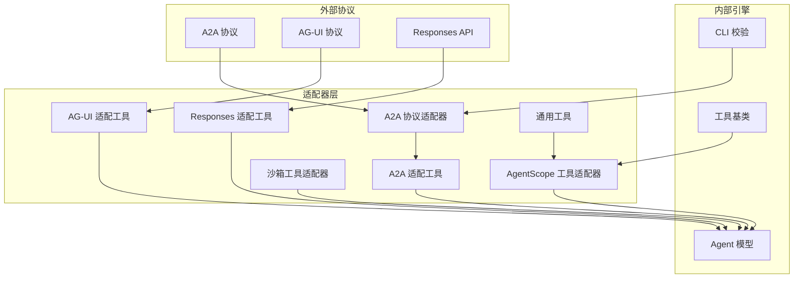

**图表来源**
- [engine/deployers/adapter/a2a/a2a_protocol_adapter.py:136-498](file://src/agentscope_runtime/engine/deployers/adapter/a2a/a2a_protocol_adapter.py#L136-L498)
- [engine/deployers/adapter/a2a/a2a_adapter_utils.py:35-405](file://src/agentscope_runtime/engine/deployers/adapter/a2a/a2a_adapter_utils.py#L35-L405)
- [engine/deployers/adapter/agui/agui_adapter_utils.py:64-658](file://src/agentscope_runtime/engine/deployers/adapter/agui/agui_adapter_utils.py#L64-L658)
- [engine/deployers/adapter/responses/response_api_adapter_utils.py:103-800](file://src/agentscope_runtime/engine/deployers/adapter/responses/response_api_adapter_utils.py#L103-L800)
- [adapters/agentscope/tool/tool.py:17-169](file://src/agentscope_runtime/adapters/agentscope/tool/tool.py#L17-L169)
- [adapters/agentscope/tool/sandbox_tool.py:15-70](file://src/agentscope_runtime/adapters/agentscope/tool/sandbox_tool.py#L15-L70)
- [adapters/utils.py:1-7](file://src/agentscope_runtime/adapters/utils.py#L1-L7)
- [engine/schemas/agent_schemas.py:18-800](file://src/agentscope_runtime/engine/schemas/agent_schemas.py#L18-L800)
- [tools/base.py:34-265](file://src/agentscope_runtime/tools/base.py#L34-L265)
- [cli/utils/validators.py:13-119](file://src/agentscope_runtime/cli/utils/validators.py#L13-L119)

## 详细组件分析

### 通用工具函数
- 属性更新工具：遍历键值对，仅对对象已存在的属性进行赋值，避免注入未知字段，便于安全地覆盖配置或参数。

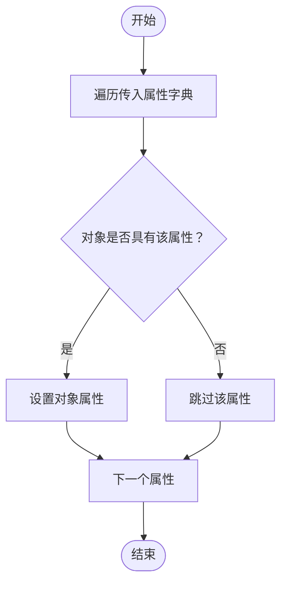

**图表来源**
- [adapters/utils.py:2-6](file://src/agentscope_runtime/adapters/utils.py#L2-L6)

**章节来源**
- [adapters/utils.py:1-7](file://src/agentscope_runtime/adapters/utils.py#L1-L7)

### AgentScope 工具适配器
- 功能概述：将自研工具包装为 AgentScope 工具函数，自动完成输入验证、异步/同步执行、结果格式化与错误处理。
- 关键流程：
  - 输入验证：若工具定义了输入类型，则使用 Pydantic 进行校验；否则直接透传。
  - 异步执行：检测目标函数是否为协程，必要时在独立线程池中运行 asyncio.run。
  - 结果格式化：优先使用模型的序列化方法，否则转字符串；最终封装为 ToolResponse。
  - 错误处理：捕获输入验证、执行与格式化阶段的异常，统一返回带错误标记的结果。
  - 模式生成：从工具函数模式中提取参数结构，转换为 AgentScope 的函数调用模式。

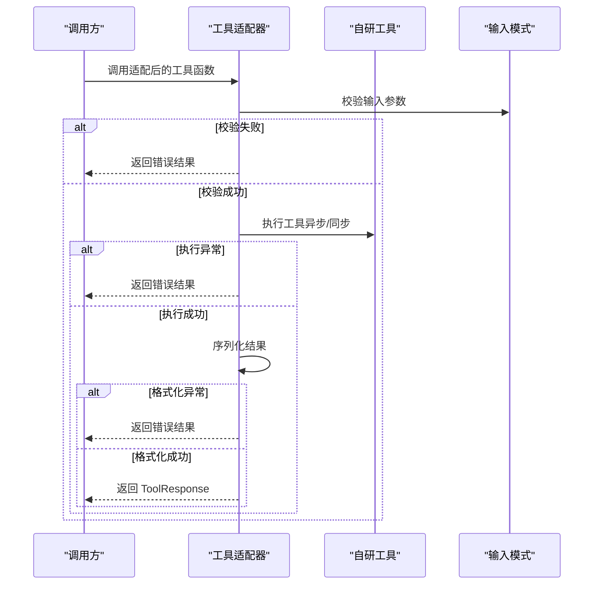

**图表来源**
- [adapters/agentscope/tool/tool.py:59-143](file://src/agentscope_runtime/adapters/agentscope/tool/tool.py#L59-L143)

**章节来源**
- [adapters/agentscope/tool/tool.py:17-169](file://src/agentscope_runtime/adapters/agentscope/tool/tool.py#L17-L169)

### 沙箱工具适配器
- 功能概述：确保沙箱工具返回值统一为 ToolResponse，兼容 Toolkit 的消费方式。
- 关键流程：
  - 若原函数已返回 ToolResponse，直接透传。
  - 否则尝试解析为 CallToolResult 并转换为内部内容块，再封装为 ToolResponse。
  - 失败时记录警告日志并以文本块兜底返回。

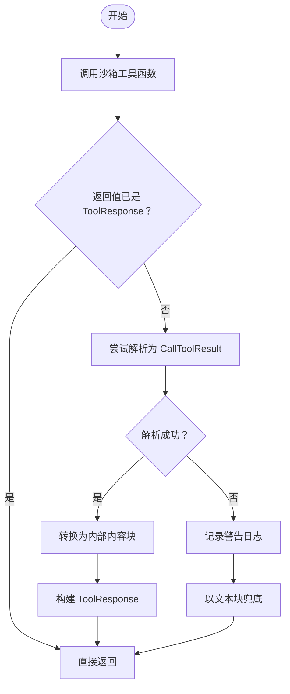

**图表来源**
- [adapters/agentscope/tool/sandbox_tool.py:32-68](file://src/agentscope_runtime/adapters/agentscope/tool/sandbox_tool.py#L32-L68)

**章节来源**
- [adapters/agentscope/tool/sandbox_tool.py:15-70](file://src/agentscope_runtime/adapters/agentscope/tool/sandbox_tool.py#L15-L70)

### A2A 协议适配器与工具
- 协议适配器基类：定义统一的端点添加接口，供各协议适配器实现。
- A2A 协议适配器：负责生成 AgentCard、注册服务发现、构建传输属性、添加 A2A 路由。
- A2A 适配工具：负责 A2A 协议与 Agent API 的双向转换（消息、内容、任务状态、事件）。
- A2A 执行器：将 A2A 请求转换为 AgentRequest，驱动内部执行并在流式场景中推送最终消息。

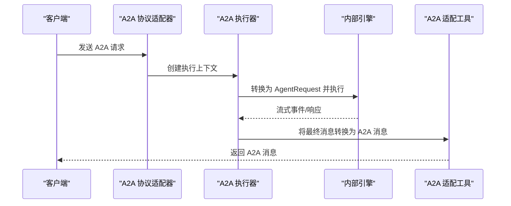

**图表来源**
- [engine/deployers/adapter/a2a/a2a_protocol_adapter.py:222-258](file://src/agentscope_runtime/engine/deployers/adapter/a2a/a2a_protocol_adapter.py#L222-L258)
- [engine/deployers/adapter/a2a/a2a_agent_adapter.py:27-61](file://src/agentscope_runtime/engine/deployers/adapter/a2a/a2a_agent_adapter.py#L27-L61)
- [engine/deployers/adapter/a2a/a2a_adapter_utils.py:388-404](file://src/agentscope_runtime/engine/deployers/adapter/a2a/a2a_adapter_utils.py#L388-L404)

**章节来源**
- [engine/deployers/adapter/protocol_adapter.py:6-25](file://src/agentscope_runtime/engine/deployers/adapter/protocol_adapter.py#L6-L25)
- [engine/deployers/adapter/a2a/a2a_protocol_adapter.py:136-498](file://src/agentscope_runtime/engine/deployers/adapter/a2a/a2a_protocol_adapter.py#L136-L498)
- [engine/deployers/adapter/a2a/a2a_agent_adapter.py:23-70](file://src/agentscope_runtime/engine/deployers/adapter/a2a/a2a_agent_adapter.py#L23-L70)
- [engine/deployers/adapter/a2a/a2a_adapter_utils.py:35-405](file://src/agentscope_runtime/engine/deployers/adapter/a2a/a2a_adapter_utils.py#L35-L405)

### AG-UI 适配工具
- 功能概述：将 AG-UI 的消息与事件转换为 Agent API 的消息与事件，同时支持反向转换。
- 关键流程：
  - 消息转换：根据 AG-UI 消息类型映射到 Agent API 的消息类型（用户、助手、工具等），并处理多模态内容。
  - 事件转换：将 Agent API 的事件转换为 AG-UI 的事件序列，包括文本增量、工具调用、运行开始/结束/错误等。
  - 工具转换：将 AG-UI 的工具定义转换为 Agent API 的工具模式。

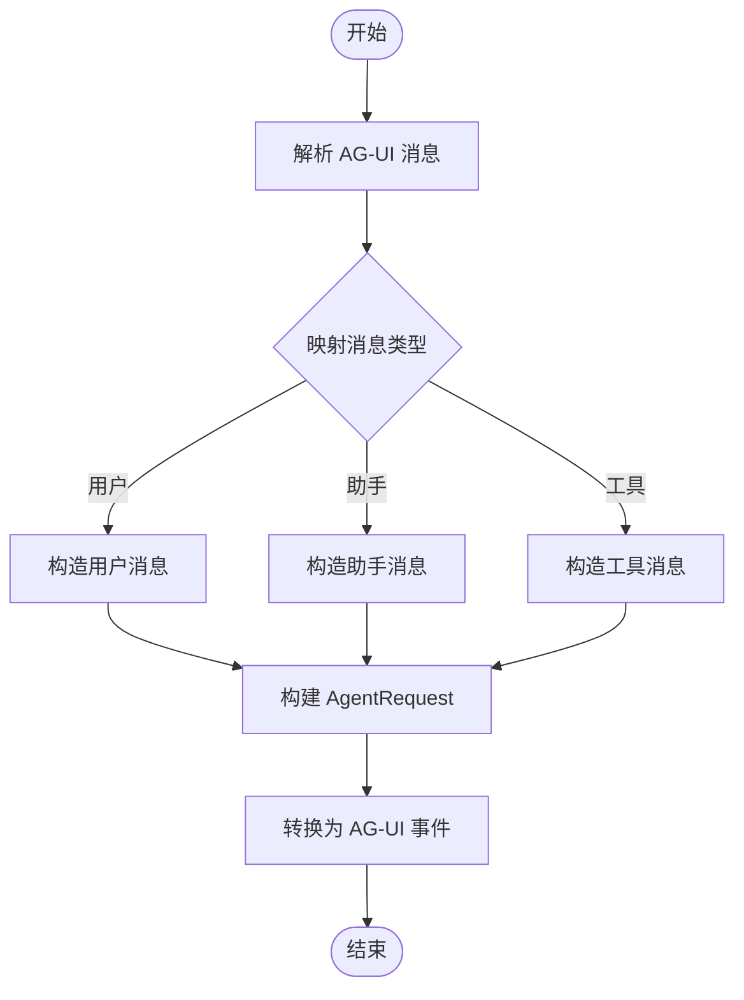

**图表来源**
- [engine/deployers/adapter/agui/agui_adapter_utils.py:64-210](file://src/agentscope_runtime/engine/deployers/adapter/agui/agui_adapter_utils.py#L64-L210)
- [engine/deployers/adapter/agui/agui_adapter_utils.py:360-622](file://src/agentscope_runtime/engine/deployers/adapter/agui/agui_adapter_utils.py#L360-L622)

**章节来源**
- [engine/deployers/adapter/agui/agui_adapter_utils.py:64-658](file://src/agentscope_runtime/engine/deployers/adapter/agui/agui_adapter_utils.py#L64-L658)

### Responses 适配工具
- 功能概述：实现 Responses API 与 Agent API 的双向转换，支持文本、工具调用、推理、音频/图像/文件等多种内容类型。
- 关键流程：
  - 请求转换：将 Responses API 的请求参数映射为 Agent API 的请求，处理输入消息、工具列表与特殊字段映射。
  - 响应转换：将 Agent API 的响应转换为 Responses API 的响应对象，包括状态、输出项与错误。
  - 事件转换：将 Agent API 的事件流转换为 Responses API 的事件流，支持增量与完成事件。

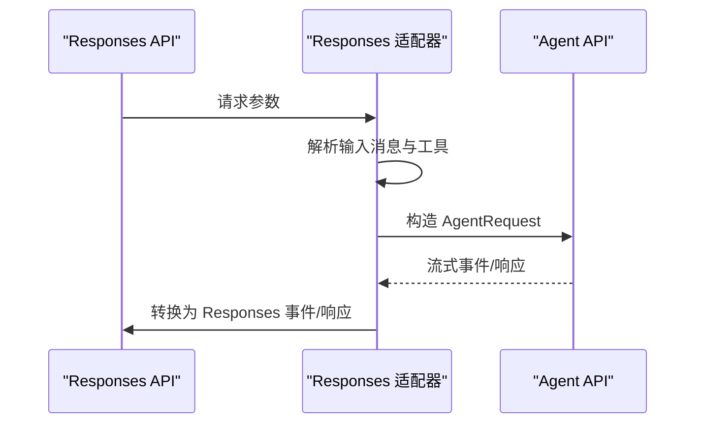

**图表来源**
- [engine/deployers/adapter/responses/response_api_adapter_utils.py:266-301](file://src/agentscope_runtime/engine/deployers/adapter/responses/response_api_adapter_utils.py#L266-L301)
- [engine/deployers/adapter/responses/response_api_adapter_utils.py:125-262](file://src/agentscope_runtime/engine/deployers/adapter/responses/response_api_adapter_utils.py#L125-L262)
- [engine/deployers/adapter/responses/response_api_adapter_utils.py:800-1000](file://src/agentscope_runtime/engine/deployers/adapter/responses/response_api_adapter_utils.py#L800-L1000)

**章节来源**
- [engine/deployers/adapter/responses/response_api_adapter_utils.py:103-800](file://src/agentscope_runtime/engine/deployers/adapter/responses/response_api_adapter_utils.py#L103-L800)

### 数据模型与类型转换
- Agent 模型：定义消息类型、内容类型、角色、运行状态、工具与函数参数等核心数据结构。
- 工具基类：提供泛型输入/输出类型推断、参数模式生成、同步/异步执行与类型校验，支撑工具适配器的类型安全。

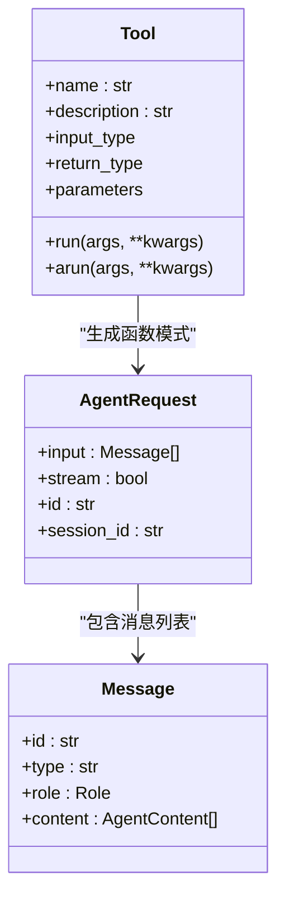

**图表来源**
- [tools/base.py:34-161](file://src/agentscope_runtime/tools/base.py#L34-L161)
- [engine/schemas/agent_schemas.py:751-800](file://src/agentscope_runtime/engine/schemas/agent_schemas.py#L751-L800)
- [engine/schemas/agent_schemas.py:480-580](file://src/agentscope_runtime/engine/schemas/agent_schemas.py#L480-L580)

**章节来源**
- [engine/schemas/agent_schemas.py:18-800](file://src/agentscope_runtime/engine/schemas/agent_schemas.py#L18-L800)
- [tools/base.py:34-265](file://src/agentscope_runtime/tools/base.py#L34-L265)

### CLI 输入校验
- 提供部署与运行时常用的输入校验逻辑，包括源路径、端口、平台、文件/目录存在性、URL 格式与部署 ID 格式等。

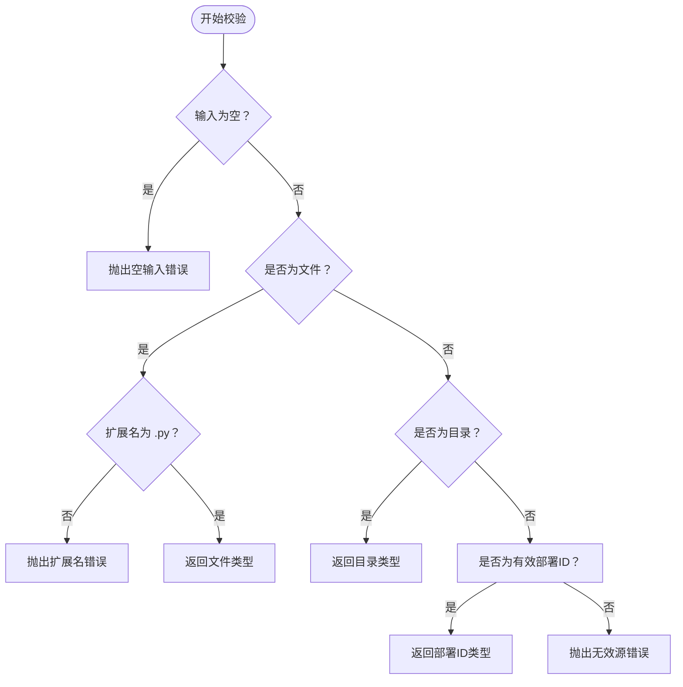

**图表来源**
- [cli/utils/validators.py:13-53](file://src/agentscope_runtime/cli/utils/validators.py#L13-L53)

**章节来源**
- [cli/utils/validators.py:13-119](file://src/agentscope_runtime/cli/utils/validators.py#L13-L119)

## 依赖关系分析
- 组件内聚与耦合：
  - 适配器工具与协议适配器之间通过统一的数据模型解耦，便于替换与扩展。
  - AgentScope 工具适配器依赖工具基类提供的类型信息与执行框架。
  - A2A/AG-UI/Responses 适配器均依赖 Agent 模型进行双向转换。
- 外部依赖：
  - A2A 适配器依赖 a2a 协议库与 FastAPI。
  - AG-UI 适配器依赖 ag_ui 核心事件与消息类型。
  - Responses 适配器依赖 OpenAI Responses API 类型。

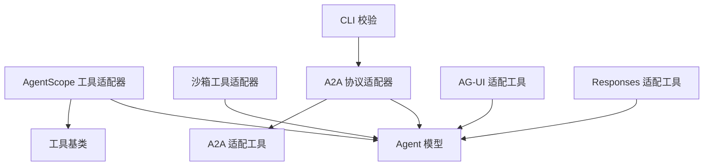

**图表来源**
- [adapters/agentscope/tool/tool.py:17-169](file://src/agentscope_runtime/adapters/agentscope/tool/tool.py#L17-L169)
- [adapters/agentscope/tool/sandbox_tool.py:15-70](file://src/agentscope_runtime/adapters/agentscope/tool/sandbox_tool.py#L15-L70)
- [engine/deployers/adapter/a2a/a2a_protocol_adapter.py:136-498](file://src/agentscope_runtime/engine/deployers/adapter/a2a/a2a_protocol_adapter.py#L136-L498)
- [engine/deployers/adapter/a2a/a2a_adapter_utils.py:35-405](file://src/agentscope_runtime/engine/deployers/adapter/a2a/a2a_adapter_utils.py#L35-L405)
- [engine/deployers/adapter/agui/agui_adapter_utils.py:64-658](file://src/agentscope_runtime/engine/deployers/adapter/agui/agui_adapter_utils.py#L64-L658)
- [engine/deployers/adapter/responses/response_api_adapter_utils.py:103-800](file://src/agentscope_runtime/engine/deployers/adapter/responses/response_api_adapter_utils.py#L103-L800)
- [engine/schemas/agent_schemas.py:18-800](file://src/agentscope_runtime/engine/schemas/agent_schemas.py#L18-L800)
- [tools/base.py:34-265](file://src/agentscope_runtime/tools/base.py#L34-L265)
- [cli/utils/validators.py:13-119](file://src/agentscope_runtime/cli/utils/validators.py#L13-L119)

**章节来源**
- [adapters/agentscope/tool/tool.py:17-169](file://src/agentscope_runtime/adapters/agentscope/tool/tool.py#L17-L169)
- [adapters/agentscope/tool/sandbox_tool.py:15-70](file://src/agentscope_runtime/adapters/agentscope/tool/sandbox_tool.py#L15-L70)
- [engine/deployers/adapter/a2a/a2a_protocol_adapter.py:136-498](file://src/agentscope_runtime/engine/deployers/adapter/a2a/a2a_protocol_adapter.py#L136-L498)
- [engine/deployers/adapter/a2a/a2a_adapter_utils.py:35-405](file://src/agentscope_runtime/engine/deployers/adapter/a2a/a2a_adapter_utils.py#L35-L405)
- [engine/deployers/adapter/agui/agui_adapter_utils.py:64-658](file://src/agentscope_runtime/engine/deployers/adapter/agui/agui_adapter_utils.py#L64-L658)
- [engine/deployers/adapter/responses/response_api_adapter_utils.py:103-800](file://src/agentscope_runtime/engine/deployers/adapter/responses/response_api_adapter_utils.py#L103-L800)
- [engine/schemas/agent_schemas.py:18-800](file://src/agentscope_runtime/engine/schemas/agent_schemas.py#L18-L800)
- [tools/base.py:34-265](file://src/agentscope_runtime/tools/base.py#L34-L265)
- [cli/utils/validators.py:13-119](file://src/agentscope_runtime/cli/utils/validators.py#L13-L119)

## 性能考虑
- 异步执行与线程池：在 AgentScope 工具适配器中，针对协程函数采用线程池隔离 asyncio.run，避免阻塞主线程，提升并发吞吐。
- 结果序列化：优先使用模型的序列化方法，减少重复转换开销；失败回退为字符串，确保稳定性。
- 事件转换批量化：在 AG-UI 与 Responses 适配器中，尽量合并连续的增量事件，减少网络往返与序列化次数。
- 模式缓存：工具参数模式解析后可复用，避免重复生成 JSON Schema。
- 日志粒度控制：在沙箱工具适配器中，仅在异常时输出详细日志，降低生产环境日志噪声。

[本节为通用性能建议，不直接分析具体文件]

## 故障排查指南
- 输入验证失败：
  - 现象：工具适配器返回带错误标记的结果。
  - 排查：检查工具输入类型定义与传入参数是否符合 Pydantic 模式。
  - 参考：[adapters/agentscope/tool/tool.py:64-78](file://src/agentscope_runtime/adapters/agentscope/tool/tool.py#L64-L78)
- 执行异常：
  - 现象：工具执行抛出异常并被适配器捕获。
  - 排查：查看异常堆栈与日志，确认工具内部逻辑与资源可用性。
  - 参考：[adapters/agentscope/tool/tool.py:99-109](file://src/agentscope_runtime/adapters/agentscope/tool/tool.py#L99-L109)
- 结果格式化异常：
  - 现象：结果无法序列化为 ToolResponse。
  - 排查：确认返回值类型与序列化方法，必要时实现 model_dump。
  - 参考：[adapters/agentscope/tool/tool.py:111-143](file://src/agentscope_runtime/adapters/agentscope/tool/tool.py#L111-L143)
- 沙箱工具返回值不一致：
  - 现象：Toolkit 无法正确消费工具结果。
  - 排查：确保沙箱工具返回值可被解析为 CallToolResult 或直接返回 ToolResponse。
  - 参考：[adapters/agentscope/tool/sandbox_tool.py:38-68](file://src/agentscope_runtime/adapters/agentscope/tool/sandbox_tool.py#L38-L68)
- CLI 输入校验失败：
  - 现象：部署命令报错提示输入不合法。
  - 排查：核对源路径、端口范围、平台名称、文件/目录存在性与部署 ID 格式。
  - 参考：[cli/utils/validators.py:13-119](file://src/agentscope_runtime/cli/utils/validators.py#L13-L119)

**章节来源**
- [adapters/agentscope/tool/tool.py:64-143](file://src/agentscope_runtime/adapters/agentscope/tool/tool.py#L64-L143)
- [adapters/agentscope/tool/sandbox_tool.py:38-68](file://src/agentscope_runtime/adapters/agentscope/tool/sandbox_tool.py#L38-L68)
- [cli/utils/validators.py:13-119](file://src/agentscope_runtime/cli/utils/validators.py#L13-L119)

## 结论
适配器工具函数通过统一的数据模型与清晰的转换流程，实现了多协议与多运行时的无缝对接。开发者在扩展新协议或工具时，可遵循以下最佳实践：
- 明确输入/输出类型与参数模式，利用工具基类与 Pydantic 实现强类型校验。
- 在异步场景中谨慎处理事件循环与线程池，避免阻塞与死锁。
- 统一错误处理与日志策略，确保问题可追踪且不影响主流程。
- 优先使用模型序列化方法进行结果格式化，必要时提供回退方案。
- 在 CLI 与部署流程中加入严格的输入校验，提升用户体验与系统稳定性。

[本节为总结性内容，不直接分析具体文件]