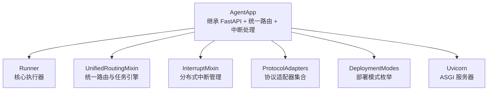
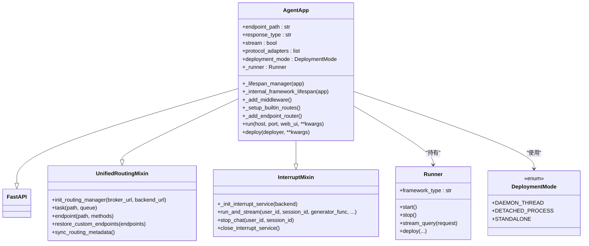
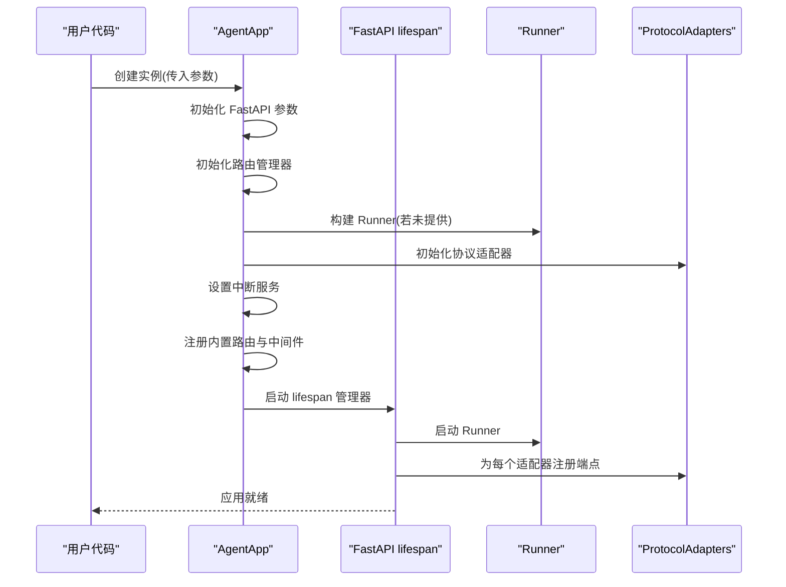
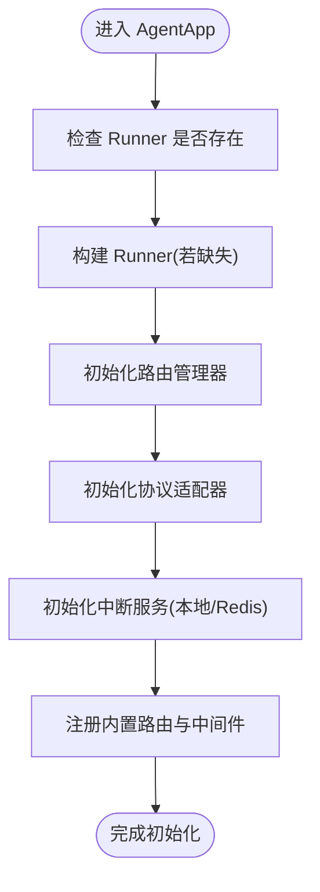
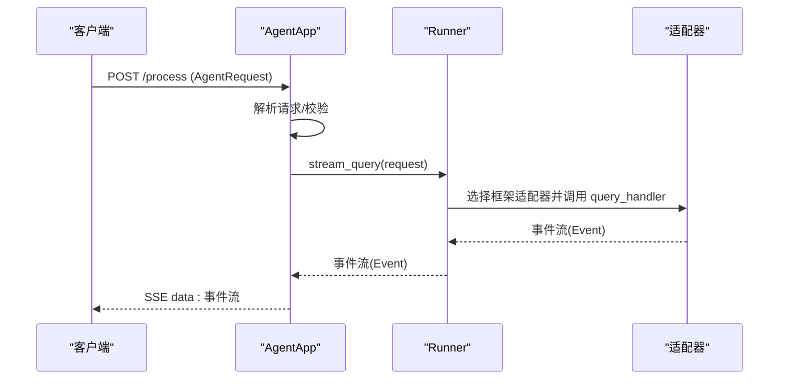
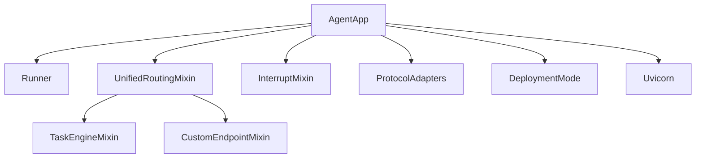

# AgentApp核心架构

<cite>
**本文引用的文件**
- [agent_app.py](file://src/agentscope_runtime/engine/app/agent_app.py)
- [celery_mixin.py](file://src/agentscope_runtime/engine/app/celery_mixin.py)
- [unified_routing_mixin.py](file://src/agentscope_runtime/engine/deployers/utils/service_utils/routing/unified_routing_mixin.py)
- [interrupt_mixin.py](file://src/agentscope_runtime/engine/deployers/utils/service_utils/interrupt/interrupt_mixin.py)
- [runner.py](file://src/agentscope_runtime/engine/runner.py)
- [deployment_modes.py](file://src/agentscope_runtime/engine/deployers/utils/deployment_modes.py)
- [agent_app.md](file://cookbook/zh/agent_app.md)
- [react_agent.md](file://cookbook/en/react_agent.md)
- [quickstart.md](file://cookbook/zh/quickstart.md)
</cite>

## 目录
1. [简介](#简介)
2. [项目结构](#项目结构)
3. [核心组件](#核心组件)
4. [架构总览](#架构总览)
5. [详细组件分析](#详细组件分析)
6. [依赖关系分析](#依赖关系分析)
7. [性能考量](#性能考量)
8. [故障排查指南](#故障排查指南)
9. [结论](#结论)
10. [附录](#附录)

## 简介
本文件系统性阐述 AgentApp 作为 FastAPI 与 Runner 集成体的设计理念与实现细节。AgentApp 通过多重继承与混入模式（Mixin）实现统一路由管理、中断处理、生命周期管理与协议适配，既满足初学者快速上手，也为高级开发者提供深入的扩展能力。本文将从继承关系、初始化流程、核心配置参数、混入模式的作用机制、部署模式与中间件、自定义端点注册等方面进行深入解析，并提供可操作的示例路径与最佳实践建议。

## 项目结构
AgentApp 位于引擎层的 app 包中，围绕 FastAPI 与 Runner 构建，同时通过混入模式整合路由、任务与中断管理能力。下图展示了与 AgentApp 相关的关键文件及其职责：

图表来源
- [agent_app.py:60-220](file://src/agentscope_runtime/engine/app/agent_app.py#L60-L220)
- [runner.py:46-120](file://src/agentscope_runtime/engine/runner.py#L46-L120)
- [unified_routing_mixin.py:16-120](file://src/agentscope_runtime/engine/deployers/utils/service_utils/routing/unified_routing_mixin.py#L16-L120)
- [interrupt_mixin.py:8-50](file://src/agentscope_runtime/engine/deployers/utils/service_utils/interrupt/interrupt_mixin.py#L8-L50)
- [deployment_modes.py:7-15](file://src/agentscope_runtime/engine/deployers/utils/deployment_modes.py#L7-L15)

章节来源
- [agent_app.py:60-220](file://src/agentscope_runtime/engine/app/agent_app.py#L60-L220)
- [unified_routing_mixin.py:16-120](file://src/agentscope_runtime/engine/deployers/utils/service_utils/routing/unified_routing_mixin.py#L16-L120)
- [interrupt_mixin.py:8-50](file://src/agentscope_runtime/engine/deployers/utils/service_utils/interrupt/interrupt_mixin.py#L8-L50)
- [runner.py:46-120](file://src/agentscope_runtime/engine/runner.py#L46-L120)
- [deployment_modes.py:7-15](file://src/agentscope_runtime/engine/deployers/utils/deployment_modes.py#L7-L15)

## 核心组件
- AgentApp：继承 FastAPI、统一路由与中断处理，负责应用生命周期、协议适配器、内置路由与中间件、任务端点与运行时配置更新。
- Runner：核心执行器，封装不同框架类型的适配器、流式查询、生命周期钩子与部署管理。
- UnifiedRoutingMixin：提供统一路由、任务引擎、自定义端点注册与元数据同步。
- InterruptMixin：提供分布式中断后端、任务状态管理与中断信号监听。
- DeploymentMode：部署模式枚举，支持守护线程、分离进程与独立模式。
- ProtocolAdapters：默认包含 A2A、ResponseAPI、AGUI 三种协议适配器。

章节来源
- [agent_app.py:60-220](file://src/agentscope_runtime/engine/app/agent_app.py#L60-L220)
- [runner.py:46-120](file://src/agentscope_runtime/engine/runner.py#L46-L120)
- [unified_routing_mixin.py:16-120](file://src/agentscope_runtime/engine/deployers/utils/service_utils/routing/unified_routing_mixin.py#L16-L120)
- [interrupt_mixin.py:8-50](file://src/agentscope_runtime/engine/deployers/utils/service_utils/interrupt/interrupt_mixin.py#L8-L50)
- [deployment_modes.py:7-15](file://src/agentscope_runtime/engine/deployers/utils/deployment_modes.py#L7-L15)

## 架构总览
AgentApp 的整体架构以 FastAPI 为基础，通过混入模式叠加路由与中断能力，并将 Runner 作为内部执行核心。生命周期由 FastAPI 的 lifespan 管理，协议适配器在启动阶段注入端点，内置健康检查与根路径信息，支持可选的 Web UI 启动。

图表来源
- [agent_app.py:60-220](file://src/agentscope_runtime/engine/app/agent_app.py#L60-L220)
- [runner.py:46-120](file://src/agentscope_runtime/engine/runner.py#L46-L120)
- [unified_routing_mixin.py:16-120](file://src/agentscope_runtime/engine/deployers/utils/service_utils/routing/unified_routing_mixin.py#L16-L120)
- [interrupt_mixin.py:8-50](file://src/agentscope_runtime/engine/deployers/utils/service_utils/interrupt/interrupt_mixin.py#L8-L50)
- [deployment_modes.py:7-15](file://src/agentscope_runtime/engine/deployers/utils/deployment_modes.py#L7-L15)

## 详细组件分析

### 继承关系与初始化流程
- 继承关系：AgentApp 同时继承 FastAPI、UnifiedRoutingMixin 与 InterruptMixin，从而具备统一路由、任务与中断能力。
- 初始化参数：涵盖应用名称、描述、端点路径、响应类型、是否流式、请求模型、生命周期钩子、Runner 实例、嵌入式工作进程开关、流式任务开关、中断后端选择、部署模式、协议适配器列表与自定义端点元数据等。
- 生命周期管理：通过 FastAPI 的 lifespan 管理器协调内部 Runner、协议适配器与中断服务的启动与关闭；支持用户自定义 lifespan 并与内部逻辑合并。

图表来源
- [agent_app.py:124-220](file://src/agentscope_runtime/engine/app/agent_app.py#L124-L220)
- [agent_app.py:248-339](file://src/agentscope_runtime/engine/app/agent_app.py#L248-L339)

章节来源
- [agent_app.py:124-220](file://src/agentscope_runtime/engine/app/agent_app.py#L124-L220)
- [agent_app.py:248-339](file://src/agentscope_runtime/engine/app/agent_app.py#L248-L339)

### 混入模式：统一路由与中断处理
- 统一路由管理：UnifiedRoutingMixin 提供任务装饰器、自定义端点注册与元数据同步，支持 Celery 或内存模式的任务执行与状态轮询。
- 中断处理：InterruptMixin 提供分布式中断后端初始化、任务状态比较与设置、信号监听与取消、最终状态更新与资源清理。

图表来源
- [agent_app.py:164-220](file://src/agentscope_runtime/engine/app/agent_app.py#L164-L220)
- [unified_routing_mixin.py:16-120](file://src/agentscope_runtime/engine/deployers/utils/service_utils/routing/unified_routing_mixin.py#L16-L120)
- [interrupt_mixin.py:8-50](file://src/agentscope_runtime/engine/deployers/utils/service_utils/interrupt/interrupt_mixin.py#L8-L50)

章节来源
- [unified_routing_mixin.py:16-120](file://src/agentscope_runtime/engine/deployers/utils/service_utils/routing/unified_routing_mixin.py#L16-L120)
- [interrupt_mixin.py:8-50](file://src/agentscope_runtime/engine/deployers/utils/service_utils/interrupt/interrupt_mixin.py#L8-L50)

### Runner 集成与流式查询
- Runner 作为核心执行器，负责不同框架类型的适配器选择、流式查询、序列号生成与错误封装。
- AgentApp 将 Runner 的查询处理器绑定到统一的推理端点，支持 SSE 流式响应与可选的中断管理。

图表来源
- [agent_app.py:781-845](file://src/agentscope_runtime/engine/app/agent_app.py#L781-L845)
- [runner.py:199-356](file://src/agentscope_runtime/engine/runner.py#L199-L356)

章节来源
- [agent_app.py:781-845](file://src/agentscope_runtime/engine/app/agent_app.py#L781-L845)
- [runner.py:199-356](file://src/agentscope_runtime/engine/runner.py#L199-L356)

### 协议适配器与 OpenAPI 扩展
- AgentApp 在生成 OpenAPI 时动态注入协议相关的 Schema（如 A2ARequest、ResponseAPI、AgentRequest），以增强 API 文档的完整性与一致性。
- 默认协议适配器包括 A2A、ResponseAPI 与 AGUI，默认在初始化阶段创建并注册端点。

章节来源
- [agent_app.py:68-123](file://src/agentscope_runtime/engine/app/agent_app.py#L68-L123)
- [agent_app.py:340-357](file://src/agentscope_runtime/engine/app/agent_app.py#L340-L357)

### 部署模式与中间件
- 部署模式：Daemon Thread、Detached Process、Standalone 三种模式，分别对应本地守护线程、分离进程与独立打包模板。
- 中间件：默认启用 CORS；在特定部署模式下动态设置响应头以标识进程/部署模式；支持用户自定义 lifespan 与路由。

章节来源
- [deployment_modes.py:7-15](file://src/agentscope_runtime/engine/deployers/utils/deployment_modes.py#L7-L15)
- [agent_app.py:359-381](file://src/agentscope_runtime/engine/app/agent_app.py#L359-L381)

### 自定义端点注册与任务引擎
- 自定义端点：支持原生 FastAPI 路由与便捷装饰器 @app.endpoint，后者自动识别生成器并转换为 SSE。
- 任务引擎：通过 @app.task 装饰器注册异步任务端点，支持 Celery 或内存模式的任务提交与状态轮询。

章节来源
- [unified_routing_mixin.py:103-120](file://src/agentscope_runtime/engine/deployers/utils/service_utils/routing/unified_routing_mixin.py#L103-L120)
- [unified_routing_mixin.py:25-101](file://src/agentscope_runtime/engine/deployers/utils/service_utils/routing/unified_routing_mixin.py#L25-L101)

### 生命周期管理与运行时配置更新
- 生命周期：AgentApp 使用 FastAPI 的 lifespan 管理器，内部协调 Runner、协议适配器与中断服务；支持用户自定义 lifespan 并与内部逻辑合并。
- 运行时配置更新：支持在运行时动态更新流式开关、协议适配器、嵌入式任务处理器、部署模式、Runner 实例与端点路径等。

章节来源
- [agent_app.py:248-339](file://src/agentscope_runtime/engine/app/agent_app.py#L248-L339)
- [agent_app.py:847-880](file://src/agentscope_runtime/engine/app/agent_app.py#L847-L880)

## 依赖关系分析
AgentApp 的耦合与协作关系如下：

图表来源
- [agent_app.py:60-220](file://src/agentscope_runtime/engine/app/agent_app.py#L60-L220)
- [unified_routing_mixin.py:16-120](file://src/agentscope_runtime/engine/deployers/utils/service_utils/routing/unified_routing_mixin.py#L16-L120)
- [interrupt_mixin.py:8-50](file://src/agentscope_runtime/engine/deployers/utils/service_utils/interrupt/interrupt_mixin.py#L8-L50)

章节来源
- [agent_app.py:60-220](file://src/agentscope_runtime/engine/app/agent_app.py#L60-L220)
- [unified_routing_mixin.py:16-120](file://src/agentscope_runtime/engine/deployers/utils/service_utils/routing/unified_routing_mixin.py#L16-L120)
- [interrupt_mixin.py:8-50](file://src/agentscope_runtime/engine/deployers/utils/service_utils/interrupt/interrupt_mixin.py#L8-L50)

## 性能考量
- 流式响应：SSE 流式输出减少客户端等待时间，适合长文本生成与逐步反馈场景。
- 中断机制：分布式中断后端避免重复执行与资源浪费，提升并发安全性。
- 任务清理：定期清理过期任务，防止内存泄漏与状态堆积。
- 部署模式：根据场景选择守护线程或分离进程模式，平衡资源占用与管理复杂度。

## 故障排查指南
- 启动失败：检查 lifespan 配置与 Runner 初始化逻辑，确认 before_start/after_finish 钩子正确实现。
- 中断无效：确认中断后端已正确初始化（本地或 Redis），并检查通道命名与订阅逻辑。
- 自定义端点不生效：确认端点路径未被内置路由覆盖，且在 lifespan 中正确注册。
- 任务提交失败：检查 Celery 配置与队列注册，确保任务函数已通过装饰器注册。

章节来源
- [agent_app.py:248-339](file://src/agentscope_runtime/engine/app/agent_app.py#L248-L339)
- [interrupt_mixin.py:20-151](file://src/agentscope_runtime/engine/deployers/utils/service_utils/interrupt/interrupt_mixin.py#L20-L151)
- [unified_routing_mixin.py:186-237](file://src/agentscope_runtime/engine/deployers/utils/service_utils/routing/unified_routing_mixin.py#L186-L237)

## 结论
AgentApp 通过“继承 + 混入”的设计，将 FastAPI 的灵活性与 Runner 的执行能力有机结合，配合统一路由与中断管理，形成一套可扩展、可运维、可部署的 Agent 服务框架。对于初学者，可通过生命周期管理与内置端点快速搭建服务；对于高级开发者，可利用自定义端点、任务引擎与运行时配置更新实现复杂业务场景。

## 附录

### 如何创建 AgentApp 实例（示例路径）
- 最小化实例与运行：参考示例路径 [quickstart.md:90-98](file://cookbook/zh/quickstart.md#L90-L98)，创建 AgentApp 并传入生命周期函数。
- 流式输出与中断示例：参考示例路径 [react_agent.md:144-223](file://cookbook/en/react_agent.md#L144-L223)，展示生命周期、查询函数与中断停止端点。
- 自定义端点与便捷装饰器：参考示例路径 [agent_app.md:558-618](file://cookbook/zh/agent_app.md#L558-L618)，展示原生 FastAPI 与 @app.endpoint 的用法差异与优势。

章节来源
- [quickstart.md:90-98](file://cookbook/zh/quickstart.md#L90-L98)
- [react_agent.md:144-223](file://cookbook/en/react_agent.md#L144-L223)
- [agent_app.md:558-618](file://cookbook/zh/agent_app.md#L558-L618)