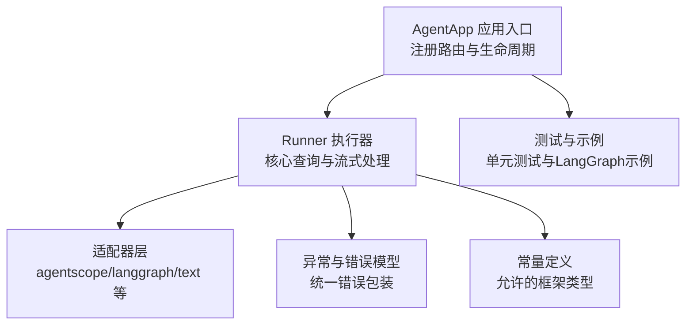
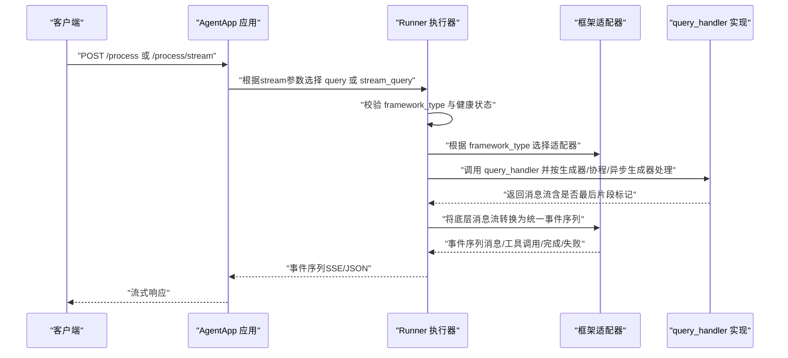
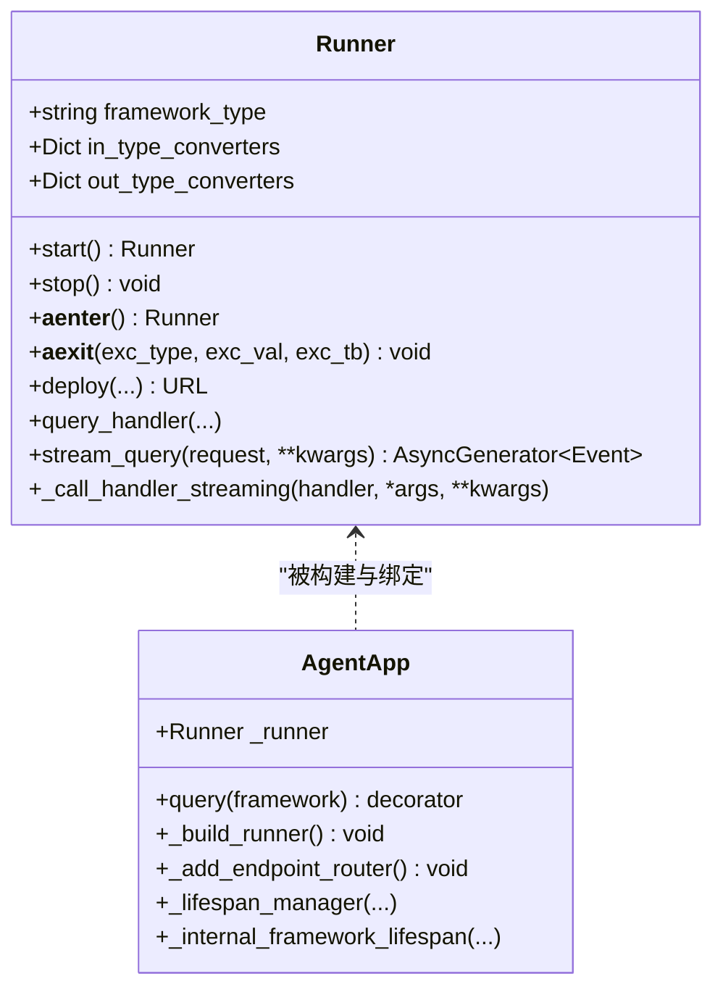
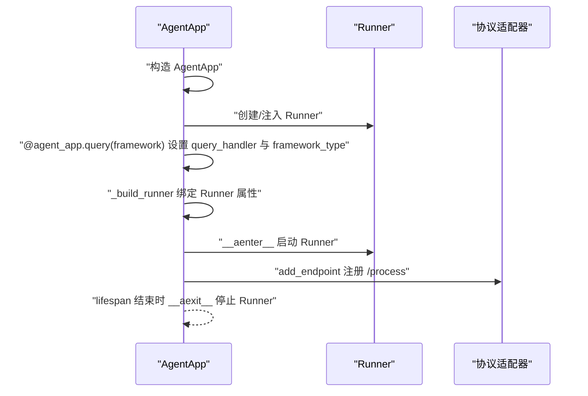
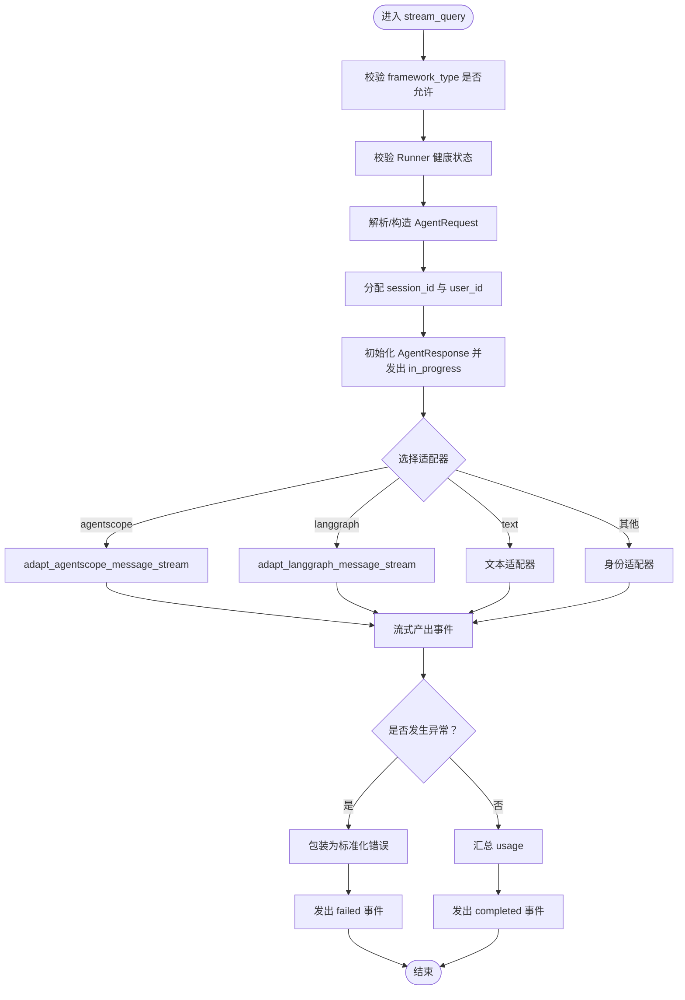
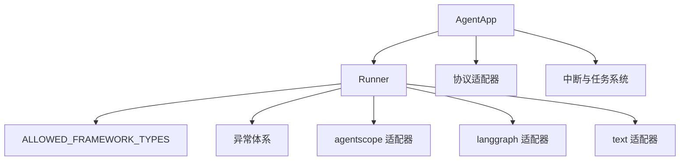

# Runner执行器

<cite>
**本文引用的文件列表**
- [runner.py](file://src/agentscope_runtime/engine/runner.py)
- [agent_app.py](file://src/agentscope_runtime/engine/app/agent_app.py)
- [helpers_runner.py](file://src/agentscope_runtime/engine/helpers/runner.py)
- [constant.py](file://src/agentscope_runtime/engine/constant.py)
- [agentscope_stream.py](file://src/agentscope_runtime/adapters/agentscope/stream.py)
- [langgraph_stream.py](file://src/agentscope_runtime/adapters/langgraph/stream.py)
- [exception.py](file://src/agentscope_runtime/engine/schemas/exception.py)
- [test_runner_stream.py](file://tests/unit/test_runner_stream.py)
- [run_langgraph_agent.py](file://examples/integrations/langgraph/run_langgraph_agent.py)
</cite>

## 目录
1. [简介](#简介)
2. [项目结构](#项目结构)
3. [核心组件](#核心组件)
4. [架构总览](#架构总览)
5. [详细组件分析](#详细组件分析)
6. [依赖关系分析](#依赖关系分析)
7. [性能考虑](#性能考虑)
8. [故障排查指南](#故障排查指南)
9. [结论](#结论)
10. [附录](#附录)

## 简介
Runner是AgentScope Runtime中的智能体逻辑执行核心，负责接收AgentApp的请求，根据指定的框架类型（framework_type）进行消息协议适配，并将底层智能体的流式输出转换为统一的事件序列，最终通过SSE等协议返回给客户端。它支持多种框架（如Agentscope、LangGraph、Agno、Autogen、MS Agent Framework等），并通过适配器层屏蔽不同框架的消息格式差异，实现统一的执行与返回机制。

## 项目结构
本节聚焦与Runner直接相关的模块与文件组织，帮助读者快速定位关键实现位置。

图表来源
- [agent_app.py:60-150](file://src/agentscope_runtime/engine/app/agent_app.py#L60-L150)
- [runner.py:46-120](file://src/agentscope_runtime/engine/runner.py#L46-L120)
- [constant.py:1-10](file://src/agentscope_runtime/engine/constant.py#L1-L10)
- [exception.py:11-605](file://src/agentscope_runtime/engine/schemas/exception.py#L11-L605)

章节来源
- [agent_app.py:60-150](file://src/agentscope_runtime/engine/app/agent_app.py#L60-L150)
- [runner.py:46-120](file://src/agentscope_runtime/engine/runner.py#L46-L120)
- [constant.py:1-10](file://src/agentscope_runtime/engine/constant.py#L1-L10)

## 核心组件
- Runner：执行器核心，提供生命周期管理（start/stop/__aenter__/__aexit__）、部署能力（deploy）、查询接口（query_handler）、流式查询（stream_query）以及内部处理器调用与适配（_call_handler_streaming）。
- AgentApp：基于FastAPI的应用容器，负责生命周期编排、协议适配器挂载、端点注册、中断与任务队列等，内部持有Runner实例并在lifespan中完成Runner的构建与绑定。
- 适配器层：针对不同框架的消息流进行转换，例如Agentscope、LangGraph等，将底层消息流转换为统一的事件序列。
- 异常体系：统一的业务异常基类与具体异常类型，用于在Runner中捕获未分类异常并转换为标准化错误响应。

章节来源
- [runner.py:46-120](file://src/agentscope_runtime/engine/runner.py#L46-L120)
- [agent_app.py:60-150](file://src/agentscope_runtime/engine/app/agent_app.py#L60-L150)
- [exception.py:11-605](file://src/agentscope_runtime/engine/schemas/exception.py#L11-L605)

## 架构总览
Runner与AgentApp的协作关系如下：

图表来源
- [agent_app.py:249-316](file://src/agentscope_runtime/engine/app/agent_app.py#L249-L316)
- [runner.py:193-356](file://src/agentscope_runtime/engine/runner.py#L193-L356)
- [agentscope_stream.py:33-684](file://src/agentscope_runtime/adapters/agentscope/stream.py#L33-L684)
- [langgraph_stream.py:28-257](file://src/agentscope_runtime/adapters/langgraph/stream.py#L28-L257)

## 详细组件分析

### Runner 类设计与生命周期
- 设计理念
  - Runner作为“执行器”，不关心具体智能体实现，只负责请求接入、框架适配、事件序列化与错误包装。
  - 通过framework_type字段声明适配器类型，避免硬编码在Runner内部，便于扩展新框架。
- 生命周期管理
  - start/stop：初始化与关闭钩子，支持同步/异步；内部维护健康状态与AsyncExitStack。
  - __aenter__/__aexit__：支持with语义，自动完成start/stop。
  - deploy：委托给部署管理器，返回可访问的服务URL。
- 关键方法
  - query_handler：抽象方法，由上层实现具体智能体逻辑。
  - stream_query：核心流式查询入口，负责请求校验、会话/用户ID分配、事件序列号生成、适配器选择、错误包装与最终完成状态上报。
  - _call_handler_streaming：统一对同步/异步/生成器风格的query_handler输出进行适配，保证上游调用方无需关心底层实现差异。

图表来源
- [runner.py:46-120](file://src/agentscope_runtime/engine/runner.py#L46-L120)
- [agent_app.py:760-780](file://src/agentscope_runtime/engine/app/agent_app.py#L760-L780)

章节来源
- [runner.py:46-120](file://src/agentscope_runtime/engine/runner.py#L46-L120)
- [runner.py:172-192](file://src/agentscope_runtime/engine/runner.py#L172-L192)
- [runner.py:193-356](file://src/agentscope_runtime/engine/runner.py#L193-L356)

### AgentApp 与 Runner 的集成关系
- Runner绑定
  - AgentApp在构造时可传入外部Runner，或内部创建默认Runner；随后通过_query装饰器设置query_handler与framework_type，并调用_build_runner将两者绑定。
- 路由与生命周期
  - 在_internal_framework_lifespan中，先退出旧Runner实例，再进入新的Runner，确保生命周期安全；随后将Runner的stream_query/query注册为协议适配器的端点。
- 中断与任务
  - 支持分布式中断后端与任务队列，配合流式任务端点，实现后台任务收集最终响应并存储。

图表来源
- [agent_app.py:722-780](file://src/agentscope_runtime/engine/app/agent_app.py#L722-L780)
- [agent_app.py:249-316](file://src/agentscope_runtime/engine/app/agent_app.py#L249-L316)

章节来源
- [agent_app.py:722-780](file://src/agentscope_runtime/engine/app/agent_app.py#L722-L780)
- [agent_app.py:249-316](file://src/agentscope_runtime/engine/app/agent_app.py#L249-L316)

### stream_query 工作流程详解
- 请求处理
  - 校验framework_type是否在允许集合中；校验Runner健康状态；将字典请求转为AgentRequest；分配session_id与user_id；初始化AgentResponse并发出初始事件。
- 框架适配
  - 根据framework_type动态导入对应适配器，并将底层消息流转换为统一事件序列；同时注入消息转换器（in_type_converters/out_type_converters）以支持自定义内容块类型。
- 结果返回
  - 流式产出事件，遇到完成事件时汇总usage；若发生异常，包装为标准化错误并发出失败事件；最终发出完成事件。
- 错误处理
  - 非AppBaseException会被包装为UnknownAgentException；记录堆栈信息并输出日志。

图表来源
- [runner.py:207-356](file://src/agentscope_runtime/engine/runner.py#L207-L356)
- [constant.py:1-10](file://src/agentscope_runtime/engine/constant.py#L1-L10)

章节来源
- [runner.py:207-356](file://src/agentscope_runtime/engine/runner.py#L207-L356)
- [constant.py:1-10](file://src/agentscope_runtime/engine/constant.py#L1-L10)

### 框架类型（framework_type）与适配策略
- 允许的框架类型
  - 通过ALLOWED_FRAMEWORK_TYPES定义，当前支持："text"、"agentscope"、"autogen"、"langgraph"、"agno"、"ms_agent_framework"。
- 适配策略
  - Runner在stream_query中根据framework_type动态导入对应适配器，并将底层消息流转换为统一事件序列；同时支持自定义类型转换器（in_type_converters/out_type_converters）以扩展内容块类型。
- 自定义扩展
  - 新增框架时，可在Runner中添加elif分支并引入对应的适配器模块；或采用identity适配器作为兜底。

章节来源
- [constant.py:1-10](file://src/agentscope_runtime/engine/constant.py#L1-L10)
- [runner.py:246-320](file://src/agentscope_runtime/engine/runner.py#L246-L320)

### 适配器实现要点（以Agentscope/LangGraph为例）
- Agentscope适配器
  - 将Msg对象流转换为统一事件序列，支持文本、思考、工具调用、工具结果、图片/音频/视频/文件等多模态内容块；支持自定义类型转换器回调。
- LangGraph适配器
  - 将LangChain消息（Human/AI/System/Tool）转换为统一事件序列，支持工具调用分片聚合与最后片段标记。

章节来源
- [agentscope_stream.py:33-684](file://src/agentscope_runtime/adapters/agentscope/stream.py#L33-L684)
- [langgraph_stream.py:28-257](file://src/agentscope_runtime/adapters/langgraph/stream.py#L28-L257)

### 生命周期管理与部署
- 生命周期
  - AgentApp在lifespan中统一管理Runner的启动与停止，确保资源正确释放；支持before_start/after_finish钩子。
- 部署
  - Runner.deploy委托给部署管理器，返回可访问的服务URL；AgentApp内部也支持多种部署模式与中断后端配置。

章节来源
- [agent_app.py:249-316](file://src/agentscope_runtime/engine/app/agent_app.py#L249-L316)
- [runner.py:122-170](file://src/agentscope_runtime/engine/runner.py#L122-L170)

### 示例：实现自定义Runner与处理智能体请求
- 简单Runner示例
  - 使用SimpleRunner作为最小实现，设置framework_type为"text"，在query_handler中逐段产生输出，最终形成完整消息。
- LangGraph集成示例
  - 通过@agent_app.query(framework="langgraph")装饰器绑定query_handler，将LangGraph消息流转换为统一事件序列并返回。

章节来源
- [helpers_runner.py:13-41](file://src/agentscope_runtime/engine/helpers/runner.py#L13-L41)
- [run_langgraph_agent.py:59-107](file://examples/integrations/langgraph/run_langgraph_agent.py#L59-L107)

## 依赖关系分析
- Runner依赖
  - 部分协议适配器（agentscope/langgraph/text等）在stream_query中按需导入，避免全局耦合。
  - 依赖异常体系进行错误包装与日志记录。
- AgentApp依赖
  - 依赖Runner进行查询处理；依赖协议适配器注册端点；依赖中断与任务系统实现分布式控制与后台任务。

图表来源
- [runner.py:40-41](file://src/agentscope_runtime/engine/runner.py#L40-L41)
- [constant.py:1-10](file://src/agentscope_runtime/engine/constant.py#L1-L10)
- [exception.py:11-605](file://src/agentscope_runtime/engine/schemas/exception.py#L11-L605)

章节来源
- [runner.py:40-41](file://src/agentscope_runtime/engine/runner.py#L40-L41)
- [constant.py:1-10](file://src/agentscope_runtime/engine/constant.py#L1-L10)
- [exception.py:11-605](file://src/agentscope_runtime/engine/schemas/exception.py#L11-L605)

## 性能考虑
- 流式处理
  - 优先使用异步生成器风格的query_handler，减少内存占用；适配器层已对同步/异步/生成器进行统一封装。
- 事件序列化
  - 使用统一的事件序列号生成器，避免重复或乱序；仅在完成事件时汇总usage，减少不必要的计算。
- 资源管理
  - 使用AsyncExitStack确保异常路径下的资源释放；在AgentApp生命周期中统一管理Runner的启动/停止。
- 任务与中断
  - 对于长任务，建议结合中断后端与任务队列，避免阻塞；后台任务仅保存最终响应，降低内存压力。

[本节为通用指导，不涉及特定文件分析]

## 故障排查指南
- 常见问题
  - framework_type未设置或不在允许集合：抛出运行时错误，提示合法值。
  - Runner未启动：调用stream_query前必须await runner.start()或使用async with Runner()。
  - 未捕获异常：非AppBaseException会被包装为UnknownAgentException并记录堆栈。
- 定位方法
  - 查看Runner日志输出与错误事件；检查AgentApp的lifespan是否正确触发；确认适配器导入路径与消息格式。
- 单元测试参考
  - 提供SimpleRunner与ErrorRunner的测试用例，验证正常流式输出与错误事件的最终状态。

章节来源
- [runner.py:207-219](file://src/agentscope_runtime/engine/runner.py#L207-L219)
- [runner.py:338-342](file://src/agentscope_runtime/engine/runner.py#L338-L342)
- [test_runner_stream.py:40-78](file://tests/unit/test_runner_stream.py#L40-L78)

## 结论
Runner通过清晰的生命周期管理、灵活的框架适配与统一的事件序列化，为多框架智能体提供了稳定一致的执行与返回机制。结合AgentApp的协议适配与中断/任务系统，Runner能够满足从本地开发到生产部署的多样化需求。对于扩展新框架或优化性能，建议遵循现有适配器模式与生命周期约定，确保一致性与可维护性。

[本节为总结性内容，不涉及特定文件分析]

## 附录

### 快速开始：实现自定义Runner
- 步骤
  - 继承Runner并设置framework_type；
  - 实现query_handler，返回异步生成器/协程/同步生成器；
  - 在AgentApp中使用@agent_app.query(framework="your_framework")装饰器绑定；
  - 通过AgentApp.run或部署管理器启动服务。
- 参考
  - [helpers_runner.py:13-41](file://src/agentscope_runtime/engine/helpers/runner.py#L13-L41)
  - [agent_app.py:722-740](file://src/agentscope_runtime/engine/app/agent_app.py#L722-L740)

章节来源
- [helpers_runner.py:13-41](file://src/agentscope_runtime/engine/helpers/runner.py#L13-L41)
- [agent_app.py:722-740](file://src/agentscope_runtime/engine/app/agent_app.py#L722-L740)