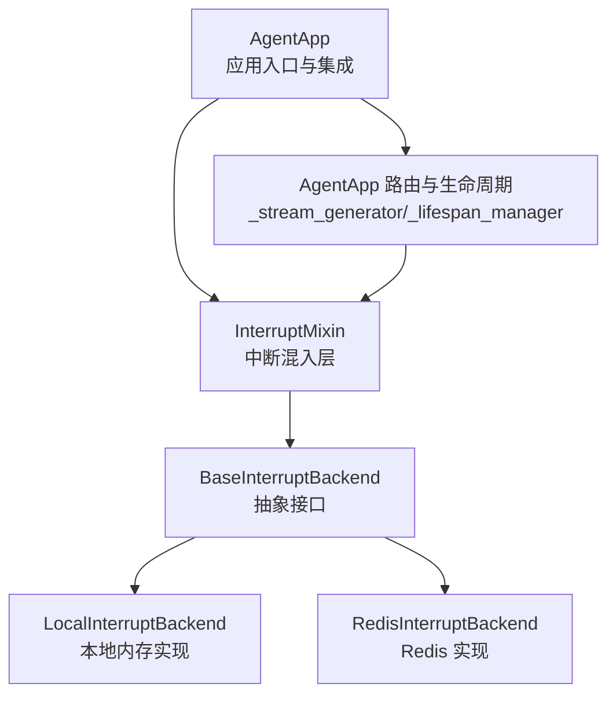
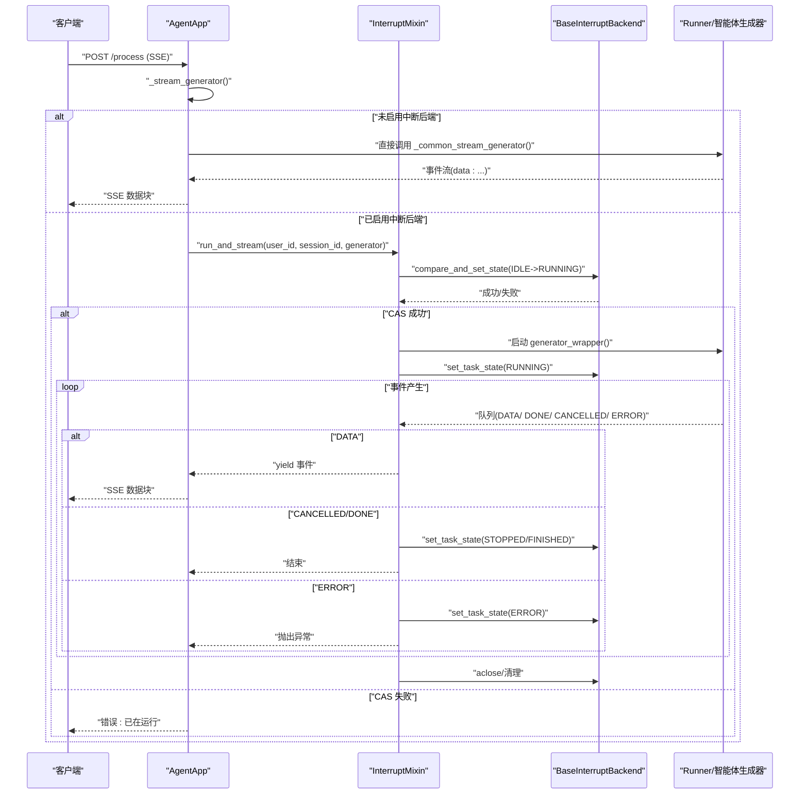
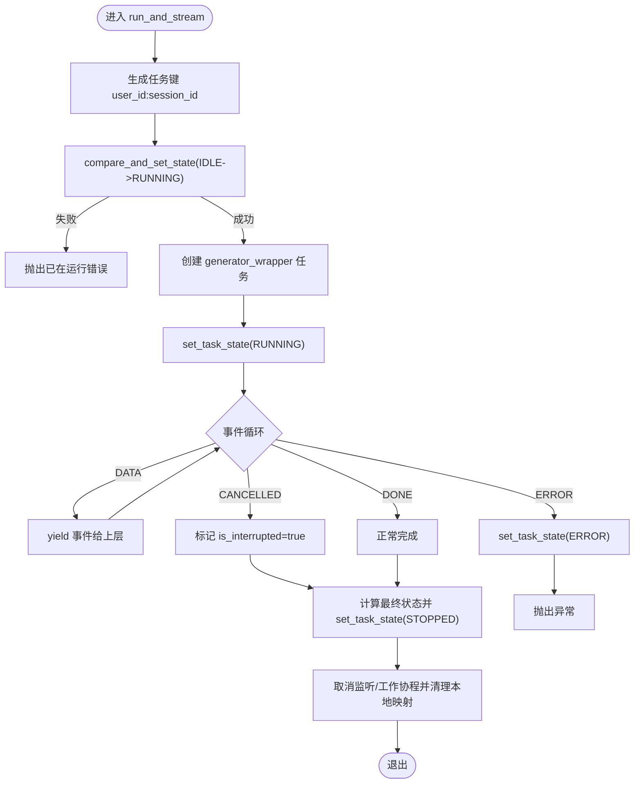
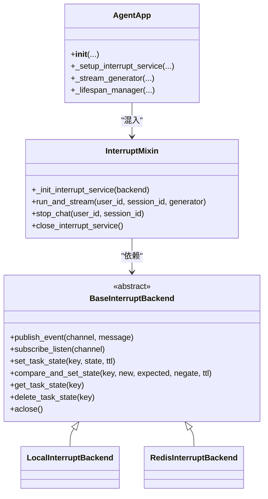

# 中断处理

<cite>
**本文引用的文件**
- [agent_app.py](file://src/agentscope_runtime/engine/app/agent_app.py)
- [interrupt_mixin.py](file://src/agentscope_runtime/engine/deployers/utils/service_utils/interrupt/interrupt_mixin.py)
- [base_backend.py](file://src/agentscope_runtime/engine/deployers/utils/service_utils/interrupt/base_backend.py)
- [local_backend.py](file://src/agentscope_runtime/engine/deployers/utils/service_utils/interrupt/local_backend.py)
- [redis_backend.py](file://src/agentscope_runtime/engine/deployers/utils/service_utils/interrupt/redis_backend.py)
- [interrupt_and_restore_example.py](file://examples/interrupt/interrupt_and_restore_example.py)
- [test_interrupt_mixin.py](file://tests/unit/test_interrupt_mixin.py)
</cite>

## 目录
1. [简介](#简介)
2. [项目结构](#项目结构)
3. [核心组件](#核心组件)
4. [架构总览](#架构总览)
5. [详细组件分析](#详细组件分析)
6. [依赖分析](#依赖分析)
7. [性能考虑](#性能考虑)
8. [故障排除指南](#故障排除指南)
9. [结论](#结论)
10. [附录](#附录)

## 简介
本文件面向开发者，系统性阐述 AgentApp 的中断处理能力与实现细节。AgentApp 通过 InterruptMixin 提供分布式中断管理，支持 LocalInterruptBackend（单机内存）与 RedisInterruptBackend（分布式）两种后端，并在运行时通过 run_and_stream 协调中断服务与智能体执行，实现中断触发、恢复与清理的全链路闭环。文档同时给出高可用配置建议、性能监控要点与常见问题排查方法。

## 项目结构
围绕中断处理的关键代码位于以下模块：
- 应用入口与集成：AgentApp 类负责生命周期、路由注册与中断服务初始化
- 中断混入层：InterruptMixin 提供 run_and_stream、stop_chat、状态持久化等核心逻辑
- 后端接口与实现：BaseInterruptBackend 定义抽象接口；LocalInterruptBackend 与 RedisInterruptBackend 分别提供内存与 Redis 实现
- 示例与测试：示例演示三种后端配置方式与中断恢复流程；单元测试覆盖并发冲突、中断广播、错误状态等场景

图表来源
- [agent_app.py:60-247](file://src/agentscope_runtime/engine/app/agent_app.py#L60-L247)
- [interrupt_mixin.py:8-151](file://src/agentscope_runtime/engine/deployers/utils/service_utils/interrupt/interrupt_mixin.py#L8-L151)
- [base_backend.py:25-90](file://src/agentscope_runtime/engine/deployers/utils/service_utils/interrupt/base_backend.py#L25-L90)
- [local_backend.py:9-132](file://src/agentscope_runtime/engine/deployers/utils/service_utils/interrupt/local_backend.py#L9-L132)
- [redis_backend.py:7-107](file://src/agentscope_runtime/engine/deployers/utils/service_utils/interrupt/redis_backend.py#L7-L107)

章节来源
- [agent_app.py:60-247](file://src/agentscope_runtime/engine/app/agent_app.py#L60-L247)

## 核心组件
- AgentApp：继承 FastAPI 与 UnifiedRoutingMixin，并混入 InterruptMixin，统一管理生命周期、路由与中断服务。构造函数支持通过 interrupt_backend 或 interrupt_redis_url 指定中断后端；若两者均未提供，则默认使用 LocalInterruptBackend。
- InterruptMixin：提供 run_and_stream、stop_chat、状态持久化与监听器管理等能力。内部以 user_id:session_id 组合作为任务键，结合 compare_and_set_state 原子地控制并发与状态流转。
- BaseInterruptBackend 及其实现：
  - LocalInterruptBackend：基于 asyncio primitives 的内存实现，适合单机部署或开发测试。
  - RedisInterruptBackend：基于 Redis 的分布式实现，使用 Lua 脚本保证 CAS 原子性，适合多实例部署。
- 示例与测试：示例展示了三种后端配置方式与中断恢复流程；测试覆盖并发冲突、中断广播、错误状态与清理逻辑。

章节来源
- [agent_app.py:124-247](file://src/agentscope_runtime/engine/app/agent_app.py#L124-L247)
- [interrupt_mixin.py:8-151](file://src/agentscope_runtime/engine/deployers/utils/service_utils/interrupt/interrupt_mixin.py#L8-L151)
- [base_backend.py:25-90](file://src/agentscope_runtime/engine/deployers/utils/service_utils/interrupt/base_backend.py#L25-L90)
- [local_backend.py:9-132](file://src/agentscope_runtime/engine/deployers/utils/service_utils/interrupt/local_backend.py#L9-L132)
- [redis_backend.py:7-107](file://src/agentscope_runtime/engine/deployers/utils/service_utils/interrupt/redis_backend.py#L7-L107)
- [interrupt_and_restore_example.py:47-64](file://examples/interrupt/interrupt_and_restore_example.py#L47-L64)
- [test_interrupt_mixin.py:17-191](file://tests/unit/test_interrupt_mixin.py#L17-L191)

## 架构总览
下图展示 AgentApp 如何在请求处理过程中协调中断服务与智能体执行，以及中断信号的传播路径。

图表来源
- [agent_app.py:643-703](file://src/agentscope_runtime/engine/app/agent_app.py#L643-L703)
- [interrupt_mixin.py:38-139](file://src/agentscope_runtime/engine/deployers/utils/service_utils/interrupt/interrupt_mixin.py#L38-L139)
- [base_backend.py:25-90](file://src/agentscope_runtime/engine/deployers/utils/service_utils/interrupt/base_backend.py#L25-L90)

## 详细组件分析

### AgentApp 中断服务初始化与选择
- 参数优先级：
  - 显式传入 interrupt_backend：直接使用该实例
  - 传入 interrupt_redis_url：使用 RedisInterruptBackend
  - 二者均未提供：使用 LocalInterruptBackend
- 生命周期关闭时会调用 close_interrupt_service，确保后端资源释放

章节来源
- [agent_app.py:210-247](file://src/agentscope_runtime/engine/app/agent_app.py#L210-L247)
- [agent_app.py:308-316](file://src/agentscope_runtime/engine/app/agent_app.py#L308-L316)

### InterruptMixin：run_and_stream 协调逻辑
- 任务键生成：user_id:session_id
- 并发控制：compare_and_set_state 将状态从期望值原子切换到 RUNNING，避免同一会话并发执行
- 执行包装：generator_wrapper 在独立任务中运行，将事件写入队列；捕获 CancelledError 标记中断，异常则置 ERROR
- 监听与取消：_interrupt_signal_listener 订阅 chan:user_id:session_id 频道，收到 STOP 后取消工作协程
- 结束与清理：根据是否中断设置 STOPPED 或 FINISHED；取消监听与工作协程；更新最终状态并清理本地任务映射

图表来源
- [interrupt_mixin.py:38-139](file://src/agentscope_runtime/engine/deployers/utils/service_utils/interrupt/interrupt_mixin.py#L38-L139)

章节来源
- [interrupt_mixin.py:8-151](file://src/agentscope_runtime/engine/deployers/utils/service_utils/interrupt/interrupt_mixin.py#L8-L151)

### 中断触发与恢复流程
- 触发：stop_chat 通过 publish_event 向 chan:user_id:session_id 发送 STOP 信号
- 恢复：当智能体执行在中断点被捕获时，应在业务层调用 agent.interrupt() 以停止底层执行，并保存当前状态
- 清理：run_and_stream 在 finally 中统一取消监听与任务并清理本地映射

章节来源
- [interrupt_mixin.py:140-147](file://src/agentscope_runtime/engine/deployers/utils/service_utils/interrupt/interrupt_mixin.py#L140-L147)
- [interrupt_and_restore_example.py:109-130](file://examples/interrupt/interrupt_and_restore_example.py#L109-L130)

### 后端实现对比与选择
- LocalInterruptBackend
  - 特点：基于 asyncio primitives 的内存实现，无需外部依赖
  - 适用：单机部署、开发与测试环境
- RedisInterruptBackend
  - 特点：基于 Redis 的分布式实现，使用 Lua 脚本保证 CAS 原子性
  - 适用：多实例部署、生产环境

章节来源
- [local_backend.py:9-132](file://src/agentscope_runtime/engine/deployers/utils/service_utils/interrupt/local_backend.py#L9-L132)
- [redis_backend.py:7-107](file://src/agentscope_runtime/engine/deployers/utils/service_utils/interrupt/redis_backend.py#L7-L107)

### 请求处理与中断集成
- _stream_generator：根据是否配置中断后端，选择普通流或带中断的流生成器
- _common_stream_generator：标准 SSE 输出封装
- 生命周期：_lifespan_manager 在启动前构建 Runner，在关闭时统一清理中断服务与 Runner

章节来源
- [agent_app.py:643-703](file://src/agentscope_runtime/engine/app/agent_app.py#L643-L703)
- [agent_app.py:248-316](file://src/agentscope_runtime/engine/app/agent_app.py#L248-L316)

## 依赖分析
- 组件耦合
  - AgentApp 依赖 InterruptMixin 与 Runner，通过 FastAPI 生命周期管理资源
  - InterruptMixin 依赖 BaseInterruptBackend 抽象，具体实现可替换
  - 后端实现分别依赖 asyncio 与 redis.asyncio
- 关系图

图表来源
- [agent_app.py:60-247](file://src/agentscope_runtime/engine/app/agent_app.py#L60-L247)
- [interrupt_mixin.py:8-151](file://src/agentscope_runtime/engine/deployers/utils/service_utils/interrupt/interrupt_mixin.py#L8-L151)
- [base_backend.py:25-90](file://src/agentscope_runtime/engine/deployers/utils/service_utils/interrupt/base_backend.py#L25-L90)
- [local_backend.py:9-132](file://src/agentscope_runtime/engine/deployers/utils/service_utils/interrupt/local_backend.py#L9-L132)
- [redis_backend.py:7-107](file://src/agentscope_runtime/engine/deployers/utils/service_utils/interrupt/redis_backend.py#L7-L107)

## 性能考虑
- 并发控制：compare_and_set_state 使用“非 RUNNING”作为前置条件，避免重复提交；建议合理设置 TTL，防止僵尸状态占用
- 事件队列：run_and_stream 内部使用 asyncio.Queue，注意在高吞吐场景下的背压与缓冲区大小
- Redis 后端：Lua 脚本保证原子性，但网络延迟仍可能成为瓶颈；建议连接池与合理的超时配置
- 生命周期清理：确保 finally 分支中的取消与清理及时执行，避免悬挂任务与资源泄漏

## 故障排除指南
- 并发冲突
  - 现象：提示“已在运行”
  - 排查：确认 compare_and_set_state 是否被其他实例抢先设置为 RUNNING；检查会话键唯一性
- 中断未生效
  - 现象：发送 STOP 后任务未中断
  - 排查：确认订阅频道名称与发布频道一致；检查智能体在中断点是否正确捕获 CancelledError 并调用中断逻辑
- 状态不一致
  - 现象：FINISHED 与 STOPPED 混淆
  - 排查：run_and_stream 会在 finally 中根据 is_interrupted 设置最终状态；确保业务层异常路径不会覆盖状态
- Redis 连接问题
  - 现象：发布/订阅失败或 CAS 不生效
  - 排查：核对 Redis 地址与权限；确认 Lua 脚本可执行；检查网络连通性与超时设置

章节来源
- [test_interrupt_mixin.py:97-142](file://tests/unit/test_interrupt_mixin.py#L97-L142)
- [interrupt_mixin.py:125-139](file://src/agentscope_runtime/engine/deployers/utils/service_utils/interrupt/interrupt_mixin.py#L125-L139)

## 结论
AgentApp 通过 InterruptMixin 将中断管理抽象为统一接口，结合 Local 与 Redis 两种后端实现，既满足单机开发需求，又具备分布式扩展能力。配合 run_and_stream 的原子状态控制与清理流程，能够稳定地支撑中断触发、恢复与清理。生产部署建议采用 Redis 后端，并结合生命周期与状态持久化策略，确保高可用与可观测性。

## 附录

### 配置示例与最佳实践
- 本地模式（默认）
  - 适用：单机开发与测试
  - 配置：不传入 interrupt_backend 与 interrupt_redis_url
  - 参考：[agent_app.py:222-247](file://src/agentscope_runtime/engine/app/agent_app.py#L222-L247)
- Redis 模式（推荐）
  - 适用：多实例部署
  - 配置：传入 interrupt_redis_url
  - 参考：[agent_app.py:222-247](file://src/agentscope_runtime/engine/app/agent_app.py#L222-L247)
- 自定义后端
  - 适用：特殊需求或私有化部署
  - 配置：传入自定义 BaseInterruptBackend 实例
  - 参考：[agent_app.py:222-247](file://src/agentscope_runtime/engine/app/agent_app.py#L222-L247)

### 中断触发与恢复的端点示例
- 触发中断端点：POST /stop，调用 stop_chat(user_id, session_id)
- 参考：[interrupt_and_restore_example.py:155-169](file://examples/interrupt/interrupt_and_restore_example.py#L155-L169)

### 状态枚举与信号
- TaskState：IDLE、RUNNING、STOPPED、FINISHED、ERROR
- InterruptSignal：STOP、PAUSE、RESUME
- 参考：[base_backend.py:7-23](file://src/agentscope_runtime/engine/deployers/utils/service_utils/interrupt/base_backend.py#L7-L23)