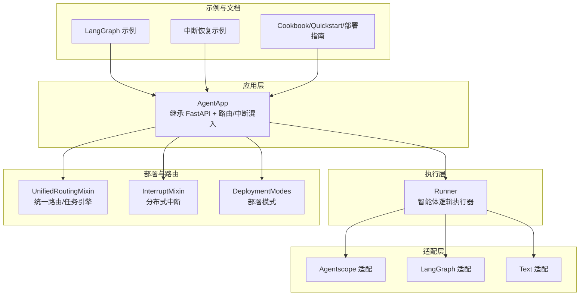
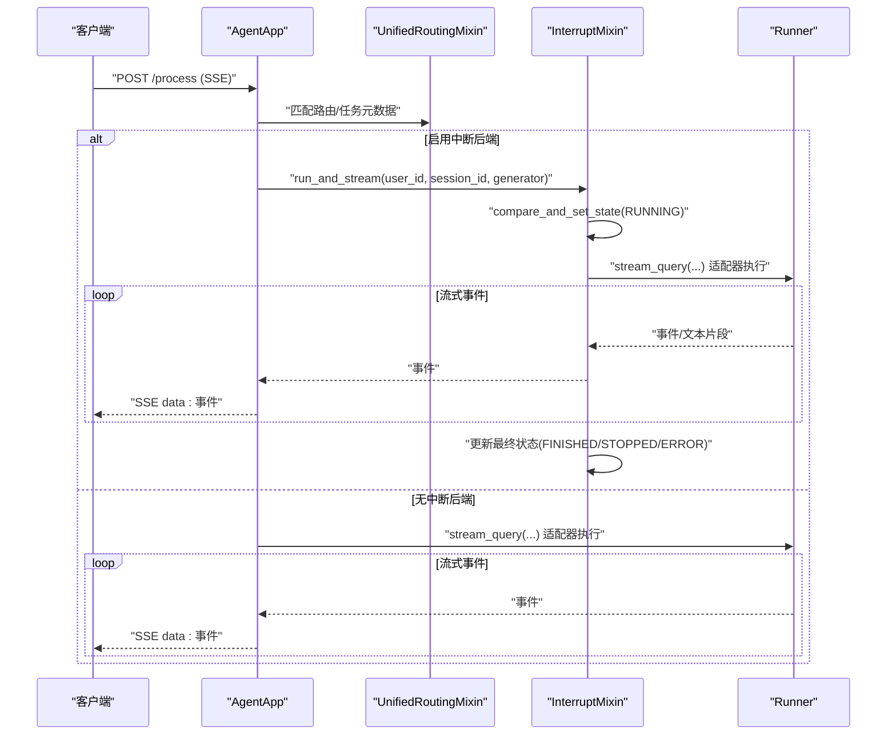
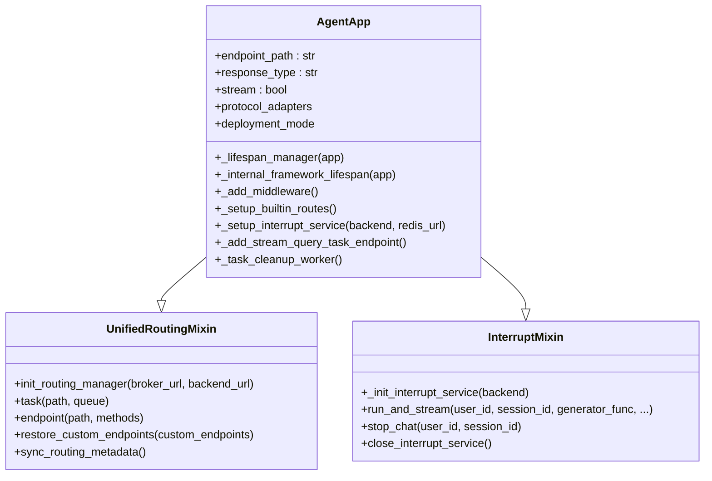
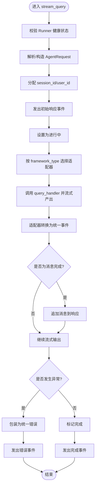
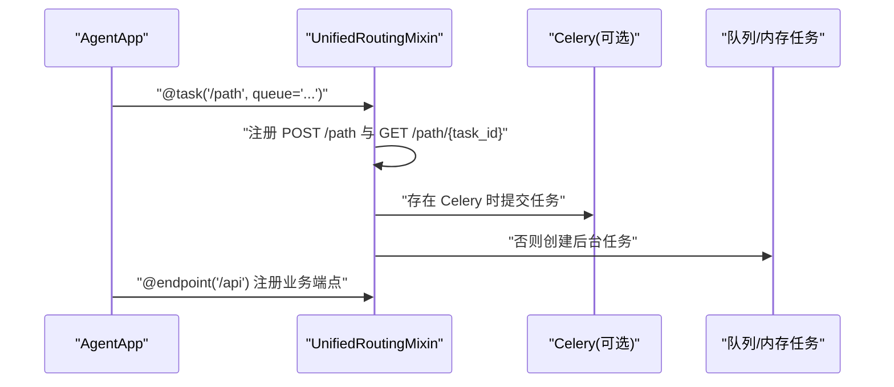
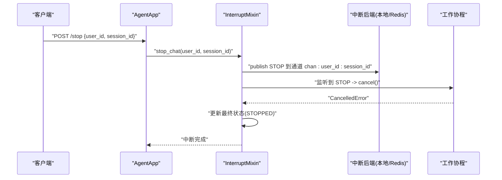
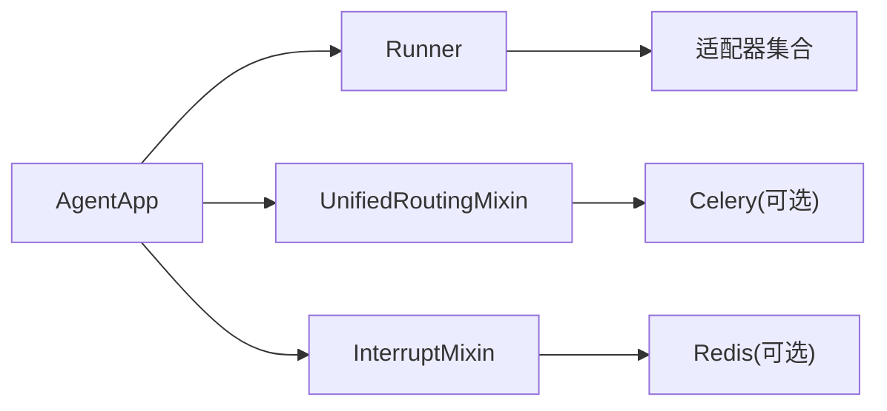

# 智能体应用框架

<cite>
**本文引用的文件**
- [agent_app.py](file://src/agentscope_runtime/engine/app/agent_app.py)
- [runner.py](file://src/agentscope_runtime/engine/runner.py)
- [helpers_runner.py](file://src/agentscope_runtime/engine/helpers/runner.py)
- [unified_routing_mixin.py](file://src/agentscope_runtime/engine/deployers/utils/service_utils/routing/unified_routing_mixin.py)
- [interrupt_mixin.py](file://src/agentscope_runtime/engine/deployers/utils/service_utils/interrupt/interrupt_mixin.py)
- [deployment_modes.py](file://src/agentscope_runtime/engine/deployers/utils/deployment_modes.py)
- [constant.py](file://src/agentscope_runtime/engine/constant.py)
- [agent_app_zh.md](file://cookbook/zh/agent_app.md)
- [quickstart_zh.md](file://cookbook/zh/quickstart.md)
- [advanced_deployment_zh.md](file://cookbook/zh/advanced_deployment.md)
- [interrupt_and_restore_example.py](file://examples/interrupt/interrupt_and_restore_example.py)
- [run_langgraph_agent.py](file://examples/integrations/langgraph/run_langgraph_agent.py)
- [test_agent_app_stream_task.py](file://tests/integrated/test_agent_app_stream_task.py)
</cite>

## 目录
1. [简介](#简介)
2. [项目结构](#项目结构)
3. [核心组件](#核心组件)
4. [架构总览](#架构总览)
5. [详细组件分析](#详细组件分析)
6. [依赖分析](#依赖分析)
7. [性能考虑](#性能考虑)
8. [故障排查指南](#故障排查指南)
9. [结论](#结论)
10. [附录](#附录)

## 简介
本文件面向“智能体应用框架”，系统阐述 AgentApp 作为智能体应用容器的设计理念与架构原理，覆盖生命周期管理、中间件机制、路由系统、任务调度与中断控制、以及 Runner 执行器的工作机制（含智能体逻辑执行、状态管理与错误处理）。文档同时提供可操作的示例路径与最佳实践，帮助初学者快速上手，也为高级开发者提供深入的技术实现细节。

## 项目结构
- 核心入口位于 engine 包，AgentApp 继承自 FastAPI 并混入路由与中断能力；Runner 作为执行器承载智能体逻辑与流式输出。
- deployers 提供多平台部署能力与统一路由/任务引擎；adapters 提供不同智能体框架的消息与流式适配。
- cookbook 提供丰富的使用示例与最佳实践；examples 展示集成案例（如 LangGraph）；tests 提供端到端与单元测试验证。

图示来源
- [agent_app.py:60-120](file://src/agentscope_runtime/engine/app/agent_app.py#L60-L120)
- [runner.py:46-60](file://src/agentscope_runtime/engine/runner.py#L46-L60)
- [unified_routing_mixin.py:16-25](file://src/agentscope_runtime/engine/deployers/utils/service_utils/routing/unified_routing_mixin.py#L16-L25)
- [interrupt_mixin.py:8-15](file://src/agentscope_runtime/engine/deployers/utils/service_utils/interrupt/interrupt_mixin.py#L8-L15)
- [deployment_modes.py:7-14](file://src/agentscope_runtime/engine/deployers/utils/deployment_modes.py#L7-L14)

章节来源
- [agent_app.py:60-120](file://src/agentscope_runtime/engine/app/agent_app.py#L60-L120)
- [runner.py:46-60](file://src/agentscope_runtime/engine/runner.py#L46-L60)
- [unified_routing_mixin.py:16-25](file://src/agentscope_runtime/engine/deployers/utils/service_utils/routing/unified_routing_mixin.py#L16-L25)
- [interrupt_mixin.py:8-15](file://src/agentscope_runtime/engine/deployers/utils/service_utils/interrupt/interrupt_mixin.py#L8-L15)
- [deployment_modes.py:7-14](file://src/agentscope_runtime/engine/deployers/utils/deployment_modes.py#L7-L14)

## 核心组件
- AgentApp：基于 FastAPI 的智能体应用容器，负责生命周期管理、中间件、内置路由、协议适配器、任务清理与中断服务。
- Runner：智能体逻辑执行器，负责启动/停止、流式查询、框架类型适配、事件序列化与错误包装。
- UnifiedRoutingMixin：统一路由与任务引擎，支持自定义端点与后台任务提交、状态轮询。
- InterruptMixin：分布式中断控制，支持跨节点广播停止信号、状态原子切换与优雅取消。
- 部署模式：Daemon Thread、Detached Process、Standalone 等，适配不同运行环境。

章节来源
- [agent_app.py:124-221](file://src/agentscope_runtime/engine/app/agent_app.py#L124-L221)
- [runner.py:46-121](file://src/agentscope_runtime/engine/runner.py#L46-L121)
- [unified_routing_mixin.py:16-114](file://src/agentscope_runtime/engine/deployers/utils/service_utils/routing/unified_routing_mixin.py#L16-L114)
- [interrupt_mixin.py:8-45](file://src/agentscope_runtime/engine/deployers/utils/service_utils/interrupt/interrupt_mixin.py#L8-L45)
- [deployment_modes.py:7-14](file://src/agentscope_runtime/engine/deployers/utils/deployment_modes.py#L7-L14)

## 架构总览
AgentApp 以 FastAPI 为 HTTP 基座，内部通过 Runner 执行智能体逻辑，并通过协议适配器支持多框架消息流。路由系统统一管理业务端点与后台任务，中断系统保障长任务的可控性与可恢复性。

图示来源
- [agent_app.py:643-703](file://src/agentscope_runtime/engine/app/agent_app.py#L643-L703)
- [interrupt_mixin.py:38-139](file://src/agentscope_runtime/engine/deployers/utils/service_utils/interrupt/interrupt_mixin.py#L38-L139)
- [runner.py:199-356](file://src/agentscope_runtime/engine/runner.py#L199-L356)

## 详细组件分析

### AgentApp：应用容器与生命周期
- 继承关系与职责
  - 继承 FastAPI，获得路由、中间件、生命周期管理能力。
  - 混入 UnifiedRoutingMixin，提供统一路由与任务引擎。
  - 混入 InterruptMixin，提供分布式中断控制。
- 生命周期管理
  - 内部 lifespan 负责 Runner 的启动/关闭、协议适配器挂载、中断服务初始化与清理。
  - 用户可通过 lifespan 参数注入自定义生命周期逻辑，AgentApp 内部仍协调 Runner 与中断服务。
- 中间件与内置路由
  - CORS 中间件默认开启。
  - 动态部署模式中间件：根据 DeploymentMode 注入响应头。
  - 内置健康检查、根路径信息、进程控制端点。
- 协议适配器
  - 默认注册 A2A、ResponseAPI、AGUI 适配器，支持多协议统一接入。
- 任务清理与流式任务
  - 可选启用流式任务队列，周期清理过期任务。
  - 提供 /process/task 与 /process/task/{task_id}，支持 Celery 或内存模式。

图示来源
- [agent_app.py:124-221](file://src/agentscope_runtime/engine/app/agent_app.py#L124-L221)
- [unified_routing_mixin.py:16-114](file://src/agentscope_runtime/engine/deployers/utils/service_utils/routing/unified_routing_mixin.py#L16-L114)
- [interrupt_mixin.py:8-45](file://src/agentscope_runtime/engine/deployers/utils/service_utils/interrupt/interrupt_mixin.py#L8-L45)

章节来源
- [agent_app.py:124-221](file://src/agentscope_runtime/engine/app/agent_app.py#L124-L221)
- [agent_app.py:248-316](file://src/agentscope_runtime/engine/app/agent_app.py#L248-L316)
- [agent_app.py:359-425](file://src/agentscope_runtime/engine/app/agent_app.py#L359-L425)
- [agent_app.py:497-597](file://src/agentscope_runtime/engine/app/agent_app.py#L497-L597)
- [agent_app.py:643-703](file://src/agentscope_runtime/engine/app/agent_app.py#L643-L703)

### Runner：执行器与流式查询
- 角色定位
  - Runner 是智能体逻辑的执行核心，负责启动/停止、流式查询、框架类型适配与事件序列化。
- 生命周期与状态
  - start/stop 管理 init_handler/shutdown_handler 与资源栈关闭。
  - 健康状态标记，未启动时禁止调用流式查询。
- 流式查询与适配
  - 根据 framework_type 选择对应适配器（Agentscope/LangGraph/Text/Agno/MS Agent Framework）。
  - 将 query_handler 的输出转换为统一事件流，包含响应创建、进行中、消息追加、完成/失败等状态。
- 错误处理
  - 捕获异常并包装为统一错误对象，记录堆栈日志，保证 SSE 错误事件的稳定性。

图示来源
- [runner.py:199-356](file://src/agentscope_runtime/engine/runner.py#L199-L356)
- [constant.py:2-9](file://src/agentscope_runtime/engine/constant.py#L2-L9)

章节来源
- [runner.py:76-121](file://src/agentscope_runtime/engine/runner.py#L76-L121)
- [runner.py:199-356](file://src/agentscope_runtime/engine/runner.py#L199-L356)
- [constant.py:2-9](file://src/agentscope_runtime/engine/constant.py#L2-L9)

### 路由系统：统一路由与任务引擎
- 统一路由
  - 提供 endpoint 装饰器注册自定义端点；task 装饰器注册后台任务，支持 Celery 或内存模式。
  - 支持任务状态轮询与元数据同步，便于服务发现与运维。
- 自定义端点恢复
  - 支持从元数据重建路由，保证重启/迁移后的路由一致性。

图示来源
- [unified_routing_mixin.py:25-114](file://src/agentscope_runtime/engine/deployers/utils/service_utils/routing/unified_routing_mixin.py#L25-L114)
- [unified_routing_mixin.py:120-237](file://src/agentscope_runtime/engine/deployers/utils/service_utils/routing/unified_routing_mixin.py#L120-L237)

章节来源
- [unified_routing_mixin.py:25-114](file://src/agentscope_runtime/engine/deployers/utils/service_utils/routing/unified_routing_mixin.py#L25-L114)
- [unified_routing_mixin.py:186-237](file://src/agentscope_runtime/engine/deployers/utils/service_utils/routing/unified_routing_mixin.py#L186-L237)

### 任务中断与管理：分布式控制
- 设计要点
  - 通过中断后端（本地/Redis）实现跨节点广播停止信号。
  - 原子状态切换（RUNNING/STOPPED/FINISHED/ERROR），避免并发冲突。
  - 优雅取消：捕获 CancelledError 执行清理（如保存状态）。
- 使用方式
  - 在 AgentApp 中配置中断后端（本地或 Redis）。
  - 在处理函数中支持 asyncio.CancelledError，实现中断感知。
  - 提供 /stop 等触发端点，向指定 user_id/session_id 发送停止信号。

图示来源
- [interrupt_mixin.py:140-147](file://src/agentscope_runtime/engine/deployers/utils/service_utils/interrupt/interrupt_mixin.py#L140-L147)
- [interrupt_mixin.py:20-37](file://src/agentscope_runtime/engine/deployers/utils/service_utils/interrupt/interrupt_mixin.py#L20-L37)
- [interrupt_mixin.py:38-139](file://src/agentscope_runtime/engine/deployers/utils/service_utils/interrupt/interrupt_mixin.py#L38-L139)

章节来源
- [interrupt_mixin.py:8-151](file://src/agentscope_runtime/engine/deployers/utils/service_utils/interrupt/interrupt_mixin.py#L8-L151)
- [agent_app_zh.md:642-670](file://cookbook/zh/agent_app.md#L642-L670)
- [interrupt_and_restore_example.py:155-173](file://examples/interrupt/interrupt_and_restore_example.py#L155-L173)

### 创建与配置 AgentApp 实例
- 最小化示例
  - 参考路径：[最小 AgentApp 示例:55-64](file://cookbook/zh/agent_app.md#L55-L64)
- 使用 Lifespan（推荐）
  - 参考路径：[生命周期管理:184-191](file://cookbook/zh/agent_app.md#L184-L191)，[快速开始:68-98](file://cookbook/zh/quickstart.md#L68-L98)
- 流式输出（SSE）
  - 参考路径：[流式输出说明:118-152](file://cookbook/zh/agent_app.md#L118-L152)
- 自定义端点与中间件
  - 参考路径：[自定义端点:589-618](file://cookbook/zh/agent_app.md#L589-L618)，[中间件:359-381](file://src/agentscope_runtime/engine/app/agent_app.py#L359-L381)

章节来源
- [agent_app_zh.md:55-64](file://cookbook/zh/agent_app.md#L55-L64)
- [agent_app_zh.md:184-191](file://cookbook/zh/agent_app.md#L184-L191)
- [quickstart_zh.md:68-98](file://cookbook/zh/quickstart.md#L68-L98)
- [agent_app_zh.md:118-152](file://cookbook/zh/agent_app.md#L118-L152)
- [agent_app_zh.md:589-618](file://cookbook/zh/agent_app.md#L589-L618)
- [agent_app.py:359-381](file://src/agentscope_runtime/engine/app/agent_app.py#L359-L381)

### 实现自定义 Runner
- 简单 Runner 示例
  - 参考路径：[SimpleRunner:13-27](file://src/agentscope_runtime/engine/helpers/runner.py#L13-L27)
- 错误 Runner 示例
  - 参考路径：[ErrorRunner:29-41](file://src/agentscope_runtime/engine/helpers/runner.py#L29-L41)
- 自定义框架类型
  - 在 Runner 上设置 framework_type，Runner 将按类型选择适配器并流式输出。
  - 参考路径：[Runner 流式查询:199-356](file://src/agentscope_runtime/engine/runner.py#L199-L356)，[允许框架类型:2-9](file://src/agentscope_runtime/engine/constant.py#L2-L9)

章节来源
- [helpers_runner.py:13-41](file://src/agentscope_runtime/engine/helpers/runner.py#L13-L41)
- [runner.py:199-356](file://src/agentscope_runtime/engine/runner.py#L199-L356)
- [constant.py:2-9](file://src/agentscope_runtime/engine/constant.py#L2-L9)

### 集成示例：LangGraph
- 示例说明
  - 展示如何使用 AgentApp 与 LangGraph 集成，注册 init/shutdown/query 端点，并通过 endpoint 装饰器暴露额外接口。
  - 参考路径：[LangGraph 示例:29-172](file://examples/integrations/langgraph/run_langgraph_agent.py#L29-L172)

章节来源
- [run_langgraph_agent.py:29-172](file://examples/integrations/langgraph/run_langgraph_agent.py#L29-L172)

## 依赖分析
- 组件耦合
  - AgentApp 与 Runner 通过装饰器绑定 query_handler/init_handler/shutdown_handler，形成松耦合的执行链。
  - 路由与任务引擎与中断系统解耦，可通过 Mixin 组合灵活启用。
- 外部依赖
  - FastAPI、uvicorn、Celery（可选）、Redis（可选）。
- 潜在循环依赖
  - 采用 Mixin 与延迟导入策略，避免直接循环引用。

图示来源
- [agent_app.py:124-221](file://src/agentscope_runtime/engine/app/agent_app.py#L124-L221)
- [runner.py:20-40](file://src/agentscope_runtime/engine/runner.py#L20-L40)
- [unified_routing_mixin.py:16-25](file://src/agentscope_runtime/engine/deployers/utils/service_utils/routing/unified_routing_mixin.py#L16-L25)
- [interrupt_mixin.py:8-15](file://src/agentscope_runtime/engine/deployers/utils/service_utils/interrupt/interrupt_mixin.py#L8-L15)

章节来源
- [agent_app.py:124-221](file://src/agentscope_runtime/engine/app/agent_app.py#L124-L221)
- [runner.py:20-40](file://src/agentscope_runtime/engine/runner.py#L20-L40)
- [unified_routing_mixin.py:16-25](file://src/agentscope_runtime/engine/deployers/utils/service_utils/routing/unified_routing_mixin.py#L16-L25)
- [interrupt_mixin.py:8-15](file://src/agentscope_runtime/engine/deployers/utils/service_utils/interrupt/interrupt_mixin.py#L8-L15)

## 性能考虑
- 流式输出与背压
  - 使用 SSE 流式输出，避免一次性大响应导致内存压力；在适配器层逐片产出，客户端可边收边渲染。
- 中断与取消
  - 通过中断后端实现长任务的快速停止，减少资源占用；在处理函数中捕获 CancelledError 执行清理。
- 部署模式选择
  - 开发/测试：Daemon Thread；生产单节点：Detached Process；多节点/编排：Kubernetes/Knative/Kruise 等。
  - 参考路径：[部署模式说明:19-51](file://cookbook/zh/advanced_deployment.md#L19-L51)，[DeploymentMode:7-14](file://src/agentscope_runtime/engine/deployers/utils/deployment_modes.py#L7-L14)
- 任务清理
  - 启用流式任务清理定时器，定期移除已完成/失败且超过 TTL 的任务，降低内存与锁竞争。

章节来源
- [advanced_deployment_zh.md:19-51](file://cookbook/zh/advanced_deployment.md#L19-L51)
- [deployment_modes.py:7-14](file://src/agentscope_runtime/engine/deployers/utils/deployment_modes.py#L7-L14)
- [agent_app.py:460-471](file://src/agentscope_runtime/engine/app/agent_app.py#L460-L471)

## 故障排查指南
- 健康检查与根路径
  - 通过 /health 与 / 根路径确认服务状态与端点清单；参考路径：[内置路由:382-425](file://src/agentscope_runtime/engine/app/agent_app.py#L382-L425)
- 流式任务端点可用性
  - 当 enable_stream_task=True 时，/ 会显示 task 与 task_status 端点；参考路径：[根路径端点展示:122-138](file://tests/integrated/test_agent_app_stream_task.py#L122-L138)
- 生命周期钩子异常
  - before_start/after_finish 中的异常会被记录并抛出，影响应用启动；参考路径：[lifespan 管理:317-339](file://src/agentscope_runtime/engine/app/agent_app.py#L317-L339)
- Runner 未启动或框架类型不合法
  - 未调用 Runner.start() 或未设置 framework_type 会导致流式查询报错；参考路径：[Runner 校验:207-219](file://src/agentscope_runtime/engine/runner.py#L207-L219)
- 中断无效或重复运行
  - 若状态非预期或并发冲突，run_and_stream 会拒绝重复启动；参考路径：[中断状态切换:50-63](file://src/agentscope_runtime/engine/deployers/utils/service_utils/interrupt/interrupt_mixin.py#L50-L63)

章节来源
- [agent_app.py:382-425](file://src/agentscope_runtime/engine/app/agent_app.py#L382-L425)
- [test_agent_app_stream_task.py:122-138](file://tests/integrated/test_agent_app_stream_task.py#L122-L138)
- [agent_app.py:317-339](file://src/agentscope_runtime/engine/app/agent_app.py#L317-L339)
- [runner.py:207-219](file://src/agentscope_runtime/engine/runner.py#L207-L219)
- [interrupt_mixin.py:50-63](file://src/agentscope_runtime/engine/deployers/utils/service_utils/interrupt/interrupt_mixin.py#L50-L63)

## 结论
AgentApp 将 FastAPI 的生态能力与智能体执行、路由与中断控制深度融合，提供从开发到生产的全栈支持。通过 Runner 的统一适配与事件序列化，结合多协议适配器与任务中断机制，框架既能满足初学者的快速上手，也能支撑高级用户的复杂场景与高可用要求。

## 附录
- 示例与文档索引
  - [AgentApp 使用与示例](file://cookbook/zh/agent_app.md)
  - [快速开始](file://cookbook/zh/quickstart.md)
  - [高级部署指南](file://cookbook/zh/advanced_deployment.md)
  - [LangGraph 集成示例](file://examples/integrations/langgraph/run_langgraph_agent.py)
  - [中断与恢复示例](file://examples/interrupt/interrupt_and_restore_example.py)
- 测试参考
  - [流式任务端点测试](file://tests/integrated/test_agent_app_stream_task.py)