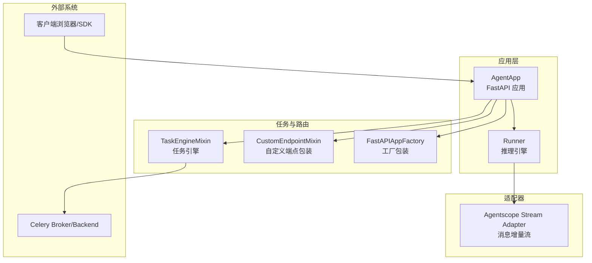
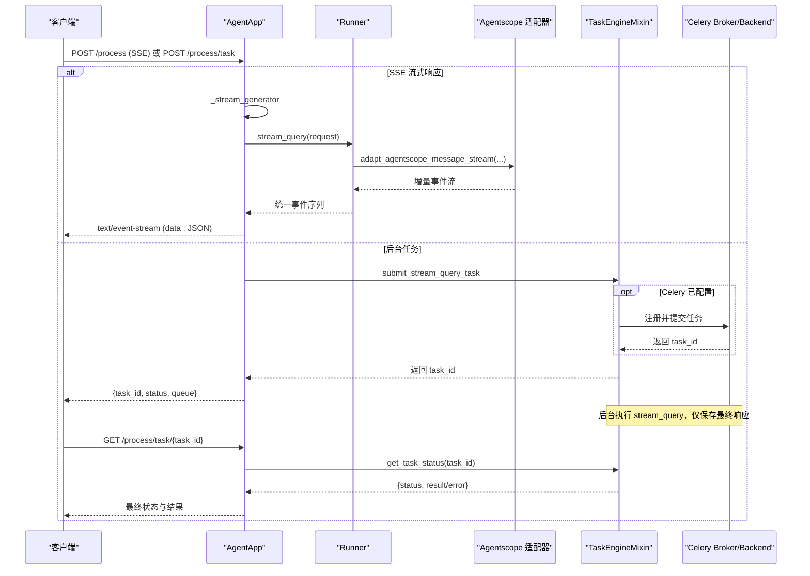
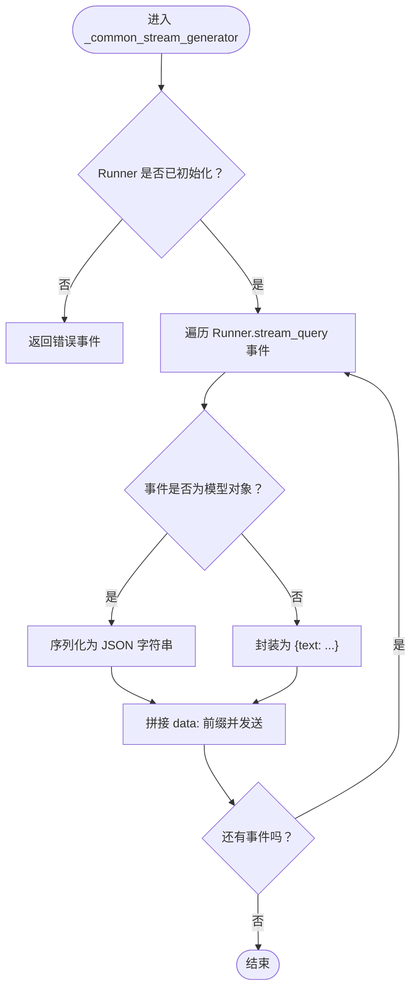
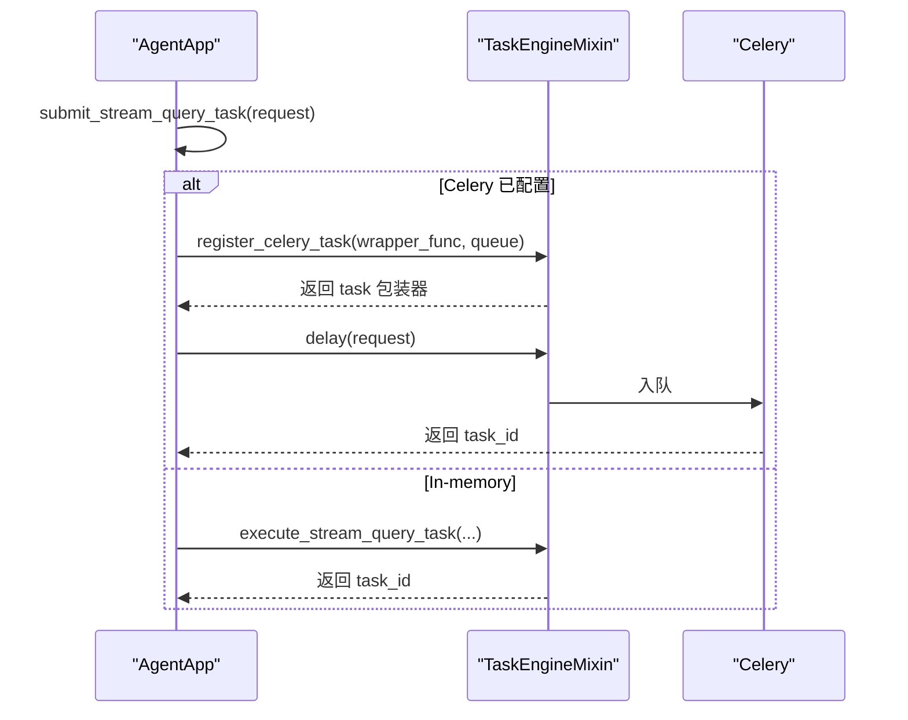
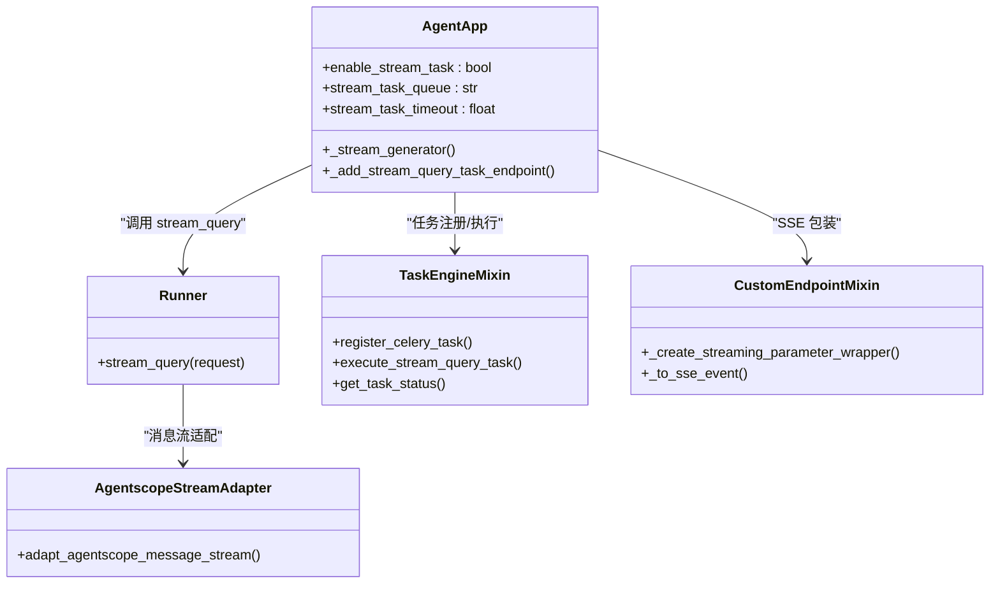

# 流式处理

<cite>
**本文引用的文件**
- [agent_app.py](file://src/agentscope_runtime/engine/app/agent_app.py)
- [task_engine_mixin.py](file://src/agentscope_runtime/engine/deployers/utils/service_utils/routing/task_engine_mixin.py)
- [custom_endpoint_mixin.py](file://src/agentscope_runtime/engine/deployers/utils/service_utils/routing/custom_endpoint_mixin.py)
- [fastapi_factory.py](file://src/agentscope_runtime/engine/deployers/utils/service_utils/fastapi_factory.py)
- [runner.py](file://src/agentscope_runtime/engine/runner.py)
- [stream.py（agentscope适配器）](file://src/agentscope_runtime/adapters/agentscope/stream.py)
- [test_agent_app_stream_task.py](file://tests/integrated/test_agent_app_stream_task.py)
- [agent_app.md（中文）](file://cookbook/zh/agent_app.md)
</cite>

## 目录
1. [简介](#简介)
2. [项目结构与角色定位](#项目结构与角色定位)
3. [核心组件](#核心组件)
4. [架构总览](#架构总览)
5. [详细组件分析](#详细组件分析)
6. [依赖关系分析](#依赖关系分析)
7. [性能考量](#性能考量)
8. [故障排查指南](#故障排查指南)
9. [结论](#结论)
10. [附录](#附录)

## 简介
本章节面向开发者，系统性讲解 AgentApp 的流式处理能力，重点覆盖：
- SSE（Server-Sent Events）流式响应的实现机制与数据格式规范
- 流式查询的任务化执行：后台任务支持、任务队列管理、过期清理
- enable_stream_task 配置项的作用与影响
- _stream_query_celery_task 的实现与注册流程
- 实现流式响应、处理流式数据与管理流式任务状态的实践路径
- 性能优化、错误处理与超时管理策略

## 项目结构与角色定位
- AgentApp：FastAPI 应用主体，负责路由注册、生命周期管理、SSE 流式响应包装、后台任务调度与状态管理
- Runner：核心推理引擎，提供 stream_query 接口，按框架类型适配消息流
- TaskEngineMixin：通用任务引擎混入，提供 Celery 初始化、任务注册、后台执行、状态查询与过期清理
- 适配器层（adapters）：将不同框架的消息流转换为统一的增量事件流
- 测试与文档：集成测试验证后台任务行为，Cookbook 提供使用说明与最佳实践

图表来源
- [agent_app.py:60-220](file://src/agentscope_runtime/engine/app/agent_app.py#L60-L220)
- [runner.py:46-120](file://src/agentscope_runtime/engine/runner.py#L46-L120)
- [task_engine_mixin.py:13-46](file://src/agentscope_runtime/engine/deployers/utils/service_utils/routing/task_engine_mixin.py#L13-L46)
- [custom_endpoint_mixin.py:15-58](file://src/agentscope_runtime/engine/deployers/utils/service_utils/routing/custom_endpoint_mixin.py#L15-L58)
- [fastapi_factory.py:743-839](file://src/agentscope_runtime/engine/deployers/utils/service_utils/fastapi_factory.py#L743-L839)
- [stream.py（agentscope适配器）:33-684](file://src/agentscope_runtime/adapters/agentscope/stream.py#L33-L684)

章节来源
- [agent_app.py:60-220](file://src/agentscope_runtime/engine/app/agent_app.py#L60-L220)
- [runner.py:46-120](file://src/agentscope_runtime/engine/runner.py#L46-L120)

## 核心组件
- AgentApp.SSE 流生成器：_stream_generator/_common_stream_generator 将 Runner 的事件序列转换为标准 SSE 数据帧
- Runner.stream_query：按框架类型选择适配器，输出统一增量事件流，并在结束时汇总 usage 与状态
- TaskEngineMixin：提供 Celery 初始化、任务注册、后台执行、状态查询、过期清理
- Agentscope 适配器：将框架消息流转换为增量内容块（文本、思考、工具调用、工具结果等），并产出 in_progress/completed 事件
- 自定义端点包装：为任意 handler 提供 SSE 包装，支持同步/异步/生成器函数

章节来源
- [agent_app.py:643-702](file://src/agentscope_runtime/engine/app/agent_app.py#L643-L702)
- [runner.py:200-356](file://src/agentscope_runtime/engine/runner.py#L200-L356)
- [task_engine_mixin.py:13-46](file://src/agentscope_runtime/engine/deployers/utils/service_utils/routing/task_engine_mixin.py#L13-L46)
- [stream.py（agentscope适配器）:33-684](file://src/agentscope_runtime/adapters/agentscope/stream.py#L33-L684)
- [custom_endpoint_mixin.py:157-206](file://src/agentscope_runtime/engine/deployers/utils/service_utils/routing/custom_endpoint_mixin.py#L157-L206)

## 架构总览
下图展示了从请求到 SSE 响应与后台任务执行的关键路径，以及错误与超时处理的落点。

图表来源
- [agent_app.py:643-702](file://src/agentscope_runtime/engine/app/agent_app.py#L643-L702)
- [runner.py:200-356](file://src/agentscope_runtime/engine/runner.py#L200-L356)
- [task_engine_mixin.py:241-347](file://src/agentscope_runtime/engine/deployers/utils/service_utils/routing/task_engine_mixin.py#L241-L347)
- [custom_endpoint_mixin.py:157-206](file://src/agentscope_runtime/engine/deployers/utils/service_utils/routing/custom_endpoint_mixin.py#L157-L206)

## 详细组件分析

### SSE 流式响应与数据格式规范
- 数据帧格式
  - 每个事件以“data: ”前缀的 JSON 文本行组成，末尾跟随两个换行符（\n\n）
  - JSON 内容由适配器或内部包装器序列化，保证可被 SSE 客户端正确解析
- 事件来源
  - Runner.stream_query 输出统一事件序列（含 AgentResponse 初始、in_progress、增量内容块、completed）
  - Agentscope 适配器将框架消息转换为增量内容块（文本、思考、工具调用、工具结果等），并在每条消息结束时发出 completed
- 错误处理
  - 任何异常会被捕获并转换为包含 error、error_type、message 的错误事件，随后终止流

图表来源
- [agent_app.py:690-702](file://src/agentscope_runtime/engine/app/agent_app.py#L690-L702)
- [runner.py:200-356](file://src/agentscope_runtime/engine/runner.py#L200-L356)
- [stream.py（agentscope适配器）:33-684](file://src/agentscope_runtime/adapters/agentscope/stream.py#L33-L684)

章节来源
- [agent_app.py:643-702](file://src/agentscope_runtime/engine/app/agent_app.py#L643-L702)
- [runner.py:200-356](file://src/agentscope_runtime/engine/runner.py#L200-L356)
- [custom_endpoint_mixin.py:94-123](file://src/agentscope_runtime/engine/deployers/utils/service_utils/routing/custom_endpoint_mixin.py#L94-L123)

### _stream_generator 方法工作原理
- 条件分支
  - 若未配置中断后端：直接调用 _common_stream_generator 生成 SSE
  - 若配置了中断后端：通过 run_and_stream 包装，结合用户/会话维度的中断能力生成 SSE
- 异常兜底
  - 任何异常被捕获并转换为错误事件，确保客户端收到明确的错误信息

章节来源
- [agent_app.py:643-688](file://src/agentscope_runtime/engine/app/agent_app.py#L643-L688)

### Runner.stream_query 与 Agentscope 适配器
- Runner.stream_query
  - 校验框架类型与健康状态
  - 生成初始 AgentResponse 并标记 in_progress
  - 根据 framework_type 选择对应适配器（agentscope/langgraph/agno/ms_agent_framework/text）
  - 将 query_handler 的事件流经适配器转换为统一增量事件
  - 结束时汇总 usage 并标记 completed 或 failed
- Agentscope 适配器
  - 支持文本、思考、工具调用、工具结果等多模态增量内容
  - 对每条消息/思考/工具块生成 in_progress 与 completed 事件
  - 支持自定义类型转换器，扩展新的内容块类型

章节来源
- [runner.py:200-356](file://src/agentscope_runtime/engine/runner.py#L200-L356)
- [stream.py（agentscope适配器）:33-684](file://src/agentscope_runtime/adapters/agentscope/stream.py#L33-L684)

### enable_stream_task 配置与后台任务
- 配置项
  - enable_stream_task：是否启用后台任务模式
  - stream_task_queue：任务队列名（默认 "stream_query"）
  - stream_task_timeout：任务超时时间（秒，可选）
- 行为差异
  - 关闭：仅支持实时 SSE 流式响应
  - 开启：注册 /process/task 与 /process/task/{task_id} 端点，支持提交后台任务与轮询状态
- 生命周期
  - 应用启动时，若开启后台任务，启动周期性过期清理协程
  - 任务完成后仅保存最终响应，不保留中间事件

章节来源
- [agent_app.py:124-178](file://src/agentscope_runtime/engine/app/agent_app.py#L124-L178)
- [agent_app.py:279-283](file://src/agentscope_runtime/engine/app/agent_app.py#L279-L283)
- [agent_app.py:426-471](file://src/agentscope_runtime/engine/app/agent_app.py#L426-L471)
- [agent_app.md（中文）:305-449](file://cookbook/zh/agent_app.md#L305-L449)

### _stream_query_celery_task 的实现与注册
- 注册时机
  - 首次提交后台任务时，若未注册则创建包装函数并注册到指定队列
- 包装函数职责
  - 仅收集 stream_query 的最后一个事件作为最终响应，忽略中间事件，降低内存占用
- 执行路径
  - Celery 模式：通过 register_celery_task 注册任务，delay 提交
  - In-memory 模式：通过 execute_stream_query_task 在进程中异步执行

图表来源
- [agent_app.py:549-590](file://src/agentscope_runtime/engine/app/agent_app.py#L549-L590)
- [agent_app.py:472-495](file://src/agentscope_runtime/engine/app/agent_app.py#L472-L495)
- [task_engine_mixin.py:65-110](file://src/agentscope_runtime/engine/deployers/utils/service_utils/routing/task_engine_mixin.py#L65-L110)
- [task_engine_mixin.py:241-347](file://src/agentscope_runtime/engine/deployers/utils/service_utils/routing/task_engine_mixin.py#L241-L347)

章节来源
- [agent_app.py:472-590](file://src/agentscope_runtime/engine/app/agent_app.py#L472-L590)
- [task_engine_mixin.py:65-110](file://src/agentscope_runtime/engine/deployers/utils/service_utils/routing/task_engine_mixin.py#L65-L110)
- [task_engine_mixin.py:241-347](file://src/agentscope_runtime/engine/deployers/utils/service_utils/routing/task_engine_mixin.py#L241-L347)

### 任务队列管理与过期清理
- 任务状态
  - submitted：已提交但尚未开始
  - running：正在执行
  - completed：执行成功，结果为最终响应
  - failed/error：执行失败，包含错误信息
- 过期清理
  - 定时任务每 5 分钟扫描一次
  - 清理已完成/失败且超过 1 小时的任务与锁
  - 记录清理数量与当前活跃任务数

章节来源
- [agent_app.py:426-471](file://src/agentscope_runtime/engine/app/agent_app.py#L426-L471)
- [task_engine_mixin.py:349-391](file://src/agentscope_runtime/engine/deployers/utils/service_utils/routing/task_engine_mixin.py#L349-L391)

### 自定义端点的 SSE 包装
- 支持 handler 类型
  - 异步生成器、同步生成器、异步函数、同步函数
- 关键点
  - 为避免 FastAPI 对装饰器的误判，手动复制签名与元信息，不使用 functools.wraps
  - 将任意可序列化对象转换为 data: JSON 的 SSE 事件
  - 发生异常时，返回标准化错误事件

章节来源
- [custom_endpoint_mixin.py:15-58](file://src/agentscope_runtime/engine/deployers/utils/service_utils/routing/custom_endpoint_mixin.py#L15-L58)
- [custom_endpoint_mixin.py:157-206](file://src/agentscope_runtime/engine/deployers/utils/service_utils/routing/custom_endpoint_mixin.py#L157-L206)
- [fastapi_factory.py:743-839](file://src/agentscope_runtime/engine/deployers/utils/service_utils/fastapi_factory.py#L743-L839)

## 依赖关系分析
- AgentApp 依赖 Runner 提供的流式接口；Runner 依赖适配器层将框架消息转换为统一事件
- TaskEngineMixin 为 AgentApp 提供 Celery/in-memory 两种任务执行模式
- 自定义端点包装器独立于 AgentApp，可复用于其他路由

图表来源
- [agent_app.py:60-220](file://src/agentscope_runtime/engine/app/agent_app.py#L60-L220)
- [runner.py:200-356](file://src/agentscope_runtime/engine/runner.py#L200-L356)
- [task_engine_mixin.py:13-46](file://src/agentscope_runtime/engine/deployers/utils/service_utils/routing/task_engine_mixin.py#L13-L46)
- [custom_endpoint_mixin.py:15-58](file://src/agentscope_runtime/engine/deployers/utils/service_utils/routing/custom_endpoint_mixin.py#L15-L58)
- [stream.py（agentscope适配器）:33-684](file://src/agentscope_runtime/adapters/agentscope/stream.py#L33-L684)

章节来源
- [agent_app.py:60-220](file://src/agentscope_runtime/engine/app/agent_app.py#L60-L220)
- [runner.py:200-356](file://src/agentscope_runtime/engine/runner.py#L200-L356)
- [task_engine_mixin.py:13-46](file://src/agentscope_runtime/engine/deployers/utils/service_utils/routing/task_engine_mixin.py#L13-L46)
- [custom_endpoint_mixin.py:15-58](file://src/agentscope_runtime/engine/deployers/utils/service_utils/routing/custom_endpoint_mixin.py#L15-L58)
- [stream.py（agentscope适配器）:33-684](file://src/agentscope_runtime/adapters/agentscope/stream.py#L33-L684)

## 性能考量
- 中间事件裁剪
  - 后台任务仅保存最终响应，避免中间事件占用内存
- 任务并发与队列
  - Celery 模式可通过队列隔离与并发控制提升吞吐
- 序列化开销
  - SSE 事件序列化采用深度限制与类型降级策略，避免深层嵌套导致的性能问题
- 超时与重试
  - 为后台任务配置合理超时，防止长时间阻塞
  - 自定义端点包装对异常进行标准化处理，避免客户端解析失败

[本节为通用指导，无需特定文件引用]

## 故障排查指南
- SSE 无法接收数据
  - 检查客户端是否设置 Accept: text/event-stream
  - 确认服务端返回媒体类型为 text/event-stream
- 任务状态一直 pending
  - 确认 Celery 已启动并监听对应队列
  - 检查任务是否被注册到正确的队列
- 任务超时
  - 调整 stream_task_timeout，或优化 agent 处理逻辑
- 错误事件
  - 客户端收到包含 error/error_type/message 的事件，需根据错误类型定位上游异常

章节来源
- [custom_endpoint_mixin.py:166-176](file://src/agentscope_runtime/engine/deployers/utils/service_utils/routing/custom_endpoint_mixin.py#L166-L176)
- [task_engine_mixin.py:325-335](file://src/agentscope_runtime/engine/deployers/utils/service_utils/routing/task_engine_mixin.py#L325-L335)

## 结论
AgentApp 的流式处理以 SSE 为核心，结合 Runner 的统一事件流与适配器层的增量内容生成，实现了跨框架的一致体验。通过 enable_stream_task 可将长耗时任务转为后台执行，配合 Celery/in-memory 模式与过期清理机制，满足生产环境的稳定性与可观测性需求。开发者可据此快速实现流式响应、任务化执行与状态查询，并在性能与可靠性之间取得平衡。

[本节为总结，无需特定文件引用]

## 附录

### 代码示例路径（不含具体代码内容）
- 实现流式响应（SSE）
  - [agent_app.py:799-800](file://src/agentscope_runtime/engine/app/agent_app.py#L799-L800)
  - [agent_app.py:690-702](file://src/agentscope_runtime/engine/app/agent_app.py#L690-L702)
- 处理流式数据（客户端侧）
  - [chat.py:719-737](file://src/agentscope_runtime/cli/commands/chat.py#L719-L737)
- 管理流式任务状态
  - [agent_app.py:592-596](file://src/agentscope_runtime/engine/app/agent_app.py#L592-L596)
  - [task_engine_mixin.py:349-391](file://src/agentscope_runtime/engine/deployers/utils/service_utils/routing/task_engine_mixin.py#L349-L391)
- 后台任务提交与执行
  - [agent_app.py:549-590](file://src/agentscope_runtime/engine/app/agent_app.py#L549-L590)
  - [task_engine_mixin.py:241-347](file://src/agentscope_runtime/engine/deployers/utils/service_utils/routing/task_engine_mixin.py#L241-L347)
- 集成测试参考
  - [test_agent_app_stream_task.py:121-277](file://tests/integrated/test_agent_app_stream_task.py#L121-L277)
- 使用说明与最佳实践
  - [agent_app.md（中文）:305-449](file://cookbook/zh/agent_app.md#L305-L449)