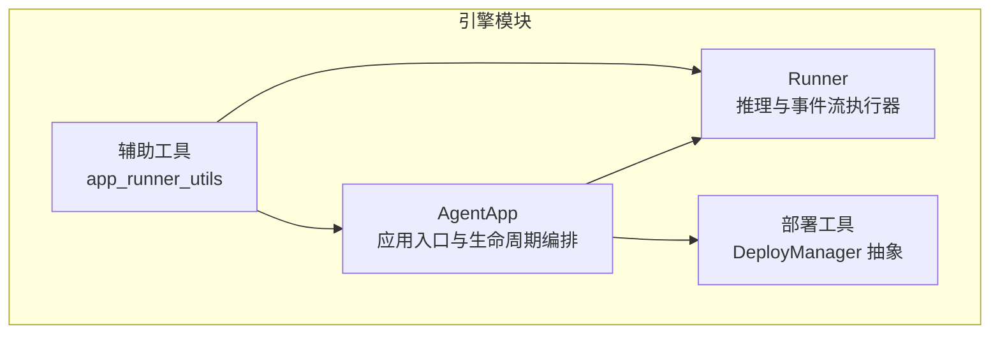
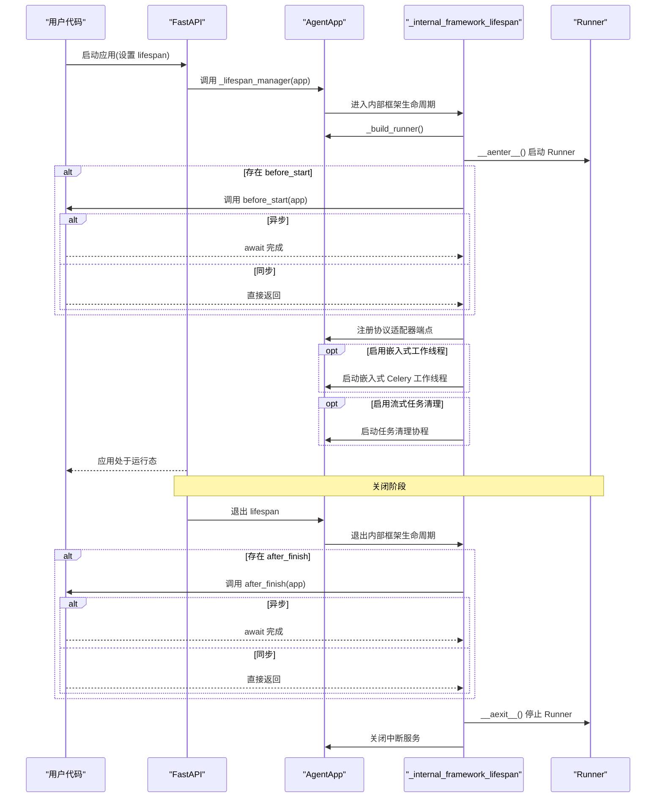
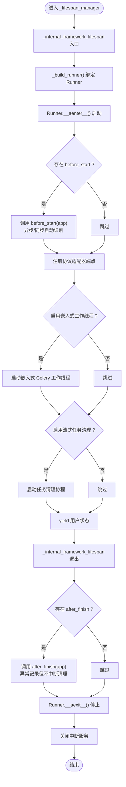
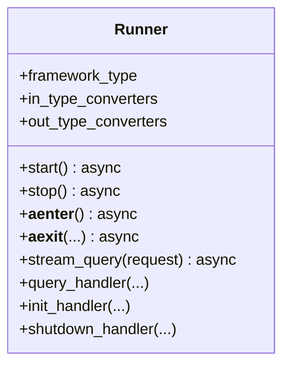
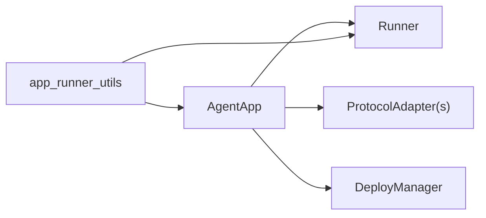

# 生命周期管理

<cite>
**本文引用的文件**
- [agent_app.py](file://src/agentscope_runtime/engine/app/agent_app.py)
- [runner.py](file://src/agentscope_runtime/engine/runner.py)
- [app_runner_utils.py](file://src/agentscope_runtime/engine/deployers/utils/app_runner_utils.py)
- [base.py](file://src/agentscope_runtime/engine/deployers/base.py)
</cite>

## 目录
1. [简介](#简介)
2. [项目结构](#项目结构)
3. [核心组件](#核心组件)
4. [架构总览](#架构总览)
5. [详细组件分析](#详细组件分析)
6. [依赖分析](#依赖分析)
7. [性能考虑](#性能考虑)
8. [故障排查指南](#故障排查指南)
9. [结论](#结论)
10. [附录](#附录)

## 简介
本文件聚焦于 AgentApp 的生命周期管理，系统性阐述从启动到运行再到关闭的完整流程，重点解析以下关键点：
- _lifespan_manager 如何协调内部框架逻辑与用户自定义逻辑
- _internal_framework_lifespan 如何管理 Runner 实例的创建、绑定与清理
- before_start 与 after_finish 钩子的使用场景与最佳实践
- 异步与同步钩子的处理方式
- 异常处理、资源清理与优雅关闭的实现细节
- 提供可直接参考的代码片段路径，帮助开发者快速实现自定义生命周期钩子

## 项目结构
AgentApp 生命周期相关的核心代码位于引擎模块中，主要涉及应用层（AgentApp）与运行器（Runner）两个关键组件，以及部署工具与基类。

图表来源
- [agent_app.py:124-221](file://src/agentscope_runtime/engine/app/agent_app.py#L124-L221)
- [runner.py:46-121](file://src/agentscope_runtime/engine/runner.py#L46-L121)
- [base.py:9-44](file://src/agentscope_runtime/engine/deployers/base.py#L9-L44)
- [app_runner_utils.py:12-29](file://src/agentscope_runtime/engine/deployers/utils/app_runner_utils.py#L12-L29)

章节来源
- [agent_app.py:124-221](file://src/agentscope_runtime/engine/app/agent_app.py#L124-L221)
- [runner.py:46-121](file://src/agentscope_runtime/engine/runner.py#L46-L121)
- [base.py:9-44](file://src/agentscope_runtime/engine/deployers/base.py#L9-L44)
- [app_runner_utils.py:12-29](file://src/agentscope_runtime/engine/deployers/utils/app_runner_utils.py#L12-L29)

## 核心组件
- AgentApp：继承 FastAPI 并混入统一路由与中断能力，通过 FastAPI 的 lifespan 参数统一管理启动/关闭；内置 _lifespan_manager 作为主协调器，_internal_framework_lifespan 负责内部 Runner 与协议适配器的初始化与清理。
- Runner：负责实际的推理执行、事件流生成与资源管理，支持异步/同步钩子，提供 __aenter__/__aexit__ 以配合上下文管理进行生命周期控制。
- DeployManager：部署抽象接口，用于将 AgentApp/Runner 部署到不同平台。
- app_runner_utils：在部署或外部场景下，从 AgentApp 中安全提取/构建 Runner 的辅助工具。

章节来源
- [agent_app.py:60-106](file://src/agentscope_runtime/engine/app/agent_app.py#L60-L106)
- [runner.py:46-121](file://src/agentscope_runtime/engine/runner.py#L46-L121)
- [base.py:9-44](file://src/agentscope_runtime/engine/deployers/base.py#L9-L44)
- [app_runner_utils.py:12-29](file://src/agentscope_runtime/engine/deployers/utils/app_runner_utils.py#L12-L29)

## 架构总览
AgentApp 的生命周期由 FastAPI 的 lifespan 驱动，内部通过 _lifespan_manager 将“用户自定义逻辑”与“框架内部逻辑”串联起来。_internal_framework_lifespan 负责：
- 绑定并启动 Runner
- 注册协议适配器端点
- 可选地启动嵌入式 Celery 工作线程与任务清理协程
- 在退出时依次调用 after_finish 钩子、关闭 Runner、释放中断服务等

图表来源
- [agent_app.py:152-162](file://src/agentscope_runtime/engine/app/agent_app.py#L152-L162)
- [agent_app.py:318-339](file://src/agentscope_runtime/engine/app/agent_app.py#L318-L339)
- [agent_app.py:248-316](file://src/agentscope_runtime/engine/app/agent_app.py#L248-L316)
- [runner.py:105-121](file://src/agentscope_runtime/engine/runner.py#L105-L121)

## 详细组件分析

### AgentApp 生命周期编排：_lifespan_manager 与 _internal_framework_lifespan
- FastAPI 的 lifespan 参数被设置为 _lifespan_manager，该方法使用 AsyncExitStack 组织“用户自定义 lifespan”与“内部框架 lifespan”的嵌套。
- _internal_framework_lifespan 负责：
  - 绑定 Runner 并进入上下文（先尝试退出旧实例，再进入新实例）
  - 执行 before_start 钩子（自动识别异步/同步）
  - 根据 stream 选择查询模式，注册协议适配器端点
  - 可选启用嵌入式 Celery 工作线程与流式任务清理协程
  - finally 分支中执行 after_finish 钩子、关闭 Runner、关闭中断服务
- 该设计确保了“用户自定义逻辑”与“框架内部逻辑”的解耦与顺序可控。

图表来源
- [agent_app.py:318-339](file://src/agentscope_runtime/engine/app/agent_app.py#L318-L339)
- [agent_app.py:248-316](file://src/agentscope_runtime/engine/app/agent_app.py#L248-L316)
- [runner.py:105-121](file://src/agentscope_runtime/engine/runner.py#L105-L121)

章节来源
- [agent_app.py:152-162](file://src/agentscope_runtime/engine/app/agent_app.py#L152-L162)
- [agent_app.py:318-339](file://src/agentscope_runtime/engine/app/agent_app.py#L318-L339)
- [agent_app.py:248-316](file://src/agentscope_runtime/engine/app/agent_app.py#L248-L316)
- [runner.py:105-121](file://src/agentscope_runtime/engine/runner.py#L105-L121)

### Runner 生命周期：start/stop 与上下文管理
- Runner 提供 start()/stop() 与 __aenter__/__aexit__，用于统一的异步资源管理。
- 在 start() 中会调用 init_handler（若存在），并在 stop() 中调用 shutdown_handler（若存在），同时关闭 AsyncExitStack 与可能的部署管理器。
- stream_query 在调用前会校验 Runner 健康状态与框架类型合法性，保证在正确的生命周期阶段执行推理。

图表来源
- [runner.py:46-121](file://src/agentscope_runtime/engine/runner.py#L46-L121)
- [runner.py:199-356](file://src/agentscope_runtime/engine/runner.py#L199-L356)

章节来源
- [runner.py:46-121](file://src/agentscope_runtime/engine/runner.py#L46-L121)
- [runner.py:199-356](file://src/agentscope_runtime/engine/runner.py#L199-L356)

### 协议适配器与端点注册
- AgentApp 在内部生命周期中根据 stream 标志选择 query 或 stream_query，并为每个协议适配器注册端点。
- 支持 A2A、ResponseAPI、AGUI 等默认适配器，也可传入自定义适配器列表。

章节来源
- [agent_app.py:273-274](file://src/agentscope_runtime/engine/app/agent_app.py#L273-L274)
- [agent_app.py:340-357](file://src/agentscope_runtime/engine/app/agent_app.py#L340-L357)

### 流式任务清理与后台工作线程
- 当启用 enable_stream_task 时，_internal_framework_lifespan 会启动一个周期性任务清理协程，定期移除超时完成的任务。
- 当启用 enable_embedded_worker 且存在 Celery 实例时，会启动嵌入式 Celery 工作线程以执行流式查询任务。

章节来源
- [agent_app.py:279-283](file://src/agentscope_runtime/engine/app/agent_app.py#L279-L283)
- [agent_app.py:460-471](file://src/agentscope_runtime/engine/app/agent_app.py#L460-L471)

### 中断服务与优雅关闭
- AgentApp 支持本地或 Redis 中断后端，可在流式生成过程中响应中断。
- 优雅关闭通过 /shutdown 与 /admin/shutdown 端点触发 SIGTERM，配合 lifespan 清理流程实现平滑退出。

章节来源
- [agent_app.py:222-246](file://src/agentscope_runtime/engine/app/agent_app.py#L222-L246)
- [agent_app.py:601-626](file://src/agentscope_runtime/engine/app/agent_app.py#L601-L626)

## 依赖分析
- AgentApp 依赖 Runner 进行推理与事件流生成；同时依赖协议适配器与部署工具链。
- app_runner_utils 提供从 AgentApp 安全获取/构建 Runner 的能力，便于在部署或外部场景中复用 Runner。

图表来源
- [agent_app.py:193-201](file://src/agentscope_runtime/engine/app/agent_app.py#L193-L201)
- [base.py:9-44](file://src/agentscope_runtime/engine/deployers/base.py#L9-L44)
- [app_runner_utils.py:12-29](file://src/agentscope_runtime/engine/deployers/utils/app_runner_utils.py#L12-L29)

章节来源
- [agent_app.py:193-201](file://src/agentscope_runtime/engine/app/agent_app.py#L193-L201)
- [base.py:9-44](file://src/agentscope_runtime/engine/deployers/base.py#L9-L44)
- [app_runner_utils.py:12-29](file://src/agentscope_runtime/engine/deployers/utils/app_runner_utils.py#L12-L29)

## 性能考虑
- 使用 AsyncExitStack 管理多层异步上下文，避免资源泄漏。
- 流式任务清理协程按固定周期运行，建议根据业务负载调整清理频率与 TTL。
- Runner 的 stream_query 对不同框架类型采用适配器模式，减少分支判断开销。
- 嵌入式工作线程仅在明确启用时启动，避免不必要的 CPU/内存占用。

## 故障排查指南
- before_start/after_finish 异常
  - after_finish 发生异常会被记录但不会中断清理流程；确保钩子内捕获并记录异常，避免影响 Runner 与中断服务的关闭。
  - 参考路径：[agent_app.py:295-302](file://src/agentscope_runtime/engine/app/agent_app.py#L295-L302)
- Runner 未启动或健康状态异常
  - stream_query 会在 Runner 未启动时抛出错误；请确认在 lifespan 内部已正确启动 Runner。
  - 参考路径：[runner.py:214-219](file://src/agentscope_runtime/engine/runner.py#L214-L219)
- 中断服务关闭失败
  - 关闭中断服务时的异常会被记录为警告；检查后端配置与连接状态。
  - 参考路径：[agent_app.py:308-315](file://src/agentscope_runtime/engine/app/agent_app.py#L308-L315)
- 优雅关闭无效
  - 检查 /shutdown 与 /admin/shutdown 是否被正确注册，以及进程是否收到 SIGTERM 信号。
  - 参考路径：[agent_app.py:601-626](file://src/agentscope_runtime/engine/app/agent_app.py#L601-L626)

章节来源
- [agent_app.py:295-302](file://src/agentscope_runtime/engine/app/agent_app.py#L295-L302)
- [runner.py:214-219](file://src/agentscope_runtime/engine/runner.py#L214-L219)
- [agent_app.py:308-315](file://src/agentscope_runtime/engine/app/agent_app.py#L308-L315)
- [agent_app.py:601-626](file://src/agentscope_runtime/engine/app/agent_app.py#L601-L626)

## 结论
AgentApp 的生命周期管理通过 FastAPI 的 lifespan 与内部协调器实现了清晰、可扩展的启动/运行/关闭流程。_lifespan_manager 将用户自定义逻辑与框架内部逻辑解耦，_internal_framework_lifespan 则确保 Runner、协议适配器、中断服务与后台任务在正确时机被创建与清理。遵循本文的最佳实践，开发者可以安全地实现异步/同步钩子，处理异常并保障资源的优雅释放。

## 附录

### 自定义生命周期钩子示例（路径参考）
- 同步 before_start 示例
  - 参考路径：[agent_app.py:133](file://src/agentscope_runtime/engine/app/agent_app.py#L133)
- 异步 before_start 示例
  - 参考路径：[agent_app.py:133](file://src/agentscope_runtime/engine/app/agent_app.py#L133)
- 同步 after_finish 示例
  - 参考路径：[agent_app.py:134](file://src/agentscope_runtime/engine/app/agent_app.py#L134)
- 异步 after_finish 示例
  - 参考路径：[agent_app.py:134](file://src/agentscope_runtime/engine/app/agent_app.py#L134)
- 使用 lifespan 参数替代弃用的 init/shutdown
  - 参考路径：[agent_app.py:146](file://src/agentscope_runtime/engine/app/agent_app.py#L146)
  - 弃用方法参考：[agent_app.py:716-720](file://src/agentscope_runtime/engine/app/agent_app.py#L716-L720), [agent_app.py:754-758](file://src/agentscope_runtime/engine/app/agent_app.py#L754-L758)

### Runner 生命周期钩子示例（路径参考）
- 同步/异步 init_handler
  - 参考路径：[runner.py:76-86](file://src/agentscope_runtime/engine/runner.py#L76-L86)
- 同步/异步 shutdown_handler
  - 参考路径：[runner.py:88-101](file://src/agentscope_runtime/engine/runner.py#L88-L101)

### Runner 事件流与异常处理（路径参考）
- stream_query 校验与事件流生成
  - 参考路径：[runner.py:199-356](file://src/agentscope_runtime/engine/runner.py#L199-L356)