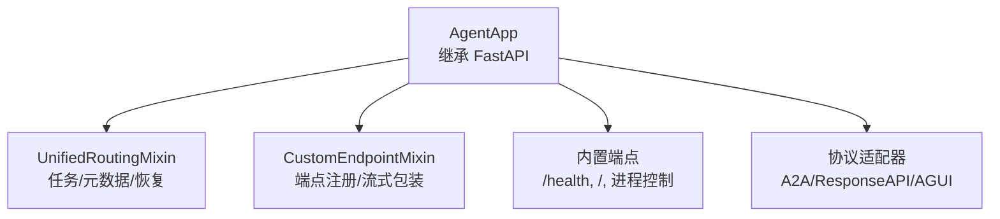
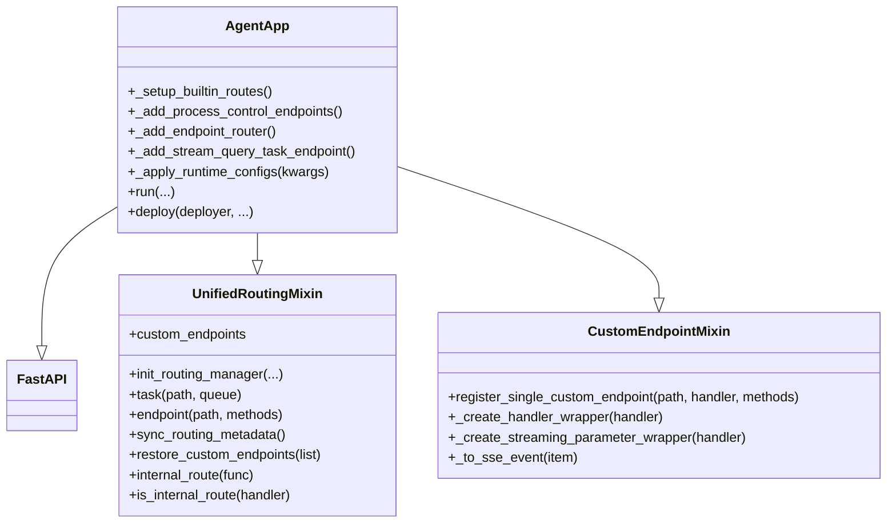
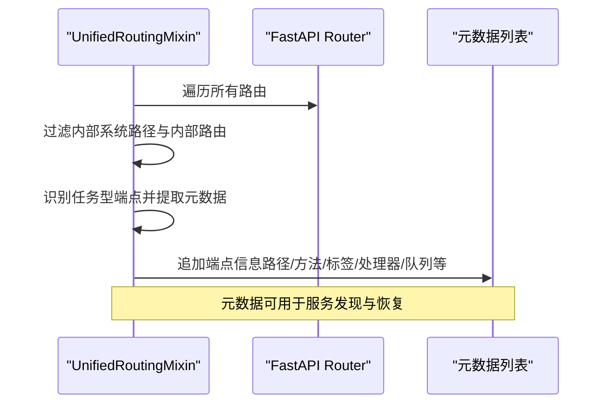
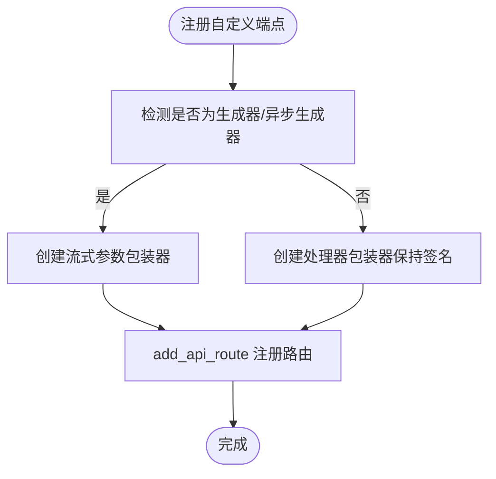
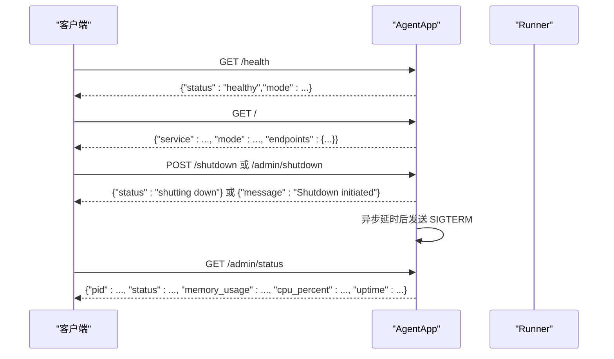
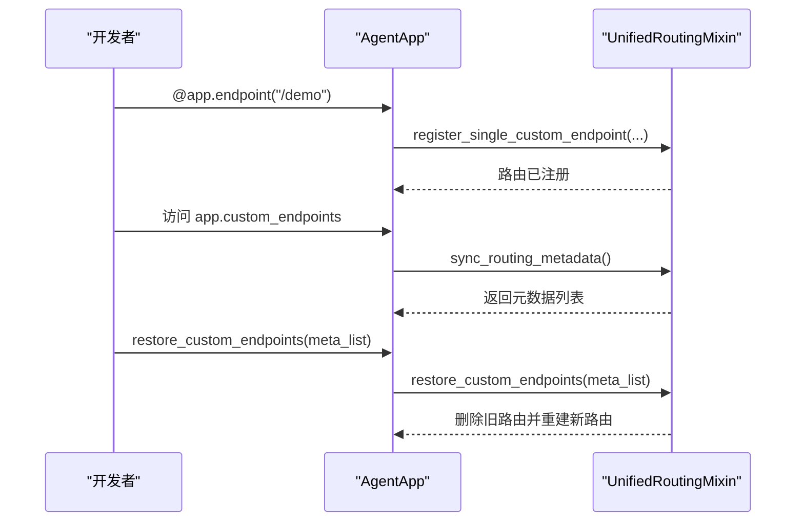
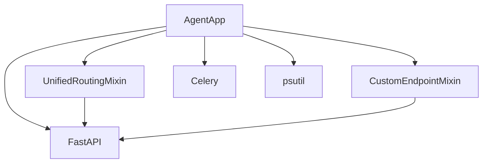

# 路由系统

<cite>
**本文引用的文件**
- [unified_routing_mixin.py](file://src/agentscope_runtime/engine/deployers/utils/service_utils/routing/unified_routing_mixin.py)
- [custom_endpoint_mixin.py](file://src/agentscope_runtime/engine/deployers/utils/service_utils/routing/custom_endpoint_mixin.py)
- [agent_app.py](file://src/agentscope_runtime/engine/app/agent_app.py)
- [test_agent_app_custom_endpoint.py](file://tests/unit/test_agent_app_custom_endpoint.py)
- [agent_app.md](file://cookbook/zh/agent_app.md)
</cite>

## 目录
1. [简介](#简介)
2. [项目结构](#项目结构)
3. [核心组件](#核心组件)
4. [架构总览](#架构总览)
5. [详细组件分析](#详细组件分析)
6. [依赖分析](#依赖分析)
7. [性能考虑](#性能考虑)
8. [故障排查指南](#故障排查指南)
9. [结论](#结论)
10. [附录](#附录)

## 简介
本文件面向使用者与开发者，系统性阐述 AgentApp 的统一路由体系：如何通过 UnifiedRoutingMixin 实现统一的路由管理，覆盖动态端点注册、路由冲突处理、任务型端点与协议适配器集成；并详解内置路由（/health、/ 根路径、进程控制端点）、自定义端点注册机制与 restore_custom_endpoints 方法的使用。文末提供路由优先级、端点冲突处理策略与性能优化建议，兼顾初学者与高级开发者的理解需求。

## 项目结构
AgentApp 路由系统位于引擎模块的“服务工具”子目录下，核心文件包括：
- 统一路由混合类：UnifiedRoutingMixin，负责任务型端点、自定义端点元数据同步与恢复
- 自定义端点混合类：CustomEndpointMixin，负责注册普通/流式端点、参数解析与错误包装
- 应用主类：AgentApp，继承 FastAPI 并混入上述两个混合类，负责内置端点、协议适配器与生命周期管理

图表来源
- [agent_app.py:60-220](file://src/agentscope_runtime/engine/app/agent_app.py#L60-L220)
- [unified_routing_mixin.py:16-120](file://src/agentscope_runtime/engine/deployers/utils/service_utils/routing/unified_routing_mixin.py#L16-L120)
- [custom_endpoint_mixin.py:15-60](file://src/agentscope_runtime/engine/deployers/utils/service_utils/routing/custom_endpoint_mixin.py#L15-L60)

章节来源
- [agent_app.py:60-220](file://src/agentscope_runtime/engine/app/agent_app.py#L60-L220)
- [unified_routing_mixin.py:16-120](file://src/agentscope_runtime/engine/deployers/utils/service_utils/routing/unified_routing_mixin.py#L16-L120)
- [custom_endpoint_mixin.py:15-60](file://src/agentscope_runtime/engine/deployers/utils/service_utils/routing/custom_endpoint_mixin.py#L15-L60)

## 核心组件
- UnifiedRoutingMixin
  - 提供任务型端点装饰器与状态查询端点
  - 提供自定义端点元数据同步与恢复能力
  - 提供内部路由标记与识别
- CustomEndpointMixin
  - 注册普通/生成器/异步生成器端点
  - 保持函数签名，启用 FastAPI 自动参数解析
  - 将非流式端点包装为 SSE 流式响应（可选）
- AgentApp
  - 初始化路由管理器、内置端点、协议适配器与中间件
  - 动态注册主推理端点
  - 生命周期管理与任务清理工作线程

章节来源
- [unified_routing_mixin.py:16-253](file://src/agentscope_runtime/engine/deployers/utils/service_utils/routing/unified_routing_mixin.py#L16-L253)
- [custom_endpoint_mixin.py:15-235](file://src/agentscope_runtime/engine/deployers/utils/service_utils/routing/custom_endpoint_mixin.py#L15-L235)
- [agent_app.py:60-220](file://src/agentscope_runtime/engine/app/agent_app.py#L60-L220)

## 架构总览
AgentApp 通过继承 FastAPI 并混入两个路由相关混合类，形成“统一路由层”。该层向上提供统一的端点注册与元数据管理，向下与协议适配器、Runner、中断服务等模块协作。

图表来源
- [agent_app.py:60-220](file://src/agentscope_runtime/engine/app/agent_app.py#L60-L220)
- [unified_routing_mixin.py:16-120](file://src/agentscope_runtime/engine/deployers/utils/service_utils/routing/unified_routing_mixin.py#L16-L120)
- [custom_endpoint_mixin.py:15-60](file://src/agentscope_runtime/engine/deployers/utils/service_utils/routing/custom_endpoint_mixin.py#L15-L60)

## 详细组件分析

### 统一路由混合类（UnifiedRoutingMixin）
- 任务型端点装饰器
  - 通过装饰器在指定路径注册任务端点，并自动生成状态查询端点
  - 支持 Celery 与内存两种后端，自动提交任务并返回任务 ID
- 自定义端点元数据同步
  - 遍历所有路由，过滤内部系统路径与内部路由，提取路径、方法、标签、处理器等信息
  - 识别任务型端点并附加队列与原始函数信息
- 自定义端点恢复
  - 基于提供的元数据重建路由与任务端点，删除旧有同名路径及其状态查询路径
  - 忽略 OPTIONS 方法，避免重复注册
- 内部路由标记
  - 通过装饰器标记内部系统路由，避免被纳入自定义端点元数据

图表来源
- [unified_routing_mixin.py:120-185](file://src/agentscope_runtime/engine/deployers/utils/service_utils/routing/unified_routing_mixin.py#L120-L185)

章节来源
- [unified_routing_mixin.py:25-101](file://src/agentscope_runtime/engine/deployers/utils/service_utils/routing/unified_routing_mixin.py#L25-L101)
- [unified_routing_mixin.py:120-185](file://src/agentscope_runtime/engine/deployers/utils/service_utils/routing/unified_routing_mixin.py#L120-L185)
- [unified_routing_mixin.py:186-237](file://src/agentscope_runtime/engine/deployers/utils/service_utils/routing/unified_routing_mixin.py#L186-L237)
- [unified_routing_mixin.py:239-253](file://src/agentscope_runtime/engine/deployers/utils/service_utils/routing/unified_routing_mixin.py#L239-L253)

### 自定义端点混合类（CustomEndpointMixin）
- 注册单个自定义端点
  - 自动判断同步/异步/生成器/异步生成器，分别进行参数包装与路由注册
  - 为非流式端点保留函数签名，启用 FastAPI 的参数解析与依赖注入
- 流式端点包装
  - 为生成器/异步生成器端点创建 SSE 包装器，将任意可序列化对象转换为 SSE 事件
  - 对异常进行捕获并转换为 SSE 错误事件，保障客户端稳定消费
- 参数解析与依赖注入
  - 通过签名与装饰器参数，支持 URL 查询参数、JSON 请求体（Pydantic 模型）、Request 对象、AgentRequest 等

图表来源
- [custom_endpoint_mixin.py:16-58](file://src/agentscope_runtime/engine/deployers/utils/service_utils/routing/custom_endpoint_mixin.py#L16-L58)
- [custom_endpoint_mixin.py:126-235](file://src/agentscope_runtime/engine/deployers/utils/service_utils/routing/custom_endpoint_mixin.py#L126-L235)

章节来源
- [custom_endpoint_mixin.py:16-58](file://src/agentscope_runtime/engine/deployers/utils/service_utils/routing/custom_endpoint_mixin.py#L16-L58)
- [custom_endpoint_mixin.py:126-235](file://src/agentscope_runtime/engine/deployers/utils/service_utils/routing/custom_endpoint_mixin.py#L126-L235)

### AgentApp 内置路由与进程控制
- 健康检查端点 /health
  - 返回服务健康状态与运行模式
  - 作为内部路由，不参与自定义端点元数据同步
- 根路径 / 与端点概览
  - 返回服务信息、部署模式与可用端点清单（含 /process、/process/stream、/health）
  - 当启用流式任务时，补充 /process/task 与 /process/task/{task_id}
- 进程控制端点
  - /shutdown：简单优雅关停（延时后发送 SIGTERM）
  - /admin/shutdown：带延时的优雅关停
  - /admin/status：获取进程 PID、状态、内存/CPU 使用与时长

图表来源
- [agent_app.py:382-424](file://src/agentscope_runtime/engine/app/agent_app.py#L382-L424)
- [agent_app.py:598-642](file://src/agentscope_runtime/engine/app/agent_app.py#L598-L642)

章节来源
- [agent_app.py:382-424](file://src/agentscope_runtime/engine/app/agent_app.py#L382-L424)
- [agent_app.py:598-642](file://src/agentscope_runtime/engine/app/agent_app.py#L598-L642)

### 自定义端点注册与 restore_custom_endpoints
- 自定义端点注册
  - 通过装饰器注册普通/流式端点，自动保留函数签名，启用参数解析
  - 可直接返回 JSON 或生成 SSE 事件
- 元数据同步
  - 通过属性访问触发同步，过滤内部路由与系统路径，收集路径、方法、标签、处理器等
- 端点恢复
  - 基于元数据重建路由与任务端点，删除旧有同名路径及状态查询路径
  - 忽略 OPTIONS 方法，避免重复注册

图表来源
- [agent_app.py:215-219](file://src/agentscope_runtime/engine/app/agent_app.py#L215-L219)
- [unified_routing_mixin.py:115-119](file://src/agentscope_runtime/engine/deployers/utils/service_utils/routing/unified_routing_mixin.py#L115-L119)
- [unified_routing_mixin.py:186-237](file://src/agentscope_runtime/engine/deployers/utils/service_utils/routing/unified_routing_mixin.py#L186-L237)

章节来源
- [agent_app.py:215-219](file://src/agentscope_runtime/engine/app/agent_app.py#L215-L219)
- [unified_routing_mixin.py:115-119](file://src/agentscope_runtime/engine/deployers/utils/service_utils/routing/unified_routing_mixin.py#L115-L119)
- [unified_routing_mixin.py:186-237](file://src/agentscope_runtime/engine/deployers/utils/service_utils/routing/unified_routing_mixin.py#L186-L237)

### 协议适配器集成
- AgentApp 在生命周期内为各协议适配器注册端点
- 统一路由层不直接感知协议差异，但通过 FastAPI 路由系统统一暴露
- OpenAPI Schema 注入协议相关模型（如 A2ARequest、ResponseAPI、AgentRequest）

章节来源
- [agent_app.py:68-106](file://src/agentscope_runtime/engine/app/agent_app.py#L68-L106)
- [agent_app.py:273-274](file://src/agentscope_runtime/engine/app/agent_app.py#L273-L274)

## 依赖分析
- 组件耦合
  - AgentApp 同时混入 UnifiedRoutingMixin 与 CustomEndpointMixin，形成“路由即服务”的统一入口
  - 路由元数据同步与恢复依赖 FastAPI 的路由表与 APIRoute 类型
- 外部依赖
  - FastAPI：路由注册、中间件、生命周期管理
  - Celery（可选）：任务后端与任务提交
  - psutil（进程控制）：进程状态查询

图表来源
- [agent_app.py:60-220](file://src/agentscope_runtime/engine/app/agent_app.py#L60-L220)
- [unified_routing_mixin.py:16-120](file://src/agentscope_runtime/engine/deployers/utils/service_utils/routing/unified_routing_mixin.py#L16-L120)
- [custom_endpoint_mixin.py:15-60](file://src/agentscope_runtime/engine/deployers/utils/service_utils/routing/custom_endpoint_mixin.py#L15-L60)

章节来源
- [agent_app.py:60-220](file://src/agentscope_runtime/engine/app/agent_app.py#L60-L220)
- [unified_routing_mixin.py:16-120](file://src/agentscope_runtime/engine/deployers/utils/service_utils/routing/unified_routing_mixin.py#L16-L120)
- [custom_endpoint_mixin.py:15-60](file://src/agentscope_runtime/engine/deployers/utils/service_utils/routing/custom_endpoint_mixin.py#L15-L60)

## 性能考虑
- 路由扫描与元数据同步
  - 元数据同步遍历所有路由，建议在端点数量较多时谨慎调用，避免频繁触发
  - 可通过缓存或延迟策略减少重复计算
- 流式端点
  - 流式端点采用 SSE 包装，注意事件大小与频率，避免过大数据块导致客户端压力
- 任务型端点
  - Celery 后端可提升吞吐，但需关注消息队列与网络延迟
  - 内存后端适合小规模并发，注意任务清理与内存占用
- 中间件与 CORS
  - 默认允许跨域，生产环境建议限制具体来源与方法

[本节为通用指导，无需特定文件引用]

## 故障排查指南
- 自定义端点未生效
  - 检查是否使用了正确的装饰器（普通端点使用 endpoint，任务端点使用 task）
  - 确认端点路径未与内置路由冲突（/health、/、/shutdown、/admin/*）
  - 如需恢复，使用 restore_custom_endpoints 传入正确的元数据列表
- 流式端点异常
  - 检查生成器是否抛出异常，异常会被包装为 SSE 错误事件
  - 确保返回对象可序列化，必要时转换为字典或 Pydantic 模型
- 任务端点提交失败
  - 检查 Celery 配置与 Broker 地址
  - 查看任务提交日志，确认任务 ID 与队列信息
- 进程控制端点无效
  - 确认部署模式与进程权限
  - 检查信号发送是否成功

章节来源
- [unified_routing_mixin.py:186-237](file://src/agentscope_runtime/engine/deployers/utils/service_utils/routing/unified_routing_mixin.py#L186-L237)
- [custom_endpoint_mixin.py:126-235](file://src/agentscope_runtime/engine/deployers/utils/service_utils/routing/custom_endpoint_mixin.py#L126-L235)
- [agent_app.py:598-642](file://src/agentscope_runtime/engine/app/agent_app.py#L598-L642)

## 结论
AgentApp 的路由系统通过 UnifiedRoutingMixin 与 CustomEndpointMixin 实现“统一管理、灵活扩展、稳定恢复”的目标。内置路由提供健康检查与进程控制，自定义端点支持同步/异步与流式返回，任务型端点提供后台执行能力。配合协议适配器与生命周期管理，整体路由体系既满足初学者快速上手，也为高级开发者提供了深入定制的空间。

[本节为总结，无需特定文件引用]

## 附录

### 内置路由一览
- /health：健康检查
- /：服务概览与端点清单
- /shutdown：简单优雅关停
- /admin/shutdown：带延时优雅关停
- /admin/status：进程状态信息

章节来源
- [agent_app.py:382-424](file://src/agentscope_runtime/engine/app/agent_app.py#L382-L424)
- [agent_app.py:598-642](file://src/agentscope_runtime/engine/app/agent_app.py#L598-L642)

### 自定义端点示例与最佳实践
- 使用 @app.endpoint 注册端点，支持：
  - 同步/异步函数返回 JSON
  - 生成器/异步生成器返回 SSE 流
  - 参数解析：URL 查询参数、JSON 请求体（Pydantic 模型）、Request、AgentRequest
- 使用 @app.task 注册任务端点，自动提供状态查询端点 /process/task/{task_id}
- 使用 app.custom_endpoints 获取当前自定义端点元数据
- 使用 restore_custom_endpoints 恢复端点（常用于部署/重启后）

章节来源
- [agent_app.md:588-604](file://cookbook/zh/agent_app.md#L588-L604)
- [test_agent_app_custom_endpoint.py:52-122](file://tests/unit/test_agent_app_custom_endpoint.py#L52-L122)
- [unified_routing_mixin.py:103-113](file://src/agentscope_runtime/engine/deployers/utils/service_utils/routing/unified_routing_mixin.py#L103-L113)
- [unified_routing_mixin.py:115-119](file://src/agentscope_runtime/engine/deployers/utils/service_utils/routing/unified_routing_mixin.py#L115-L119)
- [unified_routing_mixin.py:186-237](file://src/agentscope_runtime/engine/deployers/utils/service_utils/routing/unified_routing_mixin.py#L186-L237)