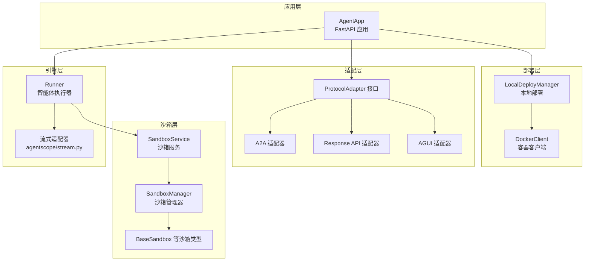
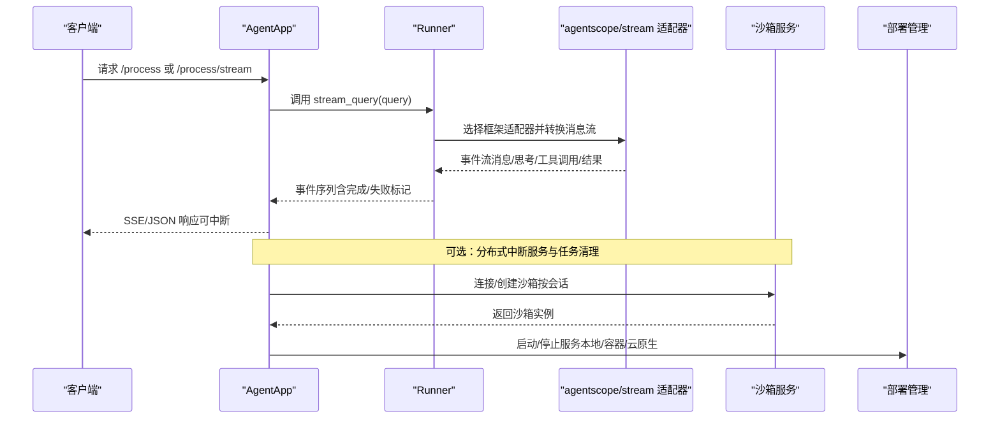
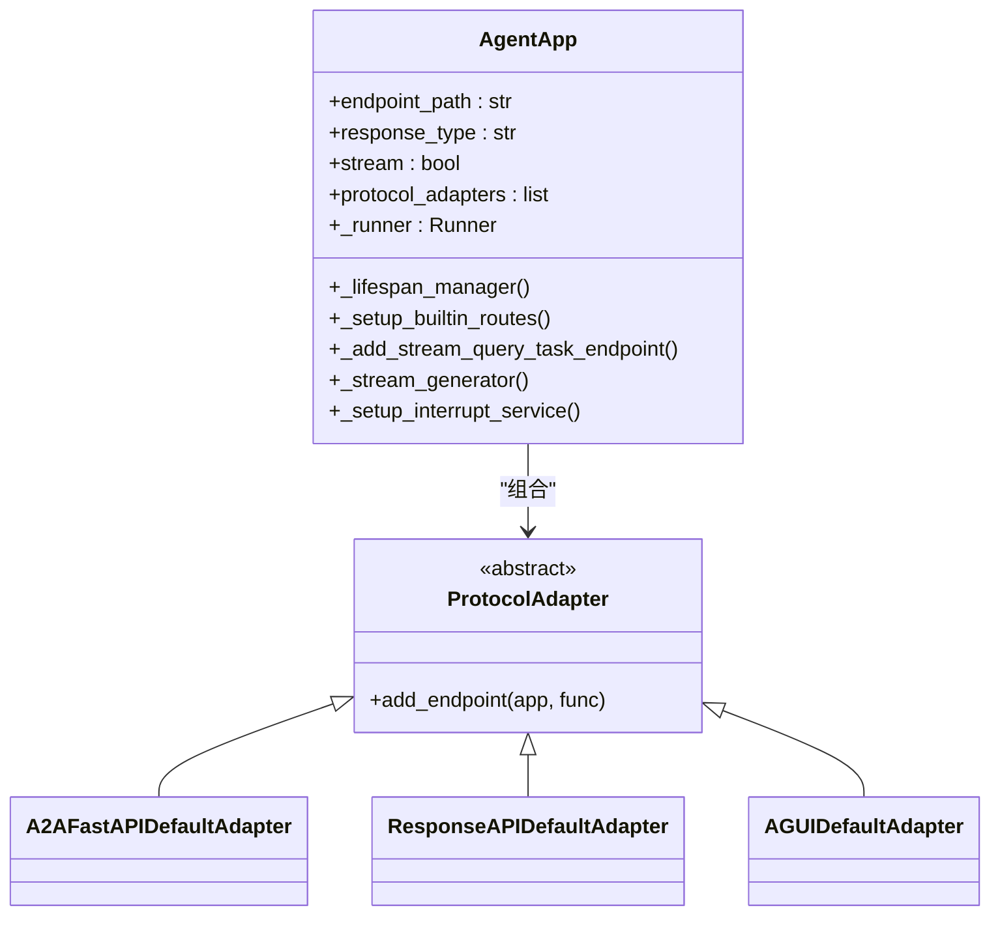
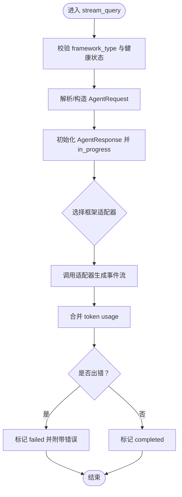
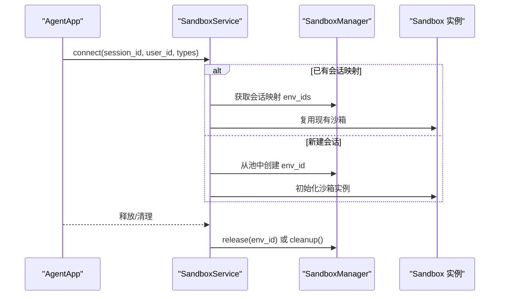
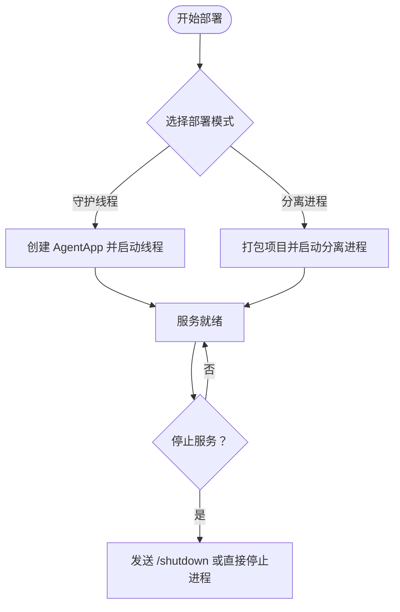
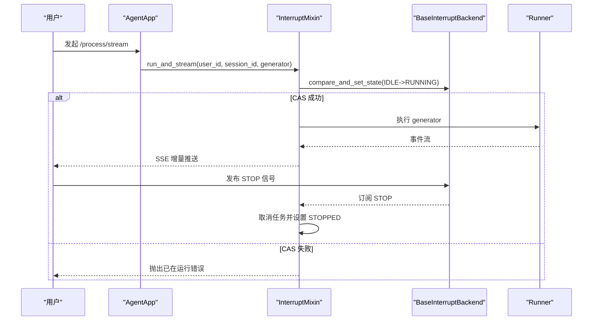
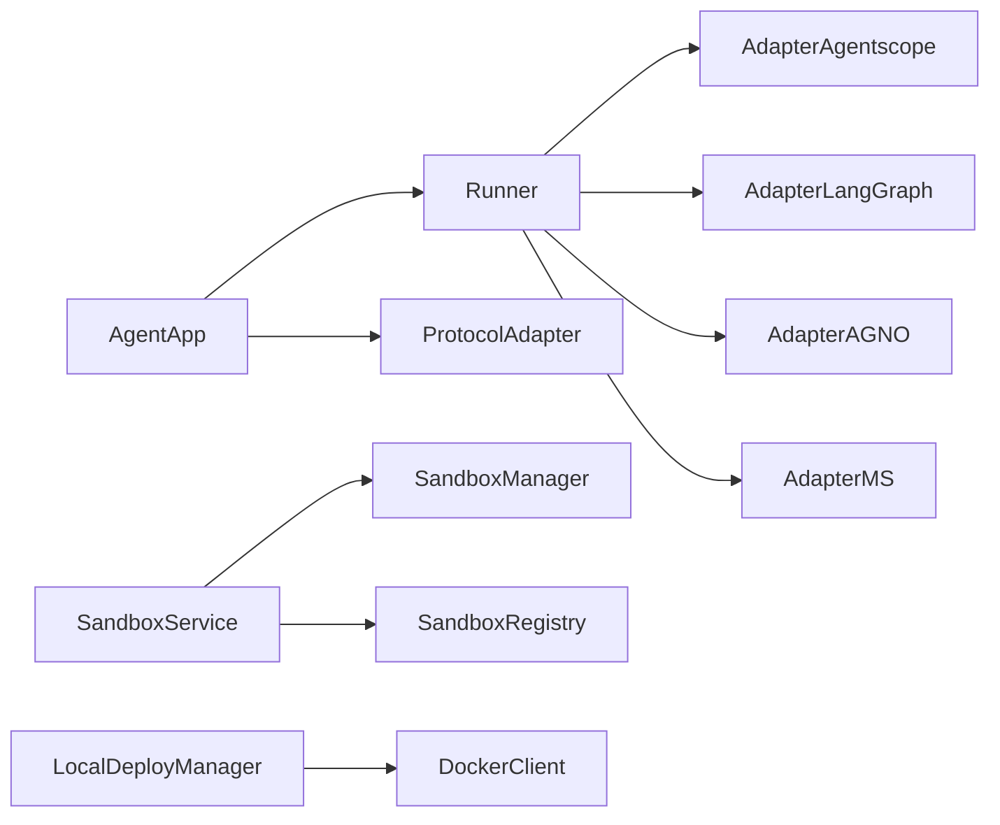

# 核心概念

<cite>
**本文引用的文件**
- [agent_app.py](file://src/agentscope_runtime/engine/app/agent_app.py)
- [runner.py](file://src/agentscope_runtime/engine/runner.py)
- [protocol_adapter.py](file://src/agentscope_runtime/engine/deployers/adapter/protocol_adapter.py)
- [deployment_modes.py](file://src/agentscope_runtime/engine/deployers/utils/deployment_modes.py)
- [local_deployer.py](file://src/agentscope_runtime/engine/deployers/local_deployer.py)
- [base_backend.py](file://src/agentscope_runtime/engine/deployers/utils/service_utils/interrupt/base_backend.py)
- [interrupt_mixin.py](file://src/agentscope_runtime/engine/deployers/utils/service_utils/interrupt/interrupt_mixin.py)
- [stream.py](file://src/agentscope_runtime/adapters/agentscope/stream.py)
- [sandbox_service.py](file://src/agentscope_runtime/engine/services/sandbox/sandbox_service.py)
- [docker_client.py](file://src/agentscope_runtime/common/container_clients/docker_client.py)
- [__init__.py（沙箱入口）](file://src/agentscope_runtime/sandbox/__init__.py)
</cite>

## 目录
1. [引言](#引言)
2. [项目结构](#项目结构)
3. [核心组件](#核心组件)
4. [架构总览](#架构总览)
5. [详细组件分析](#详细组件分析)
6. [依赖分析](#依赖分析)
7. [性能考虑](#性能考虑)
8. [故障排查指南](#故障排查指南)
9. [结论](#结论)
10. [附录](#附录)

## 引言
本文件系统性阐述 AgentScope Runtime 的核心概念与实现原理，包括：
- 智能体应用框架：AgentApp 如何整合 FastAPI 与 Runner，并通过协议适配器统一接入多框架生态。
- 沙箱执行原理：如何在隔离环境中运行智能体，支持 GUI、浏览器、文件系统、移动端等多类沙箱。
- 协议适配器机制：如何为不同协议（如 A2A、Response API、AGUI 等）注册端点并生成 OpenAPI 规范。
- 部署模式：本地守护线程、分离进程、容器化与云原生部署的差异与选择。
- 分布式中断服务与流式处理：如何在多实例场景下安全地中断任务、管理状态与事件序列。

目标是让初学者快速上手，同时为高级开发者提供深入的技术细节与扩展路径。

## 项目结构
从顶层看，AgentScope Runtime 将“应用层”“引擎层”“适配层”“沙箱层”“部署层”清晰分层：
- 应用层（AgentApp/FastAPI）：对外提供统一 API，内置健康检查、任务清理、流式输出等能力。
- 引擎层（Runner）：抽象智能体执行器，负责请求解析、事件序列化、框架适配与异常包装。
- 适配层（ProtocolAdapter）：将 Runner 的输出映射到不同协议格式，注册端点并生成 OpenAPI。
- 沙箱层（SandboxService/SandboxManager）：提供隔离执行环境，支持多种沙箱类型与生命周期管理。
- 部署层（LocalDeployManager/Container Clients）：封装本地、容器、云原生部署细节，统一生命周期与状态管理。

图表来源
- [agent_app.py:60-120](file://src/agentscope_runtime/engine/app/agent_app.py#L60-L120)
- [runner.py:46-120](file://src/agentscope_runtime/engine/runner.py#L46-L120)
- [protocol_adapter.py:6-25](file://src/agentscope_runtime/engine/deployers/adapter/protocol_adapter.py#L6-L25)
- [local_deployer.py:27-120](file://src/agentscope_runtime/engine/deployers/local_deployer.py#L27-L120)
- [sandbox_service.py:11-80](file://src/agentscope_runtime/engine/services/sandbox/sandbox_service.py#L11-L80)
- [docker_client.py:20-120](file://src/agentscope_runtime/common/container_clients/docker_client.py#L20-L120)

章节来源
- [agent_app.py:60-120](file://src/agentscope_runtime/engine/app/agent_app.py#L60-L120)
- [runner.py:46-120](file://src/agentscope_runtime/engine/runner.py#L46-L120)
- [protocol_adapter.py:6-25](file://src/agentscope_runtime/engine/deployers/adapter/protocol_adapter.py#L6-L25)
- [local_deployer.py:27-120](file://src/agentscope_runtime/engine/deployers/local_deployer.py#L27-L120)
- [sandbox_service.py:11-80](file://src/agentscope_runtime/engine/services/sandbox/sandbox_service.py#L11-L80)
- [docker_client.py:20-120](file://src/agentscope_runtime/common/container_clients/docker_client.py#L20-L120)

## 核心组件
- AgentApp：基于 FastAPI 的智能体服务入口，集成路由、生命周期、协议适配器、流式任务与中断服务。
- Runner：统一的智能体执行器，负责输入校验、事件序列化、框架适配与错误包装；支持多框架（agentscope/langgraph/agno/ms_agent_framework/text）。
- 协议适配器：ProtocolAdapter 抽象，具体适配器负责注册端点、生成 OpenAPI、转换请求/响应。
- 沙箱服务：SandboxService 统一连接/创建/释放沙箱，支持嵌入式与远程 API 模式。
- 部署管理：LocalDeployManager 支持守护线程与分离进程两种本地模式；容器客户端负责镜像拉取、端口分配与资源回收。

章节来源
- [agent_app.py:124-220](file://src/agentscope_runtime/engine/app/agent_app.py#L124-L220)
- [runner.py:46-120](file://src/agentscope_runtime/engine/runner.py#L46-L120)
- [protocol_adapter.py:6-25](file://src/agentscope_runtime/engine/deployers/adapter/protocol_adapter.py#L6-L25)
- [sandbox_service.py:11-80](file://src/agentscope_runtime/engine/services/sandbox/sandbox_service.py#L11-L80)
- [local_deployer.py:27-120](file://src/agentscope_runtime/engine/deployers/local_deployer.py#L27-L120)

## 架构总览
AgentApp 作为统一入口，内部持有 Runner 并注册多个协议适配器端点；Runner 在不同框架类型下调用对应的消息/流式适配器，将智能体输出转换为统一事件流；SandboxService 负责在隔离环境中执行工具或交互；部署层负责将服务以本地/容器/云原生方式发布。

图表来源
- [agent_app.py:780-820](file://src/agentscope_runtime/engine/app/agent_app.py#L780-L820)
- [runner.py:193-356](file://src/agentscope_runtime/engine/runner.py#L193-L356)
- [stream.py:33-120](file://src/agentscope_runtime/adapters/agentscope/stream.py#L33-L120)
- [sandbox_service.py:82-142](file://src/agentscope_runtime/engine/services/sandbox/sandbox_service.py#L82-L142)
- [local_deployer.py:175-260](file://src/agentscope_runtime/engine/deployers/local_deployer.py#L175-L260)

## 详细组件分析

### AgentApp：智能体应用框架与协议适配器
- 生命周期与中间件
  - 使用 FastAPI 的 lifespan 管理内部 Runner 与钩子函数，支持 before_start/after_finish。
  - 注册健康检查、根路径信息、进程控制端点（关闭、状态查询）。
- 协议适配器
  - 默认初始化 A2A、Response API、AGUI 三种适配器，并在 OpenAPI 中注入相应模型定义。
  - 通过 add_endpoint 将 Runner 的 stream_query/query 注册为统一处理接口。
- 流式任务与后台任务
  - 支持 /process/task 提交流式查询为后台任务，返回 task_id；支持轮询任务状态。
  - 内置定时清理过期任务（默认 TTL 1 小时），避免内存泄漏。
- 中断服务
  - 支持外部 Redis 后端或本地后端；当启用中断时，流式生成通过 run_and_stream 包裹，具备原子状态切换与信号监听能力。

图表来源
- [agent_app.py:60-220](file://src/agentscope_runtime/engine/app/agent_app.py#L60-L220)
- [protocol_adapter.py:6-25](file://src/agentscope_runtime/engine/deployers/adapter/protocol_adapter.py#L6-L25)

章节来源
- [agent_app.py:124-220](file://src/agentscope_runtime/engine/app/agent_app.py#L124-L220)
- [agent_app.py:248-316](file://src/agentscope_runtime/engine/app/agent_app.py#L248-L316)
- [agent_app.py:382-471](file://src/agentscope_runtime/engine/app/agent_app.py#L382-L471)
- [agent_app.py:497-596](file://src/agentscope_runtime/engine/app/agent_app.py#L497-L596)
- [agent_app.py:643-702](file://src/agentscope_runtime/engine/app/agent_app.py#L643-L702)

### Runner：统一智能体执行器与事件序列
- 输入与会话
  - 自动补全 session_id/user_id；生成初始 AgentResponse 并进入 in_progress 状态。
- 框架适配
  - 根据 framework_type 选择对应适配器（agentscope/langgraph/agno/ms_agent_framework/text），并将消息转换为统一事件流。
- 错误处理
  - 捕获异常并包装为统一错误对象，保证输出一致性。
- 事件序列
  - 使用 SequenceNumberGenerator 为每个事件附加序号，便于前端渲染与调试。

图表来源
- [runner.py:193-356](file://src/agentscope_runtime/engine/runner.py#L193-L356)

章节来源
- [runner.py:193-356](file://src/agentscope_runtime/engine/runner.py#L193-L356)

### 协议适配器机制：多协议统一接入
- 抽象接口
  - ProtocolAdapter 定义 add_endpoint 方法，用于将统一的处理函数注册为不同协议的端点。
- 典型适配器
  - A2A：注入 A2ARequest 到 OpenAPI；注册 /process 端点。
  - Response API：注入 ResponseAPI 到 OpenAPI；注册 /process 端点。
  - AGUI：注册 AGUI 协议端点。
- OpenAPI 扩展
  - AgentApp 在 openapi 中动态注入各协议的 JSON Schema，确保 SDK 与文档一致。

章节来源
- [protocol_adapter.py:6-25](file://src/agentscope_runtime/engine/deployers/adapter/protocol_adapter.py#L6-L25)
- [agent_app.py:68-123](file://src/agentscope_runtime/engine/app/agent_app.py#L68-L123)

### 沙箱执行原理：隔离环境与生命周期管理
- 沙箱类型
  - 基础沙箱、浏览器沙箱、文件系统沙箱、GUI 沙箱、移动沙箱、训练沙箱、云端沙箱、AgentBay 沙箱等。
- 连接策略
  - 若会话已存在，复用已有环境；否则按类型创建新环境；支持嵌入式与远程 API 两种模式。
- 生命周期
  - start/stop/health；stop 可配置是否释放所有会话；嵌入式模式会在 stop 时清理资源。
- 代理入口
  - 通过显式导入触发注册，确保类型在运行时可用。

图表来源
- [sandbox_service.py:82-231](file://src/agentscope_runtime/engine/services/sandbox/sandbox_service.py#L82-L231)
- [__init__.py（沙箱入口）:6-32](file://src/agentscope_runtime/sandbox/__init__.py#L6-L32)

章节来源
- [sandbox_service.py:11-238](file://src/agentscope_runtime/engine/services/sandbox/sandbox_service.py#L11-L238)
- [__init__.py（沙箱入口）:6-32](file://src/agentscope_runtime/sandbox/__init__.py#L6-L32)

### 部署模式：本地守护线程与分离进程
- 本地守护线程模式
  - 在当前进程中启动 uvicorn 服务器线程，适合开发与测试。
- 分离进程模式
  - 打包项目并以后台进程方式启动，支持独立 PID 文件与日志管理。
- 状态管理
  - 通过状态管理器持久化部署信息，支持查询、更新状态与优雅停机。
- 容器化支持
  - DockerClient 负责镜像拉取、端口分配、容器创建/启动/停止/删除，支持 Redis 端口集合与缓存。

图表来源
- [local_deployer.py:68-174](file://src/agentscope_runtime/engine/deployers/local_deployer.py#L68-L174)
- [local_deployer.py:175-383](file://src/agentscope_runtime/engine/deployers/local_deployer.py#L175-L383)
- [deployment_modes.py:7-15](file://src/agentscope_runtime/engine/deployers/utils/deployment_modes.py#L7-L15)

章节来源
- [local_deployer.py:68-174](file://src/agentscope_runtime/engine/deployers/local_deployer.py#L68-L174)
- [local_deployer.py:175-383](file://src/agentscope_runtime/engine/deployers/local_deployer.py#L175-L383)
- [deployment_modes.py:7-15](file://src/agentscope_runtime/engine/deployers/utils/deployment_modes.py#L7-L15)
- [docker_client.py:67-185](file://src/agentscope_runtime/common/container_clients/docker_client.py#L67-L185)

### 分布式中断服务与流式处理
- 中断后端
  - BaseInterruptBackend 定义发布/订阅、任务状态设置与 CAS 操作；支持 TTL。
- 中断混入
  - InterruptMixin 提供 run_and_stream，对同一用户+会话的任务进行原子状态切换（RUNNING/IDLE/STOPPED/FINISHED/ERROR）。
  - 订阅通道接收 STOP/PAUSE/RESUME 信号，支持取消与状态回滚。
- 流式处理
  - AgentApp 在启用中断时，将 _stream_generator 包裹为 _stream_generator_with_interrupt，确保并发安全与可中断性。
  - Runner 的 stream_query 输出统一事件流，配合序列号与完成标记，便于前端增量渲染。

图表来源
- [interrupt_mixin.py:38-140](file://src/agentscope_runtime/engine/deployers/utils/service_utils/interrupt/interrupt_mixin.py#L38-L140)
- [base_backend.py:25-90](file://src/agentscope_runtime/engine/deployers/utils/service_utils/interrupt/base_backend.py#L25-L90)
- [agent_app.py:669-688](file://src/agentscope_runtime/engine/app/agent_app.py#L669-L688)

章节来源
- [interrupt_mixin.py:8-140](file://src/agentscope_runtime/engine/deployers/utils/service_utils/interrupt/interrupt_mixin.py#L8-L140)
- [base_backend.py:7-90](file://src/agentscope_runtime/engine/deployers/utils/service_utils/interrupt/base_backend.py#L7-L90)
- [agent_app.py:643-702](file://src/agentscope_runtime/engine/app/agent_app.py#L643-L702)

### 流式适配器：多框架消息到统一事件
- agentscope 适配器
  - 将 Msg 流转换为统一事件：文本增量、思考内容、工具调用/结果、多媒体块等。
  - 支持自定义类型转换器（type_converters），允许扩展非标准块类型。
- 事件语义
  - 每个事件携带类型、角色、增量/完成标记、元数据与用量统计，便于前端渲染与计费。

章节来源
- [stream.py:33-120](file://src/agentscope_runtime/adapters/agentscope/stream.py#L33-L120)
- [stream.py:120-684](file://src/agentscope_runtime/adapters/agentscope/stream.py#L120-L684)

## 依赖分析
- 组件耦合
  - AgentApp 依赖 Runner 与多个协议适配器；Runner 依赖框架适配器与事件模型；SandboxService 依赖 SandboxManager 与 Registry。
- 外部依赖
  - FastAPI/uvicorn 用于 Web 服务；Docker/Redis 用于容器与状态存储；A2A/Response API/AGUI 用于协议对接。
- 循环依赖
  - 当前结构以接口（ProtocolAdapter）与工厂（SandboxServiceFactory）解耦，未见明显循环依赖。

图表来源
- [agent_app.py:26-51](file://src/agentscope_runtime/engine/app/agent_app.py#L26-L51)
- [runner.py:24-40](file://src/agentscope_runtime/engine/runner.py#L24-L40)
- [sandbox_service.py:5-10](file://src/agentscope_runtime/engine/services/sandbox/sandbox_service.py#L5-L10)
- [local_deployer.py:14-25](file://src/agentscope_runtime/engine/deployers/local_deployer.py#L14-L25)

章节来源
- [agent_app.py:26-51](file://src/agentscope_runtime/engine/app/agent_app.py#L26-L51)
- [runner.py:24-40](file://src/agentscope_runtime/engine/runner.py#L24-L40)
- [sandbox_service.py:5-10](file://src/agentscope_runtime/engine/services/sandbox/sandbox_service.py#L5-L10)
- [local_deployer.py:14-25](file://src/agentscope_runtime/engine/deployers/local_deployer.py#L14-L25)

## 性能考虑
- 流式传输
  - 使用 SSE 增量推送，降低前端等待时间；建议在高并发场景下限制每秒事件数量与单次事件大小。
- 任务清理
  - 定期清理过期任务（默认 1 小时），避免内存膨胀；可根据业务调整 TTL 与清理频率。
- 中断与并发
  - 通过 CAS 保证同一会话仅一个 RUNNING 任务；合理设置中断 TTL，避免僵尸状态。
- 容器与端口
  - DockerClient 使用 Redis 或内存集合维护端口占用，建议在生产环境使用 Redis 以跨节点共享状态。

## 故障排查指南
- 启动失败
  - 检查本地端口占用与防火墙；守护线程模式绑定 0.0.0.0 时需使用 127.0.0.1 连通性检测。
- Docker 相关
  - 确认 Docker 服务运行、权限正确；镜像拉取失败时检查网络与仓库可达性。
- 中断无效
  - 确认中断后端配置（Redis/本地）与通道订阅；检查 CAS 状态是否被其他实例抢占。
- 任务堆积
  - 查看 /process/task 状态接口；确认队列与超时参数设置；必要时增加工作进程或优化适配器耗时逻辑。

章节来源
- [local_deployer.py:566-607](file://src/agentscope_runtime/engine/deployers/local_deployer.py#L566-L607)
- [docker_client.py:55-65](file://src/agentscope_runtime/common/container_clients/docker_client.py#L55-L65)
- [interrupt_mixin.py:50-62](file://src/agentscope_runtime/engine/deployers/utils/service_utils/interrupt/interrupt_mixin.py#L50-L62)

## 结论
AgentScope Runtime 通过“应用层 + 引擎层 + 适配层 + 沙箱层 + 部署层”的分层设计，实现了多框架、多协议、多模式的统一智能体服务。其核心优势在于：
- 统一的 Runner 与事件序列，屏蔽框架差异；
- 可插拔的协议适配器，快速对接不同生态；
- 沙箱服务与容器化部署，保障执行安全与可移植性；
- 分布式中断与流式处理，满足生产级并发与可控性需求。

## 附录
- 快速上手建议
  - 从 AgentApp 的 query 装饰器开始编写智能体逻辑，选择 agentscope/langgraph/agno/ms_agent_framework 之一。
  - 使用 LocalDeployManager 的守护线程模式进行本地开发，分离进程模式用于生产部署。
  - 需要工具/网页交互时，通过 SandboxService 连接相应沙箱类型。
- 扩展方向
  - 新增协议适配器：实现 ProtocolAdapter.add_endpoint 并注册到 AgentApp。
  - 新增沙箱类型：继承 BaseSandbox 并在 __init__.py 中显式导入以触发注册。
  - 自定义中断后端：实现 BaseInterruptBackend 并注入到 AgentApp 的中断服务初始化流程。