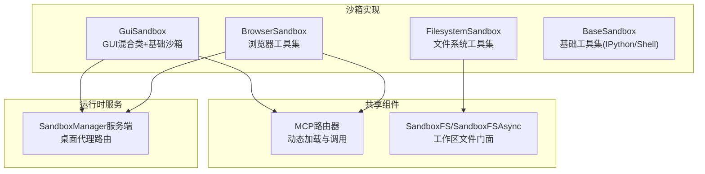
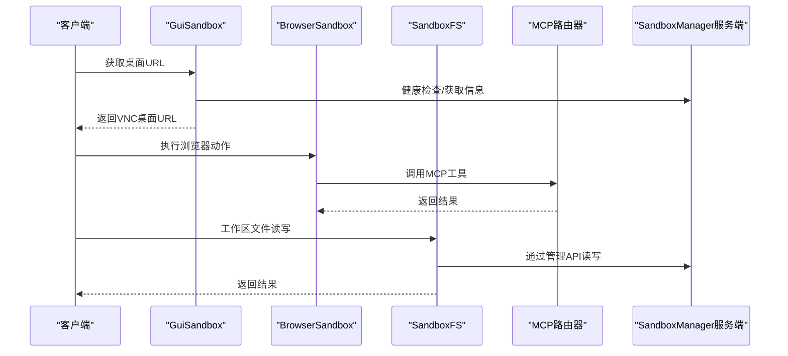
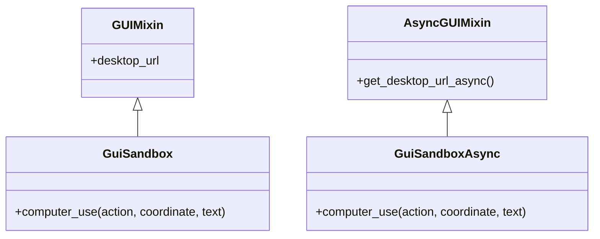
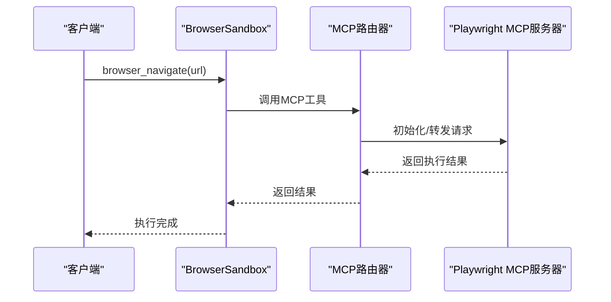
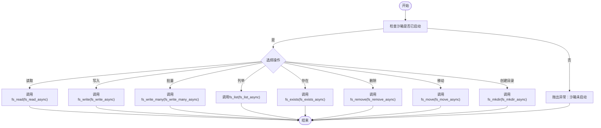
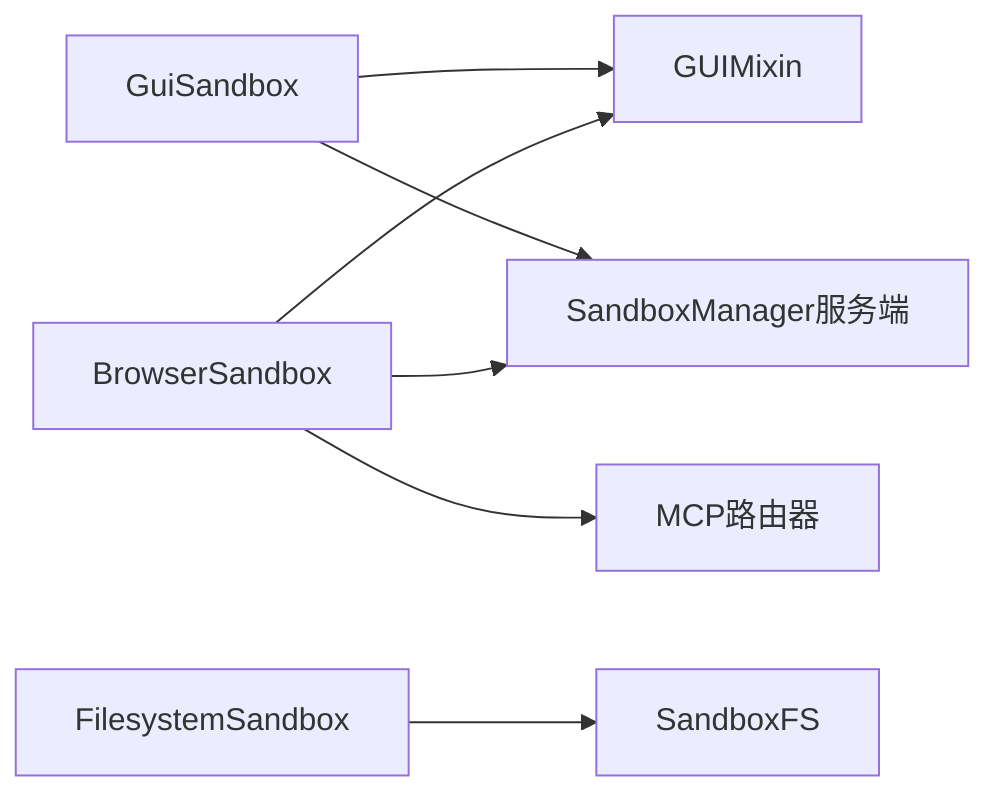

# GUI和浏览器沙箱

<cite>
**本文引用的文件**
- [gui_sandbox.py](file://src/agentscope_runtime/sandbox/box/gui/gui_sandbox.py)
- [browser_sandbox.py](file://src/agentscope_runtime/sandbox/box/browser/browser_sandbox.py)
- [filesystem_sandbox.py](file://src/agentscope_runtime/sandbox/box/filesystem/filesystem_sandbox.py)
- [fs.py](file://src/agentscope_runtime/sandbox/box/components/fs.py)
- [mcp.py](file://src/agentscope_runtime/sandbox/box/shared/routers/mcp.py)
- [mcp_server_configs.json](file://examples/sandbox/custom_sandbox/box/mcp_server_configs.json)
- [playwright_mcp_config.json](file://examples/sandbox/custom_sandbox/box/playwright_mcp_config.json)
- [base_sandbox.py](file://src/agentscope_runtime/sandbox/box/base/base_sandbox.py)
- [app.py](file://src/agentscope_runtime/sandbox/manager/server/app.py)
</cite>

## 目录
1. [简介](#简介)
2. [项目结构](#项目结构)
3. [核心组件](#核心组件)
4. [架构总览](#架构总览)
5. [详细组件分析](#详细组件分析)
6. [依赖关系分析](#依赖关系分析)
7. [性能考虑](#性能考虑)
8. [故障排查指南](#故障排查指南)
9. [结论](#结论)
10. [附录](#附录)

## 简介
本文件面向GUI与浏览器沙箱，系统性阐述以下能力与实践：
- GUI沙箱：图形界面支持与VNC远程访问机制
- 浏览器沙箱：网页渲染能力与MCP协议集成
- 文件系统组件：工作区文件读写、批量上传、目录管理与文件共享机制
- 配置示例与使用场景：远程桌面连接、网页自动化、文件操作
- 最佳实践与常见问题排查

## 项目结构
围绕GUI与浏览器沙箱的关键代码位于以下模块：
- GUI沙箱与VNC访问：gui_sandbox.py
- 浏览器沙箱与MCP集成：browser_sandbox.py、mcp.py
- 文件系统组件：filesystem_sandbox.py、fs.py
- 示例配置：mcp_server_configs.json、playwright_mcp_config.json
- 基座能力：base_sandbox.py
- 桌面代理路由（VNC静态资源）：app.py

**图表来源**
- [gui_sandbox.py:17-71](file://src/agentscope_runtime/sandbox/box/gui/gui_sandbox.py#L17-L71)
- [browser_sandbox.py:31-37](file://src/agentscope_runtime/sandbox/box/browser/browser_sandbox.py#L31-L37)
- [filesystem_sandbox.py:13-19](file://src/agentscope_runtime/sandbox/box/filesystem/filesystem_sandbox.py#L13-L19)
- [fs.py:17-136](file://src/agentscope_runtime/sandbox/box/components/fs.py#L17-L136)
- [mcp.py:24-83](file://src/agentscope_runtime/sandbox/box/shared/routers/mcp.py#L24-L83)
- [app.py:249-261](file://src/agentscope_runtime/sandbox/manager/server/app.py#L249-L261)

**章节来源**
- [gui_sandbox.py:1-240](file://src/agentscope_runtime/sandbox/box/gui/gui_sandbox.py#L1-L240)
- [browser_sandbox.py:1-498](file://src/agentscope_runtime/sandbox/box/browser/browser_sandbox.py#L1-L498)
- [filesystem_sandbox.py:1-254](file://src/agentscope_runtime/sandbox/box/filesystem/filesystem_sandbox.py#L1-L254)
- [fs.py:1-279](file://src/agentscope_runtime/sandbox/box/components/fs.py#L1-L279)
- [mcp.py:1-208](file://src/agentscope_runtime/sandbox/box/shared/routers/mcp.py#L1-L208)
- [mcp_server_configs.json:1-14](file://examples/sandbox/custom_sandbox/box/mcp_server_configs.json#L1-L14)
- [playwright_mcp_config.json:1-23](file://examples/sandbox/custom_sandbox/box/playwright_mcp_config.json#L1-L23)
- [base_sandbox.py:1-102](file://src/agentscope_runtime/sandbox/box/base/base_sandbox.py#L1-L102)
- [app.py:207-261](file://src/agentscope_runtime/sandbox/manager/server/app.py#L207-L261)

## 核心组件
- GUI沙箱（GuiSandbox/GuiSandboxAsync）
  - 提供VNC桌面URL生成与健康检查
  - 支持鼠标键盘控制与截图等“computer”动作
  - 异步版本提供对应的异步接口
- 浏览器沙箱（BrowserSandbox/BrowserSandboxAsync）
  - 提供浏览器导航、点击、输入、截图、PDF保存、标签页管理等工具
  - 通过MCP协议驱动Playwright浏览器能力
- 文件系统沙箱（FilesystemSandbox/FilesystemSandboxAsync）
  - 提供文件读写、编辑、目录树、移动重命名、搜索、元数据查询等
  - 异步版本提供对应异步方法
- 文件系统门面（SandboxFS/SandboxFSAsync）
  - 对工作区文件进行统一读写、批量上传、目录遍历、存在性检查、移动与创建目录
- MCP路由器（mcp.py）
  - 动态加载MCP服务器、列出工具、调用工具、启动与清理
  - 默认从配置文件加载Playwright MCP服务器
- 基座沙箱（BaseSandbox/BaseSandboxAsync）
  - 提供IPython执行与Shell命令执行的基础能力

**章节来源**
- [gui_sandbox.py:17-240](file://src/agentscope_runtime/sandbox/box/gui/gui_sandbox.py#L17-L240)
- [browser_sandbox.py:31-498](file://src/agentscope_runtime/sandbox/box/browser/browser_sandbox.py#L31-L498)
- [filesystem_sandbox.py:13-254](file://src/agentscope_runtime/sandbox/box/filesystem/filesystem_sandbox.py#L13-L254)
- [fs.py:17-279](file://src/agentscope_runtime/sandbox/box/components/fs.py#L17-L279)
- [mcp.py:24-208](file://src/agentscope_runtime/sandbox/box/shared/routers/mcp.py#L24-L208)
- [base_sandbox.py:11-102](file://src/agentscope_runtime/sandbox/box/base/base_sandbox.py#L11-L102)

## 架构总览
GUI与浏览器沙箱均基于统一的沙箱注册与类型体系，通过工具调用（call_tool/call_tool_async）与后端容器交互；浏览器沙箱进一步通过MCP路由器对接Playwright浏览器能力；文件系统沙箱通过SandboxFS门面抽象工作区文件操作。

**图表来源**
- [gui_sandbox.py:18-62](file://src/agentscope_runtime/sandbox/box/gui/gui_sandbox.py#L18-L62)
- [browser_sandbox.py:38-311](file://src/agentscope_runtime/sandbox/box/browser/browser_sandbox.py#L38-L311)
- [fs.py:26-135](file://src/agentscope_runtime/sandbox/box/components/fs.py#L26-L135)
- [mcp.py:24-170](file://src/agentscope_runtime/sandbox/box/shared/routers/mcp.py#L24-L170)
- [app.py:249-261](file://src/agentscope_runtime/sandbox/manager/server/app.py#L249-L261)

## 详细组件分析

### GUI沙箱与VNC远程访问
- VNC桌面URL生成
  - 同步：通过GUIMixin.desktop_url属性生成本地或远程VNC页面URL，携带runtime_token作为密码参数
  - 异步：通过AsyncGUIMixin.get_desktop_url_async异步获取
- 计算机控制（computer_use）
  - 支持按键、文本输入、鼠标移动、点击、拖拽、右键、中键、双击、获取光标位置、截图等
  - 通过调用“computer”工具实现
- 兼容性提示
  - ARM64平台存在兼容性风险，需关注SSE3指令集缺失导致的浏览器崩溃

**图表来源**
- [gui_sandbox.py:17-240](file://src/agentscope_runtime/sandbox/box/gui/gui_sandbox.py#L17-L240)

**章节来源**
- [gui_sandbox.py:17-240](file://src/agentscope_runtime/sandbox/box/gui/gui_sandbox.py#L17-L240)

### 浏览器沙箱与MCP协议集成
- 工具集覆盖
  - 页面导航、前进/后退、窗口尺寸调整、关闭当前页
  - 控制台消息、网络请求、对话框处理、文件上传
  - 截图（整页/元素）、可访问性快照、元素点击/悬停/拖拽
  - 文本输入、选项选择、标签页列表/新建/切换/关闭
  - 等待文本出现/消失/指定时间
- MCP集成
  - 通过mcp.py提供的路由动态加载MCP服务器（默认Playwright）
  - 列出可用工具并按名称调用
  - 支持启动时自动加载配置文件中的MCP服务器
- URL转换
  - 提供http到ws的转换辅助函数，便于在不同网络环境下建立连接

**图表来源**
- [browser_sandbox.py:38-311](file://src/agentscope_runtime/sandbox/box/browser/browser_sandbox.py#L38-L311)
- [mcp.py:24-170](file://src/agentscope_runtime/sandbox/box/shared/routers/mcp.py#L24-L170)
- [mcp_server_configs.json:1-14](file://examples/sandbox/custom_sandbox/box/mcp_server_configs.json#L1-L14)
- [playwright_mcp_config.json:1-23](file://examples/sandbox/custom_sandbox/box/playwright_mcp_config.json#L1-L23)

**章节来源**
- [browser_sandbox.py:1-498](file://src/agentscope_runtime/sandbox/box/browser/browser_sandbox.py#L1-L498)
- [mcp.py:1-208](file://src/agentscope_runtime/sandbox/box/shared/routers/mcp.py#L1-L208)
- [mcp_server_configs.json:1-14](file://examples/sandbox/custom_sandbox/box/mcp_server_configs.json#L1-L14)
- [playwright_mcp_config.json:1-23](file://examples/sandbox/custom_sandbox/box/playwright_mcp_config.json#L1-L23)

### 文件系统组件与文件共享机制
- FilesystemSandbox工具集
  - 读取/批量读取文件、写入文件、对文本文件进行行级编辑、创建目录
  - 列出目录、递归目录树、移动/重命名、按模式搜索、获取文件信息、列出允许访问的根目录
- SandboxFS门面
  - 同步：read/write/write_many/list/exists/remove/move/mkdir/write_from_path
  - 异步：read_async/write_async/write_many_async/list_async/exists_async/remove_async/move_async/mkdir_async/write_from_path_async
  - 统一通过SandboxManager的fs_*接口与后端交互
- 文件共享流程
  - 客户端通过SandboxFS将本地文件流式上传至工作区
  - 沙箱内程序可直接读取工作区文件，实现跨进程/容器的文件共享

**图表来源**
- [fs.py:17-279](file://src/agentscope_runtime/sandbox/box/components/fs.py#L17-L279)
- [filesystem_sandbox.py:13-254](file://src/agentscope_runtime/sandbox/box/filesystem/filesystem_sandbox.py#L13-L254)

**章节来源**
- [fs.py:1-279](file://src/agentscope_runtime/sandbox/box/components/fs.py#L1-L279)
- [filesystem_sandbox.py:1-254](file://src/agentscope_runtime/sandbox/box/filesystem/filesystem_sandbox.py#L1-L254)

### 基座能力与通用工具
- BaseSandbox提供：
  - 运行IPython单元格
  - 执行Shell命令
- BaseSandboxAsync提供对应的异步版本

**章节来源**
- [base_sandbox.py:11-102](file://src/agentscope_runtime/sandbox/box/base/base_sandbox.py#L11-L102)

## 依赖关系分析
- GUI与浏览器沙箱均继承自GUIMixin，复用VNC桌面URL生成逻辑
- 浏览器沙箱通过MCP路由器与外部MCP服务器通信
- 文件系统沙箱通过SandboxFS门面与SandboxManager交互
- 服务端通过桌面代理路由（/desktop/{sandbox_id}/...）转发VNC静态资源

**图表来源**
- [gui_sandbox.py:17-71](file://src/agentscope_runtime/sandbox/box/gui/gui_sandbox.py#L17-L71)
- [browser_sandbox.py:31-37](file://src/agentscope_runtime/sandbox/box/browser/browser_sandbox.py#L31-L37)
- [mcp.py:24-83](file://src/agentscope_runtime/sandbox/box/shared/routers/mcp.py#L24-L83)
- [fs.py:17-136](file://src/agentscope_runtime/sandbox/box/components/fs.py#L17-L136)
- [app.py:249-261](file://src/agentscope_runtime/sandbox/manager/server/app.py#L249-L261)

**章节来源**
- [gui_sandbox.py:17-71](file://src/agentscope_runtime/sandbox/box/gui/gui_sandbox.py#L17-L71)
- [browser_sandbox.py:31-37](file://src/agentscope_runtime/sandbox/box/browser/browser_sandbox.py#L31-L37)
- [mcp.py:24-83](file://src/agentscope_runtime/sandbox/box/shared/routers/mcp.py#L24-L83)
- [fs.py:17-136](file://src/agentscope_runtime/sandbox/box/components/fs.py#L17-L136)
- [app.py:249-261](file://src/agentscope_runtime/sandbox/manager/server/app.py#L249-L261)

## 性能考虑
- 浏览器自动化
  - 使用“等待”策略避免忙轮询，优先使用等待文本出现/消失或固定时长
  - 截图与PDF导出建议按需触发，避免频繁I/O
- 文件操作
  - 大文件上传建议使用流式接口（write_from_path），分块大小可按网络环境调整
  - 批量写入（write_many）可减少往返次数
- VNC访问
  - 在远程部署时，优先使用/vnc/vnc_relay.html以降低网络穿透复杂度
  - 注意ARM64平台兼容性，必要时启用Rosetta或更换架构

## 故障排查指南
- VNC桌面URL不可用
  - 确认沙箱健康状态与runtime_token有效
  - 检查服务端桌面代理路由是否正确转发到容器URL
- 浏览器动作失败
  - 确认MCP服务器已成功初始化且工具列表可被列出
  - 检查Playwright配置（浏览器名、视口、输出目录）是否符合预期
- 文件读写异常
  - 确认工作区路径与权限
  - 检查是否存在同名冲突或目标不存在
- MCP服务器加载失败
  - 查看启动日志，确认配置文件路径与格式正确
  - 检查overwrite参数与已有实例清理情况

**章节来源**
- [gui_sandbox.py:18-62](file://src/agentscope_runtime/sandbox/box/gui/gui_sandbox.py#L18-L62)
- [mcp.py:24-83](file://src/agentscope_runtime/sandbox/box/shared/routers/mcp.py#L24-L83)
- [app.py:249-261](file://src/agentscope_runtime/sandbox/manager/server/app.py#L249-L261)

## 结论
GUI与浏览器沙箱通过统一的沙箱注册与工具调用机制，结合MCP协议实现了强大的网页自动化与桌面交互能力；文件系统组件提供了稳定的工作区文件共享与批量操作能力。配合合理的配置与最佳实践，可在远程桌面连接、网页自动化与文件操作等场景中高效落地。

## 附录

### 配置示例与使用场景
- 浏览器MCP配置
  - MCP服务器：Playwright
  - 关键参数：浏览器名、启动选项、上下文视口、能力清单、输出目录
- 使用场景
  - 远程桌面连接：通过GUIMixin生成VNC URL，访问/vnc/vnc_relay.html进行远程控制
  - 网页自动化：通过BrowserSandbox调用MCP工具实现导航、点击、输入、截图、PDF导出
  - 文件操作：通过SandboxFS进行工作区文件读写、批量上传、目录管理与搜索

**章节来源**
- [mcp_server_configs.json:1-14](file://examples/sandbox/custom_sandbox/box/mcp_server_configs.json#L1-L14)
- [playwright_mcp_config.json:1-23](file://examples/sandbox/custom_sandbox/box/playwright_mcp_config.json#L1-L23)
- [gui_sandbox.py:18-62](file://src/agentscope_runtime/sandbox/box/gui/gui_sandbox.py#L18-L62)
- [browser_sandbox.py:38-311](file://src/agentscope_runtime/sandbox/box/browser/browser_sandbox.py#L38-L311)
- [fs.py:26-135](file://src/agentscope_runtime/sandbox/box/components/fs.py#L26-L135)