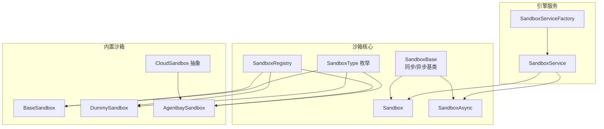
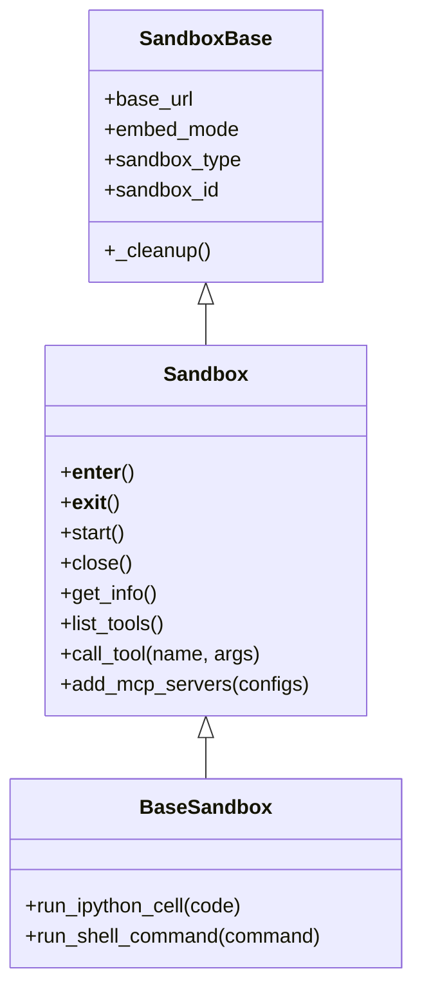
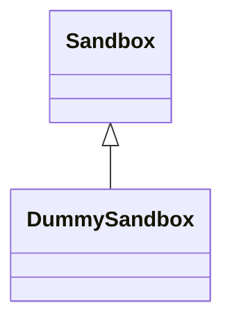
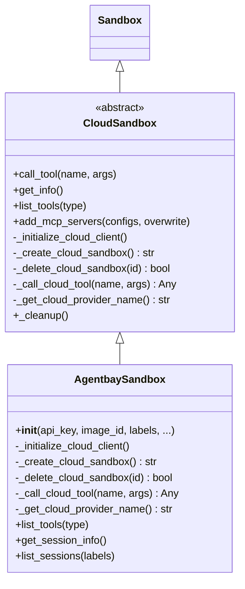
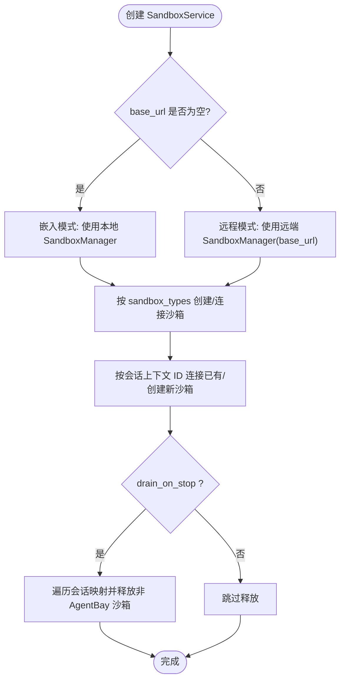
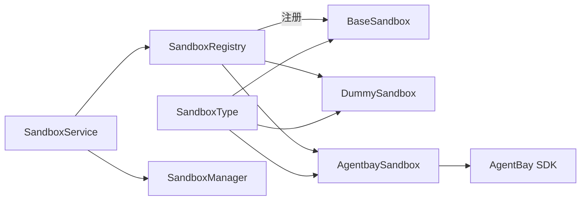

# 基础沙箱类型

<cite>
**本文引用的文件**
- [sandbox.py](file://src/agentscope_runtime/sandbox/box/sandbox.py)
- [base_sandbox.py](file://src/agentscope_runtime/sandbox/box/base/base_sandbox.py)
- [dummy_sandbox.py](file://src/agentscope_runtime/sandbox/box/dummy/dummy_sandbox.py)
- [cloud_sandbox.py](file://src/agentscope_runtime/sandbox/box/cloud/cloud_sandbox.py)
- [agentbay_sandbox.py](file://src/agentscope_runtime/sandbox/box/agentbay/agentbay_sandbox.py)
- [enums.py](file://src/agentscope_runtime/sandbox/enums.py)
- [registry.py](file://src/agentscope_runtime/sandbox/registry.py)
- [sandbox_service.py](file://src/agentscope_runtime/engine/services/sandbox/sandbox_service.py)
- [sandbox_service_factory.py](file://src/agentscope_runtime/engine/services/sandbox/sandbox_service_factory.py)
- [test_sandbox.py](file://tests/sandbox/test_sandbox.py)
- [test_cloud_sandbox.py](file://tests/unit/test_cloud_sandbox.py)
- [README.md（自定义沙箱示例）](file://examples/sandbox/custom_sandbox/README.md)
</cite>

## 目录
1. [简介](#简介)
2. [项目结构](#项目结构)
3. [核心组件](#核心组件)
4. [架构总览](#架构总览)
5. [详细组件分析](#详细组件分析)
6. [依赖分析](#依赖分析)
7. [性能考虑](#性能考虑)
8. [故障排查指南](#故障排查指南)
9. [结论](#结论)
10. [附录：实现与扩展指南](#附录实现与扩展指南)

## 简介
本文件系统性梳理“基础沙箱类型”的设计理念、接口抽象与实现形态，覆盖以下三类：
- 基础沙箱（BaseSandbox）：本地容器运行的通用执行环境，提供 IPython 单元执行与 Shell 命令执行能力。
- 虚拟沙箱（DummySandbox）：轻量级占位实现，用于测试或演示，不依赖真实容器。
- 云沙箱（CloudSandbox）：面向云端的统一抽象，通过云 API 管理远程会话；以 AgentBay 实现为例展示云端执行能力。

同时给出使用场景、配置要点、调用流程与扩展方法，帮助读者在不同部署形态下正确选择与使用沙箱类型。

## 项目结构
围绕沙箱类型的关键文件组织如下：
- 沙箱基类与同步/异步接口：src/agentscope_runtime/sandbox/box/sandbox.py
- 基础沙箱实现：src/agentscope_runtime/sandbox/box/base/base_sandbox.py
- 虚拟沙箱实现：src/agentscope_runtime/sandbox/box/dummy/dummy_sandbox.py
- 云沙箱抽象与 AgentBay 实现：src/agentscope_runtime/sandbox/box/cloud/cloud_sandbox.py、src/agentscope_runtime/sandbox/box/agentbay/agentbay_sandbox.py
- 枚举与注册表：src/agentscope_runtime/sandbox/enums.py、src/agentscope_runtime/sandbox/registry.py
- 引擎侧服务与工厂：src/agentscope_runtime/engine/services/sandbox/sandbox_service.py、src/agentscope_runtime/engine/services/sandbox/sandbox_service_factory.py
- 测试与示例：tests/sandbox/test_sandbox.py、tests/unit/test_cloud_sandbox.py、examples/sandbox/custom_sandbox/README.md



**图表来源**
- [sandbox.py:18-313](file://src/agentscope_runtime/sandbox/box/sandbox.py#L18-L313)
- [base_sandbox.py:11-102](file://src/agentscope_runtime/sandbox/box/base/base_sandbox.py#L11-L102)
- [dummy_sandbox.py:10-33](file://src/agentscope_runtime/sandbox/box/dummy/dummy_sandbox.py#L10-L33)
- [cloud_sandbox.py:19-251](file://src/agentscope_runtime/sandbox/box/cloud/cloud_sandbox.py#L19-L251)
- [agentbay_sandbox.py:20-558](file://src/agentscope_runtime/sandbox/box/agentbay/agentbay_sandbox.py#L20-L558)
- [enums.py:61-80](file://src/agentscope_runtime/sandbox/enums.py#L61-L80)
- [registry.py:33-131](file://src/agentscope_runtime/sandbox/registry.py#L33-L131)
- [sandbox_service.py:11-238](file://src/agentscope_runtime/engine/services/sandbox/sandbox_service.py#L11-L238)
- [sandbox_service_factory.py:9-50](file://src/agentscope_runtime/engine/services/sandbox/sandbox_service_factory.py#L9-L50)

**章节来源**
- [sandbox.py:18-313](file://src/agentscope_runtime/sandbox/box/sandbox.py#L18-L313)
- [base_sandbox.py:11-102](file://src/agentscope_runtime/sandbox/box/base/base_sandbox.py#L11-L102)
- [dummy_sandbox.py:10-33](file://src/agentscope_runtime/sandbox/box/dummy/dummy_sandbox.py#L10-L33)
- [cloud_sandbox.py:19-251](file://src/agentscope_runtime/sandbox/box/cloud/cloud_sandbox.py#L19-L251)
- [agentbay_sandbox.py:20-558](file://src/agentscope_runtime/sandbox/box/agentbay/agentbay_sandbox.py#L20-L558)
- [enums.py:61-80](file://src/agentscope_runtime/sandbox/enums.py#L61-L80)
- [registry.py:33-131](file://src/agentscope_runtime/sandbox/registry.py#L33-L131)
- [sandbox_service.py:11-238](file://src/agentscope_runtime/engine/services/sandbox/sandbox_service.py#L11-L238)
- [sandbox_service_factory.py:9-50](file://src/agentscope_runtime/engine/services/sandbox/sandbox_service_factory.py#L9-L50)

## 核心组件
- SandboxBase：统一处理嵌入式/远程模式、生命周期管理（信号、退出清理）、SandboxFS 文件系统门面初始化。
- Sandbox/SandboxAsync：上下文管理器入口，负责从池化资源中创建/连接沙箱，封装工具调用与 MCP 服务器接入。
- BaseSandbox/BaseSandboxAsync：在通用沙箱基础上暴露 run_ipython_cell 与 run_shell_command 工具。
- DummySandbox：最小可用实现，注册到注册表，便于测试与演示。
- CloudSandbox：云原生抽象，屏蔽本地容器依赖，直接对接云 API，提供统一工具调用、会话生命周期与清理。
- AgentbaySandbox：CloudSandbox 的具体实现，对接 AgentBay 云服务，支持多镜像类型与浏览器/文件系统等工具映射。
- SandboxType/Registry：枚举与注册表，统一管理沙箱类型、镜像、超时、安全等级等元数据。

**章节来源**
- [sandbox.py:18-313](file://src/agentscope_runtime/sandbox/box/sandbox.py#L18-L313)
- [base_sandbox.py:11-102](file://src/agentscope_runtime/sandbox/box/base/base_sandbox.py#L11-L102)
- [dummy_sandbox.py:10-33](file://src/agentscope_runtime/sandbox/box/dummy/dummy_sandbox.py#L10-L33)
- [cloud_sandbox.py:19-251](file://src/agentscope_runtime/sandbox/box/cloud/cloud_sandbox.py#L19-L251)
- [agentbay_sandbox.py:20-558](file://src/agentscope_runtime/sandbox/box/agentbay/agentbay_sandbox.py#L20-L558)
- [enums.py:61-80](file://src/agentscope_runtime/sandbox/enums.py#L61-L80)
- [registry.py:33-131](file://src/agentscope_runtime/sandbox/registry.py#L33-L131)

## 架构总览
沙箱类型在“本地容器”与“云端会话”两种运行模式间解耦：
- 本地模式：Sandbox/SandboxAsync 通过 SandboxManager 创建/复用容器，支持池化预热、心跳回收、资源上限控制。
- 远程模式：通过 base_url 指向远端 SandboxManager，所有操作经 HTTP 委托给服务端。
- 云模式：CloudSandbox 不依赖本地容器，直接与云 API 交互，按需创建/销毁会话，适合跨地域、弹性扩缩容场景。

```mermaid
sequenceDiagram
participant App as "应用"
participant Box as "Sandbox/CloudSandbox"
participant Mgr as "SandboxManager"
participant Cld as "云客户端(AgentBay)"
participant Sess as "云会话"
App->>Box : with Sandbox(...) as box / with CloudSandbox(...)
alt 本地模式
Box->>Mgr : create/create_from_pool
Mgr-->>Box : sandbox_id
else 远程模式
Box->>Mgr : create/create_from_pool(base_url)
Mgr-->>Box : sandbox_id
else 云模式
Box->>Cld : create(CreateSessionParams)
Cld-->>Box : session_id
end
App->>Box : call_tool("run_shell_command", {...})
alt 本地/远程
Box->>Mgr : call_tool(sandbox_id, ...)
Mgr-->>Box : 结果
else 云模式
Box->>Cld : get(session_id)
Cld-->>Box : Session
Box->>Sess : command.execute_command(...)
Sess-->>Box : 执行结果
end
App-->>Box : 上下文结束
Box->>Box : 清理/释放
```

**图表来源**
- [sandbox.py:148-313](file://src/agentscope_runtime/sandbox/box/sandbox.py#L148-L313)
- [cloud_sandbox.py:140-251](file://src/agentscope_runtime/sandbox/box/cloud/cloud_sandbox.py#L140-L251)
- [agentbay_sandbox.py:115-242](file://src/agentscope_runtime/sandbox/box/agentbay/agentbay_sandbox.py#L115-L242)

## 详细组件分析

### 基础沙箱（BaseSandbox）
- 设计理念
  - 作为通用执行环境，提供 IPython 单元执行与 Shell 命令执行两类核心工具，满足脚本化、数据处理与系统运维场景。
  - 通过注册表注册，绑定镜像名、超时、安全等级等元信息，便于统一调度与资源配额控制。
- 接口与行为
  - run_ipython_cell：执行 Python 代码单元，返回执行状态与输出。
  - run_shell_command：执行 Shell 命令，返回输出与退出码。
  - 继承自 Sandbox，具备统一的上下文管理、工具列表查询、MCP 服务器接入与文件系统门面。
- 使用场景
  - 本地开发调试、自动化脚本执行、容器内临时任务编排。
- 配置要点
  - 可通过 base_url 进入远程模式，或在嵌入模式下利用池化资源提升启动速度。
  - workspace_dir 仅在嵌入模式生效，用于挂载本地工作目录。



**图表来源**
- [sandbox.py:18-313](file://src/agentscope_runtime/sandbox/box/sandbox.py#L18-L313)
- [base_sandbox.py:18-102](file://src/agentscope_runtime/sandbox/box/base/base_sandbox.py#L18-L102)

**章节来源**
- [base_sandbox.py:11-102](file://src/agentscope_runtime/sandbox/box/base/base_sandbox.py#L11-L102)
- [sandbox.py:148-220](file://src/agentscope_runtime/sandbox/box/sandbox.py#L148-L220)
- [test_sandbox.py:29-43](file://tests/sandbox/test_sandbox.py#L29-L43)

### 虚拟沙箱（DummySandbox）
- 设计理念
  - 最小可用实现，不创建真实容器或会话，主要用于单元测试、示例演示与快速验证。
- 行为特征
  - 注册到注册表，类型为 DUMMY；无额外工具方法，生命周期与清理逻辑沿用基类。
- 使用场景
  - 快速集成测试、离线演示、占位替换。
- 配置要点
  - 无需镜像或令牌；可直接实例化并进入上下文。



**图表来源**
- [dummy_sandbox.py:10-33](file://src/agentscope_runtime/sandbox/box/dummy/dummy_sandbox.py#L10-L33)
- [enums.py:64-64](file://src/agentscope_runtime/sandbox/enums.py#L64-L64)

**章节来源**
- [dummy_sandbox.py:10-33](file://src/agentscope_runtime/sandbox/box/dummy/dummy_sandbox.py#L10-L33)
- [enums.py:64-64](file://src/agentscope_runtime/sandbox/enums.py#L64-L64)

### 云沙箱（CloudSandbox）与 AgentBay 实现
- 设计理念
  - 云沙箱抽象屏蔽本地容器依赖，统一工具调用、会话生命周期与清理流程，便于跨平台、弹性扩缩容。
- 关键抽象
  - _initialize_cloud_client：初始化云客户端（如 AgentBay SDK）。
  - _create_cloud_sandbox/_delete_cloud_sandbox：创建/删除云会话。
  - _call_cloud_tool：将工具名称映射到云 API 方法，返回标准化结果。
  - call_tool/get_info/list_tools/add_mcp_servers：统一对外接口。
- AgentBay 实现要点
  - 支持多种镜像类型（Linux/Windows/Browser/CodeSpace/Mobile），通过 image_id 选择。
  - 提供工具映射：命令执行、文件系统操作、截图、浏览器导航/点击/输入等。
  - 会话信息查询与会话列表管理。
- 使用场景
  - 跨地域协作、高并发任务编排、需要隔离与可观测性的企业级应用。
- 配置要点
  - api_key 或环境变量 AGENTBAY_API_KEY；可指定 base_url 与 labels；支持自定义云参数。



**图表来源**
- [cloud_sandbox.py:19-251](file://src/agentscope_runtime/sandbox/box/cloud/cloud_sandbox.py#L19-L251)
- [agentbay_sandbox.py:20-558](file://src/agentscope_runtime/sandbox/box/agentbay/agentbay_sandbox.py#L20-L558)

**章节来源**
- [cloud_sandbox.py:19-251](file://src/agentscope_runtime/sandbox/box/cloud/cloud_sandbox.py#L19-L251)
- [agentbay_sandbox.py:20-558](file://src/agentscope_runtime/sandbox/box/agentbay/agentbay_sandbox.py#L20-L558)
- [test_cloud_sandbox.py:15-253](file://tests/unit/test_cloud_sandbox.py#L15-L253)

### 引擎服务与工厂（SandboxService/SandboxServiceFactory）
- SandboxService
  - 在嵌入/远程模式下统一管理沙箱生命周期，支持按会话上下文 ID 连接/创建沙箱。
  - 对非 AgentBay 类型沙箱支持自动释放，保障资源不泄漏。
- SandboxServiceFactory
  - 支持默认后端与环境变量驱动的配置，便于在不同部署形态间切换。
- 使用建议
  - 生产环境建议开启 drain_on_stop，保证服务停止时释放资源。
  - 通过环境变量或构造参数灵活配置 base_url 与 bearer_token。



**图表来源**
- [sandbox_service.py:11-238](file://src/agentscope_runtime/engine/services/sandbox/sandbox_service.py#L11-L238)
- [sandbox_service_factory.py:9-50](file://src/agentscope_runtime/engine/services/sandbox/sandbox_service_factory.py#L9-L50)

**章节来源**
- [sandbox_service.py:11-238](file://src/agentscope_runtime/engine/services/sandbox/sandbox_service.py#L11-L238)
- [sandbox_service_factory.py:9-50](file://src/agentscope_runtime/engine/services/sandbox/sandbox_service_factory.py#L9-L50)

## 依赖分析
- 组件耦合
  - BaseSandbox/DummySandbox 依赖 Sandbox 基类与注册表，统一工具调用与生命周期。
  - CloudSandbox 抽象与 AgentbaySandbox 实现强依赖于云 SDK（示例中为 AgentBay）。
  - SandboxService 依赖 SandboxRegistry 与 SandboxManager，负责跨沙箱类型的统一管理。
- 外部依赖
  - 云沙箱依赖第三方云 SDK（示例中为 AgentBay SDK），需安装相应依赖。
  - 注册表与枚举提供类型与元信息的集中管理，避免硬编码。



**图表来源**
- [registry.py:33-131](file://src/agentscope_runtime/sandbox/registry.py#L33-L131)
- [enums.py:61-80](file://src/agentscope_runtime/sandbox/enums.py#L61-L80)
- [sandbox_service.py:11-238](file://src/agentscope_runtime/engine/services/sandbox/sandbox_service.py#L11-L238)
- [agentbay_sandbox.py:88-114](file://src/agentscope_runtime/sandbox/box/agentbay/agentbay_sandbox.py#L88-L114)

**章节来源**
- [registry.py:33-131](file://src/agentscope_runtime/sandbox/registry.py#L33-L131)
- [enums.py:61-80](file://src/agentscope_runtime/sandbox/enums.py#L61-L80)
- [sandbox_service.py:11-238](file://src/agentscope_runtime/engine/services/sandbox/sandbox_service.py#L11-L238)
- [agentbay_sandbox.py:88-114](file://src/agentscope_runtime/sandbox/box/agentbay/agentbay_sandbox.py#L88-L114)

## 性能考虑
- 池化与预热
  - 通过 SandboxManager 的池化机制减少冷启动时间，合理设置池大小与预热数量。
- 资源限制
  - 利用注册表中的 resource_limits 与 runtime_config 控制内存/CPU，避免资源争用。
- 云模式延迟
  - 云沙箱的网络往返会引入额外延迟，建议批量工具调用与结果缓存策略。
- 清理与回收
  - 启用自动清理与心跳扫描，及时回收闲置会话，防止资源泄露。

[本节为通用指导，无需特定文件引用]

## 故障排查指南
- 本地沙箱无法启动
  - 检查池化资源是否耗尽、最大实例数限制、容器启动失败日志。
  - 参考测试用例中的健康检查与异常路径。
- 远程模式连接失败
  - 核对 base_url 与 bearer_token，确认服务端健康状态与网络连通性。
- 云沙箱创建失败
  - 检查 api_key/环境变量、云 API 权限与配额；查看抽象方法实现是否完整。
- 清理异常
  - 云沙箱清理在异常情况下应记录错误但不中断流程，确保最终释放。

**章节来源**
- [test_sandbox.py:80-190](file://tests/sandbox/test_sandbox.py#L80-L190)
- [test_cloud_sandbox.py:95-253](file://tests/unit/test_cloud_sandbox.py#L95-L253)
- [cloud_sandbox.py:222-251](file://src/agentscope_runtime/sandbox/box/cloud/cloud_sandbox.py#L222-L251)

## 结论
- 基础沙箱提供稳定、通用的本地执行能力，适合大多数开发与测试场景。
- 虚拟沙箱以极低开销满足占位与演示需求，便于快速集成。
- 云沙箱通过统一抽象屏蔽底层差异，结合 AgentBay 等云服务实现弹性、可扩展的执行环境。
- 通过注册表与引擎服务工厂，可在不同部署形态间平滑切换，并保持一致的编程模型。

[本节为总结，无需特定文件引用]

## 附录：实现与扩展指南
- 自定义沙箱实现步骤
  - 继承 Sandbox 并使用 @SandboxRegistry.register 装饰器注册，声明镜像名、类型、超时、安全等级与描述。
  - 如需云模式，继承 CloudSandbox 并实现抽象方法（客户端初始化、会话创建/删除、工具调用映射）。
  - 准备对应 Docker 镜像，包含所需依赖与 MCP 服务配置。
- 配置与部署
  - 本地/远程模式：通过 base_url/bearer_token 控制；嵌入模式支持 workspace_dir 与池化配置。
  - 云模式：设置 api_key 或环境变量，选择 image_id 与标签，按需传入云特定参数。
- 示例参考
  - 自定义沙箱示例与 Dockerfile 编写规范可参考示例文档。

**章节来源**
- [README.md（自定义沙箱示例）:23-184](file://examples/sandbox/custom_sandbox/README.md#L23-L184)
- [registry.py:33-131](file://src/agentscope_runtime/sandbox/registry.py#L33-L131)
- [cloud_sandbox.py:83-139](file://src/agentscope_runtime/sandbox/box/cloud/cloud_sandbox.py#L83-L139)
- [agentbay_sandbox.py:43-87](file://src/agentscope_runtime/sandbox/box/agentbay/agentbay_sandbox.py#L43-L87)