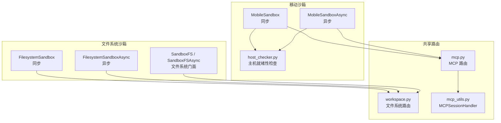
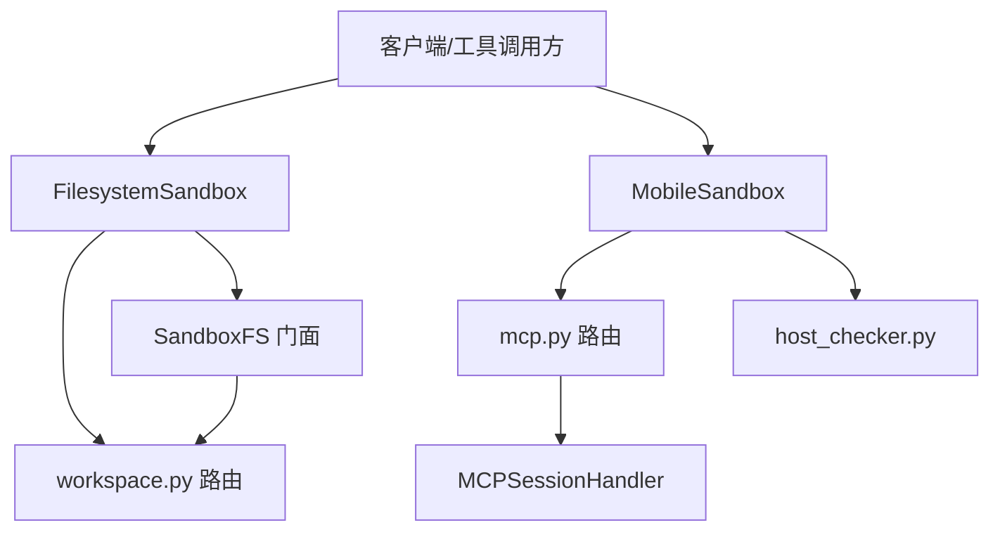
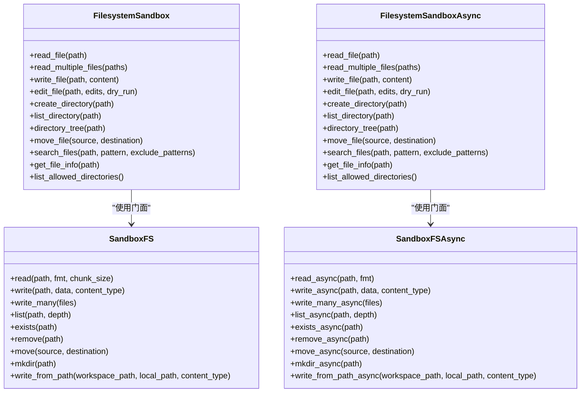
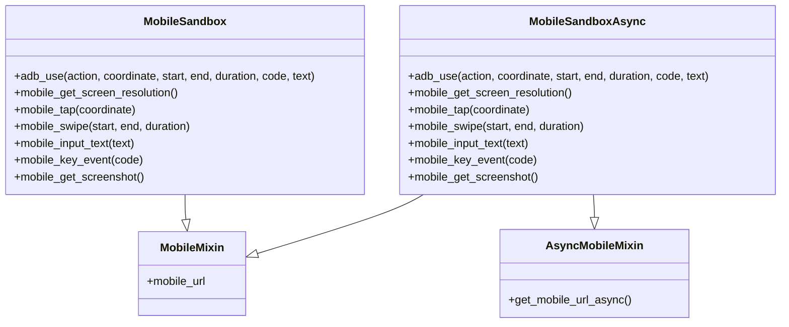
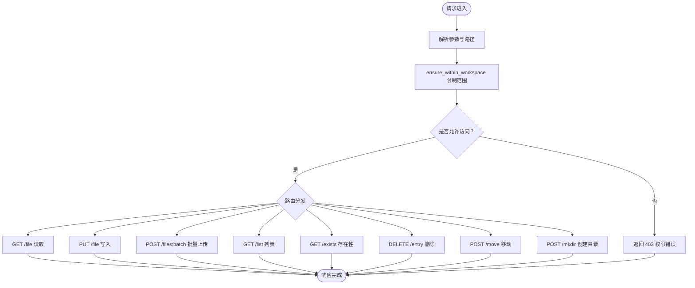
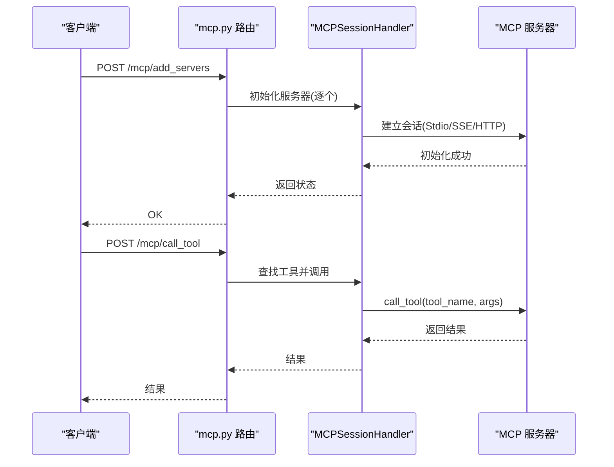
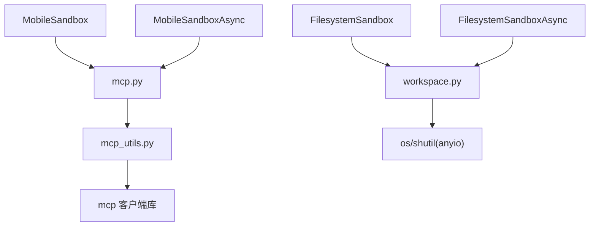

# 文件系统和移动沙箱

<cite>
**本文引用的文件**   
- [filesystem_sandbox.py](file://src/agentscope_runtime/sandbox/box/filesystem/filesystem_sandbox.py)
- [mobile_sandbox.py](file://src/agentscope_runtime/sandbox/box/mobile/mobile_sandbox.py)
- [fs.py](file://src/agentscope_runtime/sandbox/box/components/fs.py)
- [workspace.py](file://src/agentscope_runtime/sandbox/box/shared/routers/workspace.py)
- [mcp.py](file://src/agentscope_runtime/sandbox/box/shared/routers/mcp.py)
- [mcp_utils.py](file://src/agentscope_runtime/sandbox/box/shared/routers/mcp_utils.py)
- [host_checker.py](file://src/agentscope_runtime/sandbox/box/mobile/box/host_checker.py)
- [mcp_server_configs.json（移动沙箱）](file://src/agentscope_runtime/sandbox/box/mobile/box/mcp_server_configs.json)
- [playwright_mcp_config.json](file://src/agentscope_runtime/sandbox/box/browser/box/playwright_mcp_config.json)
- [requirements.txt（移动沙箱）](file://src/agentscope_runtime/sandbox/box/mobile/box/requirements.txt)
- [requirements.txt（文件系统沙箱）](file://src/agentscope_runtime/sandbox/box/filesystem/box/requirements.txt)
</cite>

## 目录
1. [简介](#简介)
2. [项目结构](#项目结构)
3. [核心组件](#核心组件)
4. [架构总览](#架构总览)
5. [详细组件分析](#详细组件分析)
6. [依赖关系分析](#依赖关系分析)
7. [性能考量](#性能考量)
8. [故障排查指南](#故障排查指南)
9. [结论](#结论)
10. [附录](#附录)

## 简介
本文件系统与移动沙箱文档聚焦两类运行时沙盒能力：
- 文件系统沙箱：提供对工作区的文件读写、目录管理、批量上传、搜索与元数据查询等能力，强调在受控工作区内进行安全隔离的文件操作。
- 移动沙箱：面向移动端设备的图形化交互与自动化控制，通过 ADB MCP 协议集成实现点击、滑动、输入文本、按键事件、截图等操作，并提供移动端 VNC/WebSockify 连接入口。

两者均基于统一的沙箱注册与工具调用机制，配合 MCP（Model Context Protocol）服务实现“工具即插拔”的扩展能力；同时通过 FastAPI 路由层实现工作区文件系统的安全访问与流式传输。

## 项目结构
围绕文件系统与移动沙箱的关键目录与文件如下：
- 文件系统沙箱：定义同步/异步两类沙箱类，封装文件读写、目录树、搜索、移动等工具调用。
- 移动沙箱：定义同步/异步两类沙箱类，封装 ADB 动作与移动端连接 URL 生成；包含主机就绪性检查。
- 工作区路由：FastAPI 路由实现文件读取、写入、批量上传、列表、存在性、删除、移动、创建目录等接口，并限制在指定工作区目录内。
- MCP 路由与工具：提供 MCP 服务器添加、工具列举与调用，以及启动/关闭时的资源清理。
- 组件适配器：SandboxFS/SandboxFSAsync 提供对沙箱内工作区的统一文件系统访问门面。
- 配置与依赖：各沙箱的 MCP 配置与 Python 依赖清单。

图表来源
- [filesystem_sandbox.py:13-254](file://src/agentscope_runtime/sandbox/box/filesystem/filesystem_sandbox.py#L13-L254)
- [mobile_sandbox.py:80-342](file://src/agentscope_runtime/sandbox/box/mobile/mobile_sandbox.py#L80-L342)
- [fs.py:17-279](file://src/agentscope_runtime/sandbox/box/components/fs.py#L17-L279)
- [workspace.py:197-394](file://src/agentscope_runtime/sandbox/box/shared/routers/workspace.py#L197-L394)
- [mcp.py:24-208](file://src/agentscope_runtime/sandbox/box/shared/routers/mcp.py#L24-L208)
- [mcp_utils.py:32-188](file://src/agentscope_runtime/sandbox/box/shared/routers/mcp_utils.py#L32-L188)
- [host_checker.py](file://src/agentscope_runtime/sandbox/box/mobile/box/host_checker.py)

章节来源
- [filesystem_sandbox.py:13-254](file://src/agentscope_runtime/sandbox/box/filesystem/filesystem_sandbox.py#L13-L254)
- [mobile_sandbox.py:80-342](file://src/agentscope_runtime/sandbox/box/mobile/mobile_sandbox.py#L80-L342)
- [fs.py:17-279](file://src/agentscope_runtime/sandbox/box/components/fs.py#L17-L279)
- [workspace.py:197-394](file://src/agentscope_runtime/sandbox/box/shared/routers/workspace.py#L197-L394)
- [mcp.py:24-208](file://src/agentscope_runtime/sandbox/box/shared/routers/mcp.py#L24-L208)
- [mcp_utils.py:32-188](file://src/agentscope_runtime/sandbox/box/shared/routers/mcp_utils.py#L32-L188)
- [host_checker.py](file://src/agentscope_runtime/sandbox/box/mobile/box/host_checker.py)

## 核心组件
- 文件系统沙箱（同步/异步）
  - 同步：FilesystemSandbox，提供读取单/多文件、写入、编辑、创建目录、列出目录、目录树、移动、搜索、文件信息、允许访问目录列表等方法。
  - 异步：FilesystemSandboxAsync，对应异步版本的上述能力。
- 移动沙箱（同步/异步）
  - 同步：MobileSandbox，提供通用 ADB 动作分发与具体动作封装（点击、滑动、输入文本、按键、截图、分辨率查询），并生成移动端 VNC/WebSockify 访问 URL。
  - 异步：MobileSandboxAsync，对应异步版本。
- 文件系统门面（同步/异步）
  - SandboxFS/SandboxFSAsync：对沙箱内工作区提供统一的读写、批量上传、列表、存在性、删除、移动、创建目录、从本地路径写入等接口。
- 工作区路由
  - workspace.py：实现文件读取（文本/字节/流）、写入（含流式）、批量上传、目录列表、存在性、删除、移动、创建目录等，严格限制在 WORKSPACE_DIR 内。
- MCP 路由与会话
  - mcp.py：提供添加 MCP 服务器、列举工具、调用工具、启动/关闭清理。
  - mcp_utils.py：MCPSessionHandler 封装 MCP 会话初始化、工具列举、带重试的工具调用与资源清理。
- 主机就绪性检查
  - host_checker.py：移动沙箱启动前进行主机环境检查，确保运行条件满足。

章节来源
- [filesystem_sandbox.py:37-253](file://src/agentscope_runtime/sandbox/box/filesystem/filesystem_sandbox.py#L37-L253)
- [mobile_sandbox.py:114-341](file://src/agentscope_runtime/sandbox/box/mobile/mobile_sandbox.py#L114-L341)
- [fs.py:17-279](file://src/agentscope_runtime/sandbox/box/components/fs.py#L17-L279)
- [workspace.py:197-394](file://src/agentscope_runtime/sandbox/box/shared/routers/workspace.py#L197-L394)
- [mcp.py:24-208](file://src/agentscope_runtime/sandbox/box/shared/routers/mcp.py#L24-L208)
- [mcp_utils.py:32-188](file://src/agentscope_runtime/sandbox/box/shared/routers/mcp_utils.py#L32-L188)
- [host_checker.py](file://src/agentscope_runtime/sandbox/box/mobile/box/host_checker.py)

## 架构总览
文件系统与移动沙箱通过统一的工具调用机制与 MCP 协议实现“能力即插拔”。文件系统能力由工作区路由直接暴露，移动沙箱通过 MCP 服务器承载 ADB 功能，并提供移动端连接入口。

图表来源
- [filesystem_sandbox.py:13-254](file://src/agentscope_runtime/sandbox/box/filesystem/filesystem_sandbox.py#L13-L254)
- [mobile_sandbox.py:80-342](file://src/agentscope_runtime/sandbox/box/mobile/mobile_sandbox.py#L80-L342)
- [fs.py:17-279](file://src/agentscope_runtime/sandbox/box/components/fs.py#L17-L279)
- [workspace.py:197-394](file://src/agentscope_runtime/sandbox/box/shared/routers/workspace.py#L197-L394)
- [mcp.py:24-208](file://src/agentscope_runtime/sandbox/box/shared/routers/mcp.py#L24-L208)
- [mcp_utils.py:32-188](file://src/agentscope_runtime/sandbox/box/shared/routers/mcp_utils.py#L32-L188)
- [host_checker.py](file://src/agentscope_runtime/sandbox/box/mobile/box/host_checker.py)

## 详细组件分析

### 文件系统沙箱组件分析
- 设计要点
  - 通过注册装饰器将镜像 URI、类型、安全等级、超时与描述注册到沙箱注册表。
  - 继承 GUI 混入以支持可视化能力，提供同步与异步两类沙箱。
  - 所有文件操作均通过工具调用转发至后端工作区路由或 MCP 工具。
- 关键方法与用途
  - 读取：单文件、多文件、异步读取。
  - 写入：单文件覆盖/新建、异步写入。
  - 编辑：基于行级替换的文本编辑（支持预览）。
  - 目录：创建、列出、目录树、移动、搜索、信息查询、允许访问目录列表。
- 安全与隔离
  - 文件系统操作最终由工作区路由实现，严格限制在 WORKSPACE_DIR 内，防止越权访问。
  - 支持流式读取与写入，降低内存占用，提升大文件处理能力。

图表来源
- [filesystem_sandbox.py:13-254](file://src/agentscope_runtime/sandbox/box/filesystem/filesystem_sandbox.py#L13-L254)
- [fs.py:17-279](file://src/agentscope_runtime/sandbox/box/components/fs.py#L17-L279)

章节来源
- [filesystem_sandbox.py:13-254](file://src/agentscope_runtime/sandbox/box/filesystem/filesystem_sandbox.py#L13-L254)
- [fs.py:17-279](file://src/agentscope_runtime/sandbox/box/components/fs.py#L17-L279)

### 移动沙箱组件分析
- 设计要点
  - 通过注册装饰器将镜像 URI、类型、安全等级、超时与描述注册到沙箱注册表，并声明特权运行配置。
  - 提供通用 ADB 动作分发与具体动作封装，便于上层工具快速调用。
  - 生成移动端 VNC/WebSockify 访问 URL，支持本地与远程两种模式。
  - 启动时进行主机就绪性检查，确保运行环境满足要求。
- 关键方法与用途
  - 通用 ADB：根据 action 参数分发到不同底层命令（如 tap、swipe、input_text、key_event、get_screenshot、get_screen_resolution）。
  - 具体动作：点击、滑动、输入文本、按键、截图、分辨率查询。
  - URL 生成：根据健康状态与运行令牌生成访问地址。
- 安全与隔离
  - 移动沙箱声明高安全等级与特权运行配置，强调对设备与系统行为的严格控制。
  - 通过 MCP 服务器承载 ADB 能力，避免直接暴露底层系统接口。

图表来源
- [mobile_sandbox.py:17-342](file://src/agentscope_runtime/sandbox/box/mobile/mobile_sandbox.py#L17-L342)

章节来源
- [mobile_sandbox.py:80-342](file://src/agentscope_runtime/sandbox/box/mobile/mobile_sandbox.py#L80-L342)

### 文件系统工作区路由分析
- 设计要点
  - 通过环境变量 WORKSPACE_DIR 约束所有文件操作范围，默认为 “/workspace”。
  - 使用线程池避免阻塞事件循环，实现异步读写与目录扫描。
  - 支持文本、字节与流式读取；支持批量上传并兼容路径数组。
- 关键路由与行为
  - GET /file：读取文件（文本/字节/流）。
  - PUT /file：写入文件（流式写入，失败自动清理）。
  - POST /files:batch：批量上传文件，支持显式目标路径。
  - GET /list：目录列表（可递归，受深度限制）。
  - GET /exists：存在性检查。
  - DELETE /entry：删除文件或目录树。
  - POST /move：移动/重命名。
  - POST /mkdir：创建目录。
- 安全策略
  - ensure_within_workspace：确保路径位于 WORKSPACE_DIR 内，否则返回权限错误。
  - 对于已存在的目标路径，拒绝覆盖目录写入，避免误操作。

图表来源
- [workspace.py:29-394](file://src/agentscope_runtime/sandbox/box/shared/routers/workspace.py#L29-L394)

章节来源
- [workspace.py:197-394](file://src/agentscope_runtime/sandbox/box/shared/routers/workspace.py#L197-L394)

### MCP 路由与会话分析
- 设计要点
  - mcp.py：提供添加 MCP 服务器、列举工具、调用工具的 API，并在启动/关闭事件中加载/清理配置。
  - mcp_utils.py：MCPSessionHandler 封装 MCP 会话生命周期，支持 Stdio 与 SSE/StreamableHTTP 两种接入方式，具备重试与资源清理能力。
- 关键流程
  - 添加服务器：校验配置，逐个初始化，支持覆盖旧实例。
  - 列举工具：遍历已初始化服务器，收集工具描述与输入模式。
  - 调用工具：按名称查找工具，调用并返回结果，失败时抛出异常。
  - 启停清理：启动时加载配置，关闭时逐个清理。

图表来源
- [mcp.py:24-208](file://src/agentscope_runtime/sandbox/box/shared/routers/mcp.py#L24-L208)
- [mcp_utils.py:32-188](file://src/agentscope_runtime/sandbox/box/shared/routers/mcp_utils.py#L32-L188)

章节来源
- [mcp.py:24-208](file://src/agentscope_runtime/sandbox/box/shared/routers/mcp.py#L24-L208)
- [mcp_utils.py:32-188](file://src/agentscope_runtime/sandbox/box/shared/routers/mcp_utils.py#L32-L188)

## 依赖关系分析
- 文件系统沙箱
  - 依赖注册表与枚举，继承 GUI 混入，通过工具调用与工作区路由交互。
- 移动沙箱
  - 依赖注册表与枚举，继承 MobileMixin/AsyncMobileMixin，通过 MCP 路由与会话调用 ADB 工具。
- 工作区路由
  - FastAPI 路由，依赖 anyio 线程池与 os/shutil 实现安全的文件操作。
- MCP 路由与会话
  - 依赖 mcp 客户端库，支持 Stdio、SSE 与 StreamableHTTP 三种接入方式。

图表来源
- [filesystem_sandbox.py:13-254](file://src/agentscope_runtime/sandbox/box/filesystem/filesystem_sandbox.py#L13-L254)
- [mobile_sandbox.py:80-342](file://src/agentscope_runtime/sandbox/box/mobile/mobile_sandbox.py#L80-L342)
- [workspace.py:197-394](file://src/agentscope_runtime/sandbox/box/shared/routers/workspace.py#L197-L394)
- [mcp.py:24-208](file://src/agentscope_runtime/sandbox/box/shared/routers/mcp.py#L24-L208)
- [mcp_utils.py:32-188](file://src/agentscope_runtime/sandbox/box/shared/routers/mcp_utils.py#L32-L188)

章节来源
- [filesystem_sandbox.py:13-254](file://src/agentscope_runtime/sandbox/box/filesystem/filesystem_sandbox.py#L13-L254)
- [mobile_sandbox.py:80-342](file://src/agentscope_runtime/sandbox/box/mobile/mobile_sandbox.py#L80-L342)
- [workspace.py:197-394](file://src/agentscope_runtime/sandbox/box/shared/routers/workspace.py#L197-L394)
- [mcp.py:24-208](file://src/agentscope_runtime/sandbox/box/shared/routers/mcp.py#L24-L208)
- [mcp_utils.py:32-188](file://src/agentscope_runtime/sandbox/box/shared/routers/mcp_utils.py#L32-L188)

## 性能考量
- 流式传输
  - 工作区路由在读取与写入时采用分块传输与线程池，避免阻塞事件循环，适合大文件场景。
- 异步接口
  - 文件系统与移动沙箱均提供异步版本，便于在高并发场景下提升吞吐。
- 重试与超时
  - MCP 工具调用具备重试与超时控制，提高稳定性。
- 目录递归
  - 目录树与列表操作支持深度限制，避免深层递归导致的性能问题。

## 故障排查指南
- 文件系统操作
  - 路径越权：若返回权限错误，请确认路径位于 WORKSPACE_DIR 内。
  - 写入冲突：若目标为目录且尝试覆盖，请先删除或变更目标。
  - 大文件写入失败：检查磁盘空间与权限，关注写入过程中的异常清理。
- 移动沙箱
  - 沙箱不健康：生成移动端 URL 前需检查健康状态，若不健康请重启或排查容器。
  - ADB 动作失败：确认设备连接状态与权限，必要时重试或查看日志。
  - 主机就绪性：首次启动移动沙箱前确保主机满足运行条件。
- MCP 服务器
  - 初始化失败：检查配置文件与命令可用性，确认网络可达性。
  - 工具未找到：确认工具名称与输入模式匹配，检查服务器是否正确初始化。

章节来源
- [workspace.py:29-47](file://src/agentscope_runtime/sandbox/box/shared/routers/workspace.py#L29-L47)
- [workspace.py:246-262](file://src/agentscope_runtime/sandbox/box/shared/routers/workspace.py#L246-L262)
- [mobile_sandbox.py:19-78](file://src/agentscope_runtime/sandbox/box/mobile/mobile_sandbox.py#L19-L78)
- [mcp.py:24-84](file://src/agentscope_runtime/sandbox/box/shared/routers/mcp.py#L24-L84)
- [mcp_utils.py:128-172](file://src/agentscope_runtime/sandbox/box/shared/routers/mcp_utils.py#L128-L172)

## 结论
文件系统与移动沙箱通过统一的工具调用与 MCP 协议，实现了灵活、可扩展且安全的运行时能力：
- 文件系统沙箱提供完善的文件与目录管理能力，并通过工作区路由实现严格的访问控制与流式传输。
- 移动沙箱通过 ADB MCP 协议集成移动端自动化与可视化能力，支持高安全等级的设备交互。
- 两者均提供同步与异步接口，便于在不同场景下选择合适的并发模型。

## 附录
- 实际示例（步骤说明）
  - 文件系统操作
    - 在工作区内创建目录：调用创建目录工具或使用文件系统门面的创建目录方法。
    - 批量上传文件：使用批量上传接口，传入文件与目标路径数组。
    - 读取大文件：使用流式读取接口，按块消费数据。
    - 搜索文件：使用搜索工具，指定起始路径与匹配模式。
  - 移动设备管理
    - 连接设备：确保设备已连接并授权，移动沙箱启动后进行主机就绪性检查。
    - 自动化操作：通过通用 ADB 动作分发执行点击、滑动、输入文本、按键与截图。
    - 可视化访问：使用生成的移动端 URL 进行远程桌面访问。
- 跨平台文件共享与移动测试最佳实践
  - 文件共享：统一使用工作区路由与文件系统门面，避免直接操作宿主机文件系统。
  - 移动测试：优先使用 MCP 工具封装的 ADB 动作，减少对底层命令的直接依赖；合理设置重试与超时；在高并发场景下优先使用异步接口。
  - 安全隔离：始终在 WORKSPACE_DIR 内进行文件操作；移动沙箱启用高安全等级与特权运行配置；严格校验工具输入与输出。