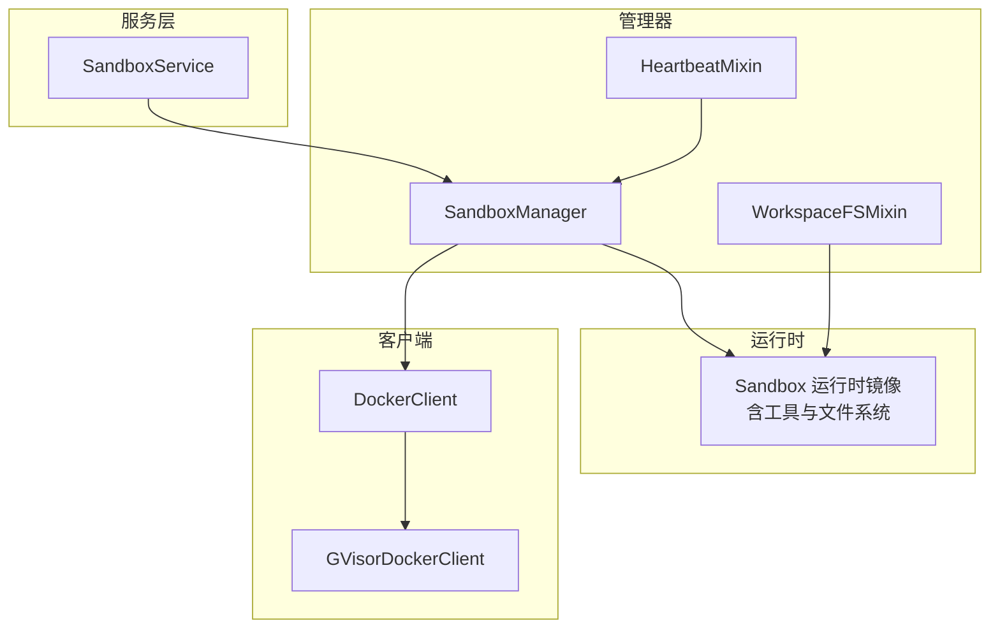
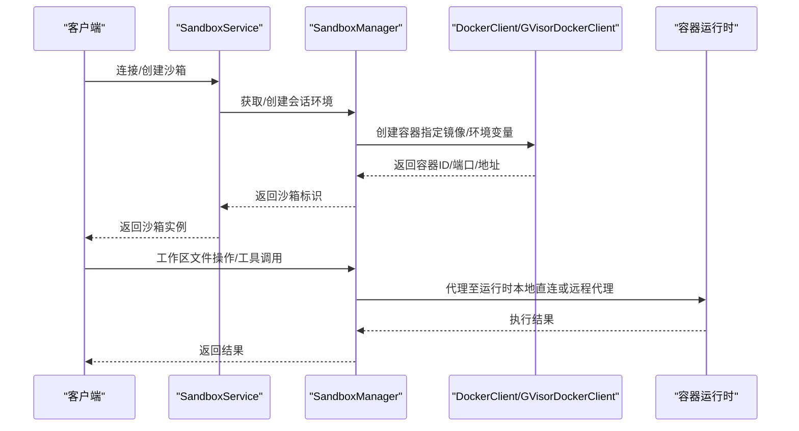
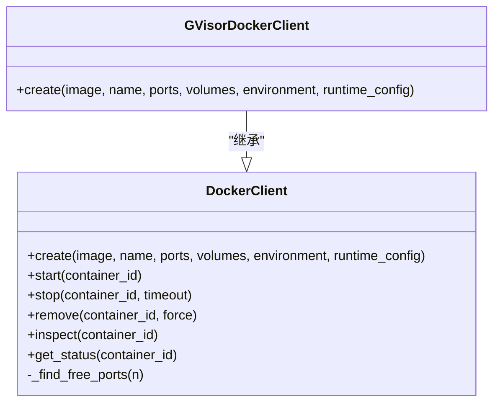
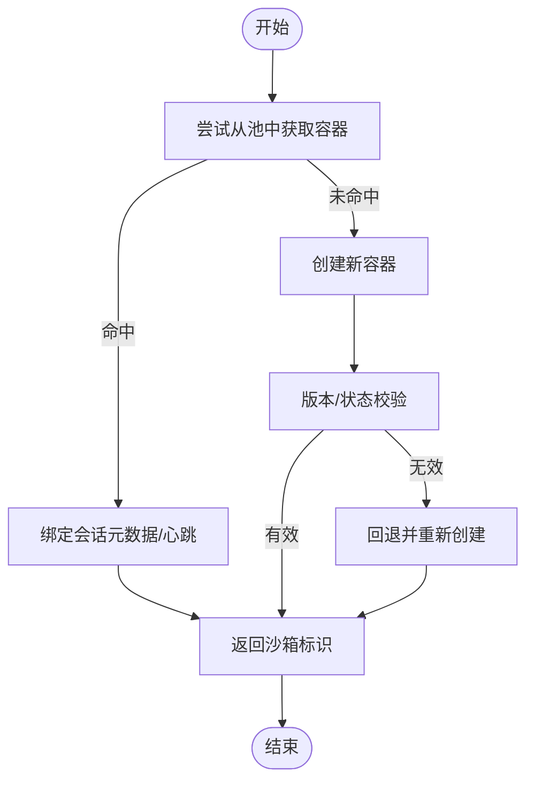
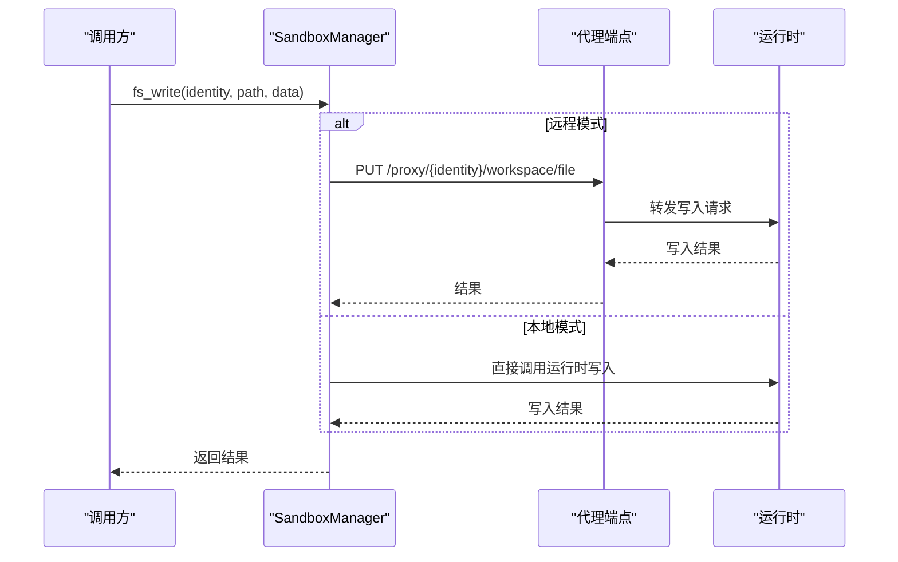
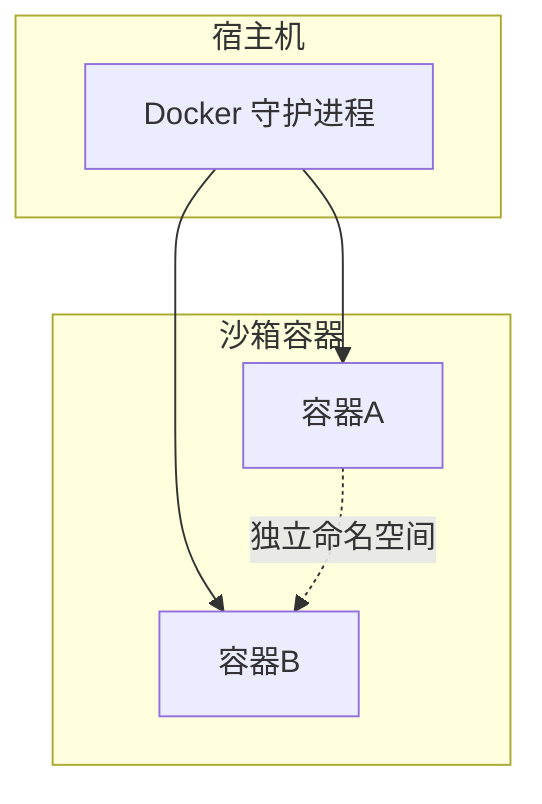
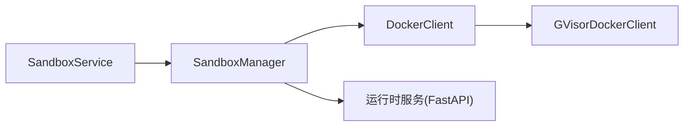

# 沙箱安全隔离机制

<cite>
**本文引用的文件**
- [sandbox.py](file://src/agentscope_runtime/sandbox/box/sandbox.py)
- [sandbox_service.py](file://src/agentscope_runtime/engine/services/sandbox/sandbox_service.py)
- [container.py](file://src/agentscope_runtime/sandbox/model/container.py)
- [docker_client.py](file://src/agentscope_runtime/common/container_clients/docker_client.py)
- [gvisor_client.py](file://src/agentscope_runtime/common/container_clients/gvisor_client.py)
- [base_sandbox.py](file://src/agentscope_runtime/sandbox/box/base/base_sandbox.py)
- [workspace_mixin.py](file://src/agentscope_runtime/sandbox/manager/workspace_mixin.py)
- [heartbeat_mixin.py](file://src/agentscope_runtime/sandbox/manager/heartbeat_mixin.py)
- [sandbox_manager.py](file://src/agentscope_runtime/sandbox/manager/sandbox_manager.py)
- [Dockerfile](file://examples/sandbox/custom_sandbox/Dockerfile)
</cite>

## 目录
1. [引言](#引言)
2. [项目结构](#项目结构)
3. [核心组件](#核心组件)
4. [架构总览](#架构总览)
5. [详细组件分析](#详细组件分析)
6. [依赖分析](#依赖分析)
7. [性能考虑](#性能考虑)
8. [故障排查指南](#故障排查指南)
9. [结论](#结论)
10. [附录](#附录)

## 引言
本文件围绕沙箱安全隔离机制，系统阐述基于 Docker 的容器安全隔离与 gVisor 的安全增强机制在本项目中的实现方式，并结合沙箱构建流程中的安全配置与权限控制，给出网络隔离、文件系统隔离与进程隔离的落地方法。同时提供安全配置示例、漏洞防护策略以及安全审计、入侵检测与合规性检查建议，帮助读者在实践中建立可操作的沙箱安全体系。

## 项目结构
本项目通过“服务层-管理器-客户端-运行时”的分层设计实现沙箱生命周期管理与安全隔离：
- 服务层：对外提供沙箱连接、会话管理与资源回收能力
- 管理器：负责容器池化、心跳与回收、远程/本地模式切换
- 客户端：封装 Docker 客户端与 gVisor 运行时选择
- 运行时：沙箱镜像内提供工具调用与工作区文件系统接口

**图表来源**
- [sandbox_service.py:11-238](file://src/agentscope_runtime/engine/services/sandbox/sandbox_service.py#L11-L238)
- [sandbox_manager.py:140-270](file://src/agentscope_runtime/sandbox/manager/sandbox_manager.py#L140-L270)
- [docker_client.py:20-231](file://src/agentscope_runtime/common/container_clients/docker_client.py#L20-L231)
- [gvisor_client.py:8-39](file://src/agentscope_runtime/common/container_clients/gvisor_client.py#L8-L39)
- [workspace_mixin.py:113-190](file://src/agentscope_runtime/sandbox/manager/workspace_mixin.py#L113-L190)

**章节来源**
- [sandbox_service.py:11-238](file://src/agentscope_runtime/engine/services/sandbox/sandbox_service.py#L11-L238)
- [sandbox_manager.py:140-270](file://src/agentscope_runtime/sandbox/manager/sandbox_manager.py#L140-L270)

## 核心组件
- SandboxService：对外暴露连接、创建/释放沙箱的能力，支持嵌入式与远程模式；在停止时可按配置释放会话资源。
- SandboxManager：负责容器池化、心跳扫描、回收标记、会话映射与远程/本地请求转发；提供工作区文件系统代理与同步/异步 API。
- DockerClient/GVisorDockerClient：封装 Docker 容器生命周期管理；GVisorDockerClient 强制使用 runsc 运行时以提升内核调用安全性。
- WorkspaceFSMixin：统一本地/远程模式下的工作区文件系统操作，支持流式上传下载与批量写入。
- HeartbeatMixin：提供会话级心跳更新、回收标记与分布式锁，保障资源回收与恢复逻辑的一致性。
- ContainerModel：承载容器元数据、状态与会话上下文，用于持久化与跨组件传递。

**章节来源**
- [sandbox_service.py:11-238](file://src/agentscope_runtime/engine/services/sandbox/sandbox_service.py#L11-L238)
- [sandbox_manager.py:140-270](file://src/agentscope_runtime/sandbox/manager/sandbox_manager.py#L140-L270)
- [docker_client.py:20-231](file://src/agentscope_runtime/common/container_clients/docker_client.py#L20-L231)
- [gvisor_client.py:8-39](file://src/agentscope_runtime/common/container_clients/gvisor_client.py#L8-L39)
- [workspace_mixin.py:113-190](file://src/agentscope_runtime/sandbox/manager/workspace_mixin.py#L113-L190)
- [heartbeat_mixin.py:91-110](file://src/agentscope_runtime/sandbox/manager/heartbeat_mixin.py#L91-L110)
- [container.py:19-158](file://src/agentscope_runtime/sandbox/model/container.py#L19-L158)

## 架构总览
下图展示从服务层到运行时的调用链路与安全隔离要点：

**图表来源**
- [sandbox_service.py:82-142](file://src/agentscope_runtime/engine/services/sandbox/sandbox_service.py#L82-L142)
- [sandbox_manager.py:591-704](file://src/agentscope_runtime/sandbox/manager/sandbox_manager.py#L591-L704)
- [docker_client.py:67-135](file://src/agentscope_runtime/common/container_clients/docker_client.py#L67-L135)
- [workspace_mixin.py:137-189](file://src/agentscope_runtime/sandbox/manager/workspace_mixin.py#L137-L189)

## 详细组件分析

### Docker 安全隔离与 gVisor 增强
- Docker 安全隔离要点
  - 镜像拉取与存在性校验：在创建前检查本地镜像，不存在则拉取，失败时返回空值并记录日志，避免不可控镜像运行。
  - 端口分配与占用检测：通过端口集合与 socket 绑定检测保证端口可用，防止端口冲突导致的资源泄漏。
  - 容器状态检查：创建后 reload 并检查状态，异常时回滚并记录错误。
  - 环境变量校验：对传入环境变量进行空值检查，避免注入无效配置。
- gVisor 增强机制
  - GVisorDockerClient 在 DockerClient 基础上强制设置 runtime=runsc，使容器通过用户态内核执行系统调用，降低宿主机内核面风险。
  - 适用于需要更强隔离强度的场景，如多租户或高风险任务。

**图表来源**
- [docker_client.py:67-135](file://src/agentscope_runtime/common/container_clients/docker_client.py#L67-L135)
- [gvisor_client.py:13-38](file://src/agentscope_runtime/common/container_clients/gvisor_client.py#L13-L38)

**章节来源**
- [docker_client.py:67-135](file://src/agentscope_runtime/common/container_clients/docker_client.py#L67-L135)
- [gvisor_client.py:8-39](file://src/agentscope_runtime/common/container_clients/gvisor_client.py#L8-L39)

### 沙箱构建与生命周期管理
- 会话与沙箱类型
  - SandboxService 支持按会话/用户维度创建/连接沙箱，自动识别 AgentBay 会话并做特殊处理。
  - SandboxManager 提供从池中取容器或新建容器的策略，支持版本检查与状态校验。
- 资源限制与回收
  - 通过最大实例数限制与心跳扫描实现资源回收；回收标记与清理流程避免僵尸容器。
- 远程/嵌入模式
  - 通过 base_url/bearer_token 切换远程模式，使用 HTTP 代理访问运行时；嵌入模式直接直连运行时。

**图表来源**
- [sandbox_manager.py:591-704](file://src/agentscope_runtime/sandbox/manager/sandbox_manager.py#L591-L704)

**章节来源**
- [sandbox_service.py:82-142](file://src/agentscope_runtime/engine/services/sandbox/sandbox_service.py#L82-L142)
- [sandbox_manager.py:591-704](file://src/agentscope_runtime/sandbox/manager/sandbox_manager.py#L591-L704)

### 文件系统隔离与权限控制
- 本地/远程模式统一接口
  - WorkspaceFSMixin 提供同步/异步文件系统 API，包括读取、写入、批量写入、列表、存在性检查、移动、创建目录与从本地路径写入等。
  - 远程模式通过代理端点将请求转发至运行时，支持流式传输与多部分上传。
- 权限与挂载控制
  - 默认挂载目录受配置允许开关控制；当不允许挂载时，自动回退到默认挂载目录并创建会话级子目录，避免越权访问宿主机路径。
  - 运行时镜像示例中包含最小化依赖与服务编排，减少攻击面。

**图表来源**
- [workspace_mixin.py:191-231](file://src/agentscope_runtime/sandbox/manager/workspace_mixin.py#L191-L231)
- [sandbox_manager.py:344-442](file://src/agentscope_runtime/sandbox/manager/sandbox_manager.py#L344-L442)

**章节来源**
- [workspace_mixin.py:113-190](file://src/agentscope_runtime/sandbox/manager/workspace_mixin.py#L113-L190)
- [workspace_mixin.py:191-231](file://src/agentscope_runtime/sandbox/manager/workspace_mixin.py#L191-L231)
- [workspace_mixin.py:233-277](file://src/agentscope_runtime/sandbox/manager/workspace_mixin.py#L233-L277)
- [workspace_mixin.py:279-317](file://src/agentscope_runtime/sandbox/manager/workspace_mixin.py#L279-L317)
- [workspace_mixin.py:335-355](file://src/agentscope_runtime/sandbox/manager/workspace_mixin.py#L335-L355)
- [workspace_mixin.py:357-372](file://src/agentscope_runtime/sandbox/manager/workspace_mixin.py#L357-L372)
- [workspace_mixin.py:374-402](file://src/agentscope_runtime/sandbox/manager/workspace_mixin.py#L374-L402)
- [Dockerfile:1-84](file://examples/sandbox/custom_sandbox/Dockerfile#L1-L84)

### 进程隔离与网络隔离
- 进程隔离
  - 每个沙箱作为独立容器运行，拥有独立 PID/IPC/UTS 命名空间；通过容器运行时的 cgroup 与资源限制进一步约束 CPU/内存。
  - 运行时镜像采用最小化依赖与服务编排（如 supervisor/nginx），仅暴露必要端口与进程，降低横向移动风险。
- 网络隔离
  - 端口分配采用范围扫描与占用检测，避免冲突；容器间默认不互通，除非显式映射相同端口或加入同一自定义网络。
  - 运行时镜像示例中包含 GUI/浏览器相关组件，但通过 no-sandbox 参数与最小化权限启动，降低浏览器沙箱逃逸风险。

**图表来源**
- [docker_client.py:204-231](file://src/agentscope_runtime/common/container_clients/docker_client.py#L204-L231)
- [Dockerfile:49-49](file://examples/sandbox/custom_sandbox/Dockerfile#L49-L49)

**章节来源**
- [docker_client.py:204-231](file://src/agentscope_runtime/common/container_clients/docker_client.py#L204-L231)
- [Dockerfile:1-84](file://examples/sandbox/custom_sandbox/Dockerfile#L1-L84)

### 安全配置示例与最佳实践
- 使用 gVisor 运行时
  - 在容器创建时强制 runtime=runsc，以启用用户态内核，降低内核漏洞利用风险。
  - 参考路径：[gVisorDockerClient.create:13-38](file://src/agentscope_runtime/common/container_clients/gvisor_client.py#L13-L38)
- 限制环境变量与镜像来源
  - 对传入环境变量进行空值校验；仅允许来自可信仓库的镜像；创建前进行本地镜像存在性检查。
  - 参考路径：[DockerClient.create:67-135](file://src/agentscope_runtime/common/container_clients/docker_client.py#L67-L135)
- 文件系统挂载策略
  - 默认挂载目录受配置控制；若不允许挂载，则回退到默认挂载目录并创建会话级子目录，避免越权访问。
  - 参考路径：[SandboxManager.create:707-800](file://src/agentscope_runtime/sandbox/manager/sandbox_manager.py#L707-L800)
- 最小权限原则
  - 运行时镜像仅安装必要软件包，清理缓存与临时文件，减少潜在后门与冗余依赖。
  - 参考路径：[Dockerfile:75-82](file://examples/sandbox/custom_sandbox/Dockerfile#L75-L82)

**章节来源**
- [gvisor_client.py:8-39](file://src/agentscope_runtime/common/container_clients/gvisor_client.py#L8-L39)
- [docker_client.py:67-135](file://src/agentscope_runtime/common/container_clients/docker_client.py#L67-L135)
- [sandbox_manager.py:707-800](file://src/agentscope_runtime/sandbox/manager/sandbox_manager.py#L707-L800)
- [Dockerfile:75-82](file://examples/sandbox/custom_sandbox/Dockerfile#L75-L82)

### 漏洞防护策略
- 输入校验与参数净化
  - 对工具调用参数、文件路径与环境变量进行严格校验，避免注入与越权访问。
- 资源配额与超时
  - 为容器设置 CPU/内存配额与操作超时，防止资源滥用与拒绝服务。
- 心跳与回收
  - 通过心跳扫描与回收标记及时发现并清理长时间无响应的容器，降低资源泄露风险。
  - 参考路径：[HeartbeatMixin:180-224](file://src/agentscope_runtime/sandbox/manager/heartbeat_mixin.py#L180-L224)

**章节来源**
- [heartbeat_mixin.py:180-224](file://src/agentscope_runtime/sandbox/manager/heartbeat_mixin.py#L180-L224)

### 安全审计、入侵检测与合规性检查
- 审计与追踪
  - 记录容器创建/销毁、会话映射、心跳更新与回收标记等关键事件，便于审计与溯源。
- 入侵检测
  - 结合心跳超时与回收标记触发恢复流程；对异常状态（如非 running）进行告警与处置。
- 合规性
  - 通过最小化镜像、严格的端口与挂载策略、运行时权限收敛，满足常见合规要求（如最小权限、可审计、可追溯）。

**章节来源**
- [heartbeat_mixin.py:256-305](file://src/agentscope_runtime/sandbox/manager/heartbeat_mixin.py#L256-L305)
- [sandbox_manager.py:509-585](file://src/agentscope_runtime/sandbox/manager/sandbox_manager.py#L509-L585)

## 依赖分析
- 组件耦合
  - SandboxService 依赖 SandboxManager；SandboxManager 依赖 ContainerClientFactory 与存储后端；DockerClient/GVisorDockerClient 依赖 Docker SDK。
- 外部依赖
  - Docker SDK、Redis（可选）、FastAPI（运行时服务）、httpx/requests（远程通信）。
- 循环依赖
  - 当前结构清晰，未见循环依赖迹象。

**图表来源**
- [sandbox_service.py:11-238](file://src/agentscope_runtime/engine/services/sandbox/sandbox_service.py#L11-L238)
- [sandbox_manager.py:246-251](file://src/agentscope_runtime/sandbox/manager/sandbox_manager.py#L246-L251)
- [docker_client.py:56-65](file://src/agentscope_runtime/common/container_clients/docker_client.py#L56-L65)
- [gvisor_client.py:31-38](file://src/agentscope_runtime/common/container_clients/gvisor_client.py#L31-L38)

**章节来源**
- [sandbox_service.py:11-238](file://src/agentscope_runtime/engine/services/sandbox/sandbox_service.py#L11-L238)
- [sandbox_manager.py:246-251](file://src/agentscope_runtime/sandbox/manager/sandbox_manager.py#L246-L251)
- [docker_client.py:56-65](file://src/agentscope_runtime/common/container_clients/docker_client.py#L56-L65)

## 性能考虑
- 池化复用：通过容器池减少创建/销毁开销，提高并发响应速度。
- 异步与流式：工作区文件系统提供异步与流式接口，降低大文件传输的内存压力。
- 资源配额：合理设置容器资源上限，避免单容器影响整体稳定性。

[本节为通用指导，无需列出具体文件来源]

## 故障排查指南
- Docker 初始化失败
  - 检查 Docker 是否运行、权限是否正确；针对 Colima 场景需设置 DOCKER_HOST 环境变量。
  - 参考路径：[DockerClient.__init__:55-65](file://src/agentscope_runtime/common/container_clients/docker_client.py#L55-L65)
- 端口不足
  - 端口范围扫描失败时抛出异常，需扩大端口范围或释放占用端口。
  - 参考路径：[DockerClient._find_free_ports:204-231](file://src/agentscope_runtime/common/container_clients/docker_client.py#L204-L231)
- 远程模式鉴权失败
  - 确认 bearer_token 设置正确，且 base_url 可达。
  - 参考路径：[SandboxManager.__init__:152-169](file://src/agentscope_runtime/sandbox/manager/sandbox_manager.py#L152-L169)
- 回收与恢复
  - 心跳超时触发回收标记，必要时手动清理或等待自动回收。
  - 参考路径：[HeartbeatMixin.mark_session_recycled:256-305](file://src/agentscope_runtime/sandbox/manager/heartbeat_mixin.py#L256-L305)

**章节来源**
- [docker_client.py:55-65](file://src/agentscope_runtime/common/container_clients/docker_client.py#L55-L65)
- [docker_client.py:204-231](file://src/agentscope_runtime/common/container_clients/docker_client.py#L204-L231)
- [sandbox_manager.py:152-169](file://src/agentscope_runtime/sandbox/manager/sandbox_manager.py#L152-L169)
- [heartbeat_mixin.py:256-305](file://src/agentscope_runtime/sandbox/manager/heartbeat_mixin.py#L256-L305)

## 结论
本项目通过 Docker 容器化与 gVisor 用户态内核相结合的方式，实现了进程、网络与文件系统的多维隔离；配合会话级心跳、回收标记与工作区文件系统代理，形成从创建到回收的完整安全闭环。结合最小化镜像、严格的端口与挂载策略以及完善的审计与恢复机制，可在生产环境中提供高可靠、可审计的沙箱安全能力。

[本节为总结性内容，无需列出具体文件来源]

## 附录
- 关键类与职责速览
  - SandboxService：会话连接与沙箱生命周期管理
  - SandboxManager：容器池化、心跳扫描、远程/本地模式
  - DockerClient/GVisorDockerClient：容器生命周期与运行时选择
  - WorkspaceFSMixin：工作区文件系统统一接口
  - HeartbeatMixin：心跳与回收标记
  - ContainerModel：容器元数据与状态模型

**章节来源**
- [sandbox_service.py:11-238](file://src/agentscope_runtime/engine/services/sandbox/sandbox_service.py#L11-L238)
- [sandbox_manager.py:140-270](file://src/agentscope_runtime/sandbox/manager/sandbox_manager.py#L140-L270)
- [docker_client.py:20-231](file://src/agentscope_runtime/common/container_clients/docker_client.py#L20-L231)
- [gvisor_client.py:8-39](file://src/agentscope_runtime/common/container_clients/gvisor_client.py#L8-L39)
- [workspace_mixin.py:113-190](file://src/agentscope_runtime/sandbox/manager/workspace_mixin.py#L113-L190)
- [heartbeat_mixin.py:91-110](file://src/agentscope_runtime/sandbox/manager/heartbeat_mixin.py#L91-L110)
- [container.py:19-158](file://src/agentscope_runtime/sandbox/model/container.py#L19-L158)