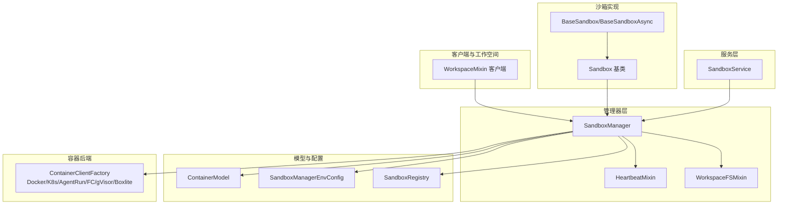
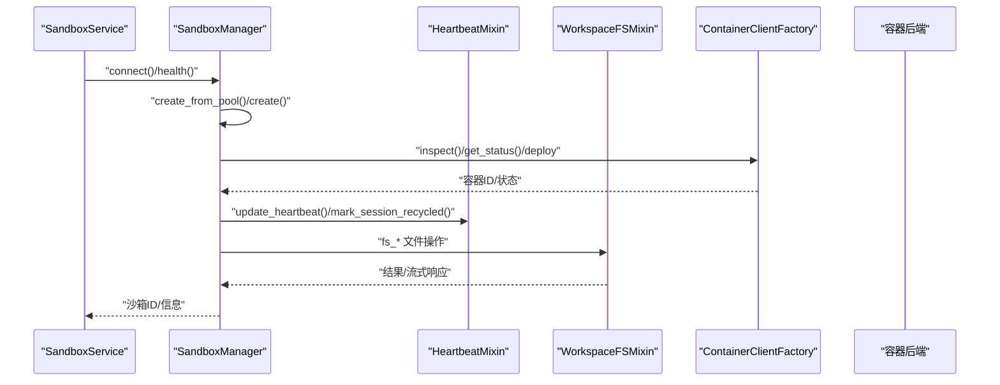
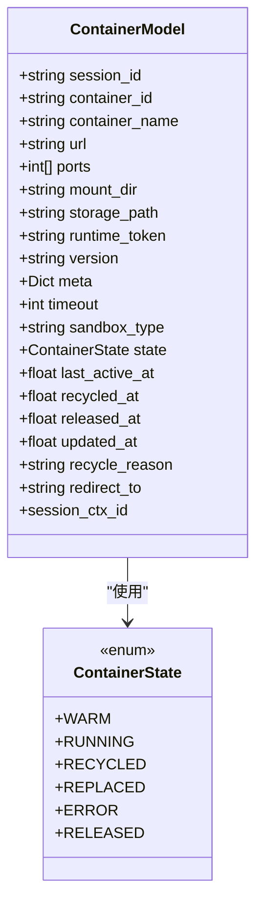
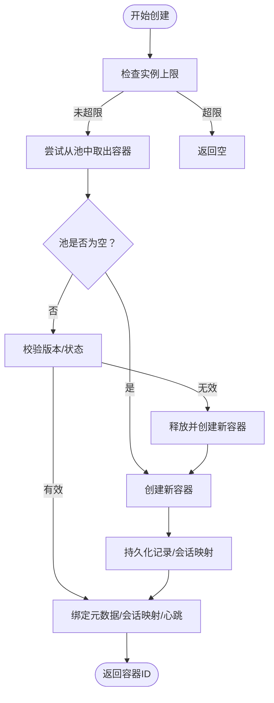
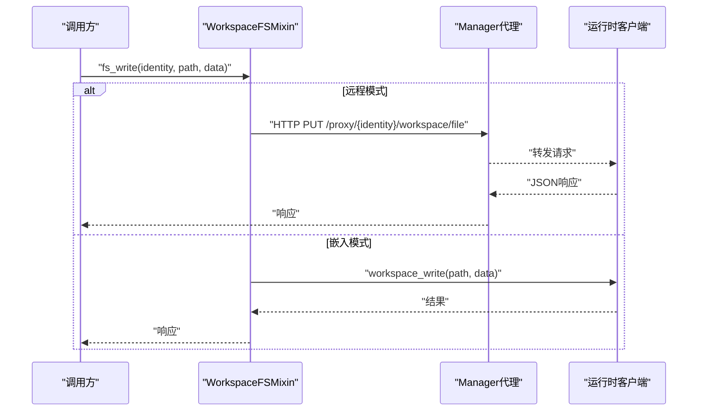
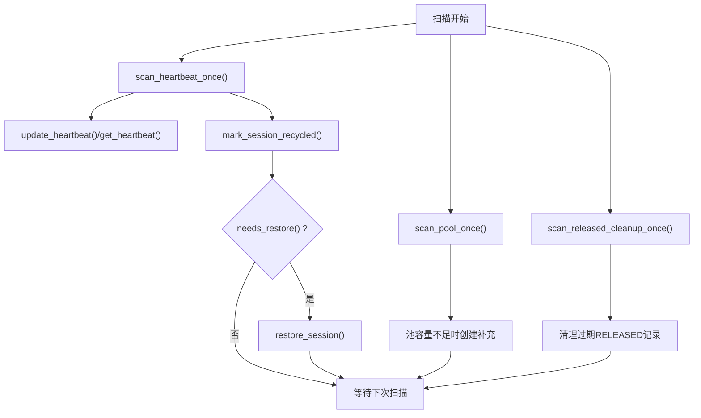
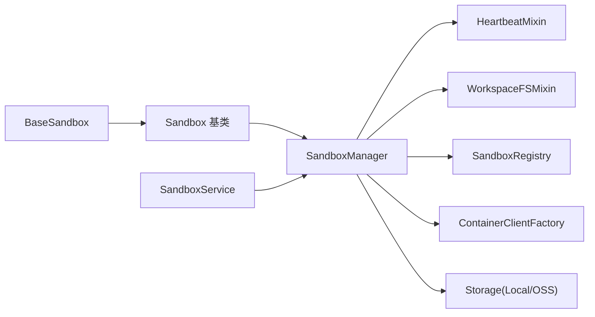

# 沙箱容器管理

<cite>
**本文引用的文件**
- [sandbox/__init__.py](file://src/agentscope_runtime/sandbox/__init__.py)
- [model/container.py](file://src/agentscope_runtime/sandbox/model/container.py)
- [manager/sandbox_manager.py](file://src/agentscope_runtime/sandbox/manager/sandbox_manager.py)
- [manager/heartbeat_mixin.py](file://src/agentscope_runtime/sandbox/manager/heartbeat_mixin.py)
- [manager/workspace_mixin.py](file://src/agentscope_runtime/sandbox/manager/workspace_mixin.py)
- [model/manager_config.py](file://src/agentscope_runtime/sandbox/model/manager_config.py)
- [enums.py](file://src/agentscope_runtime/sandbox/enums.py)
- [box/base/base_sandbox.py](file://src/agentscope_runtime/sandbox/box/base/base_sandbox.py)
- [box/sandbox.py](file://src/agentscope_runtime/sandbox/box/sandbox.py)
- [client/workspace_mixin.py](file://src/agentscope_runtime/sandbox/client/workspace_mixin.py)
- [engine/services/sandbox/sandbox_service.py](file://src/agentscope_runtime/engine/services/sandbox/sandbox_service.py)
- [README.md](file://README.md)
- [examples/sandbox/custom_sandbox/README.md](file://examples/sandbox/custom_sandbox/README.md)
- [registry.py](file://src/agentscope_runtime/sandbox/registry.py)
</cite>

## 目录
1. [简介](#简介)
2. [项目结构](#项目结构)
3. [核心组件](#核心组件)
4. [架构总览](#架构总览)
5. [详细组件分析](#详细组件分析)
6. [依赖分析](#依赖分析)
7. [性能考虑](#性能考虑)
8. [故障排查指南](#故障排查指南)
9. [结论](#结论)
10. [附录](#附录)

## 简介
本文件面向“沙箱容器管理”的全面技术文档，覆盖容器模型设计与实现、状态管理、资源分配与生命周期控制、工作空间混合器（文件系统挂载与环境隔离）、心跳机制与健康检查策略、容器配置与资源限制、监控与日志、以及故障恢复机制。文档同时提供可操作的最佳实践与示例路径，帮助开发者在本地或远端模式下安全、稳定地运行工具执行沙箱。

## 项目结构
沙箱子系统由“服务层（SandboxService）—管理器（SandboxManager）—容器模型（ContainerModel）—沙箱类型注册表（SandboxRegistry）—具体沙箱实现（BaseSandbox 等）—工作空间混合器（WorkspaceFSMixin）—心跳混合器（HeartbeatMixin）”构成，支持嵌入式与远程两种运行模式，并通过统一的容器客户端工厂对接多种后端（Docker、K8s、AgentRun、FC、gVisor、Boxlite 等）。

图示来源
- [engine/services/sandbox/sandbox_service.py:11-200](file://src/agentscope_runtime/engine/services/sandbox/sandbox_service.py#L11-L200)
- [manager/sandbox_manager.py:140-270](file://src/agentscope_runtime/sandbox/manager/sandbox_manager.py#L140-L270)
- [model/container.py:19-158](file://src/agentscope_runtime/sandbox/model/container.py#L19-L158)
- [model/manager_config.py:11-376](file://src/agentscope_runtime/sandbox/model/manager_config.py#L11-L376)
- [registry.py:33-131](file://src/agentscope_runtime/sandbox/registry.py#L33-L131)
- [box/base/base_sandbox.py:11-102](file://src/agentscope_runtime/sandbox/box/base/base_sandbox.py#L11-L102)
- [box/sandbox.py:18-200](file://src/agentscope_runtime/sandbox/box/sandbox.py#L18-L200)
- [client/workspace_mixin.py:78-290](file://src/agentscope_runtime/sandbox/client/workspace_mixin.py#L78-L290)

章节来源
- [README.md:86-106](file://README.md#L86-L106)
- [engine/services/sandbox/sandbox_service.py:11-200](file://src/agentscope_runtime/engine/services/sandbox/sandbox_service.py#L11-L200)

## 核心组件
- 容器模型（ContainerModel）：定义容器标识、URL、端口、工作空间挂载点、运行时令牌、镜像版本、元数据、超时、沙箱类型、状态、心跳时间戳、回收/释放时间戳、重定向目标等字段，并提供兼容性与默认值校验。
- 管理器（SandboxManager）：负责容器池化、实例创建/销毁、会话映射、心跳扫描、回收标记、资源清理、远程/本地模式切换、存储抽象（本地/OSS）、容器客户端工厂对接。
- 心跳混合器（HeartbeatMixin）：提供会话级心跳更新、回收标记、锁机制（Redis 分布式锁）、容器记录持久化。
- 工作空间混合器（WorkspaceFSMixin）：提供同步/异步文件系统操作（读写、批量上传、列表、存在性、删除、移动、创建目录、从本地路径上传），支持嵌入式直连与远程代理转发。
- 沙箱类型与注册表（SandboxType、SandboxRegistry）：统一管理沙箱类型枚举、镜像名称、资源限制、超时、环境变量、运行时配置。
- 具体沙箱实现（BaseSandbox/BaseSandboxAsync）：以装饰器注册镜像与类型，提供工具调用入口（如运行 IPython 单元格、执行 Shell 命令）。
- 服务（SandboxService）：封装生命周期管理、连接/断开、按会话上下文创建或复用沙箱环境。

章节来源
- [model/container.py:19-158](file://src/agentscope_runtime/sandbox/model/container.py#L19-L158)
- [manager/sandbox_manager.py:140-270](file://src/agentscope_runtime/sandbox/manager/sandbox_manager.py#L140-L270)
- [manager/heartbeat_mixin.py:91-489](file://src/agentscope_runtime/sandbox/manager/heartbeat_mixin.py#L91-L489)
- [manager/workspace_mixin.py:113-702](file://src/agentscope_runtime/sandbox/manager/workspace_mixin.py#L113-L702)
- [enums.py:61-80](file://src/agentscope_runtime/sandbox/enums.py#L61-L80)
- [registry.py:33-131](file://src/agentscope_runtime/sandbox/registry.py#L33-L131)
- [box/base/base_sandbox.py:11-102](file://src/agentscope_runtime/sandbox/box/base/base_sandbox.py#L11-L102)
- [engine/services/sandbox/sandbox_service.py:11-200](file://src/agentscope_runtime/engine/services/sandbox/sandbox_service.py#L11-L200)

## 架构总览
下图展示从服务到管理器、再到容器后端的整体交互流程，以及工作空间与心跳的关键路径。

图示来源
- [engine/services/sandbox/sandbox_service.py:82-200](file://src/agentscope_runtime/engine/services/sandbox/sandbox_service.py#L82-L200)
- [manager/sandbox_manager.py:592-750](file://src/agentscope_runtime/sandbox/manager/sandbox_manager.py#L592-L750)
- [manager/heartbeat_mixin.py:180-305](file://src/agentscope_runtime/sandbox/manager/heartbeat_mixin.py#L180-L305)
- [manager/workspace_mixin.py:137-373](file://src/agentscope_runtime/sandbox/manager/workspace_mixin.py#L137-L373)

## 详细组件分析

### 容器模型与状态管理
- 字段设计：包含会话ID、容器ID/名称、访问URL、占用端口、工作空间挂载目录、存储路径、运行时令牌、镜像版本、元数据、超时、沙箱类型、容器状态、最后活跃时间、回收/释放时间、更新时间、回收原因、重定向目标等。
- 状态枚举：warm、running、recycled、replaced、error、released，用于生命周期跟踪与回收策略。
- 兼容性与默认值：自动从 meta 中回填 session_ctx_id，确保向后兼容；统一更新时间戳；支持 session_ctx_id 写回 meta。

图示来源
- [model/container.py:10-158](file://src/agentscope_runtime/sandbox/model/container.py#L10-L158)

章节来源
- [model/container.py:10-158](file://src/agentscope_runtime/sandbox/model/container.py#L10-L158)

### 生命周期控制与容器池化
- 实例上限控制：根据活跃状态（warm/running）统计当前实例数，超过配置上限则拒绝创建。
- 池化策略：优先从池队列中出队可用容器；若版本不匹配或状态非 running，则释放并重新创建。
- 创建流程：合并环境变量、生成 session_ctx_id、选择镜像、创建挂载目录、调用容器客户端部署、持久化记录、绑定会话映射、更新心跳。
- 清理策略：扫描池、扫描映射、释放终端态容器、回收标记清理、定时 GC。

图示来源
- [manager/sandbox_manager.py:706-750](file://src/agentscope_runtime/sandbox/manager/sandbox_manager.py#L706-L750)
- [manager/sandbox_manager.py:592-700](file://src/agentscope_runtime/sandbox/manager/sandbox_manager.py#L592-L700)

章节来源
- [manager/sandbox_manager.py:706-750](file://src/agentscope_runtime/sandbox/manager/sandbox_manager.py#L706-L750)
- [manager/sandbox_manager.py:592-700](file://src/agentscope_runtime/sandbox/manager/sandbox_manager.py#L592-L700)

### 工作空间混合器：文件系统挂载与环境隔离
- 同步/异步 API：读取文件（文本/字节/流）、写入文件（支持流式上传）、批量上传、列出目录、存在性检查、删除条目、移动/重命名、创建目录、从本地路径上传。
- 远程代理：在远程模式下，通过 /proxy/{identity}/{path:path} 将请求转发至运行时，保持流式传输能力。
- 嵌入式直连：在嵌入模式下直接调用运行时客户端的工作空间方法。
- 隔离策略：每个沙箱拥有独立工作空间目录，挂载策略由管理器配置决定；远程模式禁止传入自定义挂载目录，避免服务器路径暴露。

图示来源
- [manager/workspace_mixin.py:137-373](file://src/agentscope_runtime/sandbox/manager/workspace_mixin.py#L137-L373)
- [client/workspace_mixin.py:136-290](file://src/agentscope_runtime/sandbox/client/workspace_mixin.py#L136-L290)

章节来源
- [manager/workspace_mixin.py:113-702](file://src/agentscope_runtime/sandbox/manager/workspace_mixin.py#L113-L702)
- [client/workspace_mixin.py:78-519](file://src/agentscope_runtime/sandbox/client/workspace_mixin.py#L78-L519)

### 心跳机制与健康检查
- 心跳更新：对会话下的 RUNNING 容器更新 last_active_at 与 updated_at。
- 回收标记：当会话长时间无心跳，将容器标记为 recycled 并记录原因；支持清除回收标记。
- 恢复判断：若任一容器处于 recycled 状态且非 replaced，则需要恢复。
- 分布式锁：Redis 模式下使用 SET key token NX EX ttl 获取锁，Lua 脚本保障原子释放；内存模式返回固定令牌。
- 扫描线程：后台线程按间隔扫描心跳、补池、清理已释放记录。

图示来源
- [manager/heartbeat_mixin.py:180-371](file://src/agentscope_runtime/sandbox/manager/heartbeat_mixin.py#L180-L371)
- [manager/sandbox_manager.py:444-508](file://src/agentscope_runtime/sandbox/manager/sandbox_manager.py#L444-L508)

章节来源
- [manager/heartbeat_mixin.py:91-489](file://src/agentscope_runtime/sandbox/manager/heartbeat_mixin.py#L91-L489)
- [manager/sandbox_manager.py:444-508](file://src/agentscope_runtime/sandbox/manager/sandbox_manager.py#L444-L508)

### 容器配置与资源限制
- 管理器配置（SandboxManagerEnvConfig）：文件系统类型（本地/OSS）、默认挂载目录、只读挂载映射、端口范围、池大小、Redis 开关与键前缀、K8s 命名空间与 kubeconfig、AgentRun/FC 的资源与网络参数、心跳超时、锁 TTL、扫描间隔、释放记录 TTL、最大实例数等。
- 注册表（SandboxRegistry）：为沙箱类型绑定镜像名称、资源限制（内存/CPU）、超时、环境变量、运行时配置（如内存限制、CPU 纳核）。
- 具体沙箱（BaseSandbox/BaseSandboxAsync）：通过装饰器注册镜像与类型，提供工具调用接口。

章节来源
- [model/manager_config.py:11-376](file://src/agentscope_runtime/sandbox/model/manager_config.py#L11-L376)
- [registry.py:9-31](file://src/agentscope_runtime/sandbox/registry.py#L9-L31)
- [box/base/base_sandbox.py:11-102](file://src/agentscope_runtime/sandbox/box/base/base_sandbox.py#L11-L102)

### 服务集成与最佳实践
- SandboxService：封装生命周期（start/stop）、健康检查、按会话连接/创建沙箱、停止时可选释放所有会话资源。
- 嵌入/远程模式：嵌入模式下允许挂载本地目录；远程模式通过代理访问运行时，禁止挂载服务器路径。
- 信号处理与清理：嵌入模式下注册 SIGINT/SIGTERM 处理器，退出时自动清理资源。

章节来源
- [engine/services/sandbox/sandbox_service.py:11-200](file://src/agentscope_runtime/engine/services/sandbox/sandbox_service.py#L11-L200)
- [box/sandbox.py:148-200](file://src/agentscope_runtime/sandbox/box/sandbox.py#L148-L200)

## 依赖分析
- 组件耦合：SandboxManager 对 HeartbeatMixin 与 WorkspaceFSMixin 存在组合依赖；对 ContainerClientFactory 与存储抽象进行解耦；通过 SandboxRegistry 解耦沙箱类型与镜像配置。
- 外部依赖：Redis（分布式锁/键空间）、容器后端（Docker/K8s/AgentRun/FC/gVisor/Boxlite）、OSS（可选）。
- 可能的循环依赖：未发现直接循环导入；各模块职责清晰，通过工厂与注册表进行间接协作。

图示来源
- [manager/sandbox_manager.py:140-270](file://src/agentscope_runtime/sandbox/manager/sandbox_manager.py#L140-L270)
- [box/base/base_sandbox.py:11-102](file://src/agentscope_runtime/sandbox/box/base/base_sandbox.py#L11-L102)
- [box/sandbox.py:18-200](file://src/agentscope_runtime/sandbox/box/sandbox.py#L18-L200)
- [engine/services/sandbox/sandbox_service.py:11-200](file://src/agentscope_runtime/engine/services/sandbox/sandbox_service.py#L11-L200)

章节来源
- [manager/sandbox_manager.py:140-270](file://src/agentscope_runtime/sandbox/manager/sandbox_manager.py#L140-L270)
- [registry.py:33-131](file://src/agentscope_runtime/sandbox/registry.py#L33-L131)

## 性能考虑
- 池化复用：通过池队列减少容器启动延迟，提升并发响应速度；池大小受配置控制。
- 异步 I/O：工作空间混合器提供异步读写与批量上传，降低阻塞风险。
- 流式传输：文件下载/上传支持流式，避免大文件内存峰值。
- 扫描间隔：watcher_scan_interval 控制后台扫描频率，平衡资源消耗与回收及时性。
- 实例上限：max_sandbox_instances 限制活跃实例数量，防止资源耗尽。

## 故障排查指南
- 心跳超时与回收：若容器被标记为 recycled，检查会话是否仍在活跃；必要时调用恢复逻辑；确认 Redis 可用与锁 TTL 设置合理。
- 远程模式问题：确认 base_url 与 bearer_token 正确；检查代理端点 /proxy/{identity}/{path:path} 是否可达；验证运行时工作空间路由。
- 池化异常：检查池队列状态与容器版本一致性；确认容器后端状态为 running；必要时重建容器。
- 存储与挂载：OSS 模式需正确配置凭证与桶；远程模式禁止传入自定义挂载目录。
- 日志与追踪：结合服务端日志与客户端日志定位问题；关注心跳扫描与回收标记输出。

章节来源
- [manager/heartbeat_mixin.py:256-305](file://src/agentscope_runtime/sandbox/manager/heartbeat_mixin.py#L256-L305)
- [manager/workspace_mixin.py:137-373](file://src/agentscope_runtime/sandbox/manager/workspace_mixin.py#L137-L373)
- [model/manager_config.py:251-284](file://src/agentscope_runtime/sandbox/model/manager_config.py#L251-L284)

## 结论
该沙箱容器管理体系通过容器模型、心跳与池化、工作空间混合器与多后端容器客户端工厂，实现了高可用、可扩展、可观察的工具执行环境。结合服务层的生命周期管理与最佳实践，可在本地与云端环境中安全地运行多样化沙箱类型，满足生产级部署与运维需求。

## 附录
- 示例与构建自定义沙箱：参考示例文档，了解如何安装源码、编写自定义沙箱类与 Dockerfile，并通过内置构建工具打包镜像。
- 关键文件索引：
  - [sandbox/__init__.py:1-33](file://src/agentscope_runtime/sandbox/__init__.py#L1-L33)
  - [model/container.py:19-158](file://src/agentscope_runtime/sandbox/model/container.py#L19-L158)
  - [manager/sandbox_manager.py:140-270](file://src/agentscope_runtime/sandbox/manager/sandbox_manager.py#L140-L270)
  - [manager/heartbeat_mixin.py:91-489](file://src/agentscope_runtime/sandbox/manager/heartbeat_mixin.py#L91-L489)
  - [manager/workspace_mixin.py:113-702](file://src/agentscope_runtime/sandbox/manager/workspace_mixin.py#L113-L702)
  - [model/manager_config.py:11-376](file://src/agentscope_runtime/sandbox/model/manager_config.py#L11-L376)
  - [enums.py:61-80](file://src/agentscope_runtime/sandbox/enums.py#L61-L80)
  - [box/base/base_sandbox.py:11-102](file://src/agentscope_runtime/sandbox/box/base/base_sandbox.py#L11-L102)
  - [box/sandbox.py:148-200](file://src/agentscope_runtime/sandbox/box/sandbox.py#L148-L200)
  - [client/workspace_mixin.py:78-519](file://src/agentscope_runtime/sandbox/client/workspace_mixin.py#L78-L519)
  - [engine/services/sandbox/sandbox_service.py:11-200](file://src/agentscope_runtime/engine/services/sandbox/sandbox_service.py#L11-L200)
  - [examples/sandbox/custom_sandbox/README.md:1-184](file://examples/sandbox/custom_sandbox/README.md#L1-L184)
  - [registry.py:33-131](file://src/agentscope_runtime/sandbox/registry.py#L33-L131)