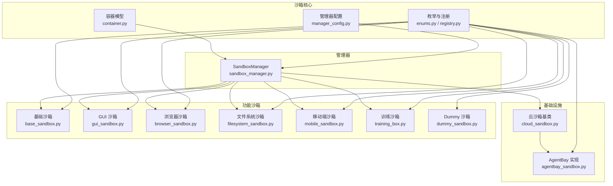
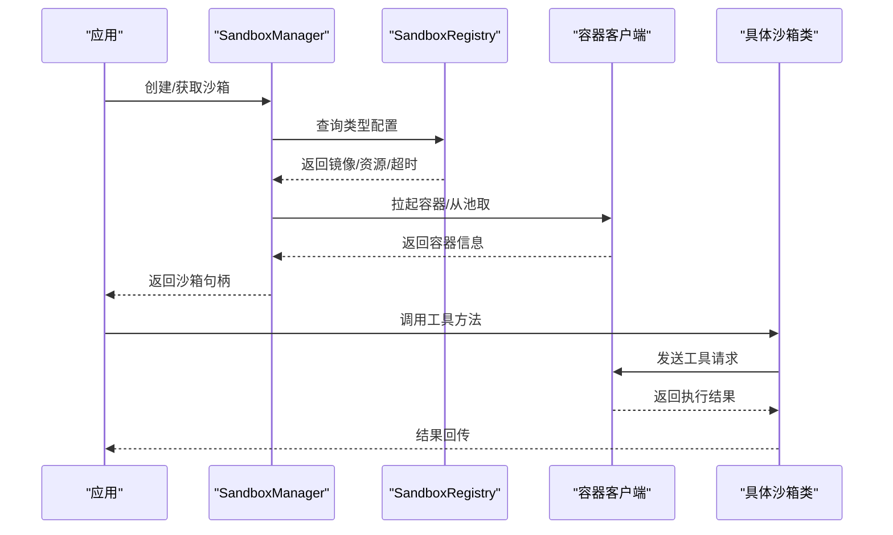
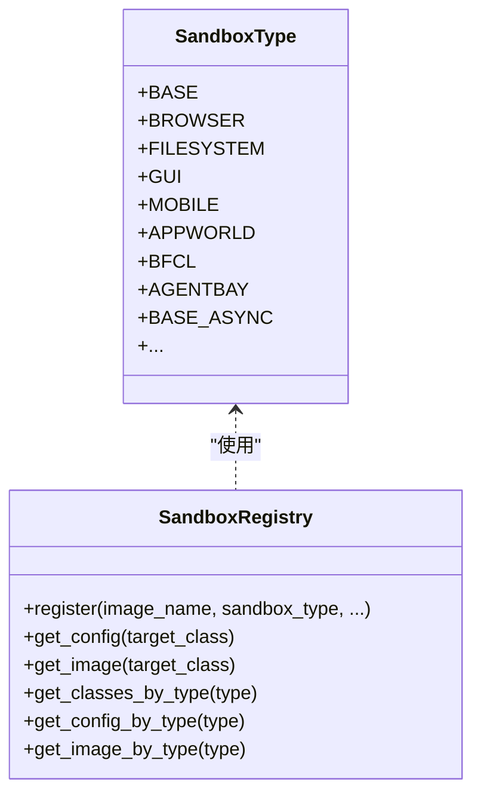
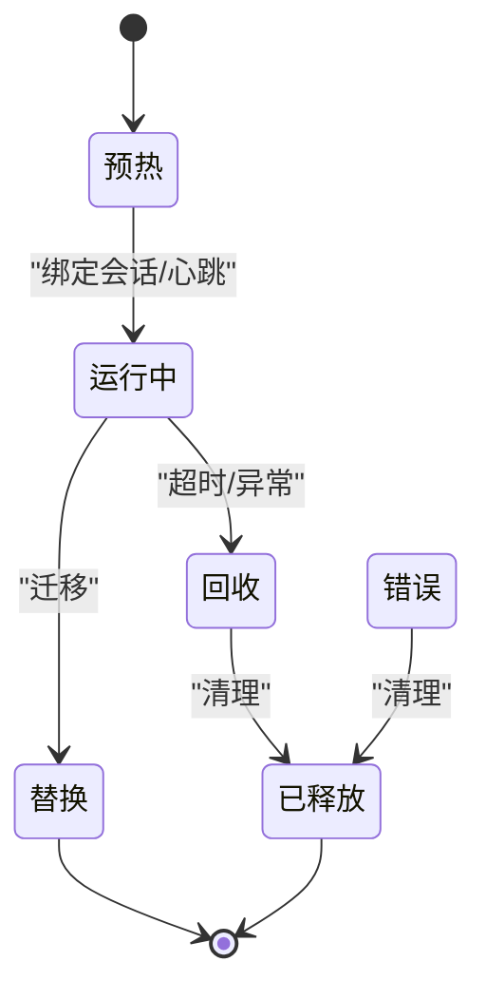
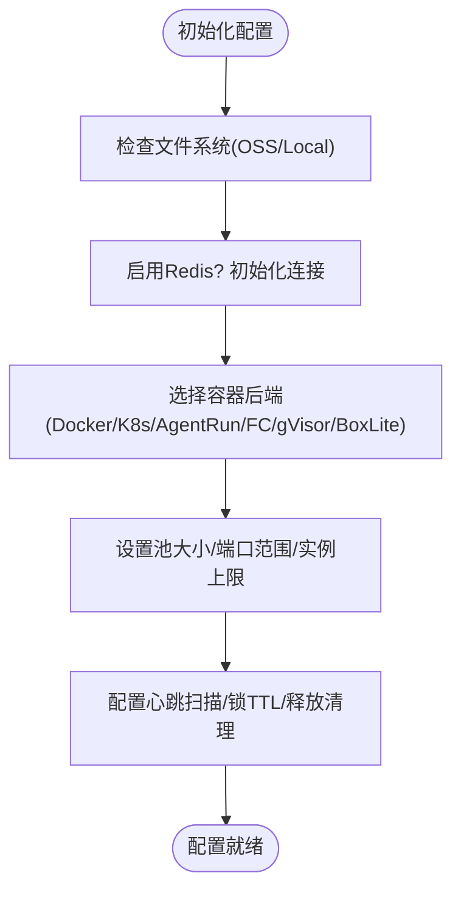
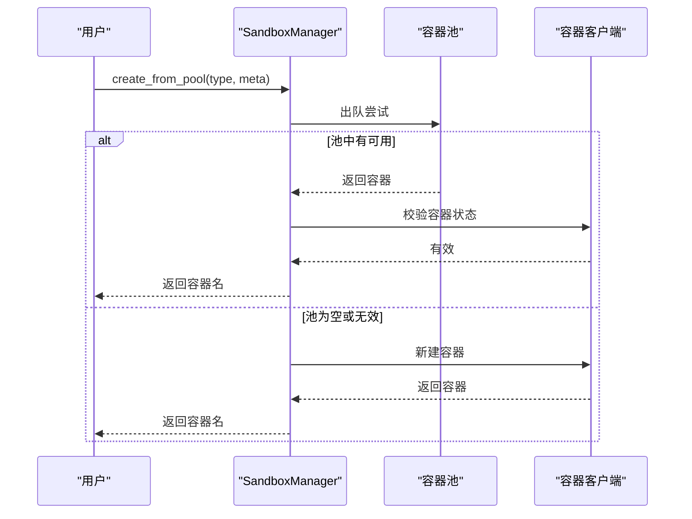
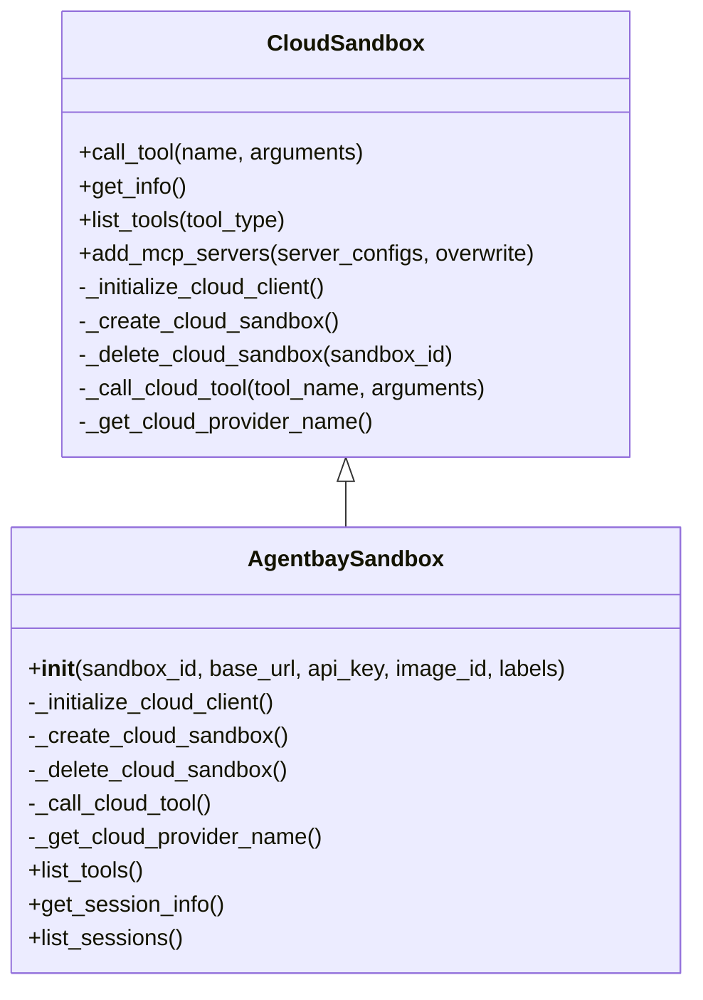
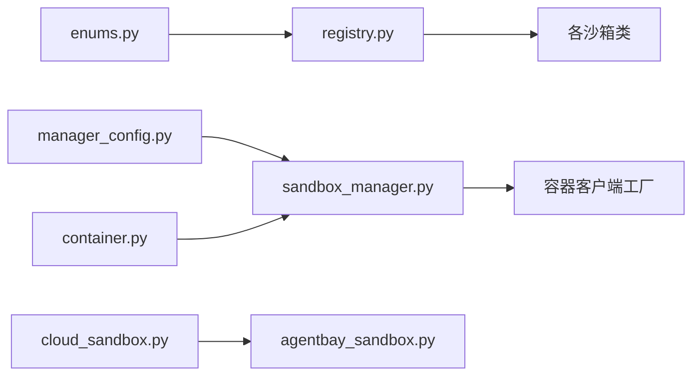

# 沙箱执行原理

<cite>
**本文档引用的文件**
- [src/agentscope_runtime/sandbox/__init__.py](file://src/agentscope_runtime/sandbox/__init__.py)
- [src/agentscope_runtime/sandbox/enums.py](file://src/agentscope_runtime/sandbox/enums.py)
- [src/agentscope_runtime/sandbox/registry.py](file://src/agentscope_runtime/sandbox/registry.py)
- [src/agentscope_runtime/sandbox/model/manager_config.py](file://src/agentscope_runtime/sandbox/model/manager_config.py)
- [src/agentscope_runtime/sandbox/model/container.py](file://src/agentscope_runtime/sandbox/model/container.py)
- [src/agentscope_runtime/sandbox/box/base/base_sandbox.py](file://src/agentscope_runtime/sandbox/box/base/base_sandbox.py)
- [src/agentscope_runtime/sandbox/box/gui/gui_sandbox.py](file://src/agentscope_runtime/sandbox/box/gui/gui_sandbox.py)
- [src/agentscope_runtime/sandbox/box/browser/browser_sandbox.py](file://src/agentscope_runtime/sandbox/box/browser/browser_sandbox.py)
- [src/agentscope_runtime/sandbox/box/filesystem/filesystem_sandbox.py](file://src/agentscope_runtime/sandbox/box/filesystem/filesystem_sandbox.py)
- [src/agentscope_runtime/sandbox/box/mobile/mobile_sandbox.py](file://src/agentscope_runtime/sandbox/box/mobile/mobile_sandbox.py)
- [src/agentscope_runtime/sandbox/box/cloud/cloud_sandbox.py](file://src/agentscope_runtime/sandbox/box/cloud/cloud_sandbox.py)
- [src/agentscope_runtime/sandbox/box/agentbay/agentbay_sandbox.py](file://src/agentscope_runtime/sandbox/box/agentbay/agentbay_sandbox.py)
- [src/agentscope_runtime/sandbox/box/dummy/dummy_sandbox.py](file://src/agentscope_runtime/sandbox/box/dummy/dummy_sandbox.py)
- [src/agentscope_runtime/sandbox/box/training_box/training_box.py](file://src/agentscope_runtime/sandbox/box/training_box/training_box.py)
- [src/agentscope_runtime/sandbox/manager/sandbox_manager.py](file://src/agentscope_runtime/sandbox/manager/sandbox_manager.py)
</cite>

## 目录
1. [引言](#引言)
2. [项目结构](#项目结构)
3. [核心组件](#核心组件)
4. [架构总览](#架构总览)
5. [详细组件分析](#详细组件分析)
6. [依赖关系分析](#依赖关系分析)
7. [性能考虑](#性能考虑)
8. [故障排除指南](#故障排除指南)
9. [结论](#结论)
10. [附录](#附录)

## 引言
本文件系统性阐述沙箱执行原理与实现，覆盖设计目标、安全隔离机制、执行模型、各类沙箱特性与适用场景、沙箱管理器的生命周期与资源管理、注册表与类型枚举、配置示例与安全最佳实践、性能优化与故障排除等。读者可据此从基础概念逐步深入到高级实现细节。

## 项目结构
沙箱子系统采用“按功能域分层 + 按类型聚合”的组织方式：
- 枚举与注册：定义沙箱类型与动态注册表，统一管理镜像、资源配置与类型映射
- 模型：容器状态、运行时环境配置等数据模型
- 基础设施：云沙箱基类与具体云服务实现
- 功能沙箱：基础、GUI、浏览器、文件系统、移动端、训练沙箱等
- 管理器：容器生命周期、资源池、心跳与清理、远程/本地模式

**图表来源**
- [src/agentscope_runtime/sandbox/enums.py:61-80](file://src/agentscope_runtime/sandbox/enums.py#L61-L80)
- [src/agentscope_runtime/sandbox/registry.py:33-131](file://src/agentscope_runtime/sandbox/registry.py#L33-L131)
- [src/agentscope_runtime/sandbox/model/manager_config.py:11-376](file://src/agentscope_runtime/sandbox/model/manager_config.py#L11-L376)
- [src/agentscope_runtime/sandbox/model/container.py:19-158](file://src/agentscope_runtime/sandbox/model/container.py#L19-L158)
- [src/agentscope_runtime/sandbox/box/cloud/cloud_sandbox.py:19-251](file://src/agentscope_runtime/sandbox/box/cloud/cloud_sandbox.py#L19-L251)
- [src/agentscope_runtime/sandbox/box/agentbay/agentbay_sandbox.py:20-558](file://src/agentscope_runtime/sandbox/box/agentbay/agentbay_sandbox.py#L20-L558)
- [src/agentscope_runtime/sandbox/box/base/base_sandbox.py:11-102](file://src/agentscope_runtime/sandbox/box/base/base_sandbox.py#L11-L102)
- [src/agentscope_runtime/sandbox/box/gui/gui_sandbox.py:65-240](file://src/agentscope_runtime/sandbox/box/gui/gui_sandbox.py#L65-L240)
- [src/agentscope_runtime/sandbox/box/browser/browser_sandbox.py:31-498](file://src/agentscope_runtime/sandbox/box/browser/browser_sandbox.py#L31-L498)
- [src/agentscope_runtime/sandbox/box/filesystem/filesystem_sandbox.py:13-254](file://src/agentscope_runtime/sandbox/box/filesystem/filesystem_sandbox.py#L13-L254)
- [src/agentscope_runtime/sandbox/box/mobile/mobile_sandbox.py:80-342](file://src/agentscope_runtime/sandbox/box/mobile/mobile_sandbox.py#L80-L342)
- [src/agentscope_runtime/sandbox/box/training_box/training_box.py:18-295](file://src/agentscope_runtime/sandbox/box/training_box/training_box.py#L18-L295)
- [src/agentscope_runtime/sandbox/box/dummy/dummy_sandbox.py:10-33](file://src/agentscope_runtime/sandbox/box/dummy/dummy_sandbox.py#L10-L33)
- [src/agentscope_runtime/sandbox/manager/sandbox_manager.py:140-800](file://src/agentscope_runtime/sandbox/manager/sandbox_manager.py#L140-L800)

**章节来源**
- [src/agentscope_runtime/sandbox/__init__.py:1-33](file://src/agentscope_runtime/sandbox/__init__.py#L1-L33)

## 核心组件
- 沙箱类型枚举与动态扩展：支持内置类型与运行时新增类型，便于扩展新沙箱类型
- 注册表：集中管理镜像名、资源限制、超时、描述、环境变量与运行时配置，并建立类型到类的映射
- 容器模型：抽象容器生命周期状态、会话上下文、端口占用、存储路径、心跳时间戳等
- 管理器配置：统一容器部署后端（Docker/K8s/AgentRun/FC/gVisor/BoxLite）、文件系统（本地/OSS）、Redis、端口范围、池大小、心跳与回收策略等
- 管理器：负责容器池化、实例上限控制、健康扫描、心跳维护、释放清理、远程/本地模式切换

**章节来源**
- [src/agentscope_runtime/sandbox/enums.py:61-80](file://src/agentscope_runtime/sandbox/enums.py#L61-L80)
- [src/agentscope_runtime/sandbox/registry.py:33-131](file://src/agentscope_runtime/sandbox/registry.py#L33-L131)
- [src/agentscope_runtime/sandbox/model/container.py:19-158](file://src/agentscope_runtime/sandbox/model/container.py#L19-L158)
- [src/agentscope_runtime/sandbox/model/manager_config.py:11-376](file://src/agentscope_runtime/sandbox/model/manager_config.py#L11-L376)
- [src/agentscope_runtime/sandbox/manager/sandbox_manager.py:140-800](file://src/agentscope_runtime/sandbox/manager/sandbox_manager.py#L140-L800)

## 架构总览
沙箱系统通过“注册表 + 类装饰器”在导入阶段完成类型注册；管理器根据配置选择容器后端，结合池化与心跳机制进行生命周期管理；各类沙箱通过统一的工具调用接口与容器交互，实现不同能力域的隔离与执行。

**图表来源**
- [src/agentscope_runtime/sandbox/registry.py:33-131](file://src/agentscope_runtime/sandbox/registry.py#L33-L131)
- [src/agentscope_runtime/sandbox/manager/sandbox_manager.py:592-704](file://src/agentscope_runtime/sandbox/manager/sandbox_manager.py#L592-L704)
- [src/agentscope_runtime/sandbox/box/base/base_sandbox.py:11-102](file://src/agentscope_runtime/sandbox/box/base/base_sandbox.py#L11-L102)

## 详细组件分析

### 沙箱类型与注册表
- 类型枚举：内置类型覆盖基础、GUI、浏览器、文件系统、移动端、训练环境（APPWorld/BFCL）、AgentBay 等；支持异步变体
- 动态扩展：允许运行时新增自定义类型，保证向后兼容
- 注册表：装饰器式注册，记录镜像名、资源限制、超时、安全等级、环境变量与运行时参数，并建立类型到类的映射

**图表来源**
- [src/agentscope_runtime/sandbox/enums.py:61-80](file://src/agentscope_runtime/sandbox/enums.py#L61-L80)
- [src/agentscope_runtime/sandbox/registry.py:33-131](file://src/agentscope_runtime/sandbox/registry.py#L33-L131)

**章节来源**
- [src/agentscope_runtime/sandbox/enums.py:61-80](file://src/agentscope_runtime/sandbox/enums.py#L61-L80)
- [src/agentscope_runtime/sandbox/registry.py:33-131](file://src/agentscope_runtime/sandbox/registry.py#L33-L131)

### 容器模型与状态机
- 容器状态：预热、运行中、回收、替换、错误、已释放
- 关键字段：会话ID、容器ID/名称、访问URL、占用端口、工作区挂载/存储路径、运行时令牌、镜像版本、元数据、超时、沙箱类型、心跳与回收时间戳、重定向目标等
- 兼容性：自动补齐/回写 session_ctx_id，统一更新时间戳

**图表来源**
- [src/agentscope_runtime/sandbox/model/container.py:10-17](file://src/agentscope_runtime/sandbox/model/container.py#L10-L17)
- [src/agentscope_runtime/sandbox/model/container.py:82-123](file://src/agentscope_runtime/sandbox/model/container.py#L82-L123)

**章节来源**
- [src/agentscope_runtime/sandbox/model/container.py:19-158](file://src/agentscope_runtime/sandbox/model/container.py#L19-L158)

### 管理器配置与部署后端
- 支持后端：Docker、云原生（AgentRun/FC）、Kubernetes、gVisor、BoxLite
- 文件系统：本地或 OSS，支持只读挂载映射
- Redis：端口占用、容器池、分布式锁、心跳扫描、释放记录清理
- 资源与安全：端口范围、池大小、最大实例数、心跳超时与锁TTL、扫描间隔、释放记录TTL
- K8s/云服务：命名空间、kubeconfig、AgentRun/FC 的账号/区域/VPC/交换机/安全部署参数

**图表来源**
- [src/agentscope_runtime/sandbox/model/manager_config.py:11-376](file://src/agentscope_runtime/sandbox/model/manager_config.py#L11-L376)

**章节来源**
- [src/agentscope_runtime/sandbox/model/manager_config.py:11-376](file://src/agentscope_runtime/sandbox/model/manager_config.py#L11-L376)

### 管理器生命周期与资源管理
- 远程/本地模式：支持通过 HTTP 与远端管理器交互，或本地直接拉起容器
- 池化策略：多类型容器池队列，优先从池取，失败则新建；版本与状态校验不通过则丢弃并重建
- 实例上限：统计活跃容器数量，超过阈值拒绝创建
- 清理与回收：扫描心跳、补充池、清理释放记录；销毁非终端容器
- 心跳与监控：后台线程周期扫描，记录指标；支持异步上下文管理

**图表来源**
- [src/agentscope_runtime/sandbox/manager/sandbox_manager.py:592-704](file://src/agentscope_runtime/sandbox/manager/sandbox_manager.py#L592-L704)
- [src/agentscope_runtime/sandbox/manager/sandbox_manager.py:706-800](file://src/agentscope_runtime/sandbox/manager/sandbox_manager.py#L706-L800)

**章节来源**
- [src/agentscope_runtime/sandbox/manager/sandbox_manager.py:140-800](file://src/agentscope_runtime/sandbox/manager/sandbox_manager.py#L140-L800)

### 不同类型沙箱与适用场景
- 基础沙箱（Base/BaseAsync）
  - 能力：执行 IPython 单元格、运行 Shell 命令
  - 场景：通用脚本执行、轻量命令行任务
- GUI 沙箱（GUI/GUI Async）
  - 能力：桌面 VNC/Relay 访问、鼠标键盘操作、截图
  - 场景：需要图形界面的人机交互、自动化桌面操作
- 浏览器沙箱（Browser/Browser Async）
  - 能力：导航、点击、输入、拖拽、截图、PDF 导出、网络请求、对话框处理、标签页管理
  - 场景：网页自动化、前端测试、信息采集
- 文件系统沙箱（Filesystem/Filesystem Async）
  - 能力：读写文件、批量读取、编辑（diff 预览）、目录树、移动/搜索/元信息查询
  - 场景：文件编排、批量处理、代码编辑与审阅
- 移动沙箱（Mobile/Mobile Async）
  - 能力：ADB 动作封装（点击、滑动、输入、按键、截图、分辨率）
  - 场景：移动端自动化、真机/模拟器测试
- 训练沙箱（TrainingSandbox/APPWorld/BFCL）
  - 能力：创建/获取任务ID/环境画像、单步执行、评估、实例释放
  - 场景：强化学习/仿真训练、大规模评测
- AgentBay 云沙箱（AgentBay）
  - 能力：通过云 SDK 直接调用命令、文件系统、浏览器、截图等工具
  - 场景：无需本地容器的云端执行环境
- Dummy 沙箱
  - 能力：占位实现，便于测试与演示
  - 场景：开发调试、最小可用验证

**章节来源**
- [src/agentscope_runtime/sandbox/box/base/base_sandbox.py:11-102](file://src/agentscope_runtime/sandbox/box/base/base_sandbox.py#L11-L102)
- [src/agentscope_runtime/sandbox/box/gui/gui_sandbox.py:65-240](file://src/agentscope_runtime/sandbox/box/gui/gui_sandbox.py#L65-L240)
- [src/agentscope_runtime/sandbox/box/browser/browser_sandbox.py:31-498](file://src/agentscope_runtime/sandbox/box/browser/browser_sandbox.py#L31-L498)
- [src/agentscope_runtime/sandbox/box/filesystem/filesystem_sandbox.py:13-254](file://src/agentscope_runtime/sandbox/box/filesystem/filesystem_sandbox.py#L13-L254)
- [src/agentscope_runtime/sandbox/box/mobile/mobile_sandbox.py:80-342](file://src/agentscope_runtime/sandbox/box/mobile/mobile_sandbox.py#L80-L342)
- [src/agentscope_runtime/sandbox/box/training_box/training_box.py:18-295](file://src/agentscope_runtime/sandbox/box/training_box/training_box.py#L18-L295)
- [src/agentscope_runtime/sandbox/box/agentbay/agentbay_sandbox.py:20-558](file://src/agentscope_runtime/sandbox/box/agentbay/agentbay_sandbox.py#L20-L558)
- [src/agentscope_runtime/sandbox/box/dummy/dummy_sandbox.py:10-33](file://src/agentscope_runtime/sandbox/box/dummy/dummy_sandbox.py#L10-L33)

### 云沙箱与 AgentBay 集成
- 云沙箱基类：统一云 API 通信、会话生命周期、工具调用路由
- AgentBay 实现：基于 SDK 创建/删除会话，映射常用工具（命令、代码、文件系统、浏览器、截图），支持列出工具、获取会话信息、列举会话

**图表来源**
- [src/agentscope_runtime/sandbox/box/cloud/cloud_sandbox.py:19-251](file://src/agentscope_runtime/sandbox/box/cloud/cloud_sandbox.py#L19-L251)
- [src/agentscope_runtime/sandbox/box/agentbay/agentbay_sandbox.py:27-558](file://src/agentscope_runtime/sandbox/box/agentbay/agentbay_sandbox.py#L27-L558)

**章节来源**
- [src/agentscope_runtime/sandbox/box/cloud/cloud_sandbox.py:19-251](file://src/agentscope_runtime/sandbox/box/cloud/cloud_sandbox.py#L19-L251)
- [src/agentscope_runtime/sandbox/box/agentbay/agentbay_sandbox.py:20-558](file://src/agentscope_runtime/sandbox/box/agentbay/agentbay_sandbox.py#L20-L558)

## 依赖关系分析
- 组件内聚：各沙箱类通过装饰器注册到注册表，避免显式导入分散
- 外部依赖：容器后端（Docker/K8s/AgentRun/FC/gVisor/BoxLite）、Redis、OSS、AgentBay SDK
- 循环依赖：通过延迟导入与运行时解析避免循环

**图表来源**
- [src/agentscope_runtime/sandbox/enums.py:61-80](file://src/agentscope_runtime/sandbox/enums.py#L61-L80)
- [src/agentscope_runtime/sandbox/registry.py:33-131](file://src/agentscope_runtime/sandbox/registry.py#L33-L131)
- [src/agentscope_runtime/sandbox/model/manager_config.py:11-376](file://src/agentscope_runtime/sandbox/model/manager_config.py#L11-L376)
- [src/agentscope_runtime/sandbox/model/container.py:19-158](file://src/agentscope_runtime/sandbox/model/container.py#L19-L158)
- [src/agentscope_runtime/sandbox/manager/sandbox_manager.py:246-251](file://src/agentscope_runtime/sandbox/manager/sandbox_manager.py#L246-L251)
- [src/agentscope_runtime/sandbox/box/cloud/cloud_sandbox.py:19-251](file://src/agentscope_runtime/sandbox/box/cloud/cloud_sandbox.py#L19-L251)
- [src/agentscope_runtime/sandbox/box/agentbay/agentbay_sandbox.py:88-113](file://src/agentscope_runtime/sandbox/box/agentbay/agentbay_sandbox.py#L88-L113)

**章节来源**
- [src/agentscope_runtime/sandbox/manager/sandbox_manager.py:246-251](file://src/agentscope_runtime/sandbox/manager/sandbox_manager.py#L246-L251)

## 性能考虑
- 池化复用：通过池队列减少冷启动开销，提升并发响应
- 资源配额：CPU/内存/共享内存限制（如训练沙箱）需合理设置，避免资源争用
- 端口与网络：固定端口范围与负载均衡，避免冲突与抖动
- 存储：本地与 OSS 双栈，按需选择；OSS 适合跨节点共享
- 心跳与扫描：扫描间隔与锁TTL平衡及时回收与系统压力
- 异步化：异步沙箱与异步管理器配合，降低阻塞等待

[本节为通用指导，无需特定文件引用]

## 故障排除指南
- 容器不可用/状态异常
  - 检查池中容器版本与运行状态，不满足则丢弃重建
  - 查看容器映射与会话映射一致性
- 实例上限触发
  - 当前活跃容器计数达到上限，拒绝创建；清理非终端容器或提升上限
- Redis 连接问题
  - 校验地址/端口/认证/键前缀；确认可用性后再启用
- 云沙箱初始化失败
  - AgentBay SDK 缺失或 API Key 未配置；检查依赖安装与环境变量
- 端口冲突
  - 调整端口范围或释放占用端口；核对 Redis 占用映射
- 心跳扫描未生效
  - watcher_scan_interval 设为 0 则禁用；调整为合适值并确认线程运行

**章节来源**
- [src/agentscope_runtime/sandbox/manager/sandbox_manager.py:444-507](file://src/agentscope_runtime/sandbox/manager/sandbox_manager.py#L444-L507)
- [src/agentscope_runtime/sandbox/manager/sandbox_manager.py:714-750](file://src/agentscope_runtime/sandbox/manager/sandbox_manager.py#L714-L750)
- [src/agentscope_runtime/sandbox/box/agentbay/agentbay_sandbox.py:67-73](file://src/agentscope_runtime/sandbox/box/agentbay/agentbay_sandbox.py#L67-L73)

## 结论
该沙箱系统以注册表驱动、管理器统一调度为核心，结合多后端容器与云服务，形成可扩展、可运维、可观测的执行平台。通过类型枚举与动态注册、容器模型与状态机、池化与心跳机制、以及丰富的功能沙箱，满足从基础脚本到复杂训练/云原生执行的多样化需求。

[本节为总结性内容，无需特定文件引用]

## 附录

### 沙箱类型枚举与含义
- DUMMY：占位类型
- BASE/BASE_ASYNC：基础命令行与脚本执行
- BROWSER/BROWSER_ASYNC：浏览器自动化
- FILESYSTEM/FILESYSTEM_ASYNC：文件系统操作
- GUI/GUI_ASYNC：图形界面交互
- MOBILE/MOBILE_ASYNC：移动端 ADB 控制
- APPWORLD/BFCL：训练环境（APPWorld/BFCL）
- AGENTBAY：AgentBay 云沙箱

**章节来源**
- [src/agentscope_runtime/sandbox/enums.py:61-80](file://src/agentscope_runtime/sandbox/enums.py#L61-L80)

### 配置示例与最佳实践
- 基础配置
  - 选择容器后端（Docker/K8s/AgentRun/FC/gVisor/BoxLite）
  - 设置默认挂载目录与只读挂载映射
  - 启用 Redis 时配置服务器、端口、数据库、密钥与键前缀
- 资源与安全
  - 为训练沙箱设置共享内存（如 APPWorld/BFCL）
  - 限制最大实例数，防止资源耗尽
  - 合理设置心跳超时与扫描间隔
- 云沙箱
  - AgentBay：配置 API Key，选择镜像类型与标签，按需列出工具与会话

**章节来源**
- [src/agentscope_runtime/sandbox/model/manager_config.py:11-376](file://src/agentscope_runtime/sandbox/model/manager_config.py#L11-L376)
- [src/agentscope_runtime/sandbox/box/training_box/training_box.py:206-295](file://src/agentscope_runtime/sandbox/box/training_box/training_box.py#L206-L295)
- [src/agentscope_runtime/sandbox/box/agentbay/agentbay_sandbox.py:43-86](file://src/agentscope_runtime/sandbox/box/agentbay/agentbay_sandbox.py#L43-L86)