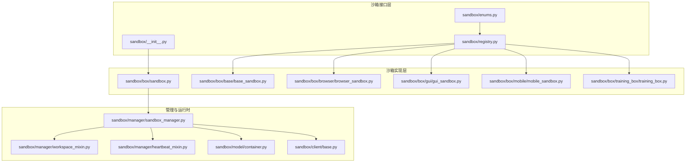
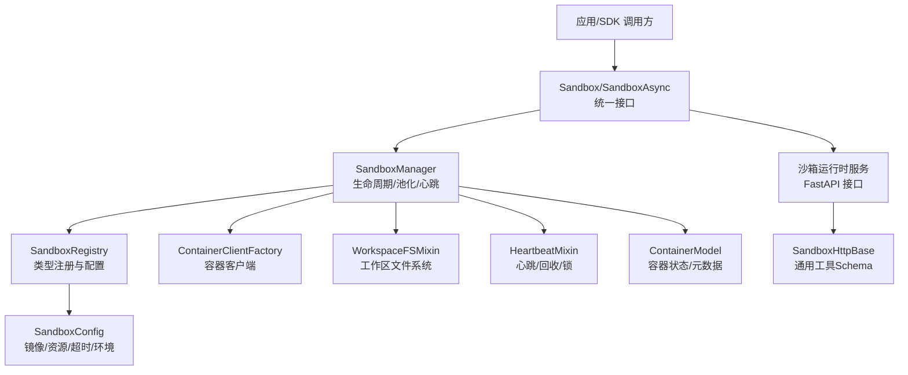
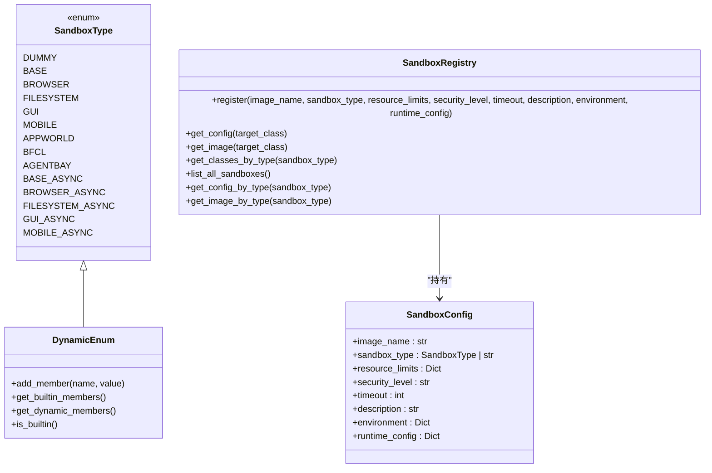
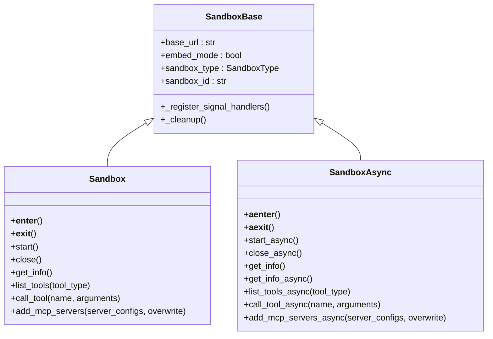
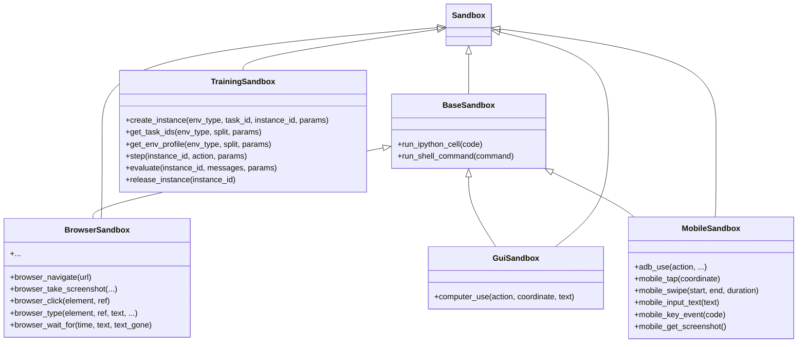
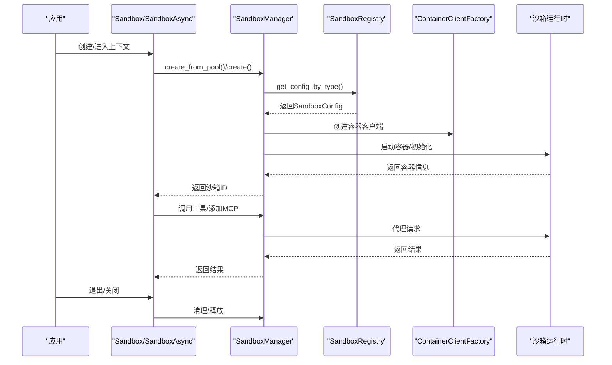
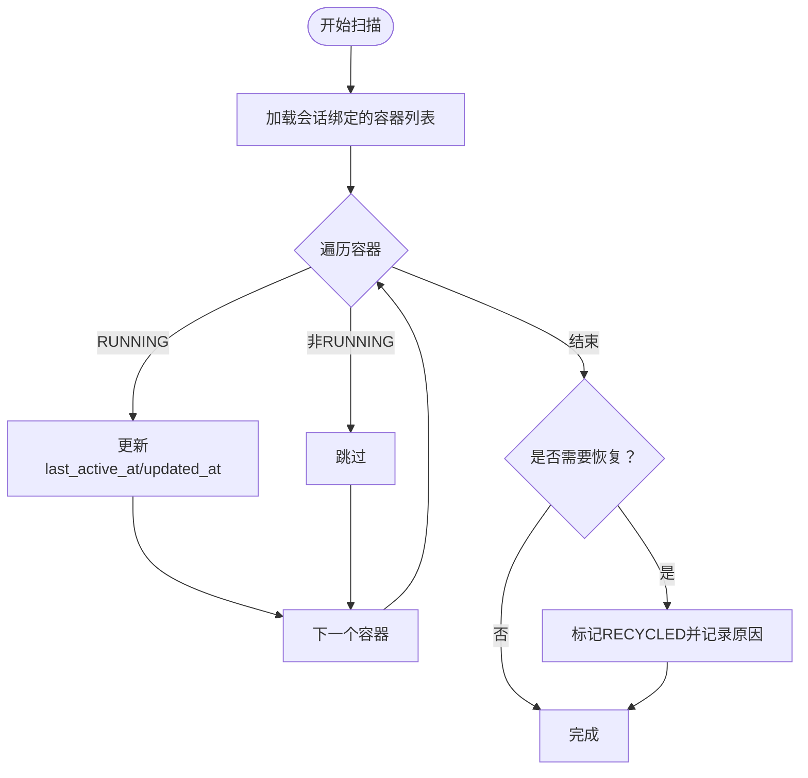
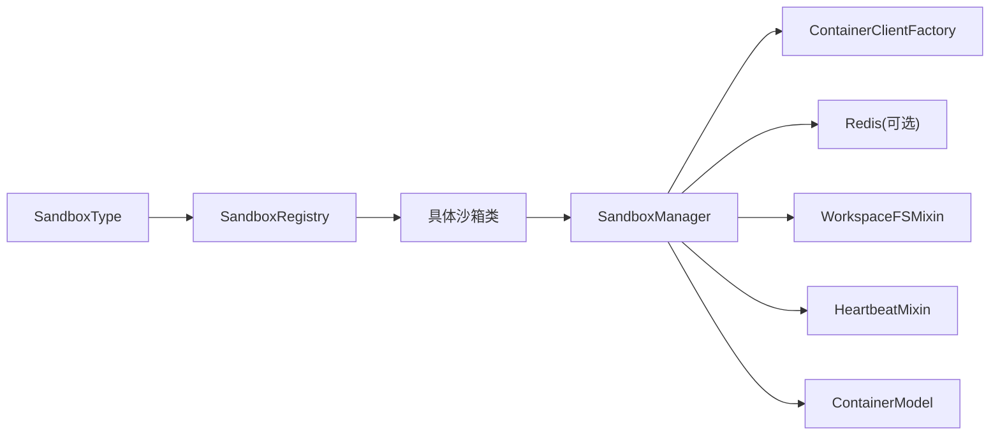

# 沙箱架构设计

<cite>
**本文档引用的文件**
- [sandbox/__init__.py](file://src/agentscope_runtime/sandbox/__init__.py)
- [sandbox/enums.py](file://src/agentscope_runtime/sandbox/enums.py)
- [sandbox/registry.py](file://src/agentscope_runtime/sandbox/registry.py)
- [sandbox/manager/sandbox_manager.py](file://src/agentscope_runtime/sandbox/manager/sandbox_manager.py)
- [sandbox/box/base/base_sandbox.py](file://src/agentscope_runtime/sandbox/box/base/base_sandbox.py)
- [sandbox/box/browser/browser_sandbox.py](file://src/agentscope_runtime/sandbox/box/browser/browser_sandbox.py)
- [sandbox/box/gui/gui_sandbox.py](file://src/agentscope_runtime/sandbox/box/gui/gui_sandbox.py)
- [sandbox/box/mobile/mobile_sandbox.py](file://src/agentscope_runtime/sandbox/box/mobile/mobile_sandbox.py)
- [sandbox/box/training_box/training_box.py](file://src/agentscope_runtime/sandbox/box/training_box/training_box.py)
- [sandbox/box/sandbox.py](file://src/agentscope_runtime/sandbox/box/sandbox.py)
- [sandbox/model/container.py](file://src/agentscope_runtime/sandbox/model/container.py)
- [sandbox/client/base.py](file://src/agentscope_runtime/sandbox/client/base.py)
- [sandbox/manager/workspace_mixin.py](file://src/agentscope_runtime/sandbox/manager/workspace_mixin.py)
- [sandbox/manager/heartbeat_mixin.py](file://src/agentscope_runtime/sandbox/manager/heartbeat_mixin.py)
</cite>

## 目录
1. [简介](#简介)
2. [项目结构](#项目结构)
3. [核心组件](#核心组件)
4. [架构总览](#架构总览)
5. [详细组件分析](#详细组件分析)
6. [依赖关系分析](#依赖关系分析)
7. [性能考虑](#性能考虑)
8. [故障排除指南](#故障排除指南)
9. [结论](#结论)

## 简介
本文件系统性阐述 agentscope-runtime 中的沙箱架构设计，重点覆盖以下方面：
- 整体架构设计原则：模块化、插件化扩展与安全隔离
- 沙箱注册表工作机制与沙箱类型枚举定义
- 沙箱管理器的核心职责与生命周期管理机制
- 架构图与组件关系图，展示模块间交互
- 设计决策的技术考量与性能优化策略
- 同时兼顾高层架构视角与具体实现细节，便于不同技术背景读者理解

## 项目结构
沙箱子系统采用“分层+按功能域划分”的组织方式：
- sandbox：对外暴露的沙箱接口与类型体系
- sandbox/box：各类沙箱的具体实现（基础、浏览器、GUI、移动端、训练等）
- sandbox/manager：沙箱管理器与运行时生命周期管理
- sandbox/model：容器模型与状态定义
- sandbox/client：HTTP 客户端与工具描述
- sandbox/manager/*：工作区文件系统混入、心跳与回收等基础设施

图表来源
- [sandbox/__init__.py:1-33](file://src/agentscope_runtime/sandbox/__init__.py#L1-L33)
- [sandbox/enums.py:61-80](file://src/agentscope_runtime/sandbox/enums.py#L61-L80)
- [sandbox/registry.py:33-131](file://src/agentscope_runtime/sandbox/registry.py#L33-L131)
- [sandbox/box/sandbox.py:18-313](file://src/agentscope_runtime/sandbox/box/sandbox.py#L18-L313)
- [sandbox/manager/sandbox_manager.py:140-800](file://src/agentscope_runtime/sandbox/manager/sandbox_manager.py#L140-L800)

章节来源
- [sandbox/__init__.py:1-33](file://src/agentscope_runtime/sandbox/__init__.py#L1-L33)
- [sandbox/enums.py:61-80](file://src/agentscope_runtime/sandbox/enums.py#L61-L80)
- [sandbox/registry.py:33-131](file://src/agentscope_runtime/sandbox/registry.py#L33-L131)

## 核心组件
- 沙箱类型枚举与动态扩展：通过自定义枚举类支持内置与动态添加的沙箱类型，便于扩展新类型而无需修改核心代码。
- 注册表：集中管理沙箱类与其配置（镜像、资源限制、超时、环境变量等），并提供按类型查询能力。
- 基础沙箱接口：统一同步/异步沙箱的生命周期与工具调用入口，支持上下文管理与信号处理。
- 具体沙箱实现：覆盖基础执行、浏览器操作、GUI 人机交互、移动端 ADB 控制、训练环境等场景。
- 管理器：负责沙箱实例的创建、池化复用、心跳维护、回收与清理、远程/本地模式切换。
- 工作区文件系统：提供跨模式（本地/远程）一致的文件读写、批量上传、目录遍历等能力。
- 心跳与回收：基于会话维度的心跳更新、回收标记与恢复逻辑，保障资源健康与可用性。

章节来源
- [sandbox/enums.py:5-80](file://src/agentscope_runtime/sandbox/enums.py#L5-L80)
- [sandbox/registry.py:33-131](file://src/agentscope_runtime/sandbox/registry.py#L33-L131)
- [sandbox/box/sandbox.py:18-313](file://src/agentscope_runtime/sandbox/box/sandbox.py#L18-L313)
- [sandbox/manager/sandbox_manager.py:140-800](file://src/agentscope_runtime/sandbox/manager/sandbox_manager.py#L140-L800)
- [sandbox/manager/workspace_mixin.py:113-702](file://src/agentscope_runtime/sandbox/manager/workspace_mixin.py#L113-L702)
- [sandbox/manager/heartbeat_mixin.py:91-489](file://src/agentscope_runtime/sandbox/manager/heartbeat_mixin.py#L91-L489)

## 架构总览
下图展示了从应用侧到沙箱运行时的整体交互路径，以及注册表、管理器与具体沙箱实现之间的关系。

图表来源
- [sandbox/box/sandbox.py:18-313](file://src/agentscope_runtime/sandbox/box/sandbox.py#L18-L313)
- [sandbox/manager/sandbox_manager.py:140-800](file://src/agentscope_runtime/sandbox/manager/sandbox_manager.py#L140-L800)
- [sandbox/registry.py:33-131](file://src/agentscope_runtime/sandbox/registry.py#L33-L131)
- [sandbox/model/container.py:19-158](file://src/agentscope_runtime/sandbox/model/container.py#L19-L158)
- [sandbox/client/base.py:10-74](file://src/agentscope_runtime/sandbox/client/base.py#L10-L74)

## 详细组件分析

### 沙箱类型与注册表
- 动态枚举：支持在运行时动态添加新的沙箱类型，同时保留内置类型标识，便于扩展与兼容。
- 注册装饰器：通过装饰器将沙箱类与其镜像、资源限制、超时、环境变量等配置绑定，形成“类-配置”映射。
- 查询接口：支持按类或类型查询配置、镜像名，以及列出所有已注册的沙箱。

图表来源
- [sandbox/enums.py:5-80](file://src/agentscope_runtime/sandbox/enums.py#L5-L80)
- [sandbox/registry.py:33-131](file://src/agentscope_runtime/sandbox/registry.py#L33-L131)

章节来源
- [sandbox/enums.py:5-80](file://src/agentscope_runtime/sandbox/enums.py#L5-L80)
- [sandbox/registry.py:33-131](file://src/agentscope_runtime/sandbox/registry.py#L33-L131)

### 基础沙箱接口与生命周期
- 统一基类：SandboxBase 提供嵌入式/远程两种模式的抽象，支持上下文管理、信号处理与资源清理。
- 同步/异步沙箱：Sandbox 与 SandboxAsync 分别封装进入池化创建、工具调用、MCP 服务器添加等流程。
- 生命周期：支持显式 start/close 或上下文管理；在嵌入模式下注册退出钩子与信号处理器。

图表来源
- [sandbox/box/sandbox.py:18-313](file://src/agentscope_runtime/sandbox/box/sandbox.py#L18-L313)

章节来源
- [sandbox/box/sandbox.py:18-313](file://src/agentscope_runtime/sandbox/box/sandbox.py#L18-L313)

### 具体沙箱实现
- 基础沙箱：提供 IPython 执行与 Shell 命令执行等通用能力。
- 浏览器沙箱：封装页面导航、截图、键盘输入、网络请求等浏览器操作。
- GUI 沙箱：提供桌面人机交互能力，并输出 VNC 访问链接。
- 移动端沙箱：通过 ADB 实现点击、滑动、输入文本、按键等操作。
- 训练沙箱：面向训练任务的环境创建、步骤推进、评估与释放。

图表来源
- [sandbox/box/base/base_sandbox.py:18-102](file://src/agentscope_runtime/sandbox/box/base/base_sandbox.py#L18-L102)
- [sandbox/box/browser/browser_sandbox.py:38-498](file://src/agentscope_runtime/sandbox/box/browser/browser_sandbox.py#L38-L498)
- [sandbox/box/gui/gui_sandbox.py:72-240](file://src/agentscope_runtime/sandbox/box/gui/gui_sandbox.py#L72-L240)
- [sandbox/box/mobile/mobile_sandbox.py:88-342](file://src/agentscope_runtime/sandbox/box/mobile/mobile_sandbox.py#L88-L342)
- [sandbox/box/training_box/training_box.py:18-295](file://src/agentscope_runtime/sandbox/box/training_box/training_box.py#L18-L295)

章节来源
- [sandbox/box/base/base_sandbox.py:18-102](file://src/agentscope_runtime/sandbox/box/base/base_sandbox.py#L18-L102)
- [sandbox/box/browser/browser_sandbox.py:38-498](file://src/agentscope_runtime/sandbox/box/browser/browser_sandbox.py#L38-L498)
- [sandbox/box/gui/gui_sandbox.py:72-240](file://src/agentscope_runtime/sandbox/box/gui/gui_sandbox.py#L72-L240)
- [sandbox/box/mobile/mobile_sandbox.py:88-342](file://src/agentscope_runtime/sandbox/box/mobile/mobile_sandbox.py#L88-L342)
- [sandbox/box/training_box/training_box.py:18-295](file://src/agentscope_runtime/sandbox/box/training_box/training_box.py#L18-L295)

### 沙箱管理器与生命周期
- 远程/本地双模：支持通过 HTTP 代理远程模式或直接连接本地运行时。
- 池化复用：多类型沙箱池队列，优先从池中取出可用容器，否则新建。
- 心跳与回收：周期扫描心跳、回收标记与释放清理，保障资源健康。
- 文件系统代理：在远程模式下通过 /proxy/{identity}/workspace 转发，支持流式上传下载。
- 容器模型：统一存储容器元信息、状态、会话上下文与时间戳。

图表来源
- [sandbox/manager/sandbox_manager.py:591-800](file://src/agentscope_runtime/sandbox/manager/sandbox_manager.py#L591-L800)
- [sandbox/registry.py:115-131](file://src/agentscope_runtime/sandbox/registry.py#L115-L131)
- [sandbox/box/sandbox.py:148-313](file://src/agentscope_runtime/sandbox/box/sandbox.py#L148-L313)

章节来源
- [sandbox/manager/sandbox_manager.py:140-800](file://src/agentscope_runtime/sandbox/manager/sandbox_manager.py#L140-L800)
- [sandbox/model/container.py:19-158](file://src/agentscope_runtime/sandbox/model/container.py#L19-L158)
- [sandbox/manager/workspace_mixin.py:113-702](file://src/agentscope_runtime/sandbox/manager/workspace_mixin.py#L113-L702)
- [sandbox/manager/heartbeat_mixin.py:91-489](file://src/agentscope_runtime/sandbox/manager/heartbeat_mixin.py#L91-L489)

### 心跳与回收流程

图表来源
- [sandbox/manager/heartbeat_mixin.py:180-371](file://src/agentscope_runtime/sandbox/manager/heartbeat_mixin.py#L180-L371)

章节来源
- [sandbox/manager/heartbeat_mixin.py:91-489](file://src/agentscope_runtime/sandbox/manager/heartbeat_mixin.py#L91-L489)

## 依赖关系分析
- 模块内聚与解耦
  - 注册表与枚举：低耦合，仅通过字符串/枚举值关联类型与类。
  - 管理器：通过容器客户端工厂与映射存储解耦具体部署后端。
  - 工作区文件系统：通过代理基类在远程模式下屏蔽差异。
- 外部依赖
  - Redis：用于分布式心跳锁、会话映射与容器映射。
  - 容器运行时：Docker/Kubernetes 等，由客户端工厂抽象。
  - HTTP 客户端：requests/httpx，分别用于同步/异步远程调用。

图表来源
- [sandbox/enums.py:61-80](file://src/agentscope_runtime/sandbox/enums.py#L61-L80)
- [sandbox/registry.py:33-131](file://src/agentscope_runtime/sandbox/registry.py#L33-L131)
- [sandbox/manager/sandbox_manager.py:246-251](file://src/agentscope_runtime/sandbox/manager/sandbox_manager.py#L246-L251)
- [sandbox/manager/workspace_mixin.py:77-111](file://src/agentscope_runtime/sandbox/manager/workspace_mixin.py#L77-L111)
- [sandbox/manager/heartbeat_mixin.py:420-489](file://src/agentscope_runtime/sandbox/manager/heartbeat_mixin.py#L420-L489)
- [sandbox/model/container.py:19-158](file://src/agentscope_runtime/sandbox/model/container.py#L19-L158)

章节来源
- [sandbox/manager/sandbox_manager.py:140-800](file://src/agentscope_runtime/sandbox/manager/sandbox_manager.py#L140-L800)
- [sandbox/manager/workspace_mixin.py:113-702](file://src/agentscope_runtime/sandbox/manager/workspace_mixin.py#L113-L702)
- [sandbox/manager/heartbeat_mixin.py:91-489](file://src/agentscope_runtime/sandbox/manager/heartbeat_mixin.py#L91-L489)

## 性能考虑
- 池化复用：优先从池中获取容器，减少启动开销；版本与状态校验失败时自动回退新建。
- 心跳与回收：定期扫描避免僵尸容器占用资源；回收标记仅更新元数据，不阻塞业务。
- 远程代理：文件系统批量上传/流式下载，降低内存占用；远程模式下统一通过 /proxy 转发。
- 异步化：异步 HTTP 客户端与异步文件系统接口，提升高并发场景吞吐。
- 资源限制：通过 SandboxConfig 的 runtime_config 将 CPU/内存限制传递给容器运行时。

## 故障排除指南
- 远程模式请求错误：管理器在 HTTP 错误时收集状态码与服务端响应详情，便于定位。
- 心跳异常：检查 Redis 可用性与锁 TTL 设置；确认会话映射与容器映射一致性。
- 文件系统访问：远程模式需确保 /proxy 路径可达；注意格式参数与流式传输 chunk 大小。
- 容器状态异常：核对 ContainerState 与回收标记；必要时手动清理或重建。

章节来源
- [sandbox/manager/sandbox_manager.py:344-442](file://src/agentscope_runtime/sandbox/manager/sandbox_manager.py#L344-L442)
- [sandbox/manager/heartbeat_mixin.py:420-489](file://src/agentscope_runtime/sandbox/manager/heartbeat_mixin.py#L420-L489)
- [sandbox/manager/workspace_mixin.py:113-702](file://src/agentscope_runtime/sandbox/manager/workspace_mixin.py#L113-L702)

## 结论
该沙箱架构以“类型注册 + 动态扩展 + 管理器编排 + 池化复用 + 心跳回收”为核心，实现了模块化、可插拔且具备良好隔离性的运行时系统。通过统一的接口与远程/本地双模支持，既满足开发调试的便捷性，也适配生产环境的规模化部署。未来可在以下方向持续演进：
- 更细粒度的资源配额与调度策略
- 多租户隔离与权限控制
- 自愈与弹性扩缩容机制
- 更丰富的沙箱类型与工具生态