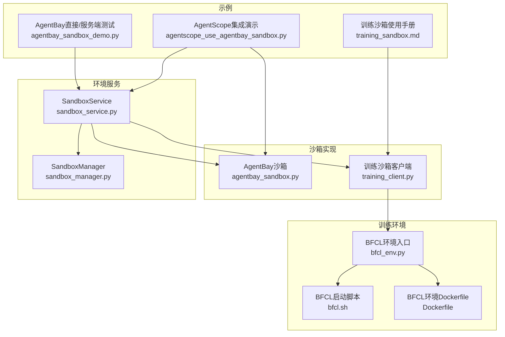
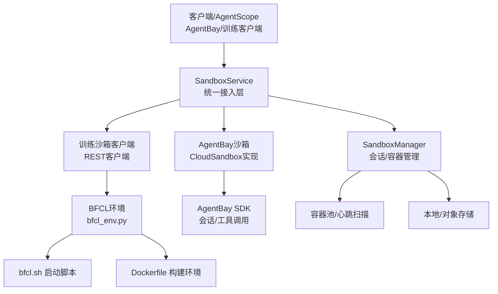
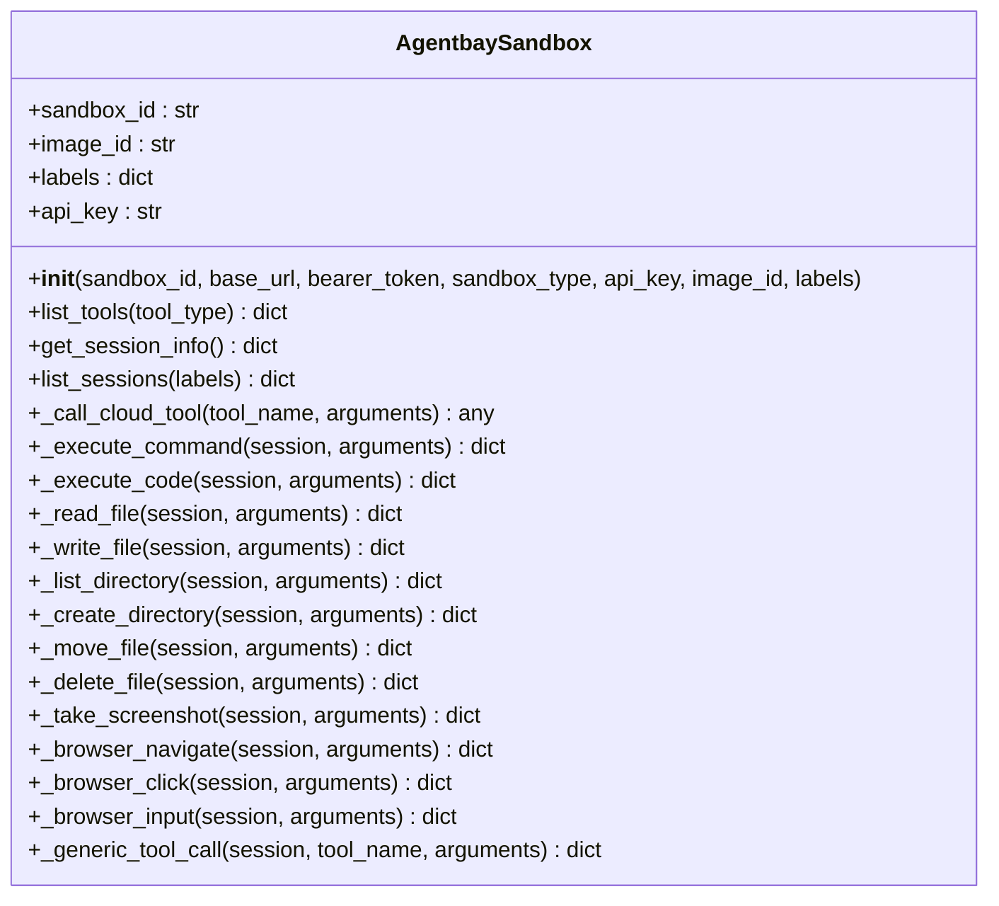
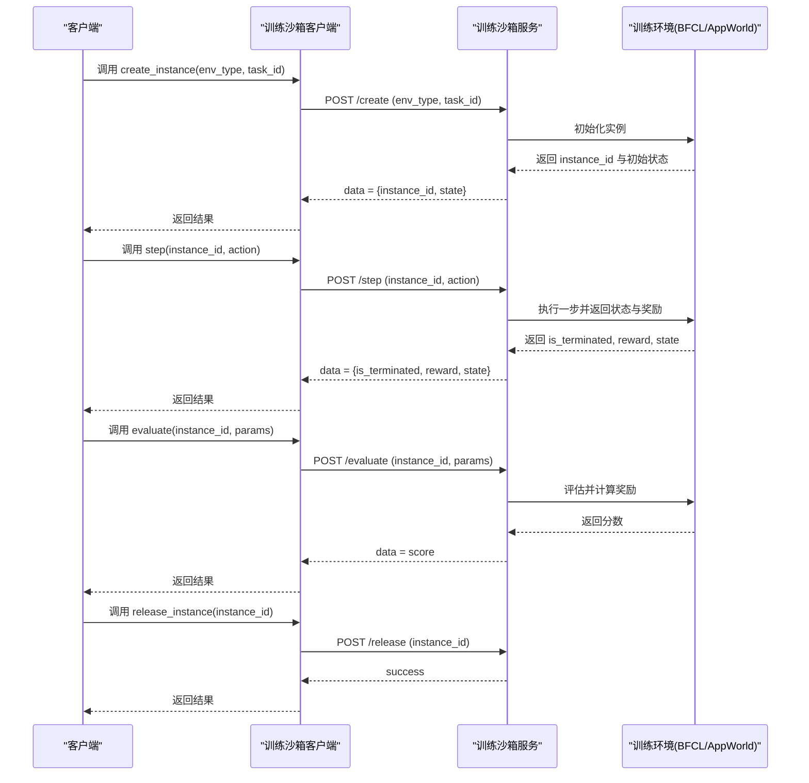
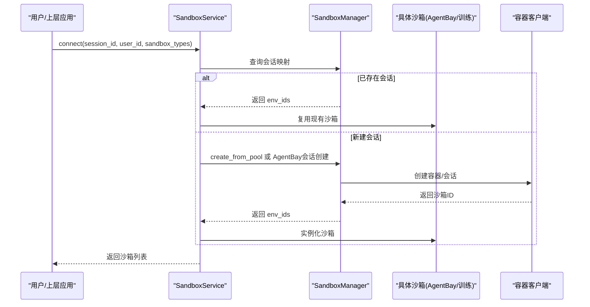
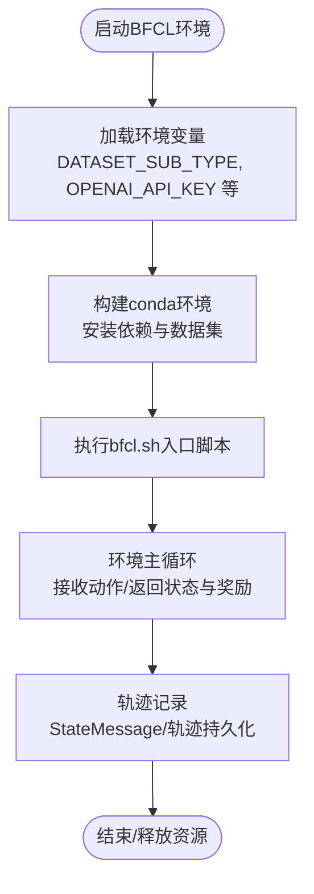
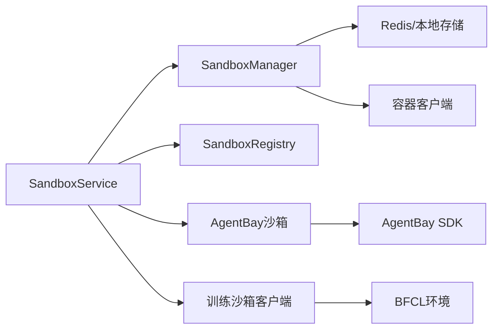

# 训练和AgentBay沙箱

<cite>
**本文档引用的文件**
- [agentbay_sandbox.py](file://src/agentscope_runtime/sandbox/box/agentbay/agentbay_sandbox.py)
- [sandbox_service.py](file://src/agentscope_runtime/engine/services/sandbox/sandbox_service.py)
- [sandbox_manager.py](file://src/agentscope_runtime/sandbox/manager/sandbox_manager.py)
- [training_client.py](file://src/agentscope_runtime/sandbox/client/training_client.py)
- [training_sandbox.md](file://cookbook/en/sandbox/training_sandbox.md)
- [agentbay_sandbox_demo.py](file://examples/sandbox/agentbay_sandbox/agentbay_sandbox_demo.py)
- [agentscope_use_agentbay_sandbox.py](file://examples/sandbox/agentbay_sandbox/agentscope_use_agentbay_sandbox.py)
- [bfcl_env.py](file://src/agentscope_runtime/sandbox/box/training_box/environments/bfcl/bfcl_env.py)
- [bfcl.sh](file://src/agentscope_runtime/sandbox/box/training_box/bfcl.sh)
- [Dockerfile](file://src/agentscope_runtime/sandbox/box/training_box/environments/bfcl/Dockerfile)
</cite>

## 目录
1. [简介](#简介)
2. [项目结构](#项目结构)
3. [核心组件](#核心组件)
4. [架构总览](#架构总览)
5. [详细组件分析](#详细组件分析)
6. [依赖关系分析](#依赖关系分析)
7. [性能考虑](#性能考虑)
8. [故障排查指南](#故障排查指南)
9. [结论](#结论)
10. [附录](#附录)

## 简介
本文件面向训练与AgentBay沙箱的使用与集成，系统性阐述以下能力：
- 训练沙箱：强化学习环境支持与轨迹记录（trajectory）能力，覆盖AppWorld与BFCL等训练环境，支持任务实例化、动作步进、奖励评估与资源释放。
- AgentBay沙箱：云原生智能体协作能力与多Agent环境管理，支持Linux/Windows/Browser/CodeSpace/Mobile等多种镜像类型，提供工具执行、文件系统操作、浏览器自动化与截图等能力。
- 环境服务与任务调度：通过SandboxService统一接入与编排，结合SandboxManager实现会话生命周期管理、容器池化与资源回收。
- 实战示例：提供训练场景与智能体协作的实际应用示例，涵盖环境配置、奖励函数设计与性能评估方法。

## 项目结构
围绕训练与AgentBay沙箱的关键目录与文件如下：
- 沙箱实现与客户端
  - AgentBay沙箱：[agentbay_sandbox.py](file://src/agentscope_runtime/sandbox/box/agentbay/agentbay_sandbox.py)
  - 训练沙箱客户端：[training_client.py](file://src/agentscope_runtime/sandbox/client/training_client.py)
- 环境服务与管理
  - 沙箱服务：[sandbox_service.py](file://src/agentscope_runtime/engine/services/sandbox/sandbox_service.py)
  - 沙箱管理器：[sandbox_manager.py](file://src/agentscope_runtime/sandbox/manager/sandbox_manager.py)
- 训练环境与示例
  - BFCL环境入口：[bfcl_env.py](file://src/agentscope_runtime/sandbox/box/training_box/environments/bfcl/bfcl_env.py)
  - BFCL启动脚本：[bfcl.sh](file://src/agentscope_runtime/sandbox/box/training_box/bfcl.sh)
  - BFCL环境Dockerfile：[Dockerfile](file://src/agentscope_runtime/sandbox/box/training_box/environments/bfcl/Dockerfile)
  - 训练沙箱使用手册：[training_sandbox.md](file://cookbook/en/sandbox/training_sandbox.md)
- 示例与演示
  - AgentBay直接与服务端测试：[agentbay_sandbox_demo.py](file://examples/sandbox/agentbay_sandbox/agentbay_sandbox_demo.py)
  - 与AgentScope集成演示：[agentscope_use_agentbay_sandbox.py](file://examples/sandbox/agentbay_sandbox/agentscope_use_agentbay_sandbox.py)

**图表来源**
- [agentbay_sandbox.py:1-558](file://src/agentscope_runtime/sandbox/box/agentbay/agentbay_sandbox.py#L1-558)
- [sandbox_service.py:1-238](file://src/agentscope_runtime/engine/services/sandbox/sandbox_service.py#L1-238)
- [sandbox_manager.py:140-800](file://src/agentscope_runtime/sandbox/manager/sandbox_manager.py#L140-800)
- [training_client.py:1-265](file://src/agentscope_runtime/sandbox/client/training_client.py#L1-265)
- [bfcl_env.py:1-45](file://src/agentscope_runtime/sandbox/box/training_box/environments/bfcl/bfcl_env.py#L1-45)
- [bfcl.sh](file://src/agentscope_runtime/sandbox/box/training_box/bfcl.sh)
- [Dockerfile:38-97](file://src/agentscope_runtime/sandbox/box/training_box/environments/bfcl/Dockerfile#L38-97)
- [agentbay_sandbox_demo.py:1-240](file://examples/sandbox/agentbay_sandbox/agentbay_sandbox_demo.py#L1-240)
- [agentscope_use_agentbay_sandbox.py:1-418](file://examples/sandbox/agentbay_sandbox/agentscope_use_agentbay_sandbox.py#L1-418)
- [training_sandbox.md](file://cookbook/en/sandbox/training_sandbox.md)

**章节来源**
- [agentbay_sandbox.py:1-558](file://src/agentscope_runtime/sandbox/box/agentbay/agentbay_sandbox.py#L1-558)
- [sandbox_service.py:1-238](file://src/agentscope_runtime/engine/services/sandbox/sandbox_service.py#L1-238)
- [sandbox_manager.py:140-800](file://src/agentscope_runtime/sandbox/manager/sandbox_manager.py#L140-800)
- [training_client.py:1-265](file://src/agentscope_runtime/sandbox/client/training_client.py#L1-265)
- [bfcl_env.py:1-45](file://src/agentscope_runtime/sandbox/box/training_box/environments/bfcl/bfcl_env.py#L1-45)
- [bfcl.sh](file://src/agentscope_runtime/sandbox/box/training_box/bfcl.sh)
- [Dockerfile:38-97](file://src/agentscope_runtime/sandbox/box/training_box/environments/bfcl/Dockerfile#L38-97)
- [agentbay_sandbox_demo.py:1-240](file://examples/sandbox/agentbay_sandbox/agentbay_sandbox_demo.py#L1-240)
- [agentscope_use_agentbay_sandbox.py:1-418](file://examples/sandbox/agentbay_sandbox/agentscope_use_agentbay_sandbox.py#L1-418)
- [training_sandbox.md](file://cookbook/en/sandbox/training_sandbox.md)

## 核心组件
- AgentBay沙箱
  - 支持Linux/Windows/Browser/CodeSpace/Mobile等镜像类型，基于AgentBay SDK进行会话创建、工具调用与信息查询。
  - 提供文件系统、命令执行、浏览器自动化与截图等工具集，并支持通用工具映射与回退调用。
- 训练沙箱客户端
  - 提供健康检查、任务ID获取、环境配置查询、实例创建、动作步进、评估与实例释放等接口。
  - 以REST风格向后端服务发起请求，封装错误处理与参数校验。
- SandboxService
  - 统一接入SandboxManager，负责会话连接、环境创建/复用、AgentBay会话识别与资源释放。
- SandboxManager
  - 负责容器池化、心跳扫描、资源清理与异步/远程模式下的请求转发。
- 训练环境（BFCL/AppWorld）
  - 基于Dockerfile构建专用运行时，加载数据集与评估依赖，提供状态消息与轨迹记录能力。

**章节来源**
- [agentbay_sandbox.py:20-558](file://src/agentscope_runtime/sandbox/box/agentbay/agentbay_sandbox.py#L20-558)
- [training_client.py:15-265](file://src/agentscope_runtime/sandbox/client/training_client.py#L15-265)
- [sandbox_service.py:11-238](file://src/agentscope_runtime/engine/services/sandbox/sandbox_service.py#L11-238)
- [sandbox_manager.py:140-800](file://src/agentscope_runtime/sandbox/manager/sandbox_manager.py#L140-800)
- [bfcl_env.py:1-45](file://src/agentscope_runtime/sandbox/box/training_box/environments/bfcl/bfcl_env.py#L1-45)

## 架构总览
下图展示从客户端到沙箱服务、再到具体沙箱实现与训练环境的整体交互流程：

**图表来源**
- [sandbox_service.py:11-238](file://src/agentscope_runtime/engine/services/sandbox/sandbox_service.py#L11-238)
- [sandbox_manager.py:140-800](file://src/agentscope_runtime/sandbox/manager/sandbox_manager.py#L140-800)
- [agentbay_sandbox.py:20-558](file://src/agentscope_runtime/sandbox/box/agentbay/agentbay_sandbox.py#L20-558)
- [training_client.py:15-265](file://src/agentscope_runtime/sandbox/client/training_client.py#L15-265)
- [bfcl_env.py:1-45](file://src/agentscope_runtime/sandbox/box/training_box/environments/bfcl/bfcl_env.py#L1-45)
- [bfcl.sh](file://src/agentscope_runtime/sandbox/box/training_box/bfcl.sh)
- [Dockerfile:38-97](file://src/agentscope_runtime/sandbox/box/training_box/environments/bfcl/Dockerfile#L38-97)

## 详细组件分析

### AgentBay沙箱
- 注册与初始化
  - 通过注册表注册AgentBay类型，设置安全级别、超时与描述；支持从环境变量或参数获取API密钥。
- 会话管理
  - 创建/删除会话，查询会话信息与列表；支持标签过滤与会话详情获取。
- 工具调用
  - 映射常用工具（命令执行、文件读写、目录操作、浏览器导航/点击/输入、截图等），并提供通用工具回退调用。
- 列举工具
  - 按类型组织工具清单，便于前端/代理选择合适工具。

**图表来源**
- [agentbay_sandbox.py:20-558](file://src/agentscope_runtime/sandbox/box/agentbay/agentbay_sandbox.py#L20-558)

**章节来源**
- [agentbay_sandbox.py:20-558](file://src/agentscope_runtime/sandbox/box/agentbay/agentbay_sandbox.py#L20-558)

### 训练沙箱客户端
- 健康检查与等待
  - 提供服务健康检查与启动等待逻辑，避免在未就绪时发起请求。
- 接口封装
  - 封装任务ID获取、环境配置查询、实例创建、动作步进、评估与实例释放等REST接口。
- 错误处理
  - 对HTTP异常与JSON解析失败进行统一捕获与错误信息提取。

**图表来源**
- [training_client.py:15-265](file://src/agentscope_runtime/sandbox/client/training_client.py#L15-265)
- [training_sandbox.md](file://cookbook/en/sandbox/training_sandbox.md)

**章节来源**
- [training_client.py:15-265](file://src/agentscope_runtime/sandbox/client/training_client.py#L15-265)
- [training_sandbox.md](file://cookbook/en/sandbox/training_sandbox.md)

### SandboxService与SandboxManager
- SandboxService
  - 负责服务生命周期管理、会话连接与环境创建/复用；识别AgentBay会话ID并特殊处理。
- SandboxManager
  - 支持本地/远程模式，提供容器池化、心跳扫描、资源清理与异步请求转发；维护会话映射与容器映射。

**图表来源**
- [sandbox_service.py:82-238](file://src/agentscope_runtime/engine/services/sandbox/sandbox_service.py#L82-238)
- [sandbox_manager.py:591-800](file://src/agentscope_runtime/sandbox/manager/sandbox_manager.py#L591-800)

**章节来源**
- [sandbox_service.py:11-238](file://src/agentscope_runtime/engine/services/sandbox/sandbox_service.py#L11-238)
- [sandbox_manager.py:140-800](file://src/agentscope_runtime/sandbox/manager/sandbox_manager.py#L140-800)

### 训练环境（BFCL/AppWorld）
- 环境入口与轨迹
  - bfcl_env.py定义环境入口与状态消息解析，支持将助手内容解析为工具调用，配合轨迹记录模块实现训练过程追踪。
- 启动与构建
  - bfcl.sh作为默认入口脚本，Dockerfile完成conda环境、数据集处理与依赖安装，确保训练环境可重复构建与部署。

**图表来源**
- [bfcl_env.py:1-45](file://src/agentscope_runtime/sandbox/box/training_box/environments/bfcl/bfcl_env.py#L1-45)
- [bfcl.sh](file://src/agentscope_runtime/sandbox/box/training_box/bfcl.sh)
- [Dockerfile:38-97](file://src/agentscope_runtime/sandbox/box/training_box/environments/bfcl/Dockerfile#L38-97)

**章节来源**
- [bfcl_env.py:1-45](file://src/agentscope_runtime/sandbox/box/training_box/environments/bfcl/bfcl_env.py#L1-45)
- [bfcl.sh](file://src/agentscope_runtime/sandbox/box/training_box/bfcl.sh)
- [Dockerfile:38-97](file://src/agentscope_runtime/sandbox/box/training_box/environments/bfcl/Dockerfile#L38-97)

### 智能体协作与多Agent环境
- AgentBay多镜像支持
  - 支持Linux/Windows/Browser/CodeSpace/Mobile等镜像类型，满足不同Agent协作场景（如跨平台命令、浏览器自动化、移动端交互）。
- 会话生命周期
  - 通过SandboxService统一管理会话，支持按用户/会话ID聚合资源，避免资源泄漏。
- 示例集成
  - 示例展示了如何将AgentScope代理与AgentBay沙箱结合，通过工具函数封装实现命令执行、文件读写、目录列举与Python代码执行。

**章节来源**
- [agentbay_sandbox.py:20-558](file://src/agentscope_runtime/sandbox/box/agentbay/agentbay_sandbox.py#L20-558)
- [sandbox_service.py:11-238](file://src/agentscope_runtime/engine/services/sandbox/sandbox_service.py#L11-238)
- [agentscope_use_agentbay_sandbox.py:1-418](file://examples/sandbox/agentbay_sandbox/agentscope_use_agentbay_sandbox.py#L1-418)

## 依赖关系分析
- 组件耦合
  - SandboxService依赖SandboxManager与SandboxRegistry，实现会话接入与沙箱类动态加载。
  - AgentBay沙箱继承CloudSandbox，复用会话管理与工具调用框架。
  - 训练沙箱客户端通过REST接口与训练环境交互，解耦具体环境实现。
- 外部依赖
  - AgentBay SDK用于云会话创建与工具调用。
  - Docker/容器客户端用于沙箱容器生命周期管理。
  - Redis/本地存储用于会话映射与持久化。

**图表来源**
- [sandbox_service.py:11-238](file://src/agentscope_runtime/engine/services/sandbox/sandbox_service.py#L11-238)
- [sandbox_manager.py:140-800](file://src/agentscope_runtime/sandbox/manager/sandbox_manager.py#L140-800)
- [agentbay_sandbox.py:20-558](file://src/agentscope_runtime/sandbox/box/agentbay/agentbay_sandbox.py#L20-558)
- [training_client.py:15-265](file://src/agentscope_runtime/sandbox/client/training_client.py#L15-265)

**章节来源**
- [sandbox_service.py:11-238](file://src/agentscope_runtime/engine/services/sandbox/sandbox_service.py#L11-238)
- [sandbox_manager.py:140-800](file://src/agentscope_runtime/sandbox/manager/sandbox_manager.py#L140-800)
- [agentbay_sandbox.py:20-558](file://src/agentscope_runtime/sandbox/box/agentbay/agentbay_sandbox.py#L20-558)
- [training_client.py:15-265](file://src/agentscope_runtime/sandbox/client/training_client.py#L15-265)

## 性能考虑
- 容器池化与预热
  - 通过SandboxManager的池队列减少频繁创建销毁开销，提升会话响应速度。
- 异步与远程模式
  - 支持异步HTTP客户端与远程模式，降低阻塞与网络延迟影响。
- 资源限制与回收
  - 心跳扫描与释放清理策略避免僵尸容器与资源泄漏，保障长期运行稳定性。
- 训练环境优化
  - Dockerfile中预装conda环境与数据集，减少首次启动时间；合理设置共享内存与数据路径，提升BFCL评测效率。

[本节为通用指导，无需特定文件引用]

## 故障排查指南
- AgentBay SDK缺失
  - 现象：初始化AgentBay沙箱时报导入错误。
  - 处理：按提示安装AgentBay SDK，或提供正确的API密钥与镜像ID。
- 会话创建/删除失败
  - 现象：创建或删除AgentBay会话返回失败。
  - 处理：检查API密钥、镜像ID与网络连通性；查看日志中的错误信息。
- 训练沙箱客户端超时
  - 现象：健康检查或请求超时。
  - 处理：确认服务端已启动且可达；调整超时参数或重试策略。
- 会话映射异常
  - 现象：SandboxService无法正确连接或释放会话。
  - 处理：检查会话上下文ID拼接规则与Redis/本地存储可用性。

**章节来源**
- [agentbay_sandbox.py:88-187](file://src/agentscope_runtime/sandbox/box/agentbay/agentbay_sandbox.py#L88-187)
- [training_client.py:31-60](file://src/agentscope_runtime/sandbox/client/training_client.py#L31-60)
- [sandbox_service.py:216-232](file://src/agentscope_runtime/engine/services/sandbox/sandbox_service.py#L216-232)

## 结论
本方案提供了完整的训练与AgentBay沙箱能力：
- 训练沙箱通过REST接口与专用环境实现任务实例化、动作步进、奖励评估与轨迹记录，适用于强化学习与大模型评测场景。
- AgentBay沙箱提供云原生多镜像与工具集，适配复杂协作与跨平台任务，结合SandboxService实现统一接入与资源管理。
- 通过示例与文档，用户可快速搭建训练流水线与智能体协作环境，实现从环境配置、奖励设计到性能评估的闭环。

[本节为总结性内容，无需特定文件引用]

## 附录

### 实际应用示例与最佳实践
- AgentBay与AgentScope集成
  - 使用SandboxService连接AgentBay沙箱，将工具函数封装为代理工具，实现命令执行、文件操作与浏览器自动化。
  - 示例参考：[agentscope_use_agentbay_sandbox.py:1-418](file://examples/sandbox/agentbay_sandbox/agentscope_use_agentbay_sandbox.py#L1-418)
- 训练沙箱使用流程
  - 获取任务ID与环境配置 → 创建实例 → 步进执行 → 评估奖励 → 释放实例。
  - 参考文档：[training_sandbox.md](file://cookbook/en/sandbox/training_sandbox.md)

**章节来源**
- [agentscope_use_agentbay_sandbox.py:1-418](file://examples/sandbox/agentbay_sandbox/agentscope_use_agentbay_sandbox.py#L1-418)
- [training_sandbox.md](file://cookbook/en/sandbox/training_sandbox.md)