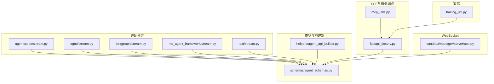
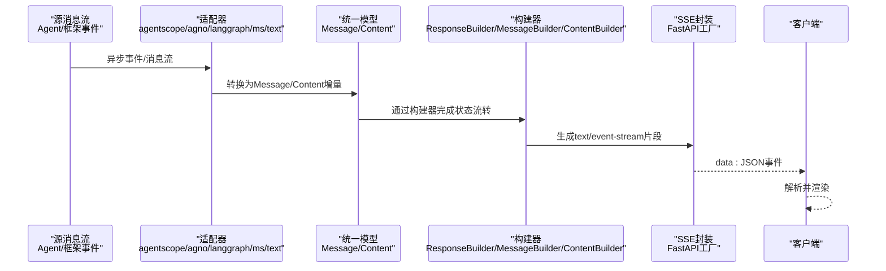
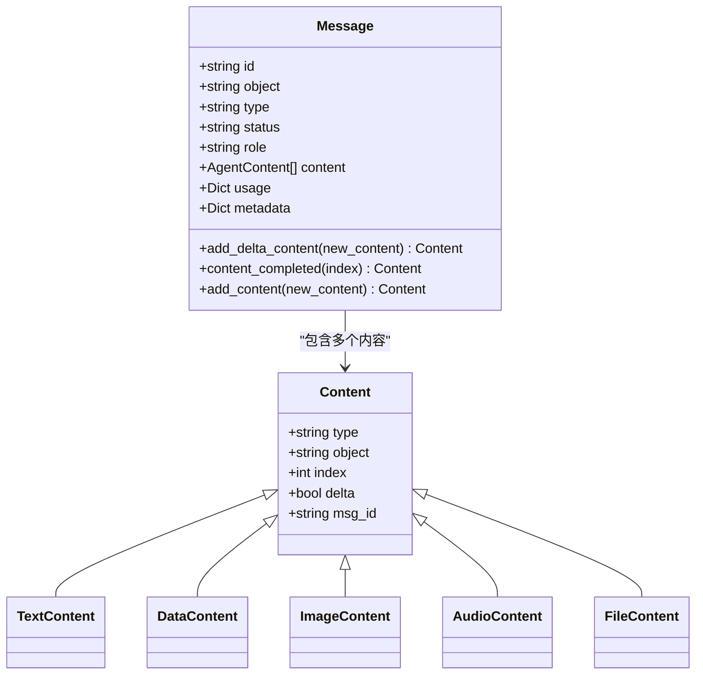
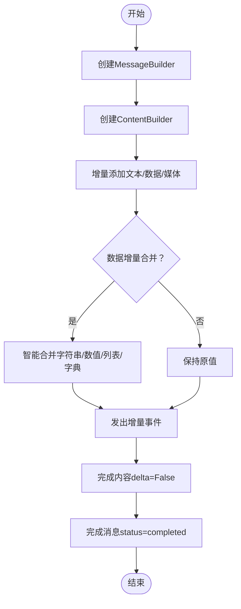
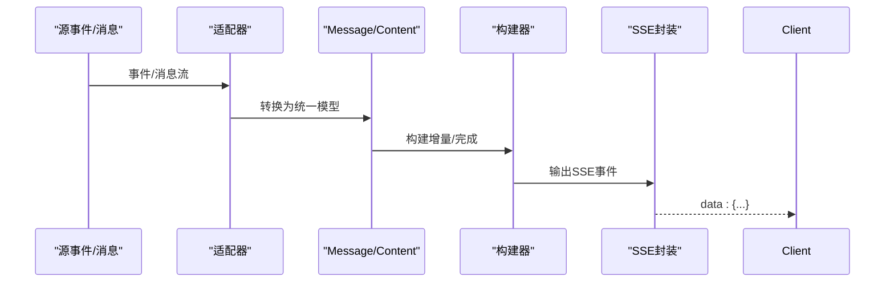
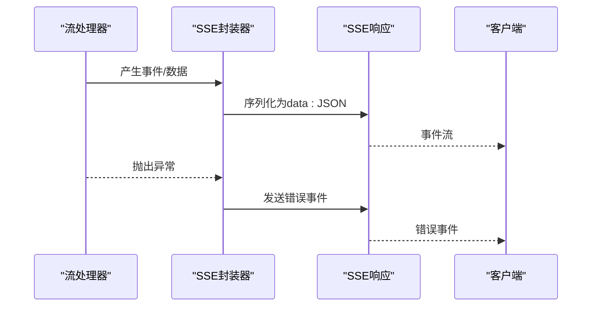
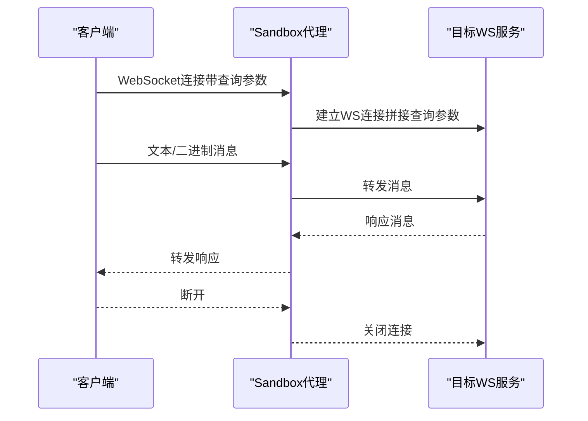
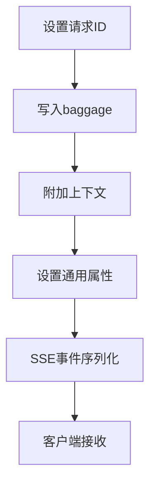
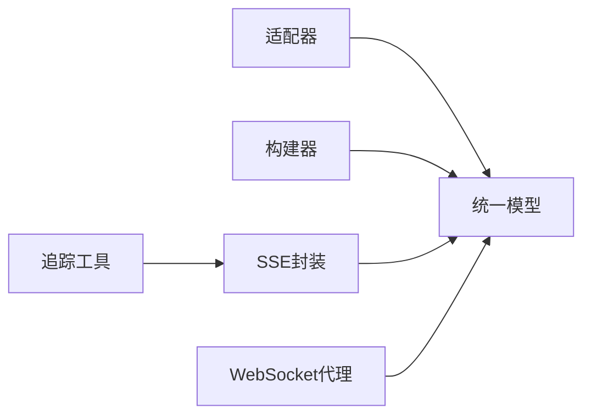

# 流式处理机制

<cite>
**本文引用的文件**
- [src/agentscope_runtime/adapters/agentscope/stream.py](file://src/agentscope_runtime/adapters/agentscope/stream.py)
- [src/agentscope_runtime/adapters/agno/stream.py](file://src/agentscope_runtime/adapters/agno/stream.py)
- [src/agentscope_runtime/adapters/langgraph/stream.py](file://src/agentscope_runtime/adapters/langgraph/stream.py)
- [src/agentscope_runtime/adapters/ms_agent_framework/stream.py](file://src/agentscope_runtime/adapters/ms_agent_framework/stream.py)
- [src/agentscope_runtime/adapters/text/stream.py](file://src/agentscope_runtime/adapters/text/stream.py)
- [src/agentscope_runtime/engine/schemas/agent_schemas.py](file://src/agentscope_runtime/engine/schemas/agent_schemas.py)
- [src/agentscope_runtime/engine/helpers/agent_api_builder.py](file://src/agentscope_runtime/engine/helpers/agent_api_builder.py)
- [src/agentscope_runtime/engine/deployers/utils/service_utils/fastapi_factory.py](file://src/agentscope_runtime/engine/deployers/utils/service_utils/fastapi_factory.py)
- [src/agentscope_runtime/sandbox/box/shared/routers/mcp_utils.py](file://src/agentscope_runtime/sandbox/box/shared/routers/mcp_utils.py)
- [src/agentscope_runtime/sandbox/manager/server/app.py](file://src/agentscope_runtime/sandbox/manager/server/app.py)
- [src/agentscope_runtime/engine/tracing/tracing_util.py](file://src/agentscope_runtime/engine/tracing/tracing_util.py)
- [tests/unit/test_agent_app_custom_endpoint.py](file://tests/unit/test_agent_app_custom_endpoint.py)
</cite>

## 目录
1. [简介](#简介)
2. [项目结构](#项目结构)
3. [核心组件](#核心组件)
4. [架构总览](#架构总览)
5. [详细组件分析](#详细组件分析)
6. [依赖分析](#依赖分析)
7. [性能考虑](#性能考虑)
8. [故障排查指南](#故障排查指南)
9. [结论](#结论)
10. [附录](#附录)

## 简介
本文件系统性阐述 AgentScope Runtime 中的流式处理机制，重点覆盖以下方面：
- SSE（Server-Sent Events）与 WebSocket 在运行时中的应用与集成点
- 流式消息传递、实时通信与状态同步的工作原理
- 消息封装、传输协议与错误恢复策略
- 流式 API 的使用示例与最佳实践
- 性能优化与调试技巧
- 追踪系统与流式处理的集成方式

目标是帮助读者从概念到实现全面理解 AgentScope Runtime 的流式能力，并为开发者提供可操作的指导。

## 项目结构
围绕流式处理的关键目录与文件如下：
- 适配器层：将不同来源的消息流转换为统一的流式输出模型
  - agentscope/stream.py、agno/stream.py、langgraph/stream.py、ms_agent_framework/stream.py、text/stream.py
- 统一模型与构建器：定义消息、内容类型及增量构建流程
  - engine/schemas/agent_schemas.py、engine/helpers/agent_api_builder.py
- 服务端点与SSE封装：FastAPI工厂对异步生成器进行SSE事件封装
  - engine/deployers/utils/service_utils/fastapi_factory.py
- MCP工具链与SSE客户端：SSE读取超时与会话管理
  - sandbox/box/shared/routers/mcp_utils.py
- WebSocket代理与转发：Sandbox管理服务对WebSocket连接的中继
  - sandbox/manager/server/app.py
- 追踪上下文：请求ID、追踪头与通用属性的设置与传播
  - engine/tracing/tracing_util.py
- 单元测试：验证SSE错误回传与查询参数透传等行为
  - tests/unit/test_agent_app_custom_endpoint.py

图表来源
- [src/agentscope_runtime/adapters/agentscope/stream.py:33-684](file://src/agentscope_runtime/adapters/agentscope/stream.py#L33-L684)
- [src/agentscope_runtime/adapters/agno/stream.py:32-124](file://src/agentscope_runtime/adapters/agno/stream.py#L32-L124)
- [src/agentscope_runtime/adapters/langgraph/stream.py:28-257](file://src/agentscope_runtime/adapters/langgraph/stream.py#L28-L257)
- [src/agentscope_runtime/adapters/ms_agent_framework/stream.py:36-420](file://src/agentscope_runtime/adapters/ms_agent_framework/stream.py#L36-L420)
- [src/agentscope_runtime/adapters/text/stream.py:12-31](file://src/agentscope_runtime/adapters/text/stream.py#L12-L31)
- [src/agentscope_runtime/engine/schemas/agent_schemas.py:480-740](file://src/agentscope_runtime/engine/schemas/agent_schemas.py#L480-L740)
- [src/agentscope_runtime/engine/helpers/agent_api_builder.py:28-655](file://src/agentscope_runtime/engine/helpers/agent_api_builder.py#L28-L655)
- [src/agentscope_runtime/engine/deployers/utils/service_utils/fastapi_factory.py:696-836](file://src/agentscope_runtime/engine/deployers/utils/service_utils/fastapi_factory.py#L696-L836)
- [src/agentscope_runtime/sandbox/box/shared/routers/mcp_utils.py:70-188](file://src/agentscope_runtime/sandbox/box/shared/routers/mcp_utils.py#L70-L188)
- [src/agentscope_runtime/sandbox/manager/server/app.py:297-333](file://src/agentscope_runtime/sandbox/manager/server/app.py#L297-L333)
- [src/agentscope_runtime/engine/tracing/tracing_util.py:23-136](file://src/agentscope_runtime/engine/tracing/tracing_util.py#L23-L136)

章节来源
- [src/agentscope_runtime/adapters/agentscope/stream.py:33-684](file://src/agentscope_runtime/adapters/agentscope/stream.py#L33-L684)
- [src/agentscope_runtime/engine/schemas/agent_schemas.py:480-740](file://src/agentscope_runtime/engine/schemas/agent_schemas.py#L480-L740)
- [src/agentscope_runtime/engine/helpers/agent_api_builder.py:28-655](file://src/agentscope_runtime/engine/helpers/agent_api_builder.py#L28-L655)
- [src/agentscope_runtime/engine/deployers/utils/service_utils/fastapi_factory.py:696-836](file://src/agentscope_runtime/engine/deployers/utils/service_utils/fastapi_factory.py#L696-L836)
- [src/agentscope_runtime/sandbox/box/shared/routers/mcp_utils.py:70-188](file://src/agentscope_runtime/sandbox/box/shared/routers/mcp_utils.py#L70-L188)
- [src/agentscope_runtime/sandbox/manager/server/app.py:297-333](file://src/agentscope_runtime/sandbox/manager/server/app.py#L297-L333)
- [src/agentscope_runtime/engine/tracing/tracing_util.py:23-136](file://src/agentscope_runtime/engine/tracing/tracing_util.py#L23-L136)

## 核心组件
- 统一消息与内容模型
  - Message：承载角色、类型、状态、内容列表、用量与元数据
  - Content/TextContent/DataContent/ImageContent/AudioContent/FileContent：内容类型抽象与增量拼接
  - 工具调用与输出：FunctionCall、FunctionCallOutput、McpCall、McpCallOutput
- 构建器模式
  - ContentBuilder：按文本/图像/数据等类型增量构建内容，支持delta合并
  - MessageBuilder：管理消息生命周期，完成时更新状态
  - ResponseBuilder：协调消息与内容构建，生成完整的流式响应序列
- 适配器层
  - 将不同框架或来源的事件/消息流转换为统一的 Message/Content 流
  - 支持自定义类型转换器（type_converters），扩展媒体块与业务块的流式输出
- SSE封装与错误处理
  - FastAPI工厂将任意可迭代对象包装为text/event-stream，自动序列化并注入错误事件
- WebSocket代理
  - Sandbox管理服务对WebSocket连接进行中继，支持查询参数透传与二进制/文本消息转发

章节来源
- [src/agentscope_runtime/engine/schemas/agent_schemas.py:480-740](file://src/agentscope_runtime/engine/schemas/agent_schemas.py#L480-L740)
- [src/agentscope_runtime/engine/helpers/agent_api_builder.py:28-655](file://src/agentscope_runtime/engine/helpers/agent_api_builder.py#L28-L655)
- [src/agentscope_runtime/adapters/agentscope/stream.py:33-684](file://src/agentscope_runtime/adapters/agentscope/stream.py#L33-L684)
- [src/agentscope_runtime/engine/deployers/utils/service_utils/fastapi_factory.py:696-836](file://src/agentscope_runtime/engine/deployers/utils/service_utils/fastapi_factory.py#L696-L836)
- [src/agentscope_runtime/sandbox/manager/server/app.py:297-333](file://src/agentscope_runtime/sandbox/manager/server/app.py#L297-L333)

## 架构总览
下图展示从“适配器”到“SSE封装”再到“客户端”的完整链路，以及WebSocket代理路径：

图表来源
- [src/agentscope_runtime/adapters/agentscope/stream.py:33-684](file://src/agentscope_runtime/adapters/agentscope/stream.py#L33-L684)
- [src/agentscope_runtime/adapters/agno/stream.py:32-124](file://src/agentscope_runtime/adapters/agno/stream.py#L32-L124)
- [src/agentscope_runtime/adapters/langgraph/stream.py:28-257](file://src/agentscope_runtime/adapters/langgraph/stream.py#L28-L257)
- [src/agentscope_runtime/adapters/ms_agent_framework/stream.py:36-420](file://src/agentscope_runtime/adapters/ms_agent_framework/stream.py#L36-L420)
- [src/agentscope_runtime/adapters/text/stream.py:12-31](file://src/agentscope_runtime/adapters/text/stream.py#L12-L31)
- [src/agentscope_runtime/engine/schemas/agent_schemas.py:480-740](file://src/agentscope_runtime/engine/schemas/agent_schemas.py#L480-L740)
- [src/agentscope_runtime/engine/helpers/agent_api_builder.py:28-655](file://src/agentscope_runtime/engine/helpers/agent_api_builder.py#L28-L655)
- [src/agentscope_runtime/engine/deployers/utils/service_utils/fastapi_factory.py:696-836](file://src/agentscope_runtime/engine/deployers/utils/service_utils/fastapi_factory.py#L696-L836)

## 详细组件分析

### 统一消息与内容模型
- Message
  - 角色、类型、状态（Created/InProgress/Completed/Failed/Canceled等）
  - 内容列表：TextContent、DataContent、ImageContent、AudioContent、FileContent等
  - 增量拼接：add_delta_content 支持文本、图像URL、数据块的增量合并
  - 完成态：content_completed 与 add_content 提供最终内容固化
- Content
  - delta标记与索引，用于区分增量与完整内容
  - 不同类型内容的序列化与反序列化支持
- 工具调用与输出
  - FunctionCall/FunctionCallOutput：标准函数调用
  - McpCall/McpCallOutput：MCP工具调用
  - 支持MCP Approval Request/Response等扩展消息类型

图表来源
- [src/agentscope_runtime/engine/schemas/agent_schemas.py:480-740](file://src/agentscope_runtime/engine/schemas/agent_schemas.py#L480-L740)

章节来源
- [src/agentscope_runtime/engine/schemas/agent_schemas.py:480-740](file://src/agentscope_runtime/engine/schemas/agent_schemas.py#L480-L740)

### 构建器模式（Builder）
- ContentBuilder
  - 文本：维护tokens列表，增量拼接后生成delta内容
  - 数据：维护增量字段，按类型智能合并（字符串拼接、数值累加、列表合并、字典递归合并）
  - 图像/音频/文件：直接设置URL或数据，支持增量标记
- MessageBuilder
  - 生命周期：in_progress -> 内容增量 -> completed
  - 与ResponseBuilder协作，更新输出列表
- ResponseBuilder
  - 生成完整的流式序列：created -> in_progress -> message -> content -> completed

图表来源
- [src/agentscope_runtime/engine/helpers/agent_api_builder.py:28-655](file://src/agentscope_runtime/engine/helpers/agent_api_builder.py#L28-L655)

章节来源
- [src/agentscope_runtime/engine/helpers/agent_api_builder.py:28-655](file://src/agentscope_runtime/engine/helpers/agent_api_builder.py#L28-L655)

### 适配器层（多框架/来源流式适配）
- agentscope/stream.py
  - 支持文本、思考（reasoning）、工具调用（plugin/mcp）、图片/音频/视频/文件等多模态块
  - 支持自定义类型转换器（type_converters），允许返回同步/异步生成器以扩展输出
  - 使用本地截断策略避免重复文本输出
- agno/stream.py
  - 基于事件流（RunStarted/RunContent/RunCompleted/ToolCallStarted/ToolCallCompleted等）
  - 文本增量与工具调用/结果的完整消息封装
- langgraph/stream.py
  - 面向LangChain消息（Human/AI/System/Tool），支持tool_call_chunks与最后块合并
  - 通过reduce合并chunks，生成统一的工具调用消息
- ms_agent_framework/stream.py
  - 面向MS Agent Framework的AgentRunResponseUpdate流
  - 支持UsageContent、TextReasoningContent、FunctionCallContent、FunctionResultContent、UriContent等
- text/stream.py
  - 最简适配：将纯文本流转换为Message/Content

图表来源
- [src/agentscope_runtime/adapters/agentscope/stream.py:33-684](file://src/agentscope_runtime/adapters/agentscope/stream.py#L33-L684)
- [src/agentscope_runtime/adapters/agno/stream.py:32-124](file://src/agentscope_runtime/adapters/agno/stream.py#L32-L124)
- [src/agentscope_runtime/adapters/langgraph/stream.py:28-257](file://src/agentscope_runtime/adapters/langgraph/stream.py#L28-L257)
- [src/agentscope_runtime/adapters/ms_agent_framework/stream.py:36-420](file://src/agentscope_runtime/adapters/ms_agent_framework/stream.py#L36-L420)
- [src/agentscope_runtime/adapters/text/stream.py:12-31](file://src/agentscope_runtime/adapters/text/stream.py#L12-L31)

章节来源
- [src/agentscope_runtime/adapters/agentscope/stream.py:33-684](file://src/agentscope_runtime/adapters/agentscope/stream.py#L33-L684)
- [src/agentscope_runtime/adapters/agno/stream.py:32-124](file://src/agentscope_runtime/adapters/agno/stream.py#L32-L124)
- [src/agentscope_runtime/adapters/langgraph/stream.py:28-257](file://src/agentscope_runtime/adapters/langgraph/stream.py#L28-L257)
- [src/agentscope_runtime/adapters/ms_agent_framework/stream.py:36-420](file://src/agentscope_runtime/adapters/ms_agent_framework/stream.py#L36-L420)
- [src/agentscope_runtime/adapters/text/stream.py:12-31](file://src/agentscope_runtime/adapters/text/stream.py#L12-L31)

### SSE封装与错误恢复
- FastAPI工厂
  - 将异步生成器或同步迭代器包装为text/event-stream
  - 自动序列化任意对象（含Pydantic模型、数据类、嵌套结构），并注入错误事件
  - 避免FastAPI误判装饰后的异步生成器为非协程，确保正确await
- 错误恢复
  - 捕获异常并发送标准化错误事件（包含错误类型与消息），保证客户端可感知失败
- 查询参数透传
  - 单元测试验证SSE端点在发生错误时仍能正确返回错误事件，且查询参数可被接收方使用

图表来源
- [src/agentscope_runtime/engine/deployers/utils/service_utils/fastapi_factory.py:696-836](file://src/agentscope_runtime/engine/deployers/utils/service_utils/fastapi_factory.py#L696-L836)
- [tests/unit/test_agent_app_custom_endpoint.py:200-275](file://tests/unit/test_agent_app_custom_endpoint.py#L200-L275)

章节来源
- [src/agentscope_runtime/engine/deployers/utils/service_utils/fastapi_factory.py:696-836](file://src/agentscope_runtime/engine/deployers/utils/service_utils/fastapi_factory.py#L696-L836)
- [tests/unit/test_agent_app_custom_endpoint.py:200-275](file://tests/unit/test_agent_app_custom_endpoint.py#L200-L275)

### WebSocket实时通信与代理
- Sandbox管理服务
  - 接收客户端WebSocket消息，解析query_params并拼接到目标URL
  - 建立到下游服务的WebSocket连接，双向转发text/bytes消息
  - 断开时清理资源，保证连接稳定
- GUI沙箱示例
  - 前端根据协议选择ws/wss，构造WebSocket路径并建立RFB连接，实现远程桌面控制

图表来源
- [src/agentscope_runtime/sandbox/manager/server/app.py:297-333](file://src/agentscope_runtime/sandbox/manager/server/app.py#L297-L333)
- [src/agentscope_runtime/sandbox/box/gui/box/vnc_relay.html:149-197](file://src/agentscope_runtime/sandbox/box/gui/box/vnc_relay.html#L149-L197)

章节来源
- [src/agentscope_runtime/sandbox/manager/server/app.py:297-333](file://src/agentscope_runtime/sandbox/manager/server/app.py#L297-L333)
- [src/agentscope_runtime/sandbox/box/gui/box/vnc_relay.html:149-197](file://src/agentscope_runtime/sandbox/box/gui/box/vnc_relay.html#L149-L197)

### 追踪系统与流式处理集成
- TracingUtil
  - 设置/获取请求ID，写入baggage以便跨线程传播
  - 设置/获取追踪头与通用属性，支持全局环境变量注入
  - 清理通用属性，避免污染后续请求
- 集成建议
  - 在SSE封装前设置请求ID，使每个事件携带一致的追踪上下文
  - 将trace_headers透传至下游服务，确保端到端链路可见

图表来源
- [src/agentscope_runtime/engine/tracing/tracing_util.py:23-136](file://src/agentscope_runtime/engine/tracing/tracing_util.py#L23-L136)
- [src/agentscope_runtime/engine/deployers/utils/service_utils/fastapi_factory.py:696-836](file://src/agentscope_runtime/engine/deployers/utils/service_utils/fastapi_factory.py#L696-L836)

章节来源
- [src/agentscope_runtime/engine/tracing/tracing_util.py:23-136](file://src/agentscope_runtime/engine/tracing/tracing_util.py#L23-L136)
- [src/agentscope_runtime/engine/deployers/utils/service_utils/fastapi_factory.py:696-836](file://src/agentscope_runtime/engine/deployers/utils/service_utils/fastapi_factory.py#L696-L836)

## 依赖分析
- 低耦合高内聚
  - 适配器仅依赖统一模型与工具函数，不直接依赖具体框架，便于扩展
  - 构建器独立于SSE封装，便于替换或复用
- 外部依赖
  - FastAPI：SSE封装与路由注册
  - websockets：WebSocket代理
  - OpenTelemetry：追踪上下文传播
- 潜在风险
  - 适配器内部逻辑复杂度较高，需通过单元测试保障稳定性
  - SSE封装对异常的统一处理依赖于调用方抛出异常，避免静默失败

图表来源
- [src/agentscope_runtime/adapters/agentscope/stream.py:33-684](file://src/agentscope_runtime/adapters/agentscope/stream.py#L33-L684)
- [src/agentscope_runtime/engine/schemas/agent_schemas.py:480-740](file://src/agentscope_runtime/engine/schemas/agent_schemas.py#L480-L740)
- [src/agentscope_runtime/engine/helpers/agent_api_builder.py:28-655](file://src/agentscope_runtime/engine/helpers/agent_api_builder.py#L28-L655)
- [src/agentscope_runtime/engine/deployers/utils/service_utils/fastapi_factory.py:696-836](file://src/agentscope_runtime/engine/deployers/utils/service_utils/fastapi_factory.py#L696-L836)
- [src/agentscope_runtime/sandbox/manager/server/app.py:297-333](file://src/agentscope_runtime/sandbox/manager/server/app.py#L297-L333)
- [src/agentscope_runtime/engine/tracing/tracing_util.py:23-136](file://src/agentscope_runtime/engine/tracing/tracing_util.py#L23-L136)

章节来源
- [src/agentscope_runtime/adapters/agentscope/stream.py:33-684](file://src/agentscope_runtime/adapters/agentscope/stream.py#L33-L684)
- [src/agentscope_runtime/engine/schemas/agent_schemas.py:480-740](file://src/agentscope_runtime/engine/schemas/agent_schemas.py#L480-L740)
- [src/agentscope_runtime/engine/helpers/agent_api_builder.py:28-655](file://src/agentscope_runtime/engine/helpers/agent_api_builder.py#L28-L655)
- [src/agentscope_runtime/engine/deployers/utils/service_utils/fastapi_factory.py:696-836](file://src/agentscope_runtime/engine/deployers/utils/service_utils/fastapi_factory.py#L696-L836)
- [src/agentscope_runtime/sandbox/manager/server/app.py:297-333](file://src/agentscope_runtime/sandbox/manager/server/app.py#L297-L333)
- [src/agentscope_runtime/engine/tracing/tracing_util.py:23-136](file://src/agentscope_runtime/engine/tracing/tracing_util.py#L23-L136)

## 性能考虑
- 流式传输
  - 优先使用增量内容（delta=True）减少网络负载与前端重绘成本
  - 合理拆分文本块，避免单次事件过大导致客户端阻塞
- 序列化与合并
  - ContentBuilder对数据增量采用智能合并策略，降低CPU与内存压力
  - 避免深层嵌套结构的频繁序列化，必要时进行缓存或延迟处理
- 超时与重试
  - MCP SSE客户端支持读取超时配置，建议根据业务场景调整（默认较长超时）
  - WebSocket代理在断连时及时清理资源，避免连接泄漏
- 追踪开销
  - 追踪上下文设置为轻量级操作，但应避免在高频事件中重复设置相同属性

## 故障排查指南
- SSE未收到事件
  - 检查端点是否正确返回text/event-stream
  - 确认生成器未提前退出或抛出异常
- 错误事件缺失
  - 确保异常被捕获并注入错误事件
  - 核对SSE封装器的异常捕获逻辑
- 查询参数无效
  - 确认代理服务正确拼接query_params到目标URL
- WebSocket无法连接
  - 检查协议（ws/wss）与路径参数
  - 确认目标服务地址与认证信息正确
- 追踪上下文丢失
  - 确认请求ID已在SSE封装前设置并写入baggage
  - 核对trace_headers是否透传到下游

章节来源
- [tests/unit/test_agent_app_custom_endpoint.py:200-275](file://tests/unit/test_agent_app_custom_endpoint.py#L200-L275)
- [src/agentscope_runtime/sandbox/manager/server/app.py:297-333](file://src/agentscope_runtime/sandbox/manager/server/app.py#L297-L333)
- [src/agentscope_runtime/engine/tracing/tracing_util.py:23-136](file://src/agentscope_runtime/engine/tracing/tracing_util.py#L23-L136)

## 结论
AgentScope Runtime 的流式处理机制通过“统一模型 + 构建器 + 适配器 + SSE封装 + WebSocket代理”的分层设计，实现了对多来源消息流的标准化输出与实时通信。该体系具备良好的扩展性与鲁棒性，能够满足复杂业务场景下的流式需求。结合追踪系统，可实现端到端的可观测性与问题定位。

## 附录
- 使用示例与最佳实践
  - SSE端点：将异步生成器作为处理器，交由FastAPI工厂自动封装为text/event-stream；在生成器中抛出异常以触发错误事件
  - 适配器选择：根据Agent框架选择对应适配器，如Agentscope/LangGraph/MS Agent Framework等
  - 增量构建：优先使用ContentBuilder的增量接口，减少内存与网络开销
  - WebSocket：在代理层正确拼接查询参数，确保下游服务可感知上下文
  - 追踪：在请求入口设置请求ID与通用属性，贯穿SSE与WebSocket链路
- 参考文件
  - [适配器实现:33-684](file://src/agentscope_runtime/adapters/agentscope/stream.py#L33-L684)
  - [SSE封装与错误处理:696-836](file://src/agentscope_runtime/engine/deployers/utils/service_utils/fastapi_factory.py#L696-L836)
  - [WebSocket代理:297-333](file://src/agentscope_runtime/sandbox/manager/server/app.py#L297-L333)
  - [统一模型:480-740](file://src/agentscope_runtime/engine/schemas/agent_schemas.py#L480-L740)
  - [构建器:28-655](file://src/agentscope_runtime/engine/helpers/agent_api_builder.py#L28-L655)
  - [MCP SSE客户端:70-188](file://src/agentscope_runtime/sandbox/box/shared/routers/mcp_utils.py#L70-L188)
  - [追踪工具:23-136](file://src/agentscope_runtime/engine/tracing/tracing_util.py#L23-L136)
  - [SSE错误回传测试:200-275](file://tests/unit/test_agent_app_custom_endpoint.py#L200-L275)