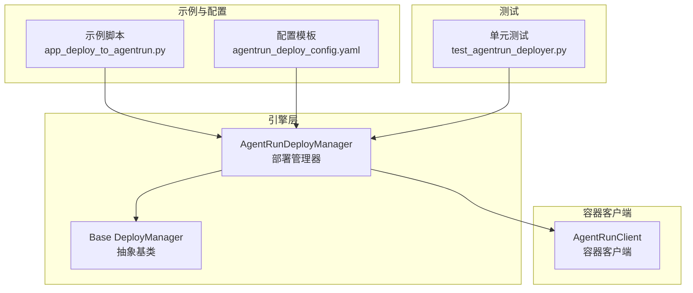
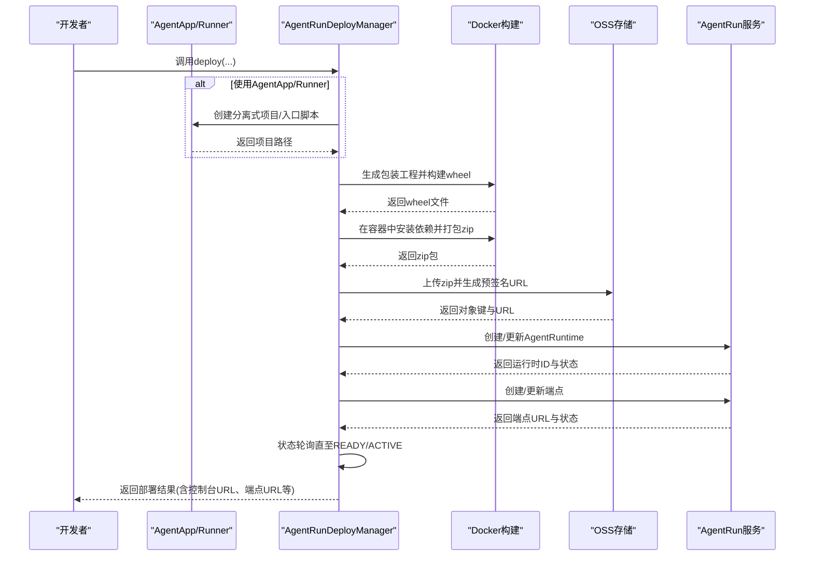
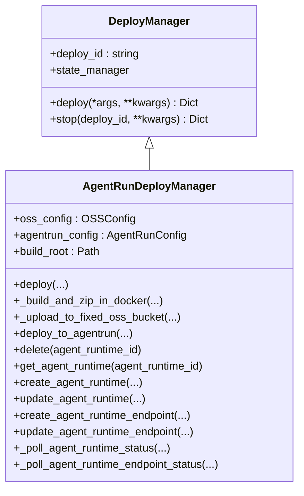
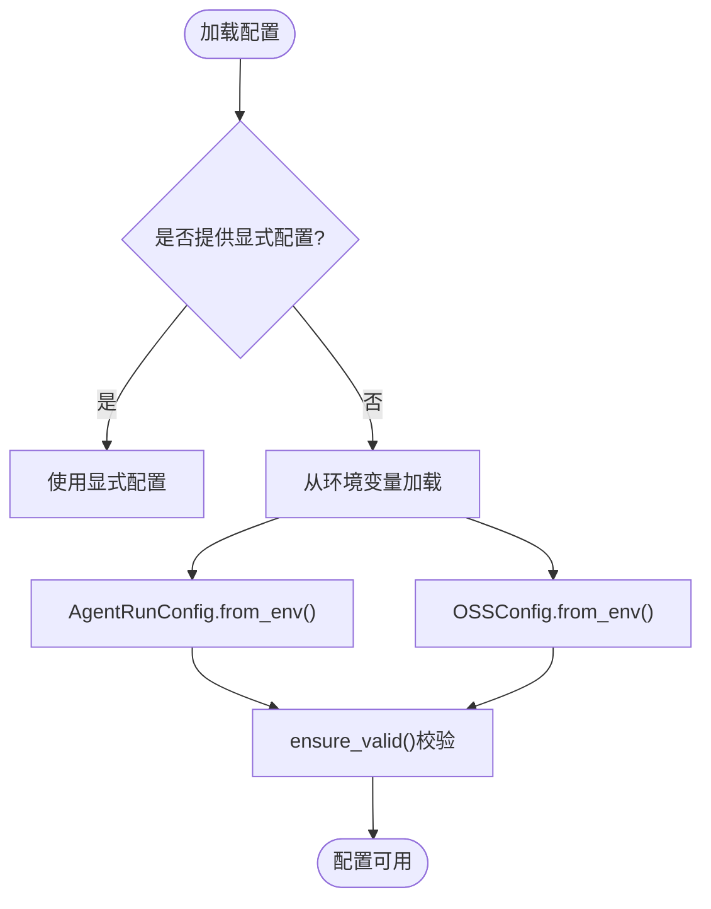
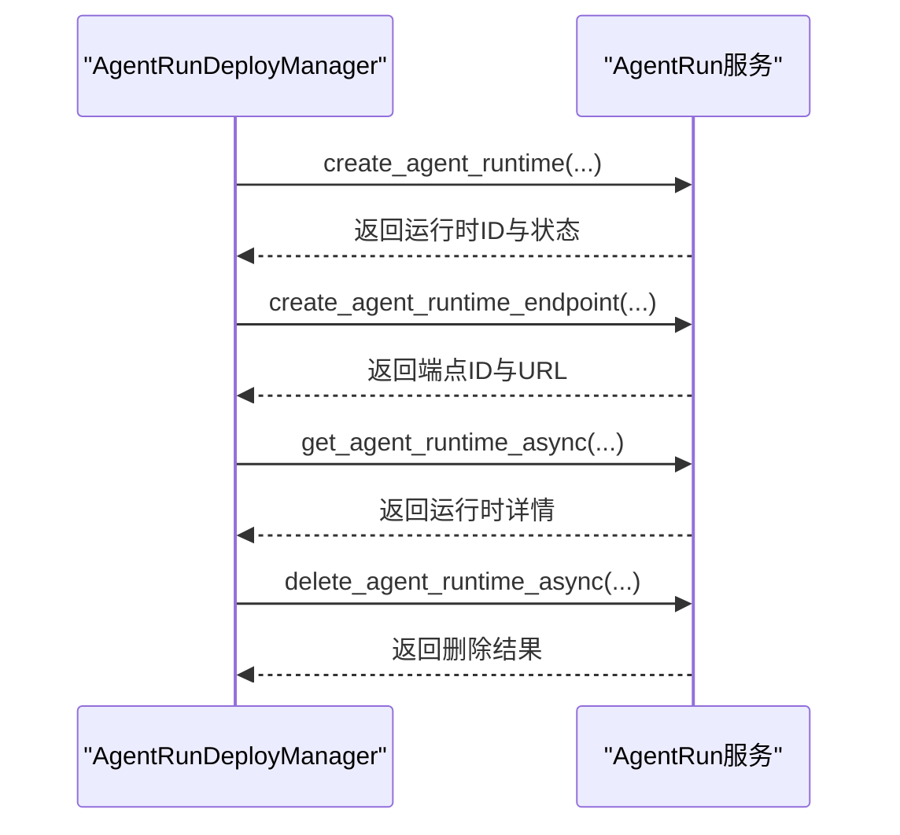
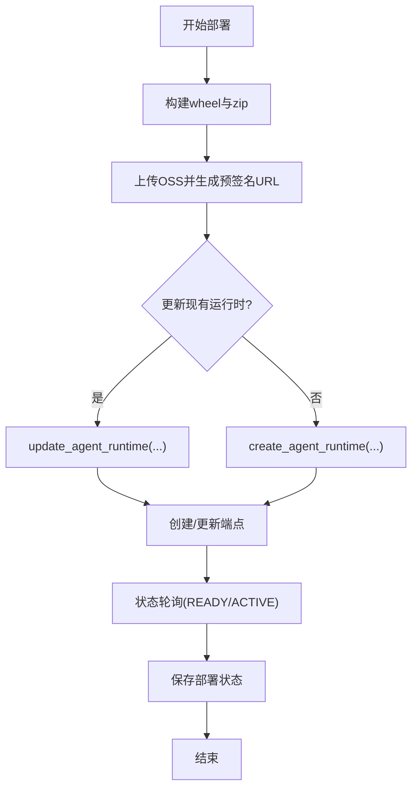
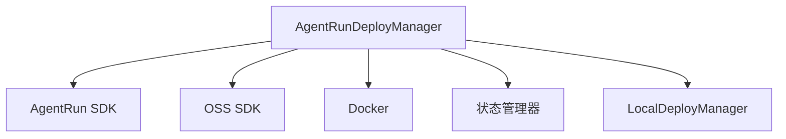

# AgentRun部署

<cite>
**本文档引用的文件**
- [agentrun_deployer.py](file://src/agentscope_runtime/engine/deployers/agentrun_deployer.py)
- [agentrun_client.py](file://src/agentscope_runtime/common/container_clients/agentrun_client.py)
- [app_deploy_to_agentrun.py](file://examples/deployments/agentrun_deploy/app_deploy_to_agentrun.py)
- [agentrun_deploy_config.yaml](file://examples/deployments/agentrun_deploy_config.yaml)
- [base.py](file://src/agentscope_runtime/engine/deployers/base.py)
- [test_agentrun_deployer.py](file://tests/deploy/test_agentrun_deployer.py)
</cite>

## 目录
1. [简介](#简介)
2. [项目结构](#项目结构)
3. [核心组件](#核心组件)
4. [架构总览](#架构总览)
5. [详细组件分析](#详细组件分析)
6. [依赖关系分析](#依赖关系分析)
7. [性能考虑](#性能考虑)
8. [故障排查指南](#故障排查指南)
9. [结论](#结论)
10. [附录](#附录)

## 简介
本文件面向使用 AgentScope Runtime 在阿里云 AgentRun 平台进行部署的用户与工程师，系统性阐述 AgentRun 部署模式的实现原理、平台集成方式、配置参数、API 接口、认证与权限、部署流程、版本管理与回滚策略，以及监控、日志与性能优化建议。重点围绕 AgentRunDeployManager 的实现细节，结合示例与测试用例，帮助读者快速完成从本地开发到云端上线的全链路部署。

## 项目结构
AgentRun 部署相关代码主要分布在以下模块：
- 引擎层部署器：负责打包、上传、创建运行时与端点、状态轮询与删除等核心流程
- 容器客户端：在沙箱场景下封装 AgentRun 客户端能力（如容器化会话管理）
- 示例与配置：提供可直接运行的部署示例与 YAML 配置模板
- 基类与测试：统一的部署接口定义与完备的单元测试

**图表来源**
- [agentrun_deployer.py:264-300](file://src/agentscope_runtime/engine/deployers/agentrun_deployer.py#L264-L300)
- [base.py:9-44](file://src/agentscope_runtime/engine/deployers/base.py#L9-L44)
- [agentrun_client.py:32-66](file://src/agentscope_runtime/common/container_clients/agentrun_client.py#L32-L66)
- [app_deploy_to_agentrun.py:125-203](file://examples/deployments/agentrun_deploy/app_deploy_to_agentrun.py#L125-L203)
- [agentrun_deploy_config.yaml:1-28](file://examples/deployments/agentrun_deploy_config.yaml#L1-L28)
- [test_agentrun_deployer.py:1-36](file://tests/deploy/test_agentrun_deployer.py#L1-L36)

**章节来源**
- [agentrun_deployer.py:264-300](file://src/agentscope_runtime/engine/deployers/agentrun_deployer.py#L264-L300)
- [base.py:9-44](file://src/agentscope_runtime/engine/deployers/base.py#L9-L44)

## 核心组件
- AgentRunDeployManager：AgentRun 平台的部署管理器，负责构建打包、上传 OSS、创建/更新 AgentRuntime、创建/更新端点、状态轮询、删除与查询等完整生命周期操作。
- AgentRunClient：在沙箱或容器场景下的 AgentRun 客户端封装，支持创建/启动/停止/删除 AgentRun 会话，并处理健康检查与状态轮询。
- 配置模型：AgentRunConfig、OSSConfig、LogConfig、NetworkConfig、CodeConfig、EndpointConfig 等，用于描述部署所需的资源与网络、日志、代码包等参数。
- 示例与配置：提供基于 AgentApp 的部署示例与 YAML 配置模板，便于快速上手。

关键职责与特性：
- 构建与打包：通过生成包装工程并构建 wheel，再在容器中安装依赖并打包为 zip，确保运行时一致性。
- 上传与分发：将 zip 包上传至指定 OSS 桶，生成预签名下载链接供 AgentRun 使用。
- 运行时与端点：创建/更新 AgentRuntime 与默认端点，支持目标版本、并发限制、空闲超时等高级配置。
- 状态轮询：对 AgentRuntime 与端点进行轮询，直到达到就绪或活跃状态，提升部署可靠性。
- 删除与查询：支持删除运行时与查询详情，便于运维与回滚。

**章节来源**
- [agentrun_deployer.py:521-733](file://src/agentscope_runtime/engine/deployers/agentrun_deployer.py#L521-L733)
- [agentrun_deployer.py:876-1028](file://src/agentscope_runtime/engine/deployers/agentrun_deployer.py#L876-L1028)
- [agentrun_deployer.py:1030-1295](file://src/agentscope_runtime/engine/deployers/agentrun_deployer.py#L1030-L1295)
- [agentrun_deployer.py:1616-1801](file://src/agentscope_runtime/engine/deployers/agentrun_deployer.py#L1616-L1801)
- [agentrun_client.py:32-66](file://src/agentscope_runtime/common/container_clients/agentrun_client.py#L32-L66)

## 架构总览
AgentRun 部署的整体流程如下：

**图表来源**
- [agentrun_deployer.py:521-733](file://src/agentscope_runtime/engine/deployers/agentrun_deployer.py#L521-L733)
- [agentrun_deployer.py:876-1028](file://src/agentscope_runtime/engine/deployers/agentrun_deployer.py#L876-L1028)
- [agentrun_deployer.py:1030-1295](file://src/agentscope_runtime/engine/deployers/agentrun_deployer.py#L1030-L1295)
- [agentrun_deployer.py:1616-1801](file://src/agentscope_runtime/engine/deployers/agentrun_deployer.py#L1616-L1801)

## 详细组件分析

### AgentRunDeployManager 实现原理
- 初始化与配置加载：支持从环境变量或显式传参加载 AgentRunConfig 与 OSSConfig；内部构造 AgentRun SDK 客户端。
- 部署主流程：
  - 可选：从 AgentApp/Runner 生成分离式项目并写入 .env 环境变量文件
  - 生成包装工程并构建 wheel，随后在容器中安装依赖并打包 zip
  - 将 zip 上传至固定 OSS 桶，生成预签名 URL
  - 调用 AgentRun API 创建/更新 AgentRuntime 与端点
  - 对运行时与端点进行状态轮询，直至 READY/ACTIVE
  - 保存部署状态并返回结果
- 关键方法：
  - deploy(...)：对外部署入口，串联上述步骤
  - _build_and_zip_in_docker(...)：容器内构建与打包
  - _upload_to_fixed_oss_bucket(...)：OSS 上传与预签名
  - deploy_to_agentrun(...)：创建/更新运行时与端点
  - _poll_agent_runtime_status/_poll_agent_runtime_endpoint_status：状态轮询
  - delete/get_agent_runtime：删除与查询运行时
  - create/update_agent_runtime_endpoint：端点生命周期管理

**图表来源**
- [base.py:9-44](file://src/agentscope_runtime/engine/deployers/base.py#L9-L44)
- [agentrun_deployer.py:264-300](file://src/agentscope_runtime/engine/deployers/agentrun_deployer.py#L264-L300)
- [agentrun_deployer.py:521-733](file://src/agentscope_runtime/engine/deployers/agentrun_deployer.py#L521-L733)

**章节来源**
- [agentrun_deployer.py:264-300](file://src/agentscope_runtime/engine/deployers/agentrun_deployer.py#L264-L300)
- [agentrun_deployer.py:521-733](file://src/agentscope_runtime/engine/deployers/agentrun_deployer.py#L521-L733)
- [agentrun_deployer.py:876-1028](file://src/agentscope_runtime/engine/deployers/agentrun_deployer.py#L876-L1028)
- [agentrun_deployer.py:1030-1295](file://src/agentscope_runtime/engine/deployers/agentrun_deployer.py#L1030-L1295)
- [agentrun_deployer.py:1616-1801](file://src/agentscope_runtime/engine/deployers/agentrun_deployer.py#L1616-L1801)

### 配置模型与环境变量
- AgentRunConfig：平台访问凭据、区域、CPU/内存、执行角色 ARN、会话并发限制与空闲超时等
- OSSConfig：OSS 访问凭据、区域、桶名
- LogConfig/NetworkConfig/CodeConfig/EndpointConfig：日志、网络、代码包与端点配置
- 环境变量加载：支持从环境变量自动填充配置，便于 CI/CD 与多环境管理

**图表来源**
- [agentrun_deployer.py:87-201](file://src/agentscope_runtime/engine/deployers/agentrun_deployer.py#L87-L201)
- [agentrun_deployer.py:220-262](file://src/agentscope_runtime/engine/deployers/agentrun_deployer.py#L220-L262)

**章节来源**
- [agentrun_deployer.py:87-201](file://src/agentscope_runtime/engine/deployers/agentrun_deployer.py#L87-L201)
- [agentrun_deployer.py:220-262](file://src/agentscope_runtime/engine/deployers/agentrun_deployer.py#L220-L262)

### 与 AgentRun 平台的集成与 API
- 运行时生命周期：
  - 创建/更新 AgentRuntime：支持资源规格、代码包、日志、网络、环境变量、会话并发与空闲超时等参数
  - 创建/更新端点：支持端点名称、目标版本、描述等
  - 查询与删除：获取运行时详情与删除运行时
- 状态轮询：对运行时与端点进行轮询，直到 READY/ACTIVE 或失败
- 健康检查：在容器客户端场景下，提供健康检查配置（HTTP GET）

**图表来源**
- [agentrun_deployer.py:1803-1949](file://src/agentscope_runtime/engine/deployers/agentrun_deployer.py#L1803-L1949)
- [agentrun_deployer.py:2094-2226](file://src/agentscope_runtime/engine/deployers/agentrun_deployer.py#L2094-L2226)
- [agentrun_deployer.py:1388-1457](file://src/agentscope_runtime/engine/deployers/agentrun_deployer.py#L1388-L1457)
- [agentrun_deployer.py:1305-1386](file://src/agentscope_runtime/engine/deployers/agentrun_deployer.py#L1305-L1386)

**章节来源**
- [agentrun_deployer.py:1803-1949](file://src/agentscope_runtime/engine/deployers/agentrun_deployer.py#L1803-L1949)
- [agentrun_deployer.py:2094-2226](file://src/agentscope_runtime/engine/deployers/agentrun_deployer.py#L2094-L2226)
- [agentrun_deployer.py:1388-1457](file://src/agentscope_runtime/engine/deployers/agentrun_deployer.py#L1388-L1457)
- [agentrun_deployer.py:1305-1386](file://src/agentscope_runtime/engine/deployers/agentrun_deployer.py#L1305-L1386)

### 部署流程、版本管理与回滚策略
- 部署流程：构建打包 → 上传 OSS → 创建/更新运行时 → 创建/更新端点 → 状态轮询 → 保存状态
- 版本管理：通过发布运行时版本与端点目标版本（LATEST）实现版本化管理
- 回滚策略：可基于已发布的版本号进行端点切换或回滚；删除失败时可通过状态轮询定位问题

**图表来源**
- [agentrun_deployer.py:521-733](file://src/agentscope_runtime/engine/deployers/agentrun_deployer.py#L521-L733)
- [agentrun_deployer.py:1030-1295](file://src/agentscope_runtime/engine/deployers/agentrun_deployer.py#L1030-L1295)
- [agentrun_deployer.py:1616-1801](file://src/agentscope_runtime/engine/deployers/agentrun_deployer.py#L1616-L1801)

**章节来源**
- [agentrun_deployer.py:521-733](file://src/agentscope_runtime/engine/deployers/agentrun_deployer.py#L521-L733)
- [agentrun_deployer.py:1030-1295](file://src/agentscope_runtime/engine/deployers/agentrun_deployer.py#L1030-L1295)

### 认证机制与权限管理
- 认证：通过阿里云访问密钥（AccessKey ID/Secret）进行 AgentRun 与 OSS 的身份验证
- 权限：OSS 桶标签配置用于授予 AgentRun 对桶的读取与添加权限；运行时可绑定执行角色 ARN 以访问其他云资源
- 环境变量：支持从环境变量注入凭据，便于在 CI/CD 中安全传递

**章节来源**
- [agentrun_deployer.py:87-201](file://src/agentscope_runtime/engine/deployers/agentrun_deployer.py#L87-L201)
- [agentrun_deployer.py:896-978](file://src/agentscope_runtime/engine/deployers/agentrun_deployer.py#L896-L978)
- [agentrun_deployer.py:1217-1221](file://src/agentscope_runtime/engine/deployers/agentrun_deployer.py#L1217-L1221)

### 监控指标、日志分析与性能调优
- 监控指标：运行时状态（READY/ACTIVE/FAILED）、端点状态、轮询次数与耗时、上传成功率
- 日志分析：SDK 返回体中的状态码与请求 ID 便于定位问题；容器构建日志输出便于排查依赖安装与打包异常
- 性能调优：
  - 合理设置 CPU/内存规格与会话并发限制，避免过载
  - 使用预签名 URL 减少 OSS 下载延迟
  - 选择合适的网络模式（公网/私网）与 VPC/交换机配置
  - 通过状态轮询参数调整轮询间隔与最大尝试次数

**章节来源**
- [agentrun_deployer.py:1616-1801](file://src/agentscope_runtime/engine/deployers/agentrun_deployer.py#L1616-L1801)
- [agentrun_deployer.py:876-1028](file://src/agentscope_runtime/engine/deployers/agentrun_deployer.py#L876-L1028)

## 依赖关系分析
- 组件耦合：
  - AgentRunDeployManager 依赖 AgentRun SDK（异步 API）与 OSS SDK（上传）
  - 与 LocalDeployManager 的分离式项目生成逻辑协作
  - 与状态管理器协同保存部署状态
- 外部依赖：
  - Docker：用于在容器中安装依赖并打包 zip
  - 阿里云 AgentRun 与 OSS 服务

**图表来源**
- [agentrun_deployer.py:316-331](file://src/agentscope_runtime/engine/deployers/agentrun_deployer.py#L316-L331)
- [agentrun_deployer.py:876-1028](file://src/agentscope_runtime/engine/deployers/agentrun_deployer.py#L876-L1028)

**章节来源**
- [agentrun_deployer.py:316-331](file://src/agentscope_runtime/engine/deployers/agentrun_deployer.py#L316-L331)
- [agentrun_deployer.py:876-1028](file://src/agentscope_runtime/engine/deployers/agentrun_deployer.py#L876-L1028)

## 性能考虑
- 构建阶段：在容器中集中安装依赖，减少主机差异；合理设置镜像与平台参数
- 传输阶段：使用预签名 URL 降低下载时延；OSS 存储采用合适的存储类别
- 运行阶段：根据业务峰值设置 CPU/内存与并发限制；利用端点目标版本实现灰度与快速回滚

## 故障排查指南
常见问题与定位要点：
- Docker 不可用：构建阶段抛出 Docker 缺失错误，需安装并确保在 PATH 中
- OSS SDK 未安装：上传阶段需要 alibabacloud-oss-v2，按提示安装
- 配置缺失：AgentRunConfig/OSSConfig 校验失败，检查必填环境变量
- 状态轮询超时：运行时或端点长时间非 READY/ACTIVE，查看轮询日志与状态原因
- 更新失败：更新运行时需要提供 wheel 文件，否则抛出文件不存在异常

**章节来源**
- [agentrun_deployer.py:862-874](file://src/agentscope_runtime/engine/deployers/agentrun_deployer.py#L862-L874)
- [agentrun_deployer.py:912-918](file://src/agentscope_runtime/engine/deployers/agentrun_deployer.py#L912-L918)
- [agentrun_deployer.py:210-218](file://src/agentscope_runtime/engine/deployers/agentrun_deployer.py#L210-L218)
- [agentrun_deployer.py:1616-1801](file://src/agentscope_runtime/engine/deployers/agentrun_deployer.py#L1616-L1801)
- [test_agentrun_deployer.py:278-316](file://tests/deploy/test_agentrun_deployer.py#L278-L316)

## 结论
AgentRunDeployManager 提供了从本地项目到阿里云 AgentRun 平台的完整部署闭环，具备完善的配置管理、构建打包、上传分发、运行时与端点生命周期管理、状态轮询与运维能力。结合示例与测试，用户可以快速完成 Agent 应用的云端部署，并通过版本管理与回滚策略保障线上稳定性。

## 附录

### 部署配置示例与参数说明
- 示例脚本：examples/deployments/agentrun_deploy/app_deploy_to_agentrun.py
  - 展示三种部署方式：使用 AgentApp、直接从项目目录、从已有 wheel 文件
  - 支持自定义 requirements、extra_packages、环境变量等
- YAML 配置模板：examples/deployments/agentrun_deploy_config.yaml
  - 包含部署名称、跳过上传、区域、资源规格、环境变量等字段

**章节来源**
- [app_deploy_to_agentrun.py:125-203](file://examples/deployments/agentrun_deploy/app_deploy_to_agentrun.py#L125-L203)
- [app_deploy_to_agentrun.py:205-283](file://examples/deployments/agentrun_deploy/app_deploy_to_agentrun.py#L205-L283)
- [app_deploy_to_agentrun.py:286-449](file://examples/deployments/agentrun_deploy/app_deploy_to_agentrun.py#L286-L449)
- [agentrun_deploy_config.yaml:1-28](file://examples/deployments/agentrun_deploy_config.yaml#L1-L28)

### API 与方法参考
- AgentRunDeployManager
  - deploy(...): 主入口，返回部署结果
  - deploy_to_agentrun(...): 创建/更新运行时与端点
  - create_agent_runtime/update_agent_runtime
  - create_agent_runtime_endpoint/update_agent_runtime_endpoint
  - delete/get_agent_runtime
  - _build_and_zip_in_docker/_upload_to_fixed_oss_bucket
  - _poll_agent_runtime_status/_poll_agent_runtime_endpoint_status

**章节来源**
- [agentrun_deployer.py:521-733](file://src/agentscope_runtime/engine/deployers/agentrun_deployer.py#L521-L733)
- [agentrun_deployer.py:1030-1295](file://src/agentscope_runtime/engine/deployers/agentrun_deployer.py#L1030-L1295)
- [agentrun_deployer.py:1803-2226](file://src/agentscope_runtime/engine/deployers/agentrun_deployer.py#L1803-L2226)
- [agentrun_deployer.py:1305-1457](file://src/agentscope_runtime/engine/deployers/agentrun_deployer.py#L1305-L1457)