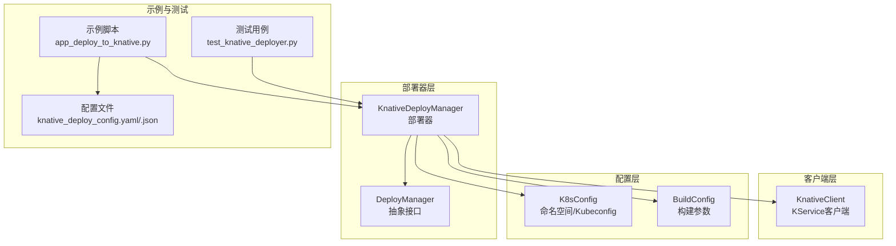
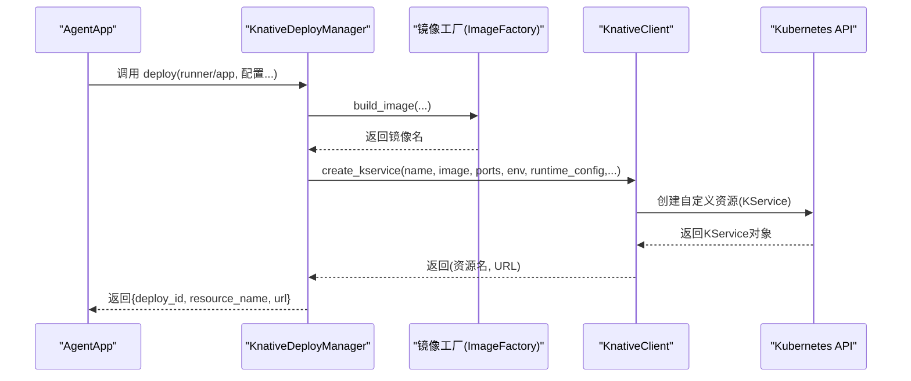
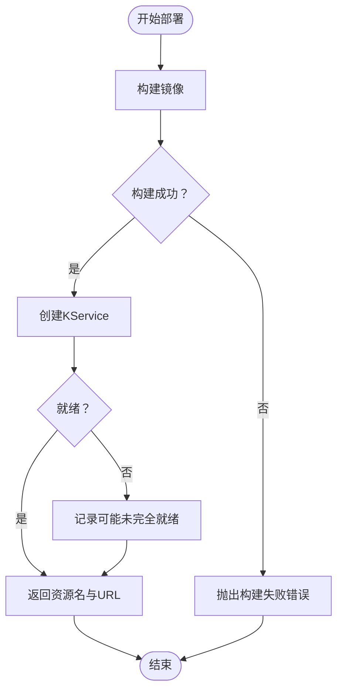
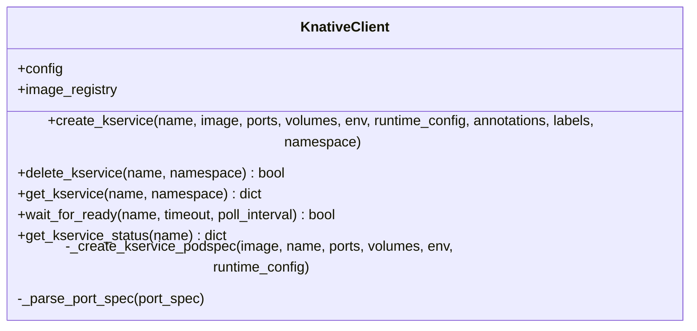
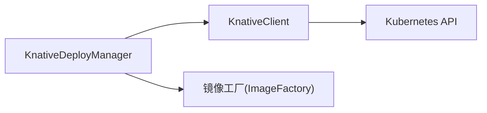

# Knative部署

<cite>
**本文引用的文件**
- [knative_deployer.py](file://src/agentscope_runtime/engine/deployers/knative_deployer.py)
- [knative_client.py](file://src/agentscope_runtime/common/container_clients/knative_client.py)
- [base.py](file://src/agentscope_runtime/engine/deployers/base.py)
- [knative_deploy_config.yaml](file://examples/deployments/knative_deploy/knative_deploy_config.yaml)
- [knative_deploy_config.json](file://examples/deployments/knative_deploy/knative_deploy_config.json)
- [app_deploy_to_knative.py](file://examples/deployments/knative_deploy/app_deploy_to_knative.py)
- [README.md（Knative示例）](file://examples/deployments/knative_deploy/README.md)
- [test_knative_deployer.py](file://tests/deploy/test_knative_deployer.py)
</cite>

## 目录
1. [简介](#简介)
2. [项目结构](#项目结构)
3. [核心组件](#核心组件)
4. [架构总览](#架构总览)
5. [详细组件分析](#详细组件分析)
6. [依赖分析](#依赖分析)
7. [性能考虑](#性能考虑)
8. [故障排查指南](#故障排查指南)
9. [结论](#结论)
10. [附录](#附录)

## 简介
本文件面向在Knative Serverless平台上部署AgentScope应用的用户与工程师，系统性阐述Kn进制部署模式的原理、优势与最佳实践。Knative通过KService资源实现Serverless风格的服务编排：按请求触发实例、自动扩缩容、空闲回收，从而实现“按需付费”。本文围绕Kn进制部署器（KnativeDeployManager）的实现机制展开，覆盖镜像构建、KService创建、资源状态管理、停止与清理、以及配置示例与运维建议。

## 项目结构
Knative部署能力由以下模块协同完成：
- 部署器入口：KnativeDeployManager（继承通用DeployManager接口）
- 客户端封装：KnativeClient（基于Kubernetes CustomObjects API操作KService）
- 配置模型：K8sConfig、BuildConfig（用于命名空间、kubeconfig、构建上下文等）
- 示例与测试：示例脚本、配置文件、单元测试

图表来源
- [knative_deployer.py:43-291](file://src/agentscope_runtime/engine/deployers/knative_deployer.py#L43-L291)
- [knative_client.py:15-468](file://src/agentscope_runtime/common/container_clients/knative_client.py#L15-L468)
- [base.py:9-44](file://src/agentscope_runtime/engine/deployers/base.py#L9-L44)
- [app_deploy_to_knative.py:123-328](file://examples/deployments/knative_deploy/app_deploy_to_knative.py#L123-L328)
- [knative_deploy_config.yaml:1-56](file://examples/deployments/knative_deploy/knative_deploy_config.yaml#L1-L56)
- [knative_deploy_config.json:1-42](file://examples/deployments/knative_deploy/knative_deploy_config.json#L1-L42)
- [test_knative_deployer.py:55-440](file://tests/deploy/test_knative_deployer.py#L55-L440)

章节来源
- [knative_deployer.py:43-291](file://src/agentscope_runtime/engine/deployers/knative_deployer.py#L43-L291)
- [knative_client.py:15-468](file://src/agentscope_runtime/common/container_clients/knative_client.py#L15-L468)
- [base.py:9-44](file://src/agentscope_runtime/engine/deployers/base.py#L9-L44)
- [app_deploy_to_knative.py:123-328](file://examples/deployments/knative_deploy/app_deploy_to_knative.py#L123-L328)
- [knative_deploy_config.yaml:1-56](file://examples/deployments/knative_deploy/knative_deploy_config.yaml#L1-L56)
- [knative_deploy_config.json:1-42](file://examples/deployments/knative_deploy/knative_deploy_config.json#L1-L42)
- [test_knative_deployer.py:55-440](file://tests/deploy/test_knative_deployer.py#L55-L440)

## 核心组件
- KnativeDeployManager：负责镜像构建、KService创建、状态记录与清理；对外暴露统一的异步部署与停止接口。
- KnativeClient：封装Kubernetes CustomObjects API，完成KService的创建、删除、就绪等待与状态查询。
- DeployManager：统一的部署器抽象接口，提供部署ID生成与状态管理契约。
- 配置模型：K8sConfig（命名空间、kubeconfig）、BuildConfig（构建上下文、超时、清理策略）。

章节来源
- [knative_deployer.py:43-291](file://src/agentscope_runtime/engine/deployers/knative_deployer.py#L43-L291)
- [knative_client.py:15-468](file://src/agentscope_runtime/common/container_clients/knative_client.py#L15-L468)
- [base.py:9-44](file://src/agentscope_runtime/engine/deployers/base.py#L9-L44)

## 架构总览
下图展示从应用到KService的完整部署流程：应用经由部署器调用镜像工厂构建容器镜像，随后通过Knative客户端创建KService，并等待就绪后返回访问URL与资源名。

图表来源
- [knative_deployer.py:71-222](file://src/agentscope_runtime/engine/deployers/knative_deployer.py#L71-L222)
- [knative_client.py:114-199](file://src/agentscope_runtime/common/container_clients/knative_client.py#L114-L199)

章节来源
- [knative_deployer.py:71-222](file://src/agentscope_runtime/engine/deployers/knative_deployer.py#L71-L222)
- [knative_client.py:114-199](file://src/agentscope_runtime/common/container_clients/knative_client.py#L114-L199)

## 详细组件分析

### KnativeDeployManager（部署器）
- 角色与职责
  - 统一部署入口：接收runner或app、协议适配器、依赖、环境变量、运行时配置等参数。
  - 镜像构建：委托镜像工厂构建并可选推送至镜像仓库。
  - KService创建：调用Knative客户端创建KService，支持端口、卷挂载、环境变量、资源限制、安全上下文等。
  - 状态与清理：记录已部署资源与镜像，提供停止接口删除KService并返回结果。
- 关键流程
  - 部署流程：镜像构建失败直接抛出错误；成功后创建KService并等待就绪，提取URL返回。
  - 停止流程：根据deploy_id推导资源名，调用删除接口，返回成功/失败与详情。
  - 状态查询：通过Knative客户端查询KService状态并汇总条件信息。

图表来源
- [knative_deployer.py:125-222](file://src/agentscope_runtime/engine/deployers/knative_deployer.py#L125-L222)
- [knative_client.py:402-437](file://src/agentscope_runtime/common/container_clients/knative_client.py#L402-L437)

章节来源
- [knative_deployer.py:71-291](file://src/agentscope_runtime/engine/deployers/knative_deployer.py#L71-L291)

### KnativeClient（KService客户端）
- 角色与职责
  - 初始化：加载kubeconfig或in-cluster配置，建立CustomObjects API与CoreV1 API客户端。
  - KService生命周期：创建、删除、查询、等待就绪、获取状态。
  - Pod模板构造：根据runtime_config组装容器资源、卷挂载、节点选择、容忍度、镜像拉取密钥等。
- 关键点
  - 支持多端口解析、环境变量注入、主机路径卷挂载。
  - 提供等待就绪与状态查询，便于上层部署器进行健康检查与可观测性。

图表来源
- [knative_client.py:15-468](file://src/agentscope_runtime/common/container_clients/knative_client.py#L15-L468)

章节来源
- [knative_client.py:114-468](file://src/agentscope_runtime/common/container_clients/knative_client.py#L114-L468)

### 配置模型与示例
- K8sConfig：命名空间与kubeconfig路径。
- BuildConfig：构建上下文目录、Dockerfile模板、构建/推送超时、是否清理。
- 示例配置文件：提供YAML与JSON两种格式，覆盖名称、端口、镜像名/标签、基础镜像、平台、依赖、额外包、环境变量、标签、运行时配置（资源、镜像拉取策略）、部署超时与健康检查等。

章节来源
- [knative_deployer.py:20-41](file://src/agentscope_runtime/engine/deployers/knative_deployer.py#L20-L41)
- [knative_deploy_config.yaml:1-56](file://examples/deployments/knative_deploy/knative_deploy_config.yaml#L1-L56)
- [knative_deploy_config.json:1-42](file://examples/deployments/knative_deploy/knative_deploy_config.json#L1-L42)

### 示例脚本与使用流程
- 示例脚本展示了如何：
  - 配置RegistryConfig与K8sConfig；
  - 构造runtime_config（资源、镜像拉取策略等）；
  - 组装KService配置（端口、镜像、依赖、环境变量、标签、平台、推送开关等）；
  - 调用AgentApp.deploy并通过部署器创建KService；
  - 输出部署结果、状态查询、健康检查与curl测试命令；
  - 清理阶段调用stop删除KService。

章节来源
- [app_deploy_to_knative.py:123-328](file://examples/deployments/knative_deploy/app_deploy_to_knative.py#L123-L328)
- [README.md（Knative示例）:170-225](file://examples/deployments/knative_deploy/README.md#L170-L225)

### 测试用例要点
- 验证K8sConfig与BuildConfig默认值；
- 验证部署器初始化与参数传递；
- 验证镜像构建失败、KService创建失败、仅传入app/runner、协议适配器传递、卷挂载传递、停止与状态查询等场景；
- 使用Mock确保不执行真实Kubernetes调用，聚焦行为验证。

章节来源
- [test_knative_deployer.py:23-440](file://tests/deploy/test_knative_deployer.py#L23-L440)

## 依赖分析
- 组件耦合
  - KnativeDeployManager依赖KnativeClient进行KService操作，依赖镜像工厂进行镜像构建与推送。
  - KnativeClient依赖Kubernetes SDK（CustomObjects API）与CoreV1 API。
- 外部依赖
  - Kubernetes集群与Knative Serving安装；
  - 容器镜像仓库（需配置RegistryConfig）；
  - 可选：卷挂载、节点选择、容忍度、镜像拉取密钥等高级运行时配置。

图表来源
- [knative_deployer.py:66-69](file://src/agentscope_runtime/engine/deployers/knative_deployer.py#L66-L69)
- [knative_client.py:43-48](file://src/agentscope_runtime/common/container_clients/knative_client.py#L43-L48)

章节来源
- [knative_deployer.py:66-69](file://src/agentscope_runtime/engine/deployers/knative_deployer.py#L66-L69)
- [knative_client.py:43-48](file://src/agentscope_runtime/common/container_clients/knative_client.py#L43-L48)

## 性能考虑
- 自动扩缩容与按需付费
  - Knative通过KService实现“零下限”弹性：请求到达时按需启动实例，空闲回收，显著降低闲置成本。
- 资源与冷启动
  - 合理设置runtime_config中的requests/limits，避免频繁驱逐与扩缩容抖动。
  - 首次请求冷启动时间受镜像大小、依赖安装与应用初始化影响，可通过预热策略与镜像优化缓解。
- 网络与路由
  - 通过Gateway与域名访问服务，建议结合Ingress/网关TLS与WAF策略保障安全与稳定性。
- 日志与追踪
  - 结合平台日志与追踪能力，定位慢请求与异常路径，持续优化模型调用与工具链。

## 故障排查指南
- 常见问题
  - 镜像仓库认证：确认已登录镜像仓库，或配置镜像拉取密钥。
  - 权限不足：确认对目标命名空间具有创建/删除KService的权限。
  - 资源配额：检查节点资源与命名空间配额，避免启动失败。
  - 图像拉取失败：查看Pod事件与镜像标签正确性。
- 排查步骤
  - 查看KService状态与条件：kubectl get ksvc -n <namespace>；kubectl describe ksvc <name> -n <namespace>。
  - 查看Pod状态与事件：kubectl get pods -l app=<label> -n <namespace>；kubectl describe pod <pod-name> -n <namespace>。
  - 查看日志：kubectl logs <pod-name> -n <namespace>。
- 示例脚本提供的测试命令
  - 健康检查、同步/异步端点、流式端点测试，便于快速验证服务可用性。

章节来源
- [README.md（Knative示例）:227-257](file://examples/deployments/knative_deploy/README.md#L227-L257)
- [app_deploy_to_knative.py:234-301](file://examples/deployments/knative_deploy/app_deploy_to_knative.py#L234-L301)

## 结论
Knative部署模式以KService为核心，结合镜像工厂与Kubernetes API，实现了从应用到Serverless服务的自动化交付。通过合理的资源配置、镜像优化与运维监控，可在保证性能的同时实现弹性伸缩与按需付费。示例与测试用例提供了可复用的配置模板与验证路径，便于在生产环境中落地。

## 附录

### 配置项速览（示例）
- 基础配置
  - 名称、命名空间、端口、镜像名/标签、基础镜像、平台、推送开关
- 依赖与环境
  - requirements、extra_packages、environment
- 运行时配置
  - resources.requests/limits、image_pull_policy、node_selector、tolerations、镜像拉取密钥等
- 部署与健康
  - deploy_timeout、health_check

章节来源
- [knative_deploy_config.yaml:4-56](file://examples/deployments/knative_deploy/knative_deploy_config.yaml#L4-L56)
- [knative_deploy_config.json:2-41](file://examples/deployments/knative_deploy/knative_deploy_config.json#L2-L41)

### 使用流程清单
- 准备工作：集群与Knative、镜像仓库、API密钥、kubeconfig
- 编写/调整配置：参考示例配置文件
- 执行部署：运行示例脚本或通过CLI参数化部署
- 验证与监控：使用curl命令与kubectl查看状态
- 清理：调用stop或手动删除KService

章节来源
- [README.md（Knative示例）:170-225](file://examples/deployments/knative_deploy/README.md#L170-L225)
- [app_deploy_to_knative.py:226-328](file://examples/deployments/knative_deploy/app_deploy_to_knative.py#L226-L328)