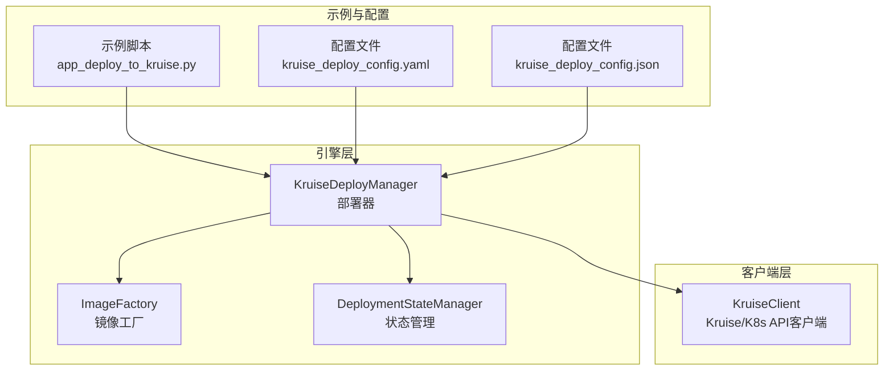
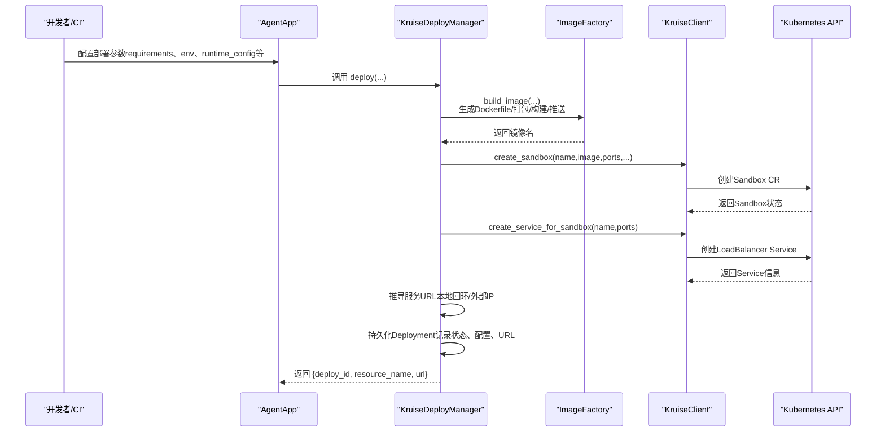
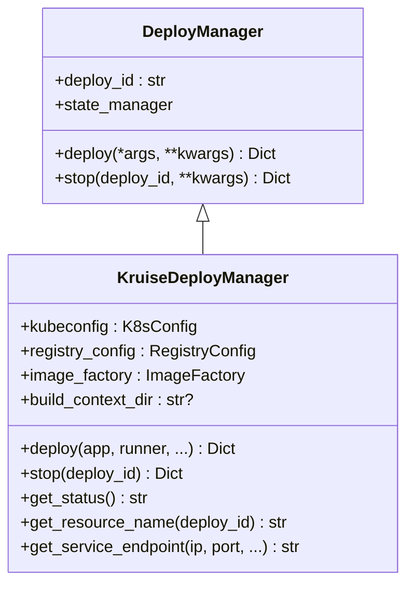
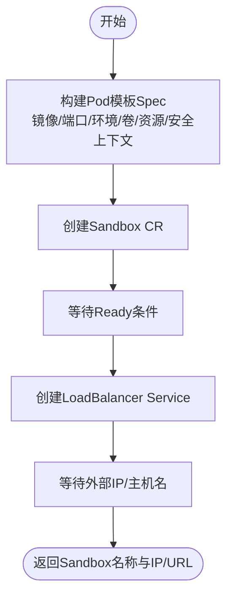
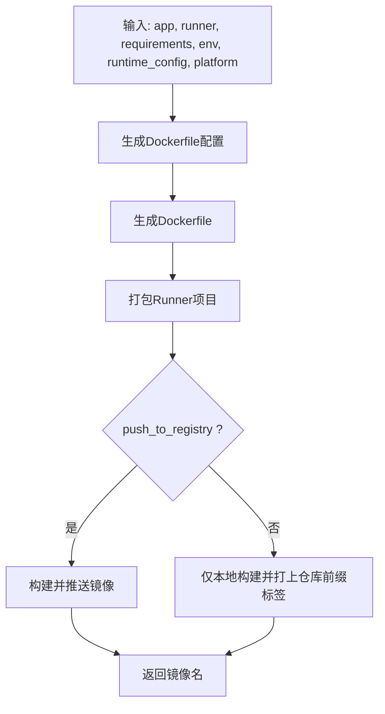
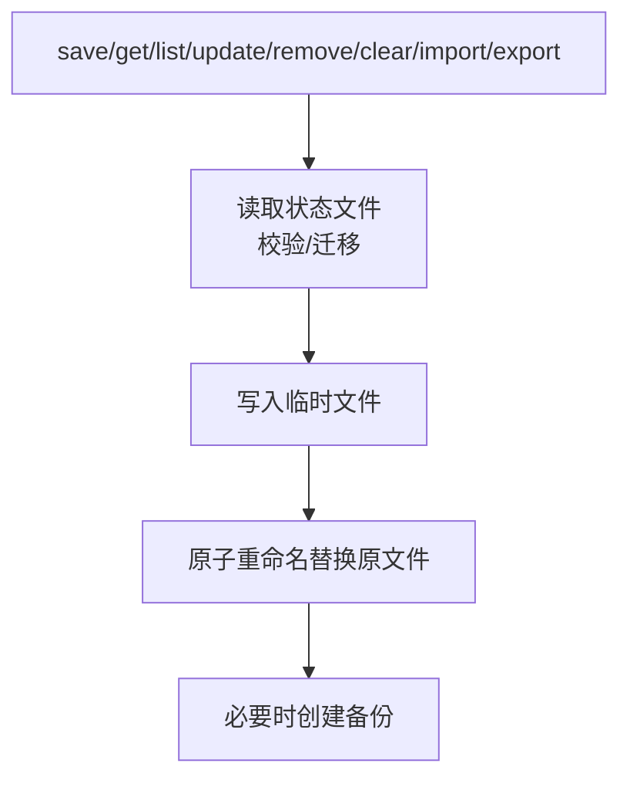
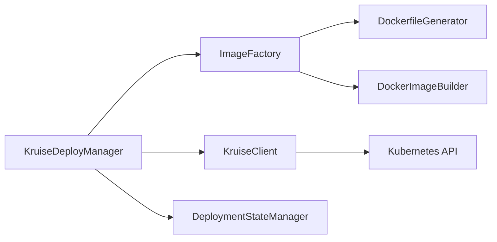

# Kruise部署

<cite>
**本文引用的文件**
- [kruise_deployer.py](file://src/agentscope_runtime/engine/deployers/kruise_deployer.py)
- [kruise_client.py](file://src/agentscope_runtime/common/container_clients/kruise_client.py)
- [image_factory.py](file://src/agentscope_runtime/engine/deployers/utils/docker_image_utils/image_factory.py)
- [base.py](file://src/agentscope_runtime/engine/deployers/base.py)
- [manager.py](file://src/agentscope_runtime/engine/deployers/state/manager.py)
- [schema.py](file://src/agentscope_runtime/engine/deployers/state/schema.py)
- [app_deploy_to_kruise.py](file://examples/deployments/kruise_deploy/app_deploy_to_kruise.py)
- [kruise_deploy_config.yaml](file://examples/deployments/kruise_deploy/kruise_deploy_config.yaml)
- [kruise_deploy_config.json](file://examples/deployments/kruise_deploy/kruise_deploy_config.json)
- [advanced_deployment.md（英文）](file://cookbook/en/advanced_deployment.md)
- [advanced_deployment.md（中文）](file://cookbook/zh/advanced_deployment.md)
- [test_kruise_deployer.py](file://tests/deploy/test_kruise_deployer.py)
</cite>

## 目录
1. [简介](#简介)
2. [项目结构](#项目结构)
3. [核心组件](#核心组件)
4. [架构总览](#架构总览)
5. [详细组件分析](#详细组件分析)
6. [依赖关系分析](#依赖关系分析)
7. [性能与弹性](#性能与弹性)
8. [故障排查与运维](#故障排查与运维)
9. [结论](#结论)
10. [附录：配置与示例](#附录配置与示例)

## 简介
本章节面向需要在Kubernetes上以“实例级隔离、可暂停/恢复、多租户安全运行环境”为目标的高级部署场景，系统性阐述Kruise平台的部署能力与最佳实践。重点覆盖：
- 基于Kruise Sandbox CRD的自定义资源部署
- 容器镜像构建与推送、服务暴露与端点选择
- 部署状态持久化与生命周期管理
- 与Kubernetes生态的对接（Service、LoadBalancer、Ingress等）
- 可扩展的配置体系（环境变量、资源限制、镜像仓库、平台架构）

同时，结合示例工程与配置文件，给出从本地开发到生产集群的完整落地路径。

## 项目结构
围绕Kruise部署的相关模块分布如下：
- 引擎层部署器：负责编排镜像构建、Kruise资源创建、服务暴露与状态管理
- 客户端层：封装Kubernetes与Kruise API交互，完成Sandbox CR与Service的创建/查询/删除
- 工具层：镜像工厂负责生成Dockerfile、打包应用、构建/推送镜像
- 状态层：持久化部署元数据，支持查询、更新状态、清理备份
- 示例与配置：演示如何通过代码或配置文件进行部署，并提供YAML/JSON样例

图表来源
- [kruise_deployer.py:37-434](file://src/agentscope_runtime/engine/deployers/kruise_deployer.py#L37-L434)
- [kruise_client.py:22-623](file://src/agentscope_runtime/common/container_clients/kruise_client.py#L22-L623)
- [image_factory.py:67-400](file://src/agentscope_runtime/engine/deployers/utils/docker_image_utils/image_factory.py#L67-L400)
- [manager.py:17-389](file://src/agentscope_runtime/engine/deployers/state/manager.py#L17-L389)
- [app_deploy_to_kruise.py:119-377](file://examples/deployments/kruise_deploy/app_deploy_to_kruise.py#L119-L377)
- [kruise_deploy_config.yaml:1-59](file://examples/deployments/kruise_deploy/kruise_deploy_config.yaml#L1-L59)
- [kruise_deploy_config.json:1-40](file://examples/deployments/kruise_deploy/kruise_deploy_config.json#L1-L40)

章节来源
- [kruise_deployer.py:37-434](file://src/agentscope_runtime/engine/deployers/kruise_deployer.py#L37-L434)
- [kruise_client.py:22-623](file://src/agentscope_runtime/common/container_clients/kruise_client.py#L22-L623)
- [image_factory.py:67-400](file://src/agentscope_runtime/engine/deployers/utils/docker_image_utils/image_factory.py#L67-L400)
- [manager.py:17-389](file://src/agentscope_runtime/engine/deployers/state/manager.py#L17-L389)
- [app_deploy_to_kruise.py:119-377](file://examples/deployments/kruise_deploy/app_deploy_to_kruise.py#L119-L377)
- [kruise_deploy_config.yaml:1-59](file://examples/deployments/kruise_deploy/kruise_deploy_config.yaml#L1-L59)
- [kruise_deploy_config.json:1-40](file://examples/deployments/kruise_deploy/kruise_deploy_config.json#L1-L40)

## 核心组件
- KruiseDeployManager：部署器入口，协调镜像构建、Sandbox创建、Service创建与URL推导、状态持久化
- KruiseClient：Kubernetes/Kruise API客户端，负责Sandbox CR与Service的创建、查询、删除与就绪等待
- ImageFactory：镜像工厂，生成Dockerfile、打包应用、构建/推送容器镜像
- DeploymentStateManager：部署状态管理，持久化部署元数据，支持查询、更新状态、导入导出与备份清理
- 配置与示例：提供YAML/JSON配置样例与Python脚本示例，便于快速上手

章节来源
- [kruise_deployer.py:37-434](file://src/agentscope_runtime/engine/deployers/kruise_deployer.py#L37-L434)
- [kruise_client.py:22-623](file://src/agentscope_runtime/common/container_clients/kruise_client.py#L22-L623)
- [image_factory.py:67-400](file://src/agentscope_runtime/engine/deployers/utils/docker_image_utils/image_factory.py#L67-L400)
- [manager.py:17-389](file://src/agentscope_runtime/engine/deployers/state/manager.py#L17-L389)
- [schema.py:9-97](file://src/agentscope_runtime/engine/deployers/state/schema.py#L9-L97)
- [app_deploy_to_kruise.py:119-377](file://examples/deployments/kruise_deploy/app_deploy_to_kruise.py#L119-L377)
- [kruise_deploy_config.yaml:1-59](file://examples/deployments/kruise_deploy/kruise_deploy_config.yaml#L1-L59)
- [kruise_deploy_config.json:1-40](file://examples/deployments/kruise_deploy/kruise_deploy_config.json#L1-L40)

## 架构总览
下图展示Kruise部署的端到端流程：从应用打包、镜像构建/推送，到Sandbox CR与Service创建，再到URL推导与状态持久化。

图表来源
- [kruise_deployer.py:138-348](file://src/agentscope_runtime/engine/deployers/kruise_deployer.py#L138-L348)
- [kruise_client.py:84-174](file://src/agentscope_runtime/common/container_clients/kruise_client.py#L84-L174)
- [image_factory.py:298-384](file://src/agentscope_runtime/engine/deployers/utils/docker_image_utils/image_factory.py#L298-L384)
- [manager.py:232-241](file://src/agentscope_runtime/engine/deployers/state/manager.py#L232-L241)

章节来源
- [kruise_deployer.py:138-348](file://src/agentscope_runtime/engine/deployers/kruise_deployer.py#L138-L348)
- [kruise_client.py:84-174](file://src/agentscope_runtime/common/container_clients/kruise_client.py#L84-L174)
- [image_factory.py:298-384](file://src/agentscope_runtime/engine/deployers/utils/docker_image_utils/image_factory.py#L298-L384)
- [manager.py:232-241](file://src/agentscope_runtime/engine/deployers/state/manager.py#L232-L241)

## 详细组件分析

### KruiseDeployManager（部署器）
职责与关键点：
- 统一入口：接收应用、Runner、端点、协议适配器、依赖、环境变量、运行时配置等参数
- 镜像构建：委托ImageFactory完成Dockerfile生成、打包、构建/推送
- Sandbox创建：调用KruiseClient创建agents.kruise.io/v1alpha1类型的Sandbox CR
- Service创建：为Sandbox创建LoadBalancer Service，自动解析外部IP或回环地址
- URL推导：根据环境（本地/云）自动选择合适的访问端点
- 状态持久化：保存部署ID、平台、URL、状态、配置等信息

图表来源
- [base.py:9-44](file://src/agentscope_runtime/engine/deployers/base.py#L9-L44)
- [kruise_deployer.py:37-434](file://src/agentscope_runtime/engine/deployers/kruise_deployer.py#L37-L434)

章节来源
- [kruise_deployer.py:37-434](file://src/agentscope_runtime/engine/deployers/kruise_deployer.py#L37-L434)
- [base.py:9-44](file://src/agentscope_runtime/engine/deployers/base.py#L9-L44)

### KruiseClient（K8s/Kruise API客户端）
职责与关键点：
- 初始化：支持kubeconfig/in-cluster两种方式，校验连接可用性
- Sandbox创建：构造Pod模板Spec，填充镜像、端口、环境变量、卷挂载、资源限制、安全上下文等
- Service创建：基于标签选择器app=<name>创建LoadBalancer Service
- 就绪等待：轮询Sandbox状态，直到Ready条件满足
- 查询/删除：支持按名称查询Sandbox状态、删除Sandbox与关联Service

图表来源
- [kruise_client.py:84-174](file://src/agentscope_runtime/common/container_clients/kruise_client.py#L84-L174)
- [kruise_client.py:436-514](file://src/agentscope_runtime/common/container_clients/kruise_client.py#L436-L514)
- [kruise_client.py:399-434](file://src/agentscope_runtime/common/container_clients/kruise_client.py#L399-L434)

章节来源
- [kruise_client.py:84-174](file://src/agentscope_runtime/common/container_clients/kruise_client.py#L84-L174)
- [kruise_client.py:436-514](file://src/agentscope_runtime/common/container_clients/kruise_client.py#L436-L514)
- [kruise_client.py:399-434](file://src/agentscope_runtime/common/container_clients/kruise_client.py#L399-L434)

### ImageFactory（镜像工厂）
职责与关键点：
- 生成Dockerfile：基于基础镜像、端口、环境变量、启动命令、平台等
- 打包应用：使用detached_app逻辑打包Runner项目与额外文件
- 构建/推送：支持本地构建与推送至镜像仓库，支持缓存与平台指定
- 启动命令：生成容器启动参数（host/port/嵌入任务处理器/附加参数）

图表来源
- [image_factory.py:298-384](file://src/agentscope_runtime/engine/deployers/utils/docker_image_utils/image_factory.py#L298-L384)
- [image_factory.py:170-293](file://src/agentscope_runtime/engine/deployers/utils/docker_image_utils/image_factory.py#L170-L293)

章节来源
- [image_factory.py:67-400](file://src/agentscope_runtime/engine/deployers/utils/docker_image_utils/image_factory.py#L67-L400)

### DeploymentStateManager（部署状态管理）
职责与关键点：
- 文件存储：默认位于用户目录~/.agentscope-runtime/deployments.json
- 备份策略：修改前自动备份，按日保留，超过30天清理旧备份
- 数据校验与迁移：读取时进行结构校验与版本迁移
- 原子写入：临时文件+原子重命名，避免部分写入
- 操作接口：保存、查询、列表过滤、更新状态、删除、清空、导入导出

图表来源
- [manager.py:89-231](file://src/agentscope_runtime/engine/deployers/state/manager.py#L89-L231)
- [schema.py:37-97](file://src/agentscope_runtime/engine/deployers/state/schema.py#L37-L97)

章节来源
- [manager.py:17-389](file://src/agentscope_runtime/engine/deployers/state/manager.py#L17-L389)
- [schema.py:9-97](file://src/agentscope_runtime/engine/deployers/state/schema.py#L9-L97)

## 依赖关系分析
- KruiseDeployManager依赖：
  - ImageFactory：用于镜像构建/推送
  - KruiseClient：用于Sandbox与Service的创建/查询/删除
  - DeploymentStateManager：用于持久化部署元数据
- KruiseClient依赖：
  - Kubernetes Python SDK（CustomObjectsApi/CoreV1Api）
  - Kruise Sandbox CRD常量（agents.kruise.io/v1alpha1）
- ImageFactory依赖：
  - DockerfileGenerator/DockerImageBuilder
  - 打包(detached_app)与Runner运行时

图表来源
- [kruise_deployer.py:77-80](file://src/agentscope_runtime/engine/deployers/kruise_deployer.py#L77-L80)
- [kruise_client.py:68-70](file://src/agentscope_runtime/common/container_clients/kruise_client.py#L68-L70)
- [image_factory.py:12-18](file://src/agentscope_runtime/engine/deployers/utils/docker_image_utils/image_factory.py#L12-L18)

章节来源
- [kruise_deployer.py:77-80](file://src/agentscope_runtime/engine/deployers/kruise_deployer.py#L77-L80)
- [kruise_client.py:68-70](file://src/agentscope_runtime/common/container_clients/kruise_client.py#L68-L70)
- [image_factory.py:12-18](file://src/agentscope_runtime/engine/deployers/utils/docker_image_utils/image_factory.py#L12-L18)

## 性能与弹性
- 镜像构建缓存：ImageFactory支持缓存与增量构建，减少重复构建时间
- 平台指定：支持多平台镜像构建（如linux/amd64），提升跨节点兼容性
- 资源限制：通过runtime_config传入requests/limits，配合K8s调度与HPA
- 自动扩缩容：Kruise Sandbox本身具备实例级隔离与弹性能力，结合K8s Service实现流量分发
- 就绪探测：KruiseClient等待Ready条件，确保服务可用后再对外暴露

章节来源
- [image_factory.py:254-287](file://src/agentscope_runtime/engine/deployers/utils/docker_image_utils/image_factory.py#L254-L287)
- [kruise_client.py:399-434](file://src/agentscope_runtime/common/container_clients/kruise_client.py#L399-L434)
- [kruise_deployer.py:286-309](file://src/agentscope_runtime/engine/deployers/kruise_deployer.py#L286-L309)

## 故障排查与运维
常见问题与处理建议：
- Kubernetes连接失败
  - 确认kubeconfig路径正确或处于in-cluster环境
  - 检查RBAC权限与集群连通性
- Sandbox未就绪
  - 查看Sandbox状态与Conditions，确认镜像拉取、端口暴露、资源限制是否合理
  - 使用get_sandbox_status获取详细状态
- Service未分配外部IP
  - 等待LoadBalancer分配或检查云厂商LB策略
  - 若为本地环境，回退到NodePort或Ingress
- 镜像构建失败
  - 检查requirements与extra_packages路径
  - 确认镜像仓库凭证与网络可达
- 状态文件损坏
  - 使用导入/导出功能备份与恢复
  - 清理后重建状态（谨慎操作）

章节来源
- [kruise_client.py:54-82](file://src/agentscope_runtime/common/container_clients/kruise_client.py#L54-L82)
- [kruise_client.py:589-622](file://src/agentscope_runtime/common/container_clients/kruise_client.py#L589-L622)
- [manager.py:352-389](file://src/agentscope_runtime/engine/deployers/state/manager.py#L352-L389)
- [test_kruise_deployer.py:556-593](file://tests/deploy/test_kruise_deployer.py#L556-L593)

## 结论
Kruise部署模式通过“Sandbox CR + Service”的组合，在Kubernetes上实现了实例级隔离、可暂停/恢复与安全多租户运行环境。结合镜像工厂、状态管理与K8s/Kruise API客户端，形成从应用打包到服务上线的闭环。配合资源限制、平台指定与就绪等待，能够稳定支撑灰度发布、弹性伸缩与网格治理等高级能力。

## 附录：配置与示例

### 示例脚本与配置
- 示例脚本：演示如何通过AgentApp调用KruiseDeployManager进行部署，包含镜像构建、Sandbox创建、Service创建、URL推导与状态持久化
- YAML配置：提供name、namespace、port、image_name、image_tag、base_image、platform、requirements、environment、labels、annotations、runtime_config、deploy_timeout、health_check等字段
- JSON配置：与YAML等价的键值对形式，便于程序化生成与CI集成

章节来源
- [app_deploy_to_kruise.py:119-377](file://examples/deployments/kruise_deploy/app_deploy_to_kruise.py#L119-L377)
- [kruise_deploy_config.yaml:1-59](file://examples/deployments/kruise_deploy/kruise_deploy_config.yaml#L1-L59)
- [kruise_deploy_config.json:1-40](file://examples/deployments/kruise_deploy/kruise_deploy_config.json#L1-L40)

### 部署前置条件与最佳实践
- 确保Docker可用、kubectl可访问集群、镜像仓库可登录
- 确认Kruise Sandbox CRD已安装（agents.kruise.io/v1alpha1）
- 在生产中启用push_to_registry并将镜像推送到私有/公有仓库
- 使用runtime_config配置资源请求/限制与imagePullPolicy
- 使用labels自动添加app标签以匹配Service选择器

章节来源
- [advanced_deployment.md（英文）:1237-1252](file://cookbook/en/advanced_deployment.md#L1237-L1252)
- [advanced_deployment.md（英文）:1254-1316](file://cookbook/en/advanced_deployment.md#L1254-L1316)
- [advanced_deployment.md（中文）:1237-1252](file://cookbook/zh/advanced_deployment.md#L1237-L1252)
- [advanced_deployment.md（中文）:1251-1313](file://cookbook/zh/advanced_deployment.md#L1251-L1313)