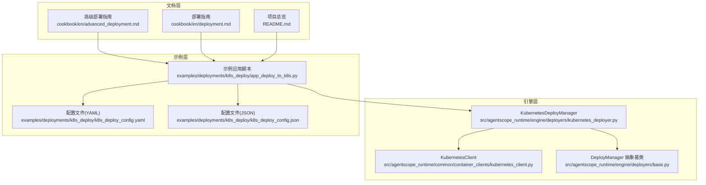
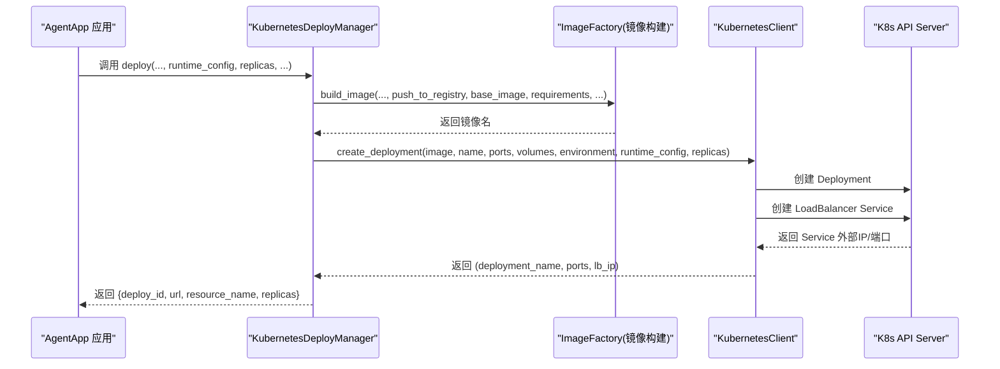
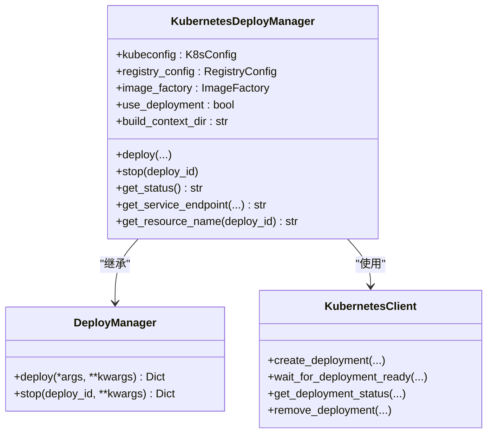
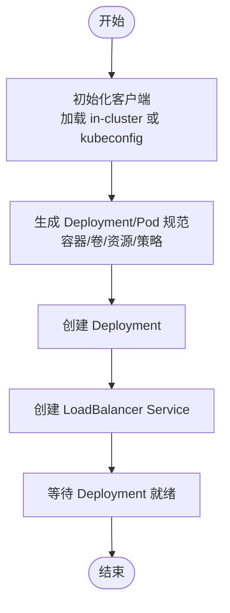
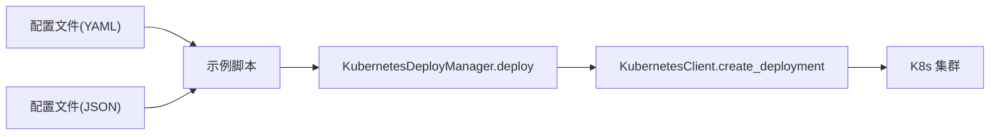
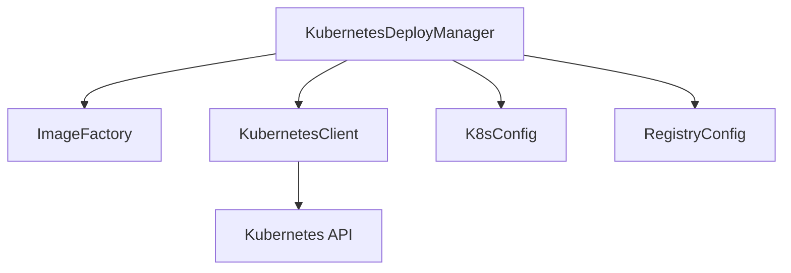

# Kubernetes部署

<cite>
**本文引用的文件**
- [kubernetes_deployer.py](file://src/agentscope_runtime/engine/deployers/kubernetes_deployer.py)
- [kubernetes_client.py](file://src/agentscope_runtime/common/container_clients/kubernetes_client.py)
- [app_deploy_to_k8s.py](file://examples/deployments/k8s_deploy/app_deploy_to_k8s.py)
- [k8s_deploy_config.yaml](file://examples/deployments/k8s_deploy/k8s_deploy_config.yaml)
- [k8s_deploy_config.json](file://examples/deployments/k8s_deploy/k8s_deploy_config.json)
- [base.py](file://src/agentscope_runtime/engine/deployers/base.py)
- [advanced_deployment.md](file://cookbook/en/advanced_deployment.md)
- [deployment.md](file://cookbook/en/deployment.md)
- [README.md](file://README.md)
</cite>

## 目录
1. [简介](#简介)
2. [项目结构](#项目结构)
3. [核心组件](#核心组件)
4. [架构总览](#架构总览)
5. [详细组件分析](#详细组件分析)
6. [依赖分析](#依赖分析)
7. [性能考虑](#性能考虑)
8. [故障排除指南](#故障排除指南)
9. [结论](#结论)
10. [附录](#附录)

## 简介
本章节面向在Kubernetes上部署Agent应用的工程实践，系统性阐述Kubernetes部署器的架构与实现原理，覆盖Pod管理、Service配置、Ingress设置、命名空间管理、资源限制与自动扩缩容机制，并提供从配置文件到集群部署的完整流程，以及集群环境准备、权限配置与网络策略建议。同时给出监控、日志收集与故障排除的最佳实践。

## 项目结构
围绕Kubernetes部署的相关代码与示例主要分布在以下位置：
- 引擎层：Kubernetes部署器与Kubernetes客户端封装
- 示例层：Kubernetes部署示例脚本与配置文件（YAML/JSON）
- 文档层：高级部署与部署指南文档

**图表来源**
- [kubernetes_deployer.py](file://src/agentscope_runtime/engine/deployers/kubernetes_deployer.py)
- [kubernetes_client.py](file://src/agentscope_runtime/common/container_clients/kubernetes_client.py)
- [base.py](file://src/agentscope_runtime/engine/deployers/base.py)
- [app_deploy_to_k8s.py](file://examples/deployments/k8s_deploy/app_deploy_to_k8s.py)
- [k8s_deploy_config.yaml](file://examples/deployments/k8s_deploy/k8s_deploy_config.yaml)
- [k8s_deploy_config.json](file://examples/deployments/k8s_deploy/k8s_deploy_config.json)
- [advanced_deployment.md](file://cookbook/en/advanced_deployment.md)
- [deployment.md](file://cookbook/en/deployment.md)
- [README.md](file://README.md)

**章节来源**
- [kubernetes_deployer.py](file://src/agentscope_runtime/engine/deployers/kubernetes_deployer.py)
- [kubernetes_client.py](file://src/agentscope_runtime/common/container_clients/kubernetes_client.py)
- [app_deploy_to_k8s.py](file://examples/deployments/k8s_deploy/app_deploy_to_k8s.py)
- [k8s_deploy_config.yaml](file://examples/deployments/k8s_deploy/k8s_deploy_config.yaml)
- [k8s_deploy_config.json](file://examples/deployments/k8s_deploy/k8s_deploy_config.json)
- [advanced_deployment.md](file://cookbook/en/advanced_deployment.md)
- [deployment.md](file://cookbook/en/deployment.md)
- [README.md](file://README.md)

## 核心组件
- KubernetesDeployManager：负责构建镜像、创建Deployment与Service、生成访问URL、查询状态与清理。
- KubernetesClient：对K8s API的封装，负责Deployment创建、Service创建、状态查询、日志拉取、等待就绪等。
- 配置模型：K8sConfig、RegistryConfig、BuildConfig等，用于描述命名空间、kubeconfig路径、镜像仓库、构建参数等。
- 部署基类：DeployManager抽象接口，统一不同平台的部署/停止/状态查询能力。

关键职责与交互：
- 应用通过AgentApp定义业务逻辑，调用deploy方法传入KubernetesDeployManager。
- KubernetesDeployManager协调镜像构建与推送、调用KubernetesClient创建Deployment与Service。
- 服务端点根据集群类型自动选择合适的访问地址（本地回环或外部IP）。
- 支持健康检查、资源限制、重启策略、节点选择、容忍度、镜像拉取密钥等运行时配置。

**章节来源**
- [kubernetes_deployer.py](file://src/agentscope_runtime/engine/deployers/kubernetes_deployer.py)
- [kubernetes_client.py](file://src/agentscope_runtime/common/container_clients/kubernetes_client.py)
- [base.py](file://src/agentscope_runtime/engine/deployers/base.py)

## 架构总览
下图展示从应用到Kubernetes集群的部署全链路：

**图表来源**
- [kubernetes_deployer.py](file://src/agentscope_runtime/engine/deployers/kubernetes_deployer.py)
- [kubernetes_client.py](file://src/agentscope_runtime/common/container_clients/kubernetes_client.py)

## 详细组件分析

### KubernetesDeployManager 组件
- 角色定位：Kubernetes平台的部署编排器，负责镜像构建、Deployment与Service创建、端点URL生成、状态查询与清理。
- 关键方法：
  - deploy：接收应用与运行时参数，完成镜像构建与K8s资源创建，返回部署结果。
  - stop：删除Deployment及相关Service，更新状态。
  - get_status：基于状态管理器与K8s客户端查询部署状态。
  - get_service_endpoint：根据是否本地集群自动选择访问端点。
  - get_resource_name：生成资源名称前缀。
- 运行时配置支持：资源请求/限制、镜像拉取策略、重启策略、节点选择、容忍度、镜像拉取密钥等。

**图表来源**
- [kubernetes_deployer.py](file://src/agentscope_runtime/engine/deployers/kubernetes_deployer.py)
- [base.py](file://src/agentscope_runtime/engine/deployers/base.py)
- [kubernetes_client.py](file://src/agentscope_runtime/common/container_clients/kubernetes_client.py)

**章节来源**
- [kubernetes_deployer.py](file://src/agentscope_runtime/engine/deployers/kubernetes_deployer.py)

### KubernetesClient 组件
- 角色定位：K8s API客户端封装，屏蔽底层API细节。
- 主要能力：
  - 初始化：优先加载in-cluster config，否则回退到kubeconfig。
  - Pod/Deployment创建：生成容器规范、卷挂载、资源限制、安全上下文等。
  - Service创建：支持多端口、LoadBalancer类型。
  - 状态查询：等待Deployment就绪、读取状态信息。
  - 日志与运维：读取Pod日志、列出Pod/Deployment、删除资源。
  - 本地集群识别：根据当前context判断是否本地集群，影响端点选择与行为。

**图表来源**
- [kubernetes_client.py](file://src/agentscope_runtime/common/container_clients/kubernetes_client.py)

**章节来源**
- [kubernetes_client.py](file://src/agentscope_runtime/common/container_clients/kubernetes_client.py)

### 配置文件与示例
- YAML/JSON配置文件：定义应用名称、命名空间、副本数、端口、镜像名/标签、基础镜像、平台、依赖、环境变量、运行时配置（资源、镜像拉取策略）、超时与健康检查等。
- 示例脚本：演示如何实例化KubernetesDeployManager、配置Registry与K8s连接、执行部署、测试服务、打印kubectl命令、清理资源。

**图表来源**
- [app_deploy_to_k8s.py](file://examples/deployments/k8s_deploy/app_deploy_to_k8s.py)
- [k8s_deploy_config.yaml](file://examples/deployments/k8s_deploy/k8s_deploy_config.yaml)
- [k8s_deploy_config.json](file://examples/deployments/k8s_deploy/k8s_deploy_config.json)
- [kubernetes_client.py](file://src/agentscope_runtime/common/container_clients/kubernetes_client.py)

**章节来源**
- [app_deploy_to_k8s.py](file://examples/deployments/k8s_deploy/app_deploy_to_k8s.py)
- [k8s_deploy_config.yaml](file://examples/deployments/k8s_deploy/k8s_deploy_config.yaml)
- [k8s_deploy_config.json](file://examples/deployments/k8s_deploy/k8s_deploy_config.json)

## 依赖分析
- 平台抽象：DeployManager作为统一接口，KubernetesDeployManager实现具体平台逻辑。
- 客户端依赖：KubernetesClient依赖官方Python SDK，负责与K8s API交互。
- 镜像构建：通过ImageFactory完成镜像构建与可选推送，支持缓存与自定义构建上下文。
- 配置耦合：K8sConfig与RegistryConfig分别控制命名空间、kubeconfig路径与镜像仓库，二者共同决定最终镜像拉取地址。

**图表来源**
- [kubernetes_deployer.py](file://src/agentscope_runtime/engine/deployers/kubernetes_deployer.py)
- [kubernetes_client.py](file://src/agentscope_runtime/common/container_clients/kubernetes_client.py)

**章节来源**
- [kubernetes_deployer.py](file://src/agentscope_runtime/engine/deployers/kubernetes_deployer.py)
- [kubernetes_client.py](file://src/agentscope_runtime/common/container_clients/kubernetes_client.py)

## 性能考虑
- 资源配额：合理设置requests/limits，避免抢占与OOM；结合HPA进行弹性伸缩。
- 镜像构建：启用构建缓存、使用多阶段构建减少镜像体积、选择合适的基础镜像。
- 网络与存储：尽量使用内网域名访问，减少跨节点流量；持久化数据使用PVC与合适的存储类。
- 健康检查：启用liveness/readiness探针，缩短故障恢复时间。
- 日志与追踪：集中化日志采集与指标上报，避免在容器内写磁盘，使用stdout/stderr输出。

## 故障排除指南
常见问题与排查要点：
- 集群连接失败：确认kubeconfig路径正确、in-cluster配置可用、网络可达。
- 镜像拉取失败：检查镜像仓库URL与命名空间、镜像拉取密钥配置、网络连通性。
- Deployment未就绪：查看Pod事件与日志，确认资源限制是否过低、启动命令是否异常。
- Service不可达：确认Service类型与端口映射、Ingress规则、网络策略放行。
- 本地回环访问异常：本地集群（如Minikube/Kind）会自动回退到127.0.0.1，需使用kubectl port-forward或NodePort。

操作建议：
- 使用kubectl describe与kubectl logs定位问题。
- 在示例脚本中打印kubectl命令，便于快速验证。
- 合理设置deploy_timeout与health_check，提升可观测性。

**章节来源**
- [kubernetes_client.py](file://src/agentscope_runtime/common/container_clients/kubernetes_client.py)
- [app_deploy_to_k8s.py](file://examples/deployments/k8s_deploy/app_deploy_to_k8s.py)

## 结论
Kubernetes部署器以DeployManager为抽象，KubernetesDeployManager为实现，结合KubernetesClient完成从镜像构建到资源创建的全链路部署。通过配置文件与示例脚本，用户可以快速完成从本地开发到生产集群的部署迁移。配合合理的资源限制、健康检查与监控体系，可在保证稳定性的同时获得良好的弹性与可维护性。

## 附录

### Kubernetes部署配置文件格式说明
- 基础字段：name、namespace、replicas、port、image_name、image_tag、base_image、platform、push_to_registry。
- 依赖与环境：requirements、extra_packages、environment。
- 运行时配置：runtime_config.resources.requests/limits、image_pull_policy、restart_policy、node_selector、tolerations、image_pull_secrets。
- 部署行为：deploy_timeout、health_check。

示例参考：
- [k8s_deploy_config.yaml](file://examples/deployments/k8s_deploy/k8s_deploy_config.yaml)
- [k8s_deploy_config.json](file://examples/deployments/k8s_deploy/k8s_deploy_config.json)

**章节来源**
- [k8s_deploy_config.yaml](file://examples/deployments/k8s_deploy/k8s_deploy_config.yaml)
- [k8s_deploy_config.json](file://examples/deployments/k8s_deploy/k8s_deploy_config.json)

### 部署流程与最佳实践
- 准备工作：安装依赖、配置API密钥、准备容器镜像仓库、确保kubectl可用。
- 编写AgentApp：定义生命周期、查询处理、端点与任务。
- 部署到K8s：使用示例脚本或配置文件驱动KubernetesDeployManager完成部署。
- 测试与验证：使用curl或SDK调用端点，检查健康检查与日志。
- 监控与告警：集成日志与指标系统，设置告警阈值。
- 清理与回滚：使用stop接口或kubectl删除资源，保留必要日志与快照。

参考文档：
- [advanced_deployment.md](file://cookbook/en/advanced_deployment.md)
- [deployment.md](file://cookbook/en/deployment.md)
- [README.md](file://README.md)

**章节来源**
- [advanced_deployment.md](file://cookbook/en/advanced_deployment.md)
- [deployment.md](file://cookbook/en/deployment.md)
- [README.md](file://README.md)