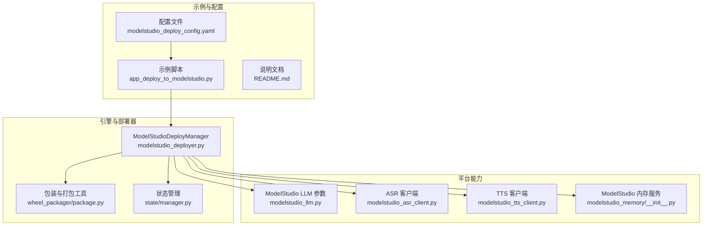
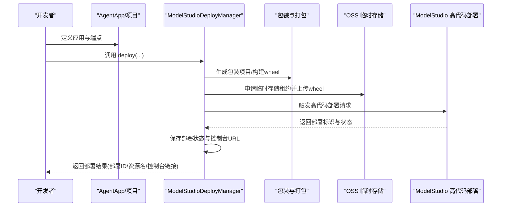
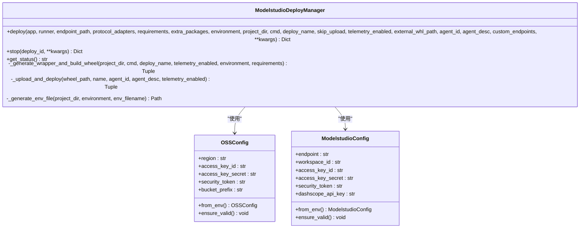
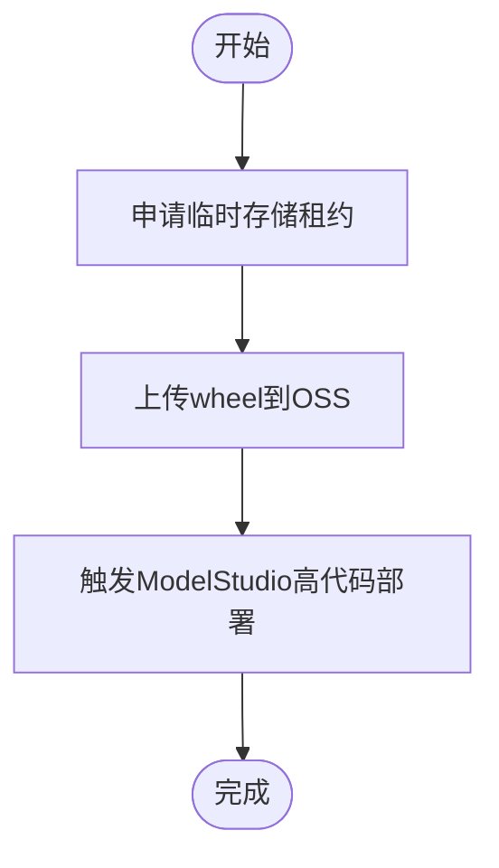
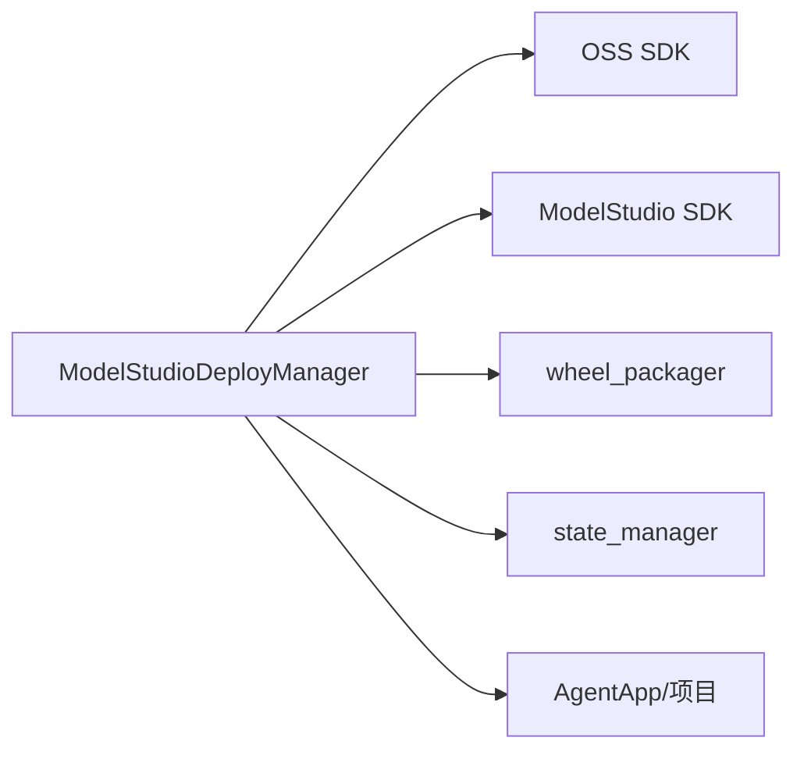

# ModelStudio部署

<cite>
**本文引用的文件**
- [modelstudio_deployer.py](file://src/agentscope_runtime/engine/deployers/modelstudio_deployer.py)
- [app_deploy_to_modelstudio.py](file://examples/deployments/modelstudio_deploy/app_deploy_to_modelstudio.py)
- [README.md](file://examples/deployments/modelstudio_deploy/README.md)
- [modelstudio_deploy_config.yaml](file://examples/deployments/modelstudio_deploy_config.yaml)
- [test_modelstudio_deployer.py](file://tests/deploy/test_modelstudio_deployer.py)
- [modelstudio_llm.py](file://src/agentscope_runtime/engine/schemas/modelstudio_llm.py)
- [modelstudio_asr_client.py](file://src/agentscope_runtime/tools/realtime_clients/modelstudio_asr_client.py)
- [modelstudio_tts_client.py](file://src/agentscope_runtime/tools/realtime_clients/modelstudio_tts_client.py)
- [modelstudio_memory/__init__.py](file://src/agentscope_runtime/tools/modelstudio_memory/__init__.py)
</cite>

## 目录
1. [简介](#简介)
2. [项目结构](#项目结构)
3. [核心组件](#核心组件)
4. [架构总览](#架构总览)
5. [详细组件分析](#详细组件分析)
6. [依赖关系分析](#依赖关系分析)
7. [性能考虑](#性能考虑)
8. [故障排查指南](#故障排查指南)
9. [结论](#结论)
10. [附录](#附录)

## 简介
本文件面向使用 Alibaba Cloud ModelStudio 的用户，系统性阐述 agentscope-runtime 在 ModelStudio 平台上的部署机制与 AI 应用托管能力。重点覆盖以下方面：
- 模型服务化与推理加速：通过平台托管与弹性扩缩容实现高可用推理服务
- ModelStudioDeployer 实现原理：模型打包、环境配置注入、推理服务触发与状态管理
- 完整部署配置示例：ModelStudio 特定参数与服务声明
- 模型版本管理、A/B 测试与在线推理优化策略
- 平台集成、API 网关与安全认证配置建议
- 监控指标、日志分析与性能调优实践

## 项目结构
ModelStudio 部署相关的核心代码与示例分布如下：
- 引擎层部署器：ModelStudio 部署器负责打包、上传与触发部署
- 示例脚本：演示从 AgentApp 或项目目录直接部署到 ModelStudio
- 配置文件：提供命令行部署的 YAML 配置模板
- 测试用例：验证部署流程的关键路径
- 平台能力扩展：ModelStudio LLM 参数、实时语音客户端、内存服务等

**图表来源**
- [modelstudio_deployer.py:544-947](file://src/agentscope_runtime/engine/deployers/modelstudio_deployer.py#L544-L947)
- [app_deploy_to_modelstudio.py:125-440](file://examples/deployments/modelstudio_deploy/app_deploy_to_modelstudio.py#L125-L440)
- [modelstudio_deploy_config.yaml:1-22](file://examples/deployments/modelstudio_deploy_config.yaml#L1-L22)
- [modelstudio_llm.py:245-313](file://src/agentscope_runtime/engine/schemas/modelstudio_llm.py#L245-L313)
- [modelstudio_asr_client.py:34-152](file://src/agentscope_runtime/tools/realtime_clients/modelstudio_asr_client.py#L34-L152)
- [modelstudio_tts_client.py:34-200](file://src/agentscope_runtime/tools/realtime_clients/modelstudio_tts_client.py#L34-L200)
- [modelstudio_memory/__init__.py:1-155](file://src/agentscope_runtime/tools/modelstudio_memory/__init__.py#L1-L155)

**章节来源**
- [modelstudio_deployer.py:544-947](file://src/agentscope_runtime/engine/deployers/modelstudio_deployer.py#L544-L947)
- [app_deploy_to_modelstudio.py:125-440](file://examples/deployments/modelstudio_deploy/app_deploy_to_modelstudio.py#L125-L440)
- [README.md:1-331](file://examples/deployments/modelstudio_deploy/README.md#L1-L331)
- [modelstudio_deploy_config.yaml:1-22](file://examples/deployments/modelstudio_deploy_config.yaml#L1-L22)

## 核心组件
- ModelStudioDeployManager：封装 OSS 上传与 ModelStudio 全量代码部署流程，支持从 AgentApp、项目目录或已有 wheel 文件三种方式部署
- OSSConfig/ModelstudioConfig：分别用于 OSS 临时存储与 ModelStudio API 访问的配置加载与校验
- 包装与打包：生成包装项目、构建 wheel、注入环境变量
- 状态管理：保存部署元数据（平台、控制台链接、资源名、工作空间等）

关键职责与行为：
- 验证云 SDK 可用性与配置完整性
- 申请 OSS 临时存储租约并上传 wheel
- 调用 ModelStudio 高代码部署接口
- 生成控制台 URL 与部署标识，写入状态管理器

**章节来源**
- [modelstudio_deployer.py:544-947](file://src/agentscope_runtime/engine/deployers/modelstudio_deployer.py#L544-L947)
- [test_modelstudio_deployer.py:23-211](file://tests/deploy/test_modelstudio_deployer.py#L23-L211)

## 架构总览
下图展示 ModelStudio 部署的整体流程与组件交互：

**图表来源**
- [modelstudio_deployer.py:727-885](file://src/agentscope_runtime/engine/deployers/modelstudio_deployer.py#L727-L885)
- [app_deploy_to_modelstudio.py:125-202](file://examples/deployments/modelstudio_deploy/app_deploy_to_modelstudio.py#L125-L202)

## 详细组件分析

### ModelStudioDeployManager 类
- 职责：统一处理 ModelStudio 部署生命周期，包括打包、上传、部署与状态持久化
- 关键方法：
  - deploy：根据输入类型（AgentApp/项目目录/外部 wheel）生成包装与 wheel，上传至 OSS 并触发部署
  - stop：当前未实现停止接口，返回需在控制台手动清理的提示
  - get_status：返回未知状态（平台暂不支持）
- 环境注入：通过 .env 文件注入 HOST/PORT 以及用户自定义环境变量

**图表来源**
- [modelstudio_deployer.py:544-947](file://src/agentscope_runtime/engine/deployers/modelstudio_deployer.py#L544-L947)

**章节来源**
- [modelstudio_deployer.py:544-947](file://src/agentscope_runtime/engine/deployers/modelstudio_deployer.py#L544-L947)

### OSS 上传与临时存储
- 申请临时存储租约：向 ModelStudio 申请 OSS 临时存储租约，获取预签名 URL
- 上传 wheel：使用预签名 URL 将 wheel 上传至 OSS
- 保活与权限：若 RAM 用户未分配到工作区，会输出详细错误指引

**图表来源**
- [modelstudio_deployer.py:291-411](file://src/agentscope_runtime/engine/deployers/modelstudio_deployer.py#L291-L411)

**章节来源**
- [modelstudio_deployer.py:291-411](file://src/agentscope_runtime/engine/deployers/modelstudio_deployer.py#L291-L411)

### 部署配置与服务声明
- 基础配置：deploy_name、telemetry_enabled
- 依赖配置：requirements、extra_packages
- 环境变量：通过 environment 注入，如 PYTHONPATH、LOG_LEVEL、API Key 等
- 控制台访问：部署成功后可从返回结果中获取控制台 URL

示例参考：
- 示例脚本中的部署配置段落
- YAML 配置文件模板

**章节来源**
- [app_deploy_to_modelstudio.py:155-179](file://examples/deployments/modelstudio_deploy/app_deploy_to_modelstudio.py#L155-L179)
- [modelstudio_deploy_config.yaml:1-22](file://examples/deployments/modelstudio_deploy_config.yaml#L1-L22)
- [README.md:82-119](file://examples/deployments/modelstudio_deploy/README.md#L82-L119)

### 模型服务化与推理加速
- 平台托管：ModelStudio 提供容器化运行时与弹性扩缩容，降低运维复杂度
- 推理加速：结合平台算力与缓存策略，提升响应速度与吞吐
- 端到端流式：支持同步/异步/流式端点，满足不同推理场景

**章节来源**
- [README.md:148-162](file://examples/deployments/modelstudio_deploy/README.md#L148-L162)

### 模型版本管理、A/B 测试与在线推理优化
- 版本管理：通过不同的 deploy_name 或资源名区分版本；结合控制台进行版本切换与回滚
- A/B 测试：利用平台路由与流量切分能力，对不同版本进行对比评估
- 在线推理优化：启用增量输出、搜索增强、RAG 策略与意图识别等参数，提升回答质量与稳定性

**章节来源**
- [modelstudio_llm.py:245-313](file://src/agentscope_runtime/engine/schemas/modelstudio_llm.py#L245-L313)

### 平台集成、API 网关与安全认证
- 平台集成：通过 ModelStudio 控制台查看部署状态与日志
- API 网关：可在平台侧配置域名与网关，对外暴露统一入口
- 安全认证：使用 RAM 凭证与工作区授权，确保最小权限原则

**章节来源**
- [README.md:316-331](file://examples/deployments/modelstudio_deploy/README.md#L316-L331)

### 监控指标、日志分析与性能调优
- 监控指标：平台内置仪表盘可观察请求量、延迟、错误率与资源使用情况
- 日志分析：结合平台日志与应用日志定位问题
- 性能调优：调整并发、资源配额、启用增量输出与搜索策略，优化端到端时延

**章节来源**
- [README.md:322-331](file://examples/deployments/modelstudio_deploy/README.md#L322-L331)

## 依赖关系分析
- 外部依赖：阿里云 OSS SDK、ModelStudio SDK、Tea/OpenAPI 工具库
- 运行时依赖：FastAPI、Uvicorn、DashScope API Key
- 组件耦合：ModelStudioDeployManager 与包装打包、状态管理、SDK 调用紧密耦合

**图表来源**
- [modelstudio_deployer.py:1-48](file://src/agentscope_runtime/engine/deployers/modelstudio_deployer.py#L1-L48)

**章节来源**
- [modelstudio_deployer.py:1-48](file://src/agentscope_runtime/engine/deployers/modelstudio_deployer.py#L1-L48)

## 性能考虑
- 打包体积：合理选择依赖与额外包，减少 wheel 体积以缩短上传与启动时间
- 并发与资源：根据业务峰值合理设置资源配额与并发数
- 推理策略：开启增量输出与合适的搜索/RAG 策略，在准确性与延迟间取得平衡
- 缓存与预热：利用平台缓存与冷启动优化策略，降低首包延迟

## 故障排查指南
常见问题与处理建议：
- 缺少环境变量：检查 DASHSCOPE_API_KEY、ALIBABA_CLOUD_*、MODELSTUDIO_WORKSPACE_ID 是否设置
- 权限不足：RAM 用户需具备 ApplyTempStorageLease 与工作区访问权限
- 工作区未关联：RAM 用户需被分配到至少一个工作区
- 网络连通性：确认可访问阿里云服务与 OSS

定位手段：
- 查看脚本输出与控制台 URL
- 检查平台部署状态与日志
- 校验环境变量与凭证有效性

**章节来源**
- [README.md:236-264](file://examples/deployments/modelstudio_deploy/README.md#L236-L264)
- [app_deploy_to_modelstudio.py:288-308](file://examples/deployments/modelstudio_deploy/app_deploy_to_modelstudio.py#L288-L308)

## 结论
ModelStudioDeployManager 将 AgentApp 或项目打包为 wheel，借助 OSS 临时存储与 ModelStudio 高代码部署能力，实现一键上线与平台托管。配合平台的弹性扩缩容、内置监控与流式推理能力，可快速构建高可用的 AI 应用推理服务。建议结合版本管理、A/B 测试与在线优化策略，持续提升服务质量与用户体验。

## 附录

### 部署流程与参数速查
- 部署入口：AgentApp.deploy(...) 或直接调用 ModelStudioDeployManager.deploy(...)
- 必填参数：至少提供 app/runner/project_dir 或 external_whl_path
- 可选参数：deploy_name、requirements、extra_packages、environment、telemetry_enabled、skip_upload
- 返回字段：deploy_id、resource_name、url、wheel_path、workspace_id、modelstudio_deploy_id

**章节来源**
- [modelstudio_deployer.py:727-885](file://src/agentscope_runtime/engine/deployers/modelstudio_deployer.py#L727-L885)
- [app_deploy_to_modelstudio.py:181-202](file://examples/deployments/modelstudio_deploy/app_deploy_to_modelstudio.py#L181-L202)

### 示例脚本与配置文件
- 示例脚本：演示三种部署方式（AgentApp、项目目录、wheel 文件）
- 配置文件：提供 YAML 模板，便于命令行部署

**章节来源**
- [app_deploy_to_modelstudio.py:204-281](file://examples/deployments/modelstudio_deploy/app_deploy_to_modelstudio.py#L204-L281)
- [modelstudio_deploy_config.yaml:1-22](file://examples/deployments/modelstudio_deploy_config.yaml#L1-L22)