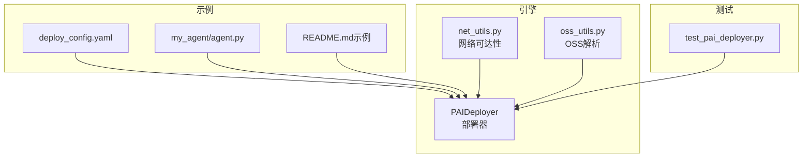
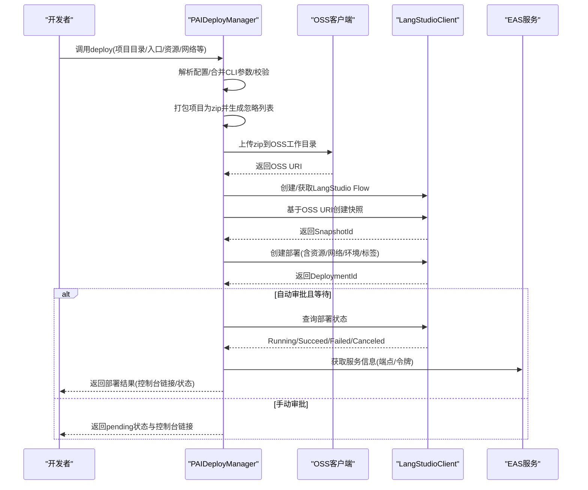
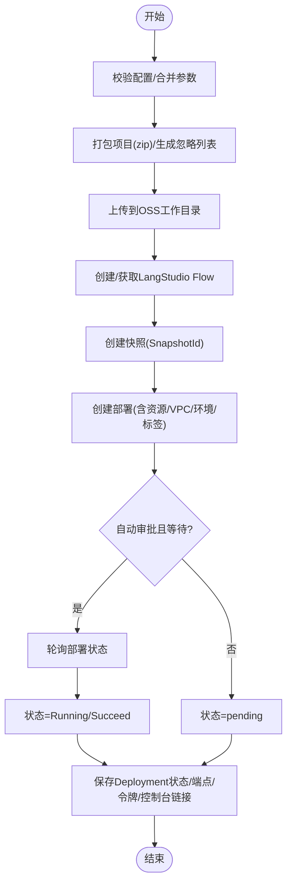
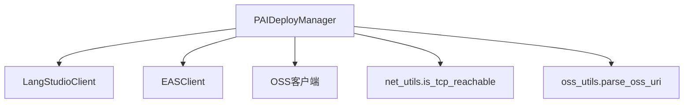

# PAI部署

<cite>
**本文引用的文件**
- [pai_deployer.py](file://src/agentscope_runtime/engine/deployers/pai_deployer.py)
- [deploy_config.yaml](file://examples/deployments/pai_deploy/deploy_config.yaml)
- [agent.py](file://examples/deployments/pai_deploy/my_agent/agent.py)
- [README.md（示例）](file://examples/deployments/pai_deploy/README.md)
- [test_pai_deployer.py](file://tests/deploy/test_pai_deployer.py)
- [net_utils.py](file://src/agentscope_runtime/engine/deployers/utils/net_utils.py)
- [oss_utils.py](file://src/agentscope_runtime/engine/deployers/utils/oss_utils.py)
- [advanced_deployment.md](file://cookbook/en/advanced_deployment.md)
</cite>

## 目录
1. [简介](#简介)
2. [项目结构](#项目结构)
3. [核心组件](#核心组件)
4. [架构总览](#架构总览)
5. [详细组件分析](#详细组件分析)
6. [依赖分析](#依赖分析)
7. [性能考虑](#性能考虑)
8. [故障排查指南](#故障排查指南)
9. [结论](#结论)
10. [附录](#附录)

## 简介
本文件面向在阿里云PAI平台上进行机器学习应用托管与部署的工程师与技术用户，系统性阐述Agentscope Runtime中PAI部署器（PAIDeployer）的实现原理与使用方法，覆盖以下关键主题：
- 部署流程：打包项目、上传OSS、创建LangStudio Flow与快照、部署为EAS服务
- 资源类型与调度：公共资源池、专用资源组、配额资源的差异化配置
- 训练与推理：分布式训练与在线推理的资源与网络策略
- 配置体系：YAML配置文件与CLI参数合并策略
- 运行时管理：服务状态查询、手动审批、停止与清理
- 监控与可观测性：启用追踪、标签与控制台链接
- 网络与安全：VPC、安全组、内网/公网可达性判断
- 性能与优化：实例规格、并发实例数、环境变量注入与忽略规则

## 项目结构
与PAI部署相关的核心代码与示例位于以下路径：
- 引擎与部署器：src/agentscope_runtime/engine/deployers/pai_deployer.py
- 示例配置与示例Agent：examples/deployments/pai_deploy/
- 测试用例：tests/deploy/test_pai_deployer.py
- 工具函数：src/agentscope_runtime/engine/deployers/utils/

图表来源
- [pai_deployer.py:1102-1683](file://src/agentscope_runtime/engine/deployers/pai_deployer.py#L1102-L1683)
- [deploy_config.yaml:1-39](file://examples/deployments/pai_deploy/deploy_config.yaml#L1-L39)
- [agent.py:1-116](file://examples/deployments/pai_deploy/my_agent/agent.py#L1-L116)
- [README.md（示例）:1-347](file://examples/deployments/pai_deploy/README.md#L1-L347)
- [test_pai_deployer.py:1-585](file://tests/deploy/test_pai_deployer.py#L1-L585)
- [net_utils.py:70-103](file://src/agentscope_runtime/engine/deployers/utils/net_utils.py#L70-L103)
- [oss_utils.py:10-39](file://src/agentscope_runtime/engine/deployers/utils/oss_utils.py#L10-L39)

章节来源
- [README.md（示例）:1-347](file://examples/deployments/pai_deploy/README.md#L1-L347)
- [pai_deployer.py:1102-1683](file://src/agentscope_runtime/engine/deployers/pai_deployer.py#L1102-L1683)

## 核心组件
- PAIDeployManager：PAI部署器主类，负责打包、上传、创建LangStudio Flow与快照、部署为EAS服务、等待完成、状态持久化与控制台链接生成。
- PAIDeployConfig/PAISpecConfig/PAIContextConfig：配置模型，支持从YAML加载与CLI参数合并，自动推断资源类型、默认值与校验。
- LangStudioClient：轻量封装PAI LangStudio API，用于Flow列表、创建、删除、快照创建、部署创建与状态查询。
- OSS客户端与端点选择：根据区域与网络可达性选择内网或公网OSS端点。
- 忽略规则与归档：基于.gitignore/.dockerignore与默认忽略列表构建归档，避免上传无关文件。

章节来源
- [pai_deployer.py:597-941](file://src/agentscope_runtime/engine/deployers/pai_deployer.py#L597-L941)
- [pai_deployer.py:1102-1683](file://src/agentscope_runtime/engine/deployers/pai_deployer.py#L1102-L1683)
- [net_utils.py:70-103](file://src/agentscope_runtime/engine/deployers/utils/net_utils.py#L70-L103)
- [oss_utils.py:10-39](file://src/agentscope_runtime/engine/deployers/utils/oss_utils.py#L10-L39)

## 架构总览
下图展示PAI部署的关键步骤与组件交互：

图表来源
- [pai_deployer.py:1464-1683](file://src/agentscope_runtime/engine/deployers/pai_deployer.py#L1464-L1683)
- [pai_deployer.py:1182-1390](file://src/agentscope_runtime/engine/deployers/pai_deployer.py#L1182-L1390)
- [pai_deployer.py:1401-1463](file://src/agentscope_runtime/engine/deployers/pai_deployer.py#L1401-L1463)

## 详细组件分析

### 配置模型与合并策略
- PAIDeployConfig：顶层配置容器，包含context/spec两部分与部署行为参数（等待、超时、自动审批）。
- PAISpecConfig/PAIContextConfig：分别描述“要部署什么”和“在哪里部署”，支持嵌套字段与默认值。
- 合并策略：merge_cli允许CLI参数覆盖YAML配置；资源类型可由type显式指定，也可通过resource_id/quota_id隐式推断；默认值按资源类型自动填充。
- 校验：validate_for_deploy确保服务名、源目录存在及资源模式所需字段齐全。

章节来源
- [pai_deployer.py:721-982](file://src/agentscope_runtime/engine/deployers/pai_deployer.py#L721-L982)
- [pai_deployer.py:775-851](file://src/agentscope_runtime/engine/deployers/pai_deployer.py#L775-L851)

### 部署流程与状态机
- 步骤拆分：
  1) 项目打包与上传：生成zip归档，按忽略规则过滤，上传至OSS工作目录。
  2) LangStudio Flow管理：复用已有Flow或创建新Flow，记录FlowId。
  3) 快照创建：以OSS URI为源创建快照，返回SnapshotId。
  4) 部署创建：构建部署配置（实例数、资源类型、VPC、环境变量、标签），创建部署并返回DeploymentId。
  5) 状态等待：若自动审批且等待，则轮询直到成功；否则返回pending状态。
  6) 结果持久化：保存Deployment状态、端点、令牌、控制台链接等信息。
- 手动审批：支持等待审批阶段、批准与取消操作，便于合规与安全管控。
- 停止服务：通过EAS客户端停止对应服务并更新状态。

图表来源
- [pai_deployer.py:1464-1683](file://src/agentscope_runtime/engine/deployers/pai_deployer.py#L1464-L1683)
- [pai_deployer.py:1401-1463](file://src/agentscope_runtime/engine/deployers/pai_deployer.py#L1401-L1463)

章节来源
- [pai_deployer.py:1464-1683](file://src/agentscope_runtime/engine/deployers/pai_deployer.py#L1464-L1683)
- [pai_deployer.py:2185-2336](file://src/agentscope_runtime/engine/deployers/pai_deployer.py#L2185-L2336)

### 资源类型与调度机制
- 公共资源池（public）：按实例规格与数量计费，适合开发与小规模推理。
- 专用资源组（resource）：绑定EAS资源组，适合稳定运行与隔离。
- 配额资源（quota）：基于PAI配额，优先级可配置，适合企业级资源池化。
- 默认值：public模式默认实例规格，resource/quota模式默认CPU与内存。
- VPC网络：支持vpc_id/vswitch_id/security_group_id，结合内网/公网端点选择提升安全性与连通性。

章节来源
- [pai_deployer.py:853-941](file://src/agentscope_runtime/engine/deployers/pai_deployer.py#L853-L941)
- [pai_deployer.py:1204-1294](file://src/agentscope_runtime/engine/deployers/pai_deployer.py#L1204-L1294)
- [pai_deployer.py:2080-2099](file://src/agentscope_runtime/engine/deployers/pai_deployer.py#L2080-L2099)

### 训练与推理策略
- 分布式训练：可通过资源类型与实例数配置弹性扩缩容，结合配额资源保障计算资源优先级。
- 在线推理：公共资源池适合低延迟、高吞吐的推理场景；专用资源组适合需要稳定SLA与隔离的生产服务。
- 模型服务化：通过环境变量注入模型密钥与端点，结合快照与部署配置实现一键发布。
- 版本管理：LangStudio Flow与快照机制天然支持版本回滚与多版本并存，便于灰度与A/B测试。

章节来源
- [pai_deployer.py:1204-1294](file://src/agentscope_runtime/engine/deployers/pai_deployer.py#L1204-L1294)
- [README.md（示例）:185-226](file://examples/deployments/pai_deploy/README.md#L185-L226)

### 平台认证、资源配额与网络访问
- 认证：通过阿里云凭证（AccessKey/STS）注入，支持自定义RAM角色ARN。
- 资源配额：quota模式需提供quota_id；resource模式需提供resource_id。
- 网络访问：默认服务无公网访问，如使用DashScope模型需配置具备公网访问能力的VPC；内部/公网端点根据可达性自动选择。

章节来源
- [pai_deployer.py:1295-1335](file://src/agentscope_runtime/engine/deployers/pai_deployer.py#L1295-L1335)
- [net_utils.py:70-103](file://src/agentscope_runtime/engine/deployers/utils/net_utils.py#L70-L103)
- [README.md（示例）:45-47](file://examples/deployments/pai_deploy/README.md#L45-L47)

### 部署配置示例
- YAML配置文件：包含context（工作区、区域、存储）、spec（名称、代码、资源、VPC、身份、可观测、环境、标签）与部署行为参数。
- CLI参数：支持直接传入项目目录、入口文件、工作区ID、区域、实例规格/数量、资源类型、VPC与RAM角色等。
- 示例Agent：ReActAgent集成工具与会话状态管理，演示如何在PAI上运行。

章节来源
- [deploy_config.yaml:1-39](file://examples/deployments/pai_deploy/deploy_config.yaml#L1-L39)
- [README.md（示例）:82-183](file://examples/deployments/pai_deploy/README.md#L82-L183)
- [agent.py:1-116](file://examples/deployments/pai_deploy/my_agent/agent.py#L1-L116)

### 训练监控、日志分析与性能调优
- 可观测性：启用trace后可在控制台查看链路与指标；自动标签包含部署工具、版本与方式。
- 日志与控制台：部署完成后返回控制台链接，便于查看日志与状态。
- 性能调优建议：
  - 推理：合理设置实例数与实例规格，结合VPC内网访问降低延迟。
  - 训练：使用配额资源保障优先级，必要时增加实例数以缩短收敛时间。
  - 环境变量：集中注入模型密钥与端点，减少硬编码风险。

章节来源
- [pai_deployer.py:1083-1099](file://src/agentscope_runtime/engine/deployers/pai_deployer.py#L1083-L1099)
- [pai_deployer.py:1689-1715](file://src/agentscope_runtime/engine/deployers/pai_deployer.py#L1689-L1715)
- [advanced_deployment.md:795-843](file://cookbook/en/advanced_deployment.md#L795-L843)

## 依赖分析
- 外部SDK：alibabacloud_oss_v2、alibabacloud_aiworkspace20210204、alibabacloud_eas20210701、alibabacloud_tea_openapi等。
- 内部模块：net_utils（端点可达性）、oss_utils（OSS URI解析）、state（部署状态持久化）。
- 关键耦合点：LangStudioClient与EASClient的API调用；OSS上传与端点选择；忽略规则与归档生成。

图表来源
- [pai_deployer.py:2036-2099](file://src/agentscope_runtime/engine/deployers/pai_deployer.py#L2036-L2099)
- [net_utils.py:70-103](file://src/agentscope_runtime/engine/deployers/utils/net_utils.py#L70-L103)
- [oss_utils.py:10-39](file://src/agentscope_runtime/engine/deployers/utils/oss_utils.py#L10-L39)

章节来源
- [pai_deployer.py:2036-2099](file://src/agentscope_runtime/engine/deployers/pai_deployer.py#L2036-L2099)
- [net_utils.py:70-103](file://src/agentscope_runtime/engine/deployers/utils/net_utils.py#L70-L103)
- [oss_utils.py:10-39](file://src/agentscope_runtime/engine/deployers/utils/oss_utils.py#L10-L39)

## 性能考虑
- 实例规格与数量：根据推理QPS与响应时延权衡；训练场景建议使用更高规格实例并配合配额资源。
- 归档体积：利用忽略规则减少上传体积，缩短部署时间。
- 网络路径：优先内网端点，避免跨地域传输带来的额外延迟。
- 环境变量注入：集中管理敏感配置，减少启动时初始化开销。

## 故障排查指南
- “PAI部署器不可用”：确认已安装扩展依赖。
- “工作区ID必填”：通过环境变量、CLI或配置文件提供。
- “服务名被占用”：更换唯一的服务名。
- “凭证错误”：检查AccessKey/STS与RAM权限。
- “OSS上传失败”：核对OSS桶存在性、区域一致性与网络可达性。
- “无公网访问”：如使用DashScope模型，需配置具备公网访问的VPC。

章节来源
- [README.md（示例）:286-346](file://examples/deployments/pai_deploy/README.md#L286-L346)
- [test_pai_deployer.py:74-121](file://tests/deploy/test_pai_deployer.py#L74-L121)

## 结论
PAIDeployer通过标准化的打包、上传、快照与部署流程，将AgentScope应用无缝托管到PAI平台。其配置模型灵活、资源类型丰富、网络与安全策略完备，并提供可观测性与控制台链接，满足从开发到生产的全生命周期需求。结合合理的资源规划与网络配置，可在保证稳定性的同时获得良好的性能表现。

## 附录
- 示例命令与最佳实践参见示例README与高级部署文档。
- 单元与端到端测试覆盖配置解析、归档忽略规则与部署流程，可作为集成验证参考。

章节来源
- [README.md（示例）:312-346](file://examples/deployments/pai_deploy/README.md#L312-L346)
- [advanced_deployment.md:795-843](file://cookbook/en/advanced_deployment.md#L795-L843)
- [test_pai_deployer.py:1-585](file://tests/deploy/test_pai_deployer.py#L1-L585)