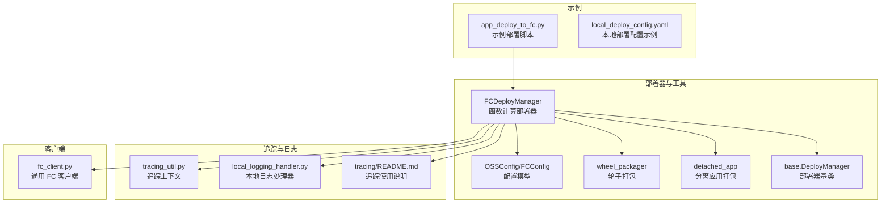
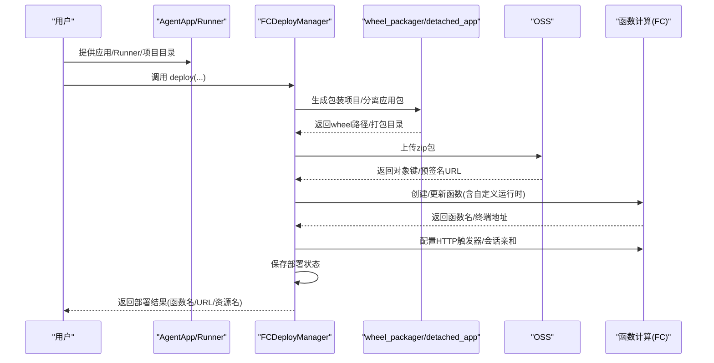
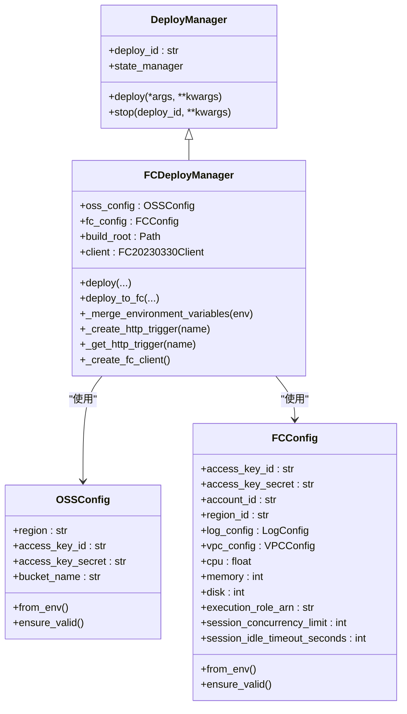
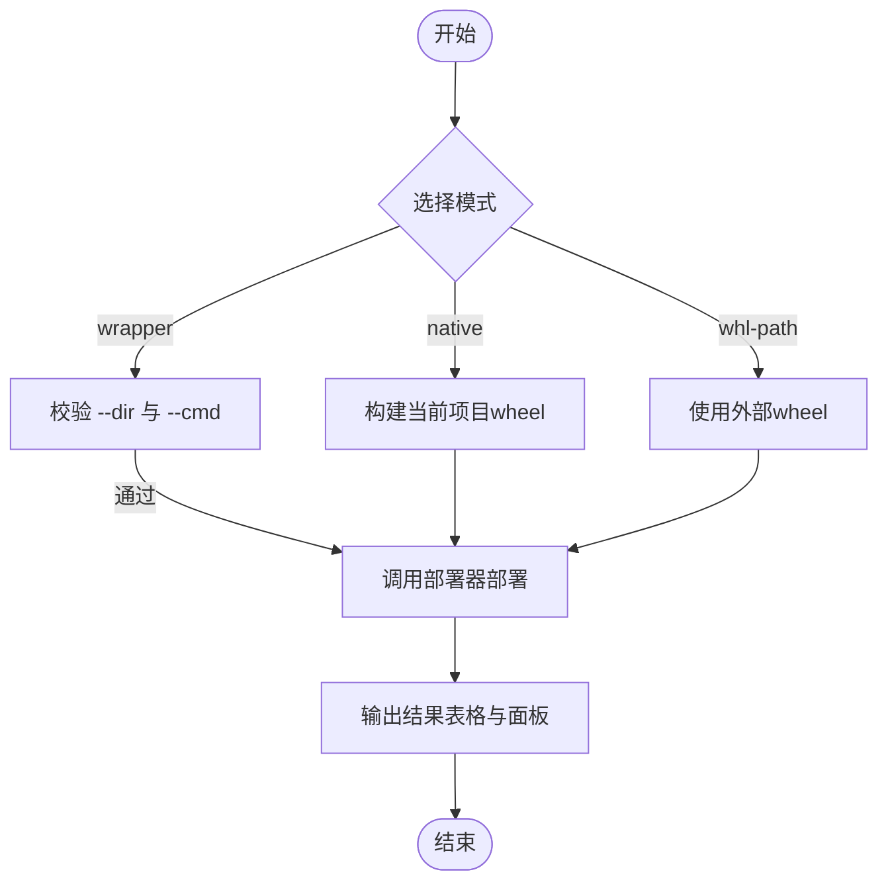
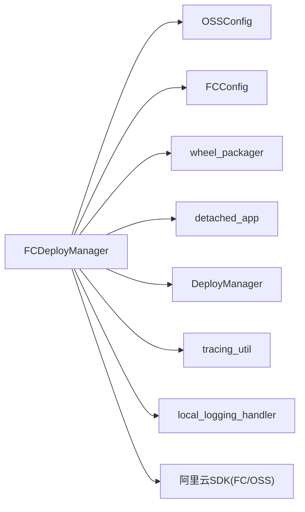

# 函数计算部署

<cite>
**本文引用的文件**
- [fc_deployer.py](file://src/agentscope_runtime/engine/deployers/fc_deployer.py)
- [cli_fc_deploy.py](file://src/agentscope_runtime/engine/deployers/cli_fc_deploy.py)
- [app_deploy_to_fc.py](file://examples/deployments/fc_deploy/app_deploy_to_fc.py)
- [wheel_packager.py](file://src/agentscope_runtime/engine/deployers/utils/wheel_packager.py)
- [detached_app.py](file://src/agentscope_runtime/engine/deployers/utils/detached_app.py)
- [base.py](file://src/agentscope_runtime/engine/deployers/base.py)
- [local_deploy_config.yaml](file://examples/deployments/local_deploy_config.yaml)
- [tracing_util.py](file://src/agentscope_runtime/engine/tracing/tracing_util.py)
- [local_logging_handler.py](file://src/agentscope_runtime/engine/tracing/local_logging_handler.py)
- [README.md（tracing）](file://src/agentscope_runtime/engine/tracing/README.md)
- [fc_client.py](file://src/agentscope_runtime/common/container_clients/fc_client.py)
</cite>

## 目录
1. [简介](#简介)
2. [项目结构](#项目结构)
3. [核心组件](#核心组件)
4. [架构总览](#架构总览)
5. [详细组件分析](#详细组件分析)
6. [依赖分析](#依赖分析)
7. [性能考虑](#性能考虑)
8. [故障排查指南](#故障排查指南)
9. [结论](#结论)
10. [附录](#附录)

## 简介
本文件面向在阿里云函数计算（Function Compute，简称 FC）上进行无服务器部署的用户与工程师，系统性阐述基于本仓库实现的函数计算部署机制与最佳实践。内容覆盖部署器实现（FCDeployManager 与 CLIFCDeployer）、函数包管理、触发器与环境变量配置、部署配置示例、冷启动与并发控制优化、成本优化策略、平台认证与权限、网络访问设置、监控与日志、以及性能调优建议。

## 项目结构
围绕函数计算部署的相关模块主要位于以下路径：
- 部署器与工具：src/agentscope_runtime/engine/deployers/
- 示例部署脚本：examples/deployments/fc_deploy/
- 轮子打包与分离应用打包：src/agentscope_runtime/engine/deployers/utils/
- 基类接口：src/agentscope_runtime/engine/deployers/base.py
- 追踪与日志：src/agentscope_runtime/engine/tracing/
- 客户端封装（通用 FC 客户端）：src/agentscope_runtime/common/container_clients/fc_client.py

**图表来源**
- [fc_deployer.py](file://src/agentscope_runtime/engine/deployers/fc_deployer.py)
- [cli_fc_deploy.py](file://src/agentscope_runtime/engine/deployers/cli_fc_deploy.py)
- [app_deploy_to_fc.py](file://examples/deployments/fc_deploy/app_deploy_to_fc.py)
- [wheel_packager.py](file://src/agentscope_runtime/engine/deployers/utils/wheel_packager.py)
- [detached_app.py](file://src/agentscope_runtime/engine/deployers/utils/detached_app.py)
- [base.py](file://src/agentscope_runtime/engine/deployers/base.py)
- [tracing_util.py](file://src/agentscope_runtime/engine/tracing/tracing_util.py)
- [local_logging_handler.py](file://src/agentscope_runtime/engine/tracing/local_logging_handler.py)
- [README.md（tracing）](file://src/agentscope_runtime/engine/tracing/README.md)
- [fc_client.py](file://src/agentscope_runtime/common/container_clients/fc_client.py)

**章节来源**
- [fc_deployer.py](file://src/agentscope_runtime/engine/deployers/fc_deployer.py)
- [cli_fc_deploy.py](file://src/agentscope_runtime/engine/deployers/cli_fc_deploy.py)
- [app_deploy_to_fc.py](file://examples/deployments/fc_deploy/app_deploy_to_fc.py)
- [wheel_packager.py](file://src/agentscope_runtime/engine/deployers/utils/wheel_packager.py)
- [detached_app.py](file://src/agentscope_runtime/engine/deployers/utils/detached_app.py)
- [base.py](file://src/agentscope_runtime/engine/deployers/base.py)
- [tracing_util.py](file://src/agentscope_runtime/engine/tracing/tracing_util.py)
- [local_logging_handler.py](file://src/agentscope_runtime/engine/tracing/local_logging_handler.py)
- [README.md（tracing）](file://src/agentscope_runtime/engine/tracing/README.md)
- [fc_client.py](file://src/agentscope_runtime/common/container_clients/fc_client.py)

## 核心组件
- FCDeployManager：负责将用户应用或项目打包为可运行的自定义运行时函数，并上传至 OSS、创建/更新 FC 函数、配置 HTTP 触发器与会话亲和等。
- OSSConfig/FCConfig：分别用于 OSS 存储与 FC 服务的配置，支持从环境变量加载与校验。
- wheel_packager：生成包装项目、合并用户依赖与本地 wheel、构建 wheel 包。
- detached_app：将 AgentApp/Runner 打包为独立可部署的应用包，便于在 FC 上以自定义运行时启动。
- DeployManager 基类：统一部署器接口，提供部署 ID 与状态管理能力。
- 追踪与日志：通过上下文变量与本地日志处理器记录请求链路与事件，便于诊断与性能分析。

**章节来源**
- [fc_deployer.py](file://src/agentscope_runtime/engine/deployers/fc_deployer.py)
- [wheel_packager.py](file://src/agentscope_runtime/engine/deployers/utils/wheel_packager.py)
- [detached_app.py](file://src/agentscope_runtime/engine/deployers/utils/detached_app.py)
- [base.py](file://src/agentscope_runtime/engine/deployers/base.py)
- [tracing_util.py](file://src/agentscope_runtime/engine/tracing/tracing_util.py)
- [local_logging_handler.py](file://src/agentscope_runtime/engine/tracing/local_logging_handler.py)

## 架构总览
下图展示从应用到 FC 的完整部署流程：打包、上传、创建/更新函数、配置触发器与会话亲和、保存部署状态并返回结果。

**图表来源**
- [fc_deployer.py](file://src/agentscope_runtime/engine/deployers/fc_deployer.py)
- [wheel_packager.py](file://src/agentscope_runtime/engine/deployers/utils/wheel_packager.py)
- [detached_app.py](file://src/agentscope_runtime/engine/deployers/utils/detached_app.py)

## 详细组件分析

### FCDeployManager 实现原理
- 初始化与客户端
  - 从 FCConfig/OSSConfig 加载凭证与区域信息，构造 FC 客户端。
  - 支持从环境变量自动填充 FC_REGION_ID、FC_ACCOUNT_ID、ALIBABA_CLOUD_ACCESS_KEY_ID/SECRET 等。
- 包装与打包
  - 若传入 Runner/App，则通过 LocalDeployManager 创建分离应用包；否则根据项目目录与命令生成包装项目并构建 wheel。
  - 将 wheel 在隔离虚拟环境中构建，避免 PEP 668 问题。
- 上传与部署
  - 将打包产物上传至指定 OSS Bucket，返回对象键与预签名 URL。
  - 调用 FC API 创建/更新函数，设置自定义运行时、超时、内存/CPU、磁盘大小、实例并发、会话亲和等。
  - 自动配置 HTTP 触发器（固定触发器名），并返回公网/内网终端地址。
- 环境变量与会话亲和
  - 合并用户自定义环境变量与运行时必需变量（如 PATH/PYTHONPATH/LD_LIBRARY_PATH/版本号），确保函数运行稳定。
  - 通过会话亲和头“x-agentscope-runtime-session-id”绑定同一会话到固定实例，提升长连接/流式交互体验。
- 日志与网络
  - 可选配置日志服务（LogStore/Project）与 VPC 网络（VPC ID、交换机、安全组），便于内网访问与审计。
- 状态管理
  - 使用统一的部署 ID 与状态管理器保存部署元数据（函数名、URL、资源名、区域等）。

**图表来源**
- [base.py](file://src/agentscope_runtime/engine/deployers/base.py)
- [fc_deployer.py](file://src/agentscope_runtime/engine/deployers/fc_deployer.py)

**章节来源**
- [fc_deployer.py](file://src/agentscope_runtime/engine/deployers/fc_deployer.py)

### CLI FC 部署器（CLIFCDeployer）
- 提供命令行入口，支持 wrapper/native 模式、外部 wheel 直接部署、跳过上传、Telemetry 开关、构建根目录、更新已有代理等。
- 默认模式为 wrapper，需要提供项目目录与启动命令；native 模式直接对当前项目构建 wheel 并部署；whl-path 模式直接使用已有 wheel 文件。
- 输出包含构建的 wheel 路径、制品 URL、资源名、控制台链接与部署 ID。

**图表来源**
- [cli_fc_deploy.py](file://src/agentscope_runtime/engine/deployers/cli_fc_deploy.py)

**章节来源**
- [cli_fc_deploy.py](file://src/agentscope_runtime/engine/deployers/cli_fc_deploy.py)

### 函数包管理与环境变量
- wheel_packager
  - 生成包装项目，复制用户代码到 deploy_starter/user_bundle 下，合并依赖与本地 wheel，写入 setup.py 与 MANIFEST.in，最终构建 wheel。
  - 支持从 pyproject.toml 与 requirements.txt 解析依赖，去重并处理本地 wheel 路径。
- 环境变量注入
  - FCDeployManager 在创建/更新函数时合并用户环境变量与运行时必需变量，确保 Python 3.12 运行环境正确。
- 分离应用打包
  - detached_app 将 AgentApp/Runner 打包为独立部署包，支持额外 requirements、本地 runtime wheel、Dockerfile 替换入口等。

**章节来源**
- [wheel_packager.py](file://src/agentscope_runtime/engine/deployers/utils/wheel_packager.py)
- [detached_app.py](file://src/agentscope_runtime/engine/deployers/utils/detached_app.py)
- [fc_deployer.py](file://src/agentscope_runtime/engine/deployers/fc_deployer.py)

### 触发器与会话亲和
- HTTP 触发器
  - 固定触发器名为“agentscope-runtime-trigger”，创建/获取后返回公网/内网终端地址。
- 会话亲和
  - 通过会话亲和配置与头部“x-agentscope-runtime-session-id”绑定同一会话到固定实例，支持会话 TTL 与空闲超时控制，提升长连接稳定性。

**章节来源**
- [fc_deployer.py](file://src/agentscope_runtime/engine/deployers/fc_deployer.py)

### 部署配置示例
- 示例脚本展示了三种部署方式：
  - 使用 AgentApp 部署（推荐）
  - 直接从项目目录部署
  - 从现有 wheel 文件部署
- 关键配置项包括 OSS 凭证与 Bucket、FC 凭证与区域、部署名称、Telemetry 开关、依赖列表、额外包、环境变量等。
- 示例还提供了 curl 测试命令，演示健康检查与同步/异步/流式端点的调用方法。

**章节来源**
- [app_deploy_to_fc.py](file://examples/deployments/fc_deploy/app_deploy_to_fc.py)

### 平台认证、权限与网络
- 认证与权限
  - FCConfig/OSSConfig 支持从环境变量加载 AK/SK、Account ID、Region 等；部署前会校验必要字段。
  - 可配置执行角色 ARN（Execution Role ARN）以满足 FC 运行时权限需求。
- 网络访问
  - 支持配置 VPC（VPC ID、交换机、安全组），实现内网访问与安全隔离。
  - Internet Access 默认开启，便于公网访问。

**章节来源**
- [fc_deployer.py](file://src/agentscope_runtime/engine/deployers/fc_deployer.py)

### 监控指标、日志分析与性能调优
- 追踪上下文
  - 通过 TracingUtil 设置/获取请求 ID 与通用属性，支持跨线程场景下的上下文传递。
- 本地日志处理器
  - 在事件开始/结束时记录结构化日志，便于定位性能瓶颈与异常。
- 追踪使用说明
  - README 中提供了启用日志上报、添加装饰器、非流式/流式函数追踪的示例与环境变量配置。

**章节来源**
- [tracing_util.py](file://src/agentscope_runtime/engine/tracing/tracing_util.py)
- [local_logging_handler.py](file://src/agentscope_runtime/engine/tracing/local_logging_handler.py)
- [README.md（tracing）](file://src/agentscope_runtime/engine/tracing/README.md)

## 依赖分析
- 组件耦合
  - FCDeployManager 依赖 OSSConfig/FCConfig、wheel_packager、detached_app、DeployManager 基类、Tracing 工具与日志处理器。
  - CLI 部署器依赖 ModelstudioDeployManager（注意：示例中为 ModelstudioDeployManager，但实际函数计算部署应使用 FCDeployManager）。
- 外部依赖
  - 阿里云 FC SDK（FC20230330Client）、OSS SDK、OpenAPI/Util 模块。
  - Python 打包工具（setuptools/build/virtualenv）与 YAML/模板渲染库。

**图表来源**
- [fc_deployer.py](file://src/agentscope_runtime/engine/deployers/fc_deployer.py)
- [wheel_packager.py](file://src/agentscope_runtime/engine/deployers/utils/wheel_packager.py)
- [detached_app.py](file://src/agentscope_runtime/engine/deployers/utils/detached_app.py)
- [base.py](file://src/agentscope_runtime/engine/deployers/base.py)
- [tracing_util.py](file://src/agentscope_runtime/engine/tracing/tracing_util.py)
- [local_logging_handler.py](file://src/agentscope_runtime/engine/tracing/local_logging_handler.py)

**章节来源**
- [fc_deployer.py](file://src/agentscope_runtime/engine/deployers/fc_deployer.py)
- [cli_fc_deploy.py](file://src/agentscope_runtime/engine/deployers/cli_fc_deploy.py)

## 性能考虑
- 冷启动优化
  - 使用会话亲和头“x-agentscope-runtime-session-id”绑定会话到固定实例，减少重复冷启动。
  - 合理设置内存/CPU 与磁盘大小，平衡启动时间与运行时性能。
  - 将依赖尽量打包为 wheel 并合并到最终 wheel，减少运行时安装开销。
- 并发控制
  - 通过会话亲和配置限制单实例会话并发数与空闲超时，避免资源争用。
  - 控制函数实例并发与会话并发上限，结合业务峰值合理规划。
- 成本优化
  - 合理设置超时与内存，避免不必要的资源浪费。
  - 使用预签名 URL 与 OSS 固定桶存储，降低传输与存储成本。
  - 在开发阶段可使用本地部署配置示例（如 local_deploy_config.yaml）进行快速验证，再迁移至 FC。

[本节为通用指导，不直接分析具体文件]

## 故障排查指南
- 环境变量缺失
  - FCConfig/OSSConfig 校验失败时会抛出错误，需补齐 ALIBABA_CLOUD_ACCESS_KEY_ID/SECRET、FC_ACCOUNT_ID、OSS_BUCKET_NAME 等。
- 项目目录或命令缺失
  - wrapper 模式必须提供项目目录与启动命令；native/whl-path 模式按要求提供相应参数。
- 上传与部署失败
  - 检查 OSS Bucket 权限与对象键；确认 FC 函数创建/更新接口返回状态与错误信息。
- 日志与追踪
  - 启用本地日志处理器与追踪装饰器，结合请求 ID 快速定位问题。

**章节来源**
- [fc_deployer.py](file://src/agentscope_runtime/engine/deployers/fc_deployer.py)
- [tracing_util.py](file://src/agentscope_runtime/engine/tracing/tracing_util.py)
- [local_logging_handler.py](file://src/agentscope_runtime/engine/tracing/local_logging_handler.py)
- [README.md（tracing）](file://src/agentscope_runtime/engine/tracing/README.md)

## 结论
本方案通过 FCDeployManager 将用户应用/项目以自定义运行时形式部署到 FC，配合 wheel_packager 与 detached_app 实现灵活的打包与依赖管理，结合会话亲和、日志与追踪能力，形成一套可扩展、可观测、易维护的无服务器部署体系。建议在生产环境中结合 VPC 网络、严格的权限配置与合理的资源规格，持续优化冷启动与并发表现，并通过日志与追踪体系保障运维效率。

[本节为总结性内容，不直接分析具体文件]

## 附录
- 本地部署配置示例参考：local_deploy_config.yaml
- 通用 FC 客户端封装参考：fc_client.py（用于其他容器化部署场景）

**章节来源**
- [local_deploy_config.yaml](file://examples/deployments/local_deploy_config.yaml)
- [fc_client.py](file://src/agentscope_runtime/common/container_clients/fc_client.py)