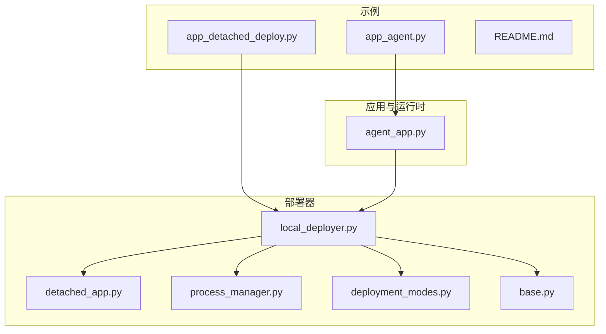
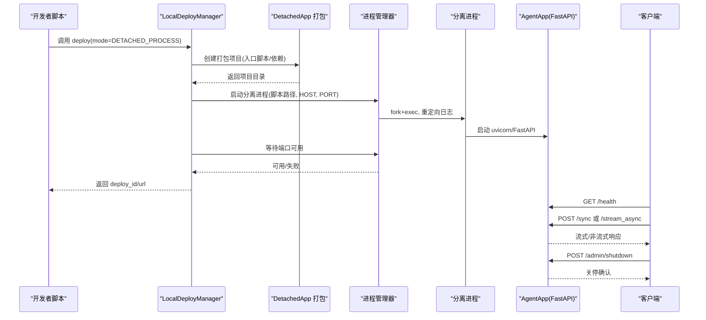
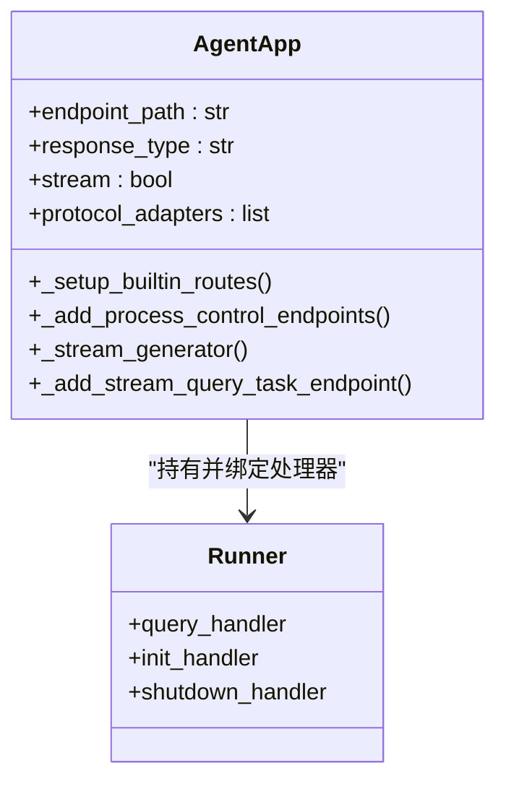
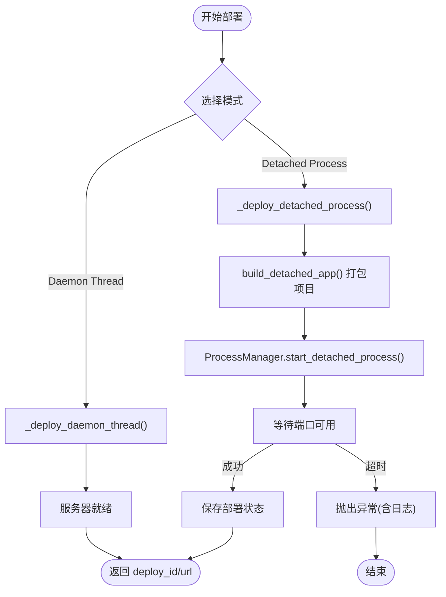
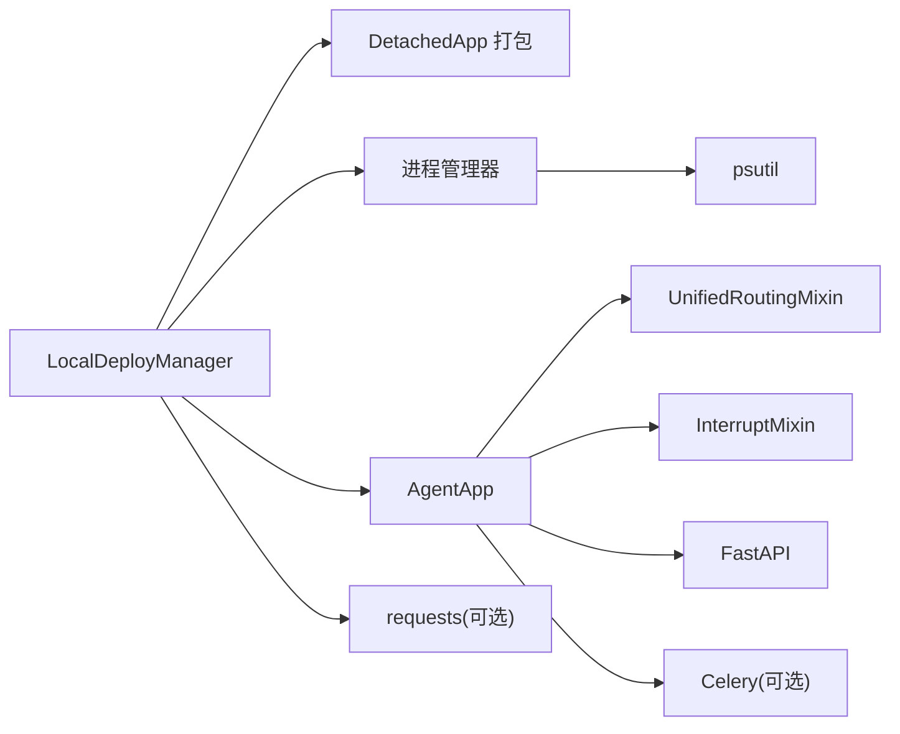

# 分离式部署

<cite>
**本文引用的文件**
- [examples/detached_local_deploy/app_detached_deploy.py](file://examples/detached_local_deploy/app_detached_deploy.py)
- [examples/detached_local_deploy/app_agent.py](file://examples/detached_local_deploy/app_agent.py)
- [examples/detached_local_deploy/README.md](file://examples/detached_local_deploy/README.md)
- [src/agentscope_runtime/engine/deployers/local_deployer.py](file://src/agentscope_runtime/engine/deployers/local_deployer.py)
- [src/agentscope_runtime/engine/deployers/utils/detached_app.py](file://src/agentscope_runtime/engine/deployers/utils/detached_app.py)
- [src/agentscope_runtime/engine/deployers/utils/service_utils/process_manager.py](file://src/agentscope_runtime/engine/deployers/utils/service_utils/process_manager.py)
- [src/agentscope_runtime/engine/app/agent_app.py](file://src/agentscope_runtime/engine/app/agent_app.py)
- [src/agentscope_runtime/engine/deployers/base.py](file://src/agentscope_runtime/engine/deployers/base.py)
- [src/agentscope_runtime/engine/deployers/utils/deployment_modes.py](file://src/agentscope_runtime/engine/deployers/utils/deployment_modes.py)
- [examples/deployments/local_deploy_config.yaml](file://examples/deployments/local_deploy_config.yaml)
- [examples/deployments/agentrun_deploy_config.yaml](file://examples/deployments/agentrun_deploy_config.yaml)
- [cookbook/en/advanced_deployment.md](file://cookbook/en/advanced_deployment.md)
</cite>

## 目录
1. [引言](#引言)
2. [项目结构](#项目结构)
3. [核心组件](#核心组件)
4. [架构总览](#架构总览)
5. [详细组件分析](#详细组件分析)
6. [依赖分析](#依赖分析)
7. [性能考虑](#性能考虑)
8. [故障排除指南](#故障排除指南)
9. [结论](#结论)
10. [附录](#附录)

## 引言
本章节面向“分离式部署模式”，系统阐述 Agent 与 App 的解耦架构：Agent 负责推理与工具调用，App 提供统一的 FastAPI 服务接口与生命周期管理；通过本地分离式部署（Detached Process），实现 AgentApp 独立运行于分离进程，支持远程健康检查、流式对话、任务队列与优雅关停等生产级能力。本文将从概念、实现原理、配置示例、进程通信与状态同步、错误恢复到部署流程与运维监控，给出完整说明。

## 项目结构
围绕分离式部署的关键目录与文件如下：
- 示例应用与部署脚本
  - examples/detached_local_deploy/app_agent.py：定义 AgentApp 及其查询、初始化、关闭钩子
  - examples/detached_local_deploy/app_detached_deploy.py：使用 LocalDeployManager 将 AgentApp 部署为分离进程
  - examples/detached_local_deploy/README.md：部署示例说明、端点清单、测试命令与差异对比
- 核心部署与运行时
  - src/agentscope_runtime/engine/app/agent_app.py：AgentApp 统一 FastAPI 应用，内置健康检查、信息发现、流式输出、任务队列、进程控制端点
  - src/agentscope_runtime/engine/deployers/local_deployer.py：LocalDeployManager 支持 Daemon Thread 与 Detached Process 两种模式
  - src/agentscope_runtime/engine/deployers/utils/detached_app.py：打包 AgentApp 为可执行包，生成入口脚本与元数据
  - src/agentscope_runtime/engine/deployers/utils/service_utils/process_manager.py：分离进程生命周期管理（启动/关停/日志/端口等待）
  - src/agentscope_runtime/engine/deployers/base.py：DeployManager 抽象基类
  - src/agentscope_runtime/engine/deployers/utils/deployment_modes.py：部署模式枚举
- 配置示例
  - examples/deployments/local_deploy_config.yaml：本地部署配置模板
  - examples/deployments/agentrun_deploy_config.yaml：AgentRun 平台部署配置模板
- 文档参考
  - cookbook/en/advanced_deployment.md：高级部署方法与分离式部署要点

**图表来源**
- [examples/detached_local_deploy/app_detached_deploy.py:52-120](file://examples/detached_local_deploy/app_detached_deploy.py#L52-L120)
- [src/agentscope_runtime/engine/deployers/local_deployer.py:27-174](file://src/agentscope_runtime/engine/deployers/local_deployer.py#L27-L174)
- [src/agentscope_runtime/engine/deployers/utils/detached_app.py:40-143](file://src/agentscope_runtime/engine/deployers/utils/detached_app.py#L40-L143)
- [src/agentscope_runtime/engine/deployers/utils/service_utils/process_manager.py:12-121](file://src/agentscope_runtime/engine/deployers/utils/service_utils/process_manager.py#L12-L121)
- [src/agentscope_runtime/engine/app/agent_app.py:60-422](file://src/agentscope_runtime/engine/app/agent_app.py#L60-L422)

**章节来源**
- [examples/detached_local_deploy/README.md:1-222](file://examples/detached_local_deploy/README.md#L1-L222)
- [cookbook/en/advanced_deployment.md:248-374](file://cookbook/en/advanced_deployment.md#L248-L374)

## 核心组件
- AgentApp（App 层）
  - 基于 FastAPI，提供统一的推理与流式输出接口，内置健康检查、信息发现、任务队列与进程控制端点
  - 支持多协议适配器（A2A、ResponseAPI、AGUI）与中断后端（本地/Redis）
- LocalDeployManager（部署层）
  - 支持 Daemon Thread 与 Detached Process 模式；在分离式部署中负责打包、启动分离进程、等待可用、关停与状态管理
- DetachedApp 打包工具
  - 将 AgentApp/Runner/入口脚本打包为可执行包，生成部署所需的入口脚本与元数据
- 进程管理器
  - 启动分离进程、记录日志、等待端口可用、优雅关停、清理 PID/日志文件
- 部署模式枚举
  - 明确区分不同部署模式，便于统一调度与状态判断

**章节来源**
- [src/agentscope_runtime/engine/app/agent_app.py:60-422](file://src/agentscope_runtime/engine/app/agent_app.py#L60-L422)
- [src/agentscope_runtime/engine/deployers/local_deployer.py:27-174](file://src/agentscope_runtime/engine/deployers/local_deployer.py#L27-L174)
- [src/agentscope_runtime/engine/deployers/utils/detached_app.py:40-143](file://src/agentscope_runtime/engine/deployers/utils/detached_app.py#L40-L143)
- [src/agentscope_runtime/engine/deployers/utils/service_utils/process_manager.py:12-121](file://src/agentscope_runtime/engine/deployers/utils/service_utils/process_manager.py#L12-L121)
- [src/agentscope_runtime/engine/deployers/utils/deployment_modes.py:7-15](file://src/agentscope_runtime/engine/deployers/utils/deployment_modes.py#L7-L15)

## 架构总览
分离式部署的核心思想是：App（AgentApp）作为服务容器，Agent 逻辑作为推理与工具调用的执行体，二者通过统一的 FastAPI 接口解耦。部署时，LocalDeployManager 将 App 打包为独立可执行包，并以分离进程方式启动；AgentApp 在该进程中完成生命周期管理、路由注册、流式输出与任务处理；客户端通过 HTTP 端点访问服务，支持健康检查、同步/异步/流式对话以及后台任务提交。

**图表来源**
- [src/agentscope_runtime/engine/deployers/local_deployer.py:260-382](file://src/agentscope_runtime/engine/deployers/local_deployer.py#L260-L382)
- [src/agentscope_runtime/engine/deployers/utils/detached_app.py:40-143](file://src/agentscope_runtime/engine/deployers/utils/detached_app.py#L40-L143)
- [src/agentscope_runtime/engine/deployers/utils/service_utils/process_manager.py:25-121](file://src/agentscope_runtime/engine/deployers/utils/service_utils/process_manager.py#L25-L121)
- [src/agentscope_runtime/engine/app/agent_app.py:382-422](file://src/agentscope_runtime/engine/app/agent_app.py#L382-L422)

## 详细组件分析

### AgentApp（App 服务）
- 生命周期与中间件
  - 使用 FastAPI 的 lifespan 管理 Runner 初始化/清理，支持 before_start/after_finish 钩子
  - 中间件根据部署模式设置响应头，便于识别分离式进程
- 内置端点
  - /health：健康检查
  - /：服务信息与端点清单
  - /admin/shutdown：远程优雅关停
  - /admin/status：进程状态查询
- 流式与任务
  - _stream_generator/_common_stream_generator 提供标准 SSE 输出
  - _add_stream_query_task_endpoint 注册后台任务端点，支持 Celery 或内存模式
- 协议适配与中断
  - 支持 A2A/ResponseAPI/AGUI 协议适配器
  - 中断后端可选本地或 Redis，用于分布式中断

**图表来源**
- [src/agentscope_runtime/engine/app/agent_app.py:60-422](file://src/agentscope_runtime/engine/app/agent_app.py#L60-L422)

**章节来源**
- [src/agentscope_runtime/engine/app/agent_app.py:60-422](file://src/agentscope_runtime/engine/app/agent_app.py#L60-L422)

### LocalDeployManager（部署管理器）
- 模式选择
  - DAEMON_THREAD：主线程阻塞运行，适合开发测试
  - DETACHED_PROCESS：分离进程运行，适合单机生产
- 关键流程
  - _deploy_detached_process：打包项目、启动分离进程、等待端口可用、写入状态
  - stop：优先尝试 HTTP /shutdown，失败则直接进程关停
- 状态管理
  - 通过 DeployManager 抽象基类维护 deploy_id 与状态管理器

**图表来源**
- [src/agentscope_runtime/engine/deployers/local_deployer.py:68-174](file://src/agentscope_runtime/engine/deployers/local_deployer.py#L68-L174)
- [src/agentscope_runtime/engine/deployers/utils/detached_app.py:40-143](file://src/agentscope_runtime/engine/deployers/utils/detached_app.py#L40-L143)
- [src/agentscope_runtime/engine/deployers/utils/service_utils/process_manager.py:300-336](file://src/agentscope_runtime/engine/deployers/utils/service_utils/process_manager.py#L300-L336)

**章节来源**
- [src/agentscope_runtime/engine/deployers/local_deployer.py:27-174](file://src/agentscope_runtime/engine/deployers/local_deployer.py#L27-L174)

### DetachedApp 打包工具
- 功能
  - 解析入口脚本、抽取项目信息、解压部署包、追加依赖、写入元数据
  - 自动检测版本或构建本地 wheel，确保运行时一致性
- 入口脚本与元数据
  - 通过 bundle_meta.json 记录入口脚本名，便于运行时定位

**章节来源**
- [src/agentscope_runtime/engine/deployers/utils/detached_app.py:40-143](file://src/agentscope_runtime/engine/deployers/utils/detached_app.py#L40-L143)

### 进程管理器
- 能力
  - 启动分离进程（fork/exec，新会话，重定向日志）
  - 等待端口可用（兼容 0.0.0.0 绑定）
  - 优雅关停（SIGTERM + 超时强制 kill）
  - PID 文件与日志文件管理（创建/读取/清理）
  - 查询进程状态与资源占用

**章节来源**
- [src/agentscope_runtime/engine/deployers/utils/service_utils/process_manager.py:12-441](file://src/agentscope_runtime/engine/deployers/utils/service_utils/process_manager.py#L12-L441)

### 部署模式枚举与抽象基类
- DeploymentMode：统一标识不同部署模式
- DeployManager：定义 deploy/stop 抽象接口，统一状态管理

**章节来源**
- [src/agentscope_runtime/engine/deployers/utils/deployment_modes.py:7-15](file://src/agentscope_runtime/engine/deployers/utils/deployment_modes.py#L7-L15)
- [src/agentscope_runtime/engine/deployers/base.py:9-43](file://src/agentscope_runtime/engine/deployers/base.py#L9-L43)

## 依赖分析
- 组件耦合
  - LocalDeployManager 依赖 DetachedApp 打包工具与进程管理器，同时与 AgentApp 解耦（通过 Runner/协议适配器）
  - AgentApp 通过 Mixin（UnifiedRoutingMixin、InterruptMixin）扩展路由与中断能力
- 外部依赖
  - uvicorn/FastAPI：服务运行时
  - Celery：后台任务队列（可选）
  - psutil：进程状态查询
  - requests：HTTP 关停请求（在某些场景）

**图表来源**
- [src/agentscope_runtime/engine/deployers/local_deployer.py:27-174](file://src/agentscope_runtime/engine/deployers/local_deployer.py#L27-L174)
- [src/agentscope_runtime/engine/app/agent_app.py:48-51](file://src/agentscope_runtime/engine/app/agent_app.py#L48-L51)

**章节来源**
- [src/agentscope_runtime/engine/deployers/local_deployer.py:27-174](file://src/agentscope_runtime/engine/deployers/local_deployer.py#L27-L174)
- [src/agentscope_runtime/engine/app/agent_app.py:48-51](file://src/agentscope_runtime/engine/app/agent_app.py#L48-L51)

## 性能考虑
- 分离进程带来的额外内存/CPU 开销需纳入资源规划
- 流式输出与任务队列建议配合 Celery 后端，避免阻塞主服务
- 日志落盘与旧日志清理应结合磁盘空间策略，避免长期积累
- 端口等待与健康检查应设置合理超时，避免阻塞部署流程

## 故障排除指南
- 服务未在超时内可用
  - 检查进程是否启动（PID 文件与日志）
  - 查看最近日志（进程管理器提供日志读取）
  - 确认 HOST/PORT 是否被占用
- 进程异常退出
  - 通过进程管理器读取日志定位问题
  - 检查环境变量与依赖安装
- 远程关停无效
  - Daemon Thread 模式不支持 HTTP 关停，需直接关停进程
  - 分离进程模式可通过 /admin/shutdown 触发，失败时回退到直接关停

**章节来源**
- [src/agentscope_runtime/engine/deployers/local_deployer.py:415-510](file://src/agentscope_runtime/engine/deployers/local_deployer.py#L415-L510)
- [src/agentscope_runtime/engine/deployers/utils/service_utils/process_manager.py:338-365](file://src/agentscope_runtime/engine/deployers/utils/service_utils/process_manager.py#L338-L365)
- [examples/detached_local_deploy/README.md:180-205](file://examples/detached_local_deploy/README.md#L180-L205)

## 结论
分离式部署通过 AgentApp 与 Agent 的职责分离，结合 LocalDeployManager 的打包与进程管理能力，实现了生产级的独立服务部署。其优势在于进程隔离、远程关停、统一接口与可扩展的协议适配。配合合理的配置与监控，可在单机生产环境中稳定运行。

## 附录

### 部署配置示例
- 本地部署配置（示例）
  - 主机与端口、可选入口脚本、环境变量（如 API Key、日志级别）
- AgentRun 平台部署配置（示例）
  - 名称、区域、CPU/内存、环境变量（含平台鉴权）

**章节来源**
- [examples/deployments/local_deploy_config.yaml:1-16](file://examples/deployments/local_deploy_config.yaml#L1-L16)
- [examples/deployments/agentrun_deploy_config.yaml:1-28](file://examples/deployments/agentrun_deploy_config.yaml#L1-L28)

### 端点与测试命令
- 健康检查：GET /health
- 同步/异步/流式对话：POST /sync、POST /async、POST /stream_async
- 后台任务：POST /process/task、GET /process/task/{task_id}
- 进程控制：POST /admin/shutdown、GET /admin/status

**章节来源**
- [examples/detached_local_deploy/README.md:44-136](file://examples/detached_local_deploy/README.md#L44-L136)
- [src/agentscope_runtime/engine/app/agent_app.py:382-422](file://src/agentscope_runtime/engine/app/agent_app.py#L382-L422)

### 部署流程与最佳实践
- 使用 LocalDeployManager(Detached Process) 完成分离式部署
- 在 AgentApp 中注册查询/初始化/关闭钩子，确保生命周期一致
- 通过 /health 与 /admin/status 实现健康检查与状态监控
- 生产环境建议开启 Celery 后台任务与 Redis 中断后端，提升稳定性与可观测性

**章节来源**
- [cookbook/en/advanced_deployment.md:335-374](file://cookbook/en/advanced_deployment.md#L335-L374)
- [examples/detached_local_deploy/app_detached_deploy.py:52-120](file://examples/detached_local_deploy/app_detached_deploy.py#L52-L120)