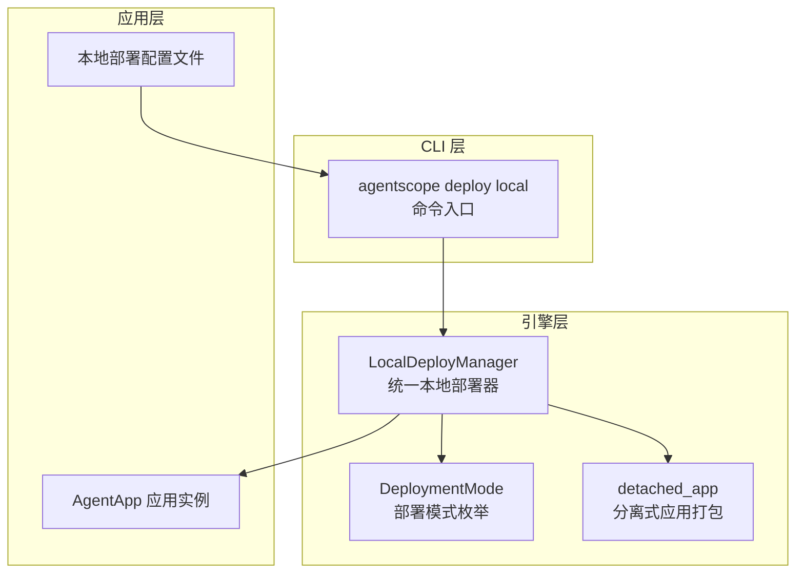
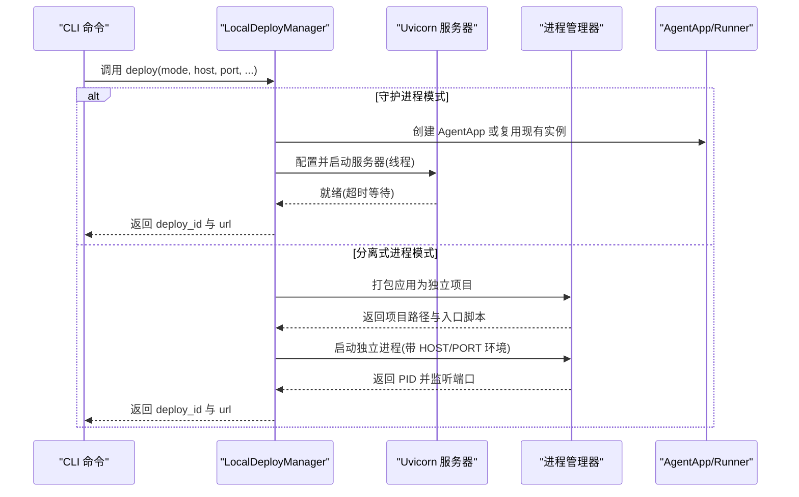
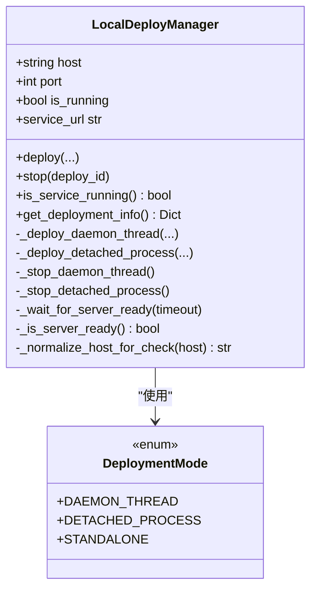
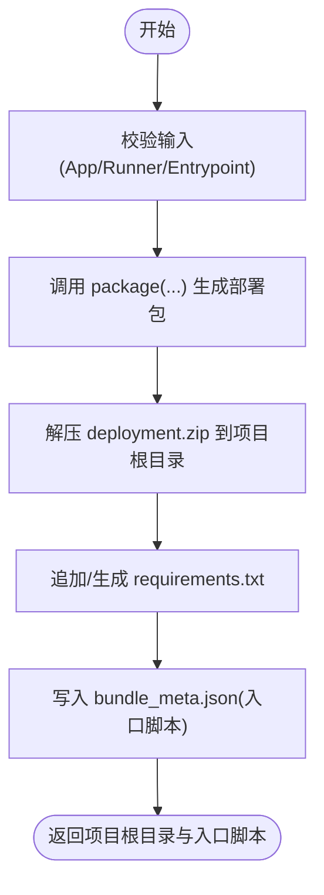
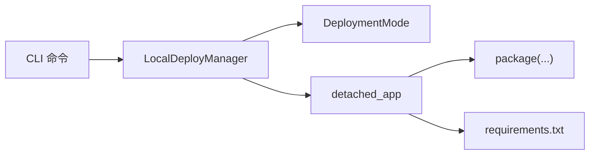

# 本地部署

<cite>
**本文引用的文件**
- [local_deployer.py](file://src/agentscope_runtime/engine/deployers/local_deployer.py)
- [deployment_modes.py](file://src/agentscope_runtime/engine/deployers/utils/deployment_modes.py)
- [detached_app.py](file://src/agentscope_runtime/engine/deployers/utils/detached_app.py)
- [deploy.py](file://src/agentscope_runtime/cli/commands/deploy.py)
- [local_deploy_config.yaml](file://examples/deployments/local_deploy_config.yaml)
- [daemon_local_deploy/README.md](file://examples/deployments/daemon_local_deploy/README.md)
- [detached_local_deploy/README.md](file://examples/deployments/detached_local_deploy/README.md)
- [daemon_local_deploy/app_deploy.py](file://examples/deployments/daemon_local_deploy/app_deploy.py)
- [detached_local_deploy/app_detached_deploy.py](file://examples/deployments/detached_local_deploy/app_detached_deploy.py)
- [detached_local_deploy/app_agent.py](file://examples/deployments/detached_local_deploy/app_agent.py)
</cite>

## 目录
1. [简介](#简介)
2. [项目结构](#项目结构)
3. [核心组件](#核心组件)
4. [架构总览](#架构总览)
5. [详细组件分析](#详细组件分析)
6. [依赖分析](#依赖分析)
7. [性能考虑](#性能考虑)
8. [故障排查指南](#故障排查指南)
9. [结论](#结论)
10. [附录](#附录)

## 简介
本章节面向“本地部署”模式，系统性阐述其工作原理、配置方法与使用场景，并重点解析 LocalDeployManager 的实现机制（进程管理、端口分配、资源隔离），提供完整的配置示例与最佳实践。同时对比“守护进程模式（daemon thread）”与“前台模式”的差异，给出本地开发环境设置、调试技巧与常见问题解决方案，并补充性能优化与资源监控建议。

## 项目结构
本地部署能力由运行时引擎中的部署器模块提供，配合 CLI 命令与示例工程，形成从命令行到应用级部署的一体化体验。关键目录与文件如下：
- 引擎部署器：LocalDeployManager 及其工具集（部署模式、打包与分离式应用构建）
- CLI 命令：agentscope deploy local 的入口与参数解析
- 示例工程：守护进程与分离式进程两种部署模式的完整用法与测试命令

图表来源
- [deploy.py:1-200](file://src/agentscope_runtime/cli/commands/deploy.py#L1-L200)
- [local_deployer.py:1-120](file://src/agentscope_runtime/engine/deployers/local_deployer.py#L1-L120)
- [deployment_modes.py:1-15](file://src/agentscope_runtime/engine/deployers/utils/deployment_modes.py#L1-L15)
- [detached_app.py:1-120](file://src/agentscope_runtime/engine/deployers/utils/detached_app.py#L1-L120)

章节来源
- [deploy.py:1-200](file://src/agentscope_runtime/cli/commands/deploy.py#L1-L200)
- [local_deployer.py:1-120](file://src/agentscope_runtime/engine/deployers/local_deployer.py#L1-L120)
- [deployment_modes.py:1-15](file://src/agentscope_runtime/engine/deployers/utils/deployment_modes.py#L1-L15)
- [detached_app.py:1-120](file://src/agentscope_runtime/engine/deployers/utils/detached_app.py#L1-L120)

## 核心组件
- LocalDeployManager：统一的本地部署器，支持守护进程模式与分离式进程模式，负责服务启动、停止、状态查询与资源清理。
- DeploymentMode：部署模式枚举，定义守护线程模式与分离式进程模式等。
- detached_app：分离式应用打包工具，负责将应用或 Runner 打包为可独立执行的项目，包含入口脚本、依赖清单与元数据。
- CLI deploy local：命令行入口，解析配置文件与环境变量，调用 LocalDeployManager 完成部署。

章节来源
- [local_deployer.py:27-120](file://src/agentscope_runtime/engine/deployers/local_deployer.py#L27-L120)
- [deployment_modes.py:7-15](file://src/agentscope_runtime/engine/deployers/utils/deployment_modes.py#L7-L15)
- [detached_app.py:40-144](file://src/agentscope_runtime/engine/deployers/utils/detached_app.py#L40-L144)
- [deploy.py:398-434](file://src/agentscope_runtime/cli/commands/deploy.py#L398-L434)

## 架构总览
本地部署采用“统一 FastAPI 架构”，通过 LocalDeployManager 在本地以不同模式运行服务：
- 守护进程模式：在主线程中启动 uvicorn 服务器，阻塞直至手动停止。
- 分离式进程模式：将应用打包为独立项目，启动独立进程，支持远程关闭与进程状态管理。

图表来源
- [local_deployer.py:68-174](file://src/agentscope_runtime/engine/deployers/local_deployer.py#L68-L174)
- [local_deployer.py:175-258](file://src/agentscope_runtime/engine/deployers/local_deployer.py#L175-L258)
- [local_deployer.py:260-382](file://src/agentscope_runtime/engine/deployers/local_deployer.py#L260-L382)
- [detached_app.py:40-144](file://src/agentscope_runtime/engine/deployers/utils/detached_app.py#L40-L144)

## 详细组件分析

### LocalDeployManager 实现机制
- 进程管理
  - 守护进程模式：在独立线程中运行 uvicorn 服务器，支持优雅停止与超时控制。
  - 分离式进程模式：通过进程管理器启动独立进程，记录 PID 文件，支持远程关闭与日志清理。
- 端口分配
  - 支持自定义 host 与 port；当绑定地址为 0.0.0.0/:: 时，连接检查会自动转换为 127.0.0.1。
- 资源隔离
  - 分离式进程模式下，应用运行在独立进程中，避免与主程序共享资源；守护进程模式与主程序共享进程空间。
- 生命周期管理
  - 提供部署、停止、状态查询与清理接口；支持从状态管理器恢复部署信息。

图表来源
- [local_deployer.py:27-120](file://src/agentscope_runtime/engine/deployers/local_deployer.py#L27-L120)
- [local_deployer.py:175-258](file://src/agentscope_runtime/engine/deployers/local_deployer.py#L175-L258)
- [local_deployer.py:260-382](file://src/agentscope_runtime/engine/deployers/local_deployer.py#L260-L382)
- [deployment_modes.py:7-15](file://src/agentscope_runtime/engine/deployers/utils/deployment_modes.py#L7-L15)

章节来源
- [local_deployer.py:27-120](file://src/agentscope_runtime/engine/deployers/local_deployer.py#L27-L120)
- [local_deployer.py:175-258](file://src/agentscope_runtime/engine/deployers/local_deployer.py#L175-L258)
- [local_deployer.py:260-382](file://src/agentscope_runtime/engine/deployers/local_deployer.py#L260-L382)
- [local_deployer.py:597-607](file://src/agentscope_runtime/engine/deployers/local_deployer.py#L597-L607)
- [local_deployer.py:609-637](file://src/agentscope_runtime/engine/deployers/local_deployer.py#L609-L637)

### 分离式应用打包流程
- 输入：AgentApp/Runner 或入口脚本路径
- 处理：生成打包目录、解压部署包、写入需求清单、注入元数据
- 输出：可独立运行的项目根目录与入口脚本

图表来源
- [detached_app.py:40-144](file://src/agentscope_runtime/engine/deployers/utils/detached_app.py#L40-L144)

章节来源
- [detached_app.py:40-144](file://src/agentscope_runtime/engine/deployers/utils/detached_app.py#L40-L144)

### CLI 命令与配置
- CLI 入口：agentscope deploy local
- 参数解析：支持从配置文件与环境变量合并，自动推断入口脚本，选择分离式进程模式进行部署
- 环境变量：可通过配置文件与 CLI 覆盖，优先级为 CLI > 配置文件 > 默认值

章节来源
- [deploy.py:398-434](file://src/agentscope_runtime/cli/commands/deploy.py#L398-L434)
- [local_deploy_config.yaml:1-16](file://examples/deployments/local_deploy_config.yaml#L1-L16)

### 守护进程模式 vs 前台模式
- 守护进程模式（daemon thread）
  - 特点：在主线程中启动服务器，阻塞直至手动停止；适合开发调试与快速验证
  - 适用：本地开发、联调、单机测试
- 分离式进程模式（detached process）
  - 特点：启动独立进程，脚本退出后服务仍运行；支持远程关闭与进程状态查询
  - 适用：生产单节点部署、需要后台常驻的服务

章节来源
- [daemon_local_deploy/README.md:1-316](file://examples/deployments/daemon_local_deploy/README.md#L1-L316)
- [detached_local_deploy/README.md:1-222](file://examples/deployments/detached_local_deploy/README.md#L1-L222)

## 依赖分析
- 组件耦合
  - LocalDeployManager 依赖 DeploymentMode 与 detached_app 工具链
  - CLI deploy local 依赖 LocalDeployManager，并负责参数解析与环境变量合并
- 外部依赖
  - uvicorn：异步 WSGI 服务器
  - psutil/redis/celery：进程管理、状态存储与任务队列（在分离式应用打包阶段注入）

图表来源
- [deploy.py:24-29](file://src/agentscope_runtime/cli/commands/deploy.py#L24-L29)
- [local_deployer.py:14-25](file://src/agentscope_runtime/engine/deployers/local_deployer.py#L14-L25)
- [detached_app.py:18-25](file://src/agentscope_runtime/engine/deployers/utils/detached_app.py#L18-L25)

章节来源
- [deploy.py:24-29](file://src/agentscope_runtime/cli/commands/deploy.py#L24-L29)
- [local_deployer.py:14-25](file://src/agentscope_runtime/engine/deployers/local_deployer.py#L14-L25)
- [detached_app.py:18-25](file://src/agentscope_runtime/engine/deployers/utils/detached_app.py#L18-L25)

## 性能考虑
- 端口占用与并发
  - 合理规划端口，避免冲突；在多实例场景下使用不同端口
- 进程模型选择
  - 开发阶段优先守护进程模式，便于调试；生产单节点推荐分离式进程模式，便于进程管理
- 超时与优雅停机
  - 使用合理的启动与关闭超时，确保服务稳定过渡
- 日志与监控
  - 分离式进程模式下，关注日志文件与进程状态；结合系统监控工具观察 CPU/内存占用

## 故障排查指南
- 端口被占用
  - 检查端口占用并更换端口，或释放占用进程
- 服务未就绪
  - 检查启动超时与主机绑定地址（0.0.0.0/:: 会被规范化为 127.0.0.1 进行连通性检测）
- 分离式进程异常退出
  - 查看进程 PID 文件与日志文件；必要时手动终止残留进程
- 远程关闭失败
  - 守护进程模式不支持 HTTP 关闭（会杀死主线程），需直接停止；分离式进程模式支持 /admin/shutdown

章节来源
- [local_deployer.py:597-607](file://src/agentscope_runtime/engine/deployers/local_deployer.py#L597-L607)
- [local_deployer.py:566-596](file://src/agentscope_runtime/engine/deployers/local_deployer.py#L566-L596)
- [detached_local_deploy/README.md:180-206](file://examples/deployments/detached_local_deploy/README.md#L180-L206)

## 结论
本地部署提供了灵活的两种模式：守护进程模式适合开发与调试，分离式进程模式适合生产单节点常驻服务。通过 LocalDeployManager 的统一抽象与 CLI 的便捷入口，开发者可以快速完成本地部署、远程管理与问题定位。建议在开发阶段使用守护进程模式，在生产环境中采用分离式进程模式并配套完善的监控与日志策略。

## 附录

### 本地部署配置示例
- 配置文件格式与字段
  - host：监听地址（默认 127.0.0.1）
  - port：监听端口（默认 8090）
  - environment：环境变量字典（如 PYTHONPATH、LOG_LEVEL、第三方 API 密钥等）
- CLI 使用方式
  - agentscope deploy local /path/to/source --config local_deploy_config.yaml
  - CLI 会自动解析配置文件与环境变量，选择分离式进程模式部署

章节来源
- [local_deploy_config.yaml:1-16](file://examples/deployments/local_deploy_config.yaml#L1-L16)
- [deploy.py:398-434](file://src/agentscope_runtime/cli/commands/deploy.py#L398-L434)

### 使用场景与最佳实践
- 开发与联调：守护进程模式，便于实时调试与快速迭代
- 生产单节点：分离式进程模式，支持远程关闭与进程管理
- 环境变量：优先通过 CLI 覆盖配置文件中的环境变量
- 端口规划：避免冲突，必要时启用随机端口或容器编排

章节来源
- [daemon_local_deploy/README.md:173-286](file://examples/deployments/daemon_local_deploy/README.md#L173-L286)
- [detached_local_deploy/README.md:138-172](file://examples/deployments/detached_local_deploy/README.md#L138-L172)

### 本地开发环境设置与调试技巧
- 设置 API 密钥与日志级别
- 使用守护进程模式进行交互式调试
- 使用 curl 或浏览器访问健康检查与业务端点
- 记录并分析日志输出，定位问题

章节来源
- [daemon_local_deploy/README.md:16-316](file://examples/deployments/daemon_local_deploy/README.md#L16-L316)
- [detached_local_deploy/README.md:16-222](file://examples/deployments/detached_local_deploy/README.md#L16-L222)

### 测试与示例参考
- 守护进程示例：包含多种端点与任务处理，演示完整生命周期
- 分离式进程示例：展示远程关闭与端到端测试命令
- 单元测试：覆盖响应式 API、A2A 协议适配与上下文行为

章节来源
- [daemon_local_deploy/app_deploy.py:1-129](file://examples/deployments/daemon_local_deploy/app_deploy.py#L1-L129)
- [detached_local_deploy/app_detached_deploy.py:1-125](file://examples/deployments/detached_local_deploy/app_detached_deploy.py#L1-L125)
- [detached_local_deploy/app_agent.py:1-87](file://examples/deployments/detached_local_deploy/app_agent.py#L1-L87)