# 部署模式

<cite>
**本文引用的文件**
- [deployers/__init__.py](file://src/agentscope_runtime/engine/deployers/__init__.py)
- [deployers/base.py](file://src/agentscope_runtime/engine/deployers/base.py)
- [deployers/local_deployer.py](file://src/agentscope_runtime/engine/deployers/local_deployer.py)
- [deployers/kubernetes_deployer.py](file://src/agentscope_runtime/engine/deployers/kubernetes_deployer.py)
- [deployers/agentrun_deployer.py](file://src/agentscope_runtime/engine/deployers/agentrun_deployer.py)
- [deployers/knative_deployer.py](file://src/agentscope_runtime/engine/deployers/knative_deployer.py)
- [deployers/kruise_deployer.py](file://src/agentscope_runtime/engine/deployers/kruise_deployer.py)
- [deployers/fc_deployer.py](file://src/agentscope_runtime/engine/deployers/fc_deployer.py)
- [deployers/modelstudio_deployer.py](file://src/agentscope_runtime/engine/deployers/modelstudio_deployer.py)
- [deployers/pai_deployer.py](file://src/agentscope_runtime/engine/deployers/pai_deployer.py)
- [deployers/utils/deployment_modes.py](file://src/agentscope_runtime/engine/deployers/utils/deployment_modes.py)
- [examples/deployments/agentrun_deploy_config.yaml](file://examples/deployments/agentrun_deploy_config.yaml)
- [examples/deployments/local_deploy_config.yaml](file://examples/deployments/local_deploy_config.yaml)
- [examples/deployments/modelstudio_deploy_config.yaml](file://examples/deployments/modelstudio_deploy_config.yaml)
- [examples/deployments/pai_deploy_config.yaml](file://examples/deployments/pai_deploy_config.yaml)
</cite>

## 目录
1. [简介](#简介)
2. [项目结构](#项目结构)
3. [核心组件](#核心组件)
4. [架构总览](#架构总览)
5. [详细组件分析](#详细组件分析)
6. [依赖分析](#依赖分析)
7. [性能考虑](#性能考虑)
8. [故障排除指南](#故障排除指南)
9. [结论](#结论)
10. [附录](#附录)

## 简介
本文件系统性阐述 AgentScope Runtime 支持的多种部署模式与实现方式，覆盖本地部署、Kubernetes 集群部署、Knative 服务、Kruise Sandbox、阿里云 AgentRun、阿里云函数计算（FC）、阿里云 ModelStudio 以及阿里云 PAI 等平台。文档从架构设计、容器化流程、资源管理、配置示例到性能优化与故障排除进行全链路说明，帮助用户从开发环境到生产环境构建稳定可靠的智能体服务。

## 项目结构
AgentScope Runtime 的部署体系以统一的 DeployManager 抽象为核心，各平台部署器通过适配器协议与通用打包工具完成镜像构建、资源编排与状态管理。部署器目录组织遵循“按平台分层”的原则，便于扩展与维护。

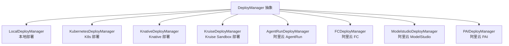

图表来源
- [deployers/__init__.py:18-51](file://src/agentscope_runtime/engine/deployers/__init__.py#L18-L51)
- [deployers/base.py:9-44](file://src/agentscope_runtime/engine/deployers/base.py#L9-L44)

章节来源
- [deployers/__init__.py:18-51](file://src/agentscope_runtime/engine/deployers/__init__.py#L18-L51)
- [deployers/base.py:9-44](file://src/agentscope_runtime/engine/deployers/base.py#L9-L44)

## 核心组件
- DeployManager 抽象基类：定义统一的部署接口与状态管理入口，所有部署器均继承该抽象，保证一致的生命周期与错误处理。
- 部署模式枚举：LocalDeployManager 支持两种本地模式（守护线程与分离进程），用于不同运行时需求。
- 平台部署器：针对不同云平台或集群方案提供专用实现，包括镜像构建、资源编排、端点暴露与状态查询等能力。
- 适配器与打包工具：协议适配器负责消息与流式响应转换；打包工具负责项目打包、wheel 构建与镜像生成。

章节来源
- [deployers/base.py:9-44](file://src/agentscope_runtime/engine/deployers/base.py#L9-L44)
- [deployers/utils/deployment_modes.py:7-15](file://src/agentscope_runtime/engine/deployers/utils/deployment_modes.py#L7-L15)

## 架构总览
下图展示部署器的整体架构与交互关系，突出容器化与资源编排的关键路径。

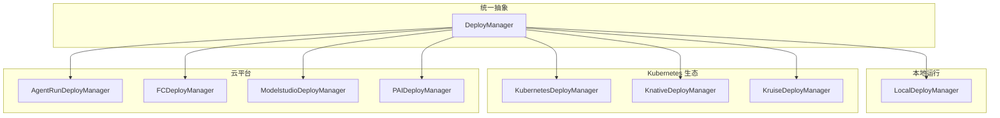

图表来源
- [deployers/__init__.py:18-51](file://src/agentscope_runtime/engine/deployers/__init__.py#L18-L51)
- [deployers/base.py:9-44](file://src/agentscope_runtime/engine/deployers/base.py#L9-L44)

## 详细组件分析

### 本地部署（LocalDeployManager）
- 模式
  - 守护线程模式：在当前进程中启动 uvicorn 服务器线程，适合开发调试与快速验证。
  - 分离进程模式：将应用打包为独立项目并通过进程管理器启动，适合需要隔离与持久化的场景。
- 关键流程
  - 应用构建：根据 runner 或 app 构建 FastAPI 应用实例。
  - 服务器启动：守护线程模式使用 uvicorn 配置启动；分离进程模式通过入口脚本启动。
  - 端口探测与健康检查：等待服务就绪后写入状态管理器。
  - 停止流程：优先尝试 HTTP /shutdown 接口优雅关闭，失败则回退到进程管理器强制停止。
- 适用场景
  - 开发联调、单机测试、低并发场景。
- 最佳实践
  - 明确 host/port 绑定，避免端口冲突。
  - 分离进程模式建议开启日志轮转与 PID 文件清理。
  - 使用协议适配器与自定义端点增强兼容性。

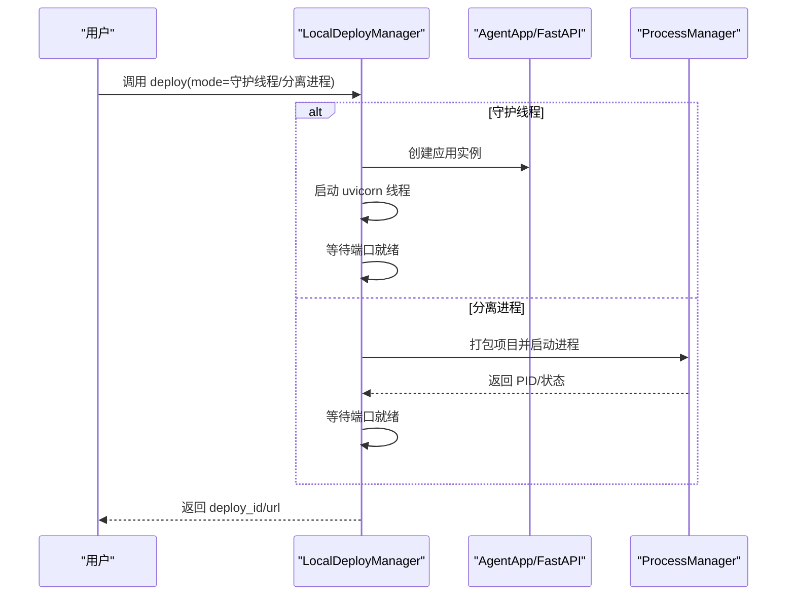

图表来源
- [deployers/local_deployer.py:175-258](file://src/agentscope_runtime/engine/deployers/local_deployer.py#L175-L258)
- [deployers/local_deployer.py:260-382](file://src/agentscope_runtime/engine/deployers/local_deployer.py#L260-L382)

章节来源
- [deployers/local_deployer.py:68-174](file://src/agentscope_runtime/engine/deployers/local_deployer.py#L68-L174)
- [deployers/local_deployer.py:175-382](file://src/agentscope_runtime/engine/deployers/local_deployer.py#L175-L382)

### Kubernetes 部署（KubernetesDeployManager）
- 特点
  - 自动镜像构建与推送至容器仓库。
  - 支持 Deployment/Service 编排，自动选择外部访问端点（考虑本地集群与云环境差异）。
  - 可配置副本数、环境变量、挂载目录与运行时参数。
- 关键流程
  - 镜像构建：基于项目与协议适配器生成镜像。
  - 资源创建：创建 Deployment 与 Service，并返回可访问 URL。
  - 状态查询：通过状态管理器读取部署状态。
- 适用场景
  - 中大型团队的标准化容器化部署，便于弹性扩缩容与多副本高可用。
- 最佳实践
  - 在本地集群中使用回退地址（127.0.0.1）解决 LoadBalancer 不可达问题。
  - 合理设置副本数与资源配额，结合 HPA/HPA 策略提升弹性。

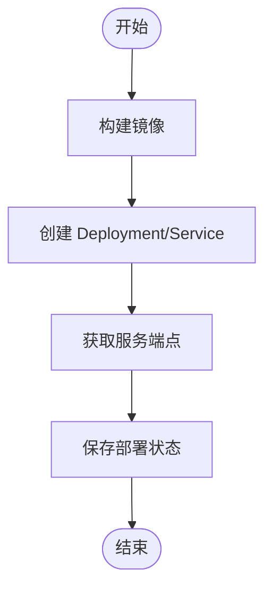

图表来源
- [deployers/kubernetes_deployer.py:126-302](file://src/agentscope_runtime/engine/deployers/kubernetes_deployer.py#L126-L302)

章节来源
- [deployers/kubernetes_deployer.py:126-302](file://src/agentscope_runtime/engine/deployers/kubernetes_deployer.py#L126-L302)

### Knative 部署（KnativeDeployManager）
- 特点
  - 基于 Knative Serving 的按需伸缩与自动扩缩容能力。
  - 支持注解与标签扩展，满足高级调度与观测需求。
- 关键流程
  - 镜像构建与 KService 创建。
  - 返回可访问 URL 并记录资源名。
- 适用场景
  - 事件驱动、低频突发流量、成本敏感型推理服务。
- 最佳实践
  - 合理设置并发与超时参数，避免冷启动抖动。
  - 使用注解控制路由与版本发布策略。

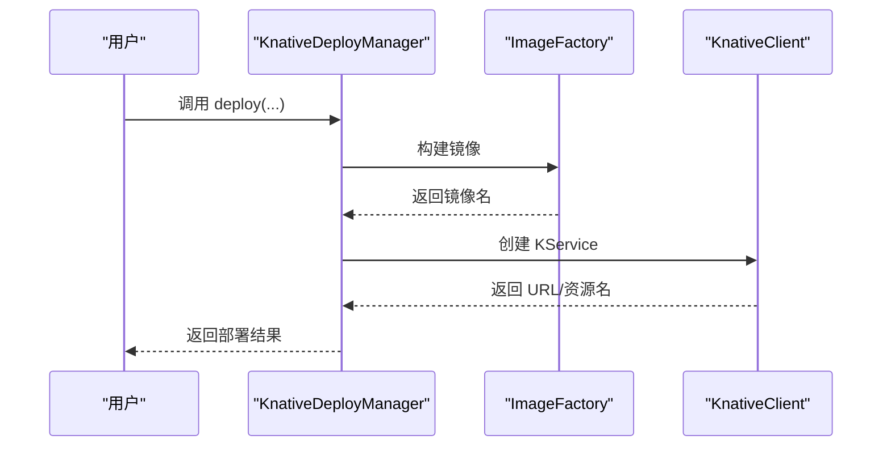

图表来源
- [deployers/knative_deployer.py:71-212](file://src/agentscope_runtime/engine/deployers/knative_deployer.py#L71-L212)

章节来源
- [deployers/knative_deployer.py:71-212](file://src/agentscope_runtime/engine/deployers/knative_deployer.py#L71-L212)

### Kruise 部署（KruiseDeployManager）
- 特点
  - 基于 Kruise Sandbox 的轻量级容器沙箱，适合需要更强隔离但又希望降低开销的场景。
  - 自动创建 Service 并支持外部访问。
- 关键流程
  - 镜像构建与 Sandbox CR 创建。
  - 创建 Service 获取外部访问地址。
- 适用场景
  - 多租户或多工作负载共享集群但需要强隔离。
- 最佳实践
  - 合理设置标签与注解，便于运维与审计。
  - 结合 VPC/安全组策略保障网络隔离。

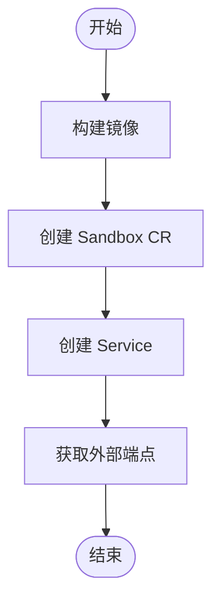

图表来源
- [deployers/kruise_deployer.py:138-339](file://src/agentscope_runtime/engine/deployers/kruise_deployer.py#L138-L339)

章节来源
- [deployers/kruise_deployer.py:138-339](file://src/agentscope_runtime/engine/deployers/kruise_deployer.py#L138-L339)

### 阿里云 AgentRun 部署（AgentRunDeployManager）
- 特点
  - 将项目打包为 wheel 并上传至 OSS，再通过 AgentRun 服务创建运行时与端点。
  - 支持公网/私网模式、VPC/交换机/安全组配置。
- 关键流程
  - 生成包装项目并构建 wheel。
  - Docker 内部安装依赖并打包为 zip。
  - 上传至 OSS 并触发 AgentRun 部署。
- 适用场景
  - 快速上线、无需关心底层容器编排。
- 最佳实践
  - 提前准备 OSS Bucket 与权限。
  - 合理设置会话并发与空闲超时，平衡成本与性能。

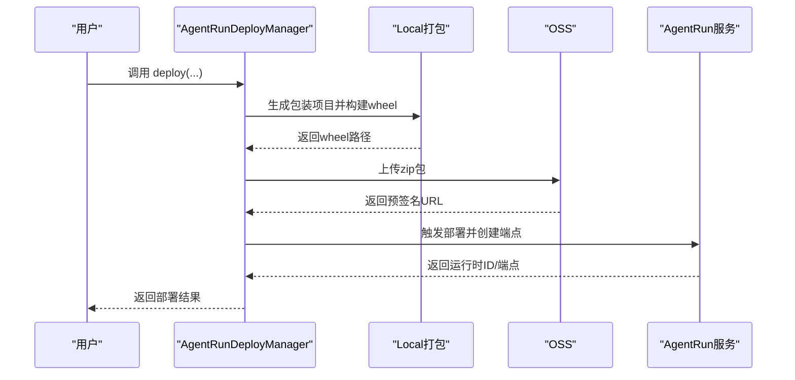

图表来源
- [deployers/agentrun_deployer.py:521-728](file://src/agentscope_runtime/engine/deployers/agentrun_deployer.py#L521-L728)

章节来源
- [deployers/agentrun_deployer.py:521-728](file://src/agentscope_runtime/engine/deployers/agentrun_deployer.py#L521-L728)

### 阿里云函数计算（FC）部署（FCDeployManager）
- 特点
  - 基于自定义运行时的函数式部署，支持会话亲和与 VPC 网络。
  - 支持更新现有函数与创建新函数。
- 关键流程
  - 生成包装项目并构建 wheel。
  - Docker 内部安装依赖并打包 zip。
  - 上传至 OSS 并创建/更新 FC 函数与 HTTP 触发器。
- 适用场景
  - 事件驱动、短时推理任务、按次付费。
- 最佳实践
  - 合理设置 CPU/内存/Disk，避免超时与 OOM。
  - 使用会话亲和保持长连接状态。

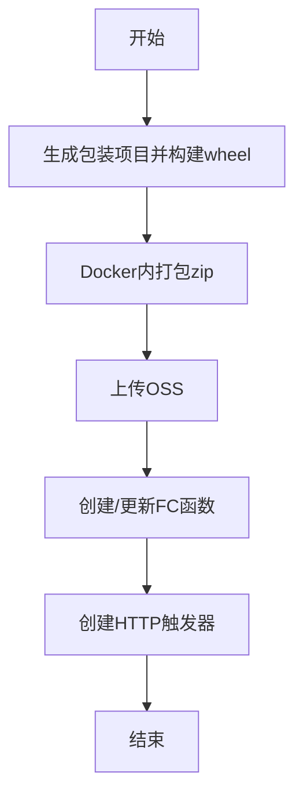

图表来源
- [deployers/fc_deployer.py:416-581](file://src/agentscope_runtime/engine/deployers/fc_deployer.py#L416-L581)

章节来源
- [deployers/fc_deployer.py:416-581](file://src/agentscope_runtime/engine/deployers/fc_deployer.py#L416-L581)

### 阿里云 ModelStudio 部署（ModelstudioDeployManager）
- 特点
  - 通过临时存储租约申请 OSS 预签名 URL，上传 wheel 并触发全代码部署。
  - 支持工作区权限与 DashScope API Key。
- 关键流程
  - 生成包装项目并构建 wheel。
  - 申请临时存储租约并上传至 OSS。
  - 调用 ModelStudio 高代码部署接口。
- 适用场景
  - 快速将本地项目部署为可管理的模型应用。
- 最佳实践
  - 确保 RAM 用户具备相应权限与工作区绑定。
  - 合理设置环境变量与部署名称。

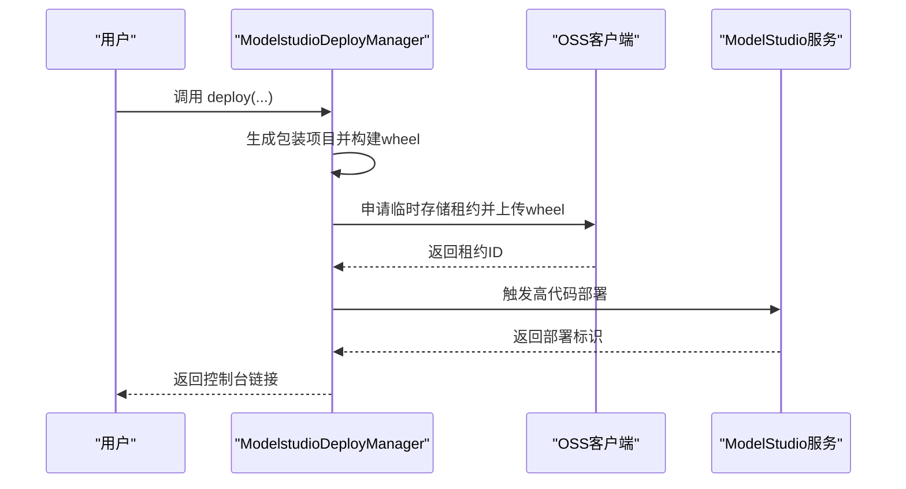

图表来源
- [deployers/modelstudio_deployer.py:727-750](file://src/agentscope_runtime/engine/deployers/modelstudio_deployer.py#L727-L750)
- [deployers/modelstudio_deployer.py:684-725](file://src/agentscope_runtime/engine/deployers/modelstudio_deployer.py#L684-L725)

章节来源
- [deployers/modelstudio_deployer.py:727-750](file://src/agentscope_runtime/engine/deployers/modelstudio_deployer.py#L727-L750)
- [deployers/modelstudio_deployer.py:684-725](file://src/agentscope_runtime/engine/deployers/modelstudio_deployer.py#L684-L725)

### 阿里云 PAI 部署（PAIDeployManager）
- 特点
  - 通过 LangStudio API 管理 Flow、快照与部署，支持多种资源类型（公共/资源组/配额）。
  - 支持 VPC、身份角色、可观测性与标签等高级配置。
- 关键流程
  - 解析配置（上下文/规格），生成构建工件。
  - 上传至 OSS 工作目录，创建 Flow 并打快照。
  - 基于快照创建部署，支持自动审批与阶段操作。
- 适用场景
  - 企业级 AI 工作流与服务编排，强调合规与治理。
- 最佳实践
  - 明确工作区与区域，合理设置资源类型与规格。
  - 使用标签进行成本归集与资源管理。

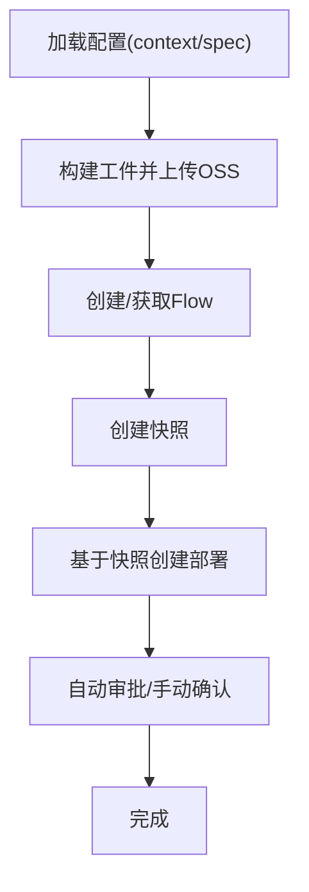

图表来源
- [deployers/pai_deployer.py:406-508](file://src/agentscope_runtime/engine/deployers/pai_deployer.py#L406-L508)

章节来源
- [deployers/pai_deployer.py:406-508](file://src/agentscope_runtime/engine/deployers/pai_deployer.py#L406-L508)

## 依赖分析
- 组件耦合
  - 所有部署器均依赖 DeployManager 抽象，保证统一的生命周期与状态管理。
  - 本地部署器与进程管理器存在直接耦合，分离进程模式依赖进程管理能力。
  - 云平台部署器依赖对应 SDK 客户端（如 OSS、K8s/Knative/Kruise 客户端）。
- 依赖可视化

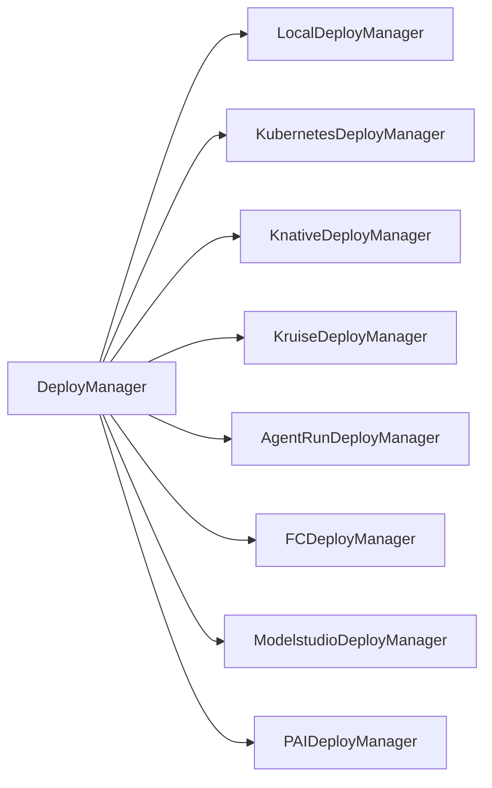

图表来源
- [deployers/__init__.py:18-51](file://src/agentscope_runtime/engine/deployers/__init__.py#L18-L51)

章节来源
- [deployers/__init__.py:18-51](file://src/agentscope_runtime/engine/deployers/__init__.py#L18-L51)

## 性能考虑
- 本地部署
  - 守护线程模式适合低延迟交互；分离进程模式适合长时间运行与资源隔离。
  - 建议启用流式响应与 SSE，减少前端轮询开销。
- Kubernetes/Knative/Kruise
  - 合理设置副本数、资源请求/限制与 HPA/HPA 策略，避免资源争抢与扩缩容抖动。
  - Knative 场景建议开启并发与超时参数优化冷启动。
- 云平台
  - AgentRun/FC：根据业务 QPS 设置会话并发与实例数量，避免超时与限流。
  - ModelStudio/PAI：通过标签与资源组进行成本归集与资源隔离，提升资源利用率。

## 故障排除指南
- 本地部署
  - 无法启动：检查 host/port 是否被占用；查看进程日志与 PID 文件。
  - 停止失败：优先尝试 HTTP /shutdown；若失败，使用进程管理器强制停止并清理残留。
- Kubernetes/Knative/Kruise
  - 服务不可达：确认 Service 类型与外部访问配置；本地集群使用回退地址。
  - 镜像构建失败：检查镜像仓库权限与网络连通性。
- 云平台
  - 权限不足：确保 RAM 用户具备相应权限（如 ApplyTempStorageLease、AliyunBailianDataFullAccess）。
  - OSS 上传失败：检查 Bucket 存在性与标签设置，确认凭据有效。
  - FC/AgentRun/ModelStudio：核对环境变量、Region 与网络配置（VPC/交换机/安全组）。

章节来源
- [deployers/local_deployer.py:415-510](file://src/agentscope_runtime/engine/deployers/local_deployer.py#L415-L510)
- [deployers/kubernetes_deployer.py:313-376](file://src/agentscope_runtime/engine/deployers/kubernetes_deployer.py#L313-L376)
- [deployers/knative_deployer.py:227-280](file://src/agentscope_runtime/engine/deployers/knative_deployer.py#L227-L280)
- [deployers/kruise_deployer.py:353-419](file://src/agentscope_runtime/engine/deployers/kruise_deployer.py#L353-L419)
- [deployers/modelstudio_deployer.py:338-410](file://src/agentscope_runtime/engine/deployers/modelstudio_deployer.py#L338-L410)
- [deployers/agentrun_deployer.py:730-732](file://src/agentscope_runtime/engine/deployers/agentrun_deployer.py#L730-L732)
- [deployers/fc_deployer.py:587-720](file://src/agentscope_runtime/engine/deployers/fc_deployer.py#L587-L720)

## 结论
AgentScope Runtime 提供从本地到云端、从单机到大规模集群的全栈部署能力。通过统一的 DeployManager 抽象与平台化适配器，用户可以按需选择最适合的部署模式，并借助容器化与资源编排实现高性能、可扩展与易运维的服务交付。

## 附录

### 配置示例与最佳实践
- 本地部署
  - 示例：[local_deploy_config.yaml:1-16](file://examples/deployments/local_deploy_config.yaml#L1-L16)
  - 最佳实践：明确 host/port，设置环境变量，必要时启用分离进程模式。
- AgentRun
  - 示例：[agentrun_deploy_config.yaml:1-28](file://examples/deployments/agentrun_deploy_config.yaml#L1-L28)
  - 最佳实践：提前准备 OSS 与 AK/SK，设置 Region 与资源配额。
- ModelStudio
  - 示例：[modelstudio_deploy_config.yaml:1-22](file://examples/deployments/modelstudio_deploy_config.yaml#L1-L22)
  - 最佳实践：确保 RAM 用户具备权限与工作区绑定，设置 DashScope API Key。
- PAI
  - 示例：[pai_deploy_config.yaml:1-111](file://examples/deployments/pai_deploy_config.yaml#L1-L111)
  - 最佳实践：明确工作区与区域，合理选择资源类型（公共/资源组/配额），设置 VPC 与标签。

章节来源
- [examples/deployments/local_deploy_config.yaml:1-16](file://examples/deployments/local_deploy_config.yaml#L1-L16)
- [examples/deployments/agentrun_deploy_config.yaml:1-28](file://examples/deployments/agentrun_deploy_config.yaml#L1-L28)
- [examples/deployments/modelstudio_deploy_config.yaml:1-22](file://examples/deployments/modelstudio_deploy_config.yaml#L1-L22)
- [examples/deployments/pai_deploy_config.yaml:1-111](file://examples/deployments/pai_deploy_config.yaml#L1-L111)