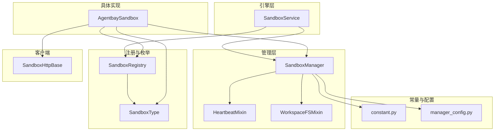
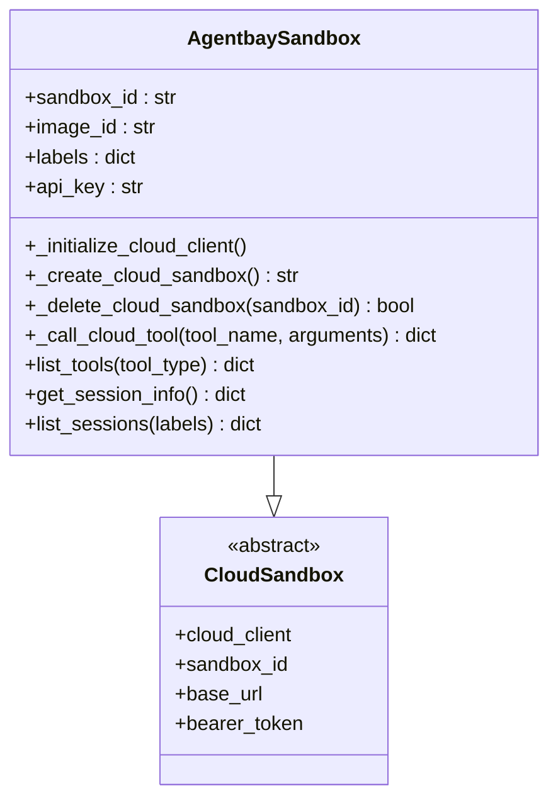
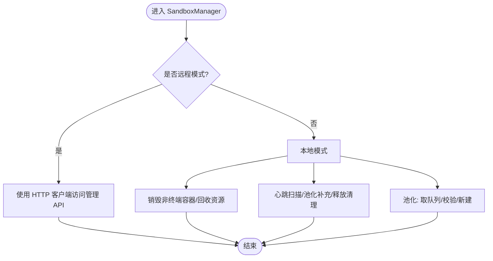
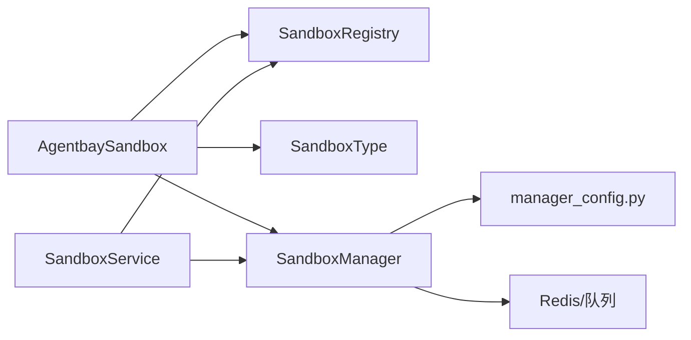

# AgentBay沙箱

<cite>
**本文引用的文件**
- [agentbay_sandbox.py](file://src/agentscope_runtime/sandbox/box/agentbay/agentbay_sandbox.py)
- [agentbay_sandbox_demo.py](file://examples/sandbox/agentbay_sandbox/agentbay_sandbox_demo.py)
- [agentscope_use_agentbay_sandbox.py](file://examples/sandbox/agentbay_sandbox/agentscope_use_agentbay_sandbox.py)
- [sandbox_service.py](file://src/agentscope_runtime/engine/services/sandbox/sandbox_service.py)
- [sandbox_manager.py](file://src/agentscope_runtime/sandbox/manager/sandbox_manager.py)
- [enums.py](file://src/agentscope_runtime/sandbox/enums.py)
- [constant.py](file://src/agentscope_runtime/sandbox/constant.py)
- [registry.py](file://src/agentscope_runtime/sandbox/registry.py)
- [sandbox.md](file://cookbook/en/sandbox/sandbox.md)
- [sandbox.md（API）](file://cookbook/en/api/sandbox.md)
- [README.md](file://README.md)
- [manager_config.py](file://src/agentscope_runtime/sandbox/model/manager_config.py)
- [base.py](file://src/agentscope_runtime/sandbox/client/base.py)
</cite>

## 目录
1. [简介](#简介)
2. [项目结构](#项目结构)
3. [核心组件](#核心组件)
4. [架构总览](#架构总览)
5. [详细组件分析](#详细组件分析)
6. [依赖关系分析](#依赖关系分析)
7. [性能考虑](#性能考虑)
8. [故障排查指南](#故障排查指南)
9. [结论](#结论)
10. [附录](#附录)

## 简介
本技术文档围绕 AgentScope Runtime 中的 AgentBay 沙箱能力展开，系统性阐述其在多 Agent 协作与多 Agent 系统管理中的定位与实现方式；详解 AgentBay 平台的集成机制、Agent 通信与协调策略；记录配置参数、资源分配与任务调度方法；解释多 Agent 协同、冲突解决与一致性保障机制；并提供部署配置、监控指标与性能优化建议，以及多 Agent 系统设计、分布式计算与并行处理的最佳实践。

## 项目结构
AgentBay 沙箱位于 agentscope-runtime 仓库中，属于“沙箱模块”的一部分，主要由以下层次构成：
- 引擎层：SandboxService 提供统一的沙箱生命周期与会话管理接口，支持本地嵌入模式与远程服务模式。
- 管理层：SandboxManager 负责容器/环境池化、心跳扫描、资源回收与会话映射等。
- 注册与枚举：SandboxRegistry 与 SandboxType 定义了沙箱类型注册、默认类型与资源限制。
- 常量与配置：constant 与 manager_config 提供超时、镜像命名空间/标签、管理器配置等。
- 客户端基类：base.py 定义通用 HTTP 客户端行为与工具描述。
- 具体实现：AgentbaySandbox 继承自 CloudSandbox，对接 AgentBay 云服务，提供工具调用、会话查询与列表等能力。



图示来源
- [sandbox_service.py:11-238](file://src/agentscope_runtime/engine/services/sandbox/sandbox_service.py#L11-L238)
- [sandbox_manager.py:140-500](file://src/agentscope_runtime/sandbox/manager/sandbox_manager.py#L140-L500)
- [registry.py:33-131](file://src/agentscope_runtime/sandbox/registry.py#L33-L131)
- [enums.py:61-80](file://src/agentscope_runtime/sandbox/enums.py#L61-L80)
- [constant.py:1-32](file://src/agentscope_runtime/sandbox/constant.py#L1-L32)
- [manager_config.py:11-376](file://src/agentscope_runtime/sandbox/model/manager_config.py#L11-L376)
- [base.py:10-74](file://src/agentscope_runtime/sandbox/client/base.py#L10-L74)
- [agentbay_sandbox.py:27-558](file://src/agentscope_runtime/sandbox/box/agentbay/agentbay_sandbox.py#L27-L558)

章节来源
- [sandbox_service.py:11-238](file://src/agentscope_runtime/engine/services/sandbox/sandbox_service.py#L11-L238)
- [sandbox_manager.py:140-500](file://src/agentscope_runtime/sandbox/manager/sandbox_manager.py#L140-L500)
- [registry.py:33-131](file://src/agentscope_runtime/sandbox/registry.py#L33-L131)
- [enums.py:61-80](file://src/agentscope_runtime/sandbox/enums.py#L61-L80)
- [constant.py:1-32](file://src/agentscope_runtime/sandbox/constant.py#L1-L32)
- [manager_config.py:11-376](file://src/agentscope_runtime/sandbox/model/manager_config.py#L11-L376)
- [base.py:10-74](file://src/agentscope_runtime/sandbox/client/base.py#L10-L74)
- [agentbay_sandbox.py:27-558](file://src/agentscope_runtime/sandbox/box/agentbay/agentbay_sandbox.py#L27-L558)

## 核心组件
- AgentbaySandbox：面向 AgentBay 云服务的沙箱实现，负责初始化云客户端、创建/删除会话、执行工具调用、列举工具与会话信息等。
- SandboxService：统一的沙箱服务入口，负责连接/断开沙箱、会话映射、释放与健康检查。
- SandboxManager：容器/环境生命周期管理，包括池化、心跳扫描、资源回收、会话映射与远程/本地模式切换。
- SandboxRegistry 与 SandboxType：注册沙箱类型、默认类型与资源限制；枚举 AgentBay 类型。
- constant 与 manager_config：超时、镜像命名空间/标签、管理器配置（Redis/K8s/FC/AgentRun 等）。
- SandboxHttpBase：通用 HTTP 客户端基类，定义通用工具描述与请求头。

章节来源
- [agentbay_sandbox.py:27-558](file://src/agentscope_runtime/sandbox/box/agentbay/agentbay_sandbox.py#L27-L558)
- [sandbox_service.py:11-238](file://src/agentscope_runtime/engine/services/sandbox/sandbox_service.py#L11-L238)
- [sandbox_manager.py:140-500](file://src/agentscope_runtime/sandbox/manager/sandbox_manager.py#L140-L500)
- [registry.py:33-131](file://src/agentscope_runtime/sandbox/registry.py#L33-L131)
- [enums.py:61-80](file://src/agentscope_runtime/sandbox/enums.py#L61-L80)
- [constant.py:1-32](file://src/agentscope_runtime/sandbox/constant.py#L1-L32)
- [manager_config.py:11-376](file://src/agentscope_runtime/sandbox/model/manager_config.py#L11-L376)
- [base.py:10-74](file://src/agentscope_runtime/sandbox/client/base.py#L10-L74)

## 架构总览
AgentBay 沙箱采用“服务-管理-实现”的分层架构：
- 服务层（SandboxService）对外暴露统一接口，支持本地嵌入与远程模式，负责会话级连接与复用。
- 管理层（SandboxManager）负责容器/环境池化、心跳扫描、资源回收与会话映射，支持多种后端（Docker、K8s、FC、AgentRun 等）。
- 实现层（AgentbaySandbox）继承 CloudSandbox，对接 AgentBay 云服务，封装工具调用、会话查询与列表等。
- 配置层（constant、manager_config）提供超时、镜像命名空间/标签、存储与后端配置。
- 客户端层（SandboxHttpBase）提供通用 HTTP 行为与工具描述。

```mermaid
sequenceDiagram
    participant App as "应用/Agent"
    participant Service as "SandboxService"
    participant Manager as "SandboxManager"
    participant Registry as "SandboxRegistry"
    participant Box as "AgentbaySandbox"
    participant Cloud as "AgentBay 云服务"
    
    App->>Service: "创建/启动服务"
    App->>Service: "connect(session_id, user_id, [AGENTBAY])"
    Service->>Manager: "获取/创建会话映射"
    Service->>Registry: "解析 AGENTBAY 类型"
    Service->>Box: "实例化 AgentbaySandbox"
    Box->>Cloud: "初始化云客户端/创建会话"
    App->>Box: "调用工具如 run_shell_command"
    Box->>Cloud: "执行工具调用"
    Cloud-->>Box: "返回结果"
    Box-->>App: "工具执行结果"
    App->>Service: "release()/stop()"
    Service->>Manager: "释放/清理"
```

图示来源
- [sandbox_service.py:82-238](file://src/agentscope_runtime/engine/services/sandbox/sandbox_service.py#L82-L238)
- [sandbox_manager.py:592-704](file://src/agentscope_runtime/sandbox/manager/sandbox_manager.py#L592-L704)
- [registry.py:105-131](file://src/agentscope_runtime/sandbox/registry.py#L105-L131)
- [agentbay_sandbox.py:88-148](file://src/agentscope_runtime/sandbox/box/agentbay/agentbay_sandbox.py#L88-L148)

章节来源
- [sandbox_service.py:11-238](file://src/agentscope_runtime/engine/services/sandbox/sandbox_service.py#L11-L238)
- [sandbox_manager.py:140-500](file://src/agentscope_runtime/sandbox/manager/sandbox_manager.py#L140-L500)
- [registry.py:33-131](file://src/agentscope_runtime/sandbox/registry.py#L33-L131)
- [agentbay_sandbox.py:27-558](file://src/agentscope_runtime/sandbox/box/agentbay/agentbay_sandbox.py#L27-L558)

## 详细组件分析

### AgentbaySandbox 组件
- 角色与职责
  - 对接 AgentBay 云服务，封装会话创建/删除、工具调用、会话信息查询与会话列表。
  - 提供工具分类（文件、命令、浏览器、系统），并支持通用工具回退。
- 关键流程
  - 初始化：从环境变量或参数读取 API Key，构造云客户端。
  - 会话管理：创建/删除会话，支持错误处理与日志记录。
  - 工具调用：映射工具名到具体方法，支持通用回退调用。
  - 查询与列表：列出工具、获取会话信息、列出会话。
- 错误处理
  - SDK 缺失时抛出导入异常；工具调用失败返回结构化错误对象。
- 性能与并发
  - 通过云服务执行工具，避免本地容器开销；工具调用为同步阻塞，适合串行编排。



图示来源
- [agentbay_sandbox.py:27-558](file://src/agentscope_runtime/sandbox/box/agentbay/agentbay_sandbox.py#L27-L558)

章节来源
- [agentbay_sandbox.py:27-558](file://src/agentscope_runtime/sandbox/box/agentbay/agentbay_sandbox.py#L27-L558)

### SandboxService 组件
- 角色与职责
  - 统一的沙箱服务入口，支持本地嵌入与远程模式。
  - 会话级连接与复用，基于 session_id 与 user_id 的复合键管理。
  - 支持 AgentBay 会话 ID 识别与连接。
- 关键流程
  - 启动/停止：创建/销毁 SandboxManager，健康检查。
  - 连接：根据类型创建或复用环境；对 AgentBay 会话进行特殊处理。
  - 释放：按会话映射释放非 AgentBay 环境。
- 并发与一致性
  - 通过会话映射确保同一 session_id 的多次连接复用同一环境。
  - 对 AgentBay 会话不主动释放，交由云侧生命周期管理。

```mermaid
sequenceDiagram
participant Client as "客户端"
participant Service as "SandboxService"
participant Manager as "SandboxManager"
participant Registry as "SandboxRegistry"
participant Box as "AgentbaySandbox"
Client->>Service : start()
Service->>Manager : 初始化
Client->>Service : connect(session_id, user_id, [AGENTBAY])
Service->>Manager : get_session_mapping()
alt 存在映射
Service->>Box : 复用 AgentbaySandbox
else 不存在映射
Service->>Registry : get_classes_by_type(AGENTBAY)
Service->>Box : 实例化 AgentbaySandbox
Box->>Box : 创建会话/初始化云客户端
end
Client-->>Service : 使用沙箱工具
Client->>Service : release()/stop()
Service->>Manager : 清理会话映射
```

图示来源
- [sandbox_service.py:48-238](file://src/agentscope_runtime/engine/services/sandbox/sandbox_service.py#L48-L238)

章节来源
- [sandbox_service.py:11-238](file://src/agentscope_runtime/engine/services/sandbox/sandbox_service.py#L11-L238)

### SandboxManager 组件
- 角色与职责
  - 容器/环境池化、心跳扫描、资源回收与会话映射。
  - 支持远程/本地两种模式，远程模式通过 HTTP 访问管理 API。
  - 多后端支持（Docker、K8s、FC、AgentRun 等）。
- 关键流程
  - 池化：从队列取出可用容器，校验状态与版本，否则新建。
  - 清理：销毁非终端容器，回收资源。
  - 心跳：后台线程周期扫描心跳、池化补充与已释放记录清理。
- 配置要点
  - file_system、redis_enabled、container_deployment、pool_size、port_range、max_sandbox_instances 等。
  - OSS/Redis/K8s/AgentRun/FC 等后端配置项。



图示来源
- [sandbox_manager.py:140-500](file://src/agentscope_runtime/sandbox/manager/sandbox_manager.py#L140-L500)
- [manager_config.py:11-376](file://src/agentscope_runtime/sandbox/model/manager_config.py#L11-L376)

章节来源
- [sandbox_manager.py:140-500](file://src/agentscope_runtime/sandbox/manager/sandbox_manager.py#L140-L500)
- [manager_config.py:11-376](file://src/agentscope_runtime/sandbox/model/manager_config.py#L11-L376)

### 配置参数与资源分配
- 超时与镜像
  - RUNTIME_SANDBOX_TIMEOUT 控制超时；镜像注册表、命名空间、标签通过环境变量控制。
- 管理器配置
  - file_system（local/oss）、redis_enabled、container_deployment（docker/cloud/k8s/agentrun/fc/gvisor/boxlite）、pool_size、port_range、max_sandbox_instances 等。
  - OSS：endpoint、access_key_id、access_key_secret、bucket_name。
  - Redis：server、port、db、user、password、key 前缀。
  - K8s：namespace、kubeconfig_path。
  - AgentRun/FC：access_key_id、access_key_secret、account_id、region_id、cpu/memory、vpc/vswitch/security_group、prefix、log_project/log_store。
- 资源限制
  - SandboxRegistry 支持 resource_limits 与 runtime_config 映射（内存、CPU 纳秒核）。

章节来源
- [constant.py:1-32](file://src/agentscope_runtime/sandbox/constant.py#L1-L32)
- [manager_config.py:11-376](file://src/agentscope_runtime/sandbox/model/manager_config.py#L11-L376)
- [registry.py:9-31](file://src/agentscope_runtime/sandbox/registry.py#L9-L31)

### 工具与会话管理
- 工具分类
  - 文件：read_file、write_file、list_directory、create_directory、move_file、delete_file。
  - 命令：run_shell_command、run_ipython_cell。
  - 浏览器：browser_navigate、browser_click、browser_input。
  - 系统：screenshot。
- 会话管理
  - 列举工具、获取会话信息、列出会话、连接现有会话（AgentBay 会话 ID 识别）。

章节来源
- [agentbay_sandbox.py:447-558](file://src/agentscope_runtime/sandbox/box/agentbay/agentbay_sandbox.py#L447-L558)
- [sandbox.md:545-599](file://cookbook/en/sandbox/sandbox.md#L545-L599)

### 多 Agent 协作与冲突解决
- 会话复用
  - 通过 SandboxService 的 session_id 与 user_id 复用同一沙箱实例，避免状态丢失与资源浪费。
- AgentBay 会话生命周期
  - 以云侧会话为主，SDK 层仅连接已有会话；释放策略由云侧管理。
- 冲突与一致性
  - 同一会话内串行执行工具调用；跨会话隔离；通过会话映射与心跳扫描保障一致性。

章节来源
- [sandbox_service.py:216-238](file://src/agentscope_runtime/engine/services/sandbox/sandbox_service.py#L216-L238)
- [sandbox_manager.py:444-500](file://src/agentscope_runtime/sandbox/manager/sandbox_manager.py#L444-L500)

### 部署与监控
- 部署模式
  - 本地：Docker/gVisor/BoxLite；远程：K8s/FC/AgentRun；或作为远程服务被 SandboxService 访问。
- 监控与可观测性
  - 心跳扫描、池化补充、释放清理；日志记录工具调用与错误信息。
- 性能优化
  - 合理设置 pool_size 与 max_sandbox_instances；选择合适的后端（云侧 AgentBay 减少本地容器开销）。

章节来源
- [README.md:524-537](file://README.md#L524-L537)
- [sandbox_manager.py:444-500](file://src/agentscope_runtime/sandbox/manager/sandbox_manager.py#L444-L500)
- [manager_config.py:279-284](file://src/agentscope_runtime/sandbox/model/manager_config.py#L279-L284)

## 依赖关系分析
- 组件耦合
  - AgentbaySandbox 依赖 SandboxRegistry 与 SandboxType；依赖 CloudSandbox 与 SandboxManager。
  - SandboxService 依赖 SandboxManager 与 SandboxRegistry；对 AgentBay 会话有特殊处理。
  - SandboxManager 依赖 manager_config、Redis/队列、容器客户端工厂。
- 外部依赖
  - AgentBay SDK（运行时导入）；HTTP 客户端（requests/httpx）；可选 Redis/K8s/FC/AgentRun。
- 循环依赖
  - 未发现循环依赖；各层职责清晰。



图示来源
- [agentbay_sandbox.py:27-558](file://src/agentscope_runtime/sandbox/box/agentbay/agentbay_sandbox.py#L27-L558)
- [sandbox_service.py:11-238](file://src/agentscope_runtime/engine/services/sandbox/sandbox_service.py#L11-L238)
- [sandbox_manager.py:140-500](file://src/agentscope_runtime/sandbox/manager/sandbox_manager.py#L140-L500)
- [registry.py:33-131](file://src/agentscope_runtime/sandbox/registry.py#L33-L131)
- [manager_config.py:11-376](file://src/agentscope_runtime/sandbox/model/manager_config.py#L11-L376)

章节来源
- [agentbay_sandbox.py:27-558](file://src/agentscope_runtime/sandbox/box/agentbay/agentbay_sandbox.py#L27-L558)
- [sandbox_service.py:11-238](file://src/agentscope_runtime/engine/services/sandbox/sandbox_service.py#L11-L238)
- [sandbox_manager.py:140-500](file://src/agentscope_runtime/sandbox/manager/sandbox_manager.py#L140-L500)
- [registry.py:33-131](file://src/agentscope_runtime/sandbox/registry.py#L33-L131)
- [manager_config.py:11-376](file://src/agentscope_runtime/sandbox/model/manager_config.py#L11-L376)

## 性能考虑
- 云侧执行优势
  - AgentBay 云沙箱避免本地容器启动与资源占用，适合高并发场景。
- 池化与限流
  - 通过 pool_size 与 max_sandbox_instances 控制并发与资源占用。
- 心跳与回收
  - watcher_scan_interval、heartbeat_timeout、released_key_ttl 等参数影响资源回收效率与延迟。
- 网络与超时
  - RUNTIME_SANDBOX_TIMEOUT 与 HTTP 客户端超时需结合网络状况调整。

章节来源
- [constant.py:30-32](file://src/agentscope_runtime/sandbox/constant.py#L30-L32)
- [manager_config.py:251-284](file://src/agentscope_runtime/sandbox/model/manager_config.py#L251-L284)
- [sandbox_manager.py:444-500](file://src/agentscope_runtime/sandbox/manager/sandbox_manager.py#L444-L500)

## 故障排查指南
- AgentBay SDK 未安装
  - 现象：初始化云客户端时报导入错误。
  - 处理：安装 AgentBay SDK 或在测试脚本中捕获异常并提示。
- API Key 缺失
  - 现象：构造 AgentbaySandbox 抛出参数缺失错误。
  - 处理：设置 AGENTBAY_API_KEY 环境变量或传入 api_key 参数。
- 工具调用失败
  - 现象：工具返回错误对象，包含错误信息。
  - 处理：检查参数、权限与云侧会话状态。
- 会话不存在或已删除
  - 现象：获取会话失败或删除返回警告。
  - 处理：确认会话 ID 与生命周期；AgentBay 会话由云侧管理。
- 远程模式认证失败
  - 现象：HTTP 请求返回错误。
  - 处理：检查 base_url 与 bearer_token 设置。

章节来源
- [agentbay_sandbox.py:67-113](file://src/agentscope_runtime/sandbox/box/agentbay/agentbay_sandbox.py#L67-L113)
- [agentbay_sandbox.py:149-187](file://src/agentscope_runtime/sandbox/box/agentbay/agentbay_sandbox.py#L149-L187)
- [agentbay_sandbox.py:234-241](file://src/agentscope_runtime/sandbox/box/agentbay/agentbay_sandbox.py#L234-L241)
- [sandbox_service.py:216-238](file://src/agentscope_runtime/engine/services/sandbox/sandbox_service.py#L216-L238)

## 结论
AgentBay 沙箱通过“服务-管理-实现”的分层架构，实现了与 AgentScope 生态的无缝集成，支持多 Agent 场景下的会话复用、工具调用与生命周期管理。其云侧执行特性降低了本地资源压力，配合池化与心跳扫描机制，能够满足高并发与高可用需求。通过合理的配置与监控，可在生产环境中稳定运行并持续优化性能。

## 附录
- 示例与参考
  - AgentBay 沙箱直接使用与服务集成示例：见示例脚本。
  - 沙箱模块 API 文档：见 cookbook API 文档。
  - 快速开始与部署指南：见 README 与 sandbox 教程。

章节来源
- [agentbay_sandbox_demo.py:1-240](file://examples/sandbox/agentbay_sandbox/agentbay_sandbox_demo.py#L1-L240)
- [agentscope_use_agentbay_sandbox.py:1-418](file://examples/sandbox/agentbay_sandbox/agentscope_use_agentbay_sandbox.py#L1-L418)
- [sandbox.md（API）:1-214](file://cookbook/en/api/sandbox.md#L1-L214)
- [sandbox.md:1-599](file://cookbook/en/sandbox/sandbox.md#L1-L599)
- [README.md:524-537](file://README.md#L524-L537)