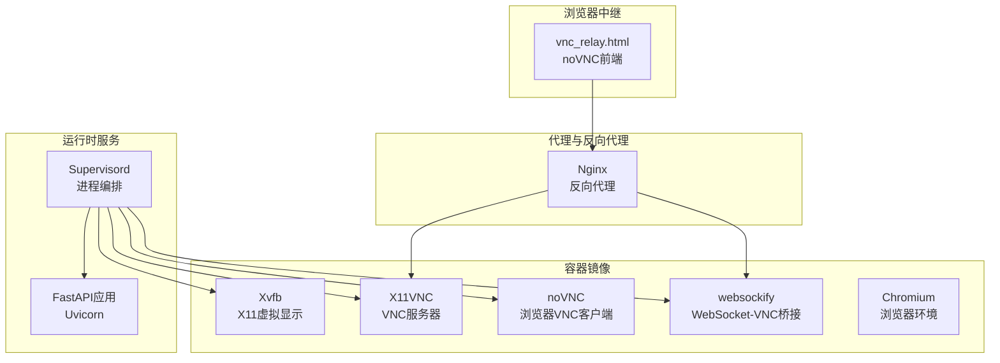
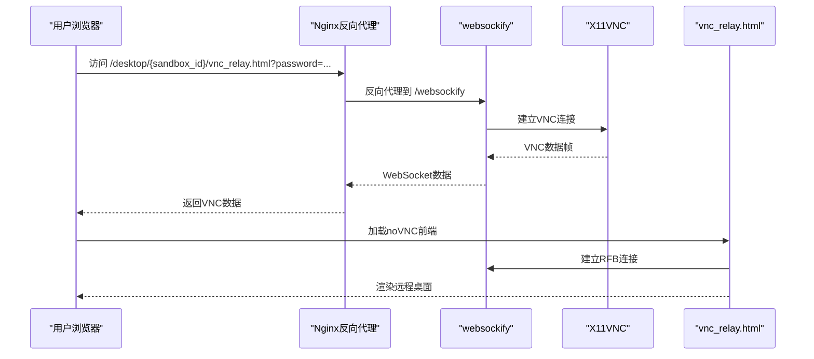
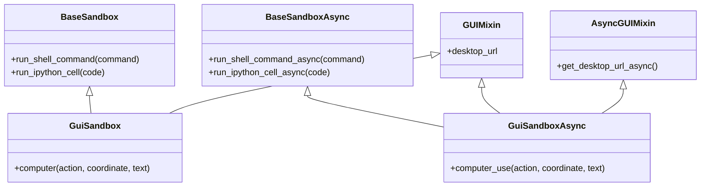
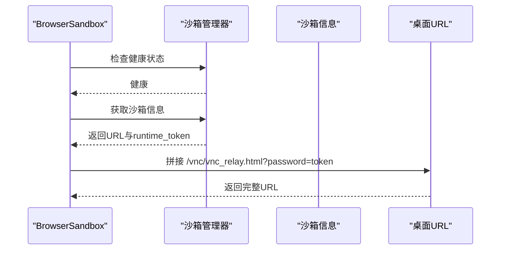
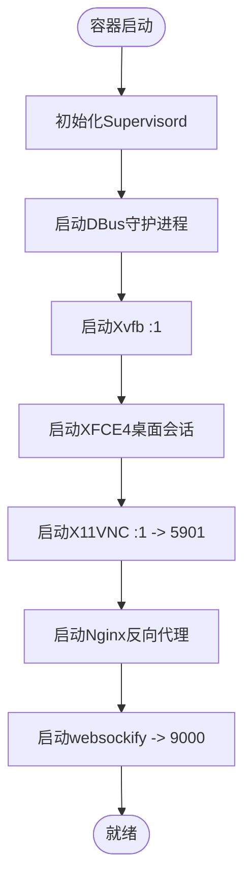
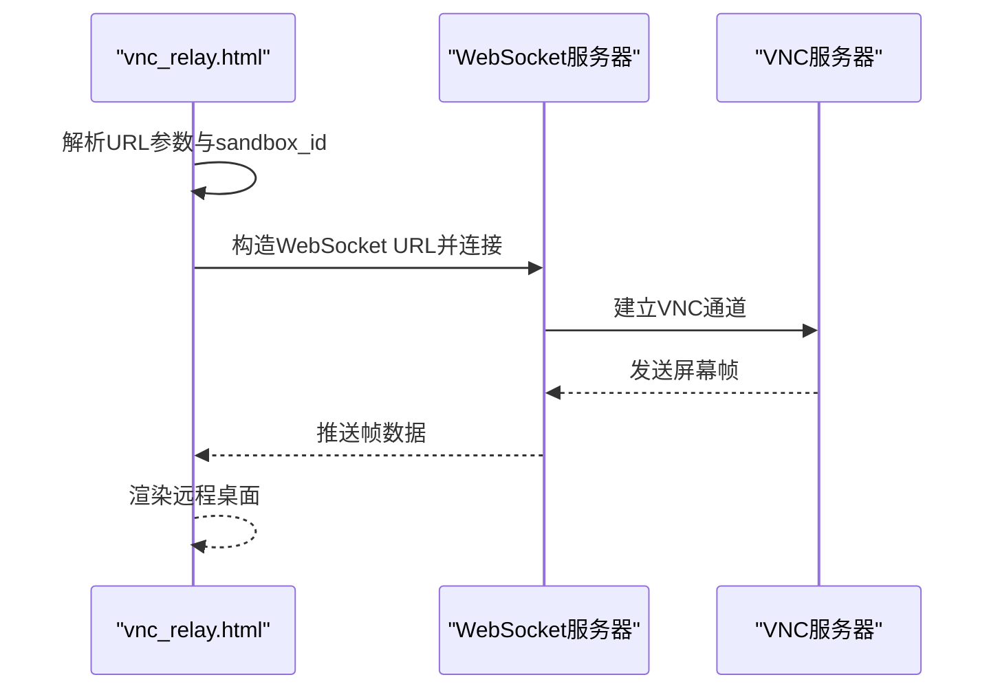
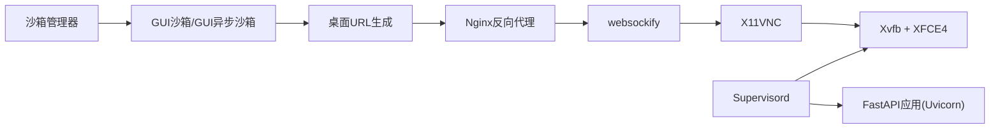

# GUI沙箱

<cite>
**本文引用的文件**
- [gui_sandbox.py](file://src/agentscope_runtime/sandbox/box/gui/gui_sandbox.py)
- [vnc_relay.html](file://src/agentscope_runtime/sandbox/box/gui/box/vnc_relay.html)
- [Dockerfile](file://src/agentscope_runtime/sandbox/box/gui/Dockerfile)
- [nginx.conf.template](file://examples/sandbox/custom_sandbox/box/config/nginx.conf.template)
- [supervisord.conf](file://examples/sandbox/custom_sandbox/box/config/supervisord.conf)
- [requirements.txt](file://src/agentscope_runtime/sandbox/box/gui/box/requirements.txt)
- [start.sh](file://src/agentscope_runtime/sandbox/box/gui/box/scripts/start.sh)
- [base_sandbox.py](file://src/agentscope_runtime/sandbox/box/base/base_sandbox.py)
- [browser_sandbox.py](file://src/agentscope_runtime/sandbox/box/browser/browser_sandbox.py)
- [app.py](file://src/agentscope_runtime/sandbox/manager/server/app.py)
</cite>

## 目录
1. [简介](#简介)
2. [项目结构](#项目结构)
3. [核心组件](#核心组件)
4. [架构总览](#架构总览)
5. [详细组件分析](#详细组件分析)
6. [依赖关系分析](#依赖关系分析)
7. [性能考虑](#性能考虑)
8. [故障排除指南](#故障排除指南)
9. [结论](#结论)
10. [附录](#附录)

## 简介
本技术文档面向GUI沙箱，系统性阐述其虚拟桌面与VNC远程访问机制，覆盖X11转发、VNC服务器配置、浏览器中继页面实现、显示配置、输入设备映射、音频支持、GUI应用启动流程、窗口管理与用户交互处理，并提供部署配置、访问方式与性能调优建议，以及常见GUI应用兼容性与故障排除方法，重点解决显示延迟、性能瓶颈与安全访问问题。

## 项目结构
GUI沙箱由“容器镜像构建层”“运行时服务层”“代理与反向代理层”“浏览器中继层”四部分组成：
- 容器镜像构建层：基于Node镜像安装Xvfb、X11VNC、noVNC、websockify、Chromium等，提供虚拟显示与VNC服务。
- 运行时服务层：FastAPI应用通过Uvicorn提供工具接口（如computer），并与沙箱管理器交互。
- 代理与反向代理层：Nginx作为反向代理，转发/VNC静态资源与/websockify WebSocket升级请求至本地VNC网关。
- 浏览器中继层：noVNC前端通过RFB协议连接到VNC服务器，实现浏览器内远程桌面体验。

图表来源
- [Dockerfile:1-81](file://src/agentscope_runtime/sandbox/box/gui/Dockerfile#L1-L81)
- [nginx.conf.template:1-47](file://examples/sandbox/custom_sandbox/box/config/nginx.conf.template#L1-L47)
- [supervisord.conf:1-65](file://examples/sandbox/custom_sandbox/box/config/supervisord.conf#L1-L65)
- [vnc_relay.html:1-197](file://src/agentscope_runtime/sandbox/box/gui/box/vnc_relay.html#L1-L197)

章节来源
- [Dockerfile:1-81](file://src/agentscope_runtime/sandbox/box/gui/Dockerfile#L1-L81)
- [nginx.conf.template:1-47](file://examples/sandbox/custom_sandbox/box/config/nginx.conf.template#L1-L47)
- [supervisord.conf:1-65](file://examples/sandbox/custom_sandbox/box/config/supervisord.conf#L1-L65)

## 核心组件
- GUIMixin与AsyncGUIMixin：提供GUI沙箱的桌面URL生成逻辑，支持本地与远程访问路径拼接及密码参数注入。
- GuiSandbox与GuiSandboxAsync：继承GUIMixin与BaseSandbox/BaseSandboxAsync，封装computer工具调用以实现鼠标键盘输入与截图。
- vnc_relay.html：noVNC轻量级前端，负责解析URL参数、构造WebSocket路径、建立RFB连接、处理凭据与状态提示。
- Nginx模板与Supervisord配置：统一管理Xvfb、X11VNC、noVNC、Chromium、FastAPI等进程生命周期与端口转发。
- FastAPI应用与工具接口：提供computer工具供GUI沙箱执行输入/截图操作；浏览器沙箱复用GUIMixin实现桌面URL生成。

章节来源
- [gui_sandbox.py:17-240](file://src/agentscope_runtime/sandbox/box/gui/gui_sandbox.py#L17-L240)
- [vnc_relay.html:1-197](file://src/agentscope_runtime/sandbox/box/gui/box/vnc_relay.html#L1-L197)
- [requirements.txt:1-9](file://src/agentscope_runtime/sandbox/box/gui/box/requirements.txt#L1-L9)
- [start.sh:1-5](file://src/agentscope_runtime/sandbox/box/gui/box/scripts/start.sh#L1-L5)
- [base_sandbox.py:1-102](file://src/agentscope_runtime/sandbox/box/base/base_sandbox.py#L1-L102)
- [browser_sandbox.py:1-498](file://src/agentscope_runtime/sandbox/box/browser/browser_sandbox.py#L1-L498)

## 架构总览
GUI沙箱采用“虚拟显示+VNC+浏览器中继”的三层架构：
- 虚拟显示层：Xvfb在:1显示器上提供无头X11环境，XFCE4桌面会话在该显示器上运行。
- VNC服务层：X11VNC监听5901端口，websockify将WebSocket升级为VNC协议，Nginx代理/websockify。
- 浏览器中继层：vnc_relay.html通过RFB连接到VNC服务器，支持密码认证与视图缩放。

图表来源
- [nginx.conf.template:27-46](file://examples/sandbox/custom_sandbox/box/config/nginx.conf.template#L27-L46)
- [supervisord.conf:48-65](file://examples/sandbox/custom_sandbox/box/config/supervisord.conf#L48-L65)
- [vnc_relay.html:145-184](file://src/agentscope_runtime/sandbox/box/gui/box/vnc_relay.html#L145-L184)

## 详细组件分析

### 组件A：GUI沙箱类与工具接口
- GUIMixin/AsyncGUIMixin：根据沙箱健康状态与信息，生成本地或远程桌面URL，注入runtime_token作为VNC密码。
- GuiSandbox/GuiSandboxAsync：提供computer工具调用，支持键鼠操作、文本输入、截图、光标位置查询等。
- BaseSandbox/BaseSandboxAsync：提供通用工具接口（如run_shell_command、run_ipython_cell）作为基类能力。

图表来源
- [base_sandbox.py:18-102](file://src/agentscope_runtime/sandbox/box/base/base_sandbox.py#L18-L102)
- [gui_sandbox.py:72-240](file://src/agentscope_runtime/sandbox/box/gui/gui_sandbox.py#L72-L240)

章节来源
- [gui_sandbox.py:17-240](file://src/agentscope_runtime/sandbox/box/gui/gui_sandbox.py#L17-L240)
- [base_sandbox.py:18-102](file://src/agentscope_runtime/sandbox/box/base/base_sandbox.py#L18-L102)

### 组件B：浏览器沙箱与桌面URL生成
- BrowserSandbox/BrowserSandboxAsync：复用GUIMixin生成桌面URL，同时提供丰富的浏览器控制工具（导航、点击、输入、截图、标签页管理等）。
- URL转换工具：http_to_ws用于将HTTP(S)地址转换为WS(WSS)地址，便于在本地回环地址场景下使用localhost。

图表来源
- [browser_sandbox.py:31-53](file://src/agentscope_runtime/sandbox/box/browser/browser_sandbox.py#L31-L53)
- [app.py:249-261](file://src/agentscope_runtime/sandbox/manager/server/app.py#L249-L261)

章节来源
- [browser_sandbox.py:1-498](file://src/agentscope_runtime/sandbox/box/browser/browser_sandbox.py#L1-L498)
- [app.py:249-261](file://src/agentscope_runtime/sandbox/manager/server/app.py#L249-L261)

### 组件C：虚拟桌面与VNC服务器配置
- Xvfb：在:1显示器上启动1280x800x24分辨率虚拟X服务器。
- XFCE4：在Xvfb之上运行桌面会话，提供窗口管理与应用启动能力。
- X11VNC：监听5901端口，共享显示并启用密码认证（从环境变量读取）。
- websockify：将WebSocket升级为VNC连接，供noVNC前端使用。
- Supervisord：统一管理上述进程，设置优先级与环境变量（如DISPLAY、SECRET_TOKEN）。

图表来源
- [supervisord.conf:7-65](file://examples/sandbox/custom_sandbox/box/config/supervisord.conf#L7-L65)
- [Dockerfile:9-48](file://src/agentscope_runtime/sandbox/box/gui/Dockerfile#L9-L48)

章节来源
- [supervisord.conf:7-65](file://examples/sandbox/custom_sandbox/box/config/supervisord.conf#L7-L65)
- [Dockerfile:9-48](file://src/agentscope_runtime/sandbox/box/gui/Dockerfile#L9-L48)

### 组件D：浏览器中继页面实现
- vnc_relay.html：加载noVNC核心库，解析URL参数（host/port/password/path），动态计算WebSocket路径，建立RFB连接。
- 支持HTTPS自动选择wss/ws，支持view_only与scale参数，内置Ctrl+Alt+Del发送功能与状态提示。

图表来源
- [vnc_relay.html:145-184](file://src/agentscope_runtime/sandbox/box/gui/box/vnc_relay.html#L145-L184)

章节来源
- [vnc_relay.html:1-197](file://src/agentscope_runtime/sandbox/box/gui/box/vnc_relay.html#L1-L197)

### 组件E：显示配置、输入设备映射与音频支持
- 显示配置：Xvfb在:1显示器上运行，分辨率与颜色深度可按需调整；Nginx模板提供超时参数配置。
- 输入设备映射：通过X11VNC共享X服务器，浏览器端RFB事件映射到X服务器，实现键鼠输入；GUI沙箱computer工具进一步抽象为动作接口。
- 音频支持：当前镜像安装了Chromium与相关库，但未见显式的音频转发配置；若需音频，可在容器内启用PulseAudio并通过X11VNC或web音视频桥接方案扩展。

章节来源
- [supervisord.conf:30-47](file://examples/sandbox/custom_sandbox/box/config/supervisord.conf#L30-L47)
- [nginx.conf.template:6-8](file://examples/sandbox/custom_sandbox/box/config/nginx.conf.template#L6-L8)
- [Dockerfile:21-47](file://src/agentscope_runtime/sandbox/box/gui/Dockerfile#L21-L47)

### 组件F：GUI应用启动流程与窗口管理
- 应用启动：在XFCE4桌面环境下，GUI应用通过桌面图标或命令行启动；X11VNC共享显示后，浏览器端可看到应用窗口。
- 窗口管理：XFCE4提供窗口装饰、最小化/最大化、任务栏等；GUI沙箱computer工具可用于定位元素坐标与执行点击/拖拽等操作。
- 用户交互：浏览器端通过RFB协议发送输入事件，GUI沙箱computer工具可补充精确的坐标与文本输入。

章节来源
- [gui_sandbox.py:98-152](file://src/agentscope_runtime/sandbox/box/gui/gui_sandbox.py#L98-L152)
- [browser_sandbox.py:104-170](file://src/agentscope_runtime/sandbox/box/browser/browser_sandbox.py#L104-L170)

## 依赖关系分析
- GUI沙箱依赖于沙箱管理器提供的健康检查与信息查询，以生成桌面URL。
- Nginx反向代理依赖Supervisord确保X11VNC与websockify可用。
- 浏览器中继依赖Nginx将WebSocket升级到VNC服务器。
- FastAPI应用通过Uvicorn运行，Supervisord管理其生命周期。

图表来源
- [gui_sandbox.py:17-63](file://src/agentscope_runtime/sandbox/box/gui/gui_sandbox.py#L17-L63)
- [nginx.conf.template:27-46](file://examples/sandbox/custom_sandbox/box/config/nginx.conf.template#L27-L46)
- [supervisord.conf:48-65](file://examples/sandbox/custom_sandbox/box/config/supervisord.conf#L48-L65)
- [start.sh:3-4](file://src/agentscope_runtime/sandbox/box/gui/box/scripts/start.sh#L3-L4)

章节来源
- [gui_sandbox.py:17-63](file://src/agentscope_runtime/sandbox/box/gui/gui_sandbox.py#L17-L63)
- [nginx.conf.template:27-46](file://examples/sandbox/custom_sandbox/box/config/nginx.conf.template#L27-L46)
- [supervisord.conf:48-65](file://examples/sandbox/custom_sandbox/box/config/supervisord.conf#L48-L65)
- [start.sh:3-4](file://src/agentscope_runtime/sandbox/box/gui/box/scripts/start.sh#L3-L4)

## 性能考虑
- 显示延迟优化
  - 分辨率与颜色深度：适当降低分辨率（如1024x768x16）可显著减少带宽与渲染开销。
  - 缩放策略：在vnc_relay.html中启用scale，避免全屏重绘带来的抖动。
  - Nginx超时：通过NGINX_TIMEOUT调整代理超时，避免长连接中断导致的重连抖动。
- 带宽与压缩
  - X11VNC支持多种编码与压缩选项（需在容器内配置），可结合网络状况选择合适参数。
- 进程优先级
  - Supervisord中为Xvfb、XFCE4、X11VNC、websockify设置合理优先级，确保关键服务优先启动与稳定运行。
- 浏览器性能
  - Chromium禁用沙箱模式以提升兼容性，但可能影响安全性；生产环境建议评估风险。
- 异步与并发
  - 使用GuiSandboxAsync与异步工具接口，提高多用户并发下的响应能力。

章节来源
- [nginx.conf.template:6-8](file://examples/sandbox/custom_sandbox/box/config/nginx.conf.template#L6-L8)
- [supervisord.conf:30-65](file://examples/sandbox/custom_sandbox/box/config/supervisord.conf#L30-L65)
- [Dockerfile:49-49](file://src/agentscope_runtime/sandbox/box/gui/Dockerfile#L49-L49)

## 故障排除指南
- 沙箱不健康或无法生成桌面URL
  - 检查沙箱管理器健康检查接口与沙箱信息返回值；确认runtime_token存在且有效。
  - 章节来源: [gui_sandbox.py:19-34](file://src/agentscope_runtime/sandbox/box/gui/gui_sandbox.py#L19-L34)
- VNC连接失败或密码错误
  - 确认X11VNC已监听5901端口，且SECRET_TOKEN环境变量正确注入；浏览器端密码应与runtime_token一致。
  - 章节来源: [supervisord.conf:48-56](file://examples/sandbox/custom_sandbox/box/config/supervisord.conf#L48-L56)
- WebSocket升级失败
  - 检查Nginx是否正确代理/websockify，确认Upgrade/Connection头部传递；确认websockify已启动并监听9000端口。
  - 章节来源: [nginx.conf.template:38-46](file://examples/sandbox/custom_sandbox/box/config/nginx.conf.template#L38-L46)
- 显示卡顿或延迟高
  - 降低分辨率与颜色深度；启用scale；调整NGINX_TIMEOUT；检查宿主机CPU/内存占用。
  - 章节来源: [supervisord.conf:30-37](file://examples/sandbox/custom_sandbox/box/config/supervisord.conf#L30-L37)
- 浏览器崩溃或兼容性问题
  - 在ARM64平台（如Apple M1/M2/M3）上，Chromium可能因缺少SSE3指令集而崩溃；建议使用Rosetta或更换平台。
  - 章节来源: [gui_sandbox.py:88-96](file://src/agentscope_runtime/sandbox/box/gui/gui_sandbox.py#L88-L96)
- 音频无输出
  - 当前镜像未启用音频转发；如需音频，需在容器内配置PulseAudio并进行相应桥接。
  - 章节来源: [Dockerfile:21-47](file://src/agentscope_runtime/sandbox/box/gui/Dockerfile#L21-L47)

## 结论
GUI沙箱通过Xvfb虚拟显示、X11VNC共享与websockify桥接，结合Nginx反向代理与noVNC前端，实现了安全可控的浏览器远程桌面体验。通过合理的显示配置、输入映射与性能调优，可在保证安全的前提下满足多样化的GUI应用交互需求。针对ARM64兼容性与音频支持等限制，建议在部署前进行充分测试与针对性优化。

## 附录
- 部署配置要点
  - 环境变量：SECRET_TOKEN（VNC密码）、NGINX_TIMEOUT（代理超时）。
  - 端口映射：5901（VNC）、9000（websockify）、8000（FastAPI）。
  - 章节来源: [supervisord.conf:48-65](file://examples/sandbox/custom_sandbox/box/config/supervisord.conf#L48-L65), [nginx.conf.template:13-46](file://examples/sandbox/custom_sandbox/box/config/nginx.conf.template#L13-L46), [start.sh:3-4](file://src/agentscope_runtime/sandbox/box/gui/box/scripts/start.sh#L3-L4)
- 访问方式
  - 本地访问：直接打开桌面URL（含password参数）。
  - 远程访问：通过沙箱管理器提供的base_url与/desktop/{sandbox_id}/vnc_relay.html路径访问。
  - 章节来源: [gui_sandbox.py:19-34](file://src/agentscope_runtime/sandbox/box/gui/gui_sandbox.py#L19-L34), [browser_sandbox.py:31-53](file://src/agentscope_runtime/sandbox/box/browser/browser_sandbox.py#L31-L53)
- 常见GUI应用兼容性
  - Chromium：已安装，注意ARM64平台SSE3缺失问题。
  - XFCE4：提供窗口管理与应用启动能力。
  - 章节来源: [Dockerfile:21-47](file://src/agentscope_runtime/sandbox/box/gui/Dockerfile#L21-L47), [supervisord.conf:39-47](file://examples/sandbox/custom_sandbox/box/config/supervisord.conf#L39-L47)