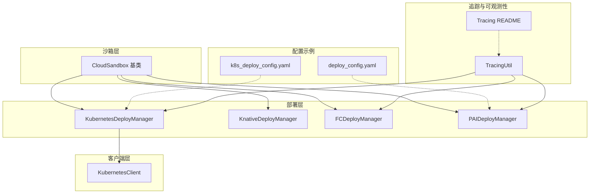
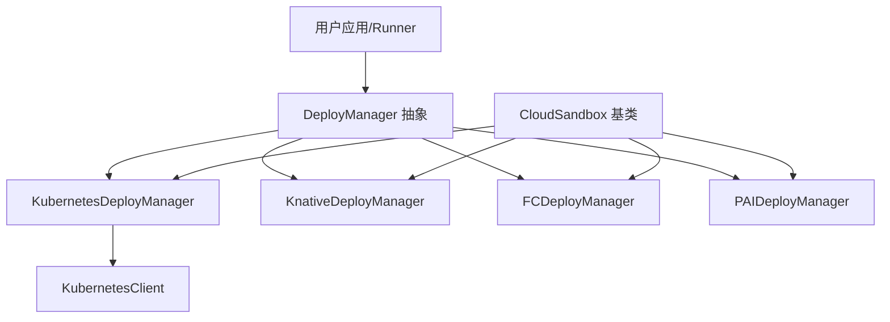
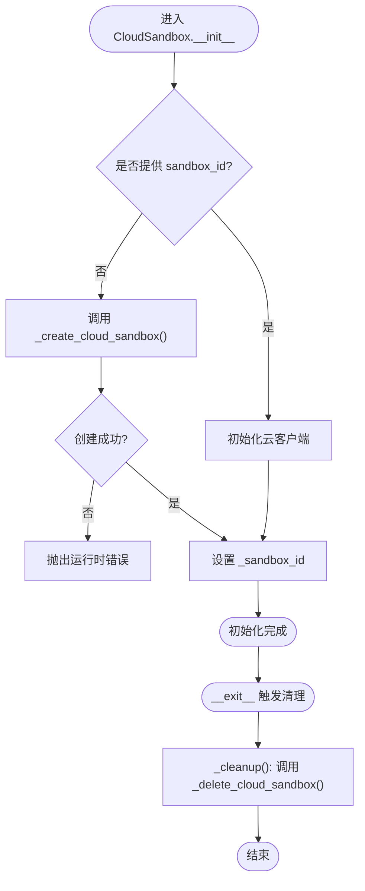
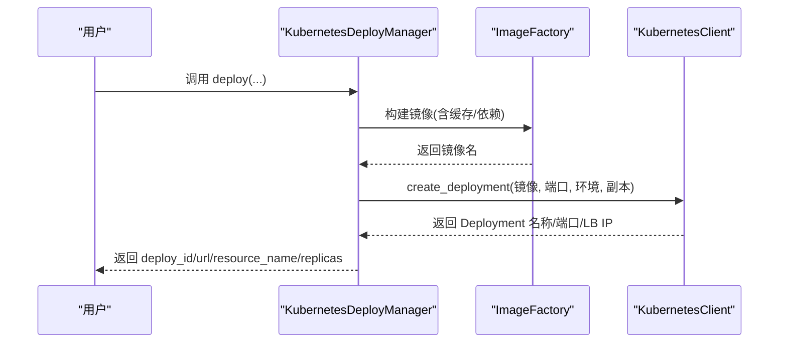
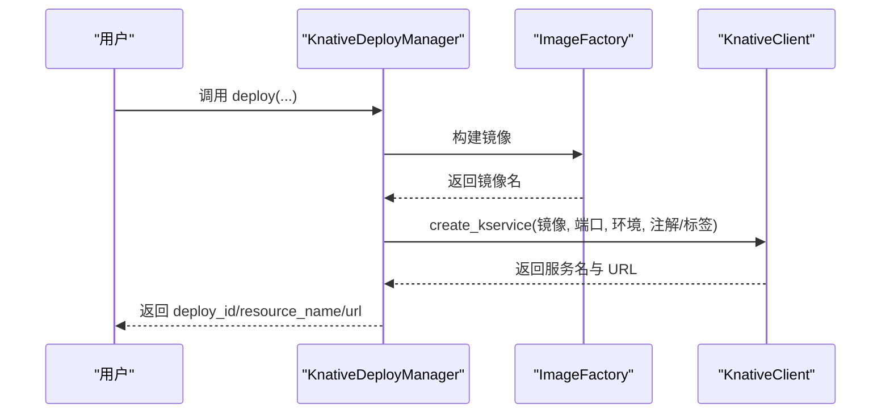
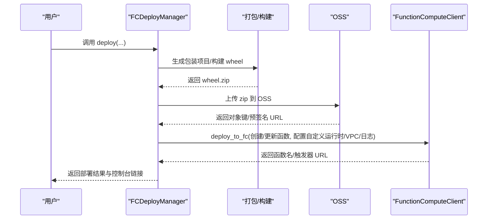
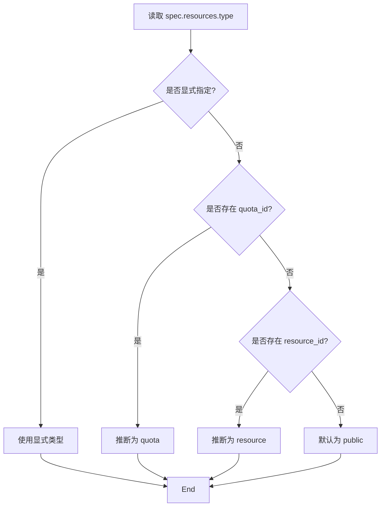
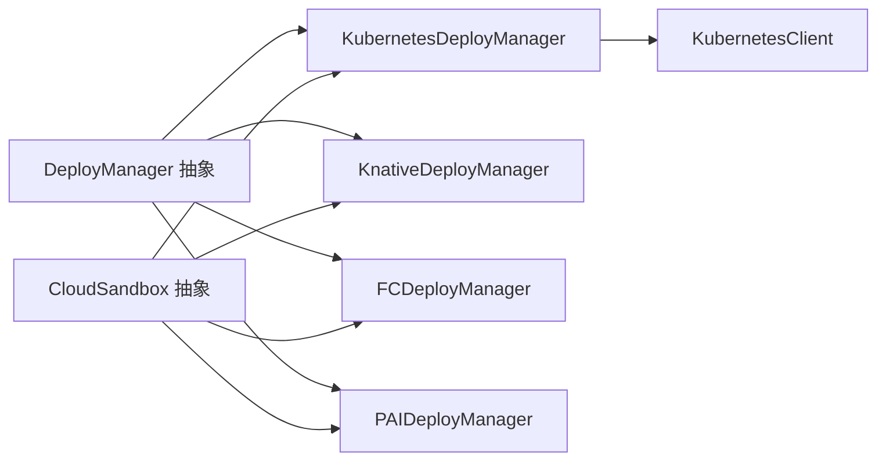

# 云沙箱

<cite>
**本文引用的文件**
- [cloud_sandbox.py](file://src/agentscope_runtime/sandbox/box/cloud/cloud_sandbox.py)
- [kubernetes_deployer.py](file://src/agentscope_runtime/engine/deployers/kubernetes_deployer.py)
- [knative_deployer.py](file://src/agentscope_runtime/engine/deployers/knative_deployer.py)
- [fc_deployer.py](file://src/agentscope_runtime/engine/deployers/fc_deployer.py)
- [pai_deployer.py](file://src/agentscope_runtime/engine/deployers/pai_deployer.py)
- [kubernetes_client.py](file://src/agentscope_runtime/common/container_clients/kubernetes_client.py)
- [k8s_deploy_config.yaml](file://examples/deployments/k8s_deploy/k8s_deploy_config.yaml)
- [deploy_config.yaml](file://examples/deployments/pai_deploy/deploy_config.yaml)
- [base.py](file://src/agentscope_runtime/engine/deployers/base.py)
- [tracing_util.py](file://src/agentscope_runtime/engine/tracing/tracing_util.py)
- [README.md](file://src/agentscope_runtime/engine/tracing/README.md)
- [test_cloud_sandbox.py](file://tests/unit/test_cloud_sandbox.py)
</cite>

## 目录
1. [简介](#简介)
2. [项目结构](#项目结构)
3. [核心组件](#核心组件)
4. [架构总览](#架构总览)
5. [详细组件分析](#详细组件分析)
6. [依赖分析](#依赖分析)
7. [性能考虑](#性能考虑)
8. [故障排查指南](#故障排查指南)
9. [结论](#结论)
10. [附录](#附录)

## 简介
本技术文档围绕“云沙箱”能力，系统阐述其在云端计算资源管理、弹性扩展、负载均衡与自动扩缩容策略、计费模型、资源监控与成本优化、多云部署与区域选择、灾难恢复、配置选项、性能调优与安全策略等方面的设计与实现要点。文档以代码为依据，结合部署器（Kubernetes/Knative/函数计算/PAI）与云沙箱基类，给出可操作的实践建议与最佳实践。

## 项目结构
云沙箱相关能力主要分布在以下模块：
- 沙箱层：云沙箱基类，统一云上会话生命周期与工具调用接口
- 部署层：多种平台部署器（Kubernetes、Knative、阿里云函数计算、PAI），负责打包、镜像构建、资源编排与服务暴露
- 客户端层：容器平台客户端（如 Kubernetes 客户端），封装底层 API 调用
- 配置示例：Kubernetes 与 PAI 的部署配置样例
- 追踪与可观测性：基于 OpenTelemetry 的追踪工具与使用说明
- 测试：云沙箱抽象类行为与上下文清理等单元测试

图表来源
- [cloud_sandbox.py:19-82](file://src/agentscope_runtime/sandbox/box/cloud/cloud_sandbox.py#L19-L82)
- [kubernetes_deployer.py:48-71](file://src/agentscope_runtime/engine/deployers/kubernetes_deployer.py#L48-L71)
- [knative_deployer.py:43-69](file://src/agentscope_runtime/engine/deployers/knative_deployer.py#L43-L69)
- [fc_deployer.py:246-274](file://src/agentscope_runtime/engine/deployers/fc_deployer.py#L246-L274)
- [pai_deployer.py:887-940](file://src/agentscope_runtime/engine/deployers/pai_deployer.py#L887-L940)
- [kubernetes_client.py:869-912](file://src/agentscope_runtime/common/container_clients/kubernetes_client.py#L869-L912)
- [k8s_deploy_config.yaml:1-53](file://examples/deployments/k8s_deploy/k8s_deploy_config.yaml#L1-L53)
- [deploy_config.yaml:1-39](file://examples/deployments/pai_deploy/deploy_config.yaml#L1-L39)
- [tracing_util.py:23-136](file://src/agentscope_runtime/engine/tracing/tracing_util.py#L23-L136)
- [README.md:1-73](file://src/agentscope_runtime/engine/tracing/README.md#L1-L73)

章节来源
- [cloud_sandbox.py:1-251](file://src/agentscope_runtime/sandbox/box/cloud/cloud_sandbox.py#L1-L251)
- [kubernetes_deployer.py:1-391](file://src/agentscope_runtime/engine/deployers/kubernetes_deployer.py#L1-L391)
- [knative_deployer.py:1-291](file://src/agentscope_runtime/engine/deployers/knative_deployer.py#L1-L291)
- [fc_deployer.py:1-800](file://src/agentscope_runtime/engine/deployers/fc_deployer.py#L1-L800)
- [pai_deployer.py:1-1277](file://src/agentscope_runtime/engine/deployers/pai_deployer.py#L1-L1277)
- [kubernetes_client.py:869-979](file://src/agentscope_runtime/common/container_clients/kubernetes_client.py#L869-L979)
- [k8s_deploy_config.yaml:1-53](file://examples/deployments/k8s_deploy/k8s_deploy_config.yaml#L1-L53)
- [deploy_config.yaml:1-39](file://examples/deployments/pai_deploy/deploy_config.yaml#L1-L39)
- [base.py:1-44](file://src/agentscope_runtime/engine/deployers/base.py#L1-L44)
- [tracing_util.py:1-136](file://src/agentscope_runtime/engine/tracing/tracing_util.py#L1-L136)
- [README.md:1-73](file://src/agentscope_runtime/engine/tracing/README.md#L1-L73)

## 核心组件
- 云沙箱基类（CloudSandbox）
  - 提供统一的云上会话生命周期管理：初始化、创建、删除、工具调用、MCP 服务器添加等
  - 通过抽象方法强制子类实现云客户端初始化、沙箱创建/删除、工具调用与提供商名称
  - 支持上下文管理器，在退出时自动清理云资源
- 部署器（DeployManager 抽象）
  - 统一部署与停止接口，生成唯一部署 ID，并维护部署状态
  - 各平台部署器负责镜像构建、资源编排、服务暴露与状态查询
- 容器平台客户端（以 KubernetesClient 为例）
  - 封装 Deployment/Service 创建、就绪检查、LB IP 获取等底层操作
- 配置示例
  - Kubernetes：命名空间、副本数、端口、镜像、环境变量、资源限制与拉取策略
  - PAI：工作区、区域、服务名、代码路径、实例类型/数量、资源类型推断与默认值

章节来源
- [cloud_sandbox.py:34-82](file://src/agentscope_runtime/sandbox/box/cloud/cloud_sandbox.py#L34-L82)
- [base.py:9-44](file://src/agentscope_runtime/engine/deployers/base.py#L9-L44)
- [kubernetes_client.py:869-979](file://src/agentscope_runtime/common/container_clients/kubernetes_client.py#L869-L979)
- [k8s_deploy_config.yaml:1-53](file://examples/deployments/k8s_deploy/k8s_deploy_config.yaml#L1-L53)
- [deploy_config.yaml:1-39](file://examples/deployments/pai_deploy/deploy_config.yaml#L1-L39)

## 架构总览
云沙箱的运行时架构由“沙箱基类 + 多平台部署器 + 平台客户端 + 配置与追踪”构成。部署器负责将用户应用打包并编排到目标平台；沙箱基类负责云上会话与工具调用；平台客户端封装具体平台 API；配置文件定义资源规格与网络参数；追踪模块提供可观测性支持。

图表来源
- [base.py:9-44](file://src/agentscope_runtime/engine/deployers/base.py#L9-L44)
- [kubernetes_deployer.py:48-71](file://src/agentscope_runtime/engine/deployers/kubernetes_deployer.py#L48-L71)
- [knative_deployer.py:43-69](file://src/agentscope_runtime/engine/deployers/knative_deployer.py#L43-L69)
- [fc_deployer.py:246-274](file://src/agentscope_runtime/engine/deployers/fc_deployer.py#L246-L274)
- [pai_deployer.py:887-940](file://src/agentscope_runtime/engine/deployers/pai_deployer.py#L887-L940)
- [kubernetes_client.py:869-912](file://src/agentscope_runtime/common/container_clients/kubernetes_client.py#L869-L912)
- [cloud_sandbox.py:19-82](file://src/agentscope_runtime/sandbox/box/cloud/cloud_sandbox.py#L19-L82)

## 详细组件分析

### 云沙箱基类（CloudSandbox）
- 设计要点
  - 无本地容器依赖，直接通过云客户端进行 API 交互
  - 统一接口：初始化（可传入现有沙箱 ID 或自动创建）、工具调用、MCP 服务器管理、信息查询、清理
  - 抽象方法强制子类实现：云客户端初始化、沙箱创建/删除、工具调用、提供商名称
  - 上下文管理器确保异常或正常退出时清理云资源
- 关键流程（创建与清理）

图表来源
- [cloud_sandbox.py:34-82](file://src/agentscope_runtime/sandbox/box/cloud/cloud_sandbox.py#L34-L82)
- [cloud_sandbox.py:222-251](file://src/agentscope_runtime/sandbox/box/cloud/cloud_sandbox.py#L222-L251)

章节来源
- [cloud_sandbox.py:19-251](file://src/agentscope_runtime/sandbox/box/cloud/cloud_sandbox.py#L19-L251)
- [test_cloud_sandbox.py:68-252](file://tests/unit/test_cloud_sandbox.py#L68-L252)

### Kubernetes 部署器（KubernetesDeployManager）
- 功能概述
  - 镜像构建（含缓存与依赖安装）、Deployment/Service 创建、端点选择（本地回退与云 LB）
  - 支持副本数、环境变量、卷挂载、运行时配置等
  - 部署状态持久化与查询
- 关键流程（部署）

图表来源
- [kubernetes_deployer.py:126-302](file://src/agentscope_runtime/engine/deployers/kubernetes_deployer.py#L126-L302)
- [kubernetes_client.py:869-979](file://src/agentscope_runtime/common/container_clients/kubernetes_client.py#L869-L979)

章节来源
- [kubernetes_deployer.py:126-391](file://src/agentscope_runtime/engine/deployers/kubernetes_deployer.py#L126-L391)
- [kubernetes_client.py:869-979](file://src/agentscope_runtime/common/container_clients/kubernetes_client.py#L869-L979)
- [k8s_deploy_config.yaml:1-53](file://examples/deployments/k8s_deploy/k8s_deploy_config.yaml#L1-L53)

### Knative 部署器（KnativeDeployManager）
- 功能概述
  - 将 Runner 打包为 Knative Service，支持注解与标签
  - 自动处理镜像构建与服务暴露
- 关键流程（部署）

图表来源
- [knative_deployer.py:71-222](file://src/agentscope_runtime/engine/deployers/knative_deployer.py#L71-L222)

章节来源
- [knative_deployer.py:71-291](file://src/agentscope_runtime/engine/deployers/knative_deployer.py#L71-L291)

### 阿里云函数计算（FCDeployManager）
- 功能概述
  - 通过 OSS 存储打包产物，创建/更新函数计算服务，配置自定义运行时、日志、VPC、会话亲和等
  - 支持会话并发限制与空闲超时
- 关键流程（部署）

图表来源
- [fc_deployer.py:416-582](file://src/agentscope_runtime/engine/deployers/fc_deployer.py#L416-L582)
- [fc_deployer.py:587-800](file://src/agentscope_runtime/engine/deployers/fc_deployer.py#L587-L800)

章节来源
- [fc_deployer.py:416-800](file://src/agentscope_runtime/engine/deployers/fc_deployer.py#L416-L800)

### PAI 部署器（PAIDeployManager）
- 功能概述
  - 支持公共资源池、资源组与配额三种资源类型，自动推断资源类型
  - 默认实例规格与 CPU/内存默认值，支持 RAM 角色模式
  - 从 YAML 配置解析工作区、区域、服务名、代码路径、资源规格与环境变量
- 关键流程（资源配置推断）

图表来源
- [pai_deployer.py:887-940](file://src/agentscope_runtime/engine/deployers/pai_deployer.py#L887-L940)
- [pai_deployer.py:182-213](file://src/agentscope_runtime/engine/deployers/pai_deployer.py#L182-L213)

章节来源
- [pai_deployer.py:887-1277](file://src/agentscope_runtime/engine/deployers/pai_deployer.py#L887-L1277)
- [deploy_config.yaml:1-39](file://examples/deployments/pai_deploy/deploy_config.yaml#L1-L39)

### 配置选项与最佳实践
- Kubernetes
  - 命名空间、副本数、端口、镜像名/标签、基础镜像、平台架构、推送镜像仓库
  - 依赖列表、额外包、环境变量、资源请求/限制、镜像拉取策略、健康检查与超时
- PAI
  - 工作区 ID、区域、服务名、代码目录与入口、资源类型（public/resource/quota）、实例类型/数量
  - 环境变量、资源默认值与 RAM 角色模式

章节来源
- [k8s_deploy_config.yaml:1-53](file://examples/deployments/k8s_deploy/k8s_deploy_config.yaml#L1-L53)
- [deploy_config.yaml:1-39](file://examples/deployments/pai_deploy/deploy_config.yaml#L1-L39)
- [pai_deployer.py:887-940](file://src/agentscope_runtime/engine/deployers/pai_deployer.py#L887-L940)

## 依赖分析
- 抽象接口与实现
  - DeployManager 抽象定义了统一的部署/停止接口，各平台部署器实现具体逻辑
  - CloudSandbox 抽象定义了云沙箱生命周期与工具调用接口，子类实现云客户端与提供商细节
- 平台客户端
  - KubernetesDeployManager 依赖 KubernetesClient 进行 Deployment/Service 管理
- 配置与状态
  - 部署器通过配置文件与环境变量组合，形成最终部署参数
  - 部署状态通过状态管理器持久化，便于查询与运维

图表来源
- [base.py:9-44](file://src/agentscope_runtime/engine/deployers/base.py#L9-L44)
- [kubernetes_deployer.py:48-71](file://src/agentscope_runtime/engine/deployers/kubernetes_deployer.py#L48-L71)
- [knative_deployer.py:43-69](file://src/agentscope_runtime/engine/deployers/knative_deployer.py#L43-L69)
- [fc_deployer.py:246-274](file://src/agentscope_runtime/engine/deployers/fc_deployer.py#L246-L274)
- [pai_deployer.py:887-940](file://src/agentscope_runtime/engine/deployers/pai_deployer.py#L887-L940)
- [cloud_sandbox.py:19-82](file://src/agentscope_runtime/sandbox/box/cloud/cloud_sandbox.py#L19-L82)

章节来源
- [base.py:1-44](file://src/agentscope_runtime/engine/deployers/base.py#L1-L44)
- [cloud_sandbox.py:1-251](file://src/agentscope_runtime/sandbox/box/cloud/cloud_sandbox.py#L1-L251)

## 性能考虑
- 弹性与扩缩容
  - Kubernetes：通过副本数与 HPA（需在集群侧启用）实现水平扩展；结合资源请求/限制避免资源争用
  - Knative：按请求自动扩缩；注意冷启动与并发限制配置
  - 函数计算：基于会话亲和与并发限制控制单实例承载量；结合日志与指标观察吞吐与延迟
  - PAI：根据资源类型选择合适实例规格与数量；公共池适合试错，资源组/配额适合稳定生产
- 负载均衡
  - Kubernetes：LoadBalancer Service 获取外部 IP；本地环境自动回退至 127.0.0.1
  - Knative：通过 KService 暴露 URL；按需配置路由与流量策略
- 资源利用
  - 明确 CPU/内存请求与限制，避免过度预留导致调度困难
  - 使用镜像缓存与构建优化减少重复构建时间
- 计费与成本优化
  - Kubernetes：合理设置副本数与资源配额，避免长期闲置节点
  - 函数计算：控制超时与内存，降低执行时长与内存占用
  - PAI：优先使用配额/资源组，避免公共池波动；按需调整实例数量
- 可观测性
  - 开启日志与指标上报，结合追踪事件定位瓶颈
  - 使用环境变量开关日志与上报，避免生产环境冗余开销

[本节为通用指导，不直接分析具体文件]

## 故障排查指南
- 云沙箱清理
  - CloudSandbox 在退出时调用清理逻辑，若删除失败会记录警告；检查云 API 权限与网络连通性
- Kubernetes 部署
  - 若 Deployment 未就绪，检查镜像拉取策略、资源配额与 Pod 日志
  - 本地 Minikube/Kind 下 LoadBalancer IP 可能不可达，使用回退主机地址
- Knative 部署
  - 确认集群已安装 Knative Serving；检查 KService 状态与事件
- 函数计算
  - 确认 OSS 上传成功、函数创建/更新参数正确；检查日志服务与 VPC 配置
- PAI 部署
  - 校验工作区 ID、区域、资源类型与默认值；确认 RAM 角色与网络配置

章节来源
- [cloud_sandbox.py:222-251](file://src/agentscope_runtime/sandbox/box/cloud/cloud_sandbox.py#L222-L251)
- [kubernetes_deployer.py:72-121](file://src/agentscope_runtime/engine/deployers/kubernetes_deployer.py#L72-L121)
- [knative_deployer.py:227-291](file://src/agentscope_runtime/engine/deployers/knative_deployer.py#L227-L291)
- [fc_deployer.py:587-800](file://src/agentscope_runtime/engine/deployers/fc_deployer.py#L587-L800)
- [pai_deployer.py:942-1277](file://src/agentscope_runtime/engine/deployers/pai_deployer.py#L942-L1277)

## 结论
云沙箱通过抽象的沙箱基类与多平台部署器，实现了对 Kubernetes、Knative、函数计算与 PAI 的统一接入。结合配置文件与可观测性工具，可在不同平台上实现一致的资源管理、弹性扩展与成本控制。建议在生产中配合 HPA/KEDA、会话亲和与资源配额策略，持续优化资源利用率与成本表现。

[本节为总结，不直接分析具体文件]

## 附录

### 追踪与可观测性
- TracingUtil 提供请求 ID 设置、跨线程传播、通用属性合并与全局属性注入
- README 展示了日志输出格式与 OpenTelemetry 报告配置方式

章节来源
- [tracing_util.py:23-136](file://src/agentscope_runtime/engine/tracing/tracing_util.py#L23-L136)
- [README.md:1-73](file://src/agentscope_runtime/engine/tracing/README.md#L1-L73)